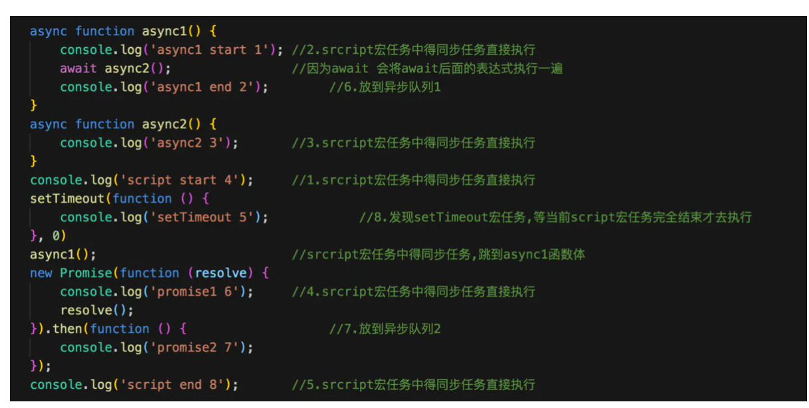

## 异步是什么?

异步：**不是同步执行的代码就是异步**。同步代码就是从上往下执行,因为JS是单线程的原因,所以在一条线上如果前面有比较耗时的操作 ,那么后面的代码就必须等待前面代码执行完才可以执行.异步执行能够很好解决这个问题,当我们在比较耗时的操作用异步代码来执行，异步代码不会堵塞同步代码的执行，而是放在异步队列里面，等待同步代码都执行完了，才执行异步代码。


解释：上面的代码先是执行同步代码A，然后执行到异步代码B的时候，把它放到异步队列里面，先不执行，接着执行同步代码C，等所有的同步代码都执行完了，才执行异步代码B。异步代码B执行完，程序结束。

#### JS为什么需要异步？

在前端领域里面需要异步执行的任务太多太多了，异步的存在是必然的，比如发送请求到服务器，如果不使用异步请求的话，将会等待服务器返回相应，才会执行下一步，那么网速太差的话，用户看见浏览器一直响应不了，肯定会随手一个关闭，再见。但是有了异步那就不一样了，响应速度快起来，灵活起来。

## 明白这点很重要
我们现在讨论的异步和同步，其实就是为了好理解一些。其实并不存在真正的“异步”，什么意思。因为我们js是单线程的语言，这是一个缺点。但是我们js有一个eventLoop（事件循环机制），和事件队列(宏和微)，就是通过事件循环来实现异步，代码的原地只是注册了函数。  

## 异步开始到现在的历程

又要讲历史了。其实历史总是有趣的。

#### **1.回调函数（callback）**

最开始的是回调函数，但是回调函数是有同步回调函数和异步回调函数之分的。

```js
同步回调函数：
var callback = function() {
    console.log('这是一个同步回调函数')
  }

function fn(cb) {
  cb();
  console.log("fn函数结束");
}

fn(callback)   // 调用fn()函数，并callback作为参数

结果： 先打印 这是一个同步回调函数--> fn函数结束
一直往下面执行的，就是同步，所以这是同步的回调函数。

异步回调函数
var callback = function() {
    console.log('这是一个异步回调函数')
  }

function fn(callback) {
  setTimeout(callback,1000)
  console.log("fn函数结束");
}

fn(callback)   // 调用fn()函数，并callback作为参数
结果：先打印fn函数结束-->这是一个异步回调函数。
为什么结果相反了，因为setTimeout是一个异步执行的定时器，里面的回调函数就是异步的回调函数，所以后面的同步代码先执行，异步代码等待同步代码执行完才执行。
```

#### **2.事件监听**

采用事件驱动模式。 

任务的执行不取决代码的顺序，而取决于某一个事件是否发生 。也就是说事件的执行是触发的，只要触发了，就会执行。只要绑定事件的方法都是异步的 **on** 、**addEventListener** （绑定多个同名事件，而不被覆盖）

```
element.onclick=function(){
   //处理函数
}

因为onclick这个方法是监听着element的变化（就是监听点击事件），当element被点击之后马上触发回调函数。
```

#### 3.发布者/订阅者模式

发布订阅模式，通过定义一个发布者对象，并建立订阅者对发布者的依赖，实现发布者向订阅者传递数据并执行订阅者指定的回调： 


```js
        var publisher = {
            callbacks: {}, // 订阅记录存放对象
            subscribe: function (name, callback) { // 订阅
            //判断是否已经存在订阅的对象，如果存在push进数组，不存在，新建订阅属性并把callback放在数组里面，赋值给订阅属性。
                this.callbacks[name] ? this.callbacks[name].push(callback) : this.callbacks[name] = [callback]
            },
            publish: function (name, data) { // 发布
                if (this.callbacks[name]) {
                    for (i in this.callbacks[name]) { // 遍历执行该订阅者全部回调函数
                        this.callbacks[name][i](data)
                    }
                }
            }
        }

        publisher.subscribe('Atoe', function (msg) {
            console.log('我是订阅者' + msg)
        });


        publisher.publish('Atoe', 'Hello Atoe，我是发布者')
        //我是订阅者Hello Atoe，我是发布者
```

### 4.promise

promise的一个最重要作用可以解决回调地狱.只要是异步的都在then函数调用.因为返回promise对象,所以支持链式编程.

promise相当于是一个容器,装着未来才会结束的事件(异步事件)

有２个特点：

第一个：**状态不受外界影响**，有３中状态**pending(等待)** , **fulfilled(成功)** , **rejected(失败)**,状态只受异步操作的影响 .

第二个：**一旦改变，无法修改**．pending—>fulfilled    pending—>rejected.

差不多了,不往深究.重点在下面.👇👇👇  

```js
var Atoe = new Promise(function (resolve,reject){
        //在这里进行异步处理。我们在业务上就会封装ajax或者axios
        setTimeout(function () {
            var result = 10 * 5;
            if (result === 50) {
                resolve(50);
            }
            //reject(new Error('Bad Math'));
        }, 1000);
        });

        Atoe.then(function (res) {
            console.log('这是成功后的返回值', res);
        });
        Atoe.catch(function () {
            console.error('这是失败后的返回值');
        });

结果:会1s后打印结果. then就是我们异步后返回的结果函数．pending—>fulfilled
当我们把if注释了,reject(...)放出来.就可以跑Atoe.catch. pending—>rejected.
```

#### 5.Generator

JS中的协程应该只在generator中才听过.在其他编程语言还是早就有了.当时Brendan Eich考虑到多线程数据共享太复杂,所以JS一直是单线程. **特点就是把函数的执行权交给yield 后面的语句**,然后执行完回来.继续执行.

```
function *GeneratorAtoe(){
	var URL = "xxx" 
	var y = yield ajax(URL);
	return y
}
var Atoe = GeneratorAtoe(); //得到一个迭代器.itable.我们需要通过next来获取生成器的内容
Atoe.next() //{ value:res(异步请求的返回对象),done:false} 
value字段代表的是当前指针(next)的返回值 done为false说明迭代器后面还有未迭代的内容.true迭代完成.
Atoe.next() //再执行一次  { value:undefined,done:true}
因为当前已经没有了yield了,所以就没有值.返回undefined 迭代完成返回true

yield与return的区别： 
1. yield仅代表本次迭代完成，并且还必有下一次迭代； 这就是为什么yield 返回的done:false
2. return则代表生成器函数完成；
```

#### 6.async/await(重点)

现在估计大多公司都是用这个**ES8**才有的语法,**太好用了**.集聚了前面的所描述的异步方式的优点.

**async/await是什么**:**async/await是promise+Generator语法糖**,语法糖就是一种语法难用的要死,然后有另外一种语法包裹了一层糖,然后用起来特别舒服,es6的语法大部分都是es5的语法糖.扯远了

**async 相当于 * 号 await 相当于 yield**,**更强大得是它返回来的是promise对象**,意味着我们可以用then(),不在需要用next(),多舒服呀.

**怎么用?** 

```
以下情形可能用的最多的
async atoeFn(){
	console.log("我是同步")
	let res = await this.axios.post("url",params);
	console.log("我是异步")
}
async 告诉编辑器我里面的代码有些可能异步的,异步可能堵塞一下.编辑器说知道了,你用await告诉我.
await 后面的代码才是真正的异步代码.会把这个异步操作放到异步队列里面,很多人以为await会一直等待之后的表达式执行完之后才会继续执行后面的代码，实际上await是一个让出线程的标志。await后面的表达式会先执行一遍，将await后面的代码加入到microtask中，然后就会跳出整个async函数来执行后面的代码。
需要注意的是await之前的,async里面的 console.log("我是同步")只要atoeFn被执行了,他就会执行,因为他是同步代码，然而后面的console.log("我是异步")是异步代码后面执行。因为放在await后面
```

### 异步事件队列（ES6事件队列）与事件循环

**首先我们知道当我们把异步操作的相关方法(函数),放在异步队列里面,会分为宏任务和微任务**

以下我怕我说不清楚,引用了一位网友的例子.

**微任务与宏任务的区别**

这个就像去银行办业务一样，先要取号进行排号。
一般上边都会印着类似：“您的号码为XX，前边还有XX人。”之类的字样。

因为柜员同时职能处理一个来办理业务的客户，这时每一个来办理业务的人就可以认为是银行柜员的一个宏任务来存在的，当柜员处理完当前客户的问题以后，选择接待下一位，广播报号，也就是下一个宏任务的开始。
所以多个宏任务合在一起就可以认为说有一个任务队列在这，里边是当前银行中所有排号的客户。
**任务队列中的都是已经完成的异步操作，而不是说注册一个异步任务就会被放在这个任务队列中，就像在银行中排号，如果叫到你的时候你不在，那么你当前的号牌就作废了，柜员会选择直接跳过进行下一个客户的业务处理，等你回来以后还需要重新取号**

而且一个宏任务在执行的过程中，是可以添加一些微任务的，就像在柜台办理业务，你前边的一位老大爷可能在存款，在存款这个业务办理完以后，柜员会问老大爷还有没有其他需要办理的业务，这时老大爷想了一下：“最近P2P爆雷有点儿多，是不是要选择稳一些的理财呢”，然后告诉柜员说，要办一些理财的业务，这时候柜员肯定不能告诉老大爷说：“您再上后边取个号去，重新排队”。
所以本来快轮到你来办理业务，会因为老大爷临时添加的“**理财业务**”而往后推。
也许老大爷在办完理财以后还想 **再办一个信用卡**？或者 **再买点儿纪念币**？
无论是什么需求，只要是柜员能够帮她办理的，都会在处理你的业务之前来做这些事情，这些都可以认为是微任务。

这就说明：~~你大爷永远是你大爷~~
**在当前的微任务没有执行完成时，是不会执行下一个宏任务的。**

补充一下:

宏任务:文件I/O , setTimeout, setInterval, 当前script， 渲染事件(比如解析DOM，计算布局，绘制)，网络请求完成

微任务:Promise.then catch finally，MutationObserver ，Object.observe

<font face="微软雅黑" size=5 color=#FF0000 >以下是一道面试题,来看加深一下印象</font>

```js
来源:（头条）异步笔试题
async function async1() {
    console.log('async1 start');
    await async2(); promise微任务
    console.log('async1 end');
}
async function async2() {
    console.log('async2');
}
console.log('script start');
setTimeout(function() {
    console.log('setTimeout');
}, 0)
async1();
new Promise(function(resolve) {
    console.log('promise1');
    resolve();
}).then(function() {
    console.log('promise2');
});
console.log('script end');

答案: 在下面
我也贴出大佬的解释:https://github.com/Advanced-Frontend/Daily-Interview-Question/issues/7
```

​     <font face="微软雅黑" size=3 color=#FF0000 >首先我们明白,一旦执行栈中的所有同步任务执行完毕（此时JS引擎空闲），系统就会读取任务队列，将可运行的异步任务添加到可执行栈中，那么回到题目中来,一开始运行js代码的时候就是一个宏任务,然后一行一行往下面执行,遇到其他异步的宏任务放到宏任务队列里面,然后等当前宏任务完全结束才运行,注意是完全结束,然后遇到微任务会把任务放到微任务队列里面,当同步代码运行完马上运行微任务队列里面的任务.接着开始下一个宏任务，每一次循环称为一次 tick,如此循环下去，这是eventLoop.</font>


说明:这里面注释后的序号就是具体答案


**再贴一张图**eventLoop


(完)

