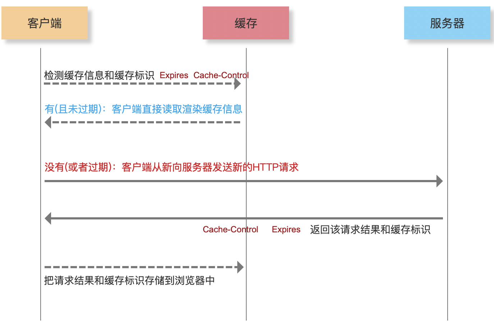

# 从输入URL到渲染页面

本文全文吹牛逼。

 **CRP（Critical Rendering  Path）关键渲染路径**


#### 客户端

**第一步：URL解析**

- 地址解析

  

协议：http 默认端口21，  https = tsl 默认端口 80 ，ftp 默认端口443 

​		

- 编码 

  对整个url进行处理的： 编码:encodeURI(url)、解码decodeURI(编码后url)

  对参数进行处理：encodeURIComponent(params)  decodeURIComponent(编码后的params)

  

  

  ​	

**第二步：缓存检查**

**强缓存 Expires / Cache-Control**

```
Memory Cache、Disk Cache 都属于强缓存
浏览器对于强缓存的处理：根据第一次请求资源时返回的响应头来确定的
Expires：缓存过期时间，用来指定资源到期的时间（HTTP/1.0）
Cache-Control：cache-control: max-age=2592000第一次拿到资源后的2592000秒内（30天），再次发送请求，读取缓存中的信息（HTTP/1.1）
两者同时存在的话，Cache-Control优先级高于Expires
```


> 缓存位置：
>
> - Memory Cache : 内存缓存
>
> - Disk Cache：硬盘缓存
>
>   
>
> 打开网页：查找 disk cache 中是否有匹配，如有则使用，如没有则发送网络请求
> 普通刷新 (F5)：因TAB没关闭，因此memory cache是可用的，会被优先使用，其次才是disk cache
> 强制刷新 (Ctrl + F5)：浏览器不使用缓存，因此发送的请求头部均带有 Cache-control: no-cache，服务器直接返回 200 和最新内容


```
三级缓存原理
	1、先查找内存，如果内存中存在，从内存中加载；
	2、如果内存中未查找到，选择硬盘获取，如果硬盘中有，从硬盘中加载；
	3、如果硬盘中未查找到，那就进行网络请求；
	4、加载到的资源缓存到硬盘和内存；
	
200 form memory cache
不访问服务器，一般已经加载过该资源且缓存在了内存当中，直接从内存中读取缓存。浏览器关闭后，数据将不存在（资源被释放掉了），再次打开相同的页面时，不会出现from memory cache，一般脚本、字体、图片会存在内存当中。

200 from disk cache
不访问服务器，已经在之前的某个时间加载过该资源，直接从硬盘中读取缓存，关闭浏览器后，数据依然存在，此资源不会随着该页面的关闭而释放掉下次打开仍然会是from disk cache，一般非脚本会存在内存当中，如css等。

304 Not Modified
访问服务器，发现数据没有更新，服务器返回此状态码。然后从缓存中读取数据。

200	资源大小数值	从服务器下载最新资源

参考：https://www.jianshu.com/p/8332da83955d
```



**协商缓存 Last-Modified / ETag**

```
协商缓存就是强制缓存失效后，浏览器携带缓存标识向服务器发起请求，由服务器根据缓存标识决定是否使用缓存的过程

Last-Modified 表示本文件最后修改日期「可在服务器修改和本地修改，如打开操作即可」，浏览器会在request header加上If-Modified-Since（上次返回的Last-Modified的值），询问服务器在该日期后资源是否有更新，有更新的话就会将新的资源发送回来
```


**第三步：DNS解析**

- 递归查询
- 迭代查询

