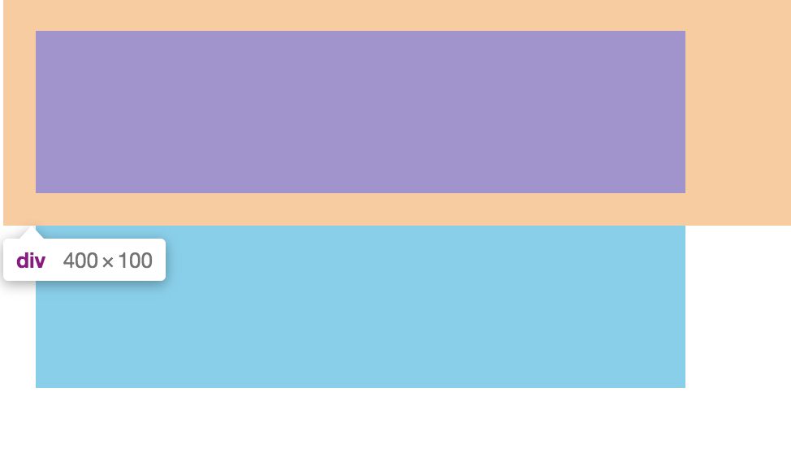
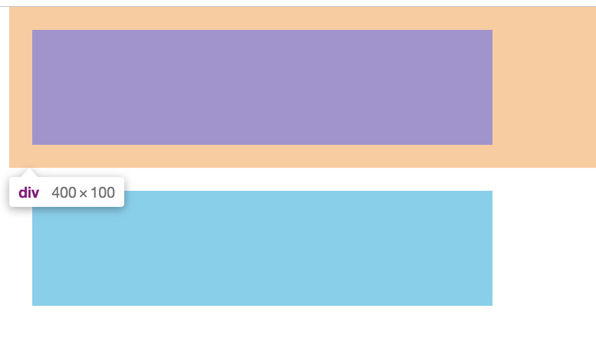
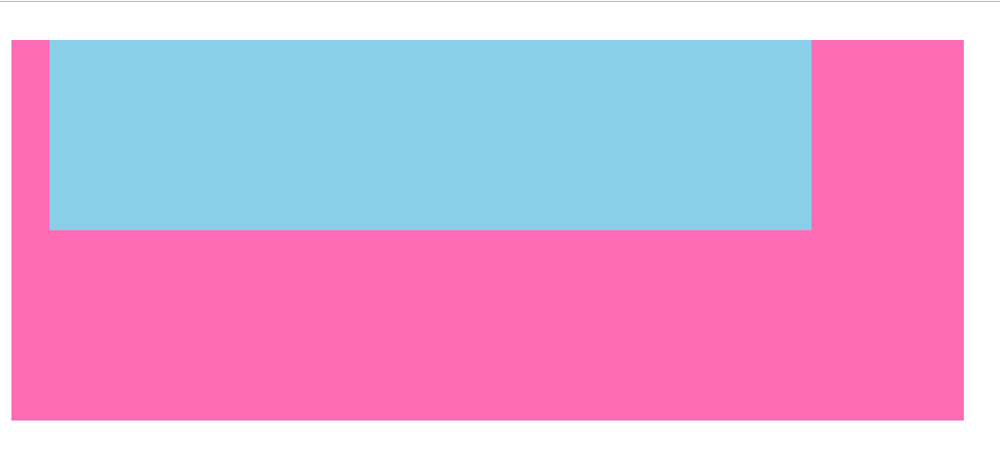
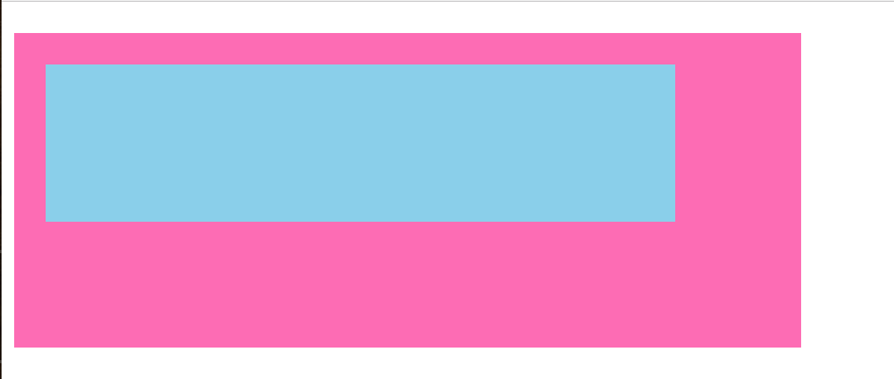
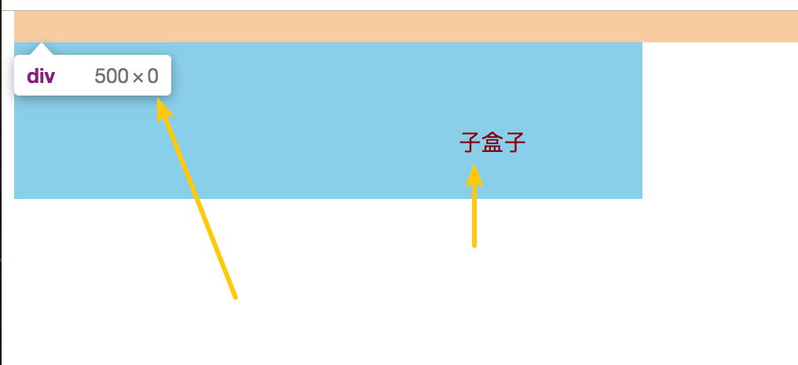
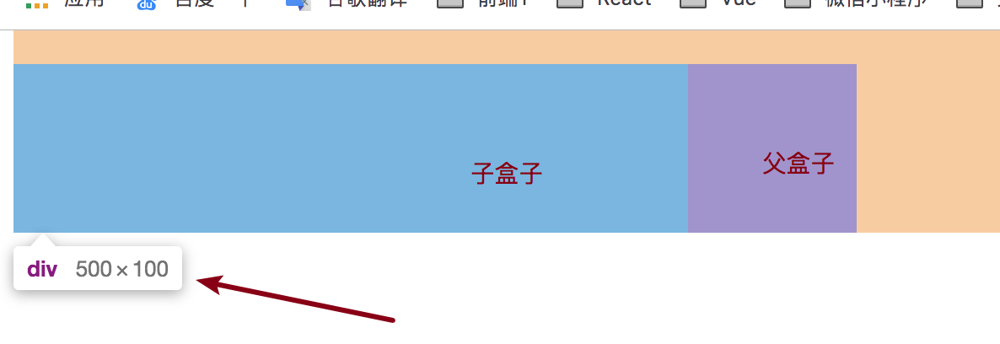

# BFC（Block Formatting context）

## BFC是什么

> 块级格式化上下文，在CSS2.1 中定义。

它是页面中的一块渲染区域，并且有一套渲染规则. 它决定了其子元素将如何定位，以及和其他元素的关系和相互作用。

 块级元素 的渲染显示规则。通俗一点讲，可以把 BFC 理解为一个封闭的大箱子，容器里面的子元素不会影响到外面的元素，容器外面的元素不会影响到容器里面的元素。


## **BFC 有什么用**

- 修复浮动元素造成的高度塌陷问题。
- 避免非期望的外边距折叠。
- 实现灵活健壮的自适应布局。

## 怎么触发BFC

满足下面任意一条即可触发BFC规则


- <html>  根元素。
- float 的值不为 none。
- position 的值不为 relative 或 static。
- overflow 的值不为 visible 或 clip。
- display 的值为 table-cell，table-caption，或 inline-block 中的任意一个。
- display 的值为 flow-root，或 display 值为 flow-root list-item。
- display flex items，即 display 的值为 flex 或 inline-flex 的元素的直接子元素（该子元素 display 不为 flex，grid，或 table）。
- grid items，即 display 的值为 grid 或 inline-grid 的元素的直接子元素（该子元素 display 不为 flex，grid，或 table）。
- contain 的值为 layout，content，paint，或 strict 中的任意一个。
- column-span 设置为 all 的元素。

**提示**：`display: flow-root`，`contain: layout` 等是无副作用的，可在不影响已有布局的情况下触发 BFC。

[参考](https://developer.mozilla.org/zh-CN/docs/Web/CSS/CSS_Flow_Layout/Intro_to_formatting_contexts)

## BFC的规则

 **1. 内部的盒子会在垂直方向，一个个地放置**

```
这一点理解挺容易的，块级元素默认就是占据一行的，就是不触发BFC规则也是占据一行。
```

 **2 BFC是页面上的一个隔离的独立容器**

```
当触发了BFC规则的时候，这个盒子将不会受外面影响，就是盒子外面继承属性，将不会影响到当前容器。
```

 **3 属于同一个BFC的 两个相邻Box的 上下margin会发生重叠 **





```html
出现问题，这里2个div都是用了 margin 20px； 但是呈现出来的效果只有20px；应该出现40px才是符合要求的
<div>
 <div style=" height: 100px; width: 400px; background-color: hotpink; margin:20px;"></div>
 <div style="height: 100px; width: 400px; background-color: skyblue; margin:20px;"></div>  
</div>
解决问题，使出现重叠的盒子不在同一个BFC的容器中，那么就是要触发BFC规则就ok。
<div>
 <div style=" height: 100px; width: 400px; background-color: hotpink; margin:20px;"></div>
   <div style="overflow: hidden;">
    <div style="height: 100px; width: 400px; background-color: skyblue; margin:20px;"></div>
   </div>    
</div>
评价，这种办法解决起来在实际开发不怎么用，通常解决margin-bottom：40px;当然肯定存在其他地方用的到这个规则的，比如封装组件。
```

**4.属于同一个BFC的 两个父子Box margin会发生塌陷**






```html
问题
<div style="margin-top: 20px; height: 200px; width:500px;background-color: hotpink">
   <div style="height: 100px; width: 400px; background-color: skyblue; margin:20px;"></div>
</div>

解决问题,通过给父盒子 overflow: hidden;触发BFC规则，就可以不受外面影响。
  <div style="overflow: hidden; margin-top: 20px; height: 200px; width:500px;background-color: hotpink">
    <div style="height: 100px; width: 400px; background-color: skyblue; margin:20px;"></div>
 </div>
```

**5 计算BFC的高度时，浮动元素也参与计算** 





```html
那么当我们的盒子内容都是浮动的时候，然后父盒子没有设置高度，高度没有那就会影响整体的布局。当我们触发BFC规则的时候同样可以解决这样的问题。

问题
 <div style="margin-top: 20px;width:500px;background-color: hotpink">
    <div style="float: left; height: 100px; width: 400px; background-color: skyblue;"></div>
 </div>
 
 解决问题
 <div style="overflow: hidden; margin-top: 20px;width:500px;background-color: hotpink">
   <div style="float: left; height: 100px; width: 400px; background-color: skyblue;"></div>
 </div>
```

**6 每个元素的左边，与包含的盒子的左边相接触，即使存在浮动也是如此**

```
这个其实也和标准流差不多。一个独立的容器包裹着。
```

**7 BFC的区域不会与float重叠**

```
标准流也是这样的。
```


# IFC（Inline Formatting Context）

> 内联格式上下文，存在于其他格式上下文中
>

多数情况下都是用来模式装换

- 盒子的宽度/高度是由内容决定

- 盒子会从包含块的顶部开始，一个接一个地水平摆放。
- 这些盒子在水平方向的 内外边距+边框 所占用的空间都会被考虑； 在垂直方向上，这些盒子可能会以不同形式来对齐： 水平的margin、padding，垂直无效。不能指定宽高，也就是不完全适用于盒模型;


# FFC（flex formatting context）

> 弹性格式化上下文，在 CSS3 中定义。

flex Formatting Contexts，display值为 flex 或者 inline-flex 的元素将会生成自适应容器，多用于移动端。

Flex Box 由伸缩容器和伸缩项目组成。通过设置元素的 display 属性为 flex 或 inline-flex 可以得到一个伸缩容器。设置为 flex 的容器被渲染成为一个块级元素，而设置为 inline-flex 的容器则渲染为一个行内元素

伸缩容器中的每一个子元素的是一个伸缩项目。伸缩项目可以是任意数量的。伸缩容器外和伸缩项目内的一切元素都不受影响。简单地说，Flexbox 定义了伸缩容器内伸缩项目该如何布局


# GFC（grid formatting context）

> 网格格式化上下文，在 CSS3 中定义。

GridLayout Formatting Contexts，当为一个元素设置dispaly值为 grid 的时候，此元素将会获得一个独立的渲染区域，我们可以通过在网格容器上定义网格、定义行和定义列属性在网格项目上定义位置和空间

那么GFC有什么用呢，和 table 又有什么区别呢？同样是一个二维的表格，但GridLayout会有更加丰富的属性来控制行列，控制对齐以及更为精细的渲染语义和控制


