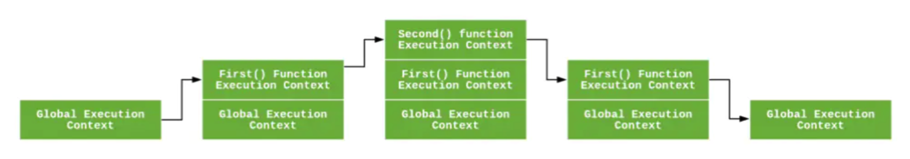
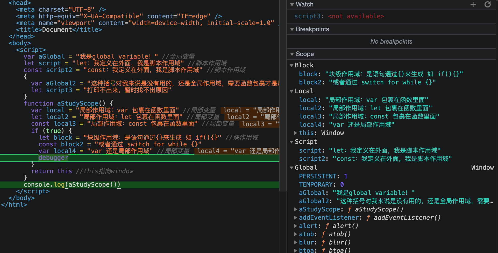

# 执行上下文

## 什么是执行上下文？

```js
简而言之，执行上下文是评估和执行 JavaScript 代码的环境的抽象概念。每当 Javascript 代码在运行的时候，它都是在执行上下文中运行。


JavaScript 中有三种执行上下文类型。

全局执行上下文 — 这是默认或者说基础的上下文，任何不在函数内部的代码都在全局上下文中。它会执行两件事：创建一个全局的 window 对象（浏览器的情况下），并且设置 this 的值等于这个全局对象。一个程序中只会有一个全局执行上下文。
函数执行上下文 — 每当一个函数被调用时, 都会为该函数创建一个新的上下文。每个函数都有它自己的执行上下文，不过是在函数被调用时创建的。函数上下文可以有任意多个。每当一个新的执行上下文被创建，它会按定义的顺序（将在后文讨论）执行一系列步骤,初始化时，带有arguments属性。
Eval 调用上下文(calling context),例如，eval函数调用的时候产生的上下文。eval(变量或函数声明)活动会影响调用上下文(calling context)。


```

## Eval执行上下文

```js
由于Eval比较特殊，单独拿出来理解。

eval('var x = 10');
 
(function foo() {
  eval('var y = 20');
})();
 
alert(x); // 10
alert(y); // "y" 提示没有声明
ECStack的变化过程：

ECStack = [
  globalContext
];
 
// eval('var x = 10');
ECStack.push(
	{ evalContext,
	  callingContext: globalContext
	}
);
 
// eval exited context
ECStack.pop();
 
// foo funciton call
ECStack.push(<foo> functionContext);
 
// eval('var y = 20');
ECStack.push(
  evalContext,
  callingContext: <foo> functionContext
);
 
// return from eval
ECStack.pop();
 
// return from foo
ECStack.pop();

意思是 Eval函数除了有自己的执行上下文「evalContext」，还会有它所处在外面的环境的执行上下文，比如这里是「globalContext、functionContext 都是有可能」
```


## 执行栈

```js
执行栈，也就是在其它编程语言中所说的“调用栈”，是一种拥有 LIFO（ last-in-first-out 后进先出）数据结构的栈，被用来存储代码运行时创建的所有执行上下文。
当 JavaScript 引擎第一次遇到你的脚本时，它会创建一个全局的执行上下文并且压入当前执行栈。每当引擎遇到一个函数调用，它会为该函数创建一个新的执行上下文并压入栈的顶部。
引擎会执行那些执行上下文位于栈顶的函数。当该函数执行结束时，执行上下文从栈中弹出，控制流程到达当前栈中的下一个上下文。

let a = 'Hello World!';

function first() {
  console.log('Inside first function');
  second();
  console.log('Again inside first function');
}

function second() {
  console.log('Inside second function');
}

first();
console.log('Inside Global Execution Context');


上述代码的执行上下文栈。后进先出
当上述代码在浏览器加载时，JavaScript 引擎创建了一个全局执行上下文并把它压入当前执行栈。当遇到 first() 函数调用时，JavaScript 引擎为该函数创建一个新的执行上下文并把它压入当前执行栈的顶部。
当从 first() 函数内部调用 second() 函数时，JavaScript 引擎为 second() 函数创建了一个新的执行上下文并把它压入当前执行栈的顶部。当 second() 函数执行完毕，它的执行上下文会从当前栈弹出，并且控制流程到达下一个执行上下文，即 first() 函数的执行上下文。
当 first() 执行完毕，它的执行上下文从栈弹出，控制流程到达全局执行上下文。一旦所有代码执行完毕，JavaScript 引擎从当前栈中移除全局执行上下文。
```




## 怎么创建执行上下文？

创建执行上下文有两个阶段：**1) 创建阶段** 和 **2) 执行阶段**。

### 1.创建阶段

```js
在 JavaScript 代码执行前，执行上下文将经历创建阶段。在创建阶段会发生三件事：

1.this值的决定，即我们所熟知的 This 绑定。
2.创建词法环境组件。
3.创建变量环境组件。

1.
ExecutionContext = {
  ThisBinding = <this value>,
  LexicalEnvironment = { ... },
  VariableEnvironment = { ... },
}
this 可以参考 https://gitee.com/juice-ice/technical-article/blob/master/JavaScript%E5%9F%BA%E7%A1%80/%E9%AB%98%E7%BA%A7/this:call:apply:bind.md

2.词法环境
词法环境是一种规范类型，基于 ECMAScript 代码的词法嵌套结构来定义具体变量和函数的关联。一个词法环境由环境记录器和一个可能的引用外部词法环境的空值组成。

环境记录器：是存储变量和函数声明的实际位置。
外部环境的引用：意味着它可以访问其父级词法环境（作用域，顶层为null）。

词法环境有两种类型：
	1.全局环境（在全局执行上下文中）是没有外部环境引用的词法环境。全局环境的外部环境引用是--null。（关联全局对象，比如浏览器 window 对象）还有任何用户定义的全局变量，并且 `this`的值指向全局对象。
	2.在函数环境中，函数内部用户定义的变量存储在环境记录器中。并且引用的外部环境可能是全局环境，或者任何包含此内部函数的外部函数。

环境记录器也有两种类型：
	1. 声明式环境记录器:存储变量、函数和参数。
	2. 对象环境记录器:用来定义出现在全局上下文中的变量和函数的关系。

抽象地讲，词法环境在伪代码中看起来像这样：

GlobalExectionContext = {
  LexicalEnvironment: {
    EnvironmentRecord: {
      Type: "Object",
      // 在这里绑定标识符
    }
    outer: <null>
  }
}

FunctionExectionContext = {
  LexicalEnvironment: {
    EnvironmentRecord: {
      Type: "Declarative",
      // 在这里绑定标识符
    }
    outer: <Global or outer function environment reference>
  }
}


3.变量环境：
它同样是一个词法环境，其环境记录器持有变量声明语句在执行上下文中创建的绑定关系。
如上所述，变量环境也是一个词法环境，所以它有着上面定义的词法环境的所有属性,为了兼容var的写法，于是使用变量环境来存储var声明的变量。
在 ES6 中
	词法环境组件：用来存储函数声明和变量（`let` 和 `const`）绑定，
	变量环境：用来存储 `var` 变量绑定。

我们看点样例代码来理解上面的概念：

let a = 20;
const b = 30;
var c;

function multiply(e, f) {
 var g = 20;
 return e * f * g;
}

c = multiply(20, 30);

执行上下文看起来像这样：

GlobalExectionContext = {
  ThisBinding: <Global Object>,
  // 词法环境
  LexicalEnvironment: {
    EnvironmentRecord: {
      Type: "Object",
      // 在这里绑定标识符
      a: < uninitialized >,
      b: < uninitialized >,
      multiply: < func >
    }
    outer: <null>
  },

  // 变量环境
  VariableEnvironment: {
    EnvironmentRecord: {
      Type: "Object",
      // 在这里绑定标识符
      c: undefined,
    }
    outer: <null>
  }
}

FunctionExectionContext = {
  ThisBinding: <Global Object>,
  LexicalEnvironment: {
    EnvironmentRecord: {
      Type: "Declarative",
      // 在这里绑定标识符
      Arguments: {0: 20, 1: 30, length: 2},
    },
    outer: <GlobalLexicalEnvironment>
  },

	VariableEnvironment: {
    EnvironmentRecord: {
      Type: "Declarative",
      // 在这里绑定标识符
      g: undefined
    },
    outer: <GlobalLexicalEnvironment>
  }
}
    
注意：只有遇到调用函数 `multiply` 时，函数执行上下文才会被创建。
可能你已经注意到 `let` 和 `const` 定义的变量并没有关联任何值，但 `var` 定义的变量被设成了 `undefined`。
这是因为在创建阶段时，引擎检查代码找出变量和函数声明，EnvironmentRecord将变量最初设置为 `undefined`（`var` 情况下），或者 LexicalEnvironment 下`let` 和 `const` 设置为 `uninitialized`。
这就是为什么你可以在声明之前访问 `var` 定义的变量（虽然是 `undefined`），但是在声明之前访问 `let` 和 `const` 的变量会得到一个引用错误 `Uncaught ReferenceError: Cannot access 'xx' before initialization`。

这就是我们说的变量声明提升与暂时性死区。
```


### 2.执行阶段

```js
在此阶段，完成对所有这些变量的分配，最后执行代码。

注意：在执行阶段，如果 JavaScript 引擎不能在源码中声明的实际位置找到 `let` 变量的值，它会被赋值为 `undefined`，const 必须需要声明变量。
```

### 3.**回收阶段**

```
执行上下文出栈
```


# 作用域

> 作用域规定了如何查找变量，也就是确定当前执行代码对变量的访问权限。
> JavaScript 采用词法作用域(lexical scoping)，也就是静态作用域。
>
> 根据创建上下文的规则，作用域在词法环境中可以确定下来，到底是声明变量/对象还是引入外部变量/对象。都可以在这个阶段处理，然后符合作用域链的规则。
>
> ```js
> var a = 1
> function out(){
>     var a = 2
>     inner()
> }
> function inner(){
>     console.log(a)
> }
> out()  //====>  1
> ```


## 作用域链

当查找变量的时候，会先从当前上下文的变量对象中查找，如果没有找到，就会从父级(词法层面上的父级)执行上下文的变量对象中查找，一直找到全局上下文的变量对象，也就是全局对象。这样由多个执行上下文的变量对象构成的链表就叫做作用域链


## global、script 、block、local

```js
global：全局作用域 写在最外层this是window或者undefined并且所有函数外面 var 最外层函数。
script：目前只有let const 在所有函数外面声明的变量，一般是在最外层。
block：let const 需要写在 if for while switch 使用这些语句包裹着
local：只要写在函数里面的一切变量都是局部变量


// 测试代码
var aGlobal = "我是global variable！" //全局变量
let script = "let：我定义在外面，我是脚本作用域" //脚本作用域
const script2 = "const：我定义在外面，我是脚本作用域" //脚本作用域
{
  var global2 = "这种括号对我来说是没有用的，还是全局作用域，需要函数包裹才是局部作用域" //全局变量
  let script3 = "打印不出来，暂时找不出原因"
}
function aStudyScope() { // 函数也是全局变量
  var local = "局部作用域：var 包裹在函数里面" //局部变量
  let local2 = "局部作用域：let 包裹在函数里面" //局部变量
  const local3 = "局部作用域：const 包裹在函数里面" //局部变量
  if (true) {
    let block = "块级作用域：是语句通过{}来生成 如 if(){}" //块作用域
    const block2 = "或者通过 switch for while {}"
    var local4 = "var 还是局部作用域" //局部变量
    debugger
  }
  return this //this指向window
}
console.log(aStudyScope())
```




### 查漏补缺

```js
1.var a = {
  n: 1,
}
var b = a
a.x = a = {
  n: 2,
}
// 由于属性访问优先级仅次于()运算，所以 a.x = 先赋值一个对象地址（栈） 堆：对应的是 {a:2} , 
// 第二步，a = 又赋值了一个对象地址，把之前的地址替换了，所以a 对应的堆存储对象为 {a:2}。那么a.x 就没有了
console.log(a.x) // undefined
console.log(a) // {a:2}

//  我们暂且想象在对象的地址为 {a:1}===> 0x001   {a:2} ===> 0x002
//  a.x 执行的时候，为增加属性 x = {a:2} ===> 0x002  
//  b 访问的地址一直没有变化，所以 b = {n:1,x:{n:2} }
console.log(b) // 又由于b

2.
 var a = 0,
      b = 0
    function A(a) {
      A = function (b) {
        console.log(a + b++)
      }
      console.log(a++)
    }
    A(1)
    // 打印1 但是a已经变成了2 ,
    //  并且A函数的外层直接被替换
    //  function (b) {
    // console.log(a + b++)
    // }
    A(2) // 直接执行 上面的函数  2 + 2  = 4 ， b执行完后变成了 3

考点：作用域， a++ 和 ++a 区别 函数替换


3.
var b = 10
    ;(function b() {
      // 'use strict'
      b = 20
      a = 10
      console.log(b, a)
    })()
 console.log( b,a) // 10,10
    // 解析： b在最外层作用域， 自执行函数是一块作用域b，b下面有一个变量声明 b=20。
    // 因为函数b已经被声明了，变量无法替换，只有函数可以替换，这里a=10 是可以被声明的。
    // 因为 在js 中如果赋值在当前找不到作用域，在外面作用域也找不到就会在外层var a = 10
    // 所以这里打印的是 函数b，10
```


引自

 https://juejin.cn/post/6844903682283143181

https://segmentfault.com/q/1010000014875705/a-1020000014880460

