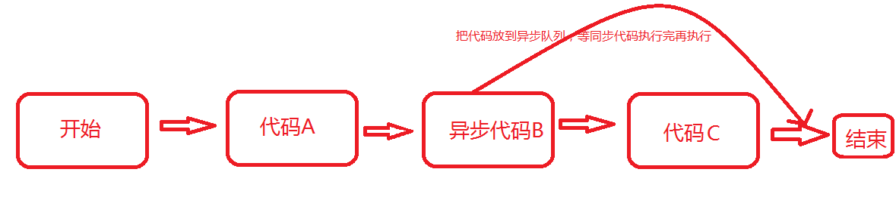
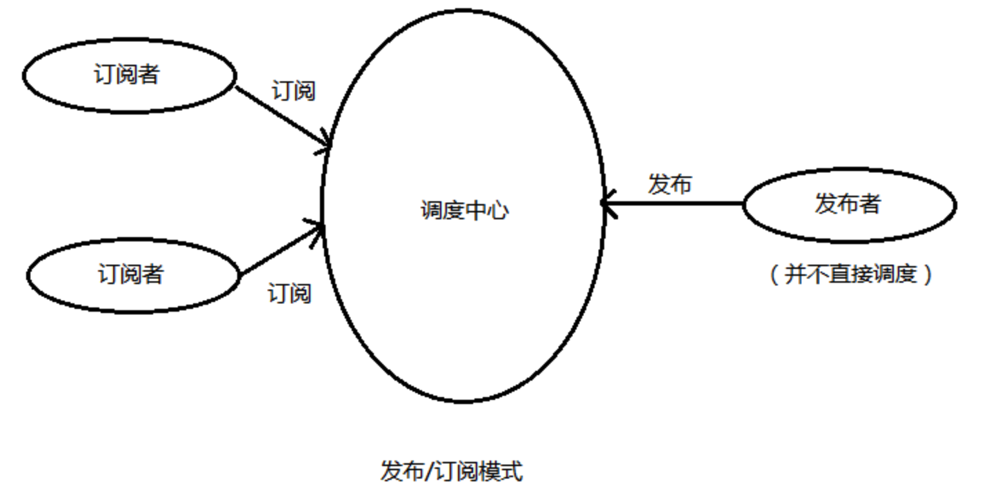
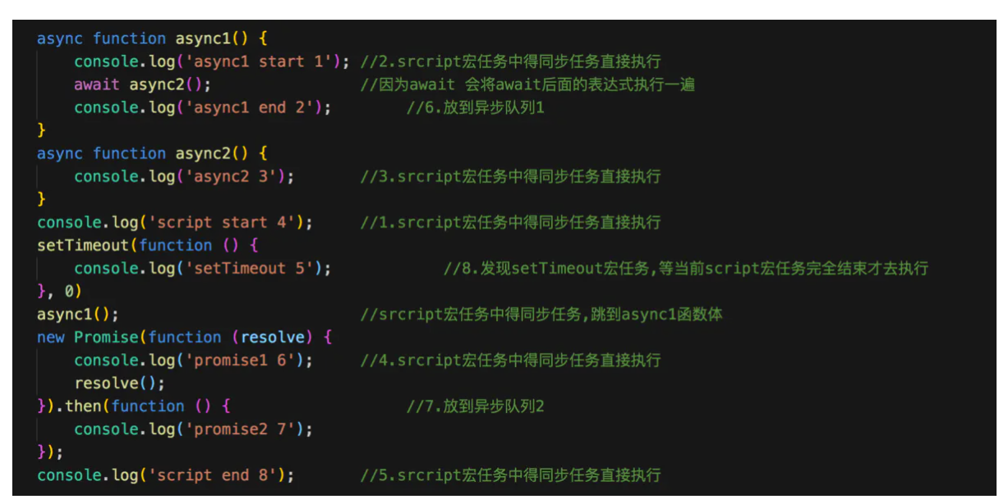
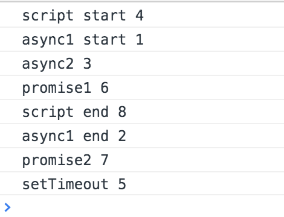
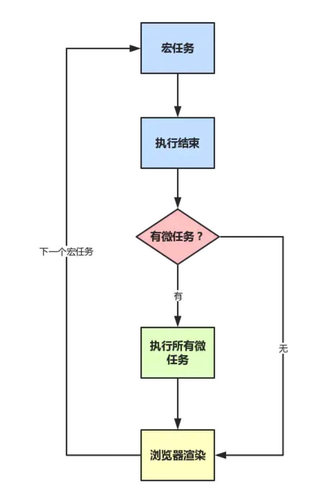
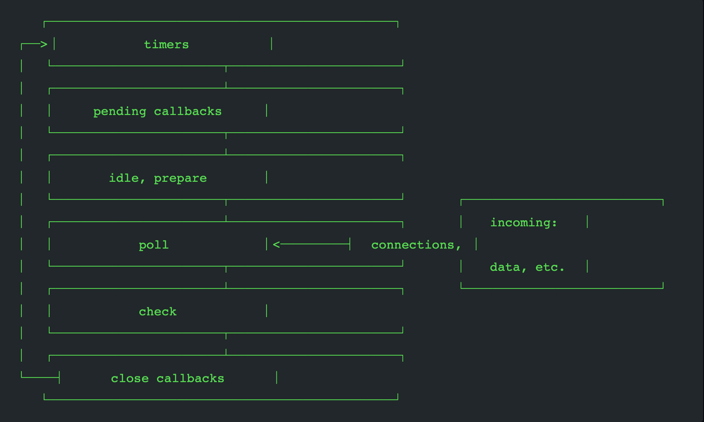

# 事件循环（event loop）

> 因为我们 JavaScript 是单线程的语言，很多的时候会遇见事件或逻辑是一个耗时的操作，解决这个问题是通过事件循环机制去处理，`浏览器环境`和`Node环境`是有不同的，共同点是当有可能的时候，它们会把操作转移到系统内核中去。

## 浏览器事件循环

> 浏览器环境中的 JavaScript 是运行在浏览器端，它的 eventLoop依赖是浏览器各个线程去处理「GUI 渲染线程、JavaScript引擎线程、定时触发器线程、事件触发线程、异步http请求线程」，协调事件队列(宏和微)来实现异步，代码的原地只是注册了函数，等程序处理完即可输出结果。

### 异步是什么?

异步：**不是同步执行的代码就是异步**。同步代码就是从上往下执行,因为`JavaScript`是单线程的原因,所以在一条线上如果前面有比较耗时的操作 ,那么后面的代码就必须等待前面代码执行完才可以执行.异步执行能够很好解决这个问题,当我们在比较耗时的操作用异步代码来执行，异步代码不会堵塞同步代码的执行，而是放在异步队列里面，等待同步代码都执行完了，才执行异步代码。



解释：上面的代码先是执行同步代码 A，然后执行到异步代码 B 的时候，发现它是异步代码，分析是哪一种异步（可能是请求，定时器，等等，这里会去请求和注册定时器的回调，当浏览器的网络进程处理完信息后会将返回信息给当前注册的回调，定时器到期了也会执行，但是这些回调都是等 `JavaScript`空闲了才会执行，所以才会不堵塞后续代码执行），把耗时放到异步队列里面，先不执行，等待`“机会”`执行，接着执行同步代码 C，等所有的同步代码都执行完了，看`“机会”`是否到了，也就是定时器到期了没，浏览器请求数据返回来没等等， 才执行后续异步代码 B。异步代码 B 执行完，程序结束。


### 什么是异步代码

#### **回调函数（callback）**

回调函数是有同步回调函数和异步回调函数之分的。

```js
同步回调函数：
const callback = function() {
    console.log('这是一个同步回调函数')
  }

function fn(cb) {
  cb();
  console.log("fn函数结束");
}

fn(callback)   // 调用fn()函数，并callback作为参数

结果： 先打印 这是一个同步回调函数--> fn函数结束
一直往下面执行的，就是同步，所以这是同步的回调函数。

异步回调函数
const callback = function() {
    console.log('这是一个异步回调函数')
  }

function fn(callback) {
  setTimeout(callback,1000)
  console.log("fn函数结束");
}

fn(callback)   // 调用fn()函数，并callback作为参数
结果：先打印fn函数结束-->这是一个异步回调函数。
为什么结果相反了，因为setTimeout是一个异步执行的定时器，里面的回调函数就是异步的回调函数，所以后面的同步代码先执行，异步代码等待同步代码执行完才执行。
```


#### **事件监听**

采用事件驱动模式。

任务的执行不取决代码的顺序，而取决于某一个事件是否发生 。也就是说事件的执行是触发的，只要触发了，就会执行。只要绑定事件的方法都是异步的 **on** 、**addEventListener** （绑定多个同名事件，而不被覆盖）

```
element.onclick=function(){
   //处理函数
}

因为onclick这个方法是监听着element的变化（就是监听点击事件），当element被点击之后马上触发回调函数。
```


#### 发布者/订阅者模式

发布订阅模式，通过定义一个发布者对象，并建立订阅者对发布者的依赖，实现发布者向订阅者传递数据并执行订阅者指定的回调：



```js
const publisher = {
  callbacks: {}, // 订阅记录存放对象
  subscribe: function (name, callback) { // 订阅
	// 判断是否已经存在订阅的对象，如果存在push进数组
  // 不存在，新建订阅属性并把callback放在数组里面，赋值给订阅属性
    this.callbacks[name] ? this.callbacks[name].push(callback) : (this.callbacks[name] = [callback])
  },
  publish: function (name, data) {
    // 发布
    if (this.callbacks[name]) {
      for (i in this.callbacks[name]) {
        // 遍历执行该订阅者全部回调函数
        this.callbacks[name][i](data)
      }
    }
  },
}

publisher.subscribe("foo", function (msg) {
  console.log("我是订阅者" + msg)
})

publisher.publish("foo", "Hello foo，我是发布者")
//我是订阅者Hello foo，我是发布者
```


#### Promise

promise 的一个最重要作用可以解决回调地狱.只要是异步的都在 then 函数调用，因为返回 promise 对象，所以支持链式编程。

详解的话，参考本目录下的文章

```js
const p = new Promise(function (resolve,reject){
        //在这里进行异步处理。我们在业务上就会封装ajax或者axios
        	setTimeout(function () {
        	    resolve(50);
        	    //reject(new Error('错误的返回'));
        	}, 1000);
        });

        p.then(function (res) {
            console.log('这是成功后的返回值', res);
        });
        p.catch(function (err) {
            console.error('这是失败后的返回值',err);
        });

结果:会1s后打印结果. then就是我们异步后返回的结果函数．pending—>fulfilled
当我们把if注释了,reject(...)放出来.就可以跑Atoe.catch. pending—>rejected.
```

#### Generator

`JavaScript `中的协程应该只在 generator 中才听过，在其他编程语言还是早就有了。当时 Brendan Eich 考虑到多线程数据共享太复杂，所以 `JavaScript ` 一直是单线程.。**特点就是把函数的执行权交给 yield 后面的语句**。然后执行完回来，继续执行。

```js
function *GeneratorFoo(){
	var URL = "xxx"
	var y = yield ajax(URL);
	return y
}
const foo = GeneratorAtoe(); // 得到一个迭代器 itable 我们需要通过next来获取生成器的内容
foo.next() // { value:res(异步请求的返回对象),done:false}
value字段代表的是当前指针(next)的返回值 done为false说明迭代器后面还有未迭代的内容.true迭代完成
foo.next() // 再执行一次  { value:undefined,done:true}
因为当前已经没有了yield了,所以就没有值.返回undefined 迭代完成返回true

yield与return的区别：
1. yield仅代表本次迭代完成，可能还会有下一次迭代
2. return则代表生成器函数完成
```

#### async/await(重点)

被誉为异步的终极解决方案

**async/await 是什么**：**async/await 是 promise+Generator 语法糖**，语法糖就是一种语法比较难用，然后使用另外一种语法包裹了一层糖，然后用起来比较方便所以称为语法糖。

它返回来的是 promise 对象

**怎么用?**

```js
以下情形可能用的最多的
async Fn(){
	console.log("我是同步")
	let res = await this.axios.post("url",params);
	console.log("我是异步")
}
async 告诉编辑器我里面的代码有些可能异步的，异步可能堵塞一下。编辑器说知道了，你用await告诉我。
await 后面的代码才是真正的异步代码，会把这个异步操作放到异步队列里面。
需要注意的是await之前的，async里面的 console.log("我是同步")只要Fn被执行了，他就会执行，因为他是同步代码，后面的console.log("我是异步")是等待请求回来才会执行，因为放在await后面。


深刻理解 await 
async function foo() {
  function asyncFn() {
    return new Promise((resolve, reject) => {
      setTimeout(() => {
        console.log('asyncFn')
        resolve('asyncFn')
      }, 1000)
    })
  }
  console.log('foo')
  let res = await asyncFn()
  console.log('await后面', res)
}
function bar() {
  console.log('bar')
}

foo()
bar()


foo
bar
asyncFn
await后面 asyncFn

await会一直等待之后的表达式执行完之后才会继续执行后面的代码，实际上 async 不会堵塞同级的函数。
具体过程大概这样 await后面的表达式会先执行一遍，将await后面的代码加入到microtask中，然后就会跳出整个async函数来执行后面的代码。
```

### 异步事件队列与事件循环

**首先我们知道当我们把异步操作的相关方法，会放在异步队列里面,异步队列又分为宏任务和微任务**

**微任务与宏任务的区别**

这个就像去银行办业务一样，先要取号进行排号。
一般上边都会印着类似：“您的号码为 XX，前边还有 XX 人。”之类的字样。

因为柜员同时只能处理一个来办理业务的客户，这时每一个来办理业务的人就可以认为是银行柜员的一个宏任务来存在的，当柜员处理完当前客户的问题以后，选择接待下一位，广播报号，也就是下一个宏任务的开始。
所以多个宏任务合在一起就可以认为说有一个任务队列在这，里边是当前银行中所有排号的客户。

而且一个宏任务在执行的过程中，是可以添加一些微任务的，就像在柜台办理业务，你前边的一位老大爷可能在存款，在存款这个业务办理完以后，柜员会问老大爷还有没有其他需要办理的业务，这时老大爷想了一下：“最近 P2P 爆雷有点儿多，是不是要选择稳一些的理财呢”，然后告诉柜员说，要办一些理财的业务，这时候柜员肯定不能告诉老大爷说：“您再上后边取个号去，重新排队”。
所以本来快轮到你来办理业务，会因为老大爷临时添加的“**理财业务**”而往后推。
也许老大爷在办完理财以后还想 **再办一个信用卡**？或者 **再买点儿纪念币**？
无论是什么需求，只要是柜员能够帮她办理的，都会在处理你的业务之前来做这些事情，这些都可以认为是微任务。

这就说明：~~你大爷永远是你大爷~~，但是大爷也不能来，比如大爷很有钱想取500万，这时候银行职业就让他重新排队，因为这可能会很久。

**一个宏任务执行，会先执行同步代码，然后执行微任务，如果后面又发现微任务就会加进当前微任务队列中执行，如果在当前宏任务整个阶段「执行同步代码、微任务过程中」又发现了宏任务，宏任务就会在当前的宏任务队列中排队**

补充一下:

宏任务:文件 I/O , setTimeout, setInterval, 当前 script， 渲染事件(比如解析 DOM，计算布局，绘制)，网络请求完成

微任务:Promise MutationObserver ，Object.observe

### 练习题

```js
来源:（头条）异步笔试题
async function async1() {
    console.log('async1 start');
    await async2(); promise微任务
    console.log('async1 end');
}
async function async2() {
    console.log('async2');
}
console.log('script start');
setTimeout(function() {
    console.log('setTimeout');
}, 0)
async1();
new Promise(function(resolve) {
    console.log('promise1');
    resolve();
}).then(function() {
    console.log('promise2');
});
console.log('script end');

答案: 在下面
我也贴出大佬的解释:https://github.com/Advanced-Frontend/Daily-Interview-Question/issues/7
```

 <font face="微软雅黑" size=3 color=#FF0000 >首先我们明白,一旦执行栈中的所有同步任务执行完毕（此时 JS 引擎空闲），系统就会读取任务队列，将可运行的异步任务添加到可执行栈中，那么回到题目中来,一开始运行 js 代码的时候就是一个宏任务,然后一行一行往下面执行,遇到其他异步的宏任务放到宏任务队列里面,然后等当前宏任务完全结束才运行,注意是完全结束,然后遇到微任务会把任务放到微任务队列里面,当同步代码运行完马上运行微任务队列里面的任务.接着开始下一个宏任务，每一次循环称为一次 tick,如此循环下去，这是 eventLoop.</font>


说明:这里面注释后的序号就是具体答案



**再贴一张图**eventLoop




## Node事件循环

> Node事件循环运行环境是Node端，和浏览器相比是有所区别的，没有BOM、DOM，但是新增I/O 操作。所以处理非阻塞 I/O 操作的机制是Node事件循环的核心。
>
> 既然目前大多数内核都是多线程的，它们可在后台处理多种操作。当其中的一个操作完成的时候，内核通知 Node.js 将适合的回调函数添加到 poll 队列中等待时机执行。


### Node事件循环6大阶段

> 每一轮事件循环都会尝试命中以下几个阶段，一般在poll等待事件，常常也会在poll转移到timers或check阶段。每个阶段都有一个队列来执行回调。虽然每个阶段都是特殊的，但通常情况下，当事件循环进入给定的阶段时，它将执行特定于该阶段的任何操作，然后执行该阶段队列中的回调，直到队列用尽或最大回调数已执行。当该队列已用尽或达到回调限制「防止饿死事件循环」，事件循环将移动到下一阶段，等等。




#### timers(定时器)

执行那些由 `setTimeout()` 和 `setInterval()` 调度的回调函数.

#### **I/O callbacks(I/O回调)** 

执行延迟到下一个循环迭代的 I/O 回调。

此阶段对某些系统操作（如 TCP 错误类型）执行回调。例如，如果 TCP 套接字在尝试连接时接收到 `ECONNREFUSED`，则某些 *nix 的系统希望等待报告错误。将在这阶段执行。

#### **idle(空转) prepare **

 仅系统内部使用。

#### **poll(轮询)**

检索新的 I/O 事件和执行与 I/O 相关的回调（几乎所有情况下，除了close callbacks，timers 和 `setImmediate()` 调度之外），其余情况 node 将在适当的时候在此阻塞。

**详细过程**

如果event loop进入了 poll阶段，且代码未设定timer，将会发生下面情况：

- 如果poll queue不为空，event loop将同步的执行queue里的callback,直至queue为空，或执行的callback到达系统上限;
- 如果poll queue为空，将会发生下面情况：
  - 如果代码已经被setImmediate()设定了callback, event loop将结束poll阶段进入check阶段，并执行check阶段的queue (check阶段的queue是 setImmediate设定的)
  - 如果代码没有设定setImmediate(callback)，event loop将等待回调被添加到队列中，然后立即执行。

如果event loop进入了 poll阶段，且代码设定了timer：

- 如果poll queue进入空状态时（即poll 阶段为空闲状态），event loop将检查timers,如果有1个或多个timers时间时间已经到达，event loop将按循环顺序进入 timers 阶段，并执行timer queue.

#### **check(检查)** 

`setImmediate()` 设置的回调会在此阶段被调用

`setImmediate()` 实际上是一个在事件循环的单独阶段运行的特殊计时器。它使用一个 libuv API 来安排回调在 **轮询** 阶段完成后执行。

通常，在执行代码时，事件循环最终会命中轮询阶段，在那等待传入连接、请求等。但是，如果回调已使用 `setImmediate()`调度过，并且轮询阶段变为空闲状态，则它将结束此阶段，并继续到检查阶段而不是继续等待轮询事件。

#### **close callbacks(关闭事件的回调)**

如果套接字或处理函数突然关闭（例如 `socket.destroy()`），则`'close'` 事件将在这个阶段发出。否则它将通过 `process.nextTick()` 发出。


**注意：在每次运行的事件循环之间，Node.js 检查它是否在等待任何异步 I/O 或计时器，如果没有的话，则完全关闭。**


### 练习题

#### **fs和setTimeout的关系**

```js
var fs = require('fs');
var path = require('path');

function someAsyncOperation (callback) {
  // 花费2毫秒
  fs.readFile(path.resolve(__dirname, '/read.txt'), callback);
}

var timeoutScheduled = Date.now();
var fileReadTime = 0;

setTimeout(function () {
  var delay = Date.now() - timeoutScheduled;
  console.log('setTimeout: ' + (delay) + "ms have passed since I was scheduled");
  console.log('fileReaderTime',fileReadtime - timeoutScheduled);
}, 10);

someAsyncOperation(function () {
  fileReadtime = Date.now();
  while(Date.now() - fileReadtime < 20) {

  }
});

/*
 代码从上往下执行，首先先走同步代码。
 走到setTimeout函数，并塞进 “timers” 阶段的队列中，等待时间才会执行，这个时间是不确定的但确定的是一定>=10ms，需要等后面的事件循环才能确定。
 someAsyncOperation 执行，异步读取文件，花费多少时间不知道，总之会堵塞，假装堵塞2ms「和当前Node运行环境有关系」。
 当读取完文件后，将someAsyncOperation 的回调函数 加进 “poll” 阶段的队列中，同步执行执行 。
 执行完后是22ms定时器已经到期，所以 “poll” 将回调送到 “timer” 阶段执行，注意这是第二轮事件循环。
 运行结束。
 
setTimeout: 22ms have passed since I was scheduled
fileReaderTime 2
*/


基于上面的变形题
var fs = require('fs');

function someAsyncOperation (callback) {
  var time = Date.now();
  // 花费9毫秒
  fs.readFile('/path/to/xxxx.pdf', callback);
}

var timeoutScheduled = Date.now();
var fileReadTime = 0;
var delay = 0;

setTimeout(function () {
  delay = Date.now() - timeoutScheduled;
}, 5);

someAsyncOperation(function () {
  fileReadtime = Date.now();
  while(Date.now() - fileReadtime < 20) {

  }
  console.log('setTimeout: ' + (delay) + "ms have passed since I was scheduled");
  console.log('fileReaderTime',fileReadtime - timeoutScheduled);
});

/*
 代码从上往下执行，首先先走同步代码。
 走到setTimeout函数，并塞进 “timers” 阶段的队列中，等待时间才会执行，这个时间是不确定的但确定的是一定>=5ms，需要等后面的事件循环才能确定。
 someAsyncOperation 执行，异步读取文件，花费多少时间不知道，总之会堵塞，假装堵塞9ms「和当前Node运行环境有关系」。
 当读取文件时到了5ms后，5ms定时器已经到期，所以 “poll” 将回调送到 “timer” 阶段执行，注意这是一个新的一轮事件循环。执行完“timer”后，接着往下，又到了 “poll”阶段，再次轮询等待新的回调产生。
 当时间走到9ms的时候，文件已经读取完毕，将someAsyncOperation 的回调函数 加进 “poll” 阶段的队列中，同步执行执行。
 运行结束。
 
setTimeout: 5ms have passed since I was scheduled
fileReaderTime 29ms
*/
```


#### setImmediate 和 setTimeout()

> 前置知识  
>
> 在nodejs中， setTimeout(demo, 0) === setTimeout(demo, 1)
>
> 在浏览器里面 setTimeout(demo, 0) === setTimeout(demo, 4)


```js
setTimeout(function timeout () {
  console.log('timeout');
},1);

setImmediate(function immediate () {
  console.log('immediate');
});
// 这段代码多打印几次会出现不一样的答案。
// 因为event loop的启动也是需要时间的，可能执行到poll阶段已经超过了1ms，此时setTimeout会先执行。反之setImmediate先执行


基于上面的变形

var path = require('path');
var fs = require('fs');

fs.readFile(path.resolve(__dirname, '/read.txt'), () => {
    setImmediate(() => {
        console.log('setImmediate');
    })
    
    setTimeout(() => {
        console.log('setTimeout')
    }, 0)
});

// fs.readFile 进入事件循环，在poll阶段等待回调函数，读取完文件后，执行回调函数
// 接着进入第二轮事件循环，又进入“poll”阶段，接着执行 setImmediate，进入check阶段，执行setImmediate，在到下一轮事件循环，命中 timer，执行 setTimeout。

因为 setImmediate 是在 poll 阶段后面的 check 阶段，而setTimeout则是下一个阶段的 timer阶段， 所以只要两个函数放入一个 I/O 循环内调用，setImmediate总是优先于 setTimeout
```


#### process.nextTick

**process.nextTick()不在event loop的任何阶段执行，而是在各个阶段切换的中间执行**,即从一个阶段切换到下个阶段前执行。

```js
var fs = require('fs');

fs.readFile(__filename, () => {
  setTimeout(() => {
    console.log('setTimeout');
  }, 0);
  setImmediate(() => {
    console.log('setImmediate');
    process.nextTick(()=>{
      console.log('nextTick3');
    })
  });
  process.nextTick(()=>{
    console.log('nextTick1');
  })
  process.nextTick(()=>{
    console.log('nextTick2');
  })
});
```

#### 设计原因

允许开发者通过递归调用 `process.nextTick()` 来阻塞I/O操作。

#### nextTick应用场景

1. 在多个事件里交叉执行CPU运算密集型的任务：

```js
var http = require('http');

function compute() {   
    process.nextTick(compute);
}

http.createServer(function(req, res) {  // 服务http请求的时候，还能抽空进行一些计算任务
     res.writeHead(200, {'Content-Type': 'text/plain'});
     res.end('Hello World');
}).listen(5000, '127.0.0.1');

compute();


在这种模式下，我们不需要递归的调用compute()，我们只需要在事件循环中使用process.nextTick()定义compute()在下一个时间点执行即可。在这个过程中，如果有新的http请求进来，事件循环机制会先处理新的请求，然后再调用compute()。反之，如果你把compute()放在一个递归调用里，那系统就会一直阻塞在compute()里，无法处理新的http请求了。
```


2. 保持回调函数异步执行的原则

当你给一个函数定义一个回调函数时，你要确保这个回调是被异步执行的。

```js
const client = net.connect(8124, function() { 
    console.log('client connected');
    client.write('world!\r\n');
});
```

在上面的代码里，如果因为某种原因，net.connect()变成同步执行的了，回调函数就会被立刻执行，因此回调函数写到客户端的变量就永远不会被初始化了。

这种情况下我们就可以使用process.nextTick()把上面 client.write('world!\r\n'); 改成异步执行的：

```js
const client = net.connect(8124, function() { 
    console.log('client connected');
    process.nextTick(function() {
    	client.write('world!\r\n');
    });
});
```

3. 用在事件触发过程中

   > EventEmitter有2个比较核心的方法， on和emit。node自带发布/订阅模式

```js
var EventEmitter = require('events').EventEmitter;

function StreamLibrary(resourceName) { 
    this.emit('start');
}
StreamLibrary.prototype.__proto__ = EventEmitter.prototype;   // inherit from EventEmitter

function StreamLibrary(resourceName) {      
    var self = this;

    process.nextTick(function() {
        self.emit('start');
    });  // 保证订阅永远在发布之前

    // read from the file, and for every chunk read, do:        
    
}

stream.on('start', function() {
    console.log('Reading has started');
});

这样我们就可以保证发布永远在订阅之前。
```


[参考](https://nodejs.org/zh-cn/docs/guides/event-loop-timers-and-nexttick/)

[b站视频讲解](https://www.bilibili.com/video/BV1nK4y1M73T)


