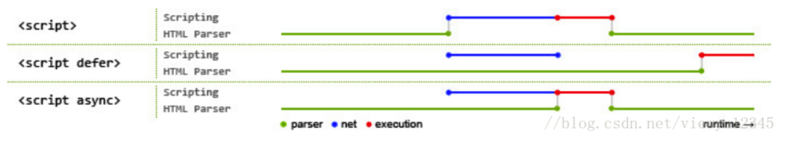

# 模块化

**异步加载js方式**

```js
// async属性规定一旦加载脚本可用，则会异步执行
<script type="text/javascript" src="xxx.js" async="async"></script>

// defer属性规定是否对脚本执行进行延迟，直到页面加载为止
<script type="text/javascript" src="xxx.js" defer="defer"></script>

DOM文档加载步骤： 
	解析HTML结构 
	加载外部的脚本和样式文件 
	解析并执行脚本代码 
	加载图片等二进制资源 
	页面加载完毕，执行window.onload
```



**什么是模块?**

> 一个具有处理逻辑的js文件,把相关的方法或对象进行导出,经过导入就可以使用

**模块化有什么作用?**

- 避免命名冲突(减少命名空间污染)
- 更好的分离, 按需加载
- 更高复用性
- 高可维护性
- 分治（你会发现当逻辑复杂的时候，可以分得更加细的模块，而且多人同时开发，可见分治是模块化最大的优点。）

**为什么要用模块化?**

那么webpack提出来的，万物都是模块化.比如一个项目越做越大，项目也变得越来越难维护，**JavaScript模块化**，把每个单独的可复用性的业务逻辑抽离出来成为一个个模块，需要用到的时候直接导入，进行使用，一处编写处处使用，以后业务需要更新，只需要改模块的逻辑即可。**我们项目肯定会封装一个异步请求的js文件，使用的时候代码非常精简**，舒服。

在ES6之前，JavaScript是不是没有浏览器模块体系，JavaScript社区制定的CommonJS、AMD、CMD。都是不是浏览器真正需要的，直到ES6提出来的模块化—ES6模块化。


## **ES6 模块化**

在 ES6 前， 实现模块化使用的是 RequireJS (基于 AMD 规范的模块化库)或者 seaJS（基于 CMD 规范的模块化库）。直到ES6模块出来了,他们就被取代了。

**严格模式:**模块化自动是严格模式,总之我们老老实实写,不会报错了啦.

**export/module export(导出): **规定模块的对外导出的接口

**import(导入)**: 规定模块的对外导入的接口

但是由于ES6目前无法在浏览器中执行，所以，我们只能通过`babel`将不被支持的`import`编译为当前受到广泛支持的 `require`。

实践一下怎么使用

导出:

```js
//写一个逻辑代码,这是js文件===模块
function atoe(params) {
    console.log("这是模块中的逻辑代码",params); 
}

export { //导出
    atoe,           //方式一:将函数暴露出去 
    atoe as newAtoe //方式二: 将newAtoe暴露出去,然而newAtoe引用了atoe,达到了重命名的效果
    //所以这里总共导出了 atoe 和 newAtoe到外面.
}  
```

导入:

```js
//组件中使用,我以vue为例子.其他也一样的.
//这是要使用的时候导入,
<template>
  <div>
    <button @click="runAtoe('msg')">HelloWorld</button>
  </div>
</template>

<script>
  //导入方式一:这种叫做按需导入方法,物尽其用.赞成👍
import {atoe, newAtoe} from '../js/atoeModule'
export default {
  methods: {
    runAtoe(params){
      atoe(params);
      newAtoe(params);
    }
  },
}
</script>

<script>
  //导入方式二:整体导入,这种不管三七二十一,全部导过来,然后这里把他们都放在了allFn这个对象里面,然后通过对象获取他们,也没有说这种不行就是low
import * as allFn from '../js/atoeModule'
export default {
  methods: {
    runAtoe(params){
      allFn.atoe(params);
      allFn.newAtoe(params);
    }
  },
}
</script>
注意这两种做法没有性能差别,因为ES6模块是编译时加载,只是一个引用,不会在内存中造成负担。
```

**export default**: 默认导出,它能带来的好处就是<font color="red" size=3>一次导出(只能导出一次)</font>,导的时候只要路径对了,不管你取什么名字,都可以使用.

导出:

```js
//写一个逻辑代码
function atoe(params) {
    console.log("这是模块中的第一个逻辑代码",params); 
}

function atoe2(params) {
    console.log("这是模块中的第二个逻辑代码",params); 
}

export default{ //默认导出
    atoe, 
    atoe2          
    //所以这里默认暴露出去 atoe atoe2
}  
```

导入:

```js
<script>
//这个allFn你想用什么名字都是可以的,just you like it. 
//注意点: 因为它导出来得是对象,所以不用花括号{},注意一下.
import allFn from '../js/atoeModule'
export default {
  methods: {
    runAtoe(params){
      allFn.atoe(params);
      allFn.atoe2(params);
    }
  },
}
</script>
```


### CommonJS(用于服务器)

node是用CommonJS规范的。

**exports/module.exports(导出)** :暴露需要被外部访问的属性和方法。

<font size=4 color="red">记得别和ES6模块搞混了,export这是多个S, export default 也不一样.</font>

**require(导入)**:("url");

```js
导出 module.exports = atoe
导入 cosnt atoe = require("atoe");


var module = {
     exports: {}
 };

 (function (module, exports) {
     exports.atoe = function (n) { return n };
 }(module, module.exports))

 var atoe = module.exports.atoe;
 atoe(1) //1  这是CommonJS的原理
```

**1.为什么CommonJS仅仅适用于服务器不适用浏览器?**

场景:

当我们需要加载一个模块的时候,这时候 CommonJS规范是用了 const atoe = require("atoe"); 如果在服务器完全ok的，因为atoe这个模块肯定在服务器，即拿即用，就是用的时候加载也ok，它就是运行的时候atoe才是确定的值，无所谓啊。然后当我们浏览器用的这个模块的时候还要去请求,好了拿到了,堵塞代码了，所以这种规范不太适用。

**2.import 和 require 导入的区别**

import是ES6 标准模块是编译时调用，所以必须放在文件开头;是解构过程 。
require 是AMD规范引入方式是运行时调用，所以require理论上可以运用在代码的任何地方;是赋值过程。其实require的结果就是对象、数字、字符串、函数等，再把require的结果赋值给某个变量

**3.CommonJs 和 ES6 模块化的区别**

1. CommonJS 模块输出的是一个值的拷贝，ES6 模块输出的是值的引用。
2. CommonJS 模块是运行时加载，ES6 模块是编译时加载。

### AMD (Asynchronous Module Definition)用于浏览器

中文意思异步模块定义。因为浏览器上面加载模块是需要异步加载的，如果使用同步的话，但有些模块加载的时候当用到的时候才加载，是不是来不及了，那就处于等待，浏览器假死，那么这时候就需要用到异步加载。

`AMD` 是 `RequireJS` 在推广过程中对模块定义的规范化产物，,然后加载的时候不会堵塞浏览器的渲染，AMD 推崇**依赖前置**。 对于依赖的模块AMD是提前执行

```js
require(['math'], function (math) {
　　　　math.add(2, 3);
});

它会在math模块加载完才会执行第二个函数。
```


### **CMD(**Common Module Definition **)**

CMD是Sea.js推广过程中对模块定义的规范化产物，CMD 推崇**依赖就近**，CMD是延迟执行。 。

```js
define('hello', ['jquery'], function(require, exports, module) {

  // 模块代码

});
```

## UMD规范

umd是AMD和CommonJS的糅合

AMD 浏览器第一的原则发展 异步加载模块。

CommonJS 模块以服务器第一原则发展，选择同步加载，它的模块无需包装(unwrapped modules)。

这迫使人们又想出另一个更通用的模式UMD （Universal Module Definition）。希望解决跨平台的解决方案。

UMD先判断是否支持Node.js的模块（exports）是否存在，存在则使用Node.js模块模式。

在判断是否支持AMD（define是否存在），存在则使用AMD方式加载模块。

```js
(function (window, factory) {
	 if (typeof exports === 'object') {
		  module.exports = factory();
	 } else if (typeof define === 'function' && define.amd) {
		  define(factory);
	 } else {
		  window.eventUtil = factory();
	 }
})(this, function () {
	 //module ...
});
```

<font color=orange size=4>我们的重点是ES6的模块化</font>

## 模块化的发展史

<font size=4 color="#8B4513">历史故事总是有趣的</font>

**一、原始写法**函数

```js
function Atoe(){
    console.log("这是最low的模块写法")
}
其实当这个在现在偶尔还是会在页面出现的，因为简单易用的逻辑通过函数写出来，进行复用还是可取的，但是对于大的模块化是不可能的。
缺点：1.污染全局命名空间。
	 2.容易引起命名冲突或数据不安全。
	 3.而且模块成员之间看不出直接关系。
```

**二、对象写法**

```
let Atoe = {
    name : "Atoe",
    can : function(){
        console.log(`${this.name}can code`);
    }
}

解决问题：1.减少了全局变量。
	     2.解决命名冲突。
缺点就是：1.对象外部可以修改内部的一切东西，不安全。
```

**三、立即执行函数写法**

```
 ((function (win) {
     let name = "Atoe";
     function atoe() {
         console.log("这是自调用函数里面的atoe函数");
     }

    win.me = { //win 接收到window参数，然后通过给windo添加一个me属性，将函数里面的东西暴露出去，见下图
        name:name,
        atoe:atoe
    }
 })(window))

console.log( window.me.name); //Atoe
window.me.atoe();             //这是自调用函数里面的atoe函数

// 大名鼎鼎的jQuery都是用立即执行函数，好像是一个天衣无缝的解决方案。
解决问题：外部无法修改里面的东西。
```

<font size=4 color="###">但是这个历史上面的，没有一个是真正严格意义上的模块化，真正的属于前端，而且适用于前端的，就是ES6模块</font>


### **四.模块化。**但是最后进化到ES6模块化。回到顶部在温故一下吧

