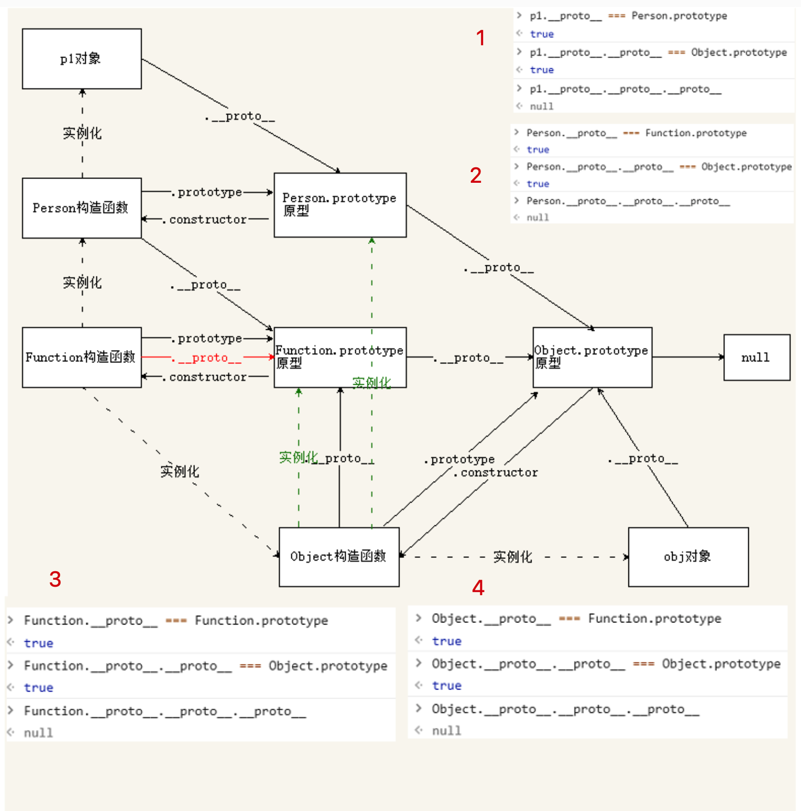

# 重新认识原型 

> 原型对象的作用，是用来存放实例中共有的那部份属性、方法，可以大大减少内存消耗，
>
> 以及继承。


对象分为**函数对**象和**普通对象**，每个对象都有__proto__属性，但是只有函数对象才有prototype属性

Object、Function都是js内置的**函数**, 类似的还有我们常用到的Array、RegExp、Date、Boolean、Number、String

```js
protoype「显式原型 explicit prototype property」: 
官方：每个构造函数都是一个函数，它有一个名为“prototype”的属性，用于实现基于原型的继承和共享属性。
注意：通过Function.prototype.bind方法构造出来的函数是个例外，它没有prototype属性。
getPrototypeOf()

__proto__「隐式原型 implicit prototype link」: 
实例的原型，它表示是继承
属性__proto__是一个对象，它有两个属性，constructor和__proto__。
原型对象prototype有一个默认的constructor属性，用于记录实例是由哪个构造函数创建。
ES5中有了对于这个内置属性标准的Get方法Object.getPrototypeOf()。
注意: Object.prototype 这个对象是个例外，它的__proto__值为null。

constructor：构造函数。

由于隐式原型指向创建这个对象的函数(constructor)的prototype
它们可以形成一个三角三关系

function Person() {} // 构造函数
let p = new Person() // 实例，new 的关键字是将p的__proto__指向Person的prototype实现一种继承效果

console.log(p) // 可以看到结构是 {__proto__:{ constructor: ƒ Person(),__proto__: Object }}
console.log(p.__proto__ === Person.prototype) // 证明隐式原型指向创建这个对象的函数(constructor)的prototype
console.log(Person === Person.prototype.constructor) // 证明prototype上的constructor指向构造函数
```


# 完整的原型链图解



```js
1. 
	p1.__proto__ === Person.prototype // true  参考上面
	p1.__proto__.__proto__ === Object.prototype // true p1.__proto__.__proto__ 是Object构造函数实例化出来的，所以他们也构成三角关系
	p.__proto__.proto__.__proto__  // null Object.prototype.__proto__ 是null
	
2. // 玄学1，Object是有由Function制造出来的，而Function是由Object制造出来的。
	Person.__proto__ === Function.prototype // true 所有的构造函数都是Function创建的，从而得出 Function是一个造物主
	Person.__proto__.__proto__ === Object.prototype // true 
	Person.__proto__.__proto__.__proto__ // null

3. // 玄学2，
Function.__proto__ === Function.prototype // true
Function.__proto__.__proto__ === Object.prototype // true
Function.__proto__.proto__.proto__ // null

3.

JavaScript起源来自Fucntion
1.Function构造函数可以用Function.__proto__来访问Function.prototype. 这是因为Function构造函数的构造函数是他本身，作为实例化对象的角色来访问，可行。

2.任何函数都是函数，他都继承Function的所有属性和方法，而Function是内置的构造函数，也是对象，都是继承Object的所有属性和方法。


说明1：function xxx语法可以看成new Function的等价形式。
function test() {}
console.log(test.__proto__ === Function.prototype) // true

说明2：用户自定义的函数通常既可以作为普通函数使用，又可以作为构造函数来制造对象。ES6新增的class语法定义的函数只能作为构造函数，ES6新增的=>语法定义的箭头函数只能作为普通函数。
```

