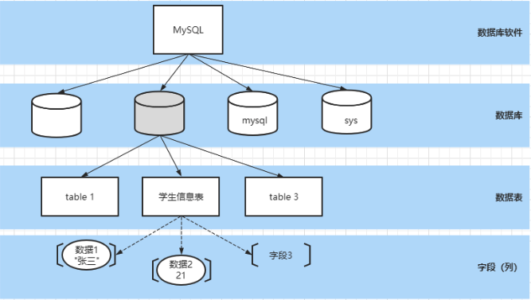

# MySQL


## **MySQL**逻辑结构

MySQL可以存储数据，但是存储在MySQL中的数据需要按照特定的结果进行存储 学生 ------ 学校
 数据 ------ 数据库




## **SQL** 结构化查询语言

**SQL**概述

SQL(Structured Query Language)结构化查询语言，用于存取、查询、更新数据以 及管理关系型数据库系统

**SQL**分类 根据SQL指令完成的数据库操作的不同，可以将SQL指令分为四类:

- **DDL Data Definition Language** 数据定义语言 用于完成对数据库对象(数据库、数据表、视图、索引等)的创建、删除、修改
  - 使用DDL语句可以创建数据库、查询数据库、修改数据库、删除数据库
  - 
- **DMLData Manipulation Language** 数据操作**/**操纵语言
  - 用于完成对数据表中的数据的添加、删除、修改操作
  - 添加:将数据存储到数据表
  - 删除:将数据从数据表移除
  - 修改:对数据表中的数据进行修改
- **DQL Data Query Language** 数据查询语言 用于将数据表中的数据查询出来
- **DCL Data Control Language** 数据控制语言 用于完成事务管理等控制性操作


## **SQL**基本语法

> 在MySQL Command Line Client 或者navicat等工具中都可以编写SQL指令

- SQL指令不区分大小写
-  每条SQL表达式结束之后都以 ; 结束
-  SQL关键字之间以 空格 进行分隔
-  SQL之间可以不限制换行(可以有空格的地方就可以有换行)

### **DDL** 数据定义语言 

**DDL-**数据库操作

使用DDL语句可以创建数据库、查询数据库、修改数据库、删除数据库 

查询数据库

```sql
## 显示当前mysql中的数据库列表，包含系统库和创建库 
show databases; 									
## 显示指定名称的数据的创建的SQL指令，比较详细的信息 
show create database <dbName>; 					
```

创建数据库

```sql
## 创建数据库 dbName表示创建的数据库名称，可以自定义
create database <dbName>;

## 创建数据库，当指定名称的数据库不存在时执行创建
create database if not exists <dbName>;

## 在创建数据库的同时指定数据库的字符集(字符集:数据存储在数据库中采用的编码格式utf8 gbk)
create database <dbName> character set utf8;
```

修改数据库-修改数据库字符集

```sql
## 修改数据库的字符集
alter database <dbName> character set utf8; # utf8 gbk
```

删除数据库 删除数据库时会删除当前数据库中所有的数据表以及数据表中的数据

```sql
## 删除数据库
drop database <dbName>;
## 如果数据库存在则删除数据库
drop database is exists <dbName>;
```

切换数据库

```
use <dbName>
```


### **DDL-**数据表操作

创建数据表

>  数据表实际就是一个二维的表格，一个表格是由多列组成，表格中的每一类称之为表格
>  的一个字段

```sql
create table students(
   stu_num char(8) not null unique,
   stu_name varchar(20) not null,
   stu_gender char(2) not null,
   stu_age int not null,
   stu_tel char(11) not null unique,
   stu_qq varchar(11) unique
);
```

查询数据表

```sql
show tables;
```

查询表结构

```sql
desc <tableName>;
```

修改数据表

```sql
## 修改表名
alter table <tableName> rename to <newTableName>;
## 数据表也是有字符集的，默认字符集和数据库一致 alter table <tableName> character set utf8;
## 添加列(字段)
alter table <tableName> add <columnName> varchar(200);
## 修改列(字段)的列表和类型
alter table <tableName> change <oldColumnName> <newCloumnName> <type>;
## 只修改列(字段)类型
alter table <tableName> modify <columnName> <newType>;
## 删除列(字段)
alter table stus drop <columnName>;
```

删除数据表

```sql
## 删除数据表
drop table <tableName>;
## 当数据表存在时删除数据表
drop table if exists <tableName>;
```


### **MySQL**数据类型

> 数据类型，指的是数据表中的列中支持存放的数据的类型

**数值类型**

在mysql中有多种数据类型可以存放数值，不同的类型存放的数值的范围或者形式是不同的

| 类型            | 内存空间大小  | 范围                                    | 说明                                         |
| --------------- | ------------- | --------------------------------------- | -------------------------------------------- |
| tinyint         | 1byte         | 有符号 -128~127 无符号 0~255            | 特小型整数(年龄)                             |
| smallint        | 2byte (16bit) | 有符号 -32768 ~ 32767 无符号 0~65535    | 小型整数                                     |
| mediumint       | 3byte         | 有符号 -2^31 ~ 2^31 - 1 无符号 0~2^32-1 | 中型整数                                     |
| **int/integer** | 4byte         |                                         | 整数                                         |
| **bigint**      | 8byte         |                                         | 大型整数                                     |
| float           | 4byte         |                                         | 单精度                                       |
| **double**      | 8byte         |                                         | 双精度                                       |
| decimal         | 第一参数+2    |                                         | decimal(10,2) 表示数值一共有10位 小数位有2位 |

**字符串类型**

> 存储字符序列的类型

| 类型       | 字符⻓度     | 说明                                                         |
| ---------- | ------------ | ------------------------------------------------------------ |
| char       | 0~255 字节   | 定⻓字符串，最多可以存储255个字符 ;当我们指定 数据表字段为char(n) 此列中的数据最⻓为n个字符，如果添加的数据少于 n，则补'\u0000'「空格」至n⻓度 |
| varchar    | 0~65536 字节 | 可变⻓度字符串，此类型的类最大⻓度为65535                    |
| tinyblob   | 0~255 字节   | 存储二进制字符串                                             |
| blob       | 0~65535      | 存储二进制字符串                                             |
| mediumblob | 0~1677215    | 存储二进制字符串                                             |
| longblob   | 0~4294967295 | 存储二进制字符串                                             |
| tinytext   | 0~255        | 文本数据(字符串)                                             |
| text       | 0~65535      | 文本数据(字符串)                                             |
| mediumtext | 0~1677215    | 文本数据(字符串)                                             |
| longtext   | 0~4294967295 | 文本数据(字符串)                                             |