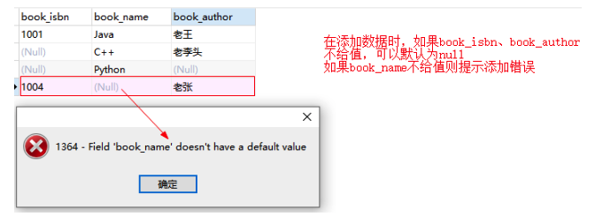
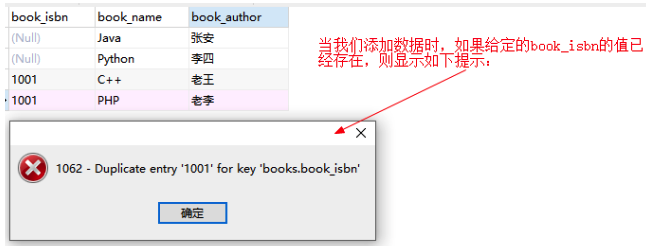
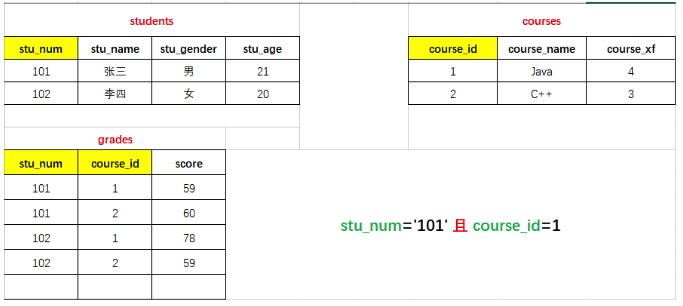
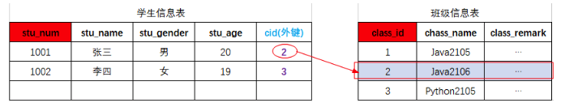
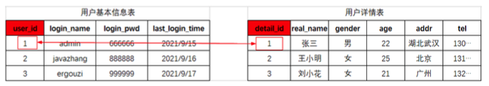
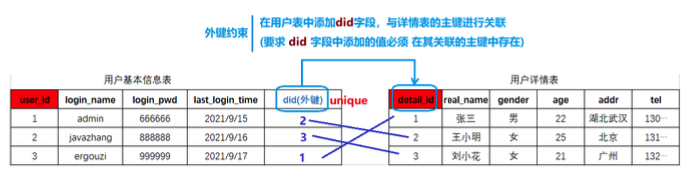
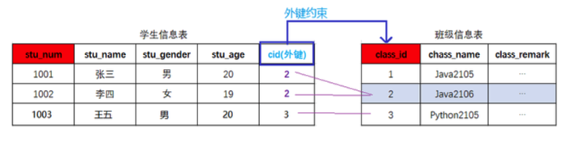
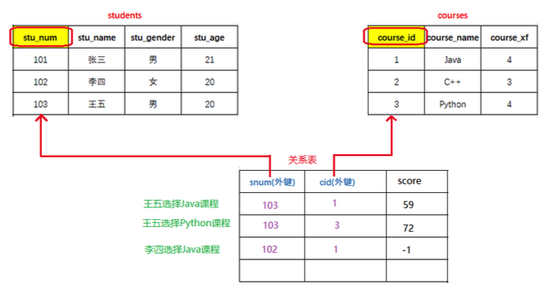

###  MySQL

> 关系型数据库


## **MySQL**逻辑结构

MySQL可以存储数据，但是存储在MySQL中的数据需要按照特定的结果进行存储 学生 ------ 学校
 数据 ------ 数据库


## **SQL** 结构化查询语言

SQL(Structured Query Language)结构化查询语言，用于存取、查询、更新数据以 及管理关系型数据库系统

### **SQL**语言分类

根据SQL指令完成的数据库操作的不同，可以将SQL指令分为四类:

- **DDL Data Definition Language** 数据定义语言 用于完成对数据库对象(数据库、数据表、视图、索引等)的创建、删除、修改
  - 使用DDL语句可以创建数据库、查询数据库、修改数据库、删除数据库
- **DML Data Manipulation Language** 数据操作**/**操纵语言
  - 用于完成对数据表中的数据的添加、删除、修改操作
  - 添加:将数据存储到数据表
  - 删除:将数据从数据表移除
  - 修改:对数据表中的数据进行修改
- **DQL Data Query Language** 数据查询语言 用于将数据表中的数据查询出来
- **DCL Data Control Language** 数据控制语言 用于完成事务管理等控制性操作


### **SQL**基本语法

> 在MySQL Command Line Client 或者navicat等工具中都可以编写SQL指令

- SQL指令不区分大小写
-  每条SQL表达式结束之后都以 ; 结束
-  SQL关键字之间以 空格 进行分隔
-  SQL之间可以不限制换行(可以有空格的地方就可以有换行)


### **DDL** 数据定义语言 

#### **DDL-**数据库操作

使用DDL语句可以创建数据库、查询数据库、修改数据库、删除数据库 

查询数据库

```sql
## 显示当前mysql中的数据库列表，包含系统库和创建库 
show databases; 									
## 显示指定名称的数据的创建的SQL指令，比较详细的信息 
show create database <dbName>; 					
```

创建数据库

```sql
## 创建数据库 dbName表示创建的数据库名称，可以自定义
create database <dbName>;

## 创建数据库，当指定名称的数据库不存在时执行创建
create database if not exists <dbName>;

## 在创建数据库的同时指定数据库的字符集(字符集:数据存储在数据库中采用的编码格式utf8 gbk)
create database <dbName> character set utf8;
```

修改数据库-修改数据库字符集

```sql
## 修改数据库的字符集
alter database <dbName> character set utf8; # utf8 gbk
```

删除数据库 删除数据库时会删除当前数据库中所有的数据表以及数据表中的数据

```sql
## 删除数据库
drop database <dbName>;
## 如果数据库存在则删除数据库
drop database is exists <dbName>;
```

切换数据库

```
use <dbName>
```


#### **DDL-**数据表操作

创建数据表

>  数据表实际就是一个二维的表格，一个表格是由多列组成，表格中的每一类称之为表格
>  的一个字段

```sql
create table students(
   stu_num char(8) not null unique,
   stu_name varchar(20) not null,
   stu_gender char(2) not null,
   stu_age int not null,
   stu_tel char(11) not null unique,
   stu_qq varchar(11) unique
);
```

查询数据表

```sql
show tables;
```

查询表结构

```sql
desc <tableName>;
```

修改数据表

```sql
## 修改表名
alter table <tableName> rename to <newTableName>;
## 数据表也是有字符集的，默认字符集和数据库一致 alter table <tableName> character set utf8;
## 添加列(字段)
alter table <tableName> add <columnName> varchar(200);
## 修改列(字段)的列表和类型
alter table <tableName> change <oldColumnName> <newCloumnName> <type>;
## 只修改列(字段)类型
alter table <tableName> modify <columnName> <newType>;
## 删除列(字段)
alter table stus drop <columnName>;
```

删除数据表

```sql
## 删除数据表
drop table <tableName>;
## 当数据表存在时删除数据表
drop table if exists <tableName>;
```


### **MySQL**数据类型

> 数据类型，指的是数据表中的列中支持存放的数据的类型

**数值类型**

在mysql中有多种数据类型可以存放数值，不同的类型存放的数值的范围或者形式是不同的

| 类型            | 内存空间大小  | 范围                                    | 说明                                         |
| --------------- | ------------- | --------------------------------------- | -------------------------------------------- |
| tinyint         | 1byte         | 有符号 -128~127 无符号 0~255            | 特小型整数(年龄)                             |
| smallint        | 2byte (16bit) | 有符号 -32768 ~ 32767 无符号 0~65535    | 小型整数                                     |
| mediumint       | 3byte         | 有符号 -2^31 ~ 2^31 - 1 无符号 0~2^32-1 | 中型整数                                     |
| **int/integer** | 4byte         |                                         | 整数                                         |
| **bigint**      | 8byte         |                                         | 大型整数                                     |
| float           | 4byte         |                                         | 单精度                                       |
| **double**      | 8byte         |                                         | 双精度                                       |
| decimal         | 第一参数+2    |                                         | decimal(10,2) 表示数值一共有10位 小数位有2位 |

**字符串类型**

> 存储字符序列的类型

| 类型       | 字符⻓度     | 说明                                                         |
| ---------- | ------------ | ------------------------------------------------------------ |
| char       | 0~255 字节   | 定⻓字符串，最多可以存储255个字符 ;当我们指定 数据表字段为char(n) 此列中的数据最⻓为n个字符，如果添加的数据少于 n，则补'\u0000'「空格」至n⻓度 |
| varchar    | 0~65536 字节 | 可变⻓度字符串，此类型的类最大⻓度为65535                    |
| tinyblob   | 0~255 字节   | 存储二进制字符串                                             |
| blob       | 0~65535      | 存储二进制字符串                                             |
| mediumblob | 0~1677215    | 存储二进制字符串                                             |
| longblob   | 0~4294967295 | 存储二进制字符串                                             |
| tinytext   | 0~255        | 文本数据(字符串)                                             |
| text       | 0~65535      | 文本数据(字符串)                                             |
| mediumtext | 0~1677215    | 文本数据(字符串)                                             |
| longtext   | 0~4294967295 | 文本数据(字符串)                                             |

 **日期类型**

> 在MySQL数据库中，我们可以使用字符串来存储时间，但是如果我们需要基于时间字段
>
>  进行查询操作(查询在某个时间段内的数据)就不便于查询实现

| 类型      | 格式                | 说明                        |
| --------- | ------------------- | --------------------------- |
| date      | 2021-09-13          | 日期，只存储年月日          |
| time      | 11:12:13            | 时间，只存储时分秒          |
| year      | 2021                | 年份                        |
| datetime  | 2021-09-13 11:12:13 | 日期+时间，存储年月日时分秒 |
| timestamp | 20210913 111213     | 日期+时间 (时间戳)          |


### 字段约束

#### 约束介绍

> 在创建数据表的时候，指定的对数据表的列的数据限制性的要求(对表的列中的数据进
>  行限制)

为什么要给表中的列添加约束呢?

-   保证数据的有效性
-   保证数据的完整性
-   保证数据的正确性

字段常⻅的约束有哪些呢?

- 非空约束(not null):限制此列的值必须提供，不能为null 
- 唯一约束(unique):在表中的多条数据，此列的值不能重复 
- 主键约束(primary key):非空+唯一，能够唯一标识数据表中的一条数据 
- 外键约束(foreign key):建立不同表之间的关联关系

#### 非空约束

> 限制数据表中此列的值必须提供

创建表:设置图书表的 book_name not null

```sql
create table books(
  book_isbn char(4),
  book_name varchar(10) not null,
  book_author varchar(6)
);
```

 添加数据:



#### 唯一约束

> 在表中的多条数据，此列的值不能重复

创建表:设置图书表的book_isbn为 unique

```sql
create table books(
  book_isbn char(4) unique,
  book_name varchar(10) not null,
  book_author varchar(6)
);
```

添加数据:



#### 主键约束

> 主键——就是数据表中记录的唯一标识，在一张表中只能有一个主键(主键可以是一个列，也可以是多个列的组合)
>
> 当一个字段声明为主键之后，添加数据时:
>
> - 此字段数据不能为null 
> - 此字段数据不能重复

**创建表时添加主键约束**

```sql
create table books(
  book_isbn char(4) primary key,
  book_name varchar(10) not null,
  book_author varchar(6)
);

或者
create table books(
  book_isbn char(4),
  book_name varchar(10) not null,
  book_author varchar(6),
  primary key(book_isbn)
);
```

##### 删除数据表主键约束

```sql
alter table books drop primary key;
```

##### 创建表之后添加主键约束

```sql
## 创建表时没有添加主键约束 create table books(
  book_isbn char(4),
  book_name varchar(10) not null,
  book_author varchar(6)
);
## 创建表之后添加主键约束
alter table books modify book_isbn char(4) primary key;
```

##### 主键自动增⻓

> 在我们创建一张数据表时，如果数据表中有列可以作为主键(例如:学生表的学号、图
>
> 书表的isbn)我们可以直接这是这个列为主键;
>
> 当有些数据表中没有合适的列作为主键时，我们可以额外定义一个与记录本身无关的列 (ID)作为主键，此列数据无具体的含义主要用于标识一条记录，在mysql中我们可以 将此列定义为int，同时设置为 自动增⻓ ，当我们向数据表中新增一条记录时，无需提供 ID列的值，它会自动生成。

**定义主键自动增⻓**

- 定义int类型字段自动增⻓: auto_increment

```sql
create table types(
   type_id int primary key auto_increment,
   type_name varchar(20) not null,
   type_remark varchar(100)
);
```

注意:自动增⻓从1开始，每添加一条记录，自动的增⻓的列会自定+1，当我们把某条记录删 除之后再添加数据，自动增⻓的数据也不会重复生成(自动增⻓只保证唯一性、不保证连续性)

#### **联合主键**

> 联合组件——将数据表中的多列组合在一起设置为表的主键



**定义联合主键**

```sql
create table grades(
    stu_num char(8),
    course_id int,
    score int,
    primary key(stu_num,course_id)
);
```

注意:在实际企业项目的数据库设计中，联合主键使用频率并不高;当一个张数据表中没有 明确的字段可以作为主键时，我们可以额外添加一个ID字段作为主键。

#### 外键约束

在多表关联部分讲解


### **DML** 数据操纵语言

> 用于完成对数据表中数据的插入、删除、修改操作

```sql
create table students(
   stu_num char(8) primary key,
   stu_name varchar(20) not null,
   stu_gender char(2) not null,
   stu_age int not null,
   stu_tel char(11) not null unique,
   stu_qq varchar(11) unique
);
```

#### 插入数据

```sql
insert into <tableName>(columnName,columnName....) values(value1,value2....);


## 向数据表中指定的列添加数据(不允许为空的列必须提供数据)
insert into stus(stu_num,stu_name,stu_gender,stu_age,stu_tel)
values('20210101','张三','男',21,'13030303300');
## 数据表名后的字段名列表顺序可以不与表中一致，但是values中值的顺序必须与表名后字段名顺序对应
insert into stus(stu_num,stu_name,stu_age,stu_tel,stu_gender)
values('20210103','王五',20,'13030303302','女');

## 当要向表中的所有列添加数据时，数据表名后面的字段列表可以省略，但是values中的值的顺序要与数据表定义的字段保持一致;
insert into stus values('20210105','孙
琦','男',21,'13030303304','666666');
## 不过在项目开发中，即使要向所有列添加数据,也建议将列名的列表显式写出来(增强SQL的
稳定性)
insert into stus(stu_num,stu_name,stu_gender,stu_age,stu_tel,stu_qq)
values('20210105','孙琦','男',21,'13030303304','666666');
```

####  删除数据

> 从数据表中删除满足特定条件(所有)的记录

```sql
delete from <tableName> [where conditions];

## 删除学号为20210102的学生信息
delete from stus where stu_num='20210102';
## 删除年龄大于20岁的学生信息(如果满足where子句的记录有多条，则删除多条记录) 
delete from stus where stu_age>20;
## 如果删除语句没有where子句，则表示删除当前数据表中的所有记录(敏感操作) 
delete from stus;
```

#### 修改数据

> 对数据表中已经添加的记录进行修改

```sql
update <tableName> set columnName=value [where conditions]

## 将学号为20210105的学生姓名修改为“孙七”(只修改一列)
update stus set stu_name='孙七' where stu_num='20210105';

## 将学号为20210103的学生 性别修改为“男”,同时将QQ修改为 777777(修改多列)
update stus set stu_gender='男',stu_qq='777777' where
  stu_num='20210103';

## 根据主键修改其他所有列
update stus set stu_name='韩梅
梅',stu_gender='女',stu_age=18,stu_tel='13131313311' ,stu_qq='999999'
    where stu_num='20210102';

## 如果update语句没有where子句，则表示修改当前表中所有行(记录)
update stus set stu_name='Tom';
```


### **DQL** 数据查询语言

> 从数据表中提取满足特定条件的记录
>
> - 单表查询
> - 多表联合查询

#### 查询基础语法

```sql
## select 关键字后指定要显示查询到的记录的哪些列
select colnumName1[,colnumName2,colnumName3...] from <tableName> [where
 conditions];

## 如果要显示查询到的记录的所有列，则可以使用 * 替代字段名列表 (在项目开发中不建议 使用*)
select * from stus;
```

#### **where** 子句

> 在删除、修改及查询的语句后都可以添加where子句(条件)，用于筛选满足特定的添加的数据进行删除、修改和查询操作。

```sql
delete from tableName where conditions;
update tabeName set ... where conditions;
select .... from tableName where conditions;
```

##### 条件关系运算符

```sql
## = 等于
select * from stus where stu_num = '20210101';

## != <> 不等于
select * from stus where stu_num != '20210101'; 
select * from stus where stu_num <> '20210101';

##> 大于
select * from stus where stu_age>18;

##< 小于
select * from stus where stu_age<20;

## >= 大于等于
select * from stus where stu_age>=20;

## <= 小于等于
select * from stus where stu_age<=20;

## between and 闭区间查询 between v1 and v2 [v1,v2] 
select * from stus where stu_age between 18 and 20;
```

##### 条件逻辑运算符

> 在where子句中，可以将多个条件通过逻辑预算(and or not )进行连接，通过多个条件 来筛选要操作的数据。

```sql
## and 并且 筛选多个条件同时满足的记录
select * from stus where stu_gender='女' and stu_age<21;
## or 或者 筛选多个条件中至少满足一个条件的记录
select * from stus where stu_gender='女' or stu_age<21;
## not 取反
select * from stus where stu_age not between 18 and 20;
```

#### **LIKE** 子句

> 在where子句的条件中，我们可以使用like关键字来实现模糊查询

```sql
select * from tableName where columnName like 'reg';

在like关键字后的reg表达式中
	%表示任意多个字符 【%o% 包含字母o】 
	_表示任意一个字符 【_o% 第二个字母为o】
	
# 查询学生姓名包含字母o的学生信息
select * from stus where stu_name like '%o%';
# 查询学生姓名第一个字为`张`的学生信息
select * from stus where stu_name like '张%';
# 查询学生姓名最后一个字母为o的学生信息
select * from stus where stu_name like '%o';
# 查询学生姓名中第二个字母为o的学生信息
select * from stus where stu_name like '_o%';
```

#### 对查询结果的处理

##### 设置查询的列

> 声明显示查询结果的指定列

```sql
select colnumName1,columnName2,... from stus where stu_age>20;
```

##### 计算列

> 对从数据表中查询的记录的列进行一定的运算之后显示出来

```sql
## 出生年份 = 当前年份 - 年龄
select stu_name,2021-stu_age from stus;
```

##### **as** 字段取别名

> 我们可以为查询结果的列名 取一个语义性更强的别名 (如下案例中 as 关键字也可以省略)

```sql
select stu_name,2021-stu_age as stu_birth_year from stus;
select stu_name as 姓名,2021-stu_age as 出生年份 from stus;
```

##### **distinct** 消除重复行

> 从查询的结果中将重复的记录消除 distinct

```sql
select stu_age from stus;
select distinct stu_age from stus;
```

#### 排序 **- order by**

> 将查询到的满足条件的记录按照指定的列的值升序「asc」/降序排列「desc」

```sql
select * from tableName where conditions order by columnName asc|desc;

order by columnName 表示将查询结果按照指定的列排序
	asc 按照指定的列升序(默认) 
	desc 按照指定的列降序
	
	
实例
# 单字段排序
select * from stus where stu_age>15 order by stu_gender desc;

# 多字段排序 : 先满足第一个排序规则，当第一个排序的列的值相同时再按照第二个列的规则排序
select * from stus where stu_age>15 order by stu_gender asc,stu_age desc;
```

#### 聚合函数

> SQL中提供了一些可以对查询的记录的列进行计算的函数——聚合函数
>
> count、max、min、sum、avg

```sql
count() 统计函数，统计满足条件的指定字段值的个数(记录数)
# 统计学生表中学生总数
select count(stu_num) from stus;
# 统计学生表中性别为男的学生总数
select count(stu_num) from stus where stu_gender='男';

max() 计算最大值，查询满足条件的记录中指定列的最大值
select max(stu_age) from stus;
select max(stu_age) from stus where stu_gender='女';

min() 计算最小值，查询满足条件的记录中指定列的最小值
select min(stu_age) from stus;
select min(stu_age) from stus where stu_gender='女';

sum() 计算和，查询满足条件的记录中 指定的列的值的总和
# 计算所有学生年龄的综合
select sum(stu_age) from stus;
# 计算所有性别为男的学生的年龄的综合
select sum(stu_age) from stus where stu_gender='男';

avg() 求平均值，查询满足条件的记录中 计算指定列的平均值
select avg(stu_age) from stus;
select avg(stu_age) from stus where stu_gender='男';
```

#### 日期函数 和 字符串函数

##### 日期函数

> 当我们向日期类型的列添加数据时，可以通过字符串类型赋值(字符串的格式必须为 yyyy-MM-dd hh:mm:ss)
>
> 如果我们想要获取当前系统时间添加到日期类型的列， 

```sql
# 通过字符串类型 给日期类型的列赋值
insert into stus(stu_num,stu_name,stu_gender,stu_age,stu_tel,stu_qq,stu_enterence) values('20200108','张小三','女',20,'13434343344','123111','2021-09-01
09:00:00');

# 通过now()获取当前时间
insert into stus(stu_num,stu_name,stu_gender,stu_age,stu_tel,stu_qq,stu_enterence)
values('20210109','张小四','女',20,'13434343355','1233333',now());


# 通过sysdate()获取当前时间
insert into stus(stu_num,stu_name,stu_gender,stu_age,stu_tel,stu_qq,stu_enterence)
values('20210110','李雷','男',16,'13434343366','123333344',sysdate());

# 通过now和sysdate获取当前系统时间
select now();


```

##### 字符串函数

> 就是通过SQL指令对字符串进行处理

```sql
# concat(colnum1,colunm2,...) 拼接多列
select concat(stu_name,'-',stu_gender) from stus;

# upper(column) 将字段的值转换成大写
select upper(stu_name) from stus;

# lower(column) 将指定列的值转换成小写 
select lower(stu_name) from stus;

# substring(column,start,len) 从指定列中截取部分显示 start从1开始
select stu_name,substring(stu_tel,8,4) from stus;
```

####  **group by**

> 分组——就是将数据表中的记录按照指定的类进行分组

```sql
select 分组字段/聚合函数
from 表名
[where 条件]
group by 分组列名 [having 条件] [order by 排序字段]
```

- select 后使用*显示对查询的结果进行分组之后，显示每组的第一条记录(这种显示通 常是无意义的)
- select 后通常显示分组字段和聚合函数(对分组后的数据进行统计、求和、平均值等) 
- 语句执行顺序
  1. 先根据where条件从数据库查询记录
  2. group by对查询记录进行分组
  3. 执行having「筛选」对分组后的数据进行筛选

```sql
# 先对查询的学生信息按性别进行分组(分成了男、女两组)，然后再分别统计每组学生的个数 
select stu_gender,count(stu_num) from stus group by stu_gender;

# 先对查询的学生信息按性别进行分组(分成了男、女两组)，然后再计算每组的平均年龄 
select stu_gender,avg(stu_age) from stus group by stu_gender;

# 先对学生按年龄进行分组(分了16、17、18、20、21、22六组)，然后统计各组的学生数量，还可以对最终的结果排序
select stu_age,count(stu_num) from stus group by stu_age order by stu_age;

# 查询所有学生，按年龄进行分组，然后分别统计每组的人数，再筛选当前组人数>1的组，再按 年龄升序显示出来
select stu_age,count(stu_num)
from stus
group by stu_age
having count(stu_num)>1 order by stu_age;

# 查询性别为'男'的学生，按年龄进行分组，然后分别统计每组的人数，再筛选当前组人数>1的 组，再按年龄升序显示出来
mysql> select stu_age,count(stu_num)
-> from stus
-> where stu_gender='男' 
-> group by stu_age
-> having count(stu_num)>1 
-> order by stu_age;

```

#### 分⻚查询 **- limit**

> 当数据表中的记录比较多的时候，如果一次性全部查询出来显示给用户，用户的可读性/体验性就不太好，因此我们可以将这些数据分⻚进行展示。

```sql
select ...
from ...
where ...
limit param1,param2
```

- param1 int , 表示获取查询语句的结果中的第一条数据的索引(索引从0开始)
- param2 int, 表示获取的查询记录的条数(如果剩下的数据条数<param2，则返回剩下 的所有记录)

```sql
案例
对数据表中的学生信息进行分⻚显示，总共有10条数据，我们每⻚显示3条
总记录数 count 10
每⻚显示 pageSize 3
总⻚数: pageCount = count%pageSize==0 ? count/pageSize : count/pageSize +1;

# 查询第一⻚:
select * from stus [where ...] limit 0,3; (1-1)*3
# 查询第二⻚:
select * from stus [where ...] limit 3,3; (2-1)*3
# 查询第三⻚:
select * from stus [where ...] limit 6,3; (3-1)*3
# 查询第四⻚:
select * from stus [where ...] limit 9,3; (4-1)*3


# 如果在一张数据表中:
# pageNum表示查询的⻚码
# pageSize表示每⻚显示的条数
# 通用分⻚语句如下:
select * from <tableName> [where ...] limit (pageNum- 1)*pageSize,pageSize;
```


## 数据表的关联关系

###  关联关系介绍

> MySQL是一个关系型数据库，不仅可以存储数据，还可以维护数据与数据之间的关系 ——通过在数据表中添加字段建立外键约束



数据与数据之间的 关联关系 分为四种:

-   一对一关联
-   一对多关联
-   多对一关联
-   多对多关联

### 一对一关联

> 人 --- 身份证 一个人只有一个身份证、一个身份证只对应一个人
>
> 学生 --- 学籍 一个学生只有一个学籍、一个学籍也对应唯一的一个学生 
>
> 用户 --- 用户详情 一个用户只有一个详情、一个详情也只对应一个用户

**方案1: 主键关联——两张数据表中主键相同的数据为相互对应的数据**



**方案2:唯一外键 —— 在任意一张表中添加一个字段添加外键约束与另一张表主键关联，并且将外键列添加唯一约束**



### 一对多与多对一

> 班级 --- 学生 (一对多) 一个班级包含多个学生
>
> 学生 --- 班级 (多对一) 多个学生可以属于同一个班级
>
> 图书 --- 分类
>
> 商品--- 商品类别

**方案:在多的一端添加外键 ，与一的一端主键进行关联**



### **7.4** 多对多关联

> 学生 --- 课程 一个学生可以选择多⻔课、一⻔课程也可以由多个学生选择
>
> 会员 --- 社团 一个会员可以参加多个社团、一个社团也可以招纳多个会员

**方法:额外创建一张关系表来维护多对多关联——在关系表中定义两个外键，分别与两个数**

**据表的主键进行关联**



### **7.5** 外键约束

> 外键约束——将一个列添加外键约束与另一张表的主键(唯一列)进行关联之后，这个外键 约束的列添加的数据必须要在关联的主键字段中存在

案例:学生表 与 班级表 

1. 先创建班级表

```sql
create table classes(
    class_id int primary key auto_increment,
    class_name varchar(40) not null unique,
    class_remark varchar(200)
);
```

