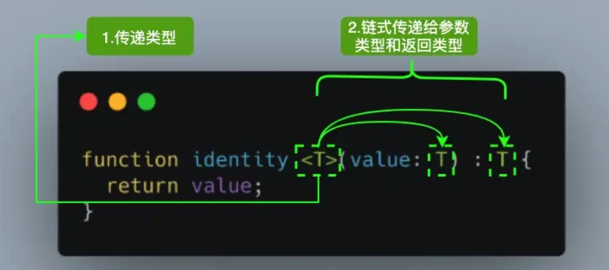

# 泛型（Generic）

设计泛型的关键目的是在成员之间提供有意义的约束，这些成员可以是：类的实例成员、类的方法、函数参数和函数返回值。

泛型（Generics）是允许同一个函数接受不同类型参数的一种模板。相比于使用 any 类型，使用泛型来创建可复用的组件要更好，因为泛型会保留参数类型。

```ts
// 只能返回string类型的数据
function getData(value:string):string {
    return value
}
 
// 同时能返回string类型和number类型, 当要返回string类型时使用getData（冗余）
function getData1(value:number):number {
    return value
}
 
// ts的其他的方式，实现放回string、number类型
function getData3(value:any):any {
    return value   // 但是有一个问题就是，无法实现类型检查和约束，你也不知道传入和返回是否时一致的
}
```


## 泛型语法

对于刚接触 TypeScript 泛型的读者来说，首次看到 `<T>` 语法会感到陌生。其实它没有什么特别，就像传递参数一样，我们传递了我们想要用于特定函数调用的类型。



参考上面的图片，当我们调用 ` identity<Number>(1)` ，`Number` 类型就像参数 `1` 一样，它将在出现 `T` 的任何位置填充该类型。图中 `<T>` 内部的 `T` 被称为类型变量，它是我们希望传递给 identity 函数的类型占位符，同时它被分配给 `value` 参数用来代替它的类型：此时 `T` 充当的是类型，而不是特定的 Number 类型。

其中 `T` 代表 **Type**，在定义泛型时通常用作第一个类型变量名称。但实际上 `T` 可以用任何有效名称代替。除了 `T` 之外，以下是常见泛型变量代表的意思：

- K（Key）：表示对象中的键类型；
- V（Value）：表示对象中的值类型；
- E（Element）：表示元素类型。

其实并不是只能定义一个类型变量，我们可以引入希望定义的任何数量的类型变量。比如我们引入一个新的类型变量 `U`，用于扩展我们定义的 `identity` 函数：

```typescript
function identity <T, U>(value: T, message: U) : T {
  console.log(message);
  return value;
}

console.log(identity<Number, string>(68, "Semlinker"));
```


除了为类型变量显式设定值之外，一种更常见的做法是使编译器自动选择这些类型，从而使代码更简洁。我们可以完全省略尖括号，比如：

```typescript
function identity <T, U>(value: T, message: U) : T {
  console.log(message);
  return value;
}

console.log(identity(68, "Semlinker"));
```

对于上述代码，编译器足够聪明，能够知道我们的参数类型，并将它们赋值给 T 和 U，而不需要开发人员显式指定它们。

## 泛型接口

```typescript
对于单个的类型限制
interface GenericIdentityFn<T> {
  (arg: T): T; // 一个函数接受泛型T，返回值是T
}

const p: GenericIdentityFn<number> = (a) => {
  console.log(a);
  return a;
};

对于多个类型限制 
interface GenericIdentityFn<T> {
  add(arg: T): T; // 一个函数接受泛型T，返回值是T
  a: string;
}

const p: GenericIdentityFn<number> = {
  a: '1',
  add: (a) => {
    console.log(a);
    return a;
  },
};
```

## 泛型类

```typescript
class GenericNumber<T> {
  zeroValue: T;
  add: (x: T, y: T) => T;
}

let myGenericNumber = new GenericNumber<number>();
myGenericNumber.zeroValue = 0;
myGenericNumber.add = function (x, y) {
  return x + y;
};
```

## 泛型工具类型

为了方便开发者 TypeScript 内置了一些常用的工具类型。需要理解这些工具类型，需要TS基础知识。

### TS基础API

#### 1.typeof

在 TypeScript 中，`typeof` 操作符可以用来获取一个变量声明或对象的类型。

```typescript
interface Person {
  name: string;
  age: number;
}

const sem: Person = { name: 'semlinker', age: 33 };
type Sem= typeof sem; // -> 鼠标悬停在Sem，提示type Sem = Person

function toArray(x: number): Array<number> {
  return [x];
}

type Func = typeof toArray; // -> (x: number) => number[]
```


#### 2.keyof

`keyof` 操作符是在 TypeScript 2.1 版本引入的，该操作符可以用于获取某种类型的所有键，其返回类型是联合类型。

```typescript
interface Person {
  name: string;
  age: number;
}

type K1 = keyof Person; // "name" | "age"
type K2 = keyof Person[]; // "length" | "toString" | "pop" | "push" | "concat" | "join" 
type K3 = keyof { [x: string]: Person };  // string | number
```

在 TypeScript 中支持两种索引签名，数字索引和字符串索引：

```typescript
interface StringArray {
  // 字符串索引 -> keyof StringArray => string | number
  [index: string]: string; 
}

interface StringArray1 {
  // 数字索引 -> keyof StringArray1 => number
  [index: number]: string;
}
```

为了同时支持两种索引类型，就得要求数字索引的返回值必须是字符串索引返回值的子类。**其中的原因就是当使用数值索引时，JavaScript 在执行索引操作时，会先把数值索引先转换为字符串索引**。所以 `keyof { [x: string]: Person }` 的结果会返回 `string | number`。

#### 3.in

`in` 用来遍历枚举类型：

```typescript
type Keys = "a" | "b" | "c"

type Obj =  {
  [p in Keys]: any
} // -> { a: any, b: any, c: any }
```

#### 4.infer

在条件类型语句中，可以用 `infer` 声明一个类型变量并且对它进行使用。

```typescript
type ReturnType<T> = T extends (...args: any[]) => infer R ? R : any;

infer R 就是声明一个变量来承载传入函数签名的返回值类型，简单说就是用它取到函数返回值的类型方便之后使用。
```

#### 5.extends

有时候我们定义的泛型不想过于灵活或者说想继承某些类等，可以通过 extends 关键字添加泛型约束。

```typescript
interface Lengthwise {
  length: number;
}

function loggingIdentity<T extends Lengthwise>(arg: T): T {
  console.log(arg.length);
  return arg;
}
```

现在这个泛型函数被定义了约束，因此它不再是适用于任意类型：

```typescript
loggingIdentity(3);  // Error, number doesn't have a .length property
```

这时我们需要传入符合约束类型的值，必须包含必须的属性：

```typescript
loggingIdentity({length: 10, value: 3});
```

### 工具类型

> 参考 node_modules/typescript/lib/lib.es5.d.ts 1473行
>
> 把ts的源码看成js的函数执行，会特别容易理解，对类型进行编程，js是对值进行编程。

#### 1.Partial

> 将属性全部变为可选项 `?`。

```typescript
/**
 * Make all properties in T optional
 */
type Partial<T> = {
  [P in keyof T]?: T[P];
};

通过 keyof T 拿到 T 的所有属性名，然后使用 in 进行遍历，将值赋给 P，最后通过 T[P] 取得相应的属性值。中间的 ? 号，用于将所有属性变为可选。

interface Person {
  name: string;
  age: number;
}

const p: Partial<Person> = {}; // 这样使用是不会报错的，因为它的参数已经变为可选的了。
console.log(p);
```

#### 2.Required

> 将全部属性变为必填。 `-?`将可选去掉即可，TS 默认就是必填

```ts
/**
 * Make all properties in T required
 */

type Required<T> = {
    [P in keyof T]-?: T[P];
};

interface Person {
  name?: string;
  age?: number;
}

const p: Required<Person> = {}; // 类型“{}”缺少类型“Required<Person>”中的以下属性: name, agets(2739)
```

#### 3.Readonly

> 将全部属性限制为只读

```ts
/**
 * Make all properties in T readonly
 */
type Readonly<T> = {
    readonly [P in keyof T]: T[P];
};

```

#### 4.Pick

> 选择出在T集合中的元素类型，组成一个新的类型。

```ts
/**
 * From T, pick a set of properties whose keys are in the union K
 */
type Pick<T, K extends keyof T> = {
    [P in K]: T[P];
};


interface Person {
  name: string;
  age: number;
  weight: number;
}

const p: Pick<Person, 'name' | 'age'> = { name: 'hello', age: 18 };

console.log(p);
```

#### 5.Record

> 用于构造一个类型，这个类型的集合是 K也称为key，类型为 T也称为value 。

```ts
/**
 * Construct a type with a set of properties K of type T
 */
type Record<K extends keyof any, T> = {
    [P in K]: T;
};

const p: Record<'height', number> = { height: 1 };
```

#### 6.Exclude

> 从 T 中排除那些可分配给 U 的类型。
>

```ts
/**
 * Exclude from T those types that are assignable to U
 */
type Exclude<T, U> = T extends U ? never : T;

const p: Exclude<'name' | 'age', 'name'> = 'age';
const p: Exclude<'name' | 1, string> = 1;

不理解的点，下面的写法是有误的
我理解的是只能对普通类型，做区分，因为它源码并没有去遍历操作。
interface Person {
  name: string;
  age: number;
  weight: number;
}

interface Person2 {
  name: string;
  age: number;
}

const p: Exclude<Person, Person2> = {};
```

#### 7.Extract

> 从 T 中提取可分配给 U 的那些类型，和Exclude相反的。

```ts
/**
 * Extract from T those types that are assignable to U
 */
type Extract<T, U> = T extends U ? T : never;

const p: Extract<'name' | 1, string> = 'name';

```

#### 8.Omit

> 用来忽略 T 中的 K 属性

```ts
/**
 * Construct a type with the properties of T except for those in type K.
 */
type Omit<T, K extends keyof any> = Pick<T, Exclude<keyof T, K>>;

type Person = {
  name: string;
  age: number;
  weight: number;
};

const p: Omit<Person, 'weight'> = { name: 'hello', age: 18 };
Exclude<keyof T, K> 
keyof T => name,age,weight, k => weight 返回的是 name,age
Pick<T, "name" | "age" > 从T中把name、age字段挑选出来
```

#### 9.NonNullable

> 将类型的 null 和 undefined  在定义变量的时候移除

```ts
/**
 * Exclude null and undefined from T
 */
type NonNullable<T> = T extends null | undefined ? never : T;

type Gender = 1 | 2 | null | undefined;
type Person = {
  name: string;
  age: number;
  gender: NonNullable<Gender>;
};

const p: Person = { gender: 1, age: 18, name: 'hello' };
p.gender = null; // 不能将类型“null”分配给类型“1 | 2”。
```

#### 10.Parameters(不理解)

> 获取元组中函数类型的参数

```ts
/**
 * Obtain the parameters of a function type in a tuple
 */
type Parameters<T extends (...args: any) => any> = T extends (...args: infer P) => any ? P : never;
```

#### 11.ConstructorParameters（不理解）

> 获取元组中构造函数类型的参数

```ts
/**
 * Obtain the parameters of a constructor function type in a tuple
 */
type ConstructorParameters<T extends abstract new (...args: any) => any> = T extends abstract new (...args: infer P) => any ? P : never;
```

#### 12.ReturnType（不理解）

> 获取函数类型的返回类型

```ts
/**
 * Obtain the return type of a function type
 */
type ReturnType<T extends (...args: any) => any> = T extends (...args: any) => infer R ? R : any;
```

#### 13.InstanceType

```ts
/**
 * Obtain the return type of a constructor function type
 */
type InstanceType<T extends abstract new (...args: any) => any> = T extends abstract new (...args: any) => infer R ? R : any;
```

#### 14.Uppercase

> 转大写

```ts
/**
 * Convert string literal type to uppercase
 */
type Uppercase<S extends string> = intrinsic;
```

#### 15.Lowercase

> 转小写

```ts
/**
 * Convert string literal type to lowercase
 */
type Lowercase<S extends string> = intrinsic;
```

#### 16.Capitalize

> 首字母大写

```ts
/**
 * Convert first character of string literal type to uppercase
 */
type Capitalize<S extends string> = intrinsic;
```

#### 17.Uncapitalize

> 首字母小写

```ts
/**
 * Convert first character of string literal type to lowercase
 */
type Uncapitalize<S extends string> = intrinsic;
```

参考 

https://juejin.cn/post/6872111128135073806