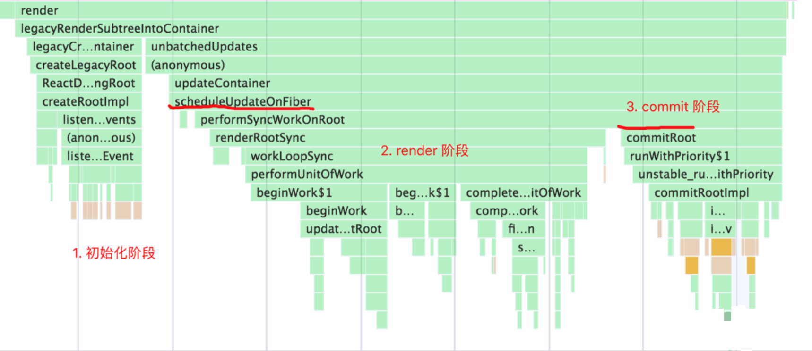
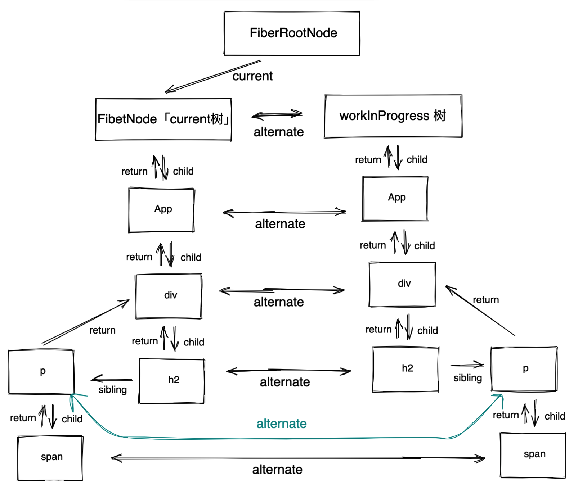
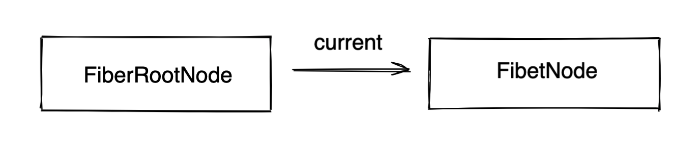
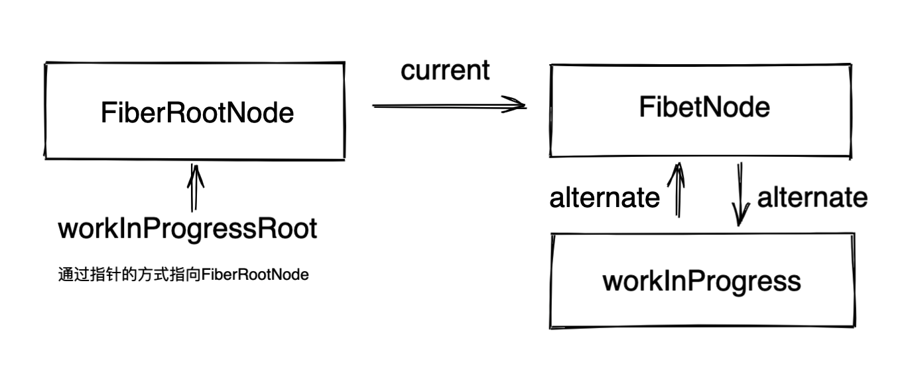
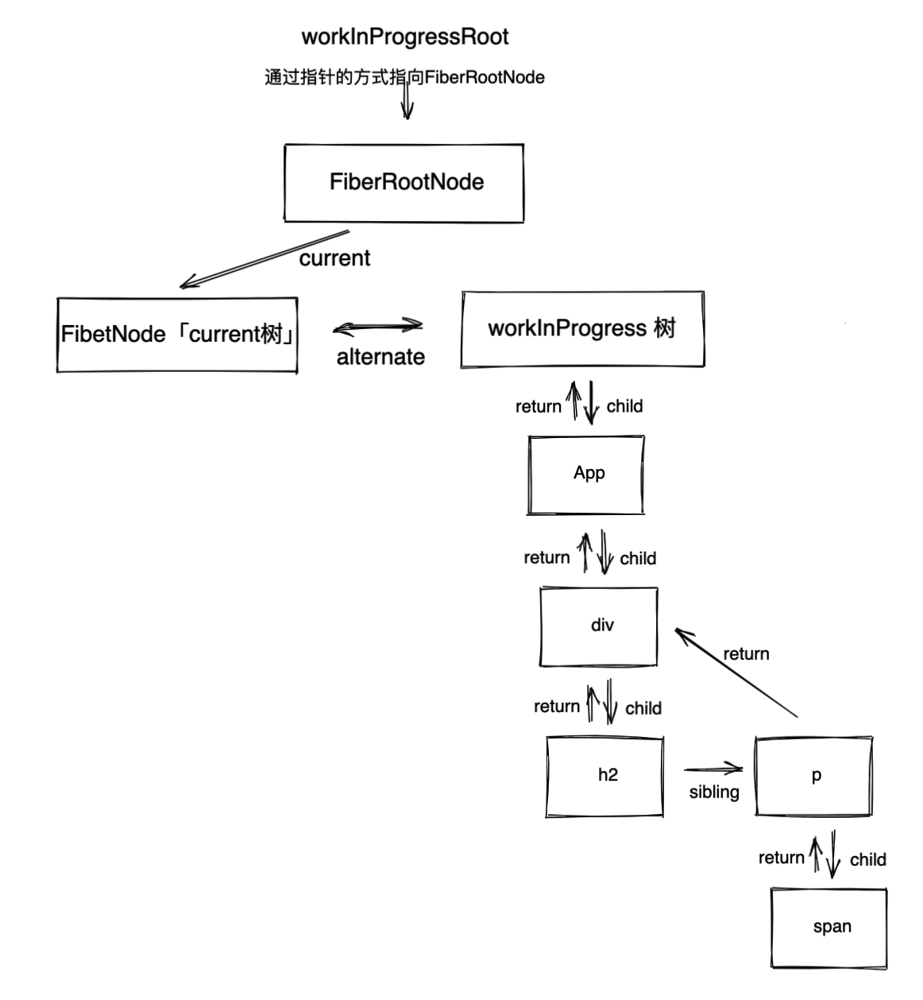

# ReactDOM.render


## Demo

> 这个例子将会围绕这个demo来代入理解ReactDOM.render整个流程。

```tsx
function App() {
  const [count, setCount] = useState(0)

  return (
    <div>
       <h2> 这是子节点 </h2>
      <p>
        <span> 这是孙节点 </span>
      </p>
    </div>
  )
}

ReactDOM.render(<App />, document.getElementById("root"))


顺便说一下，<App /> 其实会经过 babel-preset-react-app 将 jsx 转化为 React.createElement()，进而输出 ReactElement 或者叫做虚拟DOM。
```


## ReactDOM.render 的 调用栈




## 最终的返回结果




## 源码解析

> React 的函数调用栈是非常深的，一步步理解下去才不会乱。很多人都推荐只看方法名，不看里面的逻辑，我觉得有些欠妥的。
>
> 因为有些方法不重要确实可以这么操作，但是也有很多很重要的方法需要详细去理解的，所以应该找到自己想看的逻辑才是重要的。


### 初始化阶段

####  入口文件 ReactDOM.render

> 从调用栈中发现 react-dom 调用的起始位置是 `/packages/react-dom/src/client/index.js` --> `/packages/react-dom/src/client/ReactDOM.js` --> `src/react/packages/react-dom/src/client/ReactDOMLegacy.js`  找到render方法

```tsx
// render作用：返回 legacyRenderSubtreeIntoContainer 函数
export function render(element: React$Element<any>,container: Container,callback: ?Function) {
  // 判断容器是否合法，<div id='root'></div>,
  invariant( isValidContainer(container),'Target container is not a DOM element.');
  // 省略非重要代码...
  return legacyRenderSubtreeIntoContainer(null,element,container,false, callback);
}


// legacyRenderSubtreeIntoContainer作用：干活的函数，作用在注释里面
function legacyRenderSubtreeIntoContainer(
  parentComponent: ?React$Component<any, any>, // null
  children: ReactNodeList, // <App/>
  container: Container, // dom，<div id=root></div>
  forceHydrate: boolean, // false,判断是否为服务端渲染
  callback: ?Function, // 组件渲染完成的回调函数，也就是ReactDOM.render的第三个参数
) {
  let root: RootType = (container._reactRootContainer: any); // 初始化root
  // TODO: fiber的根节点，特别重要
  let fiberRoot;
  // 初始化的时候 root 是 undefined。
  if (!root) {
    // 这里初始化了 以及全局根节点fiberRootNode，fiber节点 fiberNode，以及事件初始化处理等等。
    // 下面会把 legacyCreateRootFromDOMContainer 单独拎出来讲
    root = container._reactRootContainer = legacyCreateRootFromDOMContainer( container, forceHydrate);
    fiberRoot = root._internalRoot;
    // 处理回调函数
    if (typeof callback === 'function') {
      const originalCallback = callback;
      callback = function() {
        const instance = getPublicRootInstance(fiberRoot);
        originalCallback.call(instance);
      };
    }
    // Initial mount should not be batched.
   	// 当调用 unbatchedUpdates 的时候就会调用这个 updateContainer，去到 Reconciler 中处理更新优先级，更新队列等等问题。
   	// 下面会把unbatchedUpdates，updateContainer 单独拎出来讲
    unbatchedUpdates(() => {
      updateContainer(children, fiberRoot, parentComponent, callback);
    });
  } else {
    // 这里是更新逻辑，逻辑处理的是非首次渲染的情况（即更新），其逻辑除了跳过了初始化工作，其他与上面基本一致
    fiberRoot = root._internalRoot;
    if (typeof callback === 'function') {
      const originalCallback = callback;
      callback = function() {
        const instance = getPublicRootInstance(fiberRoot);
        originalCallback.call(instance);
      };
    }
    // Update
    updateContainer(children, fiberRoot, parentComponent, callback);
  }
  // 最后
  // 返回当前fiberRoot的stateNode，有三种特殊情况
  // 1.对于FiberNode.current指向的FiberNode，stateNode 为 FiberRootNode
  // 2.FiberNode 下面的 App 组件中的 stateNode 为 null
  // 3.App组件下面，对于拥有真实dom节点的节点中的 stateNode 为 dom真实节点，这个最重要
  return getPublicRootInstance(fiberRoot);
}
```


#### legacyCreateRootFromDOMContainer

> 创建`fiberRootNode` 、 `fiberNode` 的入口。在 `/packages/react-dom/src/client/ReactDOMLegacy.js`

```tsx
// legacyCreateRootFromDOMContainer作用：判断浏览器和服务端，非服务端清空内容，调用createLegacyRoot(container，undefined)，去创建 _internalRoot对象
function legacyCreateRootFromDOMContainer( container: Container, forceHydrate: boolean,): RootType {
  const shouldHydrate = forceHydrate || shouldHydrateDueToLegacyHeuristic(container); // 服务端标识 false
  // 清空内容 <div id="root"><span>我这个标签会被清空的<span></div>
  // 这里可以考虑做一个首屏优化，当页面进来的时候，html渲染占位 loadding，react执行到这里后就会清空。
  if (!shouldHydrate) {
    let warned = false;
    let rootSibling;
    while ((rootSibling = container.lastChild)) {
      container.removeChild(rootSibling);
    }
  }
  //  又是返回一个执行函数
  return createLegacyRoot( container, shouldHydrate ? { hydrate: true, }  : undefined );
}

/packages/react-dom/src/client/ReactDOMRoot.js
export function createLegacyRoot(
	container: Container, // container
  options?: RootOptions, // undefined
): RootType {
  // LegacyRoot: 0,执行构造函数 ReactDOMBlockingRoot
  return new ReactDOMBlockingRoot(container, LegacyRoot, options);
  // ReactDOMBlockingRoot的方法体， this._internalRoot = createRootImpl(container, tag, options);
}

// 创建 _internalRoot 的方法。
function createRootImpl(
  container: Container,
  tag: RootTag, // 0
  options: void | RootOptions, // defined
) {
	// 创建fiberRootNode,	下面将会展开
  const root = createContainer(container, tag, false, null);
  // 事件系统，忽略, export const enableEagerRootListeners = true
  if (enableEagerRootListeners) {
    // container.nodeType:1
    // COMMENT_NODE:8
    const rootContainerElement = container.nodeType === COMMENT_NODE ? container.parentNode : container;
    listenToAllSupportedEvents(rootContainerElement);
  } 
  // 把刚刚创建的fiberRootNode返回
  return root;
}
```

#### 创建FiberRootNode

> 由上面知道 调用了 `createContainer`，这时候是去到，`/packages/react-reconciler/src/ReactFiberReconciler.js`
> 需要使用old版本，找到 createContainer_old ， `/packages/react-reconciler/src/ReactFiberReconciler.old.js`。

**注意：enableNewReconciler是用来区分使用 文件后缀是new还是old，由于React现在默认都是使用old，它设置这个的原因是为了新的版本和当前版本可以同时推进，但是打tag不能满足逻辑改动太大，所以就采用了使用文件做以区分**

```tsx
export function createContainer(
  containerInfo: Container,
  tag: RootTag,
  hydrate: boolean,
  hydrationCallbacks: null | SuspenseHydrationCallbacks,
): OpaqueRoot {
  // 返回创建 fiberRootNode
  return createFiberRoot(containerInfo, tag, hydrate, hydrationCallbacks);
}

export function createFiberRoot(
  containerInfo: any, // <div id='root'><div>
  tag: RootTag, // 0
  hydrate: boolean, // false
  hydrationCallbacks: null | SuspenseHydrationCallbacks, // null
): FiberRoot {
  // TODO: 创建FiberRootNode节点，下面展开。
  const root: FiberRoot = (new FiberRootNode(containerInfo, tag, hydrate): any);

  // 创建 FiberNode节点, 下面展开。
  const uninitializedFiber = createHostRootFiber(tag);
  // 这里有一个循环引用，从这里看出来 FiberRootNode 和  FiberNode节点 的关系
  root.current = uninitializedFiber;
  uninitializedFiber.stateNode = root;

  // 初始化更新链表
  initializeUpdateQueue(uninitializedFiber);

  return root;
}
```

###### FiberRootNode

> 在这里才是真的创建 `fiberRootNode` 😂 , `packages/react-reconciler/src/ReactFiberRoot.old.js`

```tsx
function FiberRootNode(containerInfo, tag, hydrate) {
  this.tag = tag; // 0
  this.hydrate = hydrate; // false
  this.containerInfo = containerInfo; //  <div id='root'></div>
  // The currently active root fiber. This is the mutable root of the tree.
  // 当前应用root节点对应的Fiber对象，即Root Fiber，ReactElement会有一个树结构，同时一个ReactElement对应一个Fiber对象，所以Fiber也会有树结构
  this.pendingChildren = null; 
  this.current = null; // fiberNode，这里是第一个fiber的起点，即是app组件的父亲
  // WeakMap<Wakeable, Set<mixed>> | Map<Wakeable, Set<mixed>> | null,
  // 任务有三种，优先级有高低：
  // 1.没有提交的任务
  // 2.没有提交的被挂起的任务
  // 3.没有提交的可能被挂起的任务
  this.pingCache = null;
  // A finished work-in-progress HostRoot that's ready to be committed.
  // 已经完成任务的FiberRoot对象，如果你只有一个Root，那么该对象就是这个Root对应的Fiber或null
  // 在commit(提交)阶段只会处理该值对应的任务
  this.finishedWork = null;  
  // Timeout handle returned by setTimeout. Used to cancel a pending timeout, if it's superseded by a new one.
  // export const noTimeout = -1;
  // 在任务被挂起的时候，通过setTimeout设置的响应内容，
  // 并且清理之前挂起的任务 还没触发的timeout
  this.timeoutHandle = noTimeout;
  // 顶层context对象，只有主动调用renderSubtreeIntoContainer才会生效
  // context: Object | null,
  this.context = null;
  this.pendingContext = null; // 服务端相关
  // Node returned by Scheduler.scheduleCallback. Represents the next rendering
  // task that the root will work on.
  this.callbackNode = null;
  // 默认是最高级的回调函数
  this.callbackPriority = NoLanePriority;
  this.eventTimes = createLaneMap(NoLanes);
  this.expirationTimes = createLaneMap(NoTimestamp);

  // 这里的优先级全是最高级,在处理不同优先级的时候，这里的值都会一直变化
  this.pendingLanes = NoLanes;
  this.suspendedLanes = NoLanes;
  this.pingedLanes = NoLanes;
  this.expiredLanes = NoLanes;
  this.mutableReadLanes = NoLanes;
  this.finishedLanes = NoLanes;

  this.entangledLanes = NoLanes;
  this.entanglements = createLaneMap(NoLanes);
  // 服务端相关
  if (supportsHydration) {
    this.mutableSourceEagerHydrationData = null;
  }

  // The following attributes are only used by interaction tracing builds.
  // They enable interactions to be associated with their async work,
  // And expose interaction metadata to the React DevTools Profiler plugin.
  // Note that these attributes are only defined when the enableSchedulerTracing flag is enabled.
  if (enableSchedulerTracing) {
    this.interactionThreadID = unstable_getThreadID();
    this.memoizedInteractions = new Set();
    this.pendingInteractionMap = new Map();
  }
  // false
  if (enableSuspenseCallback) {
    this.hydrationCallbacks = null;
  }
}
```

###### FiberNode

> 在这里才是真的创建 `fiberNode` 😂 , `packages/react-reconciler/src/ReactFiberRoot.old.js`

```tsx
export function createHostRootFiber(tag: RootTag): Fiber {
  let mode;
  if (tag === ConcurrentRoot) {
    mode = ConcurrentMode | BlockingMode | StrictMode;
  } else if (tag === BlockingRoot) {
    mode = BlockingMode | StrictMode;
  } else {
    // 初始化会得到0
    mode = NoMode;
  }
  
  if (enableProfilerTimer && isDevToolsPresent) {
    // Always collect profile timings when DevTools are present.
    // This enables DevTools to start capturing timing at any point–
    // Without some nodes in the tree having empty base times.
    mode |= ProfileMode; // 8
  }
  // HostRoot:3,mode:8
  return createFiber(HostRoot, null, null, mode);
}

packages/react-reconciler/src/ReactFiber.old.js
const createFiber = function(
  tag: WorkTag,
  pendingProps: mixed,
  key: null | string,
  mode: TypeOfMode,
): Fiber {
  // $FlowFixMe: the shapes are exact here but Flow doesn't like constructors
  return new FiberNode(tag, pendingProps, key, mode);
};


// 创建fiber节点
function FiberNode(
  tag: WorkTag, 
  pendingProps: mixed, 
  key: null | string,
  mode: TypeOfMode, 
) {
  // Instance
  this.tag = tag; // 定fiber的类型。在reconciliation算法中使用它来确定需要完成的工作
  this.key = key; // 唯一标识符
  this.elementType = null;
  this.type = null; // 定义与fiber关联的功能或类。对于类组件，它指向构造函数，对于DOM元素，它指定HTML标记。我经常使用此字段来了解光纤节点与哪些元素相关。
  this.stateNode = null; // 一般视为真实节点，及时有时候不是

  // Fiber
  this.return = null; // 指向父节点
  this.child = null; // 指向子节点
  this.sibling = null; // 指向兄弟节点
  this.index = 0; // 在这么多兄弟中排行第几

  this.ref = null; // 操作dom的方法

  this.pendingProps = pendingProps; // 新的变动带来的新的props，即nextProps。
  this.memoizedProps = null; // 上一次输入更新的Fiber props
  this.updateQueue = null; // 状态更新，回调和DOM更新的队列，Fiber对应的组件，所产生的update，都会放在该队列中
  this.memoizedState = null; // 存放 hooks链表
  this.dependencies = null; // 一个列表，存在该Fiber依赖的contexts，events

  this.mode = mode;  // 模式，继承父fiber

  // Effects
  this.flags = NoFlags; // 当前fiber阶段需要进行任务，包括：占位、更新、删除等，一般发生在diff的时候打上标记
  this.nextEffect = null; // 记录副作用

  this.firstEffect = null; // 同上
  this.lastEffect = null; // 同上

  this.lanes = NoLanes; // 优先级
  this.childLanes = NoLanes; // child优先级

  // double buffer
  this.alternate = null; // current fiber指向work in progress fiber;working in progress fiber指向current fiber
  // enableProfilerTimer：true
  if (enableProfilerTimer) {
    // 注意：这里为什么会出现赋值两次呢，这个问题参考下面的链接，我的理解是，getHostSibling方法使用到这些变量的时候，会缓慢，这对于chrome来说也是一种奇怪的行为，但是解决的方式是先赋值  Number.NaN 或 Number.MIN_VALUE才赋上真正的值，值得一提的是这是18年初提出的问题，到现在都还没解决。
    // https://github.com/facebook/react/issues/14365
    // https://bugs.chromium.org/p/v8/issues/detail?id=8538
    this.actualDuration = Number.NaN;
    this.actualStartTime = Number.NaN;
    this.selfBaseDuration = Number.NaN;
    this.treeBaseDuration = Number.NaN;
    this.actualDuration = 0;
    this.actualStartTime = -1;
    this.selfBaseDuration = 0;
    this.treeBaseDuration = 0;
  }
}
```

至此，初始化的fiber已经创建完毕，它们关系如下。




#### unbatchedUpdates，updateContainer

> fiber初始化后，回到 `ReactDOMLegacy`，`/packages/react-dom/src/client/ReactDOMLegacy.js` 找到 `legacyRenderSubtreeIntoContainer` 方法,将会去到Reconciler文件夹中。 `/packages/react-reconciler/src/ReactFiberReconciler.old.js`
> 

```tsx
unbatchedUpdates(() => {
    updateContainer(children, fiberRoot, parentComponent, callback);
});

export function unbatchedUpdates<A, R>(fn: (a: A) => R, a: A): R {
  // 对上下文处理
  const prevExecutionContext = executionContext;
  executionContext &= ~BatchedContext;
  executionContext |= LegacyUnbatchedContext;
  try {
    // 直接调用了传入的回调函数 fn，也就是updateContainer
    return fn(a);
  } finally {
    // 将上下文复原
    executionContext = prevExecutionContext;
    if (executionContext === NoContext) {
      // Flush the immediate callbacks that were scheduled during this batch
      resetRenderTimer(); // 设置时间  === workInProgressRootRenderTargetTime = now() + RENDER_TIMEOUT_MS;
      // 刷新回调
      flushSyncCallbackQueue(); 
    }
  }
}

export function updateContainer(
  element: ReactNodeList, // <App/>
  container: OpaqueRoot, // FiberRootNode
  parentComponent: ?React$Component<any, any>, // null
  callback: ?Function, // undefined
): Lane {
  const current = container.current; // 获取fiberNode
  const eventTime = requestEventTime(); // 当前时间
  // 是一个定义优先级模型，这里是通过各种判断后，返回lane
  const lane = requestUpdateLane(current); // 1

  // 创建 update 对象，一个 update 对象代表着一个更新
  const update = createUpdate(eventTime, lane);
  /* 
    callback: null,
    eventTime: 782.8000000007451,
    lane: 1,
    next: null,
    payload:
    element: {$$typeof: Symbol(react.element), key: null, ref: null, props: {…}, type: ƒ, …},
    tag: 0
  */

  // Caution: React DevTools currently depends on this property
  // being called "element".
  update.payload = {element};

  // React.render(x,y,cb),中的回调函数
  callback = callback === undefined ? null : callback;
  if (callback !== null) {
    if (__DEV__) {
      if (typeof callback !== 'function') {
        console.error(
          'render(...): Expected the last optional `callback` argument to be a ' +
            'function. Instead received: %s.',
          callback,
        );
      }
    }
    update.callback = callback;
  }
   // 更新链表，是update放在前面
  enqueueUpdate(current, update);
  
  // 调度节点，current节点即 fiberNode，开启render阶段，下面会展开。
  scheduleUpdateOnFiber(current, lane, eventTime);
  return lane;
}
```

#### 小结

综上，就是大概`React` 初始化阶段做了什么事情，主要初始化一下fiber信息，以及后续需要用到的各种字段，事件等等。


### Render 阶段 


#### scheduleUpdateOnFiber

> `scheduleUpdateOnFiber` 即是进入render阶段的标志，`/packages/react-reconciler/src/ReactFiberWorkLoop.old.js`

```tsx
export function scheduleUpdateOnFiber(
  fiber: Fiber,
  lane: Lane,
  eventTime: number,
) {
	// 删除了不影响阅读代码
  // React 有三种模式：legacy 模式「同步」， blocking 模式「过渡」，concurrent 模式「异步」
  // 这里是同步渲染的逻辑 legacy 模式，lane === SyncLane === true
  if (lane === SyncLane) {
      // 这中间包含了大量的 beginWork、completeWork 调用栈，正是 render 的工作内容。
      performSyncWorkOnRoot(root);
  } 
  // concurrent 模式：异步更新
  else {
   ...
  }
  mostRecentlyUpdatedRoot = root;
}

// root:fiberRootNode
function performSyncWorkOnRoot(root) {
  let lanes;
  let exitStatus;
  /* 
  export function includesSomeLane(a: Lanes | Lane, b: Lanes | Lane) {
    return (a & b) !== NoLanes;
  }
  */
  // 这里会返回false
  if (root === workInProgressRoot && includesSomeLane(root.expiredLanes, workInProgressRootRenderLanes) ) {
    ....
  } else {
    // NoLanes 0
    // 获取下一个优先级
    lanes = getNextLanes(root, NoLanes); // 1
    // 核心方法是这个，下面会展开
    exitStatus = renderRootSync(root, lanes); // 5

  }

  // 得到 workInProgress 树
  const finishedWork: Fiber = (root.current.alternate: any);
  root.finishedWork = finishedWork;
  root.finishedLanes = lanes;
  
  // 开启提交阶段，下面会展开。
  commitRoot(root);
}


function renderRootSync(root: FiberRoot, lanes: Lanes) {
  const prevExecutionContext = executionContext;
  executionContext |= RenderContext;
  // 大量的hooks预处理的一个errorCallback，这样好处是限制用户在非函数组件的时候使用hook报错
  const prevDispatcher = pushDispatcher();

  if (workInProgressRoot !== root || workInProgressRootRenderLanes !== lanes) {
    // 初始化是进入这里，workInProgressRoot ，workInProgressRootRenderLanes此时都是undefined
    // 创建 workInProgress，workInProgressRoot，workInProgressRootRenderLanes，下面会展开 
    prepareFreshStack(root, lanes);
    // 记录交互的，存储在root中，memoizedInteractions字段
    startWorkOnPendingInteractions(root, lanes);
  }

  do {
    try {
      // 重点是这个方法，进行递归生成fiber树
      workLoopSync();
      break;
    } catch (thrownValue) {
      handleError(root, thrownValue);
    }
  } while (true);

  // Set this to null to indicate there's no in-progress render.
  workInProgressRoot = null;
  workInProgressRootRenderLanes = NoLanes;
  return workInProgressRootExitStatus;
}

```

##### prepareFreshStack

> 在上文，`renderRootSync` ,中调用了 `prepareFreshStack` 这个方法，正式初始化 `workInProgress` 树，创建 和 current 节点很相似的fiber节点  。`packages/react-reconciler/src/ReactFiberWorkLoop.old.js`。
>
> 那 `workInProgress` 中为什么可以一直递归下去的？

```tsx
function prepareFreshStack(root: FiberRoot, lanes: Lanes) {
  // root:fiberRootNode lanes:1
  root.finishedWork = null;
  root.finishedLanes = NoLanes;
  // 这里可以看出来 workInProgressRoot 即是fiberRootNode
  workInProgressRoot = root;
  // 创建 workInProgress,它的内容是和root.current一样的，并且当 current 存在的时候可以进行复用处理。
  workInProgress = createWorkInProgress(root.current, null);
  workInProgressRootRenderLanes = subtreeRenderLanes = workInProgressRootIncludedLanes = lanes;
  workInProgressRootExitStatus = RootIncomplete;
  workInProgressRootFatalError = null;
  workInProgressRootSkippedLanes = NoLanes;
  workInProgressRootUpdatedLanes = NoLanes;
  workInProgressRootPingedLanes = NoLanes;

  if (enableSchedulerTracing) {
    spawnedWorkDuringRender = null;
  }
}

// 通过 current 创建 workInProgress，并使用 alternate 相互指向。
export function createWorkInProgress(current: Fiber, pendingProps: any): Fiber {
  // 这个workInProgress 指向current.alternate;
  let workInProgress = current.alternate;
  // workInProgress:null
  if (workInProgress === null) {
    // 使用双缓存技术，通过两棵树可以方便复用一些节点，并且可以延迟创建哪些不会更新的对象，同样可以回收一些额外的内存
    // 创建fiber，和创建fiberNode是同一个方法
    workInProgress = createFiber( current.tag, pendingProps, current.key, current.mode,);
    workInProgress.elementType = current.elementType;
    workInProgress.type = current.type;
    workInProgress.stateNode = current.stateNode;

    if (__DEV__) {
      // DEV-only fields
      workInProgress._debugID = current._debugID;
      workInProgress._debugSource = current._debugSource;
      workInProgress._debugOwner = current._debugOwner;
      workInProgress._debugHookTypes = current._debugHookTypes;
    }
    // 双缓存结构
    workInProgress.alternate = current;
    current.alternate = workInProgress;
  } 
  // 复用 current 内容。
  else {
    workInProgress.pendingProps = pendingProps;
    // Needed because Blocks store data on type.
    workInProgress.type = current.type;

    // We already have an alternate.
    // Reset the effect tag.
    workInProgress.flags = NoFlags;

    // The effect list is no longer valid.
    workInProgress.nextEffect = null;
    workInProgress.firstEffect = null;
    workInProgress.lastEffect = null;

    if (enableProfilerTimer) {
      // We intentionally reset, rather than copy, actualDuration & actualStartTime.
      // This prevents time from endlessly accumulating in new commits.
      // This has the downside of resetting values for different priority renders,
      // But works for yielding (the common case) and should support resuming.
      workInProgress.actualDuration = 0;
      workInProgress.actualStartTime = -1;
    }
  }

  workInProgress.childLanes = current.childLanes;
  workInProgress.lanes = current.lanes;

  workInProgress.child = current.child;
  workInProgress.memoizedProps = current.memoizedProps;
  workInProgress.memoizedState = current.memoizedState;
  workInProgress.updateQueue = current.updateQueue;

  // Clone the dependencies object. This is mutated during the render phase, so
  // it cannot be shared with the current fiber.
  const currentDependencies = current.dependencies;
  workInProgress.dependencies =
    currentDependencies === null
      ? null
      : {
          lanes: currentDependencies.lanes,
          firstContext: currentDependencies.firstContext,
        };

  // These will be overridden during the parent's reconciliation
  workInProgress.sibling = current.sibling;
  workInProgress.index = current.index;
  workInProgress.ref = current.ref;

  if (enableProfilerTimer) {
    workInProgress.selfBaseDuration = current.selfBaseDuration;
    workInProgress.treeBaseDuration = current.treeBaseDuration;
  }

  if (__DEV__) {
    workInProgress._debugNeedsRemount = current._debugNeedsRemount;
    switch (workInProgress.tag) {
      case IndeterminateComponent:
      case FunctionComponent:
      case SimpleMemoComponent:
        workInProgress.type = resolveFunctionForHotReloading(current.type);
        break;
      case ClassComponent:
        workInProgress.type = resolveClassForHotReloading(current.type);
        break;
      case ForwardRef:
        workInProgress.type = resolveForwardRefForHotReloading(current.type);
        break;
      default:
        break;
    }
  }

  return workInProgress;
}
```

至此图应该长这样的。



##### workLoopSync

> 在上文中，`renderRootSync` 通过 `do while` 循环调用 `workLoopSync` 进行递归同步渲染的工作，`packages/react-reconciler/src/ReactFiberWorkLoop.old.js`。

```tsx
function workLoopSync() {
  // 当workInProgress有内容的时候就会循环执行performUnitOfWork，直到没有
  while (workInProgress !== null) {
    performUnitOfWork(workInProgress);
  }
}

// workInProgress 也就是unitOfWork 一开始是FiberNode，然后不断去递归这棵树，当 workInProgress 为null时退出。
function performUnitOfWork(unitOfWork: Fiber): void {
  // The current, flushed, state of this fiber is the alternate. Ideally
  // nothing should rely on this, but relying on it here means that we don't
  // need an additional field on the work in progress.
  // 它说这里依赖这个alternate，可以不用添加额外的字段
  const current = unitOfWork.alternate;

  let next;
  // unitOfWork.mode :8 ProfileMode:8
  if (enableProfilerTimer && (unitOfWork.mode & ProfileMode) !== NoMode) {
    // 赋值两个时间，profilerStartTime = now(), fiber.actualStartTime = now() 
    startProfilerTimer(unitOfWork);
    // 这个next 永远都是返回 儿子节点，深度优先遍历，下面会展开
    next = beginWork(current, unitOfWork, subtreeRenderLanes);
    // fiber.actualDuration = now() - profilerStartTime，fiber.selfBaseDuration = elapsedTime，profilerStartTime = -1;
    // 知道执行了多长时间，以及恢复 profilerStartTime
    stopProfilerTimerIfRunningAndRecordDelta(unitOfWork, true);
  } else {
    next = beginWork(current, unitOfWork, subtreeRenderLanes);
  }

  // 记录上一次的值
  unitOfWork.memoizedProps = unitOfWork.pendingProps;
  if (next === null) {
    // If this doesn't spawn new work, complete the current work.
    // 当next没有了，也就是说深度搜索这棵树已经到头了，可以开始完成节点了。
    // 两种：1.当前节点没有子节点了，2.当前节点的子节点全部都completeUnitOfWork完成了
    // 下面会展开
    completeUnitOfWork(unitOfWork);
  } else {
    // 这里又把全局变量中的workInProgress赋值为next，为外层的while循环提供条件
    workInProgress = next;
  }
  /**
   * Keeps track of the current owner.
   *
   * The current owner is the component who should own any components that are
   * currently being constructed.
   */
  ReactCurrentOwner.current = null;
}

```

###### beginWork

> 递归构建fiber树，`/packages/react-reconciler/src/ReactFiberBeginWork.old.js`,begin是怎么处理节点的，这些参数对它来说好像无法继续递归下去「current, unitOfWork, subtreeRenderLanes」。`beginWork` 是不断的往下找，和深度优先搜索的思想是一样的。

```tsx
// beginWork 的入参是一对用 alternate 连接起来的 workInProgress 和 current 节点；
// beginWork 的核心逻辑是根据 fiber 节点（workInProgress）的 tag 属性的不同，调用不同的节点创建函数。
function beginWork(
  current: Fiber | null,
  workInProgress: Fiber,
  renderLanes: Lanes,
): Fiber | null {
  
  // current: 一开始是fiberRootNode.current 中fiberNode
  // workInProgress 当前的fiber，第一次是current
  // renderLanes:1
  const updateLanes = workInProgress.lanes;


  // 1.更新逻辑的时候，current不为null，2.第一次进来的current不为null，因为它是第一个fiberNode节点
  if (current !== null) {
    // 对比两个props
    const oldProps = current.memoizedProps;
    const newProps = workInProgress.pendingProps;
    // 若 props 更新、上下文改变或 type 改变了，则认为需要"接受更新"
    if ( oldProps !== newProps || hasLegacyContextChanged() ||
      // Force a re-render if the implementation changed due to hot reload:
      (__DEV__ ? workInProgress.type !== current.type : false)
    ) {
      // If props or context changed, mark the fiber as having performed work.
      // This may be unset if the props are determined to be equal later (memo).
      didReceiveUpdate = true; // 更新标记
    } else if (!includesSomeLane(renderLanes, updateLanes)) {
      didReceiveUpdate = false;
      // This fiber does not have any pending work. Bailout without entering
      // the begin phase. There's still some bookkeeping we that needs to be done
      // in this optimized path, mostly pushing stuff onto the stack.
      switch (workInProgress.tag) { ... }
      // 以后有了current后，并且满足条件就会复用 current 到 workInProgress
      return bailoutOnAlreadyFinishedWork(current, workInProgress, renderLanes);
    } else {
      if ((current.flags & ForceUpdateForLegacySuspense) !== NoFlags) {
        // This is a special case that only exists for legacy mode.
        // See https://github.com/facebook/react/pull/19216.
        didReceiveUpdate = true;
      } else {
        // An update was scheduled on this fiber, but there are no new props
        // nor legacy context. Set this to false. If an update queue or context
        // consumer produces a changed value, it will set this to true. Otherwise,
        // the component will assume the children have not changed and bail out.
        // 第一次进来会给更新打上一个不用更新的标记
        didReceiveUpdate = false;
      }
    }
  } else {
    didReceiveUpdate = false;
  }

  // Before entering the begin phase, clear pending update priority.
  // TODO: This assumes that we're about to evaluate the component and process
  // the update queue. However, there's an exception: SimpleMemoComponent
  // sometimes bails out later in the begin phase. This indicates that we should
  // move this assignment out of the common path and into each branch.
  workInProgress.lanes = NoLanes;
  
  switch (workInProgress.tag) {
    // 第二次，当 worikInprogress app 组件 会进来这里,通过 workInProgress.type 调用 Commponet 方法 获取jsx
    case IndeterminateComponent: { // tag：2,
      return mountIndeterminateComponent( current, workInProgress,  workInProgress.type, renderLanes,);
    }
    case FunctionComponent: { ... }
    case ClassComponent: { ... }
    // 根节点，第一次会进来这里,这里是创建app
    case HostRoot:
      return updateHostRoot(current, workInProgress, renderLanes);
    // 第三次，dom 标签，div标签
    case HostComponent:
      return updateHostComponent(current, workInProgress, renderLanes);
    // 文本节点 
    case HostText:
      return updateHostText(current, workInProgress);
  }
}

```

###### completeUnitOfWork

> `completeUnitOfWork` 是 `beginWork`  找到头了「没有子节点可以继续往下面找」，开始执行 completeUnitOfWork，当找到兄弟后，beginWork  又会重新被调用。因为workInProgress 会被更新。`completeUnitOfWork:/react/packages/react-reconciler/src/ReactFiberWorkLoop.old.js`、`completeWork: /packages/react-reconciler/src/ReactFiberCompleteWork.old.js`

```tsx
function completeUnitOfWork(unitOfWork: Fiber): void {
  // 完成后移动到 sibling，没有 sibling，返回parent，让parent去判断下一步是 sibling、parent。
  let completedWork = unitOfWork;
  do {
    const current = completedWork.alternate;
    const returnFiber = completedWork.return; // 父节点
   
    // current 初始化，current为null，除了回去到<app/>哪里才是有数据的「因为它是提前创建出来的」
    // completedWork:当前工作的fiber
    // subtreeRenderLanes:1
    startProfilerTimer(completedWork);
    // 创建dom元素挂载到 stateNode中
    next = completeWork(current, completedWork, subtreeRenderLanes);
    // NOTE: next !== null，completeWork找到了 sibling，返回到 workLoopSync，开启 sibling 的 beginWork 工作
    // next !== null 这种情况还是比较少的，看见有SuspenseListComponent相关才会，主要逻辑还是在下面通过 sibling 找
    // next === null，需要返回到找叔叔，后面会有逻辑分析 
    if (next !== null) {
      // Completing this fiber spawned new work. Work on that next.
      workInProgress = next;
      return;
    }
    
  
    // 获取当前节点的兄弟节点
    const siblingFiber = completedWork.sibling;
    // 兄弟节点存在
    if (siblingFiber !== null) {
      // If there is more work to do in this returnFiber, do that next.
      // 将 workInProgress 赋值为当前节点的兄弟节点
      workInProgress = siblingFiber;
      // 返回出去但是return没有处理,这里只是做一个中断函数执行
      // workLoopSync 继续执行上下一个siblingFiber beginWork，
      return;
    }
    // Otherwise, return to the parent
    // 将父亲返回出去
    completedWork = returnFiber;
    // Update the next thing we're working on in case something throws.
    workInProgress = completedWork;
  } while (completedWork !== null);
}


function completeWork(current: Fiber | null, workInProgress: Fiber,renderLanes: Lanes,): Fiber | null {
  const newProps = workInProgress.pendingProps;
  switch (workInProgress.tag) {
    case FunctionComponent: // 3
      return null;
    case HostRoot: { // 3
      popHostContainer(workInProgress);
      popTopLevelLegacyContextObject(workInProgress);
      resetMutableSourceWorkInProgressVersions();
      const fiberRoot = (workInProgress.stateNode: FiberRoot);
      if (fiberRoot.pendingContext) {
        fiberRoot.context = fiberRoot.pendingContext;
        fiberRoot.pendingContext = null;
      }
      if (current === null || current.child === null) {
        // If we hydrated, pop so that we can delete any remaining children
        // that weren't hydrated.
        const wasHydrated = popHydrationState(workInProgress);
        if (wasHydrated) {
          // If we hydrated, then we'll need to schedule an update for
          // the commit side-effects on the root.
          markUpdate(workInProgress);
        } else if (!fiberRoot.hydrate) {
          // Schedule an effect to clear this container at the start of the next commit.
          // This handles the case of React rendering into a container with previous children.
          // It's also safe to do for updates too, because current.child would only be null
          // if the previous render was null (so the the container would already be empty).
          workInProgress.flags |= Snapshot;
        }
      }
      updateHostContainer(workInProgress);
      return null;
    }
    // 创建普通标签
    case HostComponent: { // 5
      // fiber Stack 出栈
      popHostContext(workInProgress);
      // rootContainerInstance : 一直是 <div id='id'></div> 真实的dom元素
      const rootContainerInstance = getRootHostContainer();
      
      const type = workInProgress.type;
      // stateNode != null 就会走更新逻辑了
      if (current !== null && workInProgress.stateNode != null) {
        updateHostComponent(current, workInProgress,type,newProps, rootContainerInstance );
        if (current.ref !== workInProgress.ref) {
          markRef(workInProgress);
        }
      } else {
        // 获取上下文
        const currentHostContext = getHostContext();
        // TODO: Move createInstance to beginWork and keep it on a context
        // "stack" as the parent. Then append children as we go in beginWork
        // or completeWork depending on whether we want to add them top->down or
        // bottom->up. Top->down is faster in IE11.
        // 浏览器渲染，这里返回 false
        const wasHydrated = popHydrationState(workInProgress); 

        // 里面的逻辑都是在创建dom元素 <p>0</p>
        // type:返回标签类型，div,p
        // newProps:如果使用useState(0)=>{children: 0}
        // currentHostContext:当前host的上下文
        // 创建一个含有内容的真实dom节点
        const instance = createInstance(type,newProps,rootContainerInstance,  currentHostContext, workInProgress);
         
        // appendAllChildren 把上一步创建好的 DOM 节点挂载到 DOM 树上去
        // 将 DOM 节点插入到 DOM 树里去，实际上是将子 Fiber 节点所对应的 DOM 节点挂载到其父 Fiber 节点所对应的 DOM 节点里去。
        // 那将会出现一个问题，如果执行 appendAllChildren 时，父级的 DOM 节点还不存在怎么办？
        // 比如 <div><h1>hello</h1></div>  h1 节点作为第一个进入 completeWork 的节点，它的父节点 div 对应的 DOM 就尚不存在。
        // 其实不存在也没关系，反正 h1 DOM 节点被创建后，会作为 h1 Fiber 节点的 stateNode 属性存在，丢不掉的。
        // 当父节点 div 进入 appendAllChildren 逻辑后，会逐个向下查找并添加自己的后代节点。
        // 所以最后根节点div，即是app组件下面的div是拥有全部存在内存中dom，
        appendAllChildren(instance, workInProgress, false, false);
        // stateNode 用于存储当前 Fiber 节点对应的 DOM 节点
        workInProgress.stateNode = instance;
      
      }
      return null;
    }
 }
```

至此fiber结构应该长这样，加一段话描述这个结构。



### Commit 阶段

> 回到 `performSyncWorkOnRoot` 方法里，`/packages/react-reconciler/src/ReactFiberWorkLoop.old.js`,到最后面会去调用 	`commitRoot`,开启 `commit` 阶段。

```tsx
function commitRoot(root) {
  const renderPriorityLevel = getCurrentPriorityLevel();
  // 这里就是就是调用 commitRootImpl 函数
  runWithPriority( ImmediateSchedulerPriority, commitRootImpl.bind(null, root, renderPriorityLevel),
);
  return null;
}


function commitRootImpl(root, renderPriorityLevel) {
  do {
    // flushPassiveEffects 会在最后调用 flushSyncUpdateQueue，它有时会有副作用， 所以需要循环刷新副作用，直到所有的副作用都执行了
    flushPassiveEffects();
  } while (rootWithPendingPassiveEffects !== null);

  const finishedWork = root.finishedWork; // fiberRootNode 下面的 current
  const lanes = root.finishedLanes; // 1

  // 清空 finishedWork、finishedLanes、回调 数据
  root.finishedWork = null;
  root.finishedLanes = NoLanes;
  root.callbackNode = null;


  // Get the list of effects.
  let firstEffect;
  // 常量PerformedWork:1
  // finishedWork.flags:256 或者其他 比1大的数字
  // 副作用相关，收集副作用，
  if (finishedWork.flags > PerformedWork) {
    if (finishedWork.lastEffect !== null) {
      finishedWork.lastEffect.nextEffect = finishedWork;
      firstEffect = finishedWork.firstEffect;
    } else {
      firstEffect = finishedWork;
    }
  } else {
    // There is no effect on the root.
    firstEffect = finishedWork.firstEffect;
  }

  // 有副作用，执行commit三个子阶段
  if (firstEffect !== null) {
    // 第一个阶段为 before mutation，递归 读取组件变更前的状态。
    // 类组件，调用getSnapshotBeforeUpdate，让我们可以在DOM变更前获取组件实例的信息；
    // 函数组件，调度useEffect，关于useEffect执行逻辑有点复杂，后期得对hooks补课
    focusedInstanceHandle = prepareForCommit(root.containerInfo); // null
    shouldFireAfterActiveInstanceBlur = false;

    nextEffect = firstEffect;
    // 将副作用链表执行一遍。
    do {
        try {
          // 下面展开
          commitBeforeMutationEffects();
        } catch (error) {
          invariant(nextEffect !== null, 'Should be working on an effect.');
          captureCommitPhaseError(nextEffect, error);
          nextEffect = nextEffect.nextEffect;
      }
    } while (nextEffect !== null);

    // 第二个阶段 mutation阶段，下面展开。
    nextEffect = firstEffect;
    do {
        try {
          commitMutationEffects(root, renderPriorityLevel);
        } catch (error) {
          invariant(nextEffect !== null, 'Should be working on an effect.');
          captureCommitPhaseError(nextEffect, error);
          nextEffect = nextEffect.nextEffect;
      }
    } while (nextEffect !== null);

    if (shouldFireAfterActiveInstanceBlur) {
      afterActiveInstanceBlur();
    }

    // 将  work-in-progress 树 切换成 current tree，
    // componentWillUnmount会在mutation阶段执行。此时current Fiber树还指向前一次更新的Fiber树，在生命周期钩子内获取的DOM还是更新前的。
    // componentDidMount和componentDidUpdate会在layout阶段执行。
    // 此时current Fiber树已经指向更新后的Fiber树，在生命周期钩子内获取的DOM就是更新后的。
    root.current = finishedWork;

    // 第三个阶段 layout 阶段，下面展开
    nextEffect = firstEffect;
    do {
        try {
          commitLayoutEffects(root, lanes);
        } catch (error) {
          invariant(nextEffect !== null, 'Should be working on an effect.');
          captureCommitPhaseError(nextEffect, error);
          nextEffect = nextEffect.nextEffect;
        }
    } while (nextEffect !== null);

    nextEffect = null;

    // Tell Scheduler to yield at the end of the frame, so the browser has an
    // opportunity to paint.
    // 让 Scheduler 退出，浏览器就可以重新绘制，设置一个空的函数
    requestPaint(); 
  }
}
```


#### before mutation

> 递归 读取组件变更前的状态。类组件，调用getSnapshotBeforeUpdate，让我们可以在DOM变更前获取组件实例的信息；函数组件，调用useEffect，关于useEffect执行逻辑有点复杂，后期得对hooks补课

```tsx
function commitBeforeMutationEffects() {
  // 循环副作用链表
  while (nextEffect !== null) {
    const current = nextEffect.alternate;
    // shouldFireAfterActiveInstanceBlur：false， focusedInstanceHandle：null
    if (!shouldFireAfterActiveInstanceBlur && focusedInstanceHandle !== null) {
      if ((nextEffect.flags & Deletion) !== NoFlags) {
        if (doesFiberContain(nextEffect, focusedInstanceHandle)) {
          shouldFireAfterActiveInstanceBlur = true;
          // 处理blur
          beforeActiveInstanceBlur();
        }
      } else {
        // TODO: Move this out of the hot path using a dedicated effect tag.
        if (
          nextEffect.tag === SuspenseComponent &&
          isSuspenseBoundaryBeingHidden(current, nextEffect) &&
          doesFiberContain(nextEffect, focusedInstanceHandle)
        ) {
          shouldFireAfterActiveInstanceBlur = true;
          beforeActiveInstanceBlur();
        }
      }
    }

    const flags = nextEffect.flags;
    if ((flags & Snapshot) !== NoFlags) {
      setCurrentDebugFiberInDEV(nextEffect);
      // 类组件的getSnapshotBeforeUpdate 方法
      commitBeforeMutationEffectOnFiber(current, nextEffect);

      resetCurrentDebugFiberInDEV();
    }
    // 调度useEffect
    if ((flags & Passive) !== NoFlags) {
      // If there are passive effects, schedule a callback to flush at
      // the earliest opportunity.
      if (!rootDoesHavePassiveEffects) {
        rootDoesHavePassiveEffects = true;
        scheduleCallback(NormalSchedulerPriority, () => {
          flushPassiveEffects();
          return null;
        });
      }
    }
    nextEffect = nextEffect.nextEffect;
  }
}
```

#### mutation

> 负责 DOM 节点的渲染。在渲染过程中，会遍历 effectList，根据 flags 的不同，执行不同的 DOM 操作， 针对类组件，调用componentWillUnmount；针对函数组件，执行useEffect、useLayoutEffect的销毁函数。

```tsx
function commitMutationEffects( root: FiberRoot, renderPriorityLevel: ReactPriorityLevel) {
  // 循环副作用链表
  while (nextEffect !== null) {
    setCurrentDebugFiberInDEV(nextEffect);

    const flags = nextEffect.flags;
    // 重置内容
    if (flags & ContentReset) {
      commitResetTextContent(nextEffect);
    }

    // 清空REF
    if (flags & Ref) {
      const current = nextEffect.alternate;
      if (current !== null) {
        commitDetachRef(current);
      }
      if (enableScopeAPI) {
        // TODO: This is a temporary solution that allowed us to transition away
        // from React Flare on www.
        if (nextEffect.tag === ScopeComponent) {
          commitAttachRef(nextEffect);
        }
      }
    }

    const primaryFlags = flags & (Placement | Update | Deletion | Hydrating);
    switch (primaryFlags) {
      case Placement: {
        // 插入节点
        // getHostSibling是一个费时的操作，原因是因为，workInProgress树和dom树层级有可能不一致的，所以就会有跨级的操作，就会有指数级别的费时操作。
        commitPlacement(nextEffect);
        // Clear the "placement" from effect tag so that we know that this is
        // inserted, before any life-cycles like componentDidMount gets called.
        // TODO: findDOMNode doesn't rely on this any more but isMounted does
        // and isMounted is deprecated anyway so we should be able to kill this.
        nextEffect.flags &= ~Placement;
        break;
      }
      case PlacementAndUpdate: {
        // Placement
        commitPlacement(nextEffect);
        // Clear the "placement" from effect tag so that we know that this is
        // inserted, before any life-cycles like componentDidMount gets called.
        nextEffect.flags &= ~Placement;

        // Update
        const current = nextEffect.alternate;
        commitWork(current, nextEffect);
        break;
      }
      case Update: {
        const current = nextEffect.alternate;
        commitWork(current, nextEffect);
        break;
      }
      case Deletion: {
        commitDeletion(root, nextEffect, renderPriorityLevel);
        break;
      }
    }

    resetCurrentDebugFiberInDEV();
    nextEffect = nextEffect.nextEffect;
  }
}
```

#### layout 

> 处理 DOM 渲染完毕之后的收尾逻辑。读取组件的状态，针对类组件，调用生命周期componentDidMount和componentDidUpdate，调用setState的回调。针对函数组件，调用useLayoutEffect钩子函数的回调等。

```tsx
function commitLayoutEffects(root: FiberRoot, committedLanes: Lanes) {
  // 循环副作用链表
  while (nextEffect !== null) {
    const flags = nextEffect.flags;
    if (flags & (Update | Callback)) {
      const current = nextEffect.alternate;
      // 调用生命周期钩子和hook
      commitLayoutEffectOnFiber(root, current, nextEffect, committedLanes);
    }

    if (enableScopeAPI) {
      // TODO: This is a temporary solution that allowed us to transition away
      // from React Flare on www.
      if (flags & Ref && nextEffect.tag !== ScopeComponent) {
        // 给ref属性赋值上新的dom元素
        commitAttachRef(nextEffect);
      }
    } else {
      if (flags & Ref) {
        commitAttachRef(nextEffect);
      }
    }
    nextEffect = nextEffect.nextEffect;
  }
}

// 
function commitLifeCycles(
  finishedRoot: FiberRoot,
  current: Fiber | null,
  finishedWork: Fiber,
  committedLanes: Lanes,
): void {
  switch (finishedWork.tag) {
    case FunctionComponent:
    case ForwardRef:
    case SimpleMemoComponent:
    case Block: {
      if (enableProfilerTimer && enableProfilerCommitHooks &&finishedWork.mode & ProfileMode ) {
        try {
          startLayoutEffectTimer();
          // 执行useLayoutEffect的回调函数
          commitHookEffectListMount(HookLayout | HookHasEffect, finishedWork);
        } finally {
          recordLayoutEffectDuration(finishedWork);
        }
      } else {
        commitHookEffectListMount(HookLayout | HookHasEffect, finishedWork);
      }
      // 调度useEffect的销毁函数与回调函数
      schedulePassiveEffects(finishedWork);
      return;
    }
    case ClassComponent: {
      const instance = finishedWork.stateNode;
      if (finishedWork.flags & Update) {
        // Mount 阶段， 触发componentDidMount
        if (current === null) {
          instance.componentDidMount();
        }
        // Updata 阶段，触发componentDidUpdate
         else {
          const prevProps =
            finishedWork.elementType === finishedWork.type
              ? current.memoizedProps
              : resolveDefaultProps(finishedWork.type, current.memoizedProps);
          const prevState = current.memoizedState;
          // We could update instance props and state here,
          // but instead we rely on them being set during last render.
          // TODO: revisit this when we implement resuming.
         	instance.componentDidUpdate(prevProps,prevState,instance.__reactInternalSnapshotBeforeUpdate);
         }
      }
  }
}
```


## 总结

至此，ReactDOM.render的初始化已经完毕了，它是同步渲染的。


## 更新阶段

> 更新阶段会分为第一次更新和第1+n次更新，第一次更新还是会创建workInProgress，因为当前的current 的altenate都为null，第1+n次后，current 的altenate都有fiber节点，所以都可以进行复用。


## 同步的 ReactDOM.render，异步的 ReactDOM.createRoot

在 React 17 版本中，React 都有以下 3 种启动方式：

**legacy 模式**：
`ReactDOM.render(<App />, rootNode)`。这是当前 React App 使用的方式。
**blocking 模式**：
`ReactDOM.createBlockingRoot(rootNode).render(<App />)`。目前正在实验中，作为迁移到 concurrent 模式的第一个步骤。

**concurrent 模式**：
`ReactDOM.createRoot(rootNode).render(<App />)`。目前在实验中，未来稳定之后，打算作为 React 的默认开发模式，这个模式开启了所有的新功能。