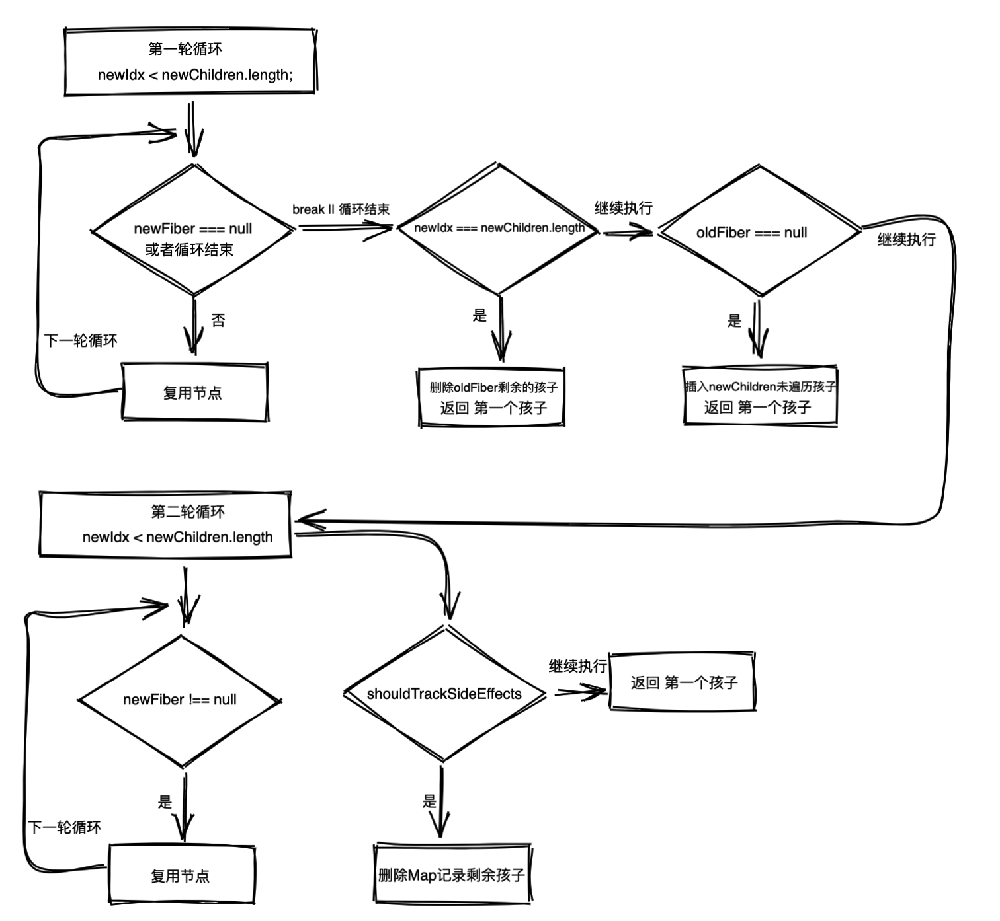
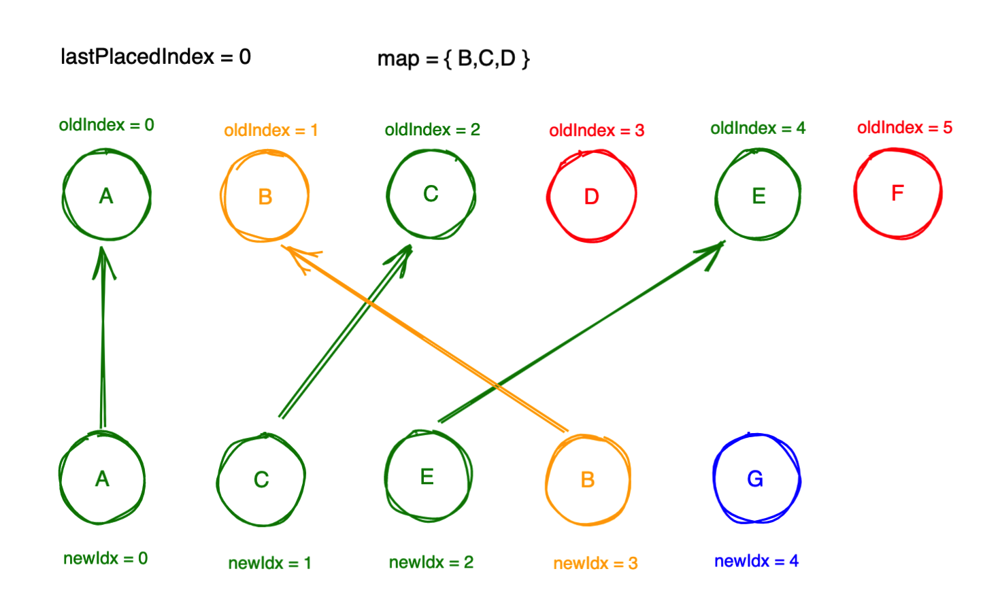

# Diff

> diff 算法 是为了更高效批量处理 增、删、改。


## 源码分析

在`React 17 DOM DIFF` 中，`React` 通过对比 `老的Fiber链表` 和`新的JSX`数组，生成`新的Fiber链表`的过程。其中分为`单节点`和`多节点`中的 diff是不一样的。


### 优化原则

- 只对同级节点进行对比，如果DOM节点跨层级移动，则React不会复用。
- 不同类型的元素会产出不同的结构，会销毁老结构，创建新的结构。
- 可以通过key「自定义或系统自动分配 null 」标识移动元素。


源码的起点在`render阶段` 中 `beginWork`  创建节点的时候将会调用下面的方法。

```tsx
// workInProgress.child  得到新创建fiber节点
// current 正在渲染的列表
// workInProgress 正在工作的fiber节点
// nextChildren: 虚拟dom
export function reconcileChildren( current: Fiber | null, workInProgress: Fiber,nextChildren: any,renderLanes: Lanes) {
  if (current === null) {
     // 若 current 为 null，则进入挂载的逻辑
    workInProgress.child = mountChildFibers(workInProgress, null, nextChildren,renderLanes );
  } else {
    // 若 current 不为 null，则进入调和的逻辑
    workInProgress.child = reconcileChildFibers( workInProgress, current.child, nextChildren, renderLanes );
  }
}


// 它们两个其实非常相似，只是传入的参数不同 
// ChildReconciler 的返回值是一个名为 reconcileChildFibers 的函数，
// 这个函数是一个逻辑分发器，它将根据入参的不同，执行不同的 Fiber 节点操作，最终返回不同的目标 Fiber 节点。
// 更新阶段 reconcileChildFibers 需要调和 fiber 节点
// 挂载阶段 mountChildFibers，不需要调和
export const reconcileChildFibers = ChildReconciler(true);
export const mountChildFibers = ChildReconciler(false);

// shouldTrackSideEffects 由上得知，更新阶段为true，挂载阶段为false
function ChildReconciler(shouldTrackSideEffects) {
  ....
	// 这个方法是一个闭包，暴露出去给外面用的，所有的流程在这里开启
  function reconcileChildFibers(
    returnFiber: Fiber, // currentFirstChild的父级fiber节点 
    currentFirstChild: Fiber | null, // returnFiber 的第一个自己节点
    newChild: any, // 对应的虚拟dom元素
    lanes: Lanes, // 
  ): Fiber | null {

    // Handle object types，true
    const isObject = typeof newChild === 'object' && newChild !== null;
	
    // 处理单个节点
    if (isObject) {
      switch (newChild.$$typeof) {
        case REACT_ELEMENT_TYPE: // symbolFor('react.element')
        // reconcileSingleElement返回一个fiber节点，给fiber节点打上 Placement 标签 代表新增
          return placeSingleChild(reconcileSingleElement( returnFiber, currentFirstChild, newChild, lanes ));
      }
    }
    // 处理文本节点
    if (typeof newChild === 'string' || typeof newChild === 'number') {
      return placeSingleChild(reconcileSingleTextNode(returnFiber,currentFirstChild,'' + newChild,lanes));
    }
    // 处理多个节点
    if (isArray(newChild)) {
      return reconcileChildrenArray(returnFiber,currentFirstChild,newChild,lanes);
    }
    
		// 对于这种情况之一是，所以的节点新节点是空标签，所以需要删除剩余的子元素
    return deleteRemainingChildren(returnFiber, currentFirstChild);
  }

  return reconcileChildFibers;
}
```


## 单节点

新的子节点只有一个元素，这种情况称为单节点。

当 type 和 key 都相同 才能复用，其他情况都不能复用。

### 流程图


### 源码解析

```tsx
function reconcileSingleElement( returnFiber: Fiber,  currentFirstChild: Fiber | null, element: ReactElement, lanes: Lanes, ): Fiber {
  // returnFiber： currentFirstChild 的父节点
  // currentFirstChild：returnFiber 子节点
  // element： dom 元素
  // 元素的key
  const key = element.key; 
  let child = currentFirstChild;
  while (child !== null) {
    // TODO: If key === null and child.key === null, then this only applies to the first item in the list.
    if (child.key === key) {
      switch (child.tag) {
      	...
        default: {
          if (child.elementType === element.type) {
            // 删除旧fiber
            deleteRemainingChildren(returnFiber, child.sibling);
            // 利用旧fiber信息，和虚拟dom的 props信息创建新的fiber节点
            const existing = useFiber(child, element.props);
            existing.ref = coerceRef(returnFiber, child, element);
            existing.return = returnFiber;
            return existing;
          }
          break;
        }
      }
      // Didn't match.
      // 这是没有匹配到删除其余节点
      deleteRemainingChildren(returnFiber, child);
      break;
    } else {
      // 给节点打上 Deletion 标记
      deleteChild(returnFiber, child);
    }
    child = child.sibling;
  }
  // 到了这里证明 没有匹配到节点，那就只能新增了，因为上面已经做了删除的操作
  // 得到createFiberFromElement里面创建的fiber节点
  const created = createFiberFromElement(element, returnFiber.mode, lanes);
  // ref
  created.ref = coerceRef(returnFiber, currentFirstChild, element);
  // 新创建的子节点指向父亲
  created.return = returnFiber;
  // 将新创建出来的元素，返回出去。
  return created;
}
```


## 多节点

新的元素拥有多个节点，比如列表这种情况被称为多节点。

多节点比较复杂，所以需要2轮遍历，是 O(n)，拼接起来继续执行的

第一轮遍历主要是处理节点的更新「属性，类型的更新」，一旦出现删除、移动，break

第二轮遍历主要处理节点的新增、删除、移动

**注意：**

- **第一轮这么设计的原因是因为场景出现比较多，第二轮场景相比较少，是一种策略优化**
- **移动元素时为了尽量少的移动，当 oldIndex < lastPlacedIndex 该复用老元素需要移动，它是变动的**
  - 旧：A — B ，新： B — A，这种清空React采用的是 移动 A，此时 lastPlacedIndex 为 0，B 自身 index 为 1，所以移动A


### 流程图




### 源码分析

```tsx
// 多个节点的diff
// returnFiber:currentFirstChild 的父级fiber节点
// currentFirstChild:returnFiber 的第一个子节点
// newChildren:虚拟dom
// lanes：优先级相关  
function reconcileChildrenArray(returnFiber: Fiber,currentFirstChild: Fiber | null,newChildren: Array<*>,lanes: Lanes): Fiber | null {
  if (__DEV__) {
    // key 如果没有设置的话，默认就是null，通过 Set api来判断是否重复
    let knownKeys = null;
    for (let i = 0; i < newChildren.length; i++) {
      const child = newChildren[i];
      knownKeys = warnOnInvalidKey(child, knownKeys, returnFiber);
    }
  }
  // diff 后的新 fiber 链表
  let resultingFirstChild: Fiber | null = null;
  // 用来将后续的新fiber拼接到第一个fiber之后
  let previousNewFiber: Fiber | null = null;

  // oldFiber节点，新的child节点会和它进行比较
  let oldFiber = currentFirstChild;
  // 存储固定节点的位置，用于移动元素
  let lastPlacedIndex = 0;
  // 存储遍历到新节点虚拟dom的位置，
  let newIdx = 0;
  // 记录目前遍历到的oldFiber的下一个节点
  let nextOldFiber = null;
  // 第一轮循环：处理节点的更新，判读节点是否可以复用，当出现不能复用的情况就中断循环
  for (; oldFiber !== null && newIdx < newChildren.length; newIdx++) {
    // oldFiber.index：兄弟排行第几，如果排行大于 newIdx，这种情况说顺序变了，那么就会中断循环。
    if (oldFiber.index > newIdx) { 
      // 更新 nextOldFiber，
      nextOldFiber = oldFiber;
      // 置空oldFiber
      oldFiber = null;
    } else {
      // 赋值给下一个fiber 节点
      nextOldFiber = oldFiber.sibling;
    }
    // 生成新的节点，判断key与tag是否相同就在updateSlot中
    // 对DOM类型的元素来说，key 和 tag都相同才会复用oldFiber
    // 并返回出去，否则返回null
    const newFiber = updateSlot(returnFiber,oldFiber,newChildren[newIdx],lanes);
    // newFiber为 null说明 key 或 tag 不同，节点不可复用，中断遍历
    if (newFiber === null) {
      if (oldFiber === null) {
        // 重新设置oldFiber，这样的，就可以呼应前面 oldFiber 设置为null，重新将 oldFiber 的值修改回去。
        // 因为这样的话 updateSlot 创建出来的 newFiber 一定为null
        oldFiber = nextOldFiber;
      }
      break;
    }
    // shouldTrackSideEffects 为true表示是更新过程
    if (shouldTrackSideEffects) {
      // newFiber.alternate === null 说明newFiber是第一次创建的，还没有alternate
      // 但是这里有oldFiber，所以需要删除，我觉得这个无关紧要不影响我们理解整个过程
      if (oldFiber && newFiber.alternate === null) {
        deleteChild(returnFiber, oldFiber);
      }
    }
    // 记录固定节点的位置，为需要移动的元素打上 Placement 标记，不需要移动返回新的lastPlacedIndex
    lastPlacedIndex = placeChild(newFiber, lastPlacedIndex, newIdx);
    // 更新previousNewFiber，这些已经处理过的 fiber节点，第二轮循环从这里开始
    if (previousNewFiber === null) {
      // 第一个节点，用户返回
      resultingFirstChild = newFiber;
    } else {
      previousNewFiber.sibling = newFiber;
    }
    previousNewFiber = newFiber;
    oldFiber = nextOldFiber;
  }
  // 至此第一轮循环结束
  

  // 如果新的虚拟dom已经遍历完了，剩下的就是删除的逻辑
  if (newIdx === newChildren.length) {
    // We've reached the end of the new children. We can delete the rest.
    deleteRemainingChildren(returnFiber, oldFiber);
    return resultingFirstChild;
  }

  // 旧的fiber 节点没有了，循环新的虚拟dom，做插入操作
  if (oldFiber === null) {
    // If we don't have any more existing children we can choose a fast path
    // since the rest will all be insertions.
    for (; newIdx < newChildren.length; newIdx++) {
      const newFiber = createChild(returnFiber, newChildren[newIdx], lanes);
      if (newFiber === null) {
        continue;
      }
      lastPlacedIndex = placeChild(newFiber, lastPlacedIndex, newIdx);
      if (previousNewFiber === null) {
        // TODO: Move out of the loop. This only happens for the first run.
        resultingFirstChild = newFiber;
      } else {
        previousNewFiber.sibling = newFiber;
      }
      previousNewFiber = newFiber;
    }
    return resultingFirstChild;
  }

  // 为第二轮循环做准备，将第一轮循环没有处理老的节点，添加到 Map 中，这样可以更加方便使用
  const existingChildren = mapRemainingChildren(returnFiber, oldFiber);

  for (; newIdx < newChildren.length; newIdx++) {
    // 根据 老fiber节点 和 新的虚拟dom 判断Map是否存在元素，创建新的fiber节点，
    // 这个创建可能是复用的，也可能是新建的
    const newFiber = updateFromMap( existingChildren, returnFiber, newIdx, newChildren[newIdx], lanes );
    if (newFiber !== null) {
      if (shouldTrackSideEffects) {
        // newFiber 如果是走复用逻辑的话，newFiber的alternate不为空，则说明newFiber不是新增的。
        // 也就说明着它是基于map中的oldFiber节点新建的,意味着oldFiber已经被复用了,所以需
        // 要从map中删去oldFiber
        if (newFiber.alternate !== null) {
          existingChildren.delete( newFiber.key === null ? newIdx : newFiber.key );
        }
      }
      // 更新移动的位置
      lastPlacedIndex = placeChild(newFiber, lastPlacedIndex, newIdx);
      // 更新fiber链表
      if (previousNewFiber === null) {
        resultingFirstChild = newFiber;
      } else {
        previousNewFiber.sibling = newFiber;
      }
      previousNewFiber = newFiber;
    }
  }
  // 删除节点
  if (shouldTrackSideEffects) {
    // Any existing children that weren't consumed above were deleted. We need
    // to add them to the deletion list.
    existingChildren.forEach(child => deleteChild(returnFiber, child));
  }
  // 返回新的链表
  return resultingFirstChild;
}
```


## 实例

基于上面的源码理解仍然存在不是很清晰，通过实例来演示。


```jsx
老：
<ul>
	<li key="A">A</li >
	<li key="B">B</li> 
	<li key="C">c</li>
	<li key="D">D</li>
	<li key="E">E</li>
	<li key="F">F</li>
</ul>

新：
<ul>
	<li key="A">A-new</ li>
	<li key="C">C-new</ li>
	<li key="E">E-new</li>
	<li key="B">B-new</li> 
	<li key="G">G</li>
</ul>

第一轮循环：A 是可以复用的，更新， 接着到C的时候发现不匹配，此时 lastPlaceIndex为0，跳出循环。
第二轮循环： 建立一个 map = { B,C,D,E,F }，key就是元素的key，值是老的fiber节点
继续遍历新的节点，
	C节点去map里找，找到了，则表示位置变了，元素可以复用，通过lastPlaceIndex = 0，oldIndex < lastPlacedIndex，旧C 的index > lastPlaceIndex「2 > 0」,所以C不用动，直接更新就可以了，然后 lastPlaceIndex 更新为2。
	到E同样的操作，通过 lastPlaceIndex更新为4。
	到了B，发现 1 < 4,则B是需要移动的，移动到新的JSX的最后面
	到了G，标记为新增
	到这里 map = { D,F }，表示D,F没有用到标记为删除

到这里后，新的 fiber链表，已经生成完毕。

最后在commit阶段将新fiber，同步更新。

插入 = Placement = 2 0b0000000010「0b 18位2进制数」
更新 = Update = 4 
新增 = PlacementAndUpdate = 6
删除 = Deletion = 8 

```





## commit 阶段 到底如何处理这些 flag？

在 `mutation` 阶段， `commitMutationEffects` 方法有如下逻辑，`commitPlacement`、`commitWork`、`commitDeletion` 这些方法都是操作dom的方法即是增、删、更新。

```tsx
switch (primaryFlags) {
  case Placement: {
    // 插入节点
    // getHostSibling是一个费时的操作，原因是因为，workInProgress树和dom树层级有可能不一致的，所以就会有跨级的操作，就会有指数				级别的费时操作。
    commitPlacement(nextEffect);
    nextEffect.flags &= ~Placement;
    break;
  }
  case PlacementAndUpdate: {
    commitPlacement(nextEffect);
    nextEffect.flags &= ~Placement;
    const current = nextEffect.alternate;
    commitWork(current, nextEffect);
    break;
  }
  case Update: {
    const current = nextEffect.alternate;
    commitWork(current, nextEffect);
    break;
  }
  case Deletion: {
    commitDeletion(root, nextEffect, renderPriorityLevel);
    break;
  }
}
```

