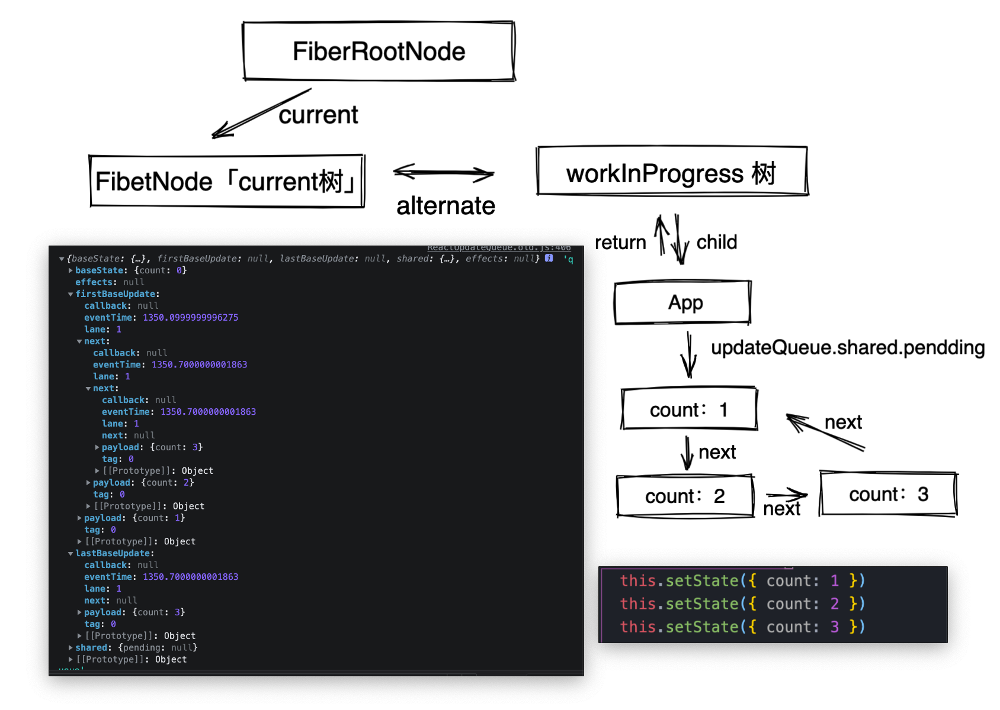

# setState 原理

本篇文章依据的版本是 React：V17.0 +

我看见现在网上很多都是讲解 React 16,15 的，因为改版太多思路不在复用。老版本的逻辑大概是，有一把“锁”—— `isBatchingUpdates 全局变量`，`isBatchingUpdates` 的初始值是 false。每当 React 调用 batchedUpdate 去执行更新动作时，会先把这个锁给“锁上”（置为 true），表明“现在正处于批量更新过程中”。当锁被“锁上”的时候，任何需要更新的组件都只能暂时进入 dirtyComponents 里排队等候下一次的批量更新，而不能随意“插队”。

React：V17.0 +  完全不一样，以下见分晓。


## state/setState 使用

```tsx
初始值简写方式： state = {name: '果汁'};
赋值比较有讲究
1.对象式setState 	语法：setState(stateChange,[callback])
  1.1 stateChange用于改变对象。
  1.2 是可选参数，它在更新完毕render后才被调用，所以能获取到改变后的值。
  
	eg：this.setState({ count: this.state.count + 1 },() => {
        console.log(this.state.count, "回调函数获取state更新后的值");
      }
    );
2.函数式setState 语法:setState(updater,[callback])
  2.1 updater 是一个返回stateChange对象的函数，可以接收到state，props。
  2.2 callback 同上 
  
  this.setState((state) => ({ count: state.count + 1 }));

总结 
		对象式写法是函数式写法的简写方式，采用那种方式看个人喜好。
    但是获取setState执行后的状态，都必须使用回调函数获取。
    不过也可以使用 setTimeout
		setTimeout(()=>{
		   this.setState({count:3})
		 },0)
setTimeout 原理：因为它是宏任务，而 React 的代码其实是同步代码，所以 React 执行完毕之后，才会继续执行 setTimeout 的逻辑，此时的 React 早已结束。
```


## setState 源码

```tsx
// 当我们修改 state的时候将会调用 setState，里面又去调用了 enqueueSetState 方法。要讲清楚这个东西，首先要清楚 Component 的初始化流程。
// /packages/react/src/ReactBaseClasses.js
Component.prototype.setState = function(partialState, callback) {
  this.updater.enqueueSetState(this, partialState, callback, 'setState');
};

// 初始化类组件
function Component(props, context, updater) {
  this.props = props;
  this.context = context;
  this.refs = emptyObject;
  // 当 updater不存在的时候，这里是赋值 ReactNoopUpdateQueue 对象，它是打酱油的，用于在不合法调用的时候报一些警告出来。
  this.updater = updater || ReactNoopUpdateQueue;
}
// 占坑的一个对象，用于不合法调用警告。
const ReactNoopUpdateQueue = {
  enqueueSetState: function(
    publicInstance,
    partialState,
    callback,
    callerName,
  ) {
    warnNoop(publicInstance, 'setState');
  },
};

// 运行阶段
// 当类组件执行构造函数的的时候，adoptClassInstance 函数将会被调用，会把this.updater 重新赋值为真正的 updater
// instance：当前类组件，
// /packages/react-reconciler/src/ReactFiberClassComponent.old.js
function adoptClassInstance(workInProgress: Fiber, instance: any): void {
  instance.updater = classComponentUpdater;
}

const classComponentUpdater = {
  enqueueSetState(inst, payload, callback) {
    const fiber = getInstance(inst);
    const eventTime = requestEventTime();
    const lane = requestUpdateLane(fiber);

    const update = createUpdate(eventTime, lane);
    update.payload = payload;
		// 处理更新队列
    enqueueUpdate(fiber, update);
    // 调度 render阶段
    scheduleUpdateOnFiber(fiber, lane, eventTime);
  },
};

// 触发阶段
// 当用户触发了更新setState就会去调用 enqueueSetState，由 scheduleUpdateOnFiber 这个方法进入 render阶段。在render阶段中，执行 beginWork 遇见类组件的时候，会去执行updateClassComponent方法，这个方法里面会去执行 updateClassInstance 「重点」，接着还会去执行diff。
// /packages/react-reconciler/src/ReactFiberBeginWork.old.js
function updateClassInstance(
  current: Fiber,
  workInProgress: Fiber,
  ctor: any,
  newProps: any,
  renderLanes: Lanes,
): boolean {
	const instance = workInProgress.stateNode;
  // 这个方法重点理解，是整个更新的比较重要的处理，会有大量的链表操作 
  processUpdateQueue(workInProgress, newProps, instance, renderLanes);
 }
```


## state 数据结构

在`fiber节点`中是存储在 **updateQueue** 中

### updateQueue

```tsx
baseState: 上次符合优先级计算后的基础值，比如{count: 0}，新的更新将依赖此值继续计算。
effects: 当 setState(update,[callback]) 中的callback 不为 null，则这里会存起来，将会在 commit 节点执行副作用。
firstBaseUpdate: 这是跳过更新的第一个值，下次将从这里开始。
lastBaseUpdate: 这是跳过更新的最后一个值，如果期间没有新的updater的话，下次将从这里结束。
shared: {pending: updater} 这里 shared.pending 记录新的更新链表，这个shared字段，是current节点与workInProgress节点共享一条更新链表。
```

### update

```tsx
callback: 当 setState(update,[callback]) 中的callback 不为 null，则这里会存起来，后面会将 updateQueue 中的 effects 以数组形式存储。
eventTime: update的产生时间，若该update一直因为优先级不够而得不到执行，那么它会超时，会被立刻执行
lane: 优先级
next: 下一个 update
payload: 更新的参数
tag: 表示更新类型「UpdateState，ReplaceState，ForceUpdate，CaptureUpdate」
```

### 数据结构

> 贴图的 `firstBaseUpdate` 的原因是它非常类似 `shared.pendding`，因为 `console.log` 是稍微会延迟一丢丢，react代码把`shared.pendding = null`，所以我只能以 `firstBaseUpdate` 代替，`shared.pendding` 是一个循环链表，其他的基本和 `firstBaseUpdate `一致，在这个例子中。



## processUpdateQueue

官网对这段代码的解析，`/packages/react-reconciler/src/ReactUpdateQueue.old.js`

```tsx
前提：要开启 concurrent 模式，如果不开启的话，是默认都是最高优先级，就会按照运行下去，
ReactDOM.unstable_createRoot(document.getElementById("root")).render(<App />)

/*
UpdateQueue is a linked list of prioritized updates.

Like fibers, update queues come in pairs: a current queue, which represents
the visible state of the screen, and a work-in-progress queue, which can be
mutated and processed asynchronously before it is committed — a form of
double buffering. If a work-in-progress render is discarded before finishing,
we create a new work-in-progress by cloning the current queue.

Both queues share a persistent, singly-linked list structure. To schedule an
update, we append it to the end of both queues. Each queue maintains a
pointer to first update in the persistent list that hasn't been processed.
The work-in-progress pointer always has a position equal to or greater than
the current queue, since we always work on that one. The current queue's
pointer is only updated during the commit phase, when we swap in the
work-in-progress.

For example:

  Current pointer:           A - B - C - D - E - F
  Work-in-progress pointer:              D - E - F
                                         ^
                                         The work-in-progress queue has
                                         processed more updates than current.
react 它会保持 current节点 和 workInProgress节点 的更新列表一致，这样下次更新的话就不会丢失。
The reason we append to both queues is because otherwise we might drop
updates without ever processing them. For example, if we only add updates to
the work-in-progress queue, some updates could be lost whenever a work-in
-progress render restarts by cloning from current. Similarly, if we only add
updates to the current queue, the updates will be lost whenever an already
in-progress queue commits and swaps with the current queue. However, by
adding to both queues, we guarantee that the update will be part of the next
work-in-progress. (And because the work-in-progress queue becomes the
current queue once it commits, there's no danger of applying the same
update twice.)

Prioritization
--------------

Updates are not sorted by priority, but by insertion; new updates are always
appended to the end of the list.

The priority is still important, though. When processing the update queue
during the render phase, only the updates with sufficient priority are
included in the result. If we skip an update because it has insufficient
priority, it remains in the queue to be processed later, during a lower
priority render. Crucially, all updates subsequent to a skipped update also
remain in the queue *regardless of their priority*. That means high priority
updates are sometimes processed twice, at two separate priorities. We also
keep track of a base state, that represents the state before the first
update in the queue is applied.

For example:

  Given a base state of '', and the following queue of updates

    A1 - B2 - C1 - D2

  where the number indicates the priority, and the update is applied to the
  previous state by appending a letter, React will process these updates as
  two separate renders, one per distinct priority level:

  First render, at priority 1:
    Base state: ''
    Updates: [A1, C1]
    Result state: 'AC'

  Second render, at priority 2:
    Base state: 'A'            <-  The base state does not include C1,
                                   because B2 was skipped.
    Updates: [B2, C1, D2]      <-  C1 was rebased on top of B2
    Result state: 'ABCD'

Because we process updates in insertion order, and rebase high priority
updates when preceding updates are skipped, the final result is deterministic
regardless of priority. Intermediate state may vary according to system
resources, but the final state is always the same.

*/
```


```tsx
// 处理更新的核心链表
export function processUpdateQueue<State>(workInProgress: Fiber,props: any,instance: any,renderLanes: Lanes): void {
  // 从workInProgress节点上取出updateQueue
  const queue = workInProgress.updateQueue

  // 上次更新遗留的开始位置的链表，优先级较低
  let firstBaseUpdate = queue.firstBaseUpdate;
  // 上次更新遗留的结束位置的链表
  let lastBaseUpdate = queue.lastBaseUpdate;
  // 新的更新链表
  let pendingQueue = queue.shared.pending;
  // 取出链表后，清空链表
  if (pendingQueue !== null) {
    // 清空当前 queud 中更新的内容，因为已经取出来了，因为异步的原因它可能还会有其他的更新队列进来。
    queue.shared.pending = null;
    // 拿到新链表
    const lastPendingUpdate = pendingQueue;
    const firstPendingUpdate = lastPendingUpdate.next;
    // 断开链表，这样就不再是循环链表
    lastPendingUpdate.next = null;
    // 拼接链表，将新的链表拼接在旧的后面
    if (lastBaseUpdate === null) {
      firstBaseUpdate = firstPendingUpdate;
    } else {
      lastBaseUpdate.next = firstPendingUpdate;
    }
    // 重置为链表最后的一个链表
    lastBaseUpdate = lastPendingUpdate;

    // 用同样的方式更新 current 上的 firstBaseUpdate 和 lastBaseUpdate（baseUpdate队列）。
    // 这样做相当于将本次合并完成的队列作为 baseUpdate 队列备份到 current 节点上
    // 因为如果本次的渲染被打断，那么下次再重新执行任务的时候，workInProgress节点复制
    // 自current节点，它上面的baseUpdate队列会保有这次的update，保证update不丢失。
    const current = workInProgress.alternate;
    if (current !== null) {
      // This is always non-null on a ClassComponent or HostRoot
      const currentQueue: UpdateQueue<State> = (current.updateQueue: any);
      const currentLastBaseUpdate = currentQueue.lastBaseUpdate;
      if (currentLastBaseUpdate !== lastBaseUpdate) {
        if (currentLastBaseUpdate === null) {
          currentQueue.firstBaseUpdate = firstPendingUpdate;
        } else {
          currentLastBaseUpdate.next = firstPendingUpdate;
        }
        currentQueue.lastBaseUpdate = lastPendingUpdate;
      }
    }
  }

  // 这里开始计算值，当遍历计算的链表结果过程中可能会更新队列会更新，这里会保存优先级状态
  // firstBaseUpdate 作为新旧已经合并的链表的第一个项
  if (firstBaseUpdate !== null) {
    // 取出上次计算后的baseState
    let newState = queue.baseState;
    // 重新定义优先级
    let newLanes = NoLanes;

    let newBaseState = null;
    let newFirstBaseUpdate = null;
    let newLastBaseUpdate = null;

    let update = firstBaseUpdate;
    do {
      const updateLane = update.lane;
      const updateEventTime = update.eventTime;
      // isSubsetOfLanes：判断当前更新的优先级（updateLane）
      // 是否在渲染优先级（renderLanes）中如果不在，说明优先级不足
      if (!isSubsetOfLanes(renderLanes, updateLane)) {
        // 优先级不足
        const clone = {
          eventTime: updateEventTime,
          lane: updateLane,

          tag: update.tag,
          payload: update.payload,
          callback: update.callback,

          next: null,
        };
        // 将优先级不足的项拼接成一个新的链表
        if (newLastBaseUpdate === null) {
          newFirstBaseUpdate = newLastBaseUpdate = clone;
          // 这个newState是这次遍历更新已经处理的了符合优先级的最后一个update，当它遇到了不符合优先级的时候就赋值到这里了。
          // 所以后面的计算的高优先级计算有什么意义呢？
          newBaseState = newState;
        } else {
          // 拼接其他的不符合优先级的
          newLastBaseUpdate = newLastBaseUpdate.next = clone;
        }
        
				// newLanes会在最后被赋值到workInProgress.lanes上，而它又最终
				// 会被收集到root.pendingLanes。
				//  再次更新时会从root上的pendingLanes中找出渲染优先级（renderLanes），
				// renderLanes含有本次跳过的优先级，再次进入processUpdateQueue时，
				// update的优先级符合要求，被更新掉，低优先级任务因此被重做
        newLanes = mergeLanes(newLanes, updateLane);
      } else {
        // 有足够优先级
        // newLastBaseUpdate !== null 说明已经存在 低优先级任务了，后面的高优先级任务需要拼接起来。
        if (newLastBaseUpdate !== null) {
          const clone = {
            eventTime: updateEventTime,
            lane: NoLane,
            tag: update.tag,
            payload: update.payload,
            callback: update.callback,

            next: null,
          };
          newLastBaseUpdate = newLastBaseUpdate.next = clone;
        }

        // 上面的当出现优先级低的时候，newState就会赋值，那么这里高优先级仍然计算，我觉得这是一种浪费。
        // 在后面，当 newLastBaseUpdate === null，进行 newBaseState = newState，在这里才会体现 newState计算的必要性。
        // 在最后面 workInProgress.memoizedState = newState，这里会将 A1 - B2 - C1 - D2，[A1,C1]计算出来在页面上显示。 
        newState = getStateFromUpdate(workInProgress,queue,update,newState,props,instance );
        // 这个callback 是 setState(updater, [callback]) 的第二个参数
        const callback = update.callback;
        // 将更新对象 放在副作用，在commit 阶段的时候进行更新
        if (callback !== null) {
          workInProgress.flags |= Callback;
          const effects = queue.effects;
          if (effects === null) {
            queue.effects = [update];
          } else {
            effects.push(update);
          }
        }
      }
      // 遍历下一个update
      update = update.next;
      // 当前的链表已经处理完毕了
      if (update === null) {
        // 检查一下有没有新进来的链表，如果有继续遍历
        pendingQueue = queue.shared.pending;
        if (pendingQueue === null) {
          // 没有就可以 break
          break;
        } else {
          // 和上面拼接的逻辑是一致的，继续遍历下去
          // An update was scheduled from inside a reducer. Add the new
          // pending updates to the end of the list and keep processing.
          const lastPendingUpdate = pendingQueue;
          // Intentionally unsound. Pending updates form a circular list, but we
          // unravel them when transferring them to the base queue.
          const firstPendingUpdate = ((lastPendingUpdate.next: any): Update<State>);
          lastPendingUpdate.next = null;
          update = firstPendingUpdate;
          queue.lastBaseUpdate = lastPendingUpdate;
          queue.shared.pending = null;
        }
      }
    } while (true);

    // 所有的链表更新完了，才会赋值最终计算的值，否则都是返回，被跳过的值
    if (newLastBaseUpdate === null) {
      newBaseState = newState;
    }
    // 将处理好的 state 和  newFirstBaseUpdate 、 newLastBaseUpdate 进行赋值吗
    queue.baseState = newBaseState
    queue.firstBaseUpdate = newFirstBaseUpdate;
    queue.lastBaseUpdate = newLastBaseUpdate;


    markSkippedUpdateLanes(newLanes);
    workInProgress.lanes = newLanes;
    // 总是显示计算好了的值，比如 A1 - B2 - C1 - D2，[A1,C1]计算出来在页面上显示。 
    workInProgress.memoizedState = newState;
  }
}
```

## [demo](https://github.com/neroneroffy/react-source-code-debug/blob/master/src/components/TasksWithDifferentPriorities/OriginDemo.js)

> 这个demo 主要突出高优先级插队的过程。前提要开启 concurrent 模式

```tsx
ReactDOM.unstable_createRoot(document.getElementById("root")).render(<App />)

class OriginDemo extends Component {
  constructor(props) {
    super(props)
    this.buttonRef = createRef()
  }
  state = {
    count: 0,
  }
  componentDidMount() {
    const button = this.buttonRef.current
    setTimeout(
      () =>
        this.setState({ count: 1 }),
      500
    )
    setTimeout(() => button.click(), 600)
    //   A2是常规优先级的更新，A1是button.click()产生高优先级的更新。
    //   A后边的数字表示优先级，lane模型中，越小优先级越高，1 > 2。
    //   updateQueue：A2 - A1
    //                1    +2
    //   以1的优先级来执行updateQueue，发现队列中第一个update A2 比当前的渲染优先级低，跳过它处理A1
    //     Base state: 0
    //     Updates: [A1]              <-  +2
    //     Result state: 2
    //
    //   以2的优先级来执行updateQueue，队列中的update都会被处理，A1之前已经被处理过一次，所以A1会以不同的优先级处理两次
    //     Base state: 0              <-  因为上次A2被跳过了，所以base state是A2之前的状态 0
    //
    //     Updates: [A2, A1]          <-  当A1被处理的时候，A2已经处理完了，在1的基础上进行+2操作
    //               1   +2
    //     Result state: 3
  }
  handleButtonClick = () => {
    this.setState((prevState) => {
      return { count: prevState.count + 2 }
    })
  }
  render() {
    return (
      <div className={"origin-demo"}>
        <p>不需要点击这个按钮，这个按钮是交给js去模拟点击用的，模拟点击之后产生的是高优先级任务</p>
        <button ref={this.buttonRef} onClick={this.handleButtonClick}>
          增加2
        </button>
        <div>
          {Array.from(new Array(10000)).map((v, index) => (
            <div key={index}>{this.state.count}</div>
          ))}
        </div>
      </div>
    )
  }
}
```


## 思考

#### 为什么需要循环链表？

参考 `hook useState` 中是如何存储状态的，理解是一样的。循环链表是为了方便插入到最后一项，仅此而已。如果换为 单向链表，是O(n)，双向链表不好维护。

#### 为什么 setState 是异步的？

需要说明的是，异步不是那种真正的异步，对于 `React 17` 以前React将改变状态的操作合并一起操作，避免频繁render造成性能浪费，合并就需要等待操作，那么看起来就像异步似的。对于 `React 17` 是因为优先级更新原因，相同优先级合并更新，不同优先级分开最后再合并。
