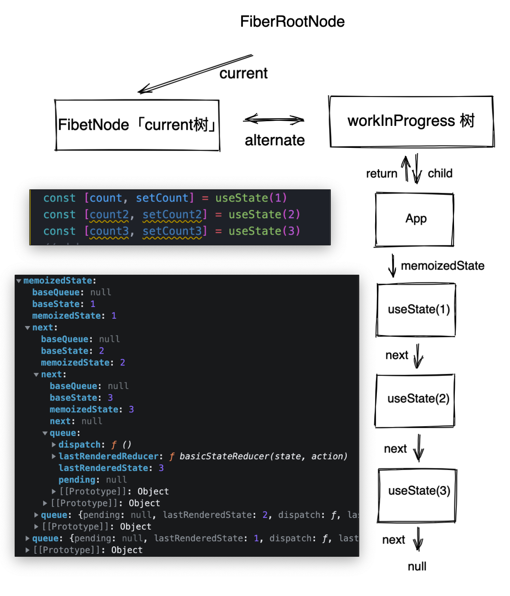
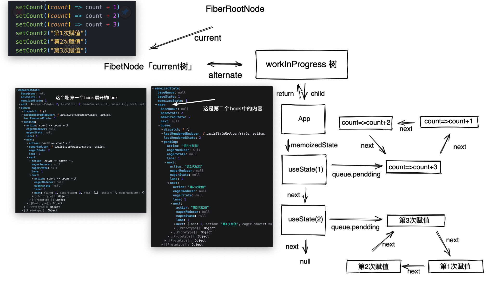
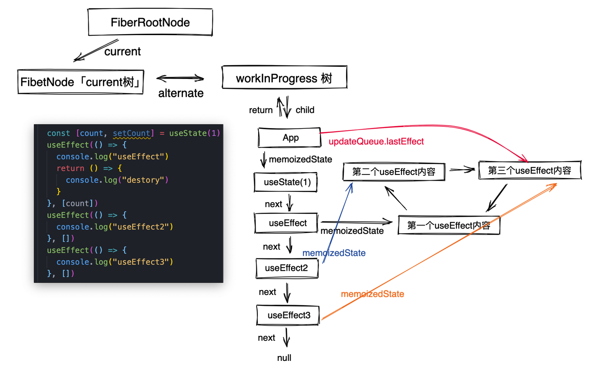
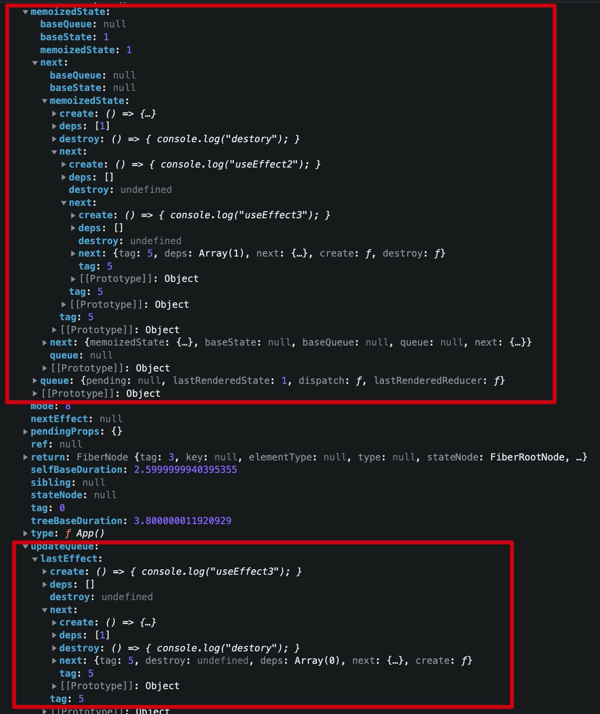

# Hook


> React Hook 是React16.8版本新特性,**函数组件更新状态都会重新执行render，state的值是会被缓存起来，不会重新初始化。**
>
> 原理：是通过遍历链表来定位每个 hooks 内容的。如果前后两次读到的链表在顺序上出现差异，那么渲染的结果是不可控的，所以使用Hook是有相应的使用规则「eslint」。
>
> 作用：代码抽离，做到可复用，增强React函数组件的能力。


## 背景

- 告别难以理解的 Class

- 解决业务逻辑难以拆分的问题

- 使状态逻辑复用变得简单可行

- 函数组件从设计思想上来看，更加契合 React 的理念


## Hooks 规则

- 只在 React 函数中调用 Hook或者在自定义 Hooks中调用其他 Hooks。

  - 自定义Hooks： JavaScript 函数中调用其他的Hooks，不能在包含逻辑语句中，并引入调用的时候必须顶层执行。

- 只在最顶层使用 Hooks，不要在循环，条件或嵌套函数中调用 Hooks，推荐启用 eslint-plugin-react-hooks插件进行强制校验。

  

**原因：不要在循环、条件或嵌套函数中调用 Hooks，确保 Hooks 在每次渲染时都保持同样的执行顺序。因为hooks 的底层是一个hook 接着一个hook 实例通过链表next连接起来的，但被代码破坏了其执行顺序，或者有些hook并没有执行就会导致 hook的状态对应不起来，就是初始化和更新执行的hook数量不一致时，控制台会提示 rendered fewer hooks than expected.this may be caused by an accidental early return statement。**


## React 内置 Hooks

### 基础的Hooks

#### State Hook

```jsx
State Hook 让函数组件也可以有state状态，并进行状态数据的读写操作，当状态发生了改变就会触发函数组件的渲染。
语法 const [xxx,setXxx] = React.useState(initValue)
 参数：第一次初始化指定的值在内部缓存
 返回值：包含2个元素的数组，第一个为内部当前状态值，第二个为更新状态的函数。
setXxx() 2种写法：
	setXxx(value) 赋值给xxx。
	setXxx(value=>newValue)参数为函数，接收原本的状态值，返回新的状态值，内部用其覆盖原来的状态。
	
function A(){
	const [count,setCount] = React.useState(0)
	
  function add(){
    setCount(count++)
    // setCount(value=>value+1)
  }
  
	return (
    <div>
    	<span> { count } </span>
      <button onClick={ add }>+ 1</button>
    </div>	
	)
}
```

#### Effect Hook

> 当操作可能产生副作用的时候，请使用 `useEffect`,因为这样可能避免 `re-render`

```tsx
Effect Hook 可以让你在函数组件中执行副作用操作
	一般用于 发ajax请求
  修改 state状态
	设置订阅/启动定时器
	手动更改真实DOM
  
useEffect(()=>{
	// 在此可以执行任何带副作用的操作
	return ()=>{
			//在组件卸载前执行，做一些收尾工作，比如清除定时器，取消订阅。
	}
},[stateValue]) // 如果指定的是[],回调函数只会在第一次render() 后执行

可以把 useEffect Hook 是类组件的三个生命周期函数的组合
componentDidMount() // 组件第一次渲染时就会执行
componentDidUpdate() // 当第二个参数不传时每次都会触发，或者传入了React.useState(xx)某个值，当值变化时才会触发。
componentWillUnmount() // 是一个参数的返回值，这里返回了一个回调函数做一些卸载出来
对于上面的理解无疑是将类组件的思想迁移过来，导致理解起来稍微困难，并且不是特别准确，何不如丢弃它，拥抱新的变化。
当 [] 中为空时：每次函数组件重新渲染都会重新执行
当 [ stateValue ]：stateValue值发生变化就会重新执行 useEffect 中的 回调函数
当 return 不为空时：组件销毁时，做一些清除操作
```

#### useContext

> 它的原理和`React类组件是相同的`，是一种跨组件传参数的解决方案。
>
> 在 React-入门文章有详解。

```tsx
const themes = {
  light: {
    foreground: "#000000",
    background: "#eeeeee"
  },
  dark: {
    foreground: "#ffffff",
    background: "#222222"
  }
};

const ThemeContext = React.createContext(themes.light);

function App() {
  return (
    <ThemeContext.Provider value={themes.dark}>
      <Toolbar />
    </ThemeContext.Provider>
  );
}

function Toolbar(props) {
  return (
    <div>
      <ThemedButton />
    </div>
  );
}

function ThemedButton() {
  const theme = useContext(ThemeContext);  
  return (    
    <button style={{ background: theme.background, color: theme.foreground }}>
      I am styled by theme context!    
    </button>
  );
}
```

### 额外的 Hooks

#### useReducer

> useState 的替代方案，在某些场景下，`useReducer` 会比 `useState` 更适用，例如 state 逻辑较复杂且包含多个子值，或者下一个 state 依赖于之前的 state 等。并且，使用 `useReducer` 还能给那些会触发深更新的组件做性能优化，因为[你可以向子组件传递 `dispatch` 而不是回调函数](https://zh-hans.reactjs.org/docs/hooks-faq.html#how-to-avoid-passing-callbacks-down) 。

```tsx
普通写法，在 reducer 可以对状态变化的时候进行一些处理，这种可以更加灵活处理数据。
const initialState = {count: 0};

function reducer(state, action) {
  switch (action.type) {
    case 'increment':
      return {count: state.count + 1};
    case 'decrement':
      return {count: state.count - 1};
    default:
      throw new Error();
  }
}

function Counter() {
  const [state, dispatch] = useReducer(reducer, initialState);
  return (
    <>
      Count: {state.count}
      <button onClick={() => dispatch({type: 'decrement'})}>-</button>
      <button onClick={() => dispatch({type: 'increment'})}>+</button>
    </>
  );
}


另外一种写法，这样做的好处主要有两个
	initialCount不用马上确认，通过传参数确认
  重置initialCount非常方便
function init(initialCount) {
  return {count: initialCount};
}

function reducer(state, action) {
  switch (action.type) {
    case 'increment':
      return {count: state.count + 1};
    case 'decrement':
      return {count: state.count - 1};
    case 'reset':
      return init(action.payload);
    default:
      throw new Error();
  }
}

function Counter({initialCount}) {
  const [state, dispatch] = useReducer(reducer, initialCount, init);
  return (
    <>
      Count: {state.count}
      <button
        onClick={() => dispatch({type: 'reset', payload: initialCount})}>
        Reset
      </button>
      <button onClick={() => dispatch({type: 'decrement'})}>-</button>
      <button onClick={() => dispatch({type: 'increment'})}>+</button>
    </>
  );
}
```


#### useCallback

> 缓存回调函数，传函数进去，返回函数，当时这个函数经过react缓存过的，所以不会每次组件重新渲染都会重新定义函数

**哪些情况函数组件会重新渲染?**

- 组件自己的state变化
- 父组件传递过来的props变化
- 父组件重新渲染了

**useCallback使用场景**

- 对于需要传递**函数**给子组件的场合，不使用useCallback的话，父组件重新渲染了子组件每次都会重新渲染
- 在调用节流、防抖函数时

```tsx
const memoizedCallback = useCallback(() => doSomething(a,b) , [a, b]);

注意：
	1.这里的 [a, b],当[a,b]内容发生改变的话，就会重新缓存。
	2.可以使用 []，那就是永久缓存。
```


#### useMemo

> 缓存变量，如果一些值的计算量很大，那么可以用useMemo来做一个缓存， 只有依赖变化时才会重新计算，而不是每次渲染时都进行计算。

```tsx
// 当a，b的值变化了，才会重新执行computeExpensiveValue，得到新的memoizedValue
const memoizedValue = useMemo(() => computeExpensiveValue(a, b), [a, b]);

注意：
	1.这里的 [a, b],当[a,b]内容发生改变的话，就会重新缓存。
	2.可以使用 []，那就是永久缓存。
```

**注意：React.memo， React.memo是对组件传进来的props进行浅比较，如果浅比较没有改变则不渲染，改变则渲染。**

```tsx
const MyComponent = React.memo(function MyComponent(props) {
  /* 使用 props 渲染 */
});
```


#### useRef

> 操作dom的hook

```tsx
Ref Hook 可以在函数组件中存储/查找组件内的标签或任意其他数据
语法 const refContainer = React.useRef()
作用：保存标签对象，功能与React.creatRef() 一样。

function TextInputWithFocusButton() {
  const inputEl = useRef(null);
  const onButtonClick = () => {
    // current 指向已挂载到 DOM 上的文本输入元素
    inputEl.current.focus();
  };
  return (
    <>
      <input ref={inputEl} type="text" />
      <button onClick={onButtonClick}>Focus the input</button>
    </>
  );
}
```


#### useImperativeHandle

> `useImperativeHandle` 可以让你在使用 `ref` 时自定义暴露给父组件的实例值。在大多数情况下，应当避免使用 ref 这样的命令式代码。`useImperativeHandle` 应当与 `forwardRef` 一起使用：

##### React. forwardRef 

> `React.forwardRef` 会创建一个React组件，这个组件能够将其接受的 [ref](https://zh-hans.reactjs.org/docs/refs-and-the-dom.html) 属性转发到其组件树下的另一个组件中。目的是为了获取跨组件的dom元素。

```tsx
// 可以转发
const FancyButton1 = React.forwardRef((props, ref) => (
	<div>
		<input ref=(ref} />
		<button> { props.children } </ button>
</div>
));


function Aрр() {
	const ref = React.createRef();
	const handleClick = React.useCallback(() => ref.current. focus(),[])
	return <div>
		<FancyButton ref={ ref }>Click me !</FancyButton>
		<button onClick={ handleClick }>获取焦点</ but ton>
</div>
}
```

##### useImperativeHandle

> 简要理解就是通过父组件访问子组件的实例，包括状态也可以。
>

```tsx
function FancyInput(props, ref) {
	const inputRef = useRef();
	useImperativeHandle(ref, () => ({
		focus: () => {
			inputRef.current.focus();
  }
	}));
	return <input ref={inputRef} />;
}

// 目的就是用于forwardRef 的参数。返回的 FancyInput 是具备forwardRef 功能的函数组件。
// 也就是下面使用中可以传递refs 的组件。

FancyInput = forwardRef(FancyInput);
const App = props => {
	const fancyInputRef = useRef();
	return <div>
		<FancyInput ref={ fancyInputRef} />
		<button onClick={() => fancyInputRef.current.focus( )}>父组件调用子组件的focus</button>
	</div>
}
```


**注意：useImperativeHandle 以前名称为 useImperativeMethod**

#### useLayoutEffect

> useEffect和useLayoutEffect的执行时机不一样，前者被异步调度，当页面渲染完成后再去执行，不会阻塞页面渲染。 后者是在commit阶段新的DOM准备完成，但还未渲染到屏幕之前，同步执行，会阻塞页面渲染。

```tsx
useEffect(() => {
	console.log( 'from Effect') 
}, [])

useLayoutEffect(() => {
	console.log( 'from layoutEffect')
}, [])

// from layoutEffect
// from Effect
就是先执行 useLayoutEffect 比 useEffect 先执行。
```


#### useDebugValue

> `seDebugValue` 可用于在 React 开发者工具中显示自定义 hook 的标签。
>
> 它的价值在于，当我们console.log 的时候会有一定的耗时，它可以在开发工具上面看见状态的变化，可以使用多次。

```tsx
function useFriendStatus(friendID) {
  const [isOnline, setIsOnline] = useState(null);

  // ...

  // 在开发者工具中的这个 Hook 旁边显示标签  // e.g. "FriendStatus: Online"  
  useDebugValue(isOnline ? 'Online' : 'Offline');
  return isOnline;
}
```

# [ahook「非内置Hooks」](https://ahooks.js.org/zh-CN/)

> 一个阿里出的hooks，有很多。


# 自定义Hooks

> hook的思想都是一致的，自定义 Hook，可以按照业务逻辑将组件逻辑提取到可重用的函数中。

### 约定

```
1.创建了一个 useXXX 的函数，但是内部并没有用任何其它 Hooks，那么这个函数就不是一个 Hook，而只是一个普通的函数。但是如果用了其它 Hooks ，那么它就是一个 Hook。
2.名字一定是以 use 开头的函数，这样 React 才能够知道这个函数是一个 Hook，有eslint校验；
函数内部一定调用了其它的 Hooks，可以是内置的 Hooks，也可以是其它自定义 Hooks。这样才能够让组件刷新，或者去产生副作用。
```


# 源码分析

在 `/packages/react/src/ReactHooks.js` 找到相应的 hook，全部都定义在这个文件中，它们都会被挂载到React实例上面。这样我们就可以通过 `React.useState` 方式调用。但是最后面真正的源码放在 `/packages/react-reconciler/src/ReactFiberHooks.old.js`,下面会解析。

## useState

> 以 `useState` 把 hook 从挂载到更新说清楚，剩余的 `hook` 就类似差不多了。

```tsx
/packages/react/src/ReactHooks.js
export function useState<S>(initialState: (() => S) | S,): [S, Dispatch<BasicStateAction<S>>] {
  const dispatcher = resolveDispatcher();
  return dispatcher.useState(initialState);
}


function resolveDispatcher() {
  // 一开始 ReactCurrentDispatcher.current 是为null，会在beginWork的时候将其赋值相应的hook，分为挂载阶段、更新阶段
  const dispatcher = ReactCurrentDispatcher.current;
  return dispatcher;
}

const ReactCurrentDispatcher = {
  /**
   * @internal
   * @type {ReactComponent}
   */
  current: (null: null | Dispatcher),
};

在上面执行完后，你会发现 current === null，正常应该是调用useState的方法才对吧？,要想解决这个问题得从 render 阶段中的 beginWork说出起。
在 packages/react-reconciler/src/ReactFiberBeginWork.old.js 中的 beginWork 方法中，有一段这样的代码。
function beginWork(){
 switch (workInProgress.tag) {
    // tag：2,
    case IndeterminateComponent: {
      return mountIndeterminateComponent( current, workInProgress,  workInProgress.type, renderLanes,);
    }
    ...
 }  
}

function mountIndeterminateComponent(_current,workInProgress,Component,renderLanes) {
  let value;
  value = renderWithHooks(  null,  workInProgress,  Component,  props,  context,  renderLanes);
  ...
}
  
// renderWithHooks 才是决定 ReactCurrentDispatcher.current 是决定赋值 挂载的 hook 还是更新的 hook
export function renderWithHooks<Props, SecondArg>(
  current: Fiber | null,
  workInProgress: Fiber,
  Component: (p: Props, arg: SecondArg) => any,
  props: Props,
  secondArg: SecondArg,
  nextRenderLanes: Lanes,
): any {
   // 对 ReactCurrentDispatcher.current 赋值 HooksDispatcherOnMount 或者  HooksDispatcherOnUpdate
    ReactCurrentDispatcher.current =
      current === null || current.memoizedState === null
        ? HooksDispatcherOnMount
        : HooksDispatcherOnUpdate;

  // 执行函数组件，将同步逻辑全部执行，包括hook，返回jsx 中的 ReactElement中的元素，也叫做虚拟dom
  let children = Component(props, secondArg); 
  // 到这里重新设置 throwInvalidHookError 报错方法。
  ReactCurrentDispatcher.current = ContextOnlyDispatcher;
  return children;
}
  
这样设计有什么好处呢？ 搞那么复杂
可以限制开发者在非函数组件中使用hook，这样就可以报一下错出来，因为此时 ReactCurrentDispatcher.current 在 Component 函数执行前 挂载的 hook了，当执行完后又把它进行重新设置一些占位的 EroorCallback。


到这里之后，当我们页面上使用了 useState 之后，就可以出发挂载阶段的代码。也就是 dispatcher.useState(initialState)
```

###  挂载 useState

> 由上面得知函数组件会调用 `Component(props, secondArg)`，它的本质就是执行函数组件 ,最终调用 `const [state,setState] = useState()`，后面则会调用 `dispatcher.useState(initialState)`，调用挂载阶段的 `mountState`，在 `/packages/react-reconciler/src/ReactFiberHooks.old.js`
>
> hook 是挂载阶段和更新阶段的逻辑是不一样的，所以在 ReactCurrentDispatcher.current 赋值的时候就有所区分。

```tsx
挂载阶段的 hooks
const HooksDispatcherOnMount: Dispatcher = {
  readContext,
  useCallback: mountCallback,
  useContext: readContext,
  useEffect: mountEffect,
  useImperativeHandle: mountImperativeHandle,
  useLayoutEffect: mountLayoutEffect,
  useMemo: mountMemo,
  useReducer: mountReducer,
  useRef: mountRef,
  useState: mountState,
  useDebugValue: mountDebugValue,
  useDeferredValue: mountDeferredValue,
  useTransition: mountTransition,
  useMutableSource: mountMutableSource,
  useOpaqueIdentifier: mountOpaqueIdentifier,
  unstable_isNewReconciler: enableNewReconciler,
};

更新阶段的hooks
const HooksDispatcherOnUpdate: Dispatcher = {
  readContext,
  useCallback: updateCallback,
  useContext: readContext,
  useEffect: updateEffect,
  useImperativeHandle: updateImperativeHandle,
  useLayoutEffect: updateLayoutEffect,
  useMemo: updateMemo,
  useReducer: updateReducer,
  useRef: updateRef,
  useState: updateState,
  useDebugValue: updateDebugValue,
  useDeferredValue: updateDeferredValue,
  useTransition: updateTransition,
  useMutableSource: updateMutableSource,
  useOpaqueIdentifier: updateOpaqueIdentifier,
  unstable_isNewReconciler: enableNewReconciler,
};

// Hooks 链表将会挂载到 fiber 下面 memoizedState 字段中, 当前的 workInProgressHook 属于当前的 fiber 。
let workInProgressHook: Hook | null = null;
// 正在渲染的Fiber，后面会讲 currentlyRenderingFiber.memoizedState = workInProgressHook 记录所有的hook构成的链表
let currentlyRenderingFiber: Fiber = (null: any);


// 挂载state
// 接收一个 S，它可以是函数，必须返回值，也可以是一个值
// 返回S，和一个 Dispatch
function mountState<S>( initialState: (() => S) | S,): [S, Dispatch<BasicStateAction<S>>] {
  // 创建 hook 数据结构，形成 hook 链表，方法在下面展开
  const hook = mountWorkInProgressHook();
  // 如果是函数执行，然后获取值
  if (typeof initialState === 'function') {
    initialState = initialState();
  }

  hook.memoizedState = hook.baseState = initialState;
  const queue = (hook.queue = {
    pending: null, // queue 中更新的内容
    dispatch: null, //  更新函数
    lastRenderedReducer: basicStateReducer, // 用于得到最新的 state
    lastRenderedState: (initialState: any), // 最后一次得到的 state
  });
  // dispatchAction 下面会在更新阶段展开，这里只需要记住，这里返回出去的是一个经过传递参数绑定后的新函数即可
  const dispatch: Dispatch<BasicStateAction<S>> = (queue.dispatch = (dispatchAction.bind(
    null,
    currentlyRenderingFiber,
    queue,
  ): any));
  return [hook.memoizedState, dispatch];
}

//  创建 hook 数据结构，形成 hook 链表
function mountWorkInProgressHook(): Hook {
  const hook: Hook = {
    memoizedState: null, // 记录当前 hook 的值
    baseState: null, // 记录了被跳过的update节点之前计算出的state
    baseQueue: null, // 记录了被跳过的baseQueue节点之前遍历过 剩下的 queue
    queue: null, // 更新的链表
    next: null, // 指向下一个 hook
  };

  if (workInProgressHook === null) {
    // This is the first hook in the list
    currentlyRenderingFiber.memoizedState = workInProgressHook = hook;
  } else {
    // Append to the end of the list
    workInProgressHook = workInProgressHook.next = hook;
  }
  return workInProgressHook;
}


```

挂载阶段结束后，数据结构应该长这样。




### 更新 useState

> 状态挂载上去后，那怎么触发更新呢？原因是因为当我们挂载的时候，bind 一个方法，返回一个函数，当时我们函数组件或用户主动去触发调用 `dispatchAction`，就会走下面的逻辑，进而走函数组件重新渲染逻辑，是从`render阶段`开始的。

```tsx
// 更新触发的起始方法。
// fiber：hook 挂载的对应的fiber
// queue：更新列表
// action：调用 useState 传进来的参数
function dispatchAction<S, A>(fiber: Fiber,queue: UpdateQueue<S, A>, action: A) {
  const update: Update<S, A> = {
    lane, // 1
    action, // 对应的值或函数
    eagerReducer: null,
    eagerState: null,
    next: (null: any),
  };

  // 获取更新的数据
  const pending = queue.pending;
  if (pending === null) {
    // 构建循环链表
    update.next = update;
  } else {
    // 维护好循环链表
    // 将 update 指向 pedding.next，
    update.next = pending.next;
    // pending.next 又重新指向到 update
    pending.next = update;
  }
  // 链表的入口就是上次最新的值
  queue.pending = update;

  // 进入 render 阶段，走更新流程，后面会批量更新状态的,后面回去调用 updateState
  scheduleUpdateOnFiber(fiber, lane, eventTime);
  }
}


// 更新 State
// 接收一个 S，它可以是函数，必须返回值，也可以是一个值
// 返回S，和一个 Dispatch
function updateState<S>(initialState: (() => S) | S,): [S, Dispatch<BasicStateAction<S>>] {
  return updateReducer(basicStateReducer, (initialState: any));
}


// 更新state主要处理逻辑，这里的处理逻辑是和 setState 是非常相似的，可以参考 setState 的详细解析。
function updateReducer<S, I, A>(
  reducer: (S, A) => S, // basicStateReducer
  initialArg: I, // 初始值
  init?: I => S, // undefined
): [S, Dispatch<A>] {
  // 获取更新的hook
  const hook = updateWorkInProgressHook();
  const queue = hook.queue;
  queue.lastRenderedReducer = reducer;

  // 当前正在渲染的 hook，或者可以理解为旧的。
  const current: Hook = (currentHook: any);

  // The last rebase update that is NOT part of the base state.
  // baseQueue 是上次更新中断了 剩下的还没有更新的链表
  let baseQueue = current.baseQueue;

  // The last pending update that hasn't been processed yet.
  // 等待更新queue
  const pendingQueue = queue.pending;
  if (pendingQueue !== null) {
    // We have new updates that haven't been processed yet.
    // We'll add them to the base queue.
    // 合并链表，上次没有更新完的和这次又有新的链表进来，需要将新、旧依次连接起来
    if (baseQueue !== null) {
      // Merge the pending queue and the base queue.
      const baseFirst = baseQueue.next;
      const pendingFirst = pendingQueue.next;
      baseQueue.next = pendingFirst;
      pendingQueue.next = baseFirst;
    }
    current.baseQueue = baseQueue = pendingQueue;
    queue.pending = null;
  }

  if (baseQueue !== null) {
    // We have a queue to process.
    // 链表的头部，也就是第一个使用 setState 方法的值
    const first = baseQueue.next;
    // 以前的state
    let newState = current.baseState;

    let newBaseState = null;
    let newBaseQueueFirst = null;
    let newBaseQueueLast = null;
    let update = first;
    do {
      const updateLane = update.lane;
      if (!isSubsetOfLanes(renderLanes, updateLane)) {
        // 优先级不足. 跳过更新. 之前的 state、update，会作为一个base状态，下次使用
        const clone = {
          lane: updateLane,
          action: update.action,
          eagerReducer: update.eagerReducer,
          eagerState: update.eagerState,
          next: null,
        };
        // 将低优先级放在 baseQueue 连接起来
        if (newBaseQueueLast === null) {
          newBaseQueueFirst = newBaseQueueLast = clone;
          newBaseState = newState;
        } else {
          newBaseQueueLast = newBaseQueueLast.next = clone;
        }
        // Update the remaining priority in the queue.
        // TODO: Don't need to accumulate this. Instead, we can remove
        // renderLanes from the original lanes.
        // 处理优先级问题
        currentlyRenderingFiber.lanes = mergeLanes( currentlyRenderingFiber.lanes, updateLane );
        markSkippedUpdateLanes(updateLane);
      } 
      // 有足够优先级去计算值
      else {
        // 记录被跳过的update，下次更新的时候执行
        if (newBaseQueueLast !== null) {
          const clone = {
            lane: NoLane,
            action: update.action,
            eagerReducer: update.eagerReducer,
            eagerState: update.eagerState,
            next: any,
          };
          newBaseQueueLast = newBaseQueueLast.next = clone;
        }

        // Process this update.
        // 如果之前有计算好值，直接使用即可。
        if (update.eagerReducer === reducer) {
          // If this update was processed eagerly, and its reducer matches the
          // current reducer, we can use the eagerly computed state.
          newState = ((update.eagerState: any): S);
        } else {
          // 计算值
          const action = update.action;
          newState = reducer(newState, action);
        }
      }
      // 下一个链表
      update = update.next;
    } while (update !== null && update !== first);

    if (newBaseQueueLast === null) {
      newBaseState = newState;
    } else {
      newBaseQueueLast.next = (newBaseQueueFirst: any);
    }

    // 更新值 
    hook.memoizedState = newState;
    hook.baseState = newBaseState;
    hook.baseQueue = newBaseQueueLast;

    queue.lastRenderedState = newState;
  }

  // 返回
  const dispatch: Dispatch<A> = (queue.dispatch: any);
  return [hook.memoizedState, dispatch];
}
```

至此，useState 的更新状态的数据结构应该是这样的。



## useReducer

>  其实 `useReducer` 和  `useState` 是有很大的相似性的，这里就不在进行讲解太多。
>
> 最大的区别就是 挂载的时候需要对 reducer 进行接收。

```tsx
function mountReducer<S, I, A>(reducer: (S, A) => S,initialArg: I,init?: I => S,): [S, Dispatch<A>] {
  const hook = mountWorkInProgressHook();
  let initialState;
  if (init !== undefined) {
    initialState = init(initialArg);
  } else {
    initialState = ((initialArg: any): S);
  }
  hook.memoizedState = hook.baseState = initialState;
  const queue = (hook.queue = {
    pending: null,
    dispatch: null,
    lastRenderedReducer: reducer,
    lastRenderedState: (initialState: any),
  });
  const dispatch: Dispatch<A> = (queue.dispatch = (dispatchAction.bind(
    null,
    currentlyRenderingFiber,
    queue,
  ): any));
  return [hook.memoizedState, dispatch];
}
```


## useEffect

componentUpdateQueue 最终会赋值到 fiber 节点下面的 updateQueue 下面，它和setState 共用一个属性，最后都是在commit 阶段执行副作用。

注意点：`useEffect` 和 `useLayoutEffect` 有什么区别。

`useEffect` ：在 `before Mutation阶段` 进行调度，在`layout阶段` 填充effect执行数组，当`commit` 主流程阶段结束了，由 `schedule` 执行 `useEffect`，它是异步执行的，不会阻塞渲染。

`useLayoutEffect`：在` layout阶段`执行，销毁和 `useEffect`是一样的，会堵塞渲染，和 componentDidMount、componentDidUpdate执行时机是一样的。


### 挂载 useEffect

> useEffect 的 **memoizedState 和** useState、useReducer不一样，它们都是记录普通的值或者是函数。而 useEffect  的memoizedState 长这样的：
>
> - **create**: *() => { console.log("useEffect"); }*  这是useEffect 的第一个参数
> - **deps**: [1]   第二个参数，依赖项，这个依赖项是已经计算了的，所以他一定会比 useState 慢
> - **destroy**: *() => { console.log("destory"); }* 销毁时触发的函数
> - **next**: {tag: 5, destroy: undefined, deps: Array(0), next: {…}, create: *ƒ*}   构成一个循环链表，如果多个useEffect 它们会拼接起来
> - **tag**: 5  优先级


**注意 `memoizedState` 是指 hook 链表里面的 `memoizedState`，它是记录hook值**，因为在 `fiber` 里 也有一个`memoizedState`，这个是记录 `hook 链表`的

```tsx
const Update =  0b000000000000000100;
const Passive = 0b100;
function mountEffect(create: () => (() => void) | void,deps: Array<mixed> | void | null): void {
  return mountEffectImpl( UpdateEffect | PassiveEffect, HookPassive, create, deps);
}

function mountEffectImpl(fiberFlags, hookFlags, create, deps): void {
  // 构成 hook 链表
  const hook = mountWorkInProgressHook();
  const nextDeps = deps === undefined ? null : deps;
  currentlyRenderingFiber.flags |= fiberFlags;
  // 将 useEffect 收集起来，并构成一个循环链表，在  fiberNode 下面 updateQueue
  hook.memoizedState = pushEffect(HookHasEffect | hookFlags,create,undefined,nextDeps);
}

function pushEffect(tag, create, destroy, deps) {
  const effect: Effect = {
    tag,
    create,
    destroy,
    deps,
    // Circular
    next: (null: any),
  };
  // 组件更新链表
  let componentUpdateQueue: null | FunctionComponentUpdateQueue = (currentlyRenderingFiber.updateQueue: any);
  // 在当前函数组件的fiber节点上面 对应的 updateQueue字段，构成一个循环链表，把所有的 useEffect 收集起来
  if (componentUpdateQueue === null) {
    componentUpdateQueue = createFunctionComponentUpdateQueue();
    currentlyRenderingFiber.updateQueue = (componentUpdateQueue: any);
    componentUpdateQueue.lastEffect = effect.next = effect;
  } else {
    const lastEffect = componentUpdateQueue.lastEffect;
    if (lastEffect === null) {
      componentUpdateQueue.lastEffect = effect.next = effect;
    } else {
      const firstEffect = lastEffect.next;
      lastEffect.next = effect;
      effect.next = firstEffect;
      componentUpdateQueue.lastEffect = effect;
    }
  }
  return effect;
}
```

useEffect 的数据结构应该长这样。






### 更新 useEffect 

```tsx
function updateEffect(create: () => (() => void) | void,deps: Array<mixed> | void | null): void {
  return updateEffectImpl(
    UpdateEffect | PassiveEffect,
    HookPassive,
    create,
    deps,
  );
}

function updateEffectImpl(fiberFlags, hookFlags, create, deps): void {
  const hook = updateWorkInProgressHook();
  const nextDeps = deps === undefined ? null : deps;
  let destroy = undefined;

  if (currentHook !== null) {
    const prevEffect = currentHook.memoizedState;
    destroy = prevEffect.destroy;
    if (nextDeps !== null) {
      const prevDeps = prevEffect.deps;
      // 如果相等 则打上 hookFlags ，在commit 阶段跳过 执行
      if (areHookInputsEqual(nextDeps, prevDeps)) {
        pushEffect(hookFlags, create, destroy, nextDeps);
        return;
      }
    }
  }

  currentlyRenderingFiber.flags |= fiberFlags;
  // HookHasEffect | hookFlags 再次判断是否需要更新，在 commit 阶段处理
  hook.memoizedState = pushEffect( HookHasEffect | hookFlags, create, destroy,  nextDeps);
}


// 判断数组两个值是否相等，如果不相等 返回false
function areHookInputsEqual(
  nextDeps: Array<mixed>,
  prevDeps: Array<mixed> | null,
) {
  for (let i = 0; i < prevDeps.length && i < nextDeps.length; i++) {
    if (is(nextDeps[i], prevDeps[i])) {
      continue;
    }
    return false;
  }
  return true;
}

```


## useMemo


### 挂载 useMemo 

```tsx
function mountMemo<T>(nextCreate: () => T, deps: Array<mixed> | void | null): T {
  const hook = mountWorkInProgressHook();
  const nextDeps = deps === undefined ? null : deps;
  const nextValue = nextCreate();
  hook.memoizedState = [nextValue, nextDeps];
  return nextValue;
}
```

### 更新 useMemo 

```tsx
function updateMemo<T>(nextCreate: () => T,deps: Array<mixed> | void | null): T {
  // 当前对应的hook
  const hook = updateWorkInProgressHook();
  // 新的状态
  const nextDeps = deps === undefined ? null : deps;
  // 旧状态
  const prevState = hook.memoizedState;
  if (prevState !== null) {
    // Assume these are defined. If they're not, areHookInputsEqual will warn.
    if (nextDeps !== null) {
      const prevDeps: Array<mixed> | null = prevState[1];
      // 判断 nextDeps，prevDeps 是否相等，相等返回之前的状态
      if (areHookInputsEqual(nextDeps, prevDeps)) {
        return prevState[0];
      }
    }
  }
  // 到这里就重新求值
  const nextValue = nextCreate();
  hook.memoizedState = [nextValue, nextDeps];
  return nextValue;
}
```


## useCallback


### 挂载 useCallback 

```tsx
function mountCallback<T>(callback: T, deps: Array<mixed> | void | null): T {
  const hook = mountWorkInProgressHook();
  const nextDeps = deps === undefined ? null : deps;
  hook.memoizedState = [callback, nextDeps];
  return callback;
}
```


### 更新 useCallback 

```tsx
function updateCallback<T>(callback: T, deps: Array<mixed> | void | null): T {
  const hook = updateWorkInProgressHook();
  const nextDeps = deps === undefined ? null : deps;
  const prevState = hook.memoizedState;
  if (prevState !== null) {
    if (nextDeps !== null) {
      const prevDeps: Array<mixed> | null = prevState[1];
      // 如果值相等，返回上次的 callback
      if (areHookInputsEqual(nextDeps, prevDeps)) {
        return prevState[0];
      }
    }
  }
  // 不相等，重新返回新的
  hook.memoizedState = [callback, nextDeps];
  return callback;
}
```


## useRef


### 挂载 useRef 

```tsx
function mountRef<T>(initialValue: T): {|current: T|} {
  const hook = mountWorkInProgressHook();
  const ref = {current: initialValue};
  hook.memoizedState = ref;
  return ref;
}
```

### 更新 useRef 

```tsx
function updateRef<T>(initialValue: T): {|current: T|} {
  const hook = updateWorkInProgressHook();
  return hook.memoizedState;
}
```


## useContext

# 问题

**1.为什么不能在函数组件外部使用Hooks**

**2.React Hooks的状态保存在哪里**

**3.为什么传入两次相同的状态，函数组件不更新**

**4.函数组件的useState和类组件的setState有什么区别**

https://zh-hans.reactjs.org/docs/hooks-reference.html)