# React 事件系统

在 `completeWork` 方法中，做了其中的一件事是给 DOM 节点设置属性（finalizeInitialChildren），正是事件系统的起始点。

`/packages/react-dom/src/client/ReactDOMHostConfig.js`

```tsx
export function finalizeInitialChildren(domElement: Instance,type: string,props: Props, rootContainerInstance: Container, hostContext: HostContext): boolean {
  // domElement: dom 节点
  // type：标签类型
  // rootContainerInstance： <div id='root'> ... </div>
  setInitialProperties(domElement, type, props, rootContainerInstance);
  return shouldAutoFocusHostComponent(type, props);
}
```

# React16

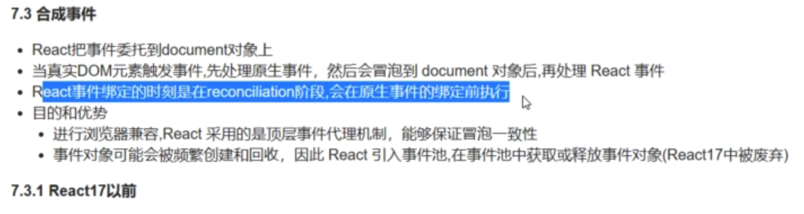


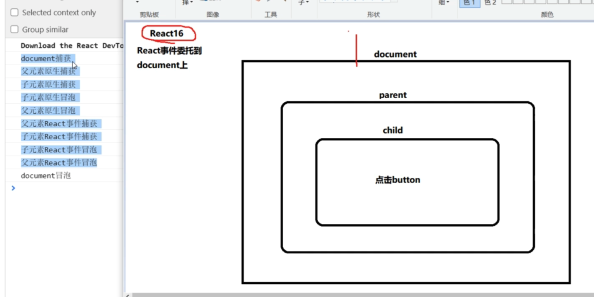

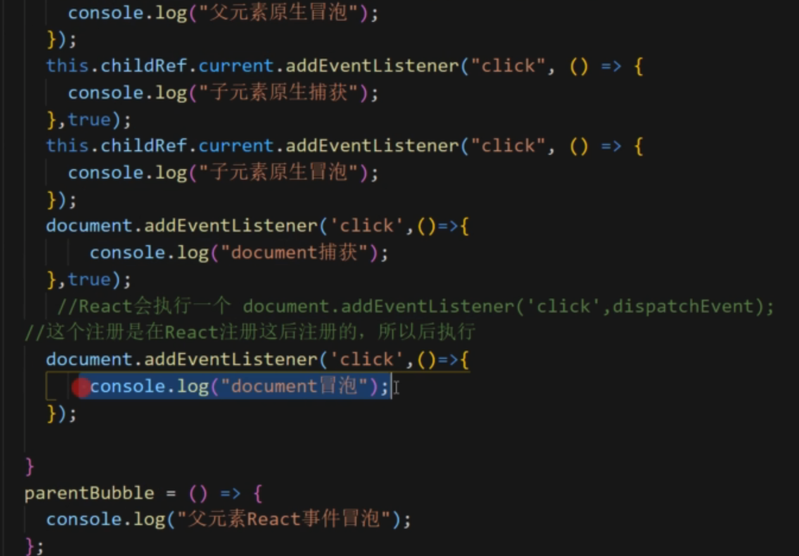


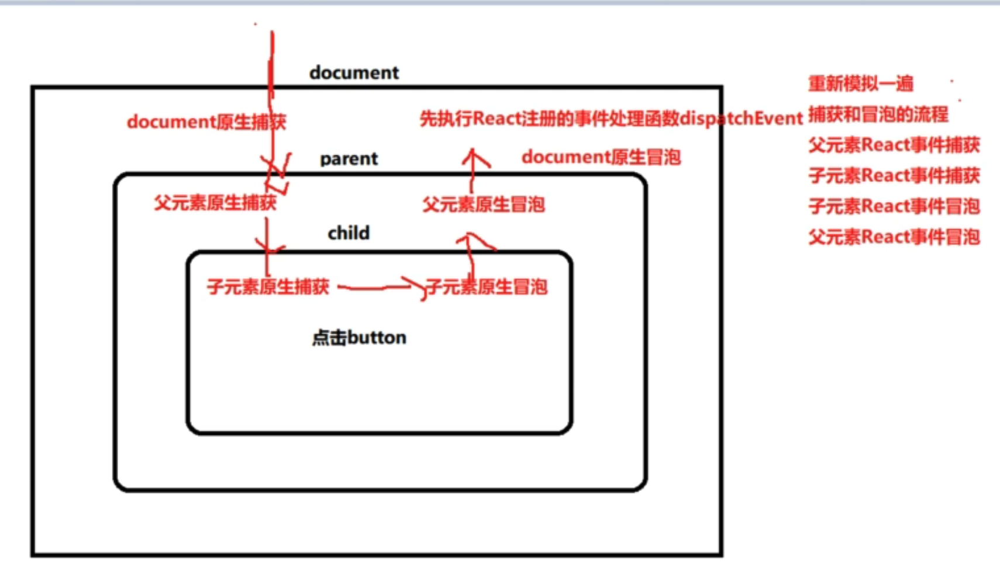

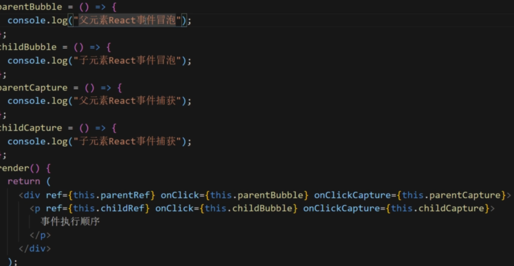

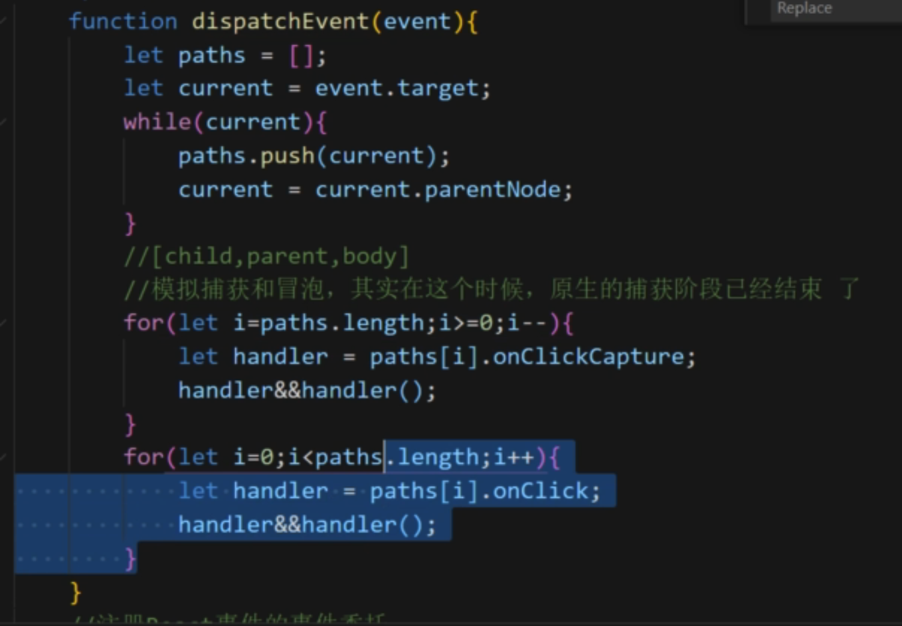

# React 17

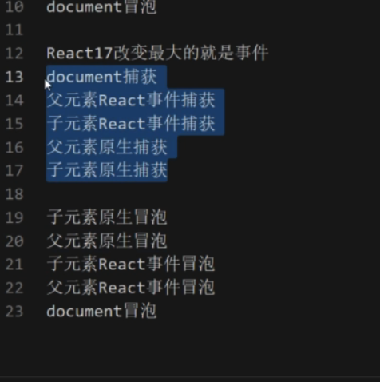

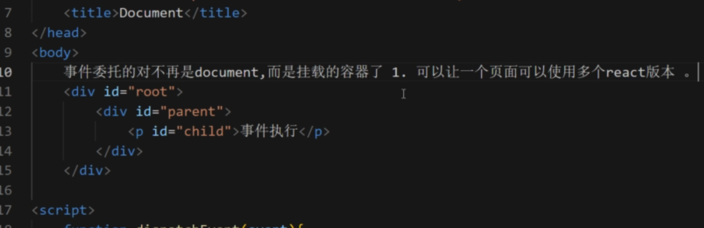

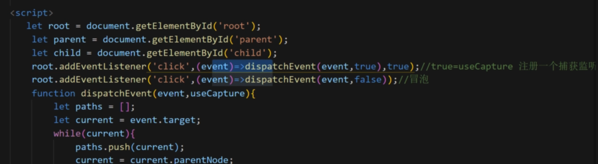

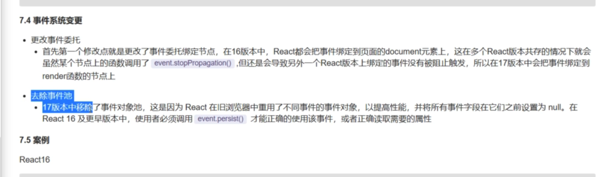

案例

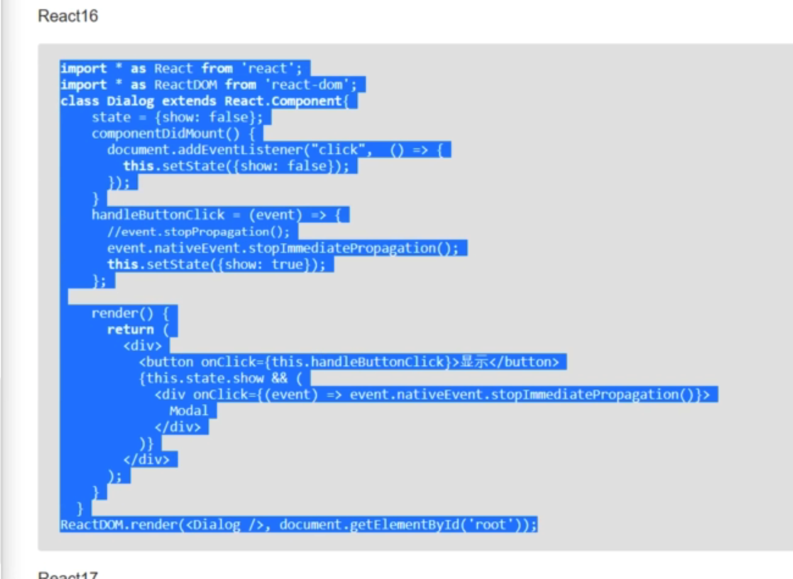

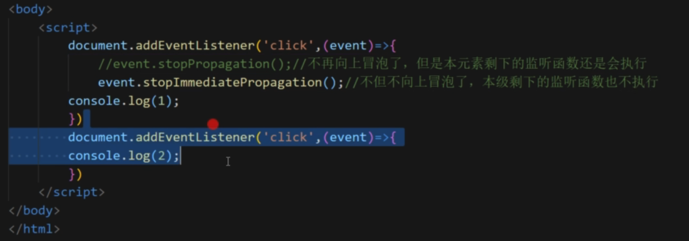
