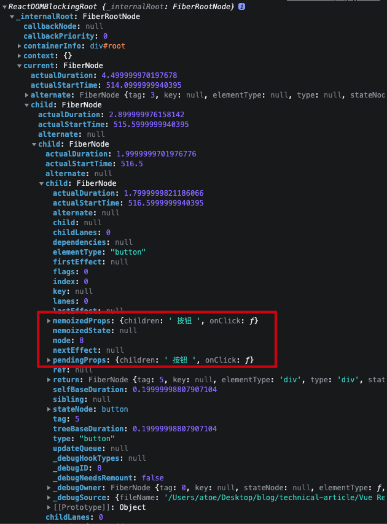

# React 事件系统


## 为什么 React 要有事件系统，原生DOM不行？

- 合成事件是 React 自定义的事件对象，它符合W3C规范，在底层抹平了不同浏览器的差异，在上层面向开发者暴露统一的、稳定的、与 DOM 原生事件相同的事件接口。开发者们由此便不必再关注烦琐的兼容性问题，可以专注于业务逻辑的开发。
- 自研事件系统使 React 牢牢把握住了事件处理的主动权：拿 React 来说，举两个大家都比较熟悉的例子，比如说它想在事件系统中处理 Fiber 相关的优先级概念，或者想把多个事件揉成一个事件（比如 onChange 事件），原生 DOM 会帮它做吗？不会，因为原生讲究的就是个通用性。而 React 想要的则是“量体裁衣”，通过自研事件系统，React 能够从很大程度上干预事件的表现，使其符合自身的需求。


## fiber 与注册的事件

> 由图知道fiber对象上的。`memoizedProps`和 `pendingProps` 存储的注册的合成事件。

那什么是合成事件呢？

我理解是只要在 `jsx` 上面注册的事件都是合成事件，如果通过 `ref` 注册的事件是原生事件，因为它是通过真实dom节点注册的。

虽然合成事件并不是原生 DOM 事件，但它保存了原生 DOM 事件的引用。当你需要访问原生 DOM 事件对象时，可以通过合成事件对象的 e.nativeEvent 属性获取到它




# React 16

React16 和 React 17 事件系统是有所改动的，所以分开理解。

- React 把事件委托到document对象上，当真实DOM元素触发事件，先处理原生事件「会被React 底层替换为空函数」，然后冒泡到document对象后，再处理 `React事件`。
- React事件绑定的是在Reconciliation阶段，会在原生事件的绑定前执行。

目的和优势

- 进行浏览器兼容，React采用顶层事件代理机制，能够抹平各大浏览器的兼容问题
- 事件对象可能会被频繁创建和回收，因此React 引入事件池，在事件池中获得或释放事件对象（React17中被废弃）

```tsx
<document>
	<div  id="farther" ref={fartherRef} onClick={fartherClick} onClickCapture={fartherClickCapture}>
	    <p id="son" ref={sonRef} onClick={sonClick} onClickCapture={sonClickCapture}> 儿子 </p>
	</div>
</document>

document 事件捕获
父元素原生事件捕获
子元素原生事件捕获
子元素原生事件冒泡
父元素原生事件冒泡
父元素 React 事件捕获
子元素 React 事件捕获
子元素 React 事件冒泡
父元素 React 事件冒泡
document 事件冒泡
```


## 模拟React16 底层

```html
<!DOCTYPE html>
<html lang="en">
  <head>
    <meta charset="UTF-8" />
    <meta http-equiv="X-UA-Compatible" content="IE=edge" />
    <meta name="viewport" content="width=device-width, initial-scale=1.0" />
    <title>Document</title>
  </head>
  <body>
    <div id="father">
      <p id="son">儿子</p>
    </div>
    <script>
      const father = document.getElementById("father")
      const son = document.getElementById("son")

      document.addEventListener("click",() => {console.log("document原生捕获")},true)
      father.addEventListener("click",() => {  console.log("父元素原生捕获")},true)
      son.addEventListener("click",() => {  console.log("子元素原生捕获")},true)
      son.addEventListener("click",() => {  console.log("子元素原生冒泡")},false)
      father.addEventListener("click",() => {  console.log("父元素原生冒泡")},false)
      // 模拟 React 16 合成事件
      document.addEventListener(
        "click",
        (e) => {
          // [p#son, div#father, body, html, document]
          const paths = []
          let current = e.target
          while (current) {
            paths.push(current)
            current = current.parentNode
          }
          // 模拟捕获事件
          for (let index = paths.length - 1; index >= 0; index--) {
            const handler = paths[index].onClickCapture
            handler && handler()
          }
          // 模拟冒泡
          for (let index = 0; index < paths.length - 1; index++) {
            const handler = paths[index].onClick
            handler && handler()
          }
        },
        false
      )
      document.addEventListener("click",() => {  console.log("document原生冒泡")},false)
      // 模拟 React 注册事件
      father.onClickCapture = () => {console.log("父元素 React 事件捕获")}
      son.onClickCapture = () => {console.log("子元素 React 事件捕获")}
      son.onClick = () => {console.log("子元素 React 事件冒泡") }
      father.onClick = () => { console.log("父元素 React 事件冒泡")}
    </script>
  </body>
</html>

```


# React 17

事件委托不再是document，而是挂载的容器。这样的好处可以让一个页面可以使用多个React版本

更改事件委托

去除事件池，17版本中移除了事件池，这是因为React在旧浏览器中重用了不同事件的事件对象，以提高性能，并将所有事件字段在它们之前设置为null，

```tsx
<div id="root">
	<div id="farther" ref={fartherRef} onClick={fartherClick} onClickCapture={fartherClickCapture}>
	    <p id="son" ref={sonRef} onClick={sonClick} onClickCapture={sonClickCapture}> 儿子 </p>
	</div>
</div>

document 事件捕获
父元素 React 事件捕获
子元素 React 事件捕获
父元素原生事件捕获
子元素原生事件捕获
子元素原生事件冒泡
父元素原生事件冒泡
子元素 React 事件冒泡
父元素 React 事件冒泡
document 事件冒泡
```

## 模拟React17 底层

```html
<!DOCTYPE html>
<html lang="en">
  <head>
    <meta charset="UTF-8" />
    <meta http-equiv="X-UA-Compatible" content="IE=edge" />
    <meta name="viewport" content="width=device-width, initial-scale=1.0" />
    <title>Document</title>
  </head>
  <body>
    <div id="root">
      <div id="father">
        <p id="son">儿子</p>
      </div>
    </div>
    <script>
      const root = document.getElementById("root")
      const father = document.getElementById("father")
      const son = document.getElementById("son")

      function dispatchEvent(e, useCapture) {
        // [p#son, div#father, body, html, document]
        const paths = []
        let current = e.target
        while (current) {
          paths.push(current)
          current = current.parentNode
        }
        // 模拟捕获事件
        if (useCapture) {
          for (let index = paths.length - 1; index >= 0; index--) {
            const handler = paths[index].onClickCapture
            handler && handler()
          }
        } else {
          // 模拟冒泡
          for (let index = 0; index < paths.length - 1; index++) {
            const handler = paths[index].onClick
            handler && handler()
          }
        }
      }

      document.addEventListener("click",() => {  console.log("document原生捕获")},true)
      root.addEventListener("click", (e) => dispatchEvent(e, true), true)
      root.addEventListener("click", (e) => dispatchEvent(e, false), false)
      father.addEventListener("click",() => {  console.log("父元素原生捕获")},true)
      son.addEventListener("click",() => {  console.log("子元素原生捕获")},true)
      son.addEventListener("click",() => {  console.log("子元素原生冒泡")},false)
      father.addEventListener("click",() => {  console.log("父元素原生冒泡")},false)
      document.addEventListener("click",() => {  console.log("document原生冒泡")},false)
      // 模拟 React 注册事件
      father.onClickCapture = () => { console.log("父元素 React 事件捕获")}
      son.onClickCapture = () => {console.log("子元素 React 事件捕获")}
      son.onClick = () => {console.log("子元素 React 事件冒泡")}
      father.onClick = () => { console.log("父元素 React 事件冒泡")}
    </script>
  </body>
</html>

```


# 案例

`React 16` 和 `React 17` 在应用中的问题，解决这个问题在于绑定事件元素， `React 16` 监听函数 在 `document` 上，`React 17` 监听函数 在 `root` 上。

```tsx
function Dialog() {
  const [show, setShow] = useState(false)
  useEffect(() => {
    document.addEventListener("click", () => {
      setShow(false)
    })
  }, [])

  const handleButtonClick = (e) => {
    // stopPropagation 阻止向上冒泡，但不阻止本级的其他监听函数
    // 在 React16 设置此属性是不起作用的，因为这是一个合成事件，绑定在document上面
    // 在 React17 设置这个属性是可以的，因为这是一个合成事件，绑定在 root 上面，所以它阻止冒泡是可以防止document监听函数的
    // e.nativeEvent.stopPropagation()
    // 阻止向上冒泡，阻止本级的其他监听函数
    // 在React16、17 设置此属性都是可以的
    e.nativeEvent.stopImmediatePropagation()
    setShow(true)
  }

  return (
    <div>
      <button onClick={handleButtonClick}>显示</button>
      {show && (
        <div
          onClick={(e) => {
            e.nativeEvent.stopImmediatePropagation()
          }}
        >
          Model
        </div>
      )}
    </div>
  )
}
```

