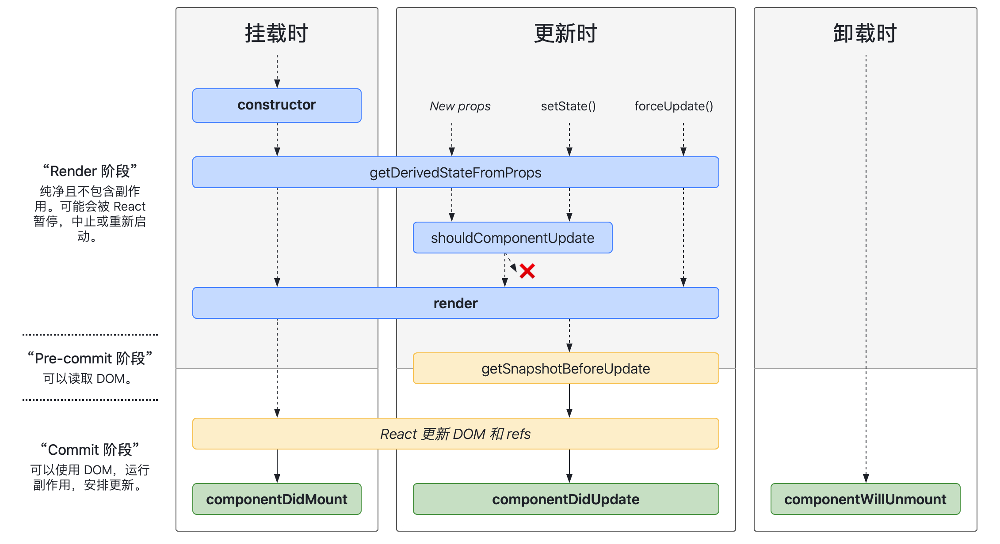

# 生命周期

> 生命周期是对类组件来说的，函数组件并没有生命周期。函数组件只有一个useEffect类似生命周期钩子函数来弥补组件初始化过程或者组件更新过程的副作用，但是它并不是生命周期钩子函数。


组件在初始化时，会通过调用生命周期中的 render 方法，**生成虚拟 DOM**，然后再通过调用 ReactDOM.render 方法，实现虚拟 DOM 到真实 DOM 的转换。

当组件更新时，会再次通过调用 render 方法**生成新的虚拟 DOM**，然后借助 diff**定位出两次虚拟 DOM 的差异**，从而针对发生变化的真实 DOM 作定向更新。


##  React 15

.png)

### 挂载阶段

> 挂载过程在组件的只会发生一次，在这个过程中，组件被初始化，然后会被渲染到真实 DOM 里，完成“首次渲染”。

```js
constructor()
componentWillMount()
render()
componentDidMount()

其中componentWillMount是在render之前执行的，这里可能会触发一些副作用，这样就会触发更新阶段的操作，所以推荐componentDidMount触发副作用，如果是不涉及副作用的可以在这里处理。

render 方法是在组件内的render方法，有区别于 ReactDOM.render， render中返回的jsx经过 babel 转换才会传递到ReactDOM.render完成挂载渲染。

componentDidMount 方法在渲染结束后被触发，此时因为真实 DOM 已经挂载到了页面上，我们可以在这个生命周期里执行真实 DOM 相关的操作。此外，类似于异步请求、数据初始化这样的操作也大可以放在这个生命周期来做（侧面印证了 componentWillMount 真的很鸡肋）。
```


### 更新阶段

> 组件的更新分为两种：一种是由父组件更新触发的更新；另一种是组件自身调用自己的 setState 触发的更新。

```js
componentWillReceiveProps()
shouldComponentUpdate()
componentWillUpdate()
render()
componentDidUpdate()

父组件触发更新：会包含组件触发的整个流程
componentWillReceiveProps(nextProps) 这个生命周期是父组件传递过来的props发生了变化，接收到的nextProps可以和当前props进行比较，可以做一些相应的操作，这很重要。
React官方：如果父组件导致组件重新渲染，即使props没有更改，也会调用此方法，如果指向处理nextProps真的改了，请使用当前props和nextProps进行比较。
得出结论：componentReceiveProps 并不是由 props 的变化触发的，而是由父组件的更新触发的。

组件自身 setState 触发的更新：
componentWillUpdate 会在 render 前被触发，它和 componentWillMount 类似，允许你在里面做一些不涉及真实 DOM 操作的准备工作；而 componentDidUpdate 则在组件更新完毕后被触发，和 componentDidMount 类似，这个生命周期也经常被用来处理 DOM 操作。此外，我们也常常将 componentDidUpdate 的执行作为子组件更新完毕的标志通知到父组件。

shouldComponentUpdate(nextProps, nextState) 来决定是否执行该方法之后的生命周期，进而决定是否对组件进行re-render（重渲染）。shouldComponentUpdate 的默认值为 true，也就是说“无条件 re-render”。在实际的开发中，我们往往通过手动往 shouldComponentUpdate 中填充判定逻辑，或者直接在项目中引入 PureComponent 等最佳实践，来实现“有条件的 re-render”。但是涉及到的很多状态去对比会显的无能为力，PureComponent是react内置组件，可以解决这个问题。
```

### 卸载阶段

> 组件卸载可以做一些清除定时器，取消订阅消息之类的操作。

```
componentWillUnmount()

1.可以调用ReactDOM.unmountComponentAtNode，自己卸载自己。
2.组件在父组件中被移除了：这种情况相对比较直观，对应的就是我们上图描述的这个过程。
3.组件中设置了 key 属性，父组件在 render 的过程中，发现 key 值和上一次不一致，那么这个组件就会被干掉。
```

demo代码

```js
import React from "react";
import ReactDOM from "react-dom";
// 定义子组件
class LifeCycle extends React.Component {
  constructor(props) {
    console.log("进入constructor");
    super(props);
    // state 可以在 constructor 里初始化
    this.state = { text: "子组件的文本" };
  }
  // 初始化渲染时调用
  componentWillMount() {
    console.log("componentWillMount方法执行");
  }
  // 初始化渲染时调用
  componentDidMount() {
    console.log("componentDidMount方法执行");
  }
  // 父组件修改组件的props时会调用
  componentWillReceiveProps(nextProps) {
    console.log("componentWillReceiveProps方法执行");
  }
  // 组件更新时调用
  shouldComponentUpdate(nextProps, nextState) {
    console.log("shouldComponentUpdate方法执行");
    return true;
  }

  // 组件更新时调用
  componentWillUpdate(nextProps, nextState) {
    console.log("componentWillUpdate方法执行");
  }
  // 组件更新后调用
  componentDidUpdate(preProps, preState) {
    console.log("componentDidUpdate方法执行");
  }
  // 组件卸载时调用
  componentWillUnmount() {
    console.log("子组件的componentWillUnmount方法执行");
  }
  // 点击按钮，修改子组件文本内容的方法
  changeText = () => {
    this.setState({
      text: "修改后的子组件文本"
    });
  };
  render() {
    console.log("render方法执行");
    return (
      <div className="container">
        <button onClick={this.changeText} className="changeText">
          修改子组件文本内容
        </button>
        <p className="textContent">{this.state.text}</p>
        <p className="fatherContent">{this.props.text}</p>
      </div>
    );
  }
}
// 定义 LifeCycle 组件的父组件
class LifeCycleContainer extends React.Component {

  // state 也可以像这样用属性声明的形式初始化
  state = {
    text: "父组件的文本",
    hideChild: false
  };
  // 点击按钮，修改父组件文本的方法
  changeText = () => {
    this.setState({
      text: "修改后的父组件文本"
    });
  };
  // 点击按钮，隐藏（卸载）LifeCycle 组件的方法
  hideChild = () => {
    this.setState({
      hideChild: true
    });
  };
  render() {
    return (
      <div className="fatherContainer">
        <button onClick={this.changeText} className="changeText">
          修改父组件文本内容
        </button>
        <button onClick={this.hideChild} className="hideChild">
          隐藏子组件
        </button>
        {this.state.hideChild ? null : <LifeCycle text={this.state.text} />}
      </div>
    );
  }
}
ReactDOM.render(<LifeCycleContainer />, document.getElementById("root"));

1. 初始化阶段: 由ReactDOM.render()触发---初次渲染
   1. constructor()
   2. componentWillMount()
   3. render()
   4. componentDidMount() =====> 常用
   ​ 一般在这个钩子中做一些初始化的事，例如：开启定时器、发送网络请求、订阅消息

2. 更新阶段: 由组件内部this.setSate()或父组件render触发或forceUpdate
   1. shouldComponentUpdate()
   2. componentWillUpdate()
   3. render() =====> 必须使用的一个
   4. componentDidUpdate()

3. 卸载组件: 由ReactDOM.unmountComponentAtNode()触发
   1. componentWillUnmount()  =====> 常用
   ​一般在这个钩子中做一些收尾的事，例如：关闭定时器、取消订阅消息
```


## React 16

> 这种图是持续要最新的变化，不是React 16的生命周期，因为后续react还做了一些微调。




注意：**`React15` 和 ` React16` 内容由于存在太多的相似性，这里只说不一样的点。**

### 挂载阶段

```js
constructor()
getDerivedStateFromProps()
render()
componentDidMount()


getDerivedStateFromProps 不是 componentWillMount 的替代品,componentWillMount 的存在不仅“鸡肋”而且危险，因此它并不值得被“代替”，它就应该被废弃。
getDerivedStateFromProps 这个 API，其设计的初衷不是试图替换掉 componentWillMount，而是试图替换掉 componentWillReceiveProps，因此它有且仅有一个用途：使用 props 来派生/更新 state。
注意：getDerivedStateFromProps 在更新和挂载两个阶段触发（这点不同于仅在更新阶段出现的 componentWillReceiveProps）。这是因为“派生 state”这种诉求不仅在 props 更新时存在，在 props 初始化的时候也是存在的。React 16 以提供特定生命周期的形式，对这类诉求提供了更直接的支持。
static getDerivedStateFromProps(props, state)，源码是这么定义的。
	1.静态方法不能使用this。
	2.有两个参数，父组件的props，自身的state
	3.getDerivedStateFromProps 需要一个对象格式的返回值，如果实在不返回，return null即可，注意，getDerivedStateFromProps 方法对 state 的更新动作并非“覆盖”式的更新，而是针对某个属性的定向更新。
```


### 更新阶段

> 基本同上，只是 `getDerivedStateFromProps` 替换了 `componentWillReceiveProps`，
>
> `getSnapshotBeforeUpdate` 替换了 `componentWillUpdate`。

```
getDerivedStateFromProps()
shouldComponentUpdate()
getSnapshotBeforeUpdate()
render()
componentDidUpdate()
```

#### getDerivedStateFromProps

从使用角度来看 `getDerivedStateFromProps` != `componentWillReceiveProps`

从数据流来看，只用 getDerivedStateFromProps 来完成 props 到 state 的映射，并且getDerivedStateFromProps 不能访问this，也就是不能触发副作用，确保生命周期函数的行为更加可控可预测。从根源上帮开发者避免不合理的编程方式，避免生命周期的滥用；同时，也是在为新的 Fiber 架构铺路。

#### getSnapshotBeforeUpdate

> 这个方法和 getDerivedStateFromProps 颇有几分神似，它们都强调了“我需要一个返回值”这回事。区别在于 getSnapshotBeforeUpdate 的返回值会作为第三个参数给到 componentDidUpdate。它的执行时机是在 render 方法之后，真实 DOM 更新之前。在这个阶段里，我们可以同时获取到更新前的真实 DOM 和更新前后的 state&props 信息。
>
> 注意：getSnapshotBeforeUpdate 要想发挥作用，离不开 componentDidUpdate 的配合。

```js
getSnapshotBeforeUpdate(prevProps, prevState) {
  // ...
}

对于这个生命周期，需要重点把握的是它与 componentDidUpdate 间的通信过程。
// 组件更新时调用
getSnapshotBeforeUpdate(prevProps, prevState) {
  console.log("getSnapshotBeforeUpdate方法执行");
  return "haha";
}

// 组件更新后调用
componentDidUpdate(prevProps, prevState, valueFromSnapshot) {
  console.log("componentDidUpdate方法执行");
  console.log("从 getSnapshotBeforeUpdate 获取到的值是", valueFromSnapshot);
}
```


### 卸载阶段

> 同上

```
componentWillUnmount()
```


**至此所有载渲染之前带有副作用的钩子全部改造完毕，componentWillMount、componentWillUpdate、componentWillReceiveProps，如果仍在使用React会用报警告，并需要加上unsafe前缀。这一切都是为了 Fiber 架构做的铺垫。**


**demo**

```js
import React from "react";
import ReactDOM from "react-dom";
// 定义子组件
class LifeCycle extends React.Component {
  constructor(props) {
    console.log("进入constructor");
    super(props);
    // state 可以在 constructor 里初始化
    this.state = { text: "子组件的文本" };
  }
  // 初始化/更新时调用
  static getDerivedStateFromProps(props, state) {
    console.log("getDerivedStateFromProps方法执行");
    return {
      fatherText: props.text
    }
  }
  // 初始化渲染时调用
  componentDidMount() {
    console.log("componentDidMount方法执行");
  }
  // 组件更新时调用
  shouldComponentUpdate(prevProps, nextState) {
    console.log("shouldComponentUpdate方法执行");
    return true;
  }

  // 组件更新时调用
  getSnapshotBeforeUpdate(prevProps, prevState) {
    console.log("getSnapshotBeforeUpdate方法执行");
    return "haha";
  }
  // 组件更新后调用
  componentDidUpdate(preProps, preState, valueFromSnapshot) {
    console.log("componentDidUpdate方法执行");
    console.log("从 getSnapshotBeforeUpdate 获取到的值是", valueFromSnapshot);
  }
  // 组件卸载时调用
  componentWillUnmount() {
    console.log("子组件的componentWillUnmount方法执行");
  }
  // 点击按钮，修改子组件文本内容的方法
  changeText = () => {
    this.setState({
      text: "修改后的子组件文本"
    });
  };
  render() {
    console.log("render方法执行");
    return (
      <div className="container">
        <button onClick={this.changeText} className="changeText">
          修改子组件文本内容
        </button>
        <p className="textContent">{this.state.text}</p>
        <p className="fatherContent">{this.props.text}</p>
      </div>
    );
  }
}
// 定义 LifeCycle 组件的父组件
class LifeCycleContainer extends React.Component {

  // state 也可以像这样用属性声明的形式初始化
  state = {
    text: "父组件的文本",
    hideChild: false
  };
  // 点击按钮，修改父组件文本的方法
  changeText = () => {
    this.setState({
      text: "修改后的父组件文本"
    });
  };
  // 点击按钮，隐藏（卸载）LifeCycle 组件的方法
  hideChild = () => {
    this.setState({
      hideChild: true
    });
  };
  render() {
    return (
      <div className="fatherContainer">
        <button onClick={this.changeText} className="changeText">
          修改父组件文本内容
        </button>
        <button onClick={this.hideChild} className="hideChild">
          隐藏子组件
        </button>
        {this.state.hideChild ? null : <LifeCycle text={this.state.text} />}
      </div>
    );
  }
}
ReactDOM.render(<LifeCycleContainer />, document.getElementById("root"));
```


## 错误捕获componentDidCatch

这个生命周期比较特殊，只能在子组件发生错误的时候才会监听到错误信息。

componentDidCatch(error, info)，此生命周期在后代组件抛出错误后被调用。 它接收两个参数∶

- error：抛出的错误。
- info：带有 componentStack key 的对象，其中包含有关组件引发错误的栈信息
