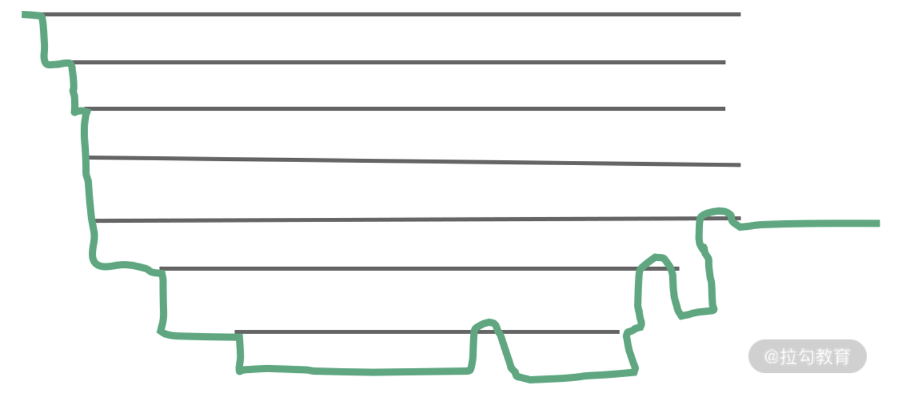
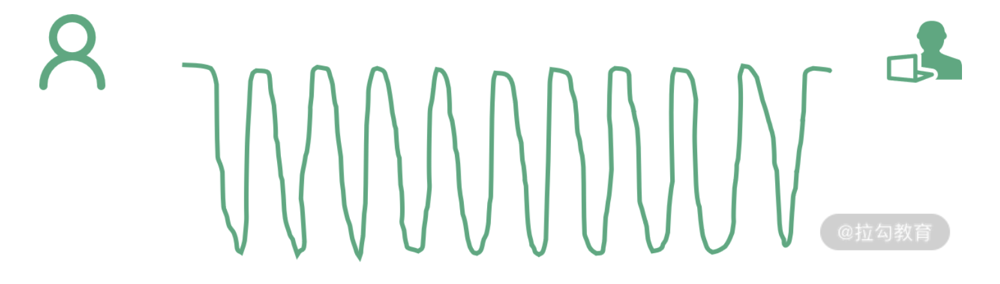

# Fiber

Fiber 架构简析
Fiber 是 React 16 对 React 核心算法的一次重写。关于 Fiber，我将在“模块二：核心原理”花大量的篇幅来介绍它的原理和细节。在本课时，你只需要 get 到这一个点：Fiber 会使原本同步的渲染过程变成异步的。

在 React 16 之前，每当我们触发一次组件的更新，React 都会构建一棵新的虚拟 DOM 树，通过与上一次的虚拟 DOM 树进行 diff，实现对 DOM 的定向更新。这个过程，是一个递归的过程。下面这张图形象地展示了这个过程的特征：

如图所示，同步渲染的递归调用栈是非常深的，只有最底层的调用返回了，整个渲染过程才会开始逐层返回。这个漫长且不可打断的更新过程，将会带来用户体验层面的巨大风险：同步渲染一旦开始，便会牢牢抓住主线程不放，直到递归彻底完成。在这个过程中，浏览器没有办法处理任何渲染之外的事情，会进入一种无法处理用户交互的状态。因此若渲染时间稍微长一点，页面就会面临卡顿甚至卡死的风险。

而 React 16 引入的 Fiber 架构，恰好能够解决掉这个风险：Fiber 会将一个大的更新任务拆解为许多个小任务。每当执行完一个小任务时，渲染线程都会把主线程交回去，看看有没有优先级更高的工作要处理，确保不会出现其他任务被“饿死”的情况，进而避免同步渲染带来的卡顿。在这个过程中，渲染线程不再“一去不回头”，而是可以被打断的，这就是所谓的“异步渲染”，它的执行过程如下图所示：

如果你初学 Fiber，对上面的两段描述感到陌生或者说“吃不透”，这都是正常的。在本课时，你大可不必如此苛求自己，只需对“同步渲染”和“异步渲染”这两个概念有一个大致的印象，同时把握住 Fiber 架构下“任务拆解”和“可打断”这两个特性即可。接下来，我们继续往下走，看看“同步”变“异步”这个过程，是如何对生命周期构成影响的。

换个角度看生命周期工作流
Fiber 架构的重要特征就是可以被打断的异步渲染模式。但这个“打断”是有原则的，根据“能否被打断”这一标准，React 16 的生命周期被划分为了 render 和 commit 两个阶段，而 commit 阶段又被细分为了 pre-commit 和 commit。每个阶段所涵盖的生命周期如下图所示：

我们先来看下三个阶段各自有哪些特征（以下特征翻译自上图）。

render 阶段：纯净且没有副作用，可能会被 React 暂停、终止或重新启动。

pre-commit 阶段：可以读取 DOM。

commit 阶段：可以使用 DOM，运行副作用，安排更新。

总的来说，render 阶段在执行过程中允许被打断，而 commit 阶段则总是同步执行的。

为什么这样设计呢？简单来说，由于 render 阶段的操作对用户来说其实是“不可见”的，所以就算打断再重启，对用户来说也是零感知。而 commit 阶段的操作则涉及真实 DOM 的渲染，再狂的框架也不敢在用户眼皮子底下胡乱更改视图，所以这个过程必须用同步渲染来求稳。

细说生命周期“废旧立新”背后的思考
在 Fiber 机制下，render 阶段是允许暂停、终止和重启的。当一个任务执行到一半被打断后，下一次渲染线程抢回主动权时，这个任务被重启的形式是“重复执行一遍整个任务”而非“接着上次执行到的那行代码往下走”。这就导致 render 阶段的生命周期都是有可能被重复执行的。

带着这个结论，我们再来看看 React 16 打算废弃的是哪些生命周期：

componentWillMount；

componentWillUpdate；

componentWillReceiveProps。

这些生命周期的共性，就是它们都处于 render 阶段，都可能重复被执行，而且由于这些 API 常年被滥用，它们在重复执行的过程中都存在着不可小觑的风险。

别的不说，说说我自己在团队 code review 中见过的“骚操作”吧。在“componentWill”开头的生命周期里，你习惯于做的事情可能包括但不限于:

setState()；

fetch 发起异步请求；

操作真实 DOM。

这些操作的问题（或不必要性）包括但不限于以下 3 点：

（1）完全可以转移到其他生命周期（尤其是 componentDidxxx）里去做。

比如在 componentWillMount 里发起异步请求。很多同学因为太年轻，以为这样做就可以让异步请求回来得“早一点”，从而避免首次渲染白屏。

可惜你忘了，异步请求再怎么快也快不过（React 15 下）同步的生命周期。componentWillMount 结束后，render 会迅速地被触发，所以说首次渲染依然会在数据返回之前执行。这样做不仅没有达到你预想的目的，还会导致服务端渲染场景下的冗余请求等额外问题，得不偿失。

（2）在 Fiber 带来的异步渲染机制下，可能会导致非常严重的 Bug。

试想，假如你在 componentWillxxx 里发起了一个付款请求。由于 render 阶段里的生命周期都可以重复执行，在 componentWillxxx 被打断 + 重启多次后，就会发出多个付款请求。

比如说，这件商品单价只要 10 块钱，用户也只点击了一次付款。但实际却可能因为 componentWillxxx 被打断 + 重启多次而多次调用付款接口，最终付了 50 块钱；又或者你可能会习惯在 componentWillReceiveProps 里操作 DOM（比如说删除符合某个特征的元素），那么 componentWillReceiveProps 若是执行了两次，你可能就会一口气删掉两个符合该特征的元素。

结合上面的分析，我们再去思考 getDerivedStateFromProps 为何会在设计层面直接被约束为一个触碰不到 this 的静态方法，其背后的原因也就更加充分了——避免开发者触碰 this，就是在避免各种危险的骚操作。

（3）即使你没有开启异步，React 15 下也有不少人能把自己“玩死”。

比如在 componentWillReceiveProps  和 componentWillUpdate 里滥用 setState 导致重复渲染死循环的，大家都懂哈（邪魅一笑）。

总的来说，React 16 改造生命周期的主要动机是为了配合 Fiber 架构带来的异步渲染机制。在这个改造的过程中，React 团队精益求精，针对生命周期中长期被滥用的部分推行了具有强制性的最佳实践。这一系列的工作做下来，首先是确保了 Fiber 机制下数据和视图的安全性，同时也确保了生命周期方法的行为更加纯粹、可控、可预测。