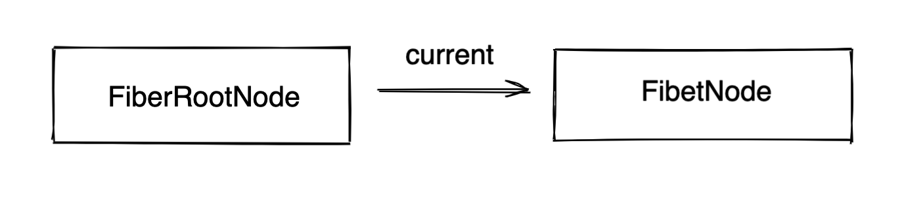
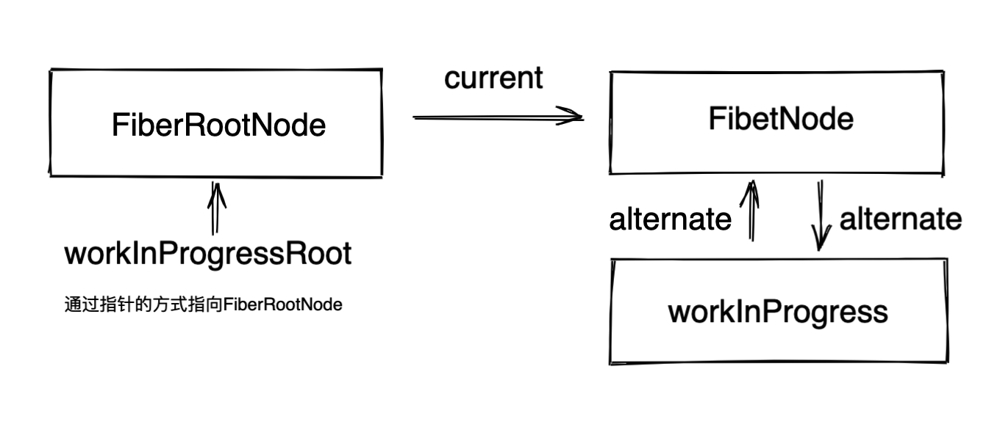

# ReactDOM.render


## demo

> 这个例子将会围绕这个demo来代入理解ReactDOM.render整个流程。

```tsx
function App() {
  const [count, setCount] = useState(0)

  return (
    <div>
      <p>{count}</p>

      <input
        type="button"
        value="增加"
        onClick={() => {
          setCount(count + 1)
        }}
      />
    </div>
  )
}

ReactDOM.render(<App />, document.getElementById("root"))
```


## 源码解析


### 初始化阶段 入口文件 ReactDOM.render

> React 的函数调用栈是非常深的，所以一步步理解下去才不会乱。

```tsx
src/react/packages/react-dom/src/client/ReactDOM.js 接着找
src/react/packages/react-dom/src/client/ReactDOMLegacy.js 找到 render方法。
// render作用：返回 legacyRenderSubtreeIntoContainer 函数
export function render(element: React$Element<any>,container: Container,callback: ?Function) {
  // 判断容器是否合法，<div id='root'></div>,
  invariant( isValidContainer(container),'Target container is not a DOM element.');
  // 省略非重要代码...
  return legacyRenderSubtreeIntoContainer(null,element,container,false, callback);
}


// legacyRenderSubtreeIntoContainer作用：干活的函数，作用在注释里面
function legacyRenderSubtreeIntoContainer(
  parentComponent: ?React$Component<any, any>, // null
  children: ReactNodeList, // element 其实就是 <App/> 这个组件
  container: Container, // dom，<div id=root></div>
  forceHydrate: boolean, // false,判断是否为服务端渲染
  callback: ?Function, // 组件渲染完成的回调函数，也就是ReactDOM.render的第三个参数
) {
	// 初始化root，它自己没啥意义，里面的属性在后面创建出来才有用。
  let root: RootType = (container._reactRootContainer: any);
  // TODO: fiber的根节点，特别重要
  let fiberRoot;
  // 初始化的时候 root 是 undefined。
  if (!root) {
    // 这里初始化了 以及全局节点fiberRootNode，fiber节点 fiberNode，以及事件初始化处理
    // 下面会把 legacyCreateRootFromDOMContainer 单独拎出来讲
    root = container._reactRootContainer = legacyCreateRootFromDOMContainer( container, forceHydrate);
    fiberRoot = root._internalRoot;
    // 处理回调函数
    if (typeof callback === 'function') {
      const originalCallback = callback;
      callback = function() {
        const instance = getPublicRootInstance(fiberRoot);
        originalCallback.call(instance);
      };
    }
    // Initial mount should not be batched.
   	// 当调用unbatchedUpdates的时候就会调用这个updateContainer，去到 Reconciler中处理更新优先级，更新队列等等问题。
   	// 下面会把unbatchedUpdates，updateContainer 单独拎出来讲
    unbatchedUpdates(() => {
      updateContainer(children, fiberRoot, parentComponent, callback);
    });
  } else {
    // 这里是更新逻辑，逻辑处理的是非首次渲染的情况（即更新），其逻辑除了跳过了初始化工作，其他与上面基本一致
    fiberRoot = root._internalRoot;
    if (typeof callback === 'function') {
      const originalCallback = callback;
      callback = function() {
        const instance = getPublicRootInstance(fiberRoot);
        originalCallback.call(instance);
      };
    }
    // Update
    updateContainer(children, fiberRoot, parentComponent, callback);
  }
   // 返回当前fiberRoot的stateNode，有三种特殊情况
  // 1.对于FiberNode.current指向的FiberNode，stateNode 为 FiberRootNode
  // 2.FiberNode 下面的 App 组件中的 stateNode 为 null
  // 3.App组件下面，对于拥有真实dom节点的节点中的 stateNode 为 dom真实节点，这个最重要
  return getPublicRootInstance(fiberRoot);
}
```


#### legacyCreateRootFromDOMContainer

> 创建Fiber节点的入口方法。

```tsx
// legacyCreateRootFromDOMContainer作用：判断浏览器和服务端，非服务端清空内容，调用createLegacyRoot(container，undefined)，去创建 _internalRoot对象
src/react/packages/react-dom/src/client/ReactDOMLegacy.js
function legacyCreateRootFromDOMContainer( container: Container, forceHydrate: boolean,): RootType {
  const shouldHydrate = forceHydrate || shouldHydrateDueToLegacyHeuristic(container); // 服务端标识 false
  // 清空内容 <div id="root"><span>我这个标签会被清空的<span></div>
  if (!shouldHydrate) {
    let warned = false;
    let rootSibling;
    while ((rootSibling = container.lastChild)) {
      container.removeChild(rootSibling);
    }
  }
  //  又是返回一个执行函数
  return createLegacyRoot( container, shouldHydrate ? { hydrate: true, }  : undefined );
}
src/react/packages/react-dom/src/client/ReactDOMRoot.js
export function createLegacyRoot(
	container: Container, // container
  options?: RootOptions, // undefined
): RootType {
  // LegacyRoot: 0,执行构造函数 ReactDOMBlockingRoot
  return new ReactDOMBlockingRoot(container, LegacyRoot, options);
  //这就是构造函数ReactDOMBlockingRoot的方法体，又进栈了。 this._internalRoot = createRootImpl(container, tag, options);
}

// 创建 _internalRoot 的方法。
function createRootImpl(
  container: Container,
  tag: RootTag, // 0
  options: void | RootOptions, // defined
) {
	// 创建fiber
  const root = createContainer(container, tag, false, null);
  /* 
  作用给container添加属性 '__reactContainer$' + randomKey，将 root.current赋值给它，用于在容器也可以访问current
  const internalContainerInstanceKey = '__reactContainer$' + randomKey;
  export function markContainerAsRoot(hostRoot: Fiber, node: Container): void {
    node[internalContainerInstanceKey] = hostRoot;
  }
  */
  markContainerAsRoot(root.current, container);
  // export const enableEagerRootListeners = true;
  if (enableEagerRootListeners) {
    // container.nodeType:1
    // COMMENT_NODE:8
    const rootContainerElement = container.nodeType === COMMENT_NODE ? container.parentNode : container;
    // 事件系统，这次不展开
    listenToAllSupportedEvents(rootContainerElement);
  } 
  // 把刚刚创建的fiberRootNode返回
  return root;
}


```

##### createFiberRoot

> 创建fiber节点。

**注意：enableNewReconciler是用来区分使用 文件后缀是new还是old，由于React现在默认都是使用old，它设置这个的原因是为了新的版本和当前版本可以同时推进，但是打tag不能满足逻辑改动太大，所以就采用了使用文件做以区分**

```tsx
由上面知道 调用了 createContainer，这时候是去到，src/packages/react-reconciler/src/ReactFiberReconciler.js
找到 createContainer_old ， /src/react/packages/react-reconciler/src/ReactFiberReconciler.old.js
export function createContainer(
  containerInfo: Container,
  tag: RootTag,
  hydrate: boolean,
  hydrationCallbacks: null | SuspenseHydrationCallbacks,
): OpaqueRoot {
  // 返回创建 fiber
  return createFiberRoot(containerInfo, tag, hydrate, hydrationCallbacks);
}

export function createFiberRoot(
  containerInfo: any, // <div id='root'><div>
  tag: RootTag, // 0
  hydrate: boolean, // false
  hydrationCallbacks: null | SuspenseHydrationCallbacks, // null
): FiberRoot {
  // TODO: 创建FiberRootNode节点，
  const root: FiberRoot = (new FiberRootNode(containerInfo, tag, hydrate): any);
  // enableSuspenseCallback:false
  if (enableSuspenseCallback) {
    root.hydrationCallbacks = hydrationCallbacks;
  }

  // Cyclic construction. This cheats the type system right now because
  // stateNode is any.
  // 创建 FiberNode节点
  const uninitializedFiber = createHostRootFiber(tag);
  // 这里有一个循环引用
  root.current = uninitializedFiber;
  uninitializedFiber.stateNode = root;

  // 初始化更新链表
  initializeUpdateQueue(uninitializedFiber);

  return root;
}
```

###### FiberRootNode

> React创建fiberRootNode

```tsx
/src/react/packages/react-reconciler/src/ReactFiberRoot.old.js
function FiberRootNode(containerInfo, tag, hydrate) {
  this.tag = tag; // 0
  this.hydrate = hydrate; // false
  this.containerInfo = containerInfo; //  <div id='root'></div>
  // The currently active root fiber. This is the mutable root of the tree.
  //当前应用root节点对应的Fiber对象，即Root Fiber，ReactElement会有一个树结构，同时一个ReactElement对应一个Fiber对象，所以Fiber也会有树结构
  this.pendingChildren = null; 
  this.current = null; // fiberNode，这里是第一个fiber的起点，即是app组件的父亲
  // WeakMap<Wakeable, Set<mixed>> | Map<Wakeable, Set<mixed>> | null,
  // 任务有三种，优先级有高低：
  // 1.没有提交的任务
  // 2.没有提交的被挂起的任务
  // 3.没有提交的可能被挂起的任务
  this.pingCache = null;
  // A finished work-in-progress HostRoot that's ready to be committed.
  // 已经完成任务的FiberRoot对象，如果你只有一个Root，那么该对象就是这个Root对应的Fiber或null
  // 在commit(提交)阶段只会处理该值对应的任务
  this.finishedWork = null;  
  // Timeout handle returned by setTimeout. Used to cancel a pending timeout, if it's superseded by a new one.
  // export const noTimeout = -1;
  // 在任务被挂起的时候，通过setTimeout设置的响应内容，
  // 并且清理之前挂起的任务 还没触发的timeout
  this.timeoutHandle = noTimeout;
  // 顶层context对象，只有主动调用renderSubtreeIntoContainer才会生效
  // context: Object | null,
  this.context = null;
  this.pendingContext = null; // 服务端相关
  // Node returned by Scheduler.scheduleCallback. Represents the next rendering
  // task that the root will work on.
  this.callbackNode = null;
  // 默认是最高级的回调函数
  this.callbackPriority = NoLanePriority;
  this.eventTimes = createLaneMap(NoLanes);
  this.expirationTimes = createLaneMap(NoTimestamp);

  // 这里的优先级全是最高级
  this.pendingLanes = NoLanes;
  this.suspendedLanes = NoLanes;
  this.pingedLanes = NoLanes;
  this.expiredLanes = NoLanes;
  this.mutableReadLanes = NoLanes;
  this.finishedLanes = NoLanes;

  this.entangledLanes = NoLanes;
  this.entanglements = createLaneMap(NoLanes);
  // 服务端相关
  if (supportsHydration) {
    this.mutableSourceEagerHydrationData = null;
  }

  // The following attributes are only used by interaction tracing builds.
  // They enable interactions to be associated with their async work,
  // And expose interaction metadata to the React DevTools Profiler plugin.
  // Note that these attributes are only defined when the enableSchedulerTracing flag is enabled.
  if (enableSchedulerTracing) {
    this.interactionThreadID = unstable_getThreadID();
    this.memoizedInteractions = new Set();
    this.pendingInteractionMap = new Map();
  }
  // false
  if (enableSuspenseCallback) {
    this.hydrationCallbacks = null;
  }

  // 在不同模式下会挂在不同的方法字符串
  if (__DEV__) {
    switch (tag) {
      case BlockingRoot:
        this._debugRootType = 'createBlockingRoot()';
        break;
      case ConcurrentRoot:
        this._debugRootType = 'createRoot()';
        break;
      case LegacyRoot:
        this._debugRootType = 'createLegacyRoot()';
        break;
    }
  }
}
```

###### FiberNode

> 创建fiberNode节点

```tsx
由上可以知，createHostRootFiber会被调用，它这里又会去调用createFiber才是真正创建fiberNode节点
src/react/packages/react-reconciler/src/ReactFiberRoot.old.js
// 创建RootFiber
export function createHostRootFiber(tag: RootTag): Fiber {
  let mode;
  if (tag === ConcurrentRoot) {
    mode = ConcurrentMode | BlockingMode | StrictMode;
  } else if (tag === BlockingRoot) {
    mode = BlockingMode | StrictMode;
  } else {
    // 初始化会得到0
    mode = NoMode;
  }
  
  if (enableProfilerTimer && isDevToolsPresent) {
    // Always collect profile timings when DevTools are present.
    // This enables DevTools to start capturing timing at any point–
    // Without some nodes in the tree having empty base times.
    mode |= ProfileMode; // 8
  }
  // HostRoot:3,mode:8
  return createFiber(HostRoot, null, null, mode);
}
/src/react/packages/react-reconciler/src/ReactFiber.old.js
const createFiber = function(
  tag: WorkTag,
  pendingProps: mixed,
  key: null | string,
  mode: TypeOfMode,
): Fiber {
  // $FlowFixMe: the shapes are exact here but Flow doesn't like constructors
  return new FiberNode(tag, pendingProps, key, mode);
};


// 创建fiber节点
function FiberNode(
  tag: WorkTag, // 3
  pendingProps: mixed, // null
  key: null | string,// null
  mode: TypeOfMode, // 8
) {
  // Instance
  this.tag = tag; // 定fiber的类型。在reconciliation算法中使用它来确定需要完成的工作
  this.key = key; // 唯一标识符
  this.elementType = null;
  this.type = null; // 定义与fiber关联的功能或类。对于类组件，它指向构造函数，对于DOM元素，它指定HTML标记。我经常使用此字段来了解光纤节点与哪些元素相关。
  this.stateNode = null; // 一般视为真实节点，及时有时候不是

  // Fiber
  this.return = null; // 指向父节点
  this.child = null; // 指向子节点
  this.sibling = null; // 指向兄弟节点
  this.index = 0; // 在这么多兄弟中排行第几

  this.ref = null; // 操作dom的方法

  this.pendingProps = pendingProps; // 新的变动带来的新的props，即nextProps。
  this.memoizedProps = null; // 上一次输入更新的Fiber props
  this.updateQueue = null; // 状态更新，回调和DOM更新的队列，Fiber对应的组件，所产生的update，都会放在该队列中
  this.memoizedState = null; // 当前屏幕UI对应状态，上一次输入更新的Fiber state
  this.dependencies = null; // 一个列表，存在该Fiber依赖的contexts，events

  this.mode = mode;  // 一棵树上的mode都是8，继承父fiber

  // Effects
  this.flags = NoFlags; // 当前fiber阶段需要进行任务，包括：占位、更新、删除等，一般发生在diff的时候打上标记
  this.nextEffect = null; // 记录副作用

  this.firstEffect = null; // 同上
  this.lastEffect = null; // 同上

  this.lanes = NoLanes; // 优先级
  this.childLanes = NoLanes; // child优先级

  this.alternate = null; // current fiber指向work in progress fiber;working in progress fiber指向current fiber
  // enableProfilerTimer：true
  if (enableProfilerTimer) {
    // 注意：这里为什么会出现赋值两次呢，这个问题参考下面的链接，我的理解是，getHostSibling方法使用到这些变量的时候，会缓慢，这对于chrome来说也是一种奇怪的行为，但是解决的方式是先赋值  Number.NaN 或 Number.MIN_VALUE才赋上真正的值，值得一提的是这是18年初提出的问题，到现在都还没解决。
    // https://github.com/facebook/react/issues/14365
    // https://bugs.chromium.org/p/v8/issues/detail?id=8538
    this.actualDuration = Number.NaN;
    this.actualStartTime = Number.NaN;
    this.selfBaseDuration = Number.NaN;
    this.treeBaseDuration = Number.NaN;
    this.actualDuration = 0;
    this.actualStartTime = -1;
    this.selfBaseDuration = 0;
    this.treeBaseDuration = 0;
  }

  if (__DEV__) {
    // This isn't directly used but is handy for debugging internals:
    this._debugID = debugCounter++;
    this._debugSource = null;
    this._debugOwner = null;
    this._debugNeedsRemount = false;
    this._debugHookTypes = null;
    if (!hasBadMapPolyfill && typeof Object.preventExtensions === 'function') {
      Object.preventExtensions(this);
    }
  }
}
```

至此，初始化的fiber已经创建完毕，它们关系如下。




#### unbatchedUpdates，updateContainer

> React的三大阶段到底是怎么样的。

```tsx
回到，src/react/packages/react-dom/src/client/ReactDOMLegacy.js 找到 legacyRenderSubtreeIntoContainer方法。
/src/react/packages/react-reconciler/src/ReactFiberReconciler.old.js
unbatchedUpdates(() => {
    updateContainer(children, fiberRoot, parentComponent, callback);
});

export function unbatchedUpdates<A, R>(fn: (a: A) => R, a: A): R {
  // 对上下文处理
  const prevExecutionContext = executionContext;
  executionContext &= ~BatchedContext;
  executionContext |= LegacyUnbatchedContext;
  try {
    // 直接调用了传入的回调函数 fn，也就是updateContainer
    return fn(a);
  } finally {
    // 将上下文复原
    executionContext = prevExecutionContext;
    if (executionContext === NoContext) {
      // Flush the immediate callbacks that were scheduled during this batch
      resetRenderTimer(); // 设置时间  === workInProgressRootRenderTargetTime = now() + RENDER_TIMEOUT_MS;
      // 刷新回调，具体逻辑还没有进去看
      flushSyncCallbackQueue(); 
    }
  }
}

export function updateContainer(
  element: ReactNodeList, // <App/>
  container: OpaqueRoot, // FiberRootNode
  parentComponent: ?React$Component<any, any>, // null
  callback: ?Function, // undefined
): Lane {
  const current = container.current; // 获取fiberNode
  const eventTime = requestEventTime(); // 当前时间
  // 是一个定义优先级模型，这里是通过各种判断后，返回lane
  const lane = requestUpdateLane(current); // 1
  // true
  if (enableSchedulingProfiler) {
    // 给performance打上标记， performance.mark(`--schedule-render-${formatLanes(lane)}`)
    markRenderScheduled(lane);
  }

  const context = getContextForSubtree(parentComponent); // {}

  if (container.context === null) {
    container.context = context; // 一开始fiberRootNode 是null，所以会赋值{}
  } else {
    // pendingContext 和服务器相关
    container.pendingContext = context;
  }

  // ，创建 update 对象，一个 update 对象代表着一个更新
  const update = createUpdate(eventTime, lane);
  /* 
    callback: null,
    eventTime: 782.8000000007451,
    lane: 1,
    next: null,
    payload:
    element: {$$typeof: Symbol(react.element), key: null, ref: null, props: {…}, type: ƒ, …},
    tag: 0
  */

  // Caution: React DevTools currently depends on this property
  // being called "element".
  update.payload = {element};

  // React.render(x,y,cb),中的回调函数
  callback = callback === undefined ? null : callback;
  if (callback !== null) {
    if (__DEV__) {
      if (typeof callback !== 'function') {
        console.error(
          'render(...): Expected the last optional `callback` argument to be a ' +
            'function. Instead received: %s.',
          callback,
        );
      }
    }
    update.callback = callback;
  }
   // 更新链表，是update放在前面
  enqueueUpdate(current, update);
  // 调度节点，current节点即 fiberNode，开启render阶段
  scheduleUpdateOnFiber(current, lane, eventTime);
  return lane;
}
```

#### 小结

综上，就是大概`React` 初始化阶段做了什么事情，主要初始化一下fiber信息，以及后序需要用到的各种字段，事件等等。


### Render 阶段 「scheduleUpdateOnFiber」

> `scheduleUpdateOnFiber` 即是进入render阶段的标志。，回头还要补充一些异步渲染，

```tsx
/src/react/packages/react-reconciler/src/ReactFiberWorkLoop.old.js

export function scheduleUpdateOnFiber(
  fiber: Fiber,
  lane: Lane,
  eventTime: number,
) {
	// 删除了不影响阅读代码
  // 这里是同步渲染的逻辑，走legacy 模式，lane === SyncLane === true
  // 还有其他的 blocking 模式，concurrent 模式
  if (lane === SyncLane) {
    if (
      // Check if we're inside unbatchedUpdates
      (executionContext & LegacyUnbatchedContext) !== NoContext &&
      // Check if we're not already rendering
      (executionContext & (RenderContext | CommitContext)) === NoContext
    ) {
      // Register pending interactions on the root to avoid losing traced interaction data.
      schedulePendingInteractions(root, lane);

      // This is a legacy edge case. The initial mount of a ReactDOM.render-ed
      // root inside of batchedUpdates should be synchronous, but layout updates
      // should be deferred until the end of the batch.

      // performSyncWorkOnRoot 标志着 render 阶段的开始，
      // finishSyncRender 标志着 render 阶段的结束。
      // 这中间包含了大量的 beginWork、completeWork 调用栈，正是 render 的工作内容。
      performSyncWorkOnRoot(root);
    } else {
      ensureRootIsScheduled(root, eventTime);
      schedulePendingInteractions(root, lane);
      if (executionContext === NoContext) {
        // Flush the synchronous work now, unless we're already working or inside
        // a batch. This is intentionally inside scheduleUpdateOnFiber instead of
        // scheduleCallbackForFiber to preserve the ability to schedule a callback
        // without immediately flushing it. We only do this for user-initiated
        // updates, to preserve historical behavior of legacy mode.
        resetRenderTimer();
        flushSyncCallbackQueue();
      }
    }
  } 
  // concurrent 模式：异步更新
  else {
    // Schedule a discrete update but only if it's not Sync.
    if (
      (executionContext & DiscreteEventContext) !== NoContext &&
      // Only updates at user-blocking priority or greater are considered
      // discrete, even inside a discrete event.
      (priorityLevel === UserBlockingSchedulerPriority ||
        priorityLevel === ImmediateSchedulerPriority)
    ) {
      // This is the result of a discrete event. Track the lowest priority
      // discrete update per root so we can flush them early, if needed.
      if (rootsWithPendingDiscreteUpdates === null) {
        rootsWithPendingDiscreteUpdates = new Set([root]);
      } else {
        rootsWithPendingDiscreteUpdates.add(root);
      }
    }
    // Schedule other updates after in case the callback is sync.
    ensureRootIsScheduled(root, eventTime);
    schedulePendingInteractions(root, lane);
  }

  // We use this when assigning a lane for a transition inside
  // `requestUpdateLane`. We assume it's the same as the root being updated,
  // since in the common case of a single root app it probably is. If it's not
  // the same root, then it's not a huge deal, we just might batch more stuff
  // together more than necessary.
  mostRecentlyUpdatedRoot = root;
}

// This is the entry point for synchronous tasks that don't go
// through Scheduler
function performSyncWorkOnRoot(root) {
	// root:fiberRootNode

  let lanes;
  let exitStatus;
  /* 
  export function includesSomeLane(a: Lanes | Lane, b: Lanes | Lane) {
    return (a & b) !== NoLanes;
  }
  */
  // 这里会返回false
  if (root === workInProgressRoot && includesSomeLane(root.expiredLanes, workInProgressRootRenderLanes) ) {
    // There's a partial tree, and at least one of its lanes has expired. Finish
    // rendering it before rendering the rest of the expired work.
    lanes = workInProgressRootRenderLanes;
    exitStatus = renderRootSync(root, lanes);
    if (
      includesSomeLane(
        workInProgressRootIncludedLanes,
        workInProgressRootUpdatedLanes,
      )
    ) {
      // The render included lanes that were updated during the render phase.
      // For example, when unhiding a hidden tree, we include all the lanes
      // that were previously skipped when the tree was hidden. That set of
      // lanes is a superset of the lanes we started rendering with.
      //
      // Note that this only happens when part of the tree is rendered
      // concurrently. If the whole tree is rendered synchronously, then there
      // are no interleaved events.
      lanes = getNextLanes(root, lanes);
      exitStatus = renderRootSync(root, lanes);
    }
  } else {
    // 关于优先级，没有去细看，代码太长
    // NoLanes 0
    // 获取下一个优先级
    lanes = getNextLanes(root, NoLanes); // 1
    // 核心方法是这个
    exitStatus = renderRootSync(root, lanes); // 5

  }

  // We now have a consistent tree. Because this is a sync render, we
  // will commit it even if something suspended.
  const finishedWork: Fiber = (root.current.alternate: any);
  root.finishedWork = finishedWork;
  root.finishedLanes = lanes;
  commitRoot(root);

  // Before exiting, make sure there's a callback scheduled for the next
  // pending level.
  ensureRootIsScheduled(root, now());

  return null;
}


function renderRootSync(root: FiberRoot, lanes: Lanes) {
  const prevExecutionContext = executionContext;
  executionContext |= RenderContext;
  // 大量的hooks预处理的一个errorCallback
  const prevDispatcher = pushDispatcher();

  // If the root or lanes have changed, throw out the existing stack
  // and prepare a fresh one. Otherwise we'll continue where we left off.
  if (workInProgressRoot !== root || workInProgressRootRenderLanes !== lanes) {
    // 初始化是进入这里，workInProgressRoot ，workInProgressRootRenderLanes此时都是undefined
    // 创建 workInProgress，workInProgressRoot，workInProgressRootRenderLanes 
    prepareFreshStack(root, lanes);
    // 记录交互的，存储在root中，memoizedInteractions字段
    startWorkOnPendingInteractions(root, lanes);
  }

  const prevInteractions = pushInteractions(root); // Set = {}
  //  给performance标记 performance.mark(`--render-start-${formatLanes(lanes)}`);
  if (enableSchedulingProfiler) {
    markRenderStarted(lanes);
  }

  do {
    try {
      // 重点是这个方法，进行递归生产fiber树
      workLoopSync();
      break;
    } catch (thrownValue) {
      handleError(root, thrownValue);
    }
  } while (true);
  // 执行完同步工作后，重置上下文
  resetContextDependencies();
  // enableSchedulerTracing
  if (enableSchedulerTracing) {
    popInteractions(((prevInteractions: any): Set<Interaction>));
  }

  executionContext = prevExecutionContext;
  popDispatcher(prevDispatcher);

  // This is a sync render, so we should have finished the whole tree.
  if (workInProgress !== null) {
    invariant(false,'Cannot commit an incomplete root. This error is likely caused by a ' + 'bug in React. Please file an issue.');
  }


  // performance.mark('--render-stop');
  if (enableSchedulingProfiler) {
    markRenderStopped();
  }

  // Set this to null to indicate there's no in-progress render.
  workInProgressRoot = null;
  workInProgressRootRenderLanes = NoLanes;
  console.log(workInProgressRootExitStatus,"workInProgressRootExitStatus");
  return workInProgressRootExitStatus;
}

```

##### prepareFreshStack

> 创建workInProgress，以及workInProgress 和current是怎么产生联系

```tsx
在 renderRootSync 中调用了 prepareFreshStack 这个方法，正式初始化 workInProgress
/src/react/packages/react-reconciler/src/ReactFiberWorkLoop.old.js
function prepareFreshStack(root: FiberRoot, lanes: Lanes) {
  // root:fiberRootNode lanes:1
  root.finishedWork = null;
  root.finishedLanes = NoLanes;

  const timeoutHandle = root.timeoutHandle; // -1
  // export const noTimeout = -1;
  if (timeoutHandle !== noTimeout) {
    // The root previous suspended and scheduled a timeout to commit a fallback
    // state. Now that we have additional work, cancel the timeout.
    root.timeoutHandle = noTimeout;
    // $FlowFixMe Complains noTimeout is not a TimeoutID, despite the check above
    cancelTimeout(timeoutHandle);
  }

  // workInProgress:null,初始化的时候等于null
  // 递归中断正在渲染的内容，
  if (workInProgress !== null) {
    let interruptedWork = workInProgress.return;
    while (interruptedWork !== null) {
      unwindInterruptedWork(interruptedWork);
      interruptedWork = interruptedWork.return;
    }
  }
  // 变量定义在当前文件200行，这个相当于初始化，这里可以看出来 workInProgressRoot 即是fiberRootNode
  workInProgressRoot = root;
  // 创建 workInProgress,它的内容是和root.current一样的，并且当workInProgress存在的时候可以进行复用处理
  workInProgress = createWorkInProgress(root.current, null);
  workInProgressRootRenderLanes = subtreeRenderLanes = workInProgressRootIncludedLanes = lanes;
  workInProgressRootExitStatus = RootIncomplete;
  workInProgressRootFatalError = null;
  workInProgressRootSkippedLanes = NoLanes;
  workInProgressRootUpdatedLanes = NoLanes;
  workInProgressRootPingedLanes = NoLanes;

  if (enableSchedulerTracing) {
    spawnedWorkDuringRender = null;
  }
}

// This is used to create an alternate fiber to do work on.
export function createWorkInProgress(current: Fiber, pendingProps: any): Fiber {
  // 这个workInProgress 指向current.alternate;
  let workInProgress = current.alternate;
  // workInProgress:null
  if (workInProgress === null) {
    // We use a double buffering pooling technique because we know that we'll
    // only ever need at most two versions of a tree. We pool the "other" unused
    // node that we're free to reuse. This is lazily created to avoid allocating
    // extra objects for things that are never updated. It also allow us to
    // reclaim the extra memory if needed.
    // 使用双缓存技术，通过两棵树可以方便复用一些节点，并且可以延迟创建哪些不会更新的对象，同样可以回收一些额外的内存
    // 创建fiber，和创建fiberNode是同一个方法
    workInProgress = createFiber( current.tag, pendingProps, current.key, current.mode,);
    workInProgress.elementType = current.elementType;
    workInProgress.type = current.type;
    workInProgress.stateNode = current.stateNode;

    if (__DEV__) {
      // DEV-only fields
      workInProgress._debugID = current._debugID;
      workInProgress._debugSource = current._debugSource;
      workInProgress._debugOwner = current._debugOwner;
      workInProgress._debugHookTypes = current._debugHookTypes;
    }
    // 双缓存结构
    workInProgress.alternate = current;
    current.alternate = workInProgress;
  } else {
    workInProgress.pendingProps = pendingProps;
    // Needed because Blocks store data on type.
    workInProgress.type = current.type;

    // We already have an alternate.
    // Reset the effect tag.
    workInProgress.flags = NoFlags;

    // The effect list is no longer valid.
    workInProgress.nextEffect = null;
    workInProgress.firstEffect = null;
    workInProgress.lastEffect = null;

    if (enableProfilerTimer) {
      // We intentionally reset, rather than copy, actualDuration & actualStartTime.
      // This prevents time from endlessly accumulating in new commits.
      // This has the downside of resetting values for different priority renders,
      // But works for yielding (the common case) and should support resuming.
      workInProgress.actualDuration = 0;
      workInProgress.actualStartTime = -1;
    }
  }

  workInProgress.childLanes = current.childLanes;
  workInProgress.lanes = current.lanes;

  workInProgress.child = current.child;
  workInProgress.memoizedProps = current.memoizedProps;
  workInProgress.memoizedState = current.memoizedState;
  workInProgress.updateQueue = current.updateQueue;

  // Clone the dependencies object. This is mutated during the render phase, so
  // it cannot be shared with the current fiber.
  const currentDependencies = current.dependencies;
  workInProgress.dependencies =
    currentDependencies === null
      ? null
      : {
          lanes: currentDependencies.lanes,
          firstContext: currentDependencies.firstContext,
        };

  // These will be overridden during the parent's reconciliation
  workInProgress.sibling = current.sibling;
  workInProgress.index = current.index;
  workInProgress.ref = current.ref;

  if (enableProfilerTimer) {
    workInProgress.selfBaseDuration = current.selfBaseDuration;
    workInProgress.treeBaseDuration = current.treeBaseDuration;
  }

  if (__DEV__) {
    workInProgress._debugNeedsRemount = current._debugNeedsRemount;
    switch (workInProgress.tag) {
      case IndeterminateComponent:
      case FunctionComponent:
      case SimpleMemoComponent:
        workInProgress.type = resolveFunctionForHotReloading(current.type);
        break;
      case ClassComponent:
        workInProgress.type = resolveClassForHotReloading(current.type);
        break;
      case ForwardRef:
        workInProgress.type = resolveForwardRefForHotReloading(current.type);
        break;
      default:
        break;
    }
  }

  return workInProgress;
}
```

至此图应该长这样的。



##### workLoopSync

> 进行递归同步渲染的工作

```tsx
function workLoopSync() {
  // Already timed out, so perform work without checking if we need to yield.
  // 已经超时，所以在不检查我们是否需要让步的情况下执行工作。
  // 当workInProgress有内容的时候就会循环执行performUnitOfWork，知道没有
  while (workInProgress !== null) {
    performUnitOfWork(workInProgress);
  }
}

// workInProgress 也就是unitOfWork 一开始是FiberRootNode，然后不断去递归这棵树，当 workInProgress 为null时退出。
function performUnitOfWork(unitOfWork: Fiber): void {
  // The current, flushed, state of this fiber is the alternate. Ideally
  // nothing should rely on this, but relying on it here means that we don't
  // need an additional field on the work in progress.
  // 它说这里依赖这个alternate，可以不用添加额外的字段
  const current = unitOfWork.alternate;

  let next;
  // unitOfWork.mode :8 ProfileMode:8
  if (enableProfilerTimer && (unitOfWork.mode & ProfileMode) !== NoMode) {
    // 赋值两个时间，profilerStartTime = now(), fiber.actualStartTime = now() 
    startProfilerTimer(unitOfWork);
    // 这个next 永远都是返回 儿子节点，深度优先遍历
    next = beginWork(current, unitOfWork, subtreeRenderLanes);
    // fiber.actualDuration = now() - profilerStartTime，fiber.selfBaseDuration = elapsedTime，profilerStartTime = -1;
    // 知道执行了多长时间，以及恢复 profilerStartTime
    stopProfilerTimerIfRunningAndRecordDelta(unitOfWork, true);
  } else {
    next = beginWork(current, unitOfWork, subtreeRenderLanes);
  }

  // 记录上一次的值
  unitOfWork.memoizedProps = unitOfWork.pendingProps;
  if (next === null) {
    // If this doesn't spawn new work, complete the current work.
    // 当next没有了，也就是说深度搜索这棵树已经到头了，可以开始完成节点了。
    // 两种：1.当前节点没有子节点了，2.当前节点的子节点全部都completeUnitOfWork完成了
    completeUnitOfWork(unitOfWork);
  } else {
    // 这里又把全局变量中的workInProgress赋值为next，为外层的while循环提供条件
    workInProgress = next;
  }
  /**
   * Keeps track of the current owner.
   *
   * The current owner is the component who should own any components that are
   * currently being constructed.
   */
  ReactCurrentOwner.current = null;
}

```

###### beginWork

> 递归构建fiber树。

```
/src/react/packages/react-reconciler/src/ReactFiberBeginWork.old.js

```


### Commit 阶段


### 同步的 ReactDOM.render，异步的 ReactDOM.createRoot

其实在 React 16，包括近期发布的 React 17 小版本中，React 都有以下 3 种启动方式：

**legacy 模式**：
`ReactDOM.render(<App />, rootNode)`。这是当前 React App 使用的方式，当前没有计划删除本模式，但是这个模式可能不支持这些新功能。
**blocking 模式**：
`ReactDOM.createBlockingRoot(rootNode).render(<App />)`。目前正在实验中，作为迁移到 concurrent 模式的第一个步骤。

**concurrent 模式**：
`ReactDOM.createRoot(rootNode).render(<App />)`。目前在实验中，未来稳定之后，打算作为 React 的默认开发模式，这个模式开启了所有的新功能。