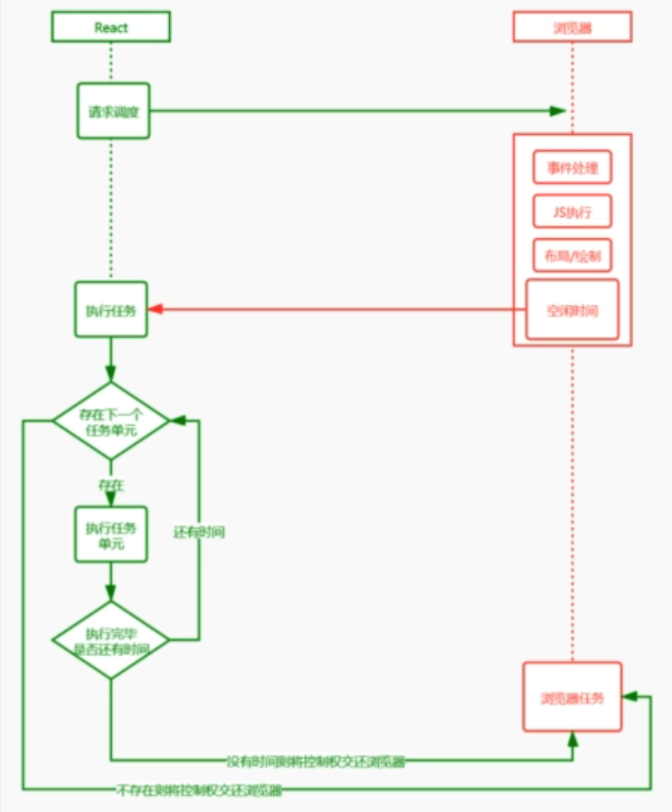

# React渲染流程

requestIdleCallback 可以获取浏览器剩余的空闲时间去执行任务

react使用的时候MessageChannel + requestAnimationFrame 模拟一个requestIdleCallback 

 异步渲染，让react中的 componentWillMount、componentWillUpdate、componentWillReceiveProps变得无法维护，所以被废弃了，但是仍然可以使用，会报警告。  

## fiber 

我们可以通过某些调度策略合理分配CPU资源，从而提高用户的响应速度

通过Fiber架构。让自己的调和过程可中断，适时地让出CPU执行权，除了可以让浏览器及时地响应交互

fiber是一个执行单元，每次执行完一个执行单元，React会检查还剩多少时间，如果没有时间则把控制权让出去，有时间则继续执行执行单元。

fiber是数据结构

●React目前的做法是使用链表，每个VirtualDOM节点内部表示为一个 Fiber
●从顶点开始遍历
●如果有第一个儿子,先遍历第一个儿子
●如果没有第一个儿子,标志着此节点遍历完成
●如果有弟弟遍历弟弟
●如果有没有下一个弟弟，返回父节点标识完成父节点遍历，如果有叔叔遍历叔叔
●没有父节点遍历结束

调度：不可中断

调和：可中断

提交：不可中断