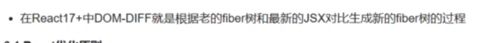
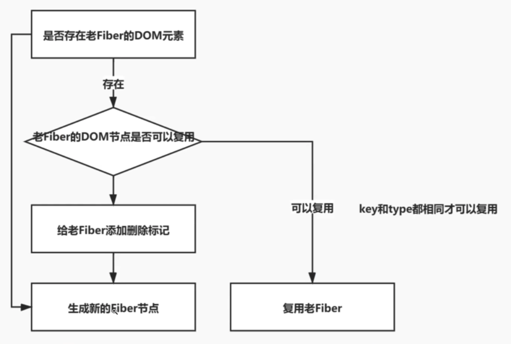
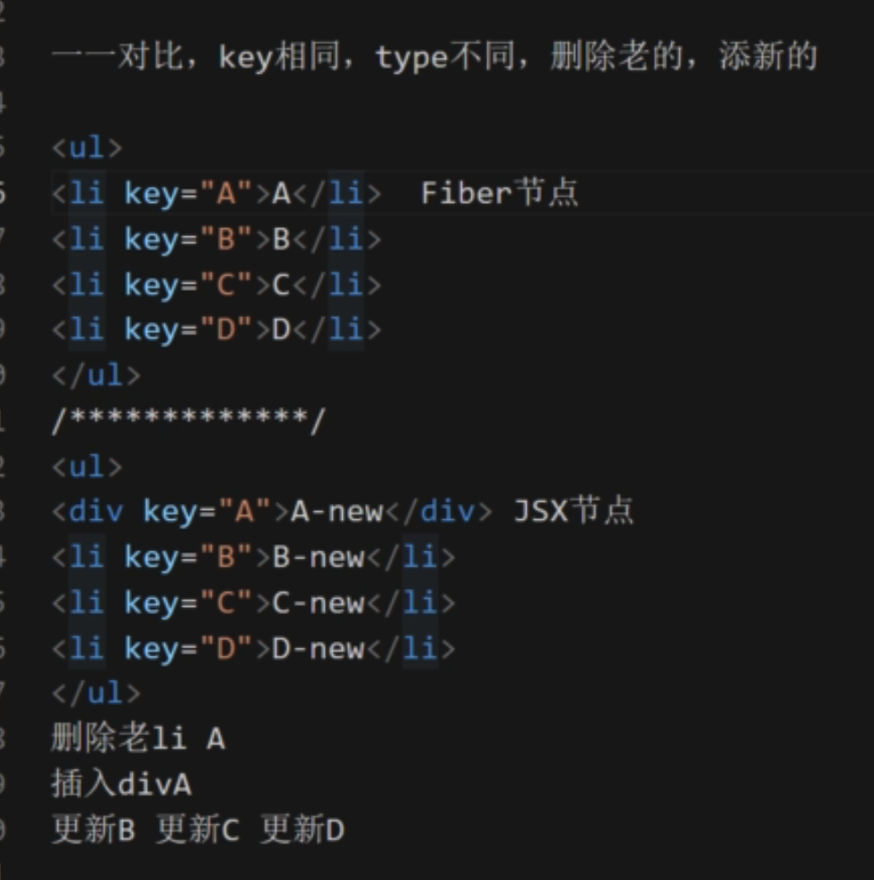
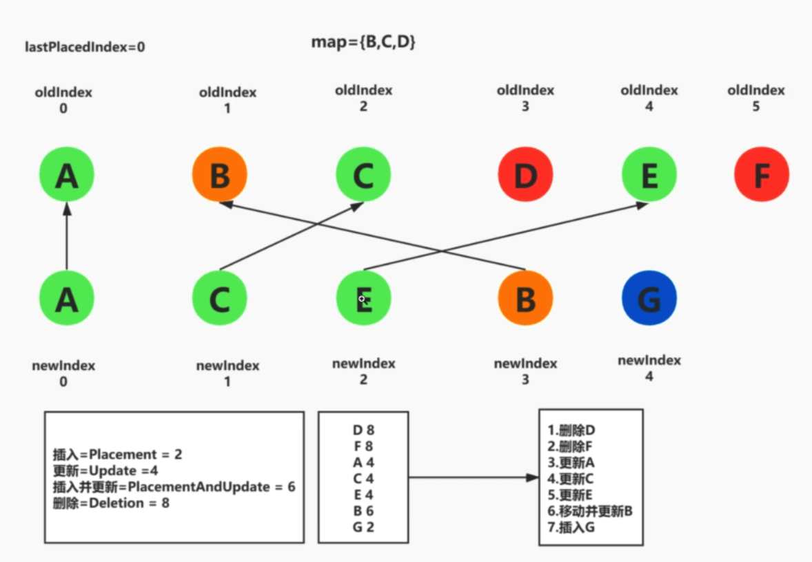
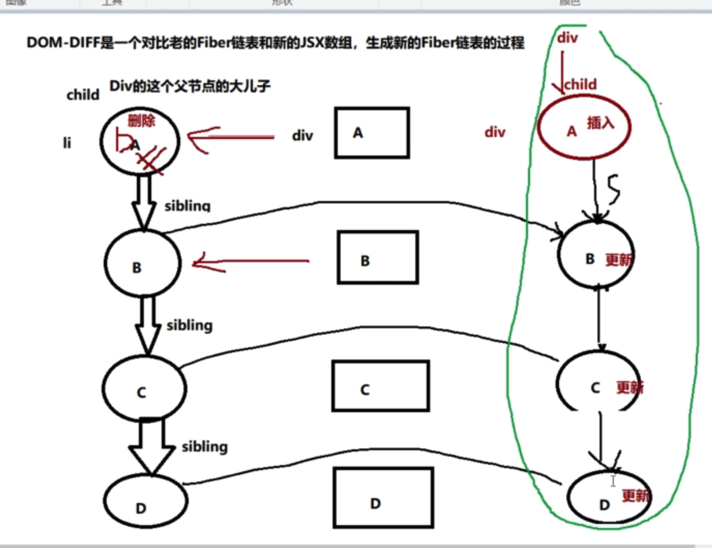

# Diff

`React `的`diff`， 在 `render阶段` 中 `beginWork`  创建节点的时候将会调用下面的方法。

```tsx
// 它们两个其实非常相似，只是传入的参数不同 
// ChildReconciler 的返回值是一个名为 reconcileChildFibers 的函数，
// 这个函数是一个逻辑分发器，它将根据入参的不同，执行不同的 Fiber 节点操作，最终返回不同的目标 Fiber 节点。
// 更新阶段 reconcileChildFibers 需要调和 fiber 节点
// 挂载阶段 mountChildFibers，不需要调合阶段
export const reconcileChildFibers = ChildReconciler(true);
export const mountChildFibers = ChildReconciler(false);
```


> 对比老的Fiber链表和新的JSX数组，生成新的Fiber链表的过程。



## 优化原则

- 只对同级节点进行对比，如果DOM节点跨层级移动，则React不会复用。
- 不同类型的元素会产出不同的结构，会销毁老结构，创建新的结构。
- 可以通过key「自定义或系统自动分配索引 」标识移动元素。


## 单节点

> 新的子节点只有一个元素



```jsx
当type 不同或key不同，都会走下面操作
 
老：
	<div> 
		<h1 key= "null">h1</h1> 在调和阶段，需要把这个老节点标记为删除，会有一个alternate属性指向旧的节点，双缓冲结构。
	</div>

新：
	<div>
		<h2 key=”null">h2</h2> 生成新的fiber节点并标记为插入
	</div>

提交阶段会执行两个操作
div.removeChild(h1);
div.appendChild(h2);
  
  
当type和key都相同，内容不同则，innerHTML = 'h1-new'
老：
	<div> 
		<h1 key= "null">h1</h1> 
	</div>

新：
	<div>
		<h1 key=”null">h1-new</h1> 
	</div>  
会复用此节点，复用老节点的DOM元素和Fiber对象，在看属性有无变更，如果有变化，则会把此Fiber节点标记为更新。
                  
                  
                  这里会有5种情况，记得补充
```


## 多节点

> 新的元素拥有多个节点
>
> 节点可能新增、删除、修改
>
> 多节点会经过两轮遍历处理
>
> 第一轮遍历主要是处理节点的更新「属性，类型的更新」
>
> 第二轮遍历主要处理节点的新增、删除、移动
>
> 移动时原则是尽量少量的移动，如果必须有一个要动，新地位 高的不动，新地位低的动

  第一轮这么设计的原因是因为场景出现比较多，第二轮场景相比较少，是一种策略优化

```jsx
情况一：
老：
	<ul>
		<li key="A">A</li>
		<li key="B">B</li>
		<li key="C">C</ li>
		<li key="D">D</li>
	</ul>

新：
	<ul>
		<li key="A">A-new</li> 
		<li key="B">B-new</li>
		<li key="C">C-new</li>
		<li key="D">D-new</li>
	</ul>
	
全部可以复用。
1.更新A
2.更新B
3.更新C
4.更新D

当出现key相同，type不同，删除老的，添加新的

情况二：
老：
<ul>
	<li key="A">A</li >
	<li key="B">B</li> 
	<li key="C">c</li>
	<li key="D">D</li>
	<li key="E">E</li>
	<li key="F">F</li>
</ul>

新：
<ul>
	<li key="A">A-new</ li>
	<li key="C">C-new</ li>
	<li key="E">E-new</li>
	<li key="B">B-new</li> 
	<li key="G">G</li>
</ul>

第一轮循环：找到D、F删掉，A 是可以复用的，更新， 接着到C的时候发现不匹配，跳出循环。
第二轮循环： 建立一个 map = { B,C,D,E,F }，key就是元素的key，值是老的fiber节点
继续遍历新的节点，C节点去map里找，找到了，则表示位置变了，元素可以复用，通过lastPlaceIndex = 0，当发现旧C的index > lastPlaceIndex「2 > 0」,所以C不用动，直接更新就可以了，通过lastPlaceIndex更新为2。到E同样的操作，通过lastPlaceIndex更新为4。
到了B，发现 1 < 4,则B是需要移动的，移动到新的JSX的最后面
到了G，标记为新增
到这里 map = { D,F }，表示D,F没有用到标记为删除

最后在commit阶段将jsx转换到新fiber

插入 = Placement = 2 0b0000000010「0b 18位2进制数」
更新 = Update = 4 
新增 = PlacementAndUpdate = 6
删除 = Deletion = 8 

```







