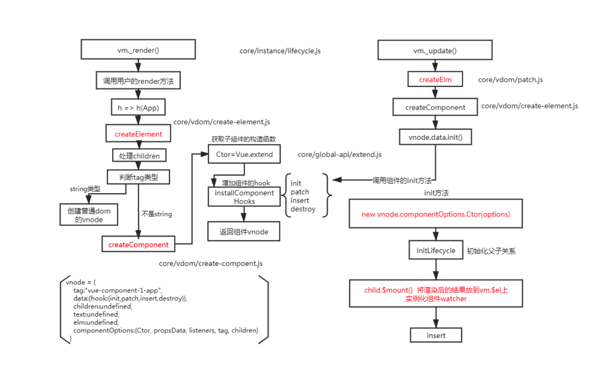

# 虚拟DOM（Virtual DOM ）

主流程：模版 -- 编译 -->  渲染函数 -- 执行 --> vnode -- patch --> 视图

React 使用虚拟DOM，Vue 使用虚拟DOM


## 虚拟DOM的作用

### 性能

每次编译都会生成vdom，通过和旧的vdom做对比生成一个真实的dom。当我们利用js操作vdom要比js直接操作真实dom性能高，特别是在频繁重复渲染以及页面复杂的场景，可以起到一个缓冲作用（操作多次new vnode 和 oldvnode对比，最后生成一份真实的dom）。「操作dom很费内存，即使创建一个空的 div，原生 DOM 因为浏览器厂商需要实现众多的规范（各种 HTML5 属性、DOM事件）都会加上，导致性能低。 」，真正的 DOM 元素非常庞大，这是因为标准就是这么设计的。而且操作它们的时候你要小心翼翼，轻微的触碰可能就会导致页面重排。

### 跨端

现今无论是微信小程序、uniapp、taro、 app（React-Native 和 Weex） ，在基于虚拟dom，让我们可以使用Vue/React 来进行开发，打包的时候自动通过weex/React-Native提供的api或者标签进行编译就可以实现原生编译的目的。


## 源码

### 入口文件

```js
文件路径 core/vdom/patch.js 中导出 createPatchFunction
createPatchFunction执行返回patch函数 是一个闭包。

export const patch: Function = createPatchFunction({ nodeOps, modules })

// install platform patch function
Vue.prototype.__patch__ = patch 将path挂载Vue实例上面

以后看见 __patch__ 其实就是调用 createPatchFunction中返回的 patch函数

比如这种情况
Vue.prototype._update = function (vnode: VNode, hydrating?: boolean) {
   const vm: Component = this;
   const prevEl = vm.$el;
   const prevVnode = vm._vnode;
   const restoreActiveInstance = setActiveInstance(vm);
   vm._vnode = vnode;
   // Vue.prototype.__patch__ is injected in entry points
   // based on the rendering backend used.
   if (!prevVnode) {
     // initial render
     vm.$el = vm.__patch__(vm.$el, vnode, hydrating, false /* removeOnly */);
   } else {
     // updates
     vm.$el = vm.__patch__(prevVnode, vnode);
   }
   restoreActiveInstance();
   // update __vue__ reference
   if (prevEl) {
     prevEl.__vue__ = null;
   }
   if (vm.$el) {
     vm.$el.__vue__ = vm;
   }
   // if parent is an HOC, update its $el as well
   if (vm.$vnode && vm.$parent && vm.$vnode === vm.$parent._vnode) {
     vm.$parent.$el = vm.$el;
   }
   // updated hook is called by the scheduler to ensure that children are
   // updated in a parent's updated hook.
 };
```


### patch函数

```js
文件路径 core/vdom/patch.js 中 createPatchFunction 的闭包中

// patch方法 diff 算法核心
function patch(oldVnode, vnode, hydrating, removeOnly) {
  // 如果新节点为空，走卸载逻辑
  if (isUndef(vnode)) {
    if (isDef(oldVnode)) invokeDestroyHook(oldVnode);
    return;
  }

  let isInitialPatch = false; // 初始化patch
  const insertedVnodeQueue = []; // 插入Vnode列表

  // 如果老节点为空，创建节点，接着调用 invokeInsertHook
  if (isUndef(oldVnode)) {
    // empty mount (likely as component), create new root element
    isInitialPatch = true;
    createElm(vnode, insertedVnodeQueue);
  } else {
    // nodeType 1元素 2属性 3文本 。。。，因为 oldVnode 是虚拟dom，所以这里会返回false
    const isRealElement = isDef(oldVnode.nodeType);
    if (!isRealElement && sameVnode(oldVnode, vnode)) {
      // patch existing root node  patchVnode
      // 进去对比 oldVnode 和 vnode 算法当中，下面一段代码
      patchVnode(oldVnode, vnode, insertedVnodeQueue, null, null, removeOnly);
    } else {
      // 当是真实元素和不是同一个节点的时候 ，走下面逻辑

      // 服务端渲染的逻辑
      if (isRealElement) {
        // 真实元素挂载
        // mounting to a real element
        // check if this is server-rendered content and if we can perform
        // a successful hydration.
        if (oldVnode.nodeType === 1 && oldVnode.hasAttribute(SSR_ATTR)) {
          oldVnode.removeAttribute(SSR_ATTR);
          hydrating = true;
        }
        if (isTrue(hydrating)) {
          if (hydrate(oldVnode, vnode, insertedVnodeQueue)) {
            invokeInsertHook(vnode, insertedVnodeQueue, true);
            return oldVnode;
          } else if (process.env.NODE_ENV !== "production") {
            warn(
              "The client-side rendered virtual DOM tree is not matching " +
                "server-rendered content. This is likely caused by incorrect " +
                "HTML markup, for example nesting block-level elements inside " +
                "<p>, or missing <tbody>. Bailing hydration and performing " +
                "full client-side render."
            );
          }
        }
        // either not server-rendered, or hydration failed.
        // create an empty node and replace it
        oldVnode = emptyNodeAt(oldVnode); // 根据真实元素 产生虚拟节点
      }

      // replacing existing element
      const oldElm = oldVnode.elm;
      const parentElm = nodeOps.parentNode(oldElm); // 找到父亲

      // create new node  创建新节点
      createElm(
        vnode,
        insertedVnodeQueue,
        // extremely rare edge case: do not insert if old element is in a
        // leaving transition. Only happens when combining transition +
        // keep-alive + HOCs. (#4590)
        oldElm._leaveCb ? null : parentElm,
        nodeOps.nextSibling(oldElm)
      );

      // 递归更新父占位符节点元素
      if (isDef(vnode.parent)) {
        let ancestor = vnode.parent;
        const patchable = isPatchable(vnode);
        while (ancestor) {
          for (let i = 0; i < cbs.destroy.length; ++i) {
            cbs.destroy[i](ancestor);
          }
          ancestor.elm = vnode.elm;
          if (patchable) {
            for (let i = 0; i < cbs.create.length; ++i) {
              cbs.create[i](emptyNode, ancestor);
            }
            // #6513
            // invoke insert hooks that may have been merged by create hooks.
            // e.g. for directives that uses the "inserted" hook.
            const insert = ancestor.data.hook.insert;
            if (insert.merged) {
              // start at index 1 to avoid re-invoking component mounted hook
              for (let i = 1; i < insert.fns.length; i++) {
                insert.fns[i]();
              }
            }
          } else {
            registerRef(ancestor);
          }
          ancestor = ancestor.parent;
        }
      }

      // destroy old node
      // 销毁老节点
      if (isDef(parentElm)) {
        removeVnodes([oldVnode], 0, 0);
      } else if (isDef(oldVnode.tag)) {
        invokeDestroyHook(oldVnode);
      }
    }
  }
  // 调用插入的钩子 callInsert
  invokeInsertHook(vnode, insertedVnodeQueue, isInitialPatch);
  return vnode.elm;
};
```


### 对比节点

> 在patch 函数上面 遇见  !isRealElement && sameVnode(oldVnode, vnode)这种的时候，是需要认真对比元素的

```js
 //  patchVnode(oldVnode, vnode, insertedVnodeQueue, null, null, removeOnly);
  function patchVnode(
    oldVnode,
    vnode,
    insertedVnodeQueue,
    ownerArray,
    index,
    removeOnly
  ) {
    // 新老节点相同，直接返回
    if (oldVnode === vnode) {
      return;
    }

    if (isDef(vnode.elm) && isDef(ownerArray)) {
      // clone reused vnode
      vnode = ownerArray[index] = cloneVNode(vnode);
    }

    const elm = (vnode.elm = oldVnode.elm); // 复用老节点

    // 如果是异步占位符跳过
    if (isTrue(oldVnode.isAsyncPlaceholder)) {
      if (isDef(vnode.asyncFactory.resolved)) {
        hydrate(oldVnode.elm, vnode, insertedVnodeQueue);
      } else {
        vnode.isAsyncPlaceholder = true;
      }
      return;
    }

    // reuse element for static trees.
    // note we only do this if the vnode is cloned -
    // if the new node is not cloned it means the render functions have been
    // reset by the hot-reload-api and we need to do a proper re-render.
    if (
      isTrue(vnode.isStatic) &&
      isTrue(oldVnode.isStatic) &&
      vnode.key === oldVnode.key && // 都是静态节点，key相同
      (isTrue(vnode.isCloned) || isTrue(vnode.isOnce)) // 是克隆节点 或者 带有v-once，直接复用
    ) {
      vnode.componentInstance = oldVnode.componentInstance;
      return;
    }

    let i; // 组件更新逻辑
    const data = vnode.data;
    if (isDef(data) && isDef((i = data.hook)) && isDef((i = i.prepatch))) {
      i(oldVnode, vnode);
    }

    const oldCh = oldVnode.children;
    const ch = vnode.children;
    // 如果匹配到组件实例
    if (isDef(data) && isPatchable(vnode)) {
      // 调用更新方法
      for (i = 0; i < cbs.update.length; ++i) cbs.update[i](oldVnode, vnode);
      if (isDef((i = data.hook)) && isDef((i = i.update))) i(oldVnode, vnode);
    }
    // 如果不是文本节点
    if (isUndef(vnode.text)) {
      // 两方都有儿子，那就比较麻烦，需要进行儿子的对比更新
      if (isDef(oldCh) && isDef(ch)) {
        // 不是同一个儿子
        if (oldCh !== ch)
          // 更新儿子
          updateChildren(elm, oldCh, ch, insertedVnodeQueue, removeOnly);
      }
      // 如果只有新的有儿子，新儿子直接创建就可以了
      else if (isDef(ch)) {
        // 判断key是否符合唯一性
        if (process.env.NODE_ENV !== "production") {
          checkDuplicateKeys(ch);
        }
        if (isDef(oldVnode.text)) nodeOps.setTextContent(elm, ""); // 可能有文本占据内容 清空文本
        // 添加新节点
        addVnodes(elm, null, ch, 0, ch.length - 1, insertedVnodeQueue);
      }
      // 如果老得有儿子，那就直接全部删除
      else if (isDef(oldCh)) {
        removeVnodes(oldCh, 0, oldCh.length - 1); // 删除节点
      } else if (isDef(oldVnode.text)) {
        // 如果老的是文本
        nodeOps.setTextContent(elm, ""); // 清空文本中内容
      }
    }
    // 文本不相同直接设置新值
    else if (oldVnode.text !== vnode.text) {
      nodeOps.setTextContent(elm, vnode.text);
    }

    if (isDef(data)) {
      // 调用postpatch钩子
      if (isDef((i = data.hook)) && isDef((i = i.postpatch)))
        i(oldVnode, vnode);
    }
  }

```


### 更新子节点

> 当 patchVnode 发现当前节点不是那么简单的，还有子节点，那么就需要对比子节点，那么子节点也是节点，就会走回去patchVnode 进行对比，直到所有元素递归完就出栈。


#### 优化策略

当上面这些遍历正常走完那其实是一种特别费劲的一个过程，因为真实的场景，也许改变的东西真的不多，有时候只是一个文本改变了，有时候，新增了一个节点，所以vue中的算法根据场景做了一些优化，减少遍历次数，提升性能。

##### 策略一：

基本的快捷查找方案有4种
	newStartVnode中所有未处理的第一个节点「新前」和oldStartVnode中所有未处理的第一个节点「旧前」
	newEndVnode中所有未处理的最后一个节点「新后」和oldEndVnode中所有未处理的最后一个节点「旧后」
	新后 和 旧前
	新前 和 旧后	

将这四种情况进行对比，如果发现匹配到了可服用的旧节点，直接复用即可。

##### 策略二：

当发现上面的不管用了，那就需要通过key来快速找到组件，找到就可以服用。

顺便提一句，加key值是在节点会发生变化的时候，加key才有意义。如果是一个查看列表不具备任何操作，那就意味到，不需要key。

```js
function updateChildren(
    parentElm,
    oldCh,
    newCh,
    insertedVnodeQueue,
    removeOnly
  ) {
    let oldStartIdx = 0; // 旧节点开始的索引
    let newStartIdx = 0; // 新节点开始的索引
    let oldStartVnode = oldCh[0]; // 旧的节点第一个子节点 ====== 我们姑且叫 “旧前”
    let oldEndIdx = oldCh.length - 1; // 旧节点最后的索引
    let oldEndVnode = oldCh[oldEndIdx]; // 旧的节点最后一个子节点  ====== 我们姑且叫 “旧后”
    let newEndIdx = newCh.length - 1; // 新节点最后的索引
    let newStartVnode = newCh[0]; // 新的节点第一个子节点  ====== 我们姑且叫 “新前”
    let newEndVnode = newCh[newEndIdx]; // 新的节点最后一个子节点  ====== 我们姑且叫 “新后”
    let oldKeyToIdx, idxInOld, vnodeToMove, refElm;
    // oldKeyToIdx 通过key为键 index为值，构成的集合
    // idxInOld 为 key 对应的老子节点
    // vnodeToMove 匹配到的组件

    // removeOnly is a special flag used only by <transition-group>
    // to ensure removed elements stay in correct relative positions
    // during leaving transitions
    const canMove = !removeOnly;

    if (process.env.NODE_ENV !== "production") {
      checkDuplicateKeys(newCh);
    }
    // 新老节点有一方循环完毕则patch 完毕，
    // 这里是一种优化策略
    while (oldStartIdx <= oldEndIdx && newStartIdx <= newEndIdx) {
      // 移动旧节点的子节点
      if (isUndef(oldStartVnode)) {
        oldStartVnode = oldCh[++oldStartIdx]; // Vnode has been moved left
      } else if (isUndef(oldEndVnode)) {
        oldEndVnode = oldCh[--oldEndIdx];
      }
      // "旧前" 和 "新前" 对比，如果相同
      // 走回刚刚的 patch方法去对比。完成后移动元素
      else if (sameVnode(oldStartVnode, newStartVnode)) {
        patchVnode(
          oldStartVnode,
          newStartVnode,
          insertedVnodeQueue,
          newCh,
          newStartIdx
        );
        oldStartVnode = oldCh[++oldStartIdx];
        newStartVnode = newCh[++newStartIdx];
      }
      //  “旧后” 和 “新后” 对比，如果相同
      // 走回刚刚的 patch方法去对比。完成后移动元素
      else if (sameVnode(oldEndVnode, newEndVnode)) {
        patchVnode(
          oldEndVnode,
          newEndVnode,
          insertedVnodeQueue,
          newCh,
          newEndIdx
        );
        oldEndVnode = oldCh[--oldEndIdx];
        newEndVnode = newCh[--newEndIdx];
      }
      //  “旧前” 和 “新后” 对比，如果相同
      // 走回刚刚的 patch方法去对比。完成后移动元素
      else if (sameVnode(oldStartVnode, newEndVnode)) {
        // Vnode moved right
        patchVnode(
          oldStartVnode,
          newEndVnode,
          insertedVnodeQueue,
          newCh,
          newEndIdx
        );
        canMove &&
          nodeOps.insertBefore(
            parentElm,
            oldStartVnode.elm,
            nodeOps.nextSibling(oldEndVnode.elm)
          );
        oldStartVnode = oldCh[++oldStartIdx];
        newEndVnode = newCh[--newEndIdx];
      }
      //  “旧后” 和 “新前” 对比，如果相同
      // 走回刚刚的 patch方法去对比。完成后移动元素
      else if (sameVnode(oldEndVnode, newStartVnode)) {
        // Vnode moved left
        patchVnode(
          oldEndVnode,
          newStartVnode,
          insertedVnodeQueue,
          newCh,
          newStartIdx
        );
        canMove &&
          nodeOps.insertBefore(parentElm, oldEndVnode.elm, oldStartVnode.elm);
        oldEndVnode = oldCh[--oldEndIdx];
        newStartVnode = newCh[++newStartIdx];
      }
      // 如果所有都没有命中，那么开始另外一种策略 “key” 具有唯一性
      else {
        if (isUndef(oldKeyToIdx))
          // 将剩余的还没有对照的 key-val 键值对返回
          oldKeyToIdx = createKeyToOldIdx(oldCh, oldStartIdx, oldEndIdx);
        // 如果 “新前” 有key ，则可以在 oldKeyToIdx把值返回出去，但是这里可能是undefined
        // 如果 “新前” 没有key，则需要 findIdxInOld
        idxInOld = isDef(newStartVnode.key)
          ? oldKeyToIdx[newStartVnode.key]
          : findIdxInOld(newStartVnode, oldCh, oldStartIdx, oldEndIdx);
        // 如果都没有找到了，那就是新的元素，创建元素
        if (isUndef(idxInOld)) {
          // New element
          createElm(
            newStartVnode,
            insertedVnodeQueue,
            parentElm,
            oldStartVnode.elm,
            false,
            newCh,
            newStartIdx
          );
        } else {
          // 匹配到的旧节点
          vnodeToMove = oldCh[idxInOld];
          // 将匹配到的节点和 “新前” 通过 patchVnode 做对比，
          if (sameVnode(vnodeToMove, newStartVnode)) {
            patchVnode(
              vnodeToMove,
              newStartVnode,
              insertedVnodeQueue,
              newCh,
              newStartIdx
            );
            // 匹配到的旧节点
            oldCh[idxInOld] = undefined;

            // 移动元素逻辑，transition-grounp，不是diff的重点
            canMove &&
              nodeOps.insertBefore(
                parentElm,
                vnodeToMove.elm,
                oldStartVnode.elm
              );
          } else {
            // same key but different element. treat as new element
            // key 一样，但是内容不一样，需要创建
            createElm(
              newStartVnode,
              insertedVnodeQueue,
              parentElm,
              oldStartVnode.elm,
              false,
              newCh,
              newStartIdx
            );
          }
        }
        // 因为key的逻辑 是以newStartIdx为最终参考的，所以需要移动
        newStartVnode = newCh[++newStartIdx];
      }
    }

    // 如果 旧节点先循环完，那么 oldStartIdx > oldEndIdx
    // 就需要新增新的节点
    if (oldStartIdx > oldEndIdx) {
      refElm = isUndef(newCh[newEndIdx + 1]) ? null : newCh[newEndIdx + 1].elm;
      addVnodes(
        parentElm,
        refElm,
        newCh,
        newStartIdx,
        newEndIdx,
        insertedVnodeQueue
      );
    }
    // 如果是新节点先循环完，那么 newStartIdx > newEndIdx，
    // 就需要把中间的节点删除
    else if (newStartIdx > newEndIdx) {
      removeVnodes(oldCh, oldStartIdx, oldEndIdx);
    }
  }


```


## **组件渲染和更新过程**



```
理解:
渲染组件时，会通过 Vue.extend 方法构建子组件的构造函数，并进行实例化。最终手动调用 $mount() 进行挂载。更新组件时会进行 patchVnode 流程.核心就是diff算法
```

