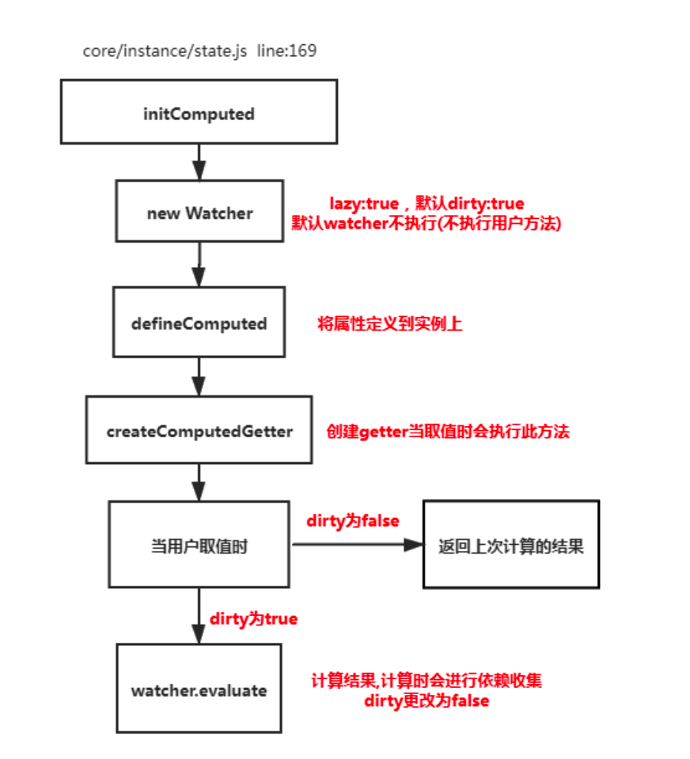

# Watch原理

> 当监听状态发生改变就会触发。
>


## 使用

```js
// 注意不要使用箭头函数
watch: {
	// 第一种方式
	watchProps(newVal, oldVal) {
		this.xx = "111";
		// dosomething
},

// 第二种方式，可以兼容 'watchProps.xx.yy' 以前不懂的时候一直通过 computer 把属性返回出来 
'watchProps':{
		handler(newVal, oldVal) {
 			this.xx = "111";
			// dosomething
	},
	immediate: true, // 立即监听
	deep:true // 深度监听
}

} 
// 第三种方式
var vm = new Vue({})
vm.$watch('a.b.c',(newVal,oldVal)=>{
	// dosomething
},{
deep:true,
immediate:truem
})

deep,immediate 非必传。

还可以主动取消观察函数 watcher.teardown()
```


## 原理

双向数据绑定有一个Watcher类，只是普通的watch实例化没有deep参数只需要加上判断，即可。

还有可以监听函数，将当前函数赋值给getter,监听的函数里面涉及到的状态都会被监听到，发生了变化就会触发watch。

还要新增一个取消观察函数的函数。

```js
watch中的deep：true是如何实现的
当用户指定了 watch 中的deep属性为 true 时，如果当前监控的值是数组或者对象。会对对象中的每一项进行求值，此时会将当前 watcher 存入到对应属性的依赖中，这样数组中对象发生变化时也会通知数据更新


// 初始化Watch
// watch 为用户书写watch
function initWatch(vm: Component, watch: Object) {
  for (const key in watch) {
    const handler = watch[key];
    if (Array.isArray(handler)) {
      for (let i = 0; i < handler.length; i++) {
        // 创建watch，并且把回调函数传递进去
        createWatcher(vm, key, handler[i]);
      }
    } else {
      createWatcher(vm, key, handler);
    }
  }
}

// 创建watch
function createWatcher(
  vm: Component,
  expOrFn: string | Function,
  handler: any,
  options?: Object
) {
  // 如果传进来是一个对象
  if (isPlainObject(handler)) {
    options = handler; // options接受到了
    handler = handler.handler;
  }
  // 如果是字符串 就是可以让我们写“a.b.c”这样的格式
  if (typeof handler === "string") {
    handler = vm[handler];
  }
  // 去watch类，走watch方法
  return vm.$watch(expOrFn, handler, options);
}


  Vue.prototype.$watch = function (
    expOrFn: string | Function,
    cb: any,
    options?: Object
  ): Function {
    const vm: Component = this;
    debugger;
    // 这里还留下了一个 用户可以通过 vm.$watch("xx",()....)的调用方法
    if (isPlainObject(cb)) {
      return createWatcher(vm, expOrFn, cb, options);
    }
    options = options || {};
    options.user = true;
    // 在这里才真正去 watcher累里面进行监听
    const watcher = new Watcher(vm, expOrFn, cb, options); // 创建watcher，数据更新调用cb
    // 如果是immediate为true的话，立即执行传进来的回调函数
    if (options.immediate) {
      try {
        cb.call(vm, watcher.value);
      } catch (error) {
        handleError(
          error,
          vm,
          `callback for immediate watcher "${watcher.expression}"`
        );
      }
    }
    return function unwatchFn() {
      watcher.teardown();
    };
  };


// watch类里面的get方法对deep，和复杂对象处理方法
get () {
	pushTarget(this) // 先将当前依赖放到 Dep.target上 
  let value
	const vm = this.vm
	try {
		value = this.getter.call(vm, vm) 
  }
  catch (e) {
    // 如果是用户定义的watcher则报错给用户看
		if (this.user) {
			handleError(e, vm, `getter for watcher "${this.expression}"`)
   	} else {
        throw e
		}
	} finally {
			if (this.deep) { // 如果需要深度监控
			traverse(value) // 会对对象中的每一项取值,取值时会执行对应的get方法
	}
    popTarget()
 }
	return value
}

function _traverse (val: any, seen: SimpleSet) {
	let i, keys
	const isA = Array.isArray(val)
  // 不是数组也不是对象返回，冰冻对象返回，Vnode实例返回
	if ((!isA && !isObject(val)) || Object.isFrozen(val) || val instanceof VNode){
    return
	}
	if (val.__ob__) {
  	const depId = val.__ob__.dep.id 
  	if (seen.has(depId)) {
			return
  	 }
		seen.add(depId) 
  }
  // 对数组和对象进行递归判断
  if (isA) {
		i = val.length
		while (i--) _traverse(val[i], seen)
	} else {
		keys = Object.keys(val)
		i = keys.length
		while (i--) _traverse(val[keys[i]], seen)
		} 
}
```


# Computed

> **计算属性是基于它们的响应式依赖进行缓存的**。只在相关响应式依赖发生改变时它们才会重新求值
>
> `computed` 是计算一个新的属性，并将该属性挂载到 vm（Vue 实例）上，而 `watch` 是监听已经存在且已挂载到 `vm` 上的数据，所以用 `watch` 同样可以监听 `computed` 计算属性的变化（其它还有 `data`、`props`）。


原理是基于Watcher类，有一个lazy属性，可以进行缓存作用，如果lazy是true证明是计算属性，直接返回数据，不用继续求值，这就是缓存值的原理。

## 使用

```js
1.计算属性的getter函数
2.计算属性的setter函数
3.计算属性的cache缓存属性

 computed: {
	  changeMessage: {
	   // 计算属性：依赖message变化而变化  依赖没变化就不会重新渲染；
	   get () {
	      return this.message + 'world'
	   },
	   set () { 
       // 当赋值给计算属性的时候，将调用setter函数。多用于在模板组件中需要修改计算属性自身的值的时候。在mount中修改
	   }
	 }
	}

// 默认调用的是get
computed: {
   reversedMsg() {
     // this 指向 vm 实例
     return this.msg.split('').reverse().join('')
   }
 }
```


## 原理



```js
默认也是具备缓存的，只要当依赖的属性发生变化时才会更新视图

function initComputed ( vm: Component, computed: Object) {
  const watchers = vm._computedWatchers = Object.create(null)
  const isSSR = isServerRendering()
	for (const key in computed) {
	const userDef = computed[key]
	const getter = typeof userDef === 'function' ? userDef : userDef.get 
  if (!isSSR) {
	// create internal watcher for the computed property，提供后面创建计算属性使用
      watchers[key] = new Watcher(
        vm,
        getter || noop,
        noop,
        computedWatcherOptions // {lazy:true} 初始化lazy求值
	)}

   // 如果不在vm上
   if (!(key in vm)) {
     // 将定义新计算的属性在vm实例上
      defineComputed(vm, key, userDef)
	 } else if (process.env.NODE_ENV !== 'production') {
     // 在正式环境是直接忽略重复定义计算属性，在其他环境的话。
     
     // 如果在data上面定义，在data上面报警告
     if (key in vm.$data) {
				warn(`The computed property "${key}" is already defined in data.`, vm)
     }
     // 如果在props上定义，在props上面报警告
     else if (vm.$options.props && key in vm.$options.props) {
				warn(`The computed property "${key}" is already defined as a prop.`, vm)
     }
		}
  }
}

export function defineComputed(
  target: any,
  key: string,
  userDef: Object | Function
) {
  // 不是服务端渲染则缓存
  const shouldCache = !isServerRendering(); 
  if (typeof userDef === "function") {
    sharedPropertyDefinition.get = shouldCache 
      ? createComputedGetter(key)
      : createGetterInvoker(userDef);
    sharedPropertyDefinition.set = noop;
  } else {
    sharedPropertyDefinition.get = userDef.get
      ? shouldCache && userDef.cache !== false
        ? createComputedGetter(key)
        : createGetterInvoker(userDef.get)
      : noop;
    sharedPropertyDefinition.set = userDef.set || noop;
  }
  if (
    process.env.NODE_ENV !== "production" &&
    sharedPropertyDefinition.set === noop
  ) {
    sharedPropertyDefinition.set = function () {
      warn(
        `Computed property "${key}" was assigned to but it has no setter.`,
        this
      );
    };
  }
  Object.defineProperty(target, key, sharedPropertyDefinition);
}

var computedWatcherOptions = { lazy: true };

function createComputedGetter(key) {
  return function computedGetter() {
    const watcher = this._computedWatchers && this._computedWatchers[key];
    if (watcher) {
      if (watcher.dirty) {
        // 如果值是脏的 进行求值操作，如果依赖的值没发生变化,就不会重新求值
        // 触发watch中的geeter
        watcher.evaluate(); // this.firstname lastname
      }
      if (Dep.target) {
        // 让计算属性所依赖的属性 收集渲染watcher
        watcher.depend();
      }
      return watcher.value;
    }
  };
}

// 调用getter，将dirty改为false
Watcher.prototype.evaluate = function evaluate () {
  this.value = this.get();
  this.dirty = false;
};


// 在这里可以收集依赖，方便以后通知到各个对象
class Dep {
    constructor() {
        this.subs = [] // subs [watcher]
    }
    depend() {
        this.subs.push(Dep.target)
    }
    notify() {
        this.subs.forEach(watcher => watcher.update())
    }
}
Dep.target = null;
observer(obj); // 响应式属性劫持
```


# Watch 和 Computed 应用场景

Computed 计算属性 当属性的依赖有发生变化就会触发。

场景：1.购物车计算的总金额 多个状态影响一个计算属性（多对一）。

​			2.模版渲染的状态需要比较复杂的计算。

​			3.只能是同步代码。

​			4.多个状态合并为一个状态，提供给Watch监听

Watch 监听器，监听一个状态的变化，只要变化就会触发。

场景：1.贷款月供 ，当选择还款年限，计算其他的数值并赋值（当状态变化，触发其他数值的变化，一对多）。

​			2.当组件传值，监听状态做一些相应的操作。

​			3.既可以是异步代码也可以同步代码。

综上所述：`computed` 适用一个数据被多个数据影响，而 `watch` 适用一个数据影响多个数据。
