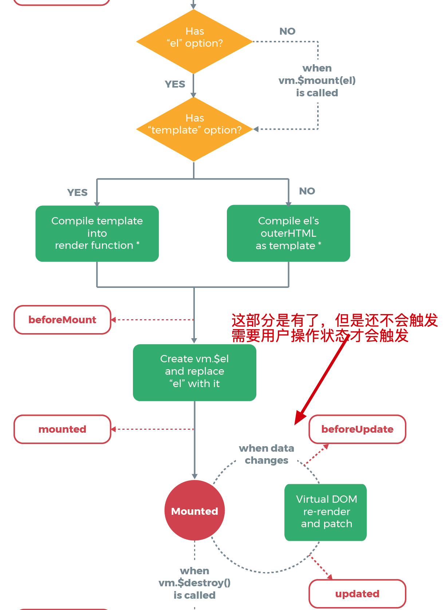
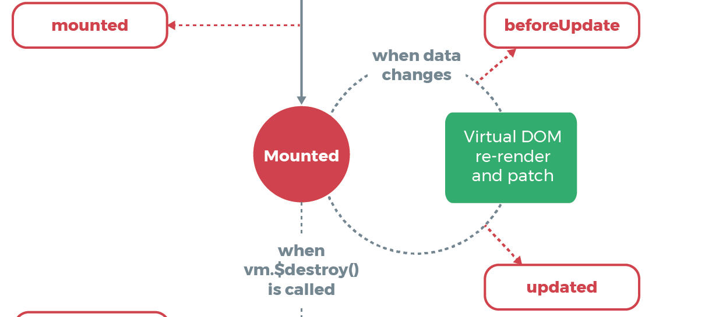
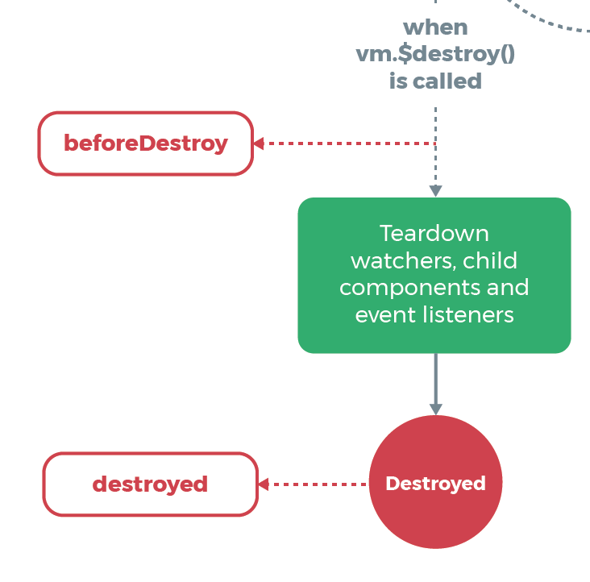

# Vue生命周期

> 熟练使用Vue生命周期在日常开发中将事半功倍。


> 图片引自Vue官网


## 原理

### 入口

1.调用 _init方法，作为入口开启生命周期，文件路径：core/instance/index.js


```js

function Vue(options) {
  if (process.env.NODE_ENV !== "production" && !(this instanceof Vue)) {
    warn("Vue is a constructor and should be called with the `new` keyword");
  }
  // 初始化生命周期
  this._init(options);
}
```

### beforeCreate、created 

找到 _init 方法，文件路径：core/instance/init，

**beforeCreate**： 在实例初始化生命周期属性、事件、创建组件、但是**双向绑定系统不能用**，所以这个阶段基本很少用。

**created** :  在实例已经创建完成之后被调用，双向绑定系统初始化完毕，但是**$el尚未挂载，在这里可以进行请求将数据提前准备好，方便后续的数据渲染。**


```js
删除部分源码

export function initMixin (Vue: Class<Component>) {
  Vue.prototype._init = function (options?: Object) {
    const vm: Component = this

    vm._self = vm
    initLifecycle(vm) // 初始化生命周期，把当前vm初始化属性
    initEvents(vm) // 初始化事件
    initRender(vm) // vm.$slots 创建元素
    callHook(vm, 'beforeCreate') // 把组件的基本信息准备好了，调用beforeCreate这个钩子函数
    initInjections(vm) // resolve injections before data/props 提前注入一些值
    initState(vm) // 初始化state
    initProvide(vm) // resolve provide after data/props 将用户提供的 provide挂在在上面
    callHook(vm, 'created') // 调用created这个钩子函数

    // 如果存在el元素则开始挂载元素，接着找到下面的 beforeMount 和 mounted 生命周期钩子
    if (vm.$options.el) {
      vm.$mount(vm.$options.el)
    }
  }
}


export function initLifecycle (vm: Component) {
  const options = vm.$options

  // locate first non-abstract parent
  let parent = options.parent //  $parent
  if (parent && !options.abstract) { // 排除抽象组件, 查找父亲不是抽象组件，抽象组件不列入父子关系 keep-alive  
    while (parent.$options.abstract && parent.$parent) {
      parent = parent.$parent
    }
    parent.$children.push(vm) // 让父实例记住当前组件实例
  }

  vm.$parent = parent // 增加$parent属性 指向父实例
  vm.$root = parent ? parent.$root : vm

  vm.$children = []
  vm.$refs = {}

  vm._watcher = null
  vm._inactive = null
  vm._directInactive = false
  vm._isMounted = false
  vm._isDestroyed = false
  vm._isBeingDestroyed = false
}

export function callHook (vm: Component, hook: string) {
  // #7573 disable dep collection when invoking lifecycle hooks
  pushTarget()
  const handlers = vm.$options[hook]
  const info = `${hook} hook`
  if (handlers) {
    for (let i = 0, j = handlers.length; i < j; i++) {
      invokeWithErrorHandling(handlers[i], vm, null, vm, info)
    }
  }
  if (vm._hasHookEvent) {
    vm.$emit('hook:' + hook)
  }
  popTarget()
}
```


### beforeMount、mounted

找到 vm.$mount方法，开始挂载元素 

**beforeMount**：在挂载开始之前被调用，判断当前挂载的参数是否合法。

**beforeUpdate**：在这里beforeUpdate是为了监听，后续在介绍

**mounted**： el 被新创建的 vm.$el 替换，并挂载到实例上去之后调用该钩子。 所以可以进行DOM操作

执行完此阶段Vue已经具备了全部的功能了，当数据发生变化的时候，才会触发后续更新/卸载生命周期



```js
// 在这里又发现了调用了 mountComponent
Vue.prototype.$mount = function (
  el?: string | Element,
  hydrating?: boolean
): Component {
  el = el && inBrowser ? query(el) : undefined
  return mountComponent(this, el, hydrating)
}


path：core/instance/lifecycle

export function mountComponent (
  vm: Component,
  el: ?Element,
  hydrating?: boolean
): Component {
  vm.$el = el
  if (!vm.$options.render) {
    vm.$options.render = createEmptyVNode
    if (process.env.NODE_ENV !== 'production') {
      /* istanbul ignore if */
      if ((vm.$options.template && vm.$options.template.charAt(0) !== '#') ||
        vm.$options.el || el) {
        warn(
          'You are using the runtime-only build of Vue where the template ' +
          'compiler is not available. Either pre-compile the templates into ' +
          'render functions, or use the compiler-included build.',
          vm
        )
      } else {
        warn(
          'Failed to mount component: template or render function not defined.',
          vm
        )
      }
    }
  }
  // 挂载之前会先判断你的环境是什么
  callHook(vm, 'beforeMount')

  let updateComponent
  /* istanbul ignore if */
  if (process.env.NODE_ENV !== 'production' && config.performance && mark) {
    // 在这里把组件挂载上去了
    updateComponent = () => {
      const name = vm._name
      const id = vm._uid
      const startTag = `vue-perf-start:${id}`
      const endTag = `vue-perf-end:${id}`

      mark(startTag)
      const vnode = vm._render()
      mark(endTag)
      measure(`vue ${name} render`, startTag, endTag)

      mark(startTag)
      vm._update(vnode, hydrating)
      mark(endTag)
      measure(`vue ${name} patch`, startTag, endTag)
    }
  } else {
    updateComponent = () => {
      vm._update(vm._render(), hydrating)
    }
  }

  // we set this to vm._watcher inside the watcher's constructor
  // since the watcher's initial patch may call $forceUpdate (e.g. inside child
  // component's mounted hook), which relies on vm._watcher being already defined
  new Watcher(vm, updateComponent, noop, {
    before () {
      if (vm._isMounted && !vm._isDestroyed) {
        // 在组件更新的前时候，触发beforeUpdate，
        callHook(vm, 'beforeUpdate')
      }
    }
  }, true /* isRenderWatcher */)
  hydrating = false

  // manually mounted instance, call mounted on self
  // mounted is called for render-created child components in its inserted hook
  if (vm.$vnode == null) {
    vm._isMounted = true
    // 调用已经挂载组件的钩子
    callHook(vm, 'mounted')
  }
  return vm
}

```


### beforeUpdate、updated

当数据方式变化的时候触发DOM更新才会触发

**beforeUpdate**：数据更新时调用，发生在虚拟 DOM 重新渲染和打补丁之前。可以在这个钩子中进一步地更改状态，这不会触发附加的重渲染过程。

**updated**：由于数据更改导致的虚拟 DOM 重新渲染和打补丁，在这之后会调用该钩子。 可以执行依赖于 DOM 的操作。然而在大多数情况下，你应该避免在此期间更改状态，因为这可能会导致更新无限循环。 该钩子在服务器端渲染期间不被调用。 destroyed 可以执行一些优化操作,清空定时器，解除绑定事件。



```js
// override Vue.prototype._update
function updateVirtualComponent (vnode?: VNode) {
  const vm: Component = this
  const componentId = vm.$options.componentId
  if (vm._isMounted) {
    callHook(vm, 'beforeUpdate')
  }
  vm._vnode = vnode
  if (vm._isMounted && componentId) {
    // TODO: data should be filtered and without bindings
    const data = Object.assign({}, vm._data)
    updateComponentData(componentId, data, () => {
      callHook(vm, 'updated')
    })
  }
}
```

### beforeDestroy、destroyed

当组件将要卸载的时候，触发  文件路径：core/vdom/create-component

**beforeDestroy**：实例销毁之前调用。在这一步，实例仍然完全可用。

**destroyed**：实例销毁后调用。调用后，Vue 实例指示的所有东西都会解除绑定，所有的事件 监听器会被移除，所有的子实例也会被销毁。 该钩子在服务器端渲染期间不被调用。



```js
destroy (vnode: MountedComponentVNode) {
  const { componentInstance } = vnode
  if (!componentInstance._isDestroyed) {
    if (!vnode.data.keepAlive) {
      componentInstance.$destroy()
    } else {
      deactivateChildComponent(componentInstance, true /* direct */)
    }
  }
}


Vue.prototype.$destroy = function () {
  const vm: Component = this
  if (vm._isBeingDestroyed) {
    return
  }
  callHook(vm, 'beforeDestroy')
  vm._isBeingDestroyed = true
  // remove self from parent
  const parent = vm.$parent
  // 在父组件移除子组件
  if (parent && !parent._isBeingDestroyed && !vm.$options.abstract) {
    remove(parent.$children, vm)
  }
  // teardown watchers
  // 如果有watch的话就会销毁所有的watch
  if (vm._watcher) {
    vm._watcher.teardown()
  }
  let i = vm._watchers.length
  while (i--) {
    vm._watchers[i].teardown()
  }
  // remove reference from data ob
  // frozen object may not have observer.
  // 监听data数量 --
  if (vm._data.__ob__) {
    vm._data.__ob__.vmCount--
  }
  // call the last hook...
  vm._isDestroyed = true
  // invoke destroy hooks on current rendered tree
  vm.__patch__(vm._vnode, null)
  // fire destroyed hook
  callHook(vm, 'destroyed')
  // turn off all instance listeners.
  vm.$off()
  // remove __vue__ reference
  if (vm.$el) {
    vm.$el.__vue__ = null
  }
  // release circular reference (#6759)
  if (vm.$vnode) {
    vm.$vnode.parent = null
  }
}
```


### activated、deactivated

> 两个特殊的生命周期

#### keep-alive

> 它抽象组件不向DOM呈现任何内容，只是添加额外的行为。

```js
Props：
include - 字符串或正则表达式。只有名称匹配的组件名字（name属性）会被缓存。
exclude - 字符串或正则表达式。任何名称匹配的组件名字（name属性）组件都不会被缓存。
max - 数字。最多可以缓存多少组件实例，使用LRU算法进行优化，当超出max会把很久没有使用的组件进行销毁。

<keep-alive>是Vue的内置组件，能在组件切换过程中将状态保留在内存中，防止重复渲染DOM。
<keep-alive> 包裹动态组件时，会缓存不活动的组件实例，而不是销毁它们。
另外多了两个生命周期钩子 activated，退出时触发deactivated。


keep-alive 可以实现组件的缓存，当组件切换时不会对当前组件进行卸载,常用的2个属性

include exclude 2个生命周期 deactivated LRU算法
原理: core/components/keep-alive.js

export default {
	name: 'keep-alive',
  abstract: true, // 抽象组件
  props: {
    include: patternTypes,
    exclude: patternTypes,
    max: [String, Number]
	},
	created () {
    // 创建缓存列表 this.keys = [] // 创建缓存组件的key列表
		this.cache = Object.create(null)
	},
	destroyed(){
    //keep-alive销毁时 会清空所有的缓存和key
    for (const key in this.cache) { // 循环销毁
			pruneCacheEntry(this.cache, key, this.keys)
    }
	},
	mounted () { // 会监控include 和 include属性 进行组件的缓存处理
    this.$watch('include', val => {pruneCache(this, name => matches(val, name))})
		this.$watch('exclude', val => { pruneCache(this, name => !matches(val, name))})
  },
	render () {
		const slot = this.$slots.default // 会默认拿插槽
		const vnode: VNode = getFirstComponentChild(slot) // 只缓存第一个组件
    const componentOptions: ?		VNodeComponentOptions = vnode && vnode.componentOptions
		if (componentOptions) {
			// check pattern
		const name: ?string = getComponentName(componentOptions) // 取出组件的名字
    const { include, exclude } = this
		if ( // 判断是否缓存
		        // not included
		        (include && (!name || !matches(include, name))) ||
		        // excluded
		        (exclude && name && matches(exclude, name))
		){
		        return vnode
	}
		const { cache, keys } = this
		const key: ?string = vnode.key == null
		  // same constructor may get registered as different local components // so cid alone is not 			enough (#3269)
		? componentOptions.Ctor.cid + (componentOptions.tag ?`::${componentOptions.tag}` : '')
		: vnode.key // 如果组件没key 就自己通过组件的标签和key和cid 拼接一个key

		if (cache[key]) {
			vnode.componentInstance = cache[key].componentInstance // 直接拿到组件实
			// make current key freshest
			remove(keys, key) // 删除当前的 [b,c,d,e,a] // LRU 最近最久未使用法 keys.push(key) // 并将key放到			后面[b,a]
		} else {
			cache[key] = vnode // 缓存vnode
			keys.push(key) // 将key 存入
			// prune oldest entry
			if (this.max && keys.length > parseInt(this.max)) {
    	  // 缓存的太多超过了max就需要删除掉
				pruneCacheEntry(cache, keys[0], keys, this._vnode)
    	  // 要删除第0个 但是现在渲染的就是第0个
    	}
		}
		vnode.data.keepAlive = true // 并且标准keep-alive下的组件是一个缓存组件
    }
		return vnode || (slot && slot[0]) // 返回当前的虚拟节点
  }
}
```

当我们使用抽象组件keep-alive的时候，页面第一次进入，钩子的触发顺序created-> mounted-> activated，退出时触发deactivated。当再次进入（前进或者后退）时，只触发activated。

**activated**：激活时候触发钩子

**deactivated**：切换到其他动态组件的时候触发

```js
export function activateChildComponent (vm: Component, direct?: boolean) {
  if (direct) {
    vm._directInactive = false
    if (isInInactiveTree(vm)) {
      return
    }
  } else if (vm._directInactive) {
    return
  }
  if (vm._inactive || vm._inactive === null) {
    vm._inactive = false
    for (let i = 0; i < vm.$children.length; i++) {
      activateChildComponent(vm.$children[i])
    }
    callHook(vm, 'activated')
  }
}

export function deactivateChildComponent (vm: Component, direct?: boolean) {
  if (direct) {
    vm._directInactive = true
    if (isInInactiveTree(vm)) {
      return
    }
  }
  if (!vm._inactive) {
    vm._inactive = true
    for (let i = 0; i < vm.$children.length; i++) {
      deactivateChildComponent(vm.$children[i])
    }
    callHook(vm, 'deactivated')
  }
}
```


## Vue 父子组件生命周期调用顺序


```js
加载渲染过程
父beforeCreate->父created->父beforeMount->子beforeCreate->子created->子beforeMount->子mounted->父mounted

子组件更新过程
父beforeUpdate->子beforeUpdate->子updated->父updated

父组件更新过程 父beforeUpdate->父updated

销毁过程
父beforeDestroy->子beforeDestroy->子destroyed->父destroyed

理解: 组件的调用顺序都是先父后子,渲染完成的顺序肯定是先子后父
组件的销毁操作是先父后子，销毁完成的顺序是先子后父


function patch (oldVnode, vnode, hydrating, removeOnly) {
    if (isUndef(vnode)) {
      if (isDef(oldVnode)) invokeDestroyHook(oldVnode)
return
}
let isInitialPatch = false
const insertedVnodeQueue = [] // 定义收集所有组件的insert hook方法的数组 // somthing ...
createElm(
vnode,
insertedVnodeQueue, oldElm._leaveCb ? null : parentElm, nodeOps.nextSibling(oldElm)
)
// somthing...
// 最终会依次调用收集的insert hook
invokeInsertHook(vnode, insertedVnodeQueue, isInitialPatch);

  return vnode.elm }
function createElm (
    vnode,
    insertedVnodeQueue,
    parentElm,
    refElm,
    nested,
ownerArray,
index
){
}
// createChildren会递归创建儿子组件 createChildren(vnode, children, insertedVnodeQueue) // something...
// 将组件的vnode插入到数组中
function invokeCreateHooks (vnode, insertedVnodeQueue) {
for (let i = 0; i < cbs.create.length; ++i) { cbs.create[i](emptyNode, vnode)
}
i = vnode.data.hook // Reuse variable if (isDef(i)) {
if (isDef(i.create)) i.create(emptyNode, vnode)
if (isDef(i.insert)) insertedVnodeQueue.push(vnode) }
}
// insert方法中会依次调用mounted方法 insert (vnode: MountedComponentVNode) {
const { context, componentInstance } = vnode if (!componentInstance._isMounted) {
componentInstance._isMounted = true
      callHook(componentInstance, 'mounted')
    }
}
function invokeInsertHook (vnode, queue, initial) {
// delay insert hooks for component root nodes, invoke them after the // element is really inserted
if (isTrue(initial) && isDef(vnode.parent)) {
vnode.parent.data.pendingInsert = queue } else {
for (let i = 0; i < queue.length; ++i) { queue[i].data.hook.insert(queue[i]); // 调用insert方法
} }
}

Vue.prototype.$destroy = function () {
callHook(vm, 'beforeDestroy') //
// invoke destroy hooks on current rendered tree vm.__patch__(vm._vnode, null) // 先销毁儿子
// fire destroyed hook
callHook(vm, 'destroyed')
}
```

