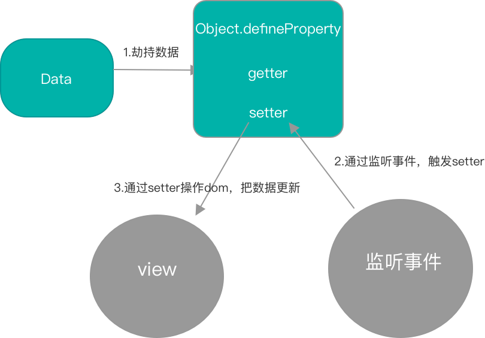
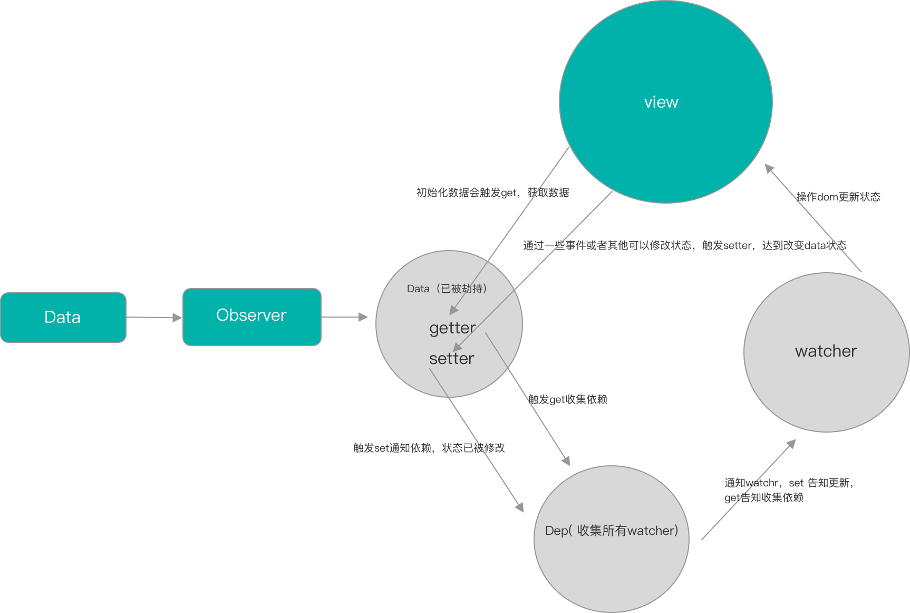

# 双向数据绑定

**双向数据绑定就是 页面 和 数据 无论哪一方发生改变，都可以改变当前的数据。**

**Vue数据双向绑定是通过数据劫持结合发布者-订阅者模式的方式来实现的。**

## 基础知识

###  体验Object.defineProperty 

如果不了解Object.defineProperty [传送门](https://github.com/aatoe/technical-article/blob/master/2020%E5%B9%B4/6%E6%9C%88/%E5%8F%8C%E5%90%91%E6%95%B0%E6%8D%AE%E7%BB%91%E5%AE%9A.md)

```html
<!DOCTYPE html>
<html lang="en">
  <head>
    <meta charset="UTF-8" />
    <meta name="viewport" content="width=device-width, initial-scale=1.0" />
    <title>Document</title>
  </head>
  <body>
    <input type="text" id="input" />
    <p id="data"></p>
  </body>
  <script>
    const obj = {}
    // 获取 input标签原生dom
    const input = document.getElementById('input')
    // 数据劫持。
    // 当 obj.name 时必须触发get()才会返回出来。
    // 当 obj.name = "xx" 时，这里是 obj.name = input.value ，触发了set 进而将data中的值也赋值了。
    Object.defineProperty(obj, 'name', {
      configurable: true,
      enumerable: true,
      get() {
        console.log(`obj.name 也就是获取值时触发`);
        return input.value
      },
      set(newVal) {
        console.log(`obj.name='xx' 也就是设置值时触发`);
        input.value = newVal
        document.getElementById('data').innerHTML = newVal
      },
    })
    // 监听输入框，实现视图->数据的绑定
    input.addEventListener('keyup', () => {
      obj.name = input.value
    })

    // 这个domo是有问题了，get是无法触发，只有set触发了，只是一个deomo而已。
    // 后面的代码，get() 将是至关重要
  </script>
</html>

```




### 完整版

```html
<!DOCTYPE html>
<html>
  <head>
    <meta charset="UTF-8" />
    <title></title>
  </head>

  <body>
    <div id="app">
      <div>
        <input v-model="value" />
        <p v-text="value"></p>
      </div>
    </div>
  </body>

  <script>
    // 收集依赖
    class Dep {
      constructor() {
        this.subs = []
      }

      addSub(sub) {
        this.subs.push(sub)
      }

      removeSub(sub) {
        remove(this.subs, sub)
      }

      depend() {
        if (window.target) {
          this.addSub(window.target)
        }
      }

      notify() {
        const subs = this.subs.slice()
        for (let i = 0, l = subs.length; i < l; i++) {
          subs[i].update()
        }
      }
    }

    // 使数据变成setter getter
    /**
     * Observer类会附加到每一个被侦测的object上。
     * 一旦被附加上，Observer会将object的所有属性转换为getter/setter的形式
     * 来收集属性的依赖，并且当属性发生变化时会通知这些依赖
     */
    class Observer {
      constructor(value) {
        this.value = value

        if (!Array.isArray(value)) {
          this.walk(value)
        }
      }

      /**
       * walk会将每一个属性都转换成getter/setter的形式来侦测变化
       * 这个方法只有在数据类型为Object时被调用
       */
      walk(obj) {
        const keys = Object.keys(obj)
        for (let i = 0; i < keys.length; i++) {
          defineReactive(obj, keys[i], obj[keys[i]])
        }
      }
    }

    function defineReactive(data, key, val) {
      // 新增，递归子属性
      if (typeof val === 'object') {
        new Observer(val)
      }
      let dep = new Dep()
      Object.defineProperty(data, key, {
        enumerable: true,
        configurable: true,
        get: function () {
          console.log('触发了get' + val)
          dep.depend()
          return val
        },
        set: function (newVal) {
          console.log('触发了set' + newVal)
          if (val === newVal) {
            return
          }
          val = newVal
          dep.notify()
        },
      })
    }

    class Watcher {
      constructor(vm, node, name) {
        this.vm = vm
        this.node = node
        this.name = name
        this.value = this.update()
      }

      get() {
        window.target = this
        // 收集依赖,触发get，
        let value = this.vm.data[this.name]
        window.target = undefined
        return value
      }

      update() {
        this.value = this.get()
        this.node.innerText = this.value
      }
    }

    // 模板解析
    function Compile(el, vue, data) {
      // 关联自定义特性
      if (el.attributes) {
        // [].forEach.call(this,()=>{}) ==> Array.prototype.forEach(()=>{})
        // 为什么不直接使用 el.attributes.forEach(()=>{}) , 因为这是dom结构不支持，使用原生for循环可以，但是采用下面方案比较
        [].forEach.call(el.attributes, (attribute) => {
          if (attribute.name.includes('v-')) {
            Update[attribute.name](el, vue, data, attribute.value)
          }
        })
      }

      // 递归解析所有DOM
      ;[].forEach.call(el.childNodes, (child) => Compile(child, vue, data))
    }

    // 自定义特性对应的事件
    const Update = {
      'v-text'(el, vue, data, key) {
        // 初始化DOM内容
        el.innerText = data[key]
        // 收集依赖
        new Watcher(vue, el, key) 
      },
      'v-model'(input, vue, data, key) {
        // 收集依赖
        new Watcher(vue, input, key)
        // 初始化Input默认值
        input.value = data[key]
        // 监听控件的输入事件，并更新数据
        input.addEventListener('keyup', (e) => {
          vue.data[key] = e.target.value
        })
      },
    }

    function Vue(options) {
      this.data = options.data
      new Observer(this.data) // 劫持数据
      let el = document.getElementById(options.el)
      let vue = this
      Compile(el, vue, this.data) // 编译模版
    }

    let vm = new Vue({
      el: 'app',
      data: {
        value: 'juice',
      },
    })
  </script>
</html>

```




proxy 和Object.definepropety的优缺点

vue2.0+把Object.definepropety用的出神入化，最终也没有把监听数组的操作「要么直接赋值，要么使用splice」，对象的增删也是无法检测，但是他提供了`$set`   以及 `$delete`  。最终遗憾的没有实现最直接的监听。

vue3.0 使用的是proxy 优点就是上面所说的他都能实现，而且还拓展了13种方法，性能也可以得到提升，[传送门](https://developer.mozilla.org/zh-CN/docs/Web/JavaScript/Reference/Global_Objects/Proxy)，缺点就是浏览器兼容性的，这也是尤大大考虑将proxy放在vue3.0吧。


### Proxy

> 在这里引用mdn的一句话，**Proxy** 对象用于创建一个对象的代理，从而实现基本操作的拦截和自定义（如属性查找、赋值、枚举、函数调用等）。原来的对象将不会受影响。


```js
只接收两个参数。
// target：代理的对象。
// handler：13种方法，详见mdn。
const p = new Proxy(target, handler)

当我们代理数组的时候。
// 原数组
 const arr = [1, 2, 3, 4]

// 监听数组
const newArr = new Proxy(arr, {
  get: function (target, key, receiver) {
    console.log('target:', target, 'key:', key, 'receiver:', receiver)
    return target[key]
  },
  set: function (target, key, value, receiver) {
    console.log('target:', target, 'key:', key, 'value:', value, 'receiver:', receiver)
    return (target[key] = value)
  },
})
console.log(newArr, 'newArr') //  Proxy {0: 1, 1: 2, 2: 3, 3: 4} "newArr" 所代理的新对象
console.log(newArr[0]) // 触发get target: (4) [1, 2, 3, 4] key: 0 receiver: Proxy {0: 1, 1: 2, 2: 3, 3: 4}  打印1
console.log((newArr[0] = 11)) // 触发set target: (4) [1, 2, 3, 4] key: 0 value: 11 receiver: Proxy {0: 1, 1: 2, 2: 3, 3: 4} 打印11
console.log(newArr[0]) // 修改了newArr target: (4) [11, 2, 3, 4] key: 0 receiver: Proxy {0: 11, 1: 2, 2: 3, 3: 4}
console.log((newArr[4] = 5)) // 5
console.log(newArr) // Proxy {0: 11, 1: 2, 2: 3, 3: 4, 4: 5}

当我们代理对象的时候。
// 原对象
const obj = { name: 'juice', age: '23' }

// 代理的对象
const newObj = new Proxy(obj, {
  get: function (target, key, receiver) {
    console.log('target:', target, 'key:', key, 'receiver:', receiver)
    return target[key]
  },
  set: function (target, key, value, receiver) {
    console.log('target:', target, 'key:', key, 'value:', value, 'receiver:', receiver)
    return (target[key] = value)
  },
})
console.log(newObj, 'newObj') // Proxy {name: "juice", age: "23"} "newObj"
console.log(newObj.name) // juice
console.log((newObj.name = 'JUICE')) // JUICE
console.log(newObj.name) // JUICE
// 新增属性
console.log((newObj.hobby = '王者荣耀')) //  王者荣耀
console.log(newObj) //  Proxy {name: "JUICE", age: "23", hobby: "王者荣耀"}

   
那么按照代理的话，把Object.defindpropety 替换成proxy其实是特别简单的。
```


### 为什么 Vue3.0proxy 解决了什么问题，为什么性能更好？

```js
Vue2.0
对象：添加属性的时候 obj.a = 1 会无法被Vue2劫持，必须使用Vue2提供的$set方法来进行更新
因为defineProperty只能对当前对象中的属性进行监听一个个去监听，新增加进来的，需要重新使用defineProperty，但是Vue是不知道什么时候去使用defineProperty。

Vue3.0中，使用proxy来进行数据代理就完全没有这个顾虑了
proxy对于数据的代理，是能够响应新增的属性，当新增一个属性的时候，可以响应到get中，对当前对象进行代理
const p = new Proxy({
    a: 1,
    b: 2,
}, {
    get: function(obj, value) {
        console.log('get', obj, value);
        return Reflect.get(obj, value);
    },
    set: function(obj, prop, value) {
        console.log('set', obj, prop, value);
        return Reflect.set(obj, prop, value);
    },
})


数组:Vue针对数组是多做了一层处理，代理了数组的7个方法，这是因为使用Object.defineProperty在数组上面无法监听数组的变化，需要通过方法去修改值。
const a = new Proxy([1,2], {
    get: function(obj, prop) {
        console.log('get', obj, prop);
        return Reflect.get(obj, prop);
    },
    set: function(obj, prop, value) {
        console.log('set', obj, prop, value);
        return Reflect.set(obj, prop, value);
    },
});
a.push(1);

get [1,2] push
get [1,2] length
set [1,2] 2 3
set [1,2, 3] length 3

由于proxy会触发两次，Vue3只会在prop为length值才进行更新

Vue2 如果没有设置Object.freeze默认递归data里面的数据做响应式处理，所以不建议在data中的数据定义嵌套太多层，Vue3的proxy是懒递归，不会一上来就递归，性能就相对好点
```

#### **8.** **v-model 中的实现原理及如何自定义 v-model**

```js
v-model 可以看成是 value+input方法 的语法糖

<el-checkbox :value="" @input=""></el-checkbox>
<el-checkbox v-model="check"></el-checkbox>

可以自己重新定义 v-model 的含义
Vue.component('el-checkbox',{
template:`<input type="checkbox" :checked="check"
@change="$emit('change',$event.target.checked)">`,
  model:{
		prop:'check', // 更改默认的value的名字
		event:'change' // 更改默认的方法名 },
		props: {
    check: Boolean
  }, })

原理:
会将组件的 v-model 默认转化成value+input

const VueTemplateCompiler = require('vue-template-compiler');
const ele = VueTemplateCompiler.compile('<el-checkbox v-model="check"></el- checkbox>');
// with(this) {
//		return _c('el-checkbox', { model: {
//			value: (check),
//			callback: function ($$v) {
//			check = $$v },
//			expression: "check"
//
//
//         }
//     })
// }

core/vdom/create-component.js line:155

function transformModel (options, data: any) {
	const prop = (options.model && options.model.prop) || 'value'
  const event = (options.model && options.model.event) || 'input' ;
  (data.attrs || (data.attrs = {}))[prop] = data.model.value
  const on = data.on || (data.on = {})
	const existing = on[event]
	const callback = data.model.callback
	if (isDef(existing)) {
		if ( Array.isArray(existing) ? existing.indexOf(callback) === -1: existing !== callback ){
			on[event] = [callback].concat(existing) }
  } else {
    on[event] = callback
} }


原生的 v-model ，会根据标签的不同生成不同的事件和属性

const VueTemplateCompiler = require('vue-template-compiler');
const ele = VueTemplateCompiler.compile('<input v-model="value"/>');
/**
with(this) {
    return _c('input', {
        directives: [{
name: "model", rawName: "v-model", value: (value), expression: "value"
        }],
        domProps: {
            "value": (value)
        },
        on: {
            "input": function ($event) {
if ($event.target.composing) return;
value = $event.target.value
}}})}
*/

编译时:不同的标签解析出的内容不一样 platforms/web/compiler/directives/model.js

if (el.component) {
genComponentModel(el, value, modifiers)
// component v-model doesn't need extra runtime return false
  } else if (tag === 'select') {
    genSelect(el, value, modifiers)
  } else if (tag === 'input' && type === 'checkbox') {
    genCheckboxModel(el, value, modifiers)
  } else if (tag === 'input' && type === 'radio') {
    genRadioModel(el, value, modifiers)
  } else if (tag === 'input' || tag === 'textarea') {
    genDefaultModel(el, value, modifiers)
} else if (!config.isReservedTag(tag)) { genComponentModel(el, value, modifiers)
// component v-model doesn't need extra runtime return false
}

运行时:会对元素处理一些关于输入法的问题
platforms/web/runtime/directives/model.js

inserted (el, binding, vnode, oldVnode) { if (vnode.tag === 'select') {
// #6903
if (oldVnode.elm && !oldVnode.elm._vOptions) { mergeVNodeHook(vnode, 'postpatch', () => {
directive.componentUpdated(el, binding, vnode) })
} else {
setSelected(el, binding, vnode.context)
}
el._vOptions = [].map.call(el.options, getValue)
} else if (vnode.tag === 'textarea' || isTextInputType(el.type)) {
el._vModifiers = binding.modifiers if (!binding.modifiers.lazy) {
el.addEventListener('compositionstart', onCompositionStart) el.addEventListener('compositionend', onCompositionEnd)
// Safari < 10.2 & UIWebView doesn't fire compositionend when // switching focus before confirming composition choice
// this also fixes the issue where some browsers e.g. iOS Chrome // fires "change" instead of "input" on autocomplete. el.addEventListener('change', onCompositionEnd)
/* istanbul ignore if */
if (isIE9) { el.vmodel = true
}
   } }
}
```

#### 
