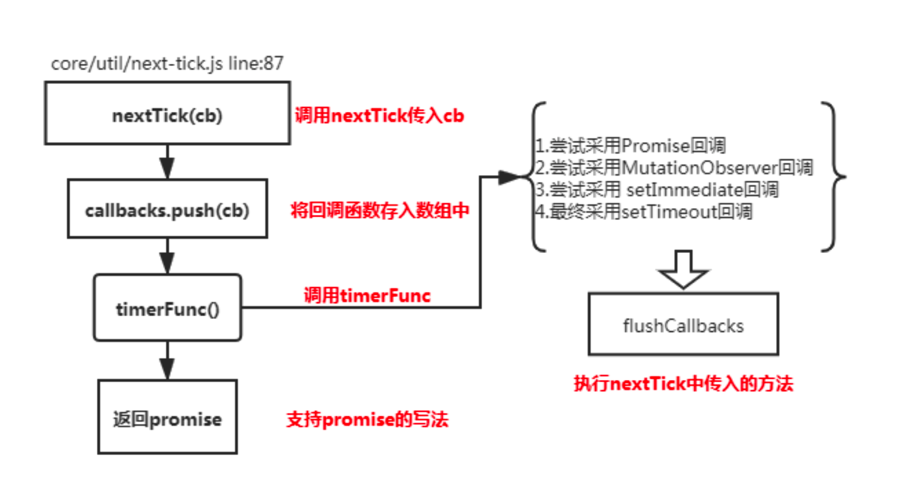
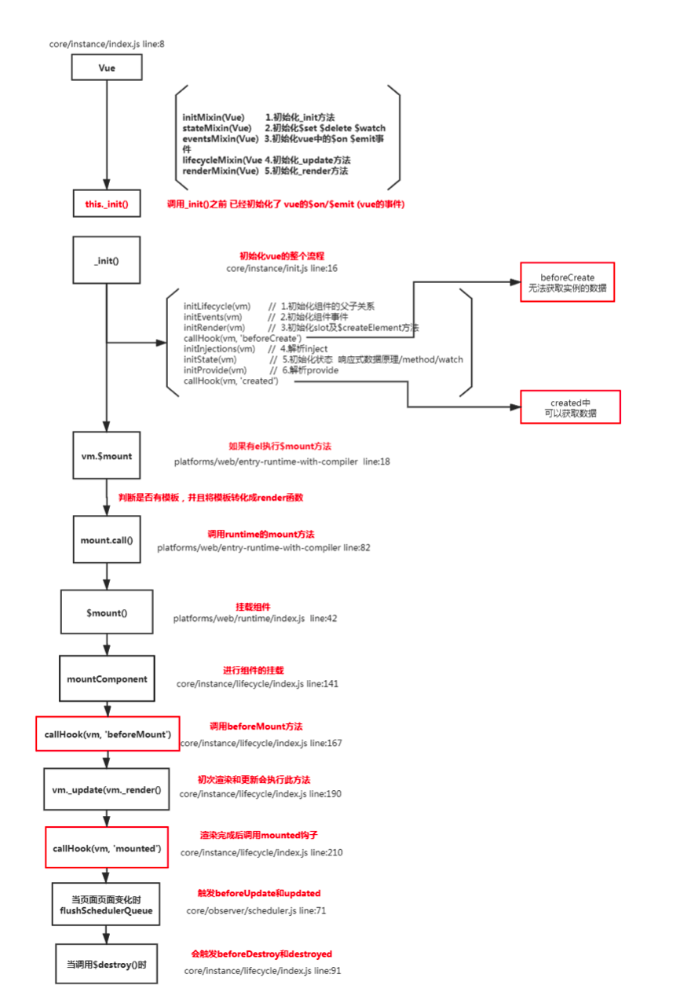

# Vue面试题

### **1.请说一下响应式数据的原理?**


```js
理解:
1.核心点: Object.defineProperty
2.默认 Vue 在初始化数据时，会给 data 中的属性使用 Object.defineProperty 重新定义所有属性,当页面取到对应属性时。会进行依赖收集(收集当前组件的watcher) 如果属性发生变化会通 知相关依赖进行更新操作。

原理:

Object.defineProperty(obj, key, { enumerable: true,
	configurable: true,
	get: function reactiveGetter () {
	const value = getter ? getter.call(obj) : val if (Dep.target) {
	dep.depend() // ** 收集依赖 ** / if (childOb) {
	childOb.dep.depend()
	if (Array.isArray(value)) {
	            dependArray(value)
	          }
	} }
	      return value
	    },
	set: function reactiveSetter (newVal) {
	const value = getter ? getter.call(obj) : val
	if (newVal === value || (newVal !== newVal && value !== value)) {
	return
	}
if (process.env.NODE_ENV !== 'production' && customSetter) {
        customSetter()
      }
val = newVal
childOb = !shallow && observe(newVal) dep.notify() /**通知相关依赖进行更新**/
} })
```


### **2.Vue中是如何检测数组变化**?


```js
理解:
使用函数劫持的方式，重写了数组的方法
Vue 将 data 中的数组，进行了原型链重写。指向了自己定义的数组原型方法，这样当调用数组 api 时，可以通知依赖更新.如果数组中包含着引用类型。会对数组中的引用类型再次进行监控。


const arrayProto = Array.prototype
export const arrayMethods = Object.create(arrayProto) 
const methodsToPatch = [
  'push',
  'pop',
  'shift',
  'unshift',
  'splice',
  'sort',
  'reverse'
]
methodsToPatch.forEach(function (method) { // 重写原型方法
const original = arrayProto[method] // 调用原数组的方法 def(arrayMethods, method, function mutator (...args) {
const result = original.apply(this, args) 
const ob = this.__ob__
let inserted
    switch (method) {
      case 'push':
      case 'unshift':
        inserted = args
        break
      case 'splice':
inserted = args.slice(2)
break
}
if (inserted) ob.observeArray(inserted)
// notify change
ob.dep.notify() // 当调用数组方法后，手动通知视图更新 return result
}) })
this.observeArray(value) // 进行深度监控
```


### **3.**为何采用异步渲染**?**

```js
理解：
因为如果不采用异步更新，那么每次更新数据都会对当前组件进行重新渲染.所以为了性能考虑。 Vue 会在本轮数据更新后，再去异步更新视图!

update () {
	/* istanbul ignore else */ 
  if (this.lazy) {
		this.dirty = true
	} else if (this.sync) {
		this.run() 
  } else {
		queueWatcher(this); // 当数据发生变化时会将watcher放到一个队列中批量更新 
  }
 }

export function queueWatcher(watcher: Watcher) {
  const id = watcher.id; // 会对相同的watcher进行过滤 if (has[id] == null) {
  has[id] = true;
  if (!flushing) {
    queue.push(watcher);
  } else {
    let i = queue.length - 1;
    while (i > index && queue[i].id > watcher.id) {
      i--;
    }
    queue.splice(i + 1, 0, watcher);
  }
  // queue the flush
  if (!waiting) {
    waiting = true;
    if (process.env.NODE_ENV !== "production" && !config.async) {
      flushSchedulerQueue();
      return;
    }
    nextTick(flushSchedulerQueue); // 调用nextTick方法 批量的进行更新 }
  }
}
```


###  **4.**nextTick原理?



```js
理解:(宏任务和微任务) 异步方法
nextTick方法主要是使用了宏任务和微任务,定义了一个异步方法.多次调用nextTick 会将方法存入 队列中，通过这个异步方法清空当前队列。 所以这个 nextTick 方法就是异步方法

let timerFunc // 会定义一个异步方法
if (typeof Promise !== 'undefined' && isNative(Promise)) { // promise
  const p = Promise.resolve()
timerFunc = () => {
p.then(flushCallbacks)
    if (isIOS) setTimeout(noop)
  }
  isUsingMicroTask = true
} else if (!isIE && typeof MutationObserver !== 'undefined' && ( //MutationObserver
  isNative(MutationObserver) ||
MutationObserver.toString() === '[object MutationObserverConstructor]' )) {
let counter = 1
const observer = new MutationObserver(flushCallbacks) const textNode = document.createTextNode(String(counter)) observer.observe(textNode, {
    characterData: true
  })
timerFunc = () => {
counter = (counter + 1) % 2 textNode.data = String(counter)
}
  isUsingMicroTask = true
} else if (typeof setImmediate !== 'undefined' ) { // setImmediate
  timerFunc = () => {
    setImmediate(flushCallbacks)
}
} else {
  timerFunc = () => {   // setTimeout
    setTimeout(flushCallbacks, 0)
} }
// nextTick实现
export function nextTick (cb?: Function, ctx?: Object) {
let _resolve callbacks.push(() => {
if (cb) { try {
cb.call(ctx) } catch (e) {
        handleError(e, ctx, 'nextTick')
      }
    } else if (_resolve) {
      _resolve(ctx)
} })
  if (!pending) {
    pending = true
    timerFunc()
} }
```




```

```


### **6.为什么v-for和v-if不能连用**

```js
const VueTemplateCompiler = require('vue-template-compiler');
let r1 = VueTemplateCompiler.compile(`<div v-if="false" v-for="i in 3">hello</div>`);
/**
with(this) {
    return _l((3), function (i) {
        return (false) ? _c('div', [_v("hello")]) : _e()
}) }
*/
console.log(r1.render);

v-for 会比 v-if 的优先级高一些,如果连用的话会把 v-if 给每个元素都添加一下,会造成性能问题
```


### **7.**用 Vnode来描述一个DOM结构

虚拟节点就是用一个对象来描述真实的 dom 元素

```js
function $createElement(tag, data, ...children) {
  let key = data.key;
  delete data.key;
  children = children.map((child) => {
    if (typeof child === "object") {
      return child;
    } else {
      return vnode(undefined, undefined, undefined, undefined, child);
    }
  });
  return vnode(tag, data, key, children);
}

function vnode(tag, data, key, children, text) {
  return {
    tag, // 表示的是当前的标签名
    data, // 表示的是当前标签上的属性
    key, // 唯一表示用户可能传递
    children,
    text,
  };
}

let v = $createElement(
  "div",
  { id: "container" },
  $createElement("p", { key: "test" }, "hellow"),
  "李白"
);

console.log(v);

{
  tag: 'div',
  data: { id: 'container' },
  key: undefined,
  children: [
    {
      tag: 'p',
      data: {},
      key: 'test',
      children: [Array],
      text: undefined
    },
    {
      tag: undefined,
      data: undefined,
      key: undefined,
      children: undefined,
      text: '李白'
    }
  ],
  text: undefined
}
```


### **8.Vue中模板编译原理**

**将 template 转化成 render 函数**

```js
function baseCompile (template: string,options: CompilerOptions){
	const ast = parse(template.trim(), options) // 1.将模板转化成ast语法树
	if (options.optimize !== false) { 
    optimize(ast, options) // // 2.优化树
  }
  const code = generate(ast, options) // 3.生成树
  return {
		ast,
		render: code.render,
		staticRenderFns: code.staticRenderFns
}})


const ncname = `[a-zA-Z_][\\-\\.0-9_a-zA-Z]*`;
const qnameCapture = `((?:${ncname}\\:)?${ncname})`;
const startTagOpen = new RegExp(`^<${qnameCapture}`); // 标签开头的正则 捕获的内容是标签名
const attribute = /^\s*([^\s"'<>\/=]+)(?:\s*(=)\s*(?:"([^"]*)"+|'([^']*)'+| ([^\s"'=<>`]+)))?/; // 匹配属性的
const endTag = new RegExp(`^<\\/${qnameCapture}[^>]*>`); // 匹配标签结尾的 </div>
const startTagClose = /^\s*(\/?)>/; // 匹配标签结束的 > let root;
let currentParent;
let stack = []
function createASTElement(tagName,attrs){
    return {
        tag:tagName,
        type:1,
        children:[],
        attrs,
        parent:null
		}
}

function start(tagName,attrs){
    let element = createASTElement(tagName,attrs);
    if(!root){
        root = element;
    }
    currentParent = element;
	stack.push(element); 
}

function chars(text){ 
  currentParent.children.push({
			type:3,
			text
  })
}

function end(tagName){
	const element = stack[stack.length-1]; stack.length --;
	currentParent = stack[stack.length-1]; 
  if(currentParent){
		element.parent = currentParent;
		currentParent.children.push(element) 
  }
}

function parseHTML(html){
	while(html){
		let textEnd = html.indexOf('<'); if(textEnd == 0){
  	const startTagMatch = parseStartTag();
  	if(startTagMatch){
			start(startTagMatch.tagName,startTagMatch.attrs);
			continue; 
  	}
		const endTagMatch = html.match(endTag); 
  	if(endTagMatch){
			advance(endTagMatch[0].length);
  		end(endTagMatch[1])
  	}
 	}
  let text;
  if(textEnd >=0 ){
		text = html.substring(0,textEnd) 
  }
	if(text){ 
    advance(text.length);
    chars(text);
	}
}
  
function advance(n) {
	html = html.substring(n);
}
  
function parseStartTag(){
	const start = html.match(startTagOpen); 
  if(start){
     const match = {
        tagName:start[1],
        attrs:[]
		}
    advance(start[0].length);
		let attr,end
		while(!(end = html.match(startTagClose)) &&(attr=html.match(attribute))){
      advance(attr[0].length);
			match.attrs.push({name:attr[1],value:attr[3]}) 
    }
 
	if(end){ 
    advance(end[0].length); 
    return match
	} 
 }
  
// 生成语法树
parseHTML(`<div id="container"><p>hello<span>zf</span></p></div>`); 
  
function gen(node){
	if(node.type == 1){
		return generate(node);
	}else{
		return `_v(${JSON.stringify(node.text)})`
	} 
}
  
function genChildren(el){
	const children = el.children; 
  if(el.children){
		return `[${children.map(c=>gen(c)).join(',')}]` 
  }else{
    return false;
  }
}
  
function genProps(attrs){
	let str = '';
	for(let i = 0; i < attrs.length;i++){
  	let attr = attrs[i];
		str+= `${attr.name}:${attr.value},`; 
  }
	return `{attrs:{${str.slice(0,-1)}}}` 
}
  
function generate(el){
	let children = genChildren(el);
  let code = `_c('${el.tag}'${el.attrs.length? `,${genProps(el.attrs)}`:'' }${children?`,${children}`:'' })`;
    return code;
}
// 根据语法树生成新的代码
let code = generate(root);
let render = `with(this){return ${code}}`;
// 包装成函数
let renderFn = new Function(render); console.log(renderFn.toString());
```


### **4.Vue 中 v-html 会导致哪些问题**?

```js
理解:
可能会导致 xss 攻击，内部绑定了一些事件 ，因为  innerHTML、outerHTML、document.write() 都可能导致xss攻击。可以防止xss攻击的话可以使用 textContent、setAttribute() innerText，就是明确告诉浏览器做啥，但是这种就违背了v-html的初衷。

会替换掉标签内部的子元素

let template = require('vue-template-compiler');
let r = template.compile(`<div v-html="'<span>hello</span>'"></div>`) // with(this){return _c('div',{domProps: {"innerHTML":_s('<span>hello</span>')}})}
console.log(r.render);
// _c 定义在core/instance/render.js
// _s 定义在core/instance/render-helpers/index,js
if (key === 'textContent' || key === 'innerHTML') {
if (vnode.children) vnode.children.length = 0
if (cur === oldProps[key]) continue
// #6601 work around Chrome version <= 55 bug where single textNode // replaced by innerHTML/textContent retains its parentNode property
  if (elm.childNodes.length === 1) {
    elm.removeChild(elm.childNodes[0]) }
}

```


### **6.**Vue 组件如何通信**?** **单向数据流**

```
1.父子间通信 父->子通过props、子->父$on、$emit(发布订阅)
2.获取父子组件实例的方式 $parent、$children
3.在父组件中提供数据子组件进行消费 Provide、inject 插件
4.Ref 获取实例的方式调用组件的属性或者方法
5.Event Bus 实现跨组件通信 Vue.prototype.$bus = new Vue
6.Vuex状态管理实现通信
```

### 7.为什么要使用异步组件?/路由懒加载

```js
理解:
如果组件功能多打包出的结果会变大，我可以采用异步的方式来加载组件。主要依赖 import() 这
个语法，可以实现文件的分割加载。

components:{ AddCustomerSchedule:(resolve)=>import("../components/AddCustomer") //require([])
}

原理:
export function  (
  Ctor: Class<Component> | Function | Object | void,
  data: ?VNodeData,
  context: Component,
  children: ?Array<VNode>,
  tag?: string
): VNode | Array<VNode> | void {
  // async component
	let asyncFactory
	if (isUndef(Ctor.cid)) {
    asyncFactory = Ctor
		Ctor = resolveAsyncComponent(asyncFactory, baseCtor) // 默认调用此函数时返回 undefiend
// 第二次渲染时Ctor不为undefined if (Ctor === undefined) {
		return createAsyncPlaceholder( // 渲染占位符 空虚拟节点 asyncFactory,
			data,
			context,
			children,
			tag)
  }
} }
function resolveAsyncComponent (
  factory: Function,
  baseCtor: Class<Component>
): Class<Component> | void {
	if (isDef(factory.resolved)) { // 3.在次渲染时可以拿到获取的最新组件
		return factory.resolved
  }
const resolve = once((res: Object | Class<Component>) => { factory.resolved = ensureCtor(res, baseCtor)
if (!sync) {
	forceRender(true) //2. 强制更新视图重新渲染 }
 else {
	owners.length = 0
 }
})
const reject = once(reason => {
if (isDef(factory.errorComp)) {
  factory.error = true
  forceRender(true)
}
})
const res = factory(resolve, reject)// 1.将resolve方法和reject方法传入，用户调用 resolve方法后
sync = false
return factory.resolved }
```


### 1.双向绑定和 Vuex 是否冲突?

```js
当在严格模式中使用 Vuex 时，在属于 Vuex 的 state 上使用 v-model 会比较棘手：

<input v-model="obj.message">
假设这里的 obj 是在计算属性中返回的一个属于 Vuex store 的对象，在用户输入时，v-model 会试图直接修改 obj.message。在严格模式中，由于这个修改不是在 mutation 函数中执行的, 这里会抛出一个错误。

用“Vuex 的思维”去解决这个问题的方法是：给 <input> 中绑定 value，然后侦听 input 或者 change 事件，在事件回调中调用一个方法:

<input :value="message" @input="updateMessage">

computed: {
  ...mapState({
    message: state => state.obj.message
  })
},
methods: {
  updateMessage (e) {
    this.$store.commit('updateMessage', e.target.value)
  }
}
mutations: {
  updateMessage (state, message) {
    state.obj.message = message
  }
}


或者
<input v-model="message" />
computed: {
    message: {
        set (value) {
            this.$store.dispatch('updateMessage', value);
        },
        get () {
            return this.$store.state.obj.message
        }
    }
}
mutations: {
    UPDATE_MESSAGE (state, v) {
        state.obj.message = v;
    }
}
actions: {
    update_message ({ commit }, v) {
        commit('UPDATE_MESSAGE', v);
    }
}
```

### 2. Vue.set 的原理?

```js
 ../observer/index 中找出set函数
function set (target: Array<any> | Object, key: any, val: any): any {
  if (process.env.NODE_ENV !== 'production' &&
    (isUndef(target) || isPrimitive(target))
  ) {
    warn(`Cannot set reactive property on undefined, null, or primitive value: ${(target: any)}`)
  }
  // 数组的情况下，通过调用Vue中的 arrayMethods 下面的 7个方法之一
  // splice push pop unshift shift reverse sort，通过调用这些方法可以监听数据，
  // 并把数组里面的每一项进行监听
  if (Array.isArray(target) && isValidArrayIndex(key)) {
    target.length = Math.max(target.length, key)
    target.splice(key, 1, val)
    return val
  }
  // 通过给对象赋值
  if (key in target && !(key in Object.prototype)) {
    target[key] = val
    return val
  }
  const ob = (target: any).__ob__
  if (target._isVue || (ob && ob.vmCount)) {
    process.env.NODE_ENV !== 'production' && warn(
      'Avoid adding reactive properties to a Vue instance or its root $data ' +
      'at runtime - declare it upfront in the data option.'
    )
    return val
  }
  if (!ob) {
    target[key] = val
    return val
  }
  // 监听当前对象
  defineReactive(ob.value, key, val)
  // 收集依赖
  ob.dep.notify()
  return val
}
```

#### Vue compile 过程详细说一下，指令、插值表达式等 vue 语法如何生效的?

```

```

#### Vue 中内置组件 transition、transition-group 的源码实现原理?


#### 2.Vue 的执行流程?

```
先对选项对象初始化，通过Object.defineProperty建立一套响应式系统，然后将模板先解析成AST对象 再解析成render函数，然后使用render函数生成vnode，在渲染前，对vnode进行diff操作，最后进行必要的渲染


AST对象：
{
   attrs: [{name: "id", value: ""app"", dynamic: undefined, start: 5, end: 13}],
   attrsList: [{name: "id", value: "app", start: 5, end: 13}],
   attrsMap: {id: "app"},
   children: [{
        attrsList: [],
        attrsMap: {},
        children: [],
        end: 33,
        parent: {type: 1, tag: "div", ...},
        plain: true,
        pre: undefined,
        rawAttrsMap:{},
        start: 19
        tag: "p",
        type: 1
   }],
   end: 263,
   parent: undefined,
   plain: false,
   rawAttrsMap:{id: {name: "id", value: "app", start: 5, end: 13}},
   start: 0
   tag: "div",
   type: 1
}

render 函数
with(this){
    return _c('div', {attrs:{"id":"app"}}, [_c('p', [_v(_s(msg))])])
}

虚拟dom {
    tag: "div",
    children: [{tag: "p", ...}],
    data: {attrs: {id: "app"}}
    elm: DOM节点（div#app）,
    parent: undefined,
    context: Vue实例,
    ...
}
```

#### **8.**什么是作用域插槽**?**


```js
理解:
1.插槽:
<app><div slot="a">xxxx</div><div slot="b">xxxx</div></app>
slot name="a"
slot name="b"

创建组件虚拟节点时，会将组件的儿子的虚拟节点保存起来。当初始化组件时,通过插槽属性将儿 子进行分类 {a:[vnode],b[vnode]} 渲染组件时会拿对应的slot属性的节点进行替换操作。(插槽的作用域为父组件)

2.作用域插槽: 作用域插槽在解析的时候，不会作为组件的孩子节点。会解析成函数，当子组件渲染时，会调用此
函数进行渲染。(插槽的作用域为子组件)
原理:
 插槽
const VueTemplateCompiler = require('vue-template-compiler'); let ele = VueTemplateCompiler.compile(`
<my-component>
<div slot="header">node</div> <div>react</div>
<div slot="footer">vue</div>
</my-component> `)
/**
with(this) {
return _c('my-component', [_c('div', {
            attrs: {
                "slot": "header"
},
slot: "header"
}, [_v("node")] // _文本节点
    ), _v(" "), _c('div', [_v("react")]), _v(" "), _c('div', {
        attrs: {
            "slot": "footer"
        },
        slot: "footer"
    }, [_v("vue")])])
} */
const VueTemplateCompiler = require('vue-template-compiler');

let ele = VueTemplateCompiler.compile(` <div>
        <slot name="header"></slot>
        <slot name="footer"></slot>
        <slot></slot>
</div> `);
/**
with(this) {
return _c('div', [_v("node"), _v(" "), _t(_v("vue")])]), _v(" "), _t("default")], 2)
}
**/
// _t定义在 core/instance/render-helpers/index.js

作用域插槽
let ele = VueTemplateCompiler.compile(` <app>
<div slot-scope="msg" slot="footer">{{msg.a}}</div> </app>
`);
/** with(this) {
return _c('app', {
scopedSlots: _u([{ // 作用域插槽的内容会被渲染成一个函数
            key: "footer",
            fn: function (msg) {
return _c('div', {}, [_v(_s(msg.a))]) }
}]) })
} }
*/
const VueTemplateCompiler = require('vue-template-compiler');
VueTemplateCompiler.compile(` <div>
        <slot name="footer" a="1" b="2"></slot>
    </div>
`);
/** with(this) {
    return _c('div', [_t("footer", null, {
        "a": "1",
        "b": "2"
    })], 2)
} **/
```

#### **9.** Vue 中事件绑定的原理


```
编译阶段
Vue在挂载实例前，有相当多的工作是进行模板的编译，将template模板进行编译，解析成AST树，再转换成render函数，而在编译阶段，就是对事件的指令做收集处理。
在template模板中，定义事件的部分是属于XML的Attribute，所以收集指令时需要匹配Attributes以确定哪个Attribute是属于事件。


Vue 的事件绑定分为两种一种是原生的事件绑定，还有一种是组件的事件绑定,

理解:
1.原生 dom 事件的绑定,采用的是 addEventListener 实现
2.组件绑定事件采用的是 $on 方法，$emit 触发

原理: 事件的编译:

let compiler = require('vue-template-compiler');

// 通过addEventListener 将事件绑定到dom元素上
let r1 = compiler.compile('<div @click="fn()"></div>');
// 可以通过addEventListener 将事件绑定到dom元素上，不过需要加上native描述符
// 还有通过Vue内部 $on 和 $emit 对事件进行管理
let r2 = compiler.compile('<my-component @click.native="fn" @click="fn1"></my- component>');
console.log(r1); // `with(this){return _c('div',{on:{"click":function($event){return fn()}}})}`
console.log(r2);
//  `with(this){return _c('my-component',{on:{"click":fn1},nativeOn:{"click":function($event){return fn($event)}}})}`


1.原生 的绑定
Vue 在创建真实 dom 时会调用 createElm ,默认会调用 invokeCreateHooks
会遍历当前平台下相对的属性处理代码,其中就有 updateDOMListeners 方法,内部会传入 add 方法
vue 中绑定事件是直接绑定给真实 dom 元素的

function updateDOMListeners (oldVnode: VNodeWithData, vnode: VNodeWithData) {
  if (isUndef(oldVnode.data.on) && isUndef(vnode.data.on)) {
		return
	}
	const on = vnode.data.on || {}
	const oldOn = oldVnode.data.on || {}
	target = vnode.elm
	normalizeEvents(on)
	updateListeners(on, oldOn, add, remove, createOnceHandler, vnode.context)
	target = undefined
}
function add (
  name: string,
  handler: Function,
  capture: boolean,
  passive: boolean
){
target.addEventListener( // 给当前的dom添加事件
    name,
    handler,
    supportsPassive
      ? { capture, passive }
: capture )
}


2.组件中绑定事件
组件绑定事件是通过 vue 中自定义的 $on 方法来实现的


export function updateComponentListeners (
  vm: Component,
  listeners: Object,
  oldListeners: ?Object
){
target = vm
updateListeners(listeners, oldListeners || {}, add, remove, createOnceHandler,vm)
 target = undefined
}
function add (event, fn) { target.$on(event, fn)
}
```


# Vue问答题 基于element-ui

## **怎么重置数据**

```
1.逐个赋值
2.使用 Object.assign(this.data, this.$options.data())
3.重置 data 中某个对象或属性，比如this.params：this.params = this.$options.data().params


重置from表单的数据 this.$refs[formName].resetFields();
```


## **在vue事件中传入$event，使用e.target和e.currentTarget有什么区别**

```
e.currentTarget：指向事件所绑定的元素，所以一直不变。
e.target：始终指向事件发生时的元素，会变。

一般情况下，他们是相同的，但是当存在父子关系时。在父级绑定事件。
1.当我们点击 父级时，e.currentTarget === e.target === 父级
2.当我们点击 子元素时，e.currentTarget ===  父级，e.target === 所点击的元素
```

## **vue怎么实现强制刷新组件**

```
1.如果要在组件内部中进行强制刷新
调用this.$forceUpdate()强制重新渲染组件
2.如果是刷新某个子组件
利用v-if指令的特性
3.当组件的key 值变更时，会自动的重新渲染
4.如果上面的办法都没有效果，可以考虑使用watch
```


## **计算属性，函数名和data数据源中的数据可以同名吗**

```
可以同名，但data会覆盖methods。并且本就不该同名，同名说明你命名不规范。
然后解释为什么会覆盖，因为Props、methods、data、computed、watch都是在initState函数中被初始化的。初始化顺序就是我上面给出的顺序，本质上这些都是要挂载到this上面的，你如果重名的话，后面出现的属性自然而然会覆盖之前挂载的属性了。如果你的eslint配置比较严格的话，同名是编译不通过的。
```

