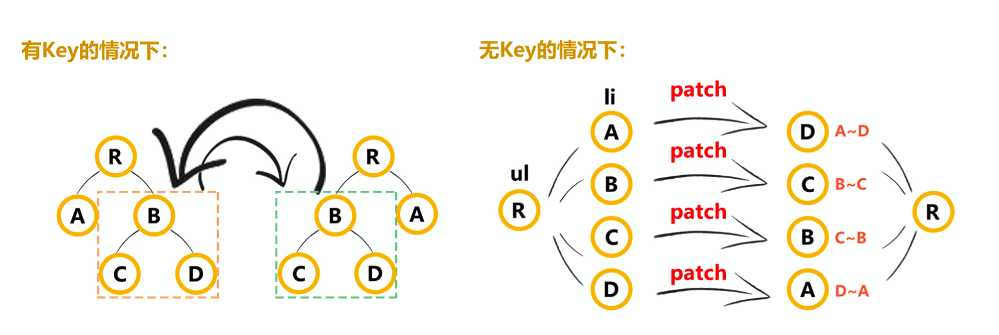

### 1. **diff 中为什么要用 key** **(图解**)



```js
如果有key的情况下，可以更好的判断组件是否相等， 就可以就地服用。
如果没有key的话，只能通过patch去对比，造成性能浪费。

// 判断节点是否相等
function sameVnode(a, b) {
  return (
    a.key === b.key &&
    ((a.tag === b.tag &&
      a.isComment === b.isComment &&
      isDef(a.data) === isDef(b.data) &&
      sameInputType(a, b)) ||
      (isTrue(a.isAsyncPlaceholder) &&
        a.asyncFactory === b.asyncFactory &&
        isUndef(b.asyncFactory.error)))
  );
}
```

### **2.描述组件渲染和更新过程**


```
理解:
渲染组件时，会通过 Vue.extend 方法构建子组件的构造函数，并进行实例化。最终手动调用 $mount() 进行挂载。更新组件时会进行 patchVnode 流程.核心就是diff算法
```

### **3.对 keep-alive 的了解?**

```js
keep-alive 可以实现组件的缓存，当组件切换时不会对当前组件进行卸载,常用的2个属性

include exclude 2个生命周期 deactivated LRU算法
原理: core/components/keep-alive.js

export default {
	name: 'keep-alive',
  abstract: true, // 抽象组件
  props: {
    include: patternTypes,
    exclude: patternTypes,
    max: [String, Number]
	},
	created () {
    // 创建缓存列表 this.keys = [] // 创建缓存组件的key列表
		this.cache = Object.create(null)
	},
	destroyed(){
    //keep-alive销毁时 会清空所有的缓存和key
    for (const key in this.cache) { // 循环销毁
			pruneCacheEntry(this.cache, key, this.keys)
    }
	},
	mounted () { // 会监控include 和 include属性 进行组件的缓存处理
    this.$watch('include', val => {pruneCache(this, name => matches(val, name))})
		this.$watch('exclude', val => { pruneCache(this, name => !matches(val, name))})
  },
	render () {
		const slot = this.$slots.default // 会默认拿插槽
		const vnode: VNode = getFirstComponentChild(slot) // 只缓存第一个组件
    const componentOptions: ?		VNodeComponentOptions = vnode && vnode.componentOptions
		if (componentOptions) {
			// check pattern
		const name: ?string = getComponentName(componentOptions) // 取出组件的名字
    const { include, exclude } = this
		if ( // 判断是否缓存
		        // not included
		        (include && (!name || !matches(include, name))) ||
		        // excluded
		        (exclude && name && matches(exclude, name))
		){
		        return vnode
	}
		const { cache, keys } = this
		const key: ?string = vnode.key == null
		  // same constructor may get registered as different local components // so cid alone is not 			enough (#3269)
		? componentOptions.Ctor.cid + (componentOptions.tag ?`::${componentOptions.tag}` : '')
		: vnode.key // 如果组件没key 就自己通过组件的标签和key和cid 拼接一个key

		if (cache[key]) {
			vnode.componentInstance = cache[key].componentInstance // 直接拿到组件实
			// make current key freshest
			remove(keys, key) // 删除当前的 [b,c,d,e,a] // LRU 最近最久未使用法 keys.push(key) // 并将key放到			后面[b,a]
		} else {
			cache[key] = vnode // 缓存vnode
			keys.push(key) // 将key 存入
			// prune oldest entry
			if (this.max && keys.length > parseInt(this.max)) {
    	  // 缓存的太多超过了max就需要删除掉
				pruneCacheEntry(cache, keys[0], keys, this._vnode)
    	  // 要删除第0个 但是现在渲染的就是第0个
    	}
		}
		vnode.data.keepAlive = true // 并且标准keep-alive下的组件是一个缓存组件
    }
		return vnode || (slot && slot[0]) // 返回当前的虚拟节点
  }
}
```

### **4.Vue 中 v-html 会导致哪些问题**?

```js
理解:
可能会导致 xss 攻击，内部绑定了一些事件 ，因为  innerHTML、outerHTML、document.write() 都可能导致xss攻击。可以防止xss攻击的话可以使用 textContent、setAttribute() innerText，就是明确告诉浏览器做啥，但是这种就违背了v-html的初衷。

会替换掉标签内部的子元素

let template = require('vue-template-compiler');
let r = template.compile(`<div v-html="'<span>hello</span>'"></div>`) // with(this){return _c('div',{domProps: {"innerHTML":_s('<span>hello</span>')}})}
console.log(r.render);
// _c 定义在core/instance/render.js
// _s 定义在core/instance/render-helpers/index,js
if (key === 'textContent' || key === 'innerHTML') {
if (vnode.children) vnode.children.length = 0
if (cur === oldProps[key]) continue
// #6601 work around Chrome version <= 55 bug where single textNode // replaced by innerHTML/textContent retains its parentNode property
  if (elm.childNodes.length === 1) {
    elm.removeChild(elm.childNodes[0]) }
}

```

### **5.** **Vue 父子组件生命周期调用顺序**


```js
加载渲染过程
父beforeCreate->父created->父beforeMount->子beforeCreate->子created->子beforeMount->子mounted->父mounted

子组件更新过程
父beforeUpdate->子beforeUpdate->子updated->父updated

父组件更新过程 父beforeUpdate->父updated

销毁过程
父beforeDestroy->子beforeDestroy->子destroyed->父destroyed

理解: 组件的调用顺序都是先父后子,渲染完成的顺序肯定是先子后父
组件的销毁操作是先父后子，销毁完成的顺序是先子后父

function patch (oldVnode, vnode, hydrating, removeOnly) {
    if (isUndef(vnode)) {
      if (isDef(oldVnode)) invokeDestroyHook(oldVnode)
return
}
let isInitialPatch = false
const insertedVnodeQueue = [] // 定义收集所有组件的insert hook方法的数组 // somthing ...
createElm(
vnode,
insertedVnodeQueue, oldElm._leaveCb ? null : parentElm, nodeOps.nextSibling(oldElm)
)
// somthing...
// 最终会依次调用收集的insert hook
invokeInsertHook(vnode, insertedVnodeQueue, isInitialPatch);

  return vnode.elm }
function createElm (
    vnode,
    insertedVnodeQueue,
    parentElm,
    refElm,
    nested,
ownerArray,
index
){
}
// createChildren会递归创建儿子组件 createChildren(vnode, children, insertedVnodeQueue) // something...
// 将组件的vnode插入到数组中
function invokeCreateHooks (vnode, insertedVnodeQueue) {
for (let i = 0; i < cbs.create.length; ++i) { cbs.create[i](emptyNode, vnode)
}
i = vnode.data.hook // Reuse variable if (isDef(i)) {
if (isDef(i.create)) i.create(emptyNode, vnode)
if (isDef(i.insert)) insertedVnodeQueue.push(vnode) }
}
// insert方法中会依次调用mounted方法 insert (vnode: MountedComponentVNode) {
const { context, componentInstance } = vnode if (!componentInstance._isMounted) {
componentInstance._isMounted = true
      callHook(componentInstance, 'mounted')
    }
}
function invokeInsertHook (vnode, queue, initial) {
// delay insert hooks for component root nodes, invoke them after the // element is really inserted
if (isTrue(initial) && isDef(vnode.parent)) {
vnode.parent.data.pendingInsert = queue } else {
for (let i = 0; i < queue.length; ++i) { queue[i].data.hook.insert(queue[i]); // 调用insert方法
} }
}

Vue.prototype.$destroy = function () {
callHook(vm, 'beforeDestroy') //
// invoke destroy hooks on current rendered tree vm.__patch__(vm._vnode, null) // 先销毁儿子
// fire destroyed hook
callHook(vm, 'destroyed')
}
```

### **6.**Vue 组件如何通信**?** **单向数据流**

```
1.父子间通信 父->子通过props、子->父$on、$emit(发布订阅)
2.获取父子组件实例的方式 $parent、$children
3.在父组件中提供数据子组件进行消费 Provide、inject 插件
4.Ref 获取实例的方式调用组件的属性或者方法
5.Event Bus 实现跨组件通信 Vue.prototype.$bus = new Vue
6.Vuex状态管理实现通信
```

### 7.为什么要使用异步组件?/路由懒加载

```js
理解:
如果组件功能多打包出的结果会变大，我可以采用异步的方式来加载组件。主要依赖 import() 这
个语法，可以实现文件的分割加载。

components:{ AddCustomerSchedule:(resolve)=>import("../components/AddCustomer") //require([])
}

原理:
export function  (
  Ctor: Class<Component> | Function | Object | void,
  data: ?VNodeData,
  context: Component,
  children: ?Array<VNode>,
  tag?: string
): VNode | Array<VNode> | void {
  // async component
	let asyncFactory
	if (isUndef(Ctor.cid)) {
    asyncFactory = Ctor
		Ctor = resolveAsyncComponent(asyncFactory, baseCtor) // 默认调用此函数时返回 undefiend
// 第二次渲染时Ctor不为undefined if (Ctor === undefined) {
		return createAsyncPlaceholder( // 渲染占位符 空虚拟节点 asyncFactory,
			data,
			context,
			children,
			tag)
  }
} }
function resolveAsyncComponent (
  factory: Function,
  baseCtor: Class<Component>
): Class<Component> | void {
	if (isDef(factory.resolved)) { // 3.在次渲染时可以拿到获取的最新组件
		return factory.resolved
  }
const resolve = once((res: Object | Class<Component>) => { factory.resolved = ensureCtor(res, baseCtor)
if (!sync) {
	forceRender(true) //2. 强制更新视图重新渲染 }
 else {
	owners.length = 0
 }
})
const reject = once(reason => {
if (isDef(factory.errorComp)) {
  factory.error = true
  forceRender(true)
}
})
const res = factory(resolve, reject)// 1.将resolve方法和reject方法传入，用户调用 resolve方法后
sync = false
return factory.resolved }
```
