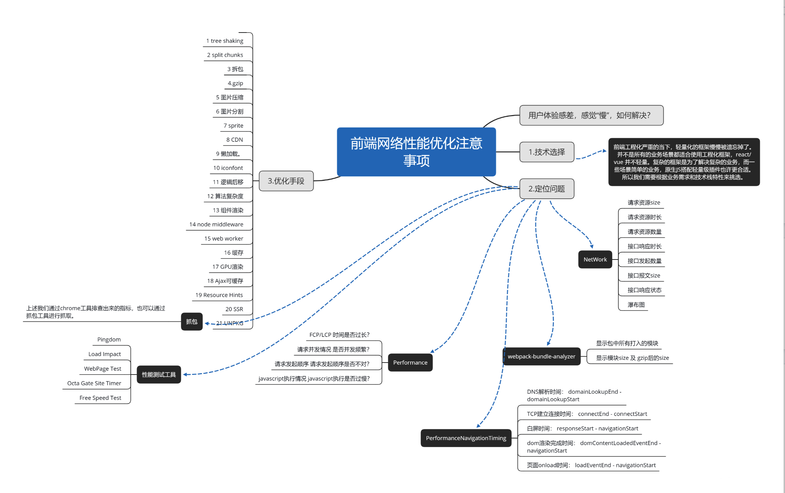
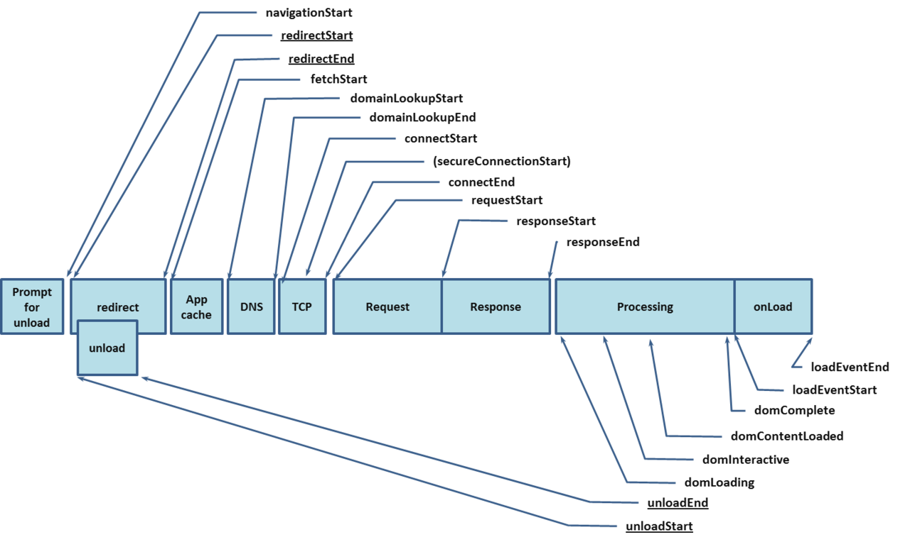
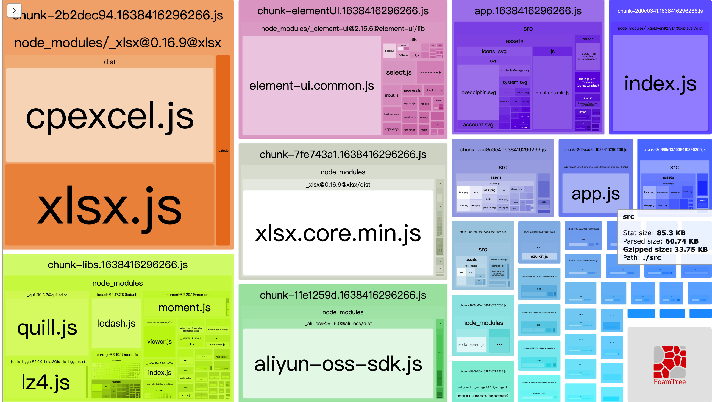

#  首屏优化/性能优化



图片来源：https://cloud.tencent.com/developer/article/1733071


## 定位问题

### [Network](https://developer.chrome.com/docs/devtools/network/reference/?utm_source=devtools)

> [chrome数据面板使用](https://gitee.com/juice-ice/technical-article/blob/master/%E6%B5%8F%E8%A7%88%E5%99%A8%20%E7%BD%91%E7%BB%9C/%E6%B5%8F%E8%A7%88%E5%99%A8%E7%9B%91%E6%8E%A7%E6%80%A7%E8%83%BD.md)

我们看出以下请求信息

**请求资源Size、请求资源时长Time、请求资源数量「总行数」、接口响应时长「TTFB」、接口发起数量「xhr 总行数」、接口报文Size、接口响应状态、瀑布图「Waterfall」**

**优化的目标：Size越小、请求数量越少、Time、Waterfall越短，则为越好，这样我们就可以先排除网络慢的问题。**


### [Performance](https://developer.mozilla.org/zh-CN/docs/Web/API/Performance)

> [官方Performance使用](https://developer.chrome.com/docs/devtools/evaluate-performance/)
>
> [chrome数据面板使用](https://gitee.com/juice-ice/technical-article/blob/master/%E6%B5%8F%E8%A7%88%E5%99%A8%20%E7%BD%91%E7%BB%9C/%E6%B5%8F%E8%A7%88%E5%99%A8%E7%9B%91%E6%8E%A7%E6%80%A7%E8%83%BD.md)


####  [Performance API](https://developer.mozilla.org/zh-CN/docs/Web/API/Performance)

> HTML5新增的api，注意是只读对象




求差值即可得到相应的指标的时间

```js
const timingInfo = window.performance.timing;

// DNS解析，DNS查询耗时
timingInfo.domainLookupEnd - timingInfo.domainLookupStart;

// TCP连接耗时
timingInfo.connectEnd - timingInfo.connectStart;

// 获得首字节耗费时间，也叫TTFB
timingInfo.responseStart - timingInfo.navigationStart;

// domReady时间(与DomContentLoad事件对应)
timingInfo.domContentLoadedEventStart - timingInfo.navigationStart;

// DOM资源下载
timingInfo.responseEnd - timingInfo.responseStart;

// 准备新页面时间耗时
timingInfo.fetchStart - timingInfo.navigationStart;

// 重定向耗时
timingInfo.redirectEnd - timingInfo.redirectStart;

// Appcache 耗时
timingInfo.domainLookupStart - timingInfo.fetchStart;

// unload 前文档耗时
timingInfo.unloadEventEnd - timingInfo.unloadEventStart;

// request请求耗时
timingInfo.responseEnd - timingInfo.requestStart;

// 请求完毕至DOM加载
timingInfo.domInteractive - timingInfo.responseEnd;

// 解释dom树耗时
timingInfo.domComplete - timingInfo.domInteractive;

// 从开始至load总耗时
timingInfo.loadEventEnd - timingInfo.navigationStart;

// 白屏时间
timingInfo.responseStart - timingInfo.fetchStart;

// 首屏时间
timingInfo.domComplete - timingInfo.fetchStart;

// FCP FP 
window.performance.getEntriesByType('paint')
// 获取导航的过程的信息
performance.getEntriesByType("navigation")
```

#### 辅助软件

##### [Pingdom](http://tools.pingdom.com/fpt/)

Pingdom的是一个非常棒的工具，它可以帮助用户通过生成大量报道，如页面大小，浏览器缓存，性能等级等等来确定网站的加载时间。它允许您从不同的位置跟踪历史表现和行为测试。可以设置每隔几分钟测试你的网站，每周发送邮件总结一周内你的网站平均加载时间，可以用来实时监控网站的响应性能。

##### [Load Impact](http://loadimpact.com/)

可以模拟负载测试和性能测试的Web应用程序。设定一定流量测试你网站的性能。可以在全世界选择一个区域，然后模拟测试客户端，带宽，接收到的数据，每秒请求等。该工具将显示一个漂亮的图表来测量加载时间。

##### [WebPage Test](http://www.webpagetest.org/)

它可以运行简单的测试或执行先进的检测，包括多步交易，视频采集，内容封锁等等。您的结果将提供丰富的诊断信息，包括资源加载瀑布图，网页速度优化检查和改进的建议。


### webpack-bundle-analyzer

> [官方](https://www.npmjs.com/package/webpack-bundle-analyzer)
>
> 展示出webpack打包出来后 `dist` 文件中的包的分析。



占用面积越大文件越大，并且我们还可以分析是不是有些包是多余的

**优化目标：减少 `dist` 打包后的大小，进而减少加载时长**


### 网络层面优化

```
1.预加载 ：资源预拉取（prefetch）则是另一种性能优化的技术。通过预拉取可以告诉浏览器用户在未来可能用到哪些资源。
prefetch支持预拉取图片、脚本或者任何可以被浏览器缓存的资源。
在head里 添加 <linkrel="prefetch"href="image.png">
prerender 它可以让浏览器在后台事先渲染好整个页面，加载页面所需的所有资源。
subresource 可以用来指定资源是最高优先级的。当前页面需要，或者马上就会用到时。

2.缓存 ：
2.1 CDN缓存：主要有CDN加载第三方模块，一般是链接，我们直接请求即可。
浏览器缓存、disk cache、memory cash：css js 图片等等的文件资源。

spa缓存应该如何处理？
一般出现这种问题是因为index.html出现强缓存返回200或者协商缓存了返回304。
如何解决问题呢？
这里有个特性，SPA通过webpack打包，一般默认会带有contenthash值，即当对应文件有改动，这个contenthash值才会改变，进而改变打包出来的文件名，意味着只有改变了的文件，文件名才会变，没有改变的文件是不会变的，但是我们利用分块插件后，应该是chunkhash。
那么我们需要解决nginx上对index.html的处理，我们需要在nginx设置 Cache-Control "no-cache, no-store"


那么还有一点服务器其他文件应该怎么处理呢？
对除首页外的文件，设置强缓存且过期时间设置大点，因为其他文件可能都不会变化的。这个具体情况具体分析。
```

### 代码层面

```js
1.路由懒加载：改为用import引用，以函数的形式动态引入，可以把各自的路由文件分别打包，只有在解析给定的路由时，才会下载路由组件；

方式一：component: (resolve) => require(["@/views/xx-manage/yy/index"], resolve)
方式二：component: () => import('@/views/xx-manage/yy/index')

2.element-ui按需加载：引用实际上用到的组件
 2.1 cnpm i element-ui -S
 2.2 cnpm install babel-plugin-component -D
 2.3 在babel.config.js文件夹中
 "plugins": [ [ "component", { "libraryName": "element-ui", "styleLibraryName": "theme-chalk" } ]
  ]
 2.4 在 @/plugins/element.js 中按需导入
 import { Select, Option} from 'element-ui'
	const element = { install: function (Vue) { Vue.use(Select) Vue.use(Option) }
	}
	export default element
 2.5 在vue中安装element-ui插件
 import element from './element/index'
 import 'element-ui/lib/theme-chalk/index.css'
  Vue.use(element)

3.核心代码优先执行，非核心代码延迟执行。

移动端首屏加载可以使用骨架屏，自定义loading，首页单独做服务端渲染。
```

### 打包优化

```js
1.webpack-bundle-analyzer 用来分析webapck构建打包后的文件，如分包情况，占用体积 
cnpm i webpack-bundle-analyzer -D
const BundleAnalyzerPlugin = require('webpack-bundle-analyzer').BundleAnalyzerPlugin // report.html
chainWebpack: (config) => {
config.plugin('webpack-report').use(BundleAnalyzerPlugin, [
        {
          analyzerMode: 'static',
        },
      ])
}

2.利用splitChunksPlugin将存在多个路由的复杂页面的每个页面都单独打一个包，只有访问某个页面的时候，再去下载该页面的js包，以此来加快首页的渲染。

config.optimization.splitChunks(
{
   chunks: 'all',
   cacheGroups: {
     libs: {
       name: 'chunk-libs',
       test: /[\\/]node_modules[\\/]/,
       priority: 10,
       chunks: 'initial',
     },
     elementUI: {
       name: 'chunk-elementUI',
       priority: 20,
       test: /[\\/]node_modules[\\/]_?element-ui(.*)/,
     },
     fortawesome: {
       name: 'chunk-fortawesome',
       priority: 20,
       test: /[\\/]node_modules[\\/]_?@fortawesome(.*)/,
     },
     commons: {
       name: 'chunk-commons',
       test: resolve('src/components'),
       minChunks: 3,
       priority: 5,
       reuseExistingChunk: true,
     },
   },
 })
 .end()

具体可参考 https://juejin.cn/post/6844904103848443912

3.gzip 生产环境记得关闭sourcemap
const CompressionWebpackPlugin = require('compression-webpack-plugin') // GZIP 压缩, dist文件变大了，因为新增了gz文件

 config.plugin('compression').use(CompressionWebpackPlugin, [
	  {
	    filename: '[path].gz[query]',
	    algorithm: 'gzip',
	    test: new RegExp('\\.(' + productionGzipExtensions.join('|') + ')$'),
	    threshold: 8192,
	    minRatio: 0.8,
	  },
	])
	.end()

4.使用预渲染的方式
客户端渲染：用户访问 url，请求 html 文件，前端根据路由动态渲染页面内容。关键链路较长，有一定的白屏时间；
服务端渲染：用户访问 url，服务端根据访问路径请求所需数据，拼接成 html 字符串，返回给前端。前端接收到 html 时已有部分内容；
预渲染：构建阶段生成匹配预渲染路径的 html 文件（注意：每个需要预渲染的路由都有一个对应的 html）。构建出来的 html 文件已有部分内容


cnpm install prerender-spa-plugin --D

vue.config.js
const PrerenderSPAPlugin = require('prerender-spa-plugin')
const Renderer = PrerenderSPAPlugin.PuppeteerRenderer

在configureWebpack中return回去
 plugins: [
  new PrerenderSPAPlugin({
          // 生成文件的路径，也可以与webpakc打包的一致。
          staticDir: path.join(__dirname, 'dist'),
          // 需要预渲染的路由,比如a有参数，就需要写成 /a/param1。
          routes: ['/login', '/workbench'], // 到时候就会生成login.html workbench.html
          // 这个很重要，如果没有配置这段，也不会进行预编译
          renderer: new Renderer({
            headless: true, // 开启无头浏览器
            // 在 main.js 中 document.dispatchEvent(new Event('render-event'))，两者的事件名称要对应上。
            renderAfterDocumentEvent: 'render-event',
          }),
        }),

export default {
  name: 'App',
  mounted() {
    document.dispatchEvent(new Event('render-event'))
  },
}]


5.UglifyJsPlugin 生产环境，压缩混淆代码，移除console代码

6.将Vuex Vue Vue-Router elemnt-ui jquery使用cdn加载

 还有一些小优化 new webpack.IgnorePlugin(/\.\/locale/, /moment/), // 忽略moment的语言包打包
   
   
```


# 优化构建速度


```js
1.speed-measure-webpack-plugin 查看包的构建时间 
yarn add -D speed-measure-webpack-plugin

const SpeedMeasurePlugin = require('speed-measure-webpack-plugin')
module.exports = {
  chainWebpack: config => {
    config
      .plugin('speed-measure-webpack-plugin')
      .use(SpeedMeasurePlugin)
      .end()
  }
}

2.hard-source-webpack-plugin 生成缓存
在启动项目时会针对项目生成缓存，若是项目无package或其他变化，下次就不用花费时间重新构建，直接复用缓存。
const HardSourceWebpackPlugin = require("hard-source-webpack-plugin");
chainWebpack: (config) => {
	config.plugin("speed-measure-webpack-plugin").use(SpeedMeasurePlugin).end(); 
}


3.缩小文件检索解析范围
3.1.为避免无用的检索与递归遍历，可以使用alias指定引用时候的模块。
// 定义getAliasPath方法，把相对路径转换成绝对路径
const getAliasPath = dir => join(__dirname, dir)
 chainWebpack: config => {
    // 添加别名
    config.resolve.alias
      .set('@', getAliasPath('src'))
      .set('assets', getAliasPath('src/assets'))
      .set('utils', getAliasPath('src/utils'))
      .set('views', getAliasPath('src/views'))
      .set('components', getAliasPath('src/components'))
	}
}
3.2.noParse，对不依赖本地代码的第三方依赖不进行解析。
		configureWebpack: config => {
    config.module.noParse = /^(vu|vue-router|vuex|vuex-router-sync|lodash|echarts|axios|element-ui)$/
  }
    
4.使用最新版本 node webapck
```


```
/*
 *     1.利用缓存
     *       + 对于静态资源文件实现强缓存和协商缓存（扩展：文件有更新，如何保证及时刷新？）
 *       + 对于不经常更新的接口数据采用本地存储做数据缓存（扩展：cookie / localStorage / vuex|redux 区别？）
 *     2.DNS优化
 *       + 分服务器部署，增加HTTP并发性（导致DNS解析变慢）
 *       + DNS Prefetch
 *     3.TCP的三次握手和四次挥手
 *       + Connection:keep-alive
 *     4.数据传输
 *       + 减少数据传输的大小
 *         + 内容或者数据压缩（webpack等）
 *         + 服务器端一定要开启GZIP压缩（一般能压缩60%左右）
 *         + 大批量数据分批次请求（例如：下拉刷新或者分页，保证首次加载请求数据少）
 *       + 减少HTTP请求的次数
 *         + 资源文件合并处理
 *         + 字体图标
 *         + 雪碧图 CSS-Sprit
 *         + 图片的BASE64
 *       + ......
 *     5.CDN服务器“地域分布式”
 *     6.采用HTTP2.0
 * ==============
 * 网络优化是前端性能优化的中的重点内容，因为大部分的消耗都发生在网络层，尤其是第一次页面加载，如何减少等待时间很重要“减少白屏的效果和时间”
 *     + LOADDING 人性化体验
 *     + 骨架屏：客户端骨屏 + 服务器骨架屏
 *     + 图片延迟加载
```


```
FP (First Paint) 首次绘制: 标记浏览器渲染任何在视觉上不同于导航前屏幕内容之内容的时间点.
FCP (First Contentful Paint) 首次内容绘制 标记浏览器渲染来自 DOM 第一位内容的时间点，该内容可能是文本、图像、SVG 甚至 元素.
FMP(First Meaningful Paint) 首次有效绘制: 例如，在 YouTube 观看页面上，主视频就是主角元素. 看这个csdn的网站不是很明显, 这几个都成一个时间线了, 截个weibo的看下. 下面的示例图可以看到, 微博的博文是主要元素.

减少请求的次数
1.请求合并：将同一时间需要的js合并，目的是节省dns查找的时间
2.按需加载---（1）单页应用下的按照路由的需要加载 （2）缓存
3.css sprite base64 iconfont
4.cdn托管
5.延迟加载：图片的延迟加载：（就是先不设置img的src属性，等合适的时机（比如滚动、滑动、出现在视窗内等）再把图片真实url放到img的src属性上。） js的延迟加载：

减少代码量
1.精简代码（tree-shaking）----(1)去除无用的代码 (2)规范些代码的方式 (3)外部cdn的引入
2.懒加载 ---（1）路由的懒加载
3.压缩 ---（1）webpack 压缩UglifyJsPlugin；（2）gzip压缩 (3)图片压缩、JPG优化
4.缓存http代码：---浏览器的强缓存（max-age Etag）和协商(弱)缓存（last-modified）
5.第三方组件---第三方组件作为外部依赖使用，会被打爆进业务代码。
6.按需加载 --- （1）第三方库和工具的按需加载，如echarts （2）选择更优的工具 day.js代替moment （3）可用代码拆分（Code-splitting）只传送用户需要的代

减少内存的消耗
1.减少全局变量；
2.减少全局组件；
3.减少dom操作， 减少DOM访问，使用事件代理

webpack
1.遇到webpack打包性能问题，先去npm run build --report，然后根据分析结果来做相应的优化，谁占体积大就干谁
2.webpack提供的externals可以配合外部资源CDN轻松大幅度减少打包体积，尤其对于echarts、jQuery、lodash这种库来说
3.代码拆分

JS 层面细细展开
只传送用户需要的代码。可用代码拆分（Code-splitting）。
优化压缩代码（ES5的Uglify，ES2015的babel-minify或者uglify-es）
高度压缩（用Brotli~q11，Zopfli或gzip）。Brotli的压缩比优于gzip。它可以帮CertSimple节省17%的压缩JS的字节大小，以及帮LinkedIn减少4%的加载时间。
移除无用的代码。用 Chrome DevTools代码覆盖率功能来查找未使用的JS代码。对于精简代码，可参阅tree-shaking， Closure Compiler的高端模式（advanced optimizations）和类似于 lodash-babel-plugin的微调库插件，或者像Moment.js这类库的Webpack的ContextReplacementPlugin。用babel-preset-env & browserlist来避免现代浏览器中已有的转译（transpiling）功能。高级开发人员可能会发现仔细分析Webpack打包（bundle）有助于他们识别和调整不必要的依赖关系。
缓存HTTP代码 来减少网络传输量。确定脚本最佳的缓存时间（例如：max-age）和提供验证令牌（Etag）来避免传送无变化的字节。用Service Worker缓存一方面可以让应用程序网络更加灵活，另一方面也可以让你能够快速访问像V8代码缓存这样的功能。长期缓存可以去了解下Webpack带哈希值文件名（filename hashing）。


其他
1.预加载：preload（在主渲染前进行预加载） 和prefetch（利用空闲时间）,可用webpackde PreLoadWebpackPlugin插件
```

[参考](https://www.jdon.com/performance/best-free-website-speed-testing-tools.html)
