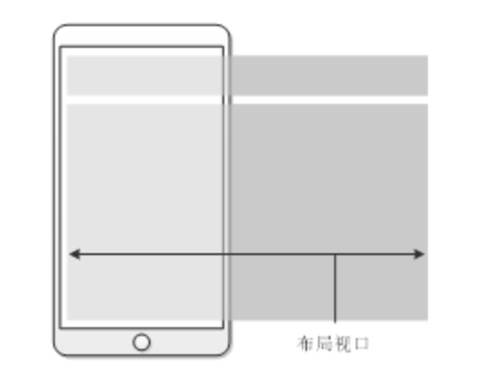

# 移动端兼容


## 视口

### **布局视口**

> 在PC端，布局视口就是浏览器窗口,所以PC端不用管这个，直接使用CSS即可。
>
> `window.screen.width` 返回屏幕的宽度，当有其他小工具「任务栏」占据了屏幕空间时，浏览器有时不能占用小工具占据的空间，所以参数可能有误。 
>
> `document.documentElement.clientWidth`
>
> `document.documentElement.clientHeight`
>
> 需要注意的是，`document.documentElement.clientWidth` 返回文档对象document的根元素「iphone6是 375」,前提是需要使用下面设置 ,不然默认是980
>
> ```html
> <meta name="viewport" content="width=device-width">
> ```


布局视口是指网页的宽度，一般移动端浏览器都默认设置了布局视口的宽度。根据设备的不同，布局视口的默认宽度有可能是768px、980px或1024px等，这个宽度并不适合在手机屏幕中展示。移动端浏览器之所以采用这样的默认设置，是为了解决早期的PC端页面在手机上显示的问题。




当移动端浏览器展示PC端网页内容时，由于移动端设备屏幕比较小，不能像PC端浏览器那样完美地展示网页，这正是布局视口存在的问题。这样的网页在手机的浏览器中会出现左右滚动条，用户需要左右滑动才能查看完整的一行内容。


### 视觉视口

> 移动端专属，PC端不用设置

视觉视口是指用户正在看到的网站的区域，这个区域的宽度等同于移动设备的浏览器窗口的宽度。

需要注意的是，当我们在手机中缩放网页的时候，操作的是视觉视口，而布局视口仍然保持原来的宽度。


### 理想视口

> 它是布局视口的理想尺寸，即理想的布局视口，**需要将布局视口设为理想视口**。

理想视口是指对设备来讲最理想的视口尺寸。采用理想视口的方式，可以使网页在移动端浏览器上获得最理想的浏览和阅读的宽度。


在理想视口情况下，布局视口的大小和屏幕宽度是一致的，这样就不需要左右滚动页面了。

**将布局视口设为理想视口**

```html
<meta name="viewport" content="width=device-width" />
将布局视口的宽度设为理想视口。所以，上面代码中的width指的是布局视口的宽 device-width 实际上就是理想视口的宽度。

所以现在获取理想视口的宽度高度就是同获取布局视口的宽度和高度
```


## **像素**

> 分为设备像素和CSS像素

- 一个CSS像素的大小是可变的，比如放大缩放页面的时候，实际上就是在缩小或放大CSS像素
- 设备像素无论大小还是数量都是不变的，如iphone6的设备像素就是750px。


## **DPR（device pixel ratio）**

> 设备像素比

dpr = 设备像素点数 / 理想视口像素个数（device-width）前提是网页没有进行过缩放。

如果是iphone6的话就是 750 / document.documentElement.clientWidth「375」  

可以使用 `window.devicePixelRatio `获取。


## **meta标签**

> meta视口标签存在的主要目的是为了让布局视口和理想视口的宽度匹配，meta视口标签应该放在HTML文档的head标签内

1. width：设置布局视口的宽
2. init-scale：设置页面的初始缩放程度
3. minimum-scale：设置了页面最小缩放程度
4. maximum-scale：设置了页面最大缩放程度
5. user-scalable：是否允许用户对页面进行缩放操作

```html
<meta name="viewport" content="width=device-width, initial-scale=1.0, maximum-scale=1.0, user-scalable=no">

上面代码的意思是，让布局视口的宽度等于理想视口的宽度，页面的初始缩放比例以及最大缩放比例都为1，且不允许用户对页面进行缩放操作。

如果是iphone6的话，理想视口的宽度 就是375px，通过 document.documentElement.clientWidth 获取。
```


## 兼容处理方式

> 设计稿都是基于设备像素点来设计的，比如iphone6是750px，iphone5是640px。
>
> 我们的css像素是基于布局视口的， document.documentElement.clientWidth = 375/320 这时候会出现设计稿是1/2倍的问题。
>
> 我们要解决的就是这样的问题，要是能自适应那更好了。


### 让设计师重新设计

UI设计师是设计了 750px / 640px这种设计稿不适合我们使用，那么我们想让他重新设计，可以吗？

答案是可以的，但是会给UI以后的设计造成很大的限制，因为本来可以操作2px，现在只能操作1px，那么画出来的页面将会变得不细致。

所以这种方案不是好的解决方案。

当然我们也不可以自己去 “除以2”，因为出现奇数的时候，结果就是小数，浏览器会向上取整 5.5会变成6。


### 缩放视口

如果能将布局视口的尺寸设置为和设备像素尺寸相等的话，这样就保证设计图与页面的1:1关系。

我们就可以直接使用psd中测量的尺寸，在其他尺寸的手机中，再进行等比缩放就可以解决。

缩放的比例需要满足 设备像素 === CSS像素，

Iphone6 设备像素是 750，CSS像素是基于理想视口 375，那么就可以算出缩放比例为2。

推出以下代码 **const scale = 1 / window.devicePixelRatio;**																																																																																																																							

### 解决方案一

```js
const scale = 1 / window.devicePixelRatio;
document.querySelector('meta[name="viewport"]').setAttribute('content','width=device-width,initial-scale=' + scale + ', maximum-scale=' + scale + ', minimum-scale=' + scale + ', user-scalable=no');

思路：
	1.算出缩放比例
  2.通过设置布局视口「width」等于理想视口「deviece-width」，iphone6 设置为 375
设置scale比例后不能放大缩小，保证布局视口等于理想视口，缩小了0.5倍 css像素就变成了750，这样就解决了视口的问题和UI设计稿不一样的问题。

  现在出现的问题是 我设计稿是按照上面说的尺寸，iphone6 上面写了 width:200px height:200px，当我们切换iphone5的时候 同样也是 width:200px height:200px，设计稿是针对iphone6的，iphone5肯定出问题，按照比例的话，ihone5应该是 width:170.6667px height:170.6667px; 需要使用rem 来处理

  3. 使用rem「root element 」 根元素
  document.documentElement.style.fontSize = document.documentElement.clientWidth / 10 + "px"
	这时候 我们算出 iphone6的200px 换算为 200/75 = 2.6667rem，如此iphone5 和iphone6 都可以完美的玩耍了。
  
完整代码
<html>
  <head>
    <title></title>
    <meta charset="utf-8" />
    <meta name="viewport" content="" />
    <style>
      body {
        margin: 0;
        padding: 0;
      }
      .box {
        width: 2.6667rem;
        height: 2.6667rem;

        background: red;
      }
    </style>
  </head>

  <body>
    <div class="box"></div>

    <script>
      const scale = 1 / window.devicePixelRatio
      document
        .querySelector('meta[name="viewport"]')
        .setAttribute(
          "content",
          "width=device-width,initial-scale=" +
            scale +
            ", maximum-scale=" +
            scale +
            ", minimum-scale=" +
            scale +
            ", user-scalable=no"
        )

      document.documentElement.style.fontSize = document.documentElement.clientWidth / 10 + "px"
    </script>
  </body>
</html>
	
```

### 解决方案二

```js
思路是建立在第一种之上的。
	1.设置视口 可以写死了，不需要缩放，因为我们在rem上去判断。
    <meta name="viewport" content="width=device-width,initial-scale=1,maximum-scale=1,user-scalable=no" /> 
  2.document.documentElement.style.fontSize = document.documentElement.clientWidth / 7.5 + 'px';
就可以了。

为什么是7.5？
7.5 是因为设计师出了 750 * 1334 的设计稿。 
如果设计师出了 640 * 1136 那么我们这边 6.4， 375 * 667 那么就是3.75。总之目的就是设计统一的rem，然后方便我们计算，但是后面会有各种办法不需要我们计算的。 比如vscode上面有自动转换的库，项目里面配置插件可以直接使用px转rem
```


## 基于Vue的移动端

```js
方法一：基于rem
https://www.npmjs.com/package/postcss-pxtorem 我使用的是这个库，只需要简单配置一下即可。

cnpm install postcss postcss-pxtorem --save-dev 

在和 vue.config.js目录下面。
.postcssrc.js


// https://github.com/michael-ciniawsky/postcss-load-config
module.exports = {
  plugins: {
    autoprefixer: {
      overrideBrowserslist: ['Android 4.1', 'iOS 7.1', 'Chrome > 31', 'ff > 31', 'ie >= 8']
    },
    'postcss-pxtorem': {
      rootValue: 37.5,
      propList: ['*']
      // selectorBlackList: ['van-']
    }
  }
}

第二步
https://www.npmjs.com/package/lib-flexible

npm install lib-flexible --save

lib-flexible自动在html的head中添加一个meta name="viewport"的标签，同时自动设置html的font-size为屏幕宽度除以10，也就是1rem等于html根节点的font-size。

import 'lib-flexible/flexible.js'

但是官网说 

由于viewport单位得到众多浏览器的兼容，lib-flexible这个过渡方案已经可以放弃使用，不管是现在的版本还是以前的版本，都存有一定的问题。建议大家开始使用viewport来替代此方。


方法二 ：基于视口

cnpm install postcss-px-to-viewport -D


修改 .postcssrc.js

// https://github.com/michael-ciniawsky/postcss-load-config
module.exports = {
  plugins: {
    autoprefixer: {
      overrideBrowserslist: ['Android 4.1', 'iOS 7.1', 'Chrome > 31', 'ff > 31', 'ie >= 8']
    },
    'postcss-px-to-viewport': {
      viewportWidth: 375, // 视窗的宽度，对应的是我们设计稿的宽度，一般是750
      unitPrecision: 3, // 指定`px`转换为视窗单位值的小数位数（很多时候无法整除）
      viewportUnit: 'vw', // 指定需要转换成的视窗单位，建议使用vw
      selectorBlackList: ['.ignore', '.hairlines'], // 指定不转换为视窗单位的类，可以自定义，可以无限添加,建议定义一至两个通用的类名
      minPixelValue: 1, // 小于或等于`1px`不转换为视窗单位，你也可以设置为你想要的值
      mediaQuery: false // 允许在媒体查询中转换`px`
    }
  }
}

记得将方案一的引用和第三方包删除
import 'lib-flexible/flexible.js'
package.json中
"lib-flexible": "^0.3.2",
"postcss-pxtorem": "^5.1.1",
  
  
rem方案和vw方案，分别有什么优点和缺点？
rem 是前两年的兼容方案，已经做了他应该做的贡献
vw 是最近两年的产品，具有良好兼容性。
```

[一篇正在教会你开发移动端页面的文章一](https://mp.weixin.qq.com/s/IEQ0ZP7Zw60nTBi8QnoKWQ)

[一篇正在教会你开发移动端页面的文章二](https://mp.weixin.qq.com/s/QDh5jDuUyQd96zZ1dWX2TA)

[苹果开发官方文档](https://developer.apple.com/library/archive/documentation/AppleApplications/Reference/SafariWebContent/UsingtheViewport/UsingtheViewport.html#//apple_ref/doc/uid/TP40006509-SW25)