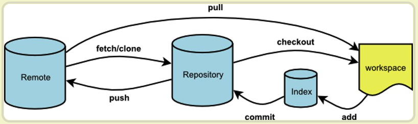

# Git

> 对代码进行管理，原理是分布式版本控制系统，即是中央仓库，本地仓库，开发完需要将本地同步到中央仓库。


[官网]( https://git-scm.com/)、[廖雪峰老师讲解的 Git]( https://www.liaoxuefeng.com/wiki/896043488029600)，[练习Git](https://learngitbranching.js.org/?locale=zh_CN)，[阮一峰老师](https://www.ruanyifeng.com/blog/2014/06/git_remote.html)




## 兜底操作

> 如果 git 掌握不够熟悉，请给自己留点后路。

- 当不确定 git 命令是否正确，请拷贝一份项目并记得不要推到远程，如果已推送并代码不是	你想要的，请使用副本强制推送覆盖代码
- 当你需要回滚的时候，如果不是必要的，请优先选择添加一个 commit 来修改代码，虽然low，这很安全
- 在本地你可以肆意使用你的命令，请确保正确的代码推送远程
- 命令把仓库搞坏了？
  - 使用刚刚创建的副本
  - 或者重新clone 


## 相关名词

### origin

它是一个仓库别名。

```
git remote -v
	origin	git@gitee.com:juice-ice/technical-article.git (fetch)
	origin	git@gitee.com:juice-ice/technical-article.git (push)

那我们 git push、git pull、get fetch 都要加上 origin ？
	git push：
		git push <remote> <branch>，当我们执行 git push，它会默认帮我们填写参数 git push origin master「假设我们在master 分支上」
	git pull、git fetch：
		同理的
	
特殊：
	当新的本地分支并没有提交到远程，这样使用这个方法是不行的，需要远程仓库和本地仓库，保持一种追踪关系，之后就可以忽略本地分支和远程分支了，git push --set-upstream origin test「新的分支名」。这样后面就可以愉快的使用 git push 、 git pull

注意：
	你需要手动的将分支切换到你想进行操作的分支，这样才能取到默认的分支，不然你需要手动指出分支名

```

### 	HEAD

它是指向 `commit` 的引用，正在操作的commit在哪里，HEAD就在哪里，但是 `commit` 一定是在分支上「比如 master」所以 `HEAD` 先是指向 `branch`,`branch` 再去指向`commit` ，提交时它会自动向前移动到最新的 `commit` ，改变 commit  的指向就可以改变HEAD「checkout，reset、revert、rebase...」。

`符号`：HEAD~  === HEAD^， ～ 或 ^ 代表是往前面数多少个 `commit`，数量多可使用 `HEAD～10`，通用支持这种`HEAD@{10}`

特殊点：当 commit 不在分支的情况，checkout commit 的时候，它是脱离了分支的，`git`  会提示`detached HEAD`。

**注意：远程仓库的HEAD永远指向master，本地仓库HEAD根据commit的变化，变化当前的HEAD指向，提交本地仓库到远程仓库并不会将HEAD提交，只会将commits合并一起提交到远程仓库。**

### commit

它是每次执行 `git commit -m"xxx"`的时候产生的一个记录，记录的是一些文件以及内容的变化，每一个 `commit`  都有一个id。多个这样的记录会相互依赖，形成一个`commit 链条`，管它叫 `commits`  吧！。

```
commit id：2fa933a75796ac6c21ee4bf31560d6be507ea293，40位，使用的时候取出前7位即可。

commit id 用处：
	它可以通过 git checkout commit id，查看文件，在这里创建分支
	回滚代码的时候也可以用到，git revert commit id「2fa933a75」，即可操作
```

### 	branch

它是指向 `commit` 的一个引用，`HEAD` 将会跟随着 `branch` 来移动。

解析：当创建 branch 的时候，git 底层会处理 `新branch` 和 `它基于的commit` 作以区分，后期合并代码就会把`新branch中的commits`合并回去。

这样的理解的好处是 当 `git checkout branchName`，它实际会切换到`branchName最新的commit`，如果以`一连串的commit`的形式理解是不准确的，当我们删除分支的时候，并不会把branch一条分支删掉。 只是把branch这个引用删掉，他这个分支包含的commits 会经过一段的时间会被git的垃圾回收机制回收。

正确理解：branch只是一个引用，并不是一串 `commit`。

```
git branch feature1 // 创建分支
git checkout feature1 // 签出分支到feature1

git checkout -b feature1 // 一步到位
git push origin feature1 // 将本地的分支更新到远程仓库

git branch -d feature1 // 删除分支 会失败 -D 就好了
```


## 命令


### Git 配置

> git config 修改 git 的配置信息


### Git 初始化

> git init 初始化仓库，生成 .git 文件
> git clone 克隆仓库

```
git clone projectUrl projectName「可以指定下载下来的项目名称」
```


### Git 查看修改

```
git add . 将新修改的内容添加进暂存区，对于新修改内容，未 git add . ，称为工作区

git status 查看当前修改内容的状态，暂存区和工作区都可以看见

git diff 查看工作区中的内容
git diff --staged 查看当前在暂存区中的内容

git log 查看 commits 日志
--patch 简写 -p ： 具体的改动细节。
--stat          ：统计改变了多少内容
--graph         ：以图的形式查看log

git show 查看 commit 具体改动的细节，它其实有点像 git log -p
git show 「commit 的引用」，这样就可以去看这个 commit 改变了什么内容
```


### git checkout

> git checkout 切换 commit 和 切换 branch 

```
git checkout -b branchName 创建分支并切换
```


### git commit

```
git commit 将暂存区的内容生成一个 commit
--all 简写 -a ：将已存在的文件 执行 git add . + git commit -a,但是新的文件，git是不会把它添加到暂存区，所以你 commit 之前最好 git add .
--message 简写 -m：对这次 commit 进行描述，以后更加方便理解 commit 到底是什么内容
--amend 用于修改提交的message
```


### get merge 

合并commit，有时候是我们主动去merge，但是当 `git pull` 的时候也是会触发 merge的。

```
get merge  合并代码
get merge feature1，
	1.当直接合并，没有问题；
	2.当修改同一个文件触发 git 自动合并成功，这样会有一个新的 commit;
	3.当修改同一个文件触发 git 自动合并失败，这样需要手动去解决冲突
	
git merge --abort // 恢复到git merge feature1前的状态 
```


### get fetch

拉去远程仓库和本地仓库保持一致，默认是根据当前分支。

```
git fetch  获取当前分支的最新代码
git fetch --all 获取所有分支的最新代码
```


### git pull

```
git pull 将远程的代码拉下来，它其实是两个操作，git fetch，get merge 远程最新的 commit
```


### git push

```
git push 将本地的所有的 commits 提交到远程仓库
```


### git rebase

```
变基，它其实和和 merge 是差不多的，都是合并代码。
又有所区别。就是 commits， merge是会出分叉的， rebase 是始终保持一条线。

master： 1——> 2——>3
feature1: 	  \ 
								4——>5

rebase结果： 1——> 2——>4 ——> 5 ——>3
merge结果： 1——> 2——>3——> 6，它会新建一个commit，featur1何必过来，所以它是分叉的。
							  \       /
							  	4——>5 

git checkout feature1 确保将要操作的分支
git rebase master 将 feature1 上面的commit 复制一份到 master 上
git checkout master 确保当前是你想作为基点的分支
git merge feature1 将 master 快速移动到最前面
```


### git reset

重置HEAD的位置，参数就是处理工作区和暂存区的内容是否记录起来。

```
git reset --hard HEAD^  把 HEAD 移动到上一个 commit，并且清空 工作区和缓存区。

git reset --soft HEAD^  把 HEAD 移动到上一个 commit，对上一个coomit 的内容添加进暂存区，保存暂存区的内容，即是现在的暂存区有 reset 前的暂存区和 commit 内容，工作区保留。所以它是一个温和的回退

git reset --mixed 是一个默认的参数，把暂存区的内容退回到工作区，即是暂存区是空的。
git reset HEAD^  把 HEAD 移动到上一个 commit，把上一个coomit 的内容，添加进工作区。此时工作区可能会有，上一个 commit内容，以前的暂存区内容， 以前工作区内容

重置后，因为是落后于远程仓库的原因，所以需要 git push -f ，注意此时你的操作，因为它会影响远程仓库，你应该清楚你在干什么

注意：--force 简写为 -f 

如果发现自己弄错了，记住把所有的操作撤销回来，git pull。回到初始状态。
```


### git revert

安全的撤销 `commit`。操作之前和之后的commit会保留，并且把这次撤销作为一次最新的提交，将需要revert的版本的内容再反向修改回去，这样就可以到达回滚的效果。

```
git revert HEAD   撤销前一次 commit
git revert commit「具体的commit id」
git revert HEAD,HEAD~1,HEAD~2 同时指定几个 commit 

虽然可以同时消除几个，但是它们仍然是一个一个的commit 去对应撤销，即是对应反向操作。
```

#### revert 和 reset 区别

- git revert是用一次新的 commit 来回滚之前的 commit ，git reset 是直接删除指定的 commit
- git reset 是把HEAD向后移动了一下，而 git revert是 HEAD 继续前进，只是新的 commit 的内容和要revert 的内容正好相反，能够抵消要被revert的内容


### git checkout

它是用于切换 `commit`。

- 当参数是  `branchName` 的时候，将会切换到这个分支所指向 `commit`
- 当参数是 `commit id` 的时候，将会切换到这个 `commit` 上会导致 HEAD detached，没有依赖分支

`checkout` 本质上是：切换到指定的 `commit`。


### git stash

它把工作区、暂存区的改动全部**贮藏**起来。多个 `stash` 是可以共存的，即是在一个工作区和暂存区把 `stash list` 全部去出来也是可以的，记得 `git add .`，也可能会产生冲突的。

```
git stash
git stash -u 来排除一些文件
git stash save <message>/git stash push -m <message> 给每一个 stash 记录信息
git stash list 查看 stash 记录
git stash apply stash@{n} 取出相应的stash，n为数字
git stash clear 清除所有的 stash 记录
git stash drop stash@{n} 清除某一个 stash 记录
git stash pop === git stash drop stash@{0}
```


### git cherry-pick

它将指定的 `commit` 移动到其他的分支

**注意：很容易冲突，`git add .`， 再 `git cherry-pick --continue`，当以后所有 `commit ` 合并一起时会冲突的。  **

```
git cherry-pick <commitIdA> 在仓库中找到 commitIdA，到它所在分支最新的commit， 然后把那些 commit 内容挪过来
git cherry-pick ^<commitIdA>..<commitIdB> 在仓库中找到把 commitIdA 到 commitIdB 中的内容挪过来,两边都是闭区间。


git cherry-pick --abort 当执行上面操作后发现出错了，可以撤销刚刚的操作
git cherry-pick --continue 当执行上面操作出冲突了，可以先解决 git add . 再继续执行
git cherry-pick --quit     退出当前的chery-pick序列
-n, --no-commit       不自动提交，把内容放在暂存区和工作区
-e, --edit            编辑提交信息

它的合并策略是这样的？
	比如：现在 1，2，3 个提交。 1，3 都是修改了一个文件，2是新增了一个文件。这时候 git cherry-pick 3的话，就会把 1，3 的内容合并过去。git cherry-pick 1 或者 2 的话，是只会合并一个。这种策略是合理的，当一个文件修改后，肯定是最后一次是你想要的。
```


### git tag

用于给commit 打上 tag，tag 可以代表 commit

```
git tag <tagname> 创建标签 tagname为标签名
git tag 查看当前仓库中的所有标签
git show <tagname> 查看这个tag详细信息
git tag -d <tagname> 删除tag
git tag <tagname> <commitId> 给commitId 打上 tag
```


## 场景

### 最基础的用法

```
git add .
git commit -m"提交到本地仓库"
git pull  // 先更新一下代码 pull 的内部操作其实是把远程仓库取到本地后（使用的是 fetch），再用一次 merge 来把远端仓库的新 commits 合并到本地
git push // 将本地的 commits一起提交上去。
```


### 远程分支删除后，本地仓库保持一致

> 当需求开发完了，其他小伙伴删除分支，你这边本地是无法同步的，可以一个个删除，下面指令可以快速同步远程分支。

```
git fetch origin --prune
```


### 提交信息(pre-msg)写错了

> 当提交信息写的不规范的时候，需要重新修改，覆盖旧的提交信息。

``` 
git commit --amend  这个命令的缺点就是只能修改最新的commit，并且 commitId 是会被修改的
将会进去一个可修改的终端页面，这时候你修改完毕就可以了。
如果你已经推上远程仓库了，这时候需要使用 git push -f
```

#### 已经提交的 commit，工作区/暂存区还没有提交呢？

暂存区是会提交的，工作区是不会提交的。

```
git commit --amend
```


### 暂存区改为工作区

```
git restore --staged .  使用 '.' // 2019年8月出的命令，同 git switch 一致，要求版本 Git 2.23
git restore --staged <file> 使用文件名+后缀

git reset HEAD <file> 使用文件名+后缀 // 兼容性比较好
```


### 把工作区内容临时存起来

> 有时候被插入需求了，或者其他需求要把一些刚开发的代码隐藏起来，当然我又不想创建分支，`git stash` 是一个不错的选择


### 在错误的分支上面开发了，如何将代码进行移动到正确的分支

- 代码在暂存区/工作区，直接切换分支即可，因为工作区和暂存区是所有分支共享的

- 提交 commit 未推送远程仓库

  - ```
    git reset --soft HEAD^，所有回退的内容都会在暂存区和工作区
    切换分支即可
    ```

- 提交 commit 已推送远程仓库

  - ```
    git reset --soft HEAD^ 
    切换分支即可
    git push -f
    ```


### 丢弃本地未提交的 commit / 暂存区/工作区

```
git reset --hard HEAD^ 「指定你要丢弃的 commit 数量」
git checkout . === git reset 丢弃工作区已经修改的内容
git checkout -f 丢弃工作区以及暂存区修改的所有内容
```

#### 只想丢弃某个文件

```
git checkout filename === git reset filename
```


### git reset --hard 操作后，后悔怎么办

```
git reflog // 查看你丢失的commit id，reflog 这个东西能记住，是有一定的条件的，比如不要关机，或者失效性，所以有时候你是恢复不了的

git reset --hard commit id 只需要将 commit 重置回去即可
这时候 commits 会丢失分支，这种情况可以考虑使用创建分支，然后合并回去
```


### commit 合并

把这几个 commit 合并在一起，因为它们改的内容相似的

```
git rebase -i HEAD～num

进入交互页面，将pick 改为 fixup，意思就是将 commit message 这个log 丢了。但是内容不变。
git push -f
```


##   拓展

### gitflow工作流

`Gitflow`工作流定义了一个围绕项目发布的严格分支模型。虽然比[功能分支工作流](https://github.com/oldratlee/translations/blob/master/git-workflows-and-tutorials/workflow-feature-branch.md)复杂几分，但提供了用于一个健壮的用于管理大型项目的框架。

`Gitflow`工作流没有用超出功能分支工作流的概念和命令，而是为不同的分支分配一个很明确的角色，并定义分支之间如何和什么时候进行交互。 除了使用功能分支，在做准备、维护和记录发布也使用各自的分支（Production 分支、Develop 分支、Feature 分支、Release分支、Hotfix分支）。 当然你可以用上功能分支工作流所有的好处：`Pull Requests`、隔离实验性开发和更高效的协作。

### feature branching 工作流（功能分支工作流）

每个新功能都新建一个 `branch`，目前世界上最流行的工作流。

原因：这种工作流由于功能强大，而且概念和使用方式都很简单

### 中央式版本控制系统（Centralized VCS） VS 分布式版本控制系统（Distributed VCS）

中央式版本控制系统 : 每次commit的代码都是放到**中央仓库**。

分布式版本控制系统 ：中央仓库 每个开发者也有自己的仓库，开发者在需求没做完之前，可以提交到本地仓库，完成之后再提交到远程仓库。开发者相互不影响，更加符合开发标准。
