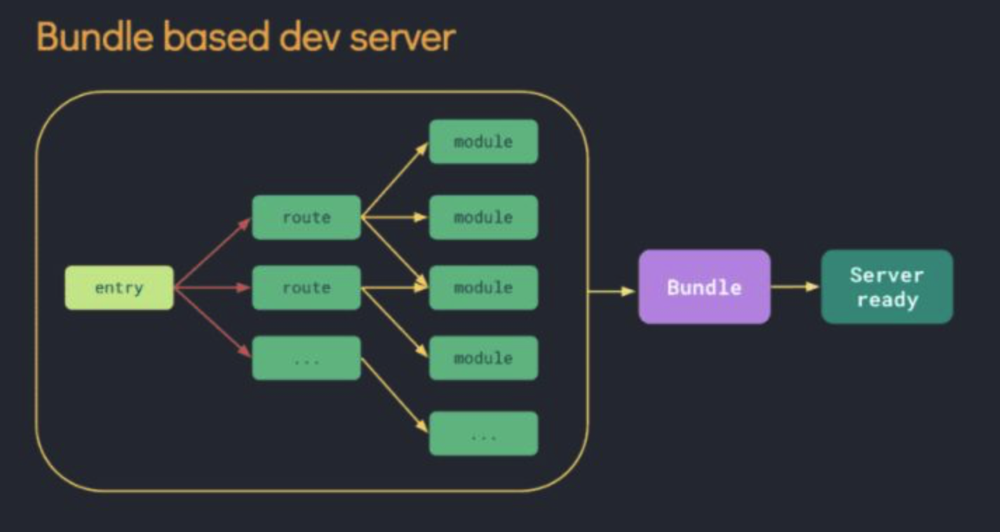
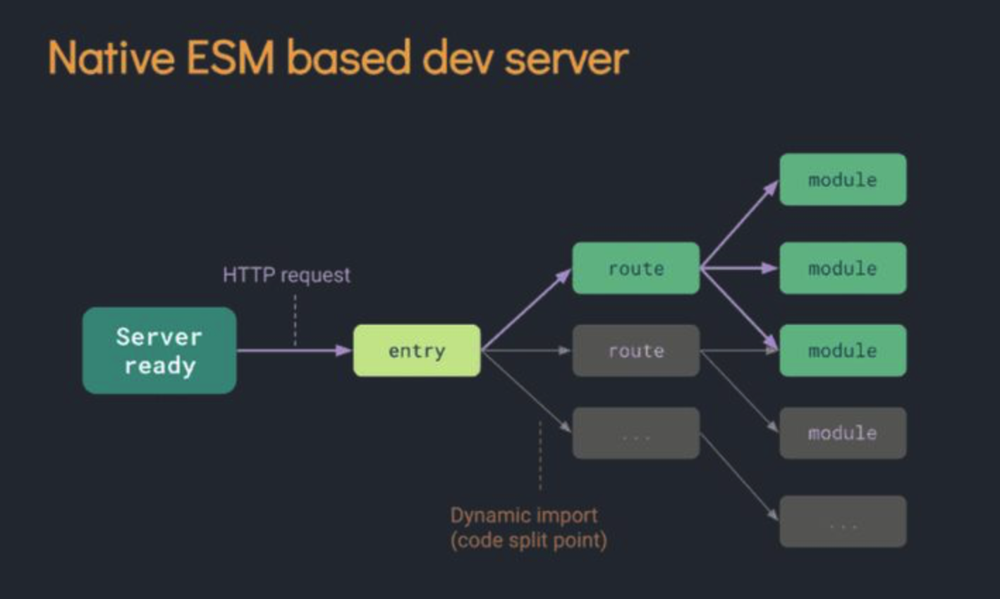
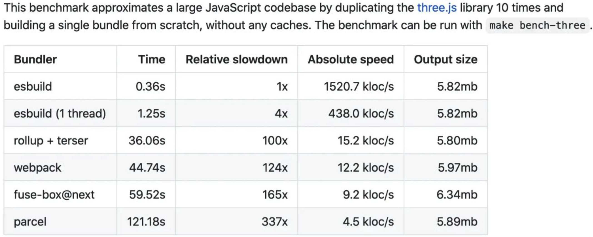
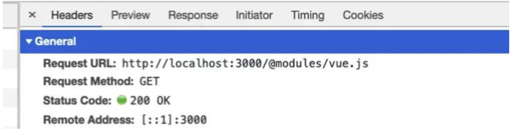
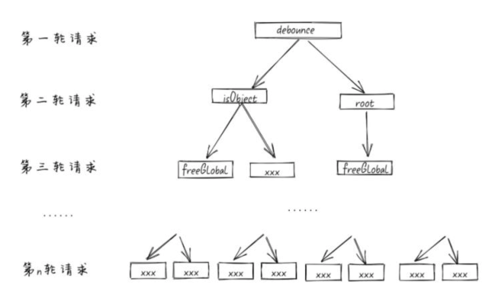
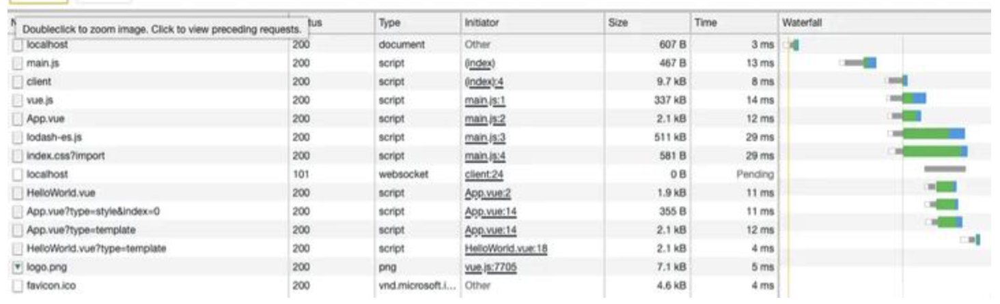
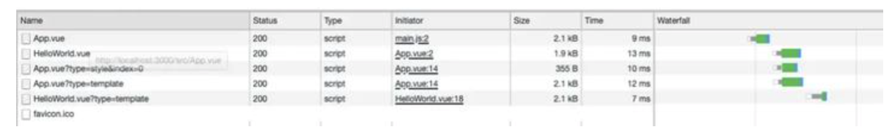
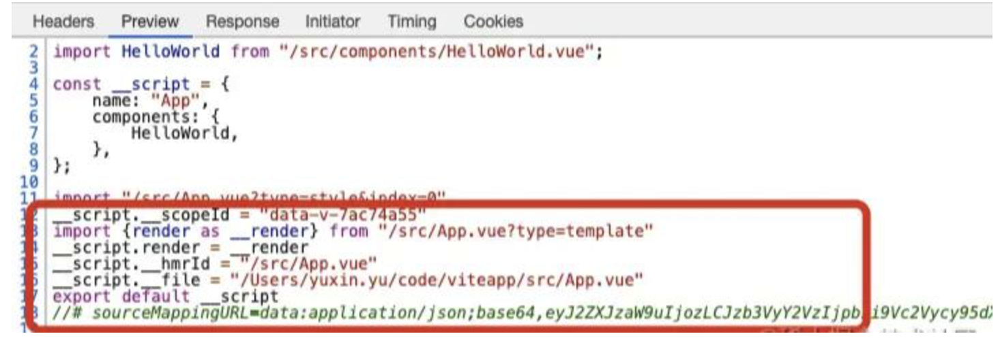

# Vite

Vite 是一个新的打包工具，Vite1.0 发布时间在 2020 年 4 月。

- 开发环境使用 `ESBuild`打包，采用 nobundle 启动开发服务器基本秒启动，不论项目大小。
- 生产环境使用的是 `RollUp` ，毕竟不是所有的浏览器都支持 ESM，所以上生产是需要向后兼容，使用 RollUp 打包，但是 `RollUp` 打包 web 项目并没有 Webpack 稳定，快，兼容性，并且很容易奇奇怪怪的问题。

## Vite 和 Webpack 对比

| Webpack                                | Vite                                                                                                 |
| -------------------------------------- | ---------------------------------------------------------------------------------------------------- |
| 先打包生成 bundle，再启动开发服务器    | 先启动开发服务器，利用新一代浏览器的 ESM 能力，无需打包，直接请求所需模块并实时编译                  |
| HMR 时需要把改动模块及相关依赖全部编译 | HMR 时只需让浏览器重新请求该模块，同时利用浏览器的缓存（源码模块协商缓存，依赖模块强缓存）来优化请求 |
| 内存高效利用                           | -                                                                                                    |

因此，针对开发环境中的启动慢问题，Vite 开发环境冷启动无需打包，无需分析模块之间的依赖，同时也无需在启动开发服务器前进行编译，启动时还会使用 esbuild 来进行预构建。而 Webpack 启动后会做一堆事情，经历一条很长的编译打包链条，从入口开始需要逐步经历语法解析、依赖收集、代码转译、打包合并、代码优化，最终将高版本的、离散的源码编译打包成低版本、高兼容性的产物代码，这可满满都是 CPU、IO 操作啊，在 Node 运行时下性能必然是有问题。

针对 HMR 慢，即使只有很小的改动，Webpack 依然需要构建完整的模块依赖图，并根据依赖图来进行转换。而 Vite 利用了 ESM 和浏览器缓存技术，更新速度与项目复杂度无关。可以看到，如 Snowpack、Vite 这类面相非打包的构建工具，在开发环境启动时只需要启动两个 Server，一个用于页面加载，一个用于 HMR 的 Websocket。当浏览器发出原生的 ESM 请求，Server 收到请求只需要编译当前文件后返回给浏览器，不需要管理依赖。





**使用简单，开箱即用**

相比 Webpack 需要对 entry、loader、plugin 等进行诸多配置，Vite 的使用可谓是相当简单了。只需执行初始化命令，就可以得到一个预设好的开发环境，开箱即获得一堆功能，包括：CSS 预处理、html 预处理、异步加载、分包、压缩、HMR 等。他使用复杂度介于 Parcel 和 Webpack 的中间，只是暴露了极少数的配置项和 plugin 接口，既不会像 Parcel 一样配置不灵活，又不会像 Webpack 一样需要了解庞大的 loader、plugin 生态，灵活适中、复杂度适中。适合前端新手。

## ESBuild

esbuild 是一个全新的 js 打包工具，底层使用了 go，大量使用了并行操作，可以充分利用 CPU 资源。esbuild 支持如 babel, 压缩等的功能。

对比各打包工具性能，可以看到 esbuild 比 rollup 等工具快十几倍。



开发环境不需要对所有资源打包，只是使用 esbuild 对依赖进行预构建，将 CommonJS 和 UMD 发布的依赖转换为浏览器支持的 ESM，同时提高了后续页面的加载性能（lodash 的请求）。Vite 会将于构建的依赖缓存到 node_modules/.vite 目录下，它会根据几个源来决定是否需要重新运行预构建，包括 packages.json 中的 dependencies 列表、包管理器的 lockfile、可能在 vite.config.js 相关字段中配置过的。只要三者之一发生改变，才会重新预构建。

同时，开发环境使用了浏览器缓存技术，解析后的依赖请求以 http 头的 max-age=31536000,immutable 强缓存，以提高页面性能。

## RollUp

在生产环境，由于嵌套导入会导致发送大量的网络请求，即使使用 HTTP2.x（多路复用、首部压缩），在生产环境中发布未打包的 ESM 仍然性能低下。因此，对比在开发环境 Vite 使用 esbuild 来构建依赖，生产环境 Vite 则使用了更加成熟的 Rollup 来完成整个打包过程。因为 esbuild 虽然快，但针对应用级别的代码分割、CSS 处理仍然不够稳定，同时也未能兼容一些未提供 ESM 的 SDK。但是相比 `Webpack` ,`RollUp `在 web 项目稳定上还是不够成熟，原因很简单 `RollUp` 主要用于打包第三方库的，道阻且长。

为了在生产环境中获得最佳的加载性能，仍然需要对代码进行 tree-shaking、懒加载以及 chunk 分割（以获得更好的缓存）。

## Vite 原理

### 2.2、请求拦截

Vite 的基本实现原理，就是启动一个 koa 服务器拦截由浏览器请求 ESM 的请求。通过请求的路径找到目录下对应的文件做一定的处理最终以 ESM 的格式返回给客户端。


**2.2.1、依赖处理**

Vite 通过在一开始将应用中的模块区分为 **依赖** 和 **源码** 两类，改进了开发服务器启动时间。**依赖** 大多为在开发时不会变动的纯 JavaScript。一些较大的依赖（例如有上百个模块的组件库）处理的代价也很高。

- **依赖解析**

以 Vite 官方 demo 为例，当我们请求 **localhost:3000** 时，Vite 默认返回 **localhost:3000/index.html** 的代码。而后发送请求 **src/main.js**。

main.js 代码如下：

```text
import { createApp } from 'vue'
import App from './App.vue'
import './index.css'

createApp(App).mount('#app')
```



可以观察到浏览器请求 vue.js 时， 请求路径是 **@modules/vue.js**。在 Vite 中约定若 path 的请求路径满足 **/^\/@modules\//** 格式时，被认为是一个 node_modules 模块。

平时开发中，webpack & rollup(rollup 有对应插件) 等打包工具会帮我们找到模块的路径，但浏览器只能通过相对路径去寻找，而如果是直接使用模块名比如：**import vue from 'vue'**，浏览器就会报错，这个时候就需要一个三方包进行处理。Vite 对 ESM 形式的 js 文件模块使用了 ES Module Lexer 处理。Lexer 会找到代码中以 import 语法导入的模块并以数组形式返回。Vite 通过该数组的值获取判断是否为一个 node_modules 模块。若是则进行对应改写成 @modules/:id 的写法。

重写完路径后，浏览器会发送 path 为 /@modules/:id 的对应请求，接下来会被 Vite 客户端做一层拦截来解析模块的真实位置。

首先正则匹配请求路径，如果是/@modules 开头就进行后续处理，否则就跳过。若是，会设置响应类型为 js，读取真实模块路径内容，返回给客户端。

客户端注入本质上是创建一个 script 标签（type='module'），然后将其插入到 head 中，这样客户端在解析 html 是就可以执行代码了

```js
export const moduleRE = /^\/@modules\//
// plugin for resolving /@modules/:id requests.
app.use(async (ctx, next) => {
  if (!moduleRE.test(ctx.path)) {
    return next()
  }
  // path maybe contain encode chars
  const id = decodeURIComponent(ctx.path.replace(moduleRE, ''))
  ctx.type = 'js'
  const serve = async (id: string, file: string, type: string) => {
    // 在代码中做一个缓存，下次访问相同路径直接从 map 中获取 304 返回
    moduleIdToFileMap.set(id, file)
    moduleFileToIdMap.set(file, ctx.path)
    debug(`(${type}) ${id} -> ${getDebugPath(root, file)}`)
    await ctx.read(file)
    return next()
  }
 }
  // 兼容 alias 情况
  const importerFilePath = importer ? resolver.requestToFile(importer) : root
  const nodeModulePath = resolveNodeModuleFile(importerFilePath, id)
  // 如果是个 node_modules 的模块，读取文件。
  if (nodeModulePath) {
   return serve(id, nodeModulePath, 'node_modules')
  }
})
```

- **依赖预构建**

依赖预构建主要有两个目的：

- **CommonJS 和 UMD 兼容性:** 开发阶段中，Vite 的开发服务器将所有代码视为原生 ES 模块。因此，Vite 必须先将作为 CommonJS 或 UMD 发布的依赖项转换为 ESM。
- **性能：** Vite 将有许多内部模块的 ESM 依赖关系转换为单个模块，以提高后续页面加载性能。

Vite 使用 esbuild 在初次启动开发服务器前把检测到的依赖进行预构建。Vite 基于 ESM，在使用某些模块时，由于模块依赖了另一些模块，依赖的模块又基于另一些模块。会出现页面初始化时一次发送数百个模块请求的情况。

以 lodash-es 为例，代码中以 import { debounce } from 'lodash' 导入一个命名函数时候，并不是只下载包含这个函数的文件，而是有一个依赖图。



可以看到一共发送了 651 个请求。一共花费 1.53s。


Vite 为了优化这个情况，利用 esbuild 在启动的时候预先把 debounce 用到的所有内部模块全部打包成一个 bundle，这样就浏览器在请求 debounce 时，便只需要发送一次请求了

可以看到预构建后，只发送了 14 个请求。



**2.2.2、静态资源加载**

当请求的路径符合 imageRE, mediaRE, fontsRE 或 JSON 格式，会被认为是一个静态资源。静态资源将处理成 ESM 模块返回。

```js
// src/node/utils/pathUtils.ts
const imageRE = /\.(png|jpe?g|gif|svg|ico|webp)(\?.*)?$/
const mediaRE = /\.(mp4|webm|ogg|mp3|wav|flac|aac)(\?.*)?$/
const fontsRE = /\.(woff2?|eot|ttf|otf)(\?.*)?$/i
export const isStaticAsset = (file: string) => {
  return imageRE.test(file) || mediaRE.test(file) || fontsRE.test(file)
}

// src/node/server/serverPluginAssets.ts
app.use(async (ctx, next) => {
  if (isStaticAsset(ctx.path) && isImportRequest(ctx)) {
    ctx.type = 'js'
    ctx.body = export default ${JSON.stringify(ctx.path)} // 输出是path
    return
  }
  return next()
})

export const jsonPlugin: ServerPlugin = ({ app }) => {
  app.use(async (ctx, next) => {
    await next()
    // handle .json imports
    // note ctx.body could be null if upstream set status to 304
    if (ctx.path.endsWith('.json') && isImportRequest(ctx) && ctx.body) {
      ctx.type = 'js'
      ctx.body = dataToEsm(JSON.parse((await readBody(ctx.body))!), {
        namedExports: true,
        preferConst: true
      })
    }
  })
}
```

**2.2.3、vue 文件缓存**

当 Vite 遇到一个 .vue 后缀的文件时。由于 .vue 模板文件的特殊性，它被拆分成 template, css, script 模块三个模块进行分别处理。最后会对 script, template, css 发送多个请求获取



如上图中请求 App.vue 获取 script 代码 , App.vue?type=template 获取 template, App.vue?type=style。这些代码都被插入在 App.vue 返回的代码中。



**2.2.4、 js/ts 处理**

Vite 使用 esbuild 将 ts 转译到 js，约是 tsc 速度的 20 ～ 30 倍，同时 HMR 更新反应到浏览器的时间会小于 50ms。但是，由于 esbuild 转换 ts 到 js 对于类型操作仅仅是擦除，所以完全保证不了类型正确，因此需要额外校验类型，比如使用 tsc --noEmit。

将 ts 转换成 js 后，浏览器便可以利用 ESM 直接拿到 js 资源。

### 2.3、 热更新原理

Vite 的热加载原理，其实就是在客户端与服务端建立了一个 websocket 连接，当代码被修改时，服务端发送消息通知客户端去请求修改模块的代码，完成热更新。

- 服务端：服务端做的就是监听代码文件的改变，在合适的时机向客户端发送 websocket 信息通知客户端去请求新的模块代码。
- 客户端：Vite 中客户端的 websocket 相关代码在处理 html 中时被写入代码中。可以看到在处理 html 时，vite/client 的相关代码已经被插入。

```js
export const clientPublicPath = `/vite/client`
const devInjectionCode = `\n<script type="module">import "${clientPublicPath}"</script>\n`
async function rewriteHtml(importer: string, html: string) {
  return injectScriptToHtml(html, devInjectionCode)
}
```

当 request.path 路径是 /vite/client 时，请求获取已经提前写好的关于 websocket 的代码。因此在客户端中我们创建了一个 websocket 服务并与服务端建立了连接。

Vite 会接受到来自客户端的消息。通过不同的消息触发一些事件。做到浏览器端的即时热模块更换（热更新）。包括 connect、vue-reload、vue-rerender 等事件，分别触发组件 vue 的重新加载，render 等。

```js
// Listen for messages
socket.addEventListener('message', async ({ data }) => {
  const payload = JSON.parse(data) as HMRPayload | MultiUpdatePayload
  if (payload.type === 'multi') {
    payload.updates.forEach(handleMessage)
  } else {
    handleMessage(payload)
  }
})

async function handleMessage(payload: HMRPayload) {
  const { path, changeSrcPath, timestamp } = payload as UpdatePayload
  console.log(path)
  switch (payload.type) {
    case 'connected':
      console.log(`[vite] connected.`)
      break
    case 'vue-reload':
      queueUpdate(
        import(`${path}?t=${timestamp}`)
          .catch((err) => warnFailedFetch(err, path))
          .then((m) => () => {
            __VUE_HMR_RUNTIME__.reload(path, m.default)
            console.log(`[vite] ${path} reloaded.`)
          })
      )
      break
    case 'vue-rerender':
      const templatePath = `${path}?type=template`
      import(`${templatePath}&t=${timestamp}`).then((m) => {
        __VUE_HMR_RUNTIME__.rerender(path, m.render)
        console.log(`[vite] ${path} template updated.`)
      })
      break
    case 'style-update':
      // check if this is referenced in html via <link>
      const el = document.querySelector(`link[href*='${path}']`)
      if (el) {
        el.setAttribute(
          'href',
          `${path}${path.includes('?') ? '&' : '?'}t=${timestamp}`
        )
        break
      }
      const importQuery = path.includes('?') ? '&import' : '?import'
      await import(`${path}${importQuery}&t=${timestamp}`)
      console.log(`[vite] ${path} updated.`)
      break
    case 'js-update':
      queueUpdate(updateModule(path, changeSrcPath, timestamp))
      break
    case 'custom':
      const cbs = customUpdateMap.get(payload.id)
      if (cbs) {
        cbs.forEach((cb) => cb(payload.customData))
      }
      break
    case 'full-reload':
      if (path.endsWith('.html')) {
        // if html file is edited, only reload the page if the browser is
        // currently on that page.
        const pagePath = location.pathname
        if (
          pagePath === path ||
          (pagePath.endsWith('/') && pagePath + 'index.html' === path)
        ) {
          location.reload()
        }
        return
      } else {
       location.reload()
      }
  }
}
```

## 三、问题

1、构建工具和打包工具的区别？

> 构建过程应该包括 预编译、语法检查、词法检查、依赖处理、文件合并、文件压缩、单元测试、版本管理等 。打包工具更注重打包这一过程，主要包括依赖管理和版本管理。

2、Vite 有什么缺点？

- 目前 Vite 还是使用的 es module 模块不能直接使用生产环境（兼容性问题）。默认情况下，无论是 dev 还是 build 都会直接打出 ESM 版本的代码包，这就要求客户浏览器需要有一个比较新的版本，这放在现在的国情下还是有点难度的。不过 Vite 同时提供了一些弥补的方法，使用 build.polyfillDynamicImport 配置项配合 @vitejs/plugin-legacy 打包出一个看起来兼容性比较好的版本。
- 生产环境使用 rollup 打包会造成开发环境与生产环境的不一致。
- 很多 第三方 sdk 没有产出 ems 格式的的代码，这个需要自己去做一些兼容。

3、Vite 生产环境用了 Rollup，那能在生产环境中直接使用 esm 吗？

- 其实目前的主要问题可能还是兼容性问题。
- 如果你的项目不需要兼容 IE11 等低版本的浏览器，自然是可以使用的。
- 但是更通用的方案可能还是类似 [ployfill.io](http%3A//ployfill.io/) 的原理实现， 提前构建好 bundle.js 与 es module 两个版本的代码，根据浏览器的实际兼容性去动态选择导入哪个模块。

4、对于一些 没有产出 commonjs 的模块，如何去兼容呢？

首先业界是有一些如 lebab 的方法可以将 commjs 代码快速转化为 esm 的，但是对于一些格式不规范的代码，可能还是需要单独处理。

5、如果组件嵌套层级比较深，会影响速度吗？

- 可以看到请求 lodash 时 651 个请求只耗时 1.53s。这个耗时是完全可以接受的。
- Vite 是完全按需加载的，在页面初始化时只会请求初始化页面的一些组件，也就是说即使层级深，但如果未展示可以不加载。
- 缓存可以降低耗时

参考
[https://juejin.cn/post/6904180787965820935](https%3A//juejin.cn/post/6904180787965820935)
[https://juejin.cn/post/6844904053676195847](https%3A//juejin.cn/post/6844904053676195847)
https://www.zhihu.com/question/301856771
[http://www.4k8k.xyz/article/weixin_44135121/90214205](http%3A//www.4k8k.xyz/article/weixin_44135121/90214205)
[https://segmentfault.com/a/1190000022830394](https%3A//segmentfault.com/a/1190000022830394)
[https://juejin.cn/post/6994640378850705445](https%3A//juejin.cn/post/6994640378850705445)
[https://juejin.cn/post/6893699833425559559](https%3A//juejin.cn/post/6893699833425559559)
https://zhuanlan.zhihu.com/p/162072130
[https://juejin.cn/post/6902225969604460558](https%3A//juejin.cn/post/6902225969604460558)
[https://segmentfault.com/a/1190000040135876](https%3A//segmentfault.com/a/1190000040135876)
[Vite 原理浅析](https%3A//km.sankuai.com/page/742371710)

参考

https://zhuanlan.zhihu.com/p/424842555
