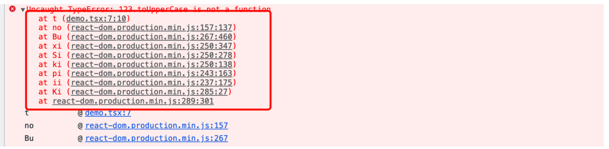
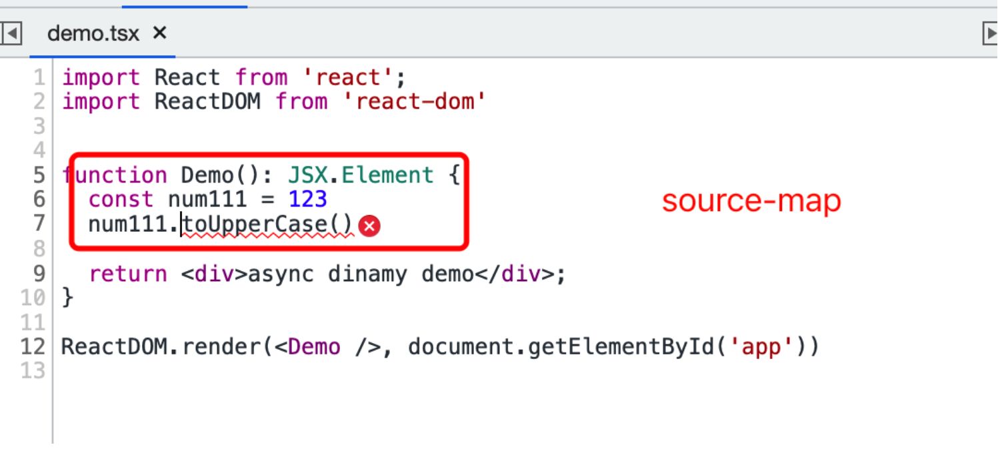
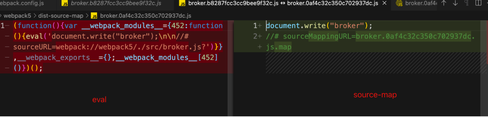
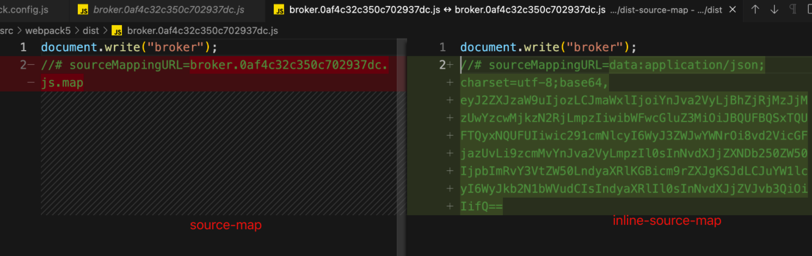
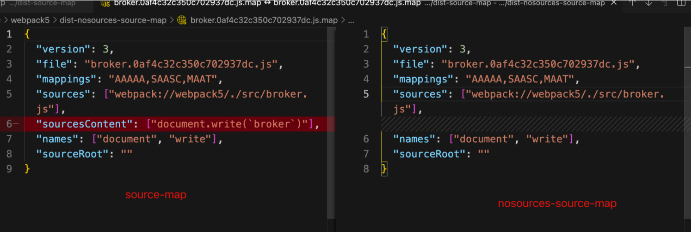
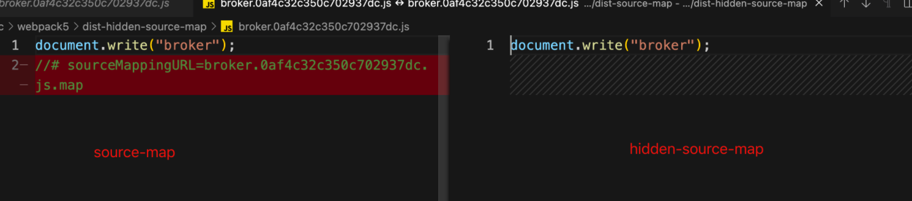
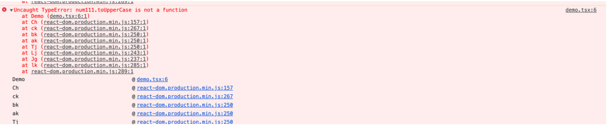
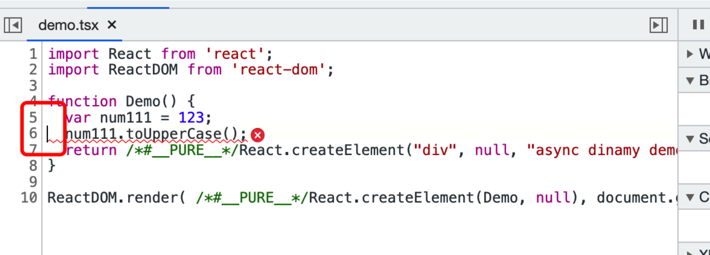
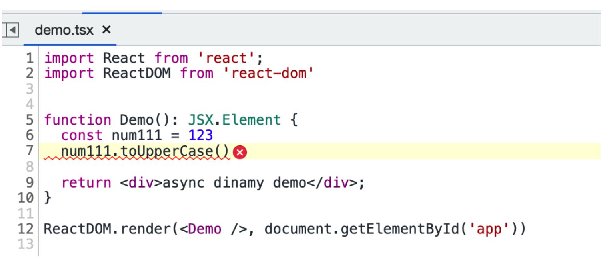

# source map

直译意思资源地图，更加准确的意思是打包后的代码映射到未打包之前的代码，当报错的时候使开发者更加方便找出错误。

## source map会不会影响性能？

不会，只有开启了浏览器的devtool的时候浏览器才会去根据js文件内是否有souceMapUrl的标识去加载对应的source map文件

## source map有没有标准？

有，目前的版本是3，标准包含了source map应该包含的信息，及怎么去设置source map，具体内容请查看[sourcemaps spec](https://sourcemaps.info/spec.html)

webpack为什么有那么多种source-map格式?

​	基于安全、大小（性能）生成了不同方式的source map，但是本质上包含的内容都是标准规定的内容，只是做了部分增减

webpack生成的source map虽然有很多类型，但是归根结底就是几个场景的组合，具体场景如下所示

- eval:  使用eval包裹模块，通过sourceURL来设置eval模块的名称，不会生成source map文件，即无法还原源代码
- cheap：生成source map，不包含列信息、loader的souce map
- source-map: 生产完整的source map文件
- module：生成source map，不包含列信息，包含loader的source map
- inline: 生成内联的source map
- nosources: 生成source map，不含源码，仅包含行列信息
- hidden: 仅生成source map, 不主动添加sourceMapUrl


具体组合规则如下所示

[inline-|hidden-|eval-](#)[cheap-[module-]]source-map


下面以如下源码为例

```
document.write(`broker`)
```

## source-map

```
document.write("broker");
//# sourceMappingURL=broker.0af4c32c350c702937dc.js.map
```





source-map 完整的行列信息，点击错误信息的时候光标会直接定位到错误行列

## eval

```
eval('document.write("broker");\n\n//# sourceURL=webpack://webpack5/./src/broker.js?')
```

#### 

**相对于source-map，eval 不生成source-map，仅添加sourceURL，用于提示错误文件来源**

## inline-source-map

```
document.write("broker");
//# sourceMappingURL=data:application/json;charset=utf-8;base64,eyJ2ZXJzaW9uIjozLCJmaWxlIjoiYnJva2VyLjBhZjRjMzJjMzUwYzcwMjkzN2RjLmpzIiwibWFwcGluZ3MiOiJBQUFBQSxTQUFTQyxNQUFUIiwic291cmNlcyI6WyJ3ZWJwYWNrOi8vd2VicGFjazUvLi9zcmMvYnJva2VyLmpzIl0sInNvdXJjZXNDb250ZW50IjpbImRvY3VtZW50LndyaXRlKGBicm9rZXJgKSJdLCJuYW1lcyI6WyJkb2N1bWVudCIsIndyaXRlIl0sInNvdXJjZVJvb3QiOiIifQ==
```

#### 

**相对于source-map、inline-source-map将单独的source map文件，通过base64的方式添加到源文件内**

## nosources-source-map

```
// 少了sourcesContent包含源码的字段
{"version":3,"file":"broker.0af4c32c350c702937dc.js","mappings":"AAAAA,SAASC,MAAT","sources":["webpack://webpack5/./src/broker.js"],"names":["document","write"],"sourceRoot":""}
```



**相对于source-map、nosources-source-map生成的map文件缺少了源代码，只能用于定位错误的文件及行列号，无法查看源码信息**

## hidden-source-map

```
document.write("broker");
```



**相对于source-map、hidden-source-map不在源码中添加顶级注释//# sourceMappingURL**

## cheap-source-map






**cheap-source-map 完整的行信息，点击错误信息的时候光标会直接定位到错误行**

**cheap-source-map	相对于source-map少了列信息，少了loader转化的source-map，也就是定位的文件是loader转化后的代码，而不是源文件**

## cheap-module-source-map




**cheap-module-source-map	相对于source-map少了列信息，定位的文件是源文件**


## 注意点

**webpack mode production 开启压缩的场景下，devtoo仅支持\**source-map，inline-source-map，hidden-source-map** **和** **nosources-source-map，其它模式不会按照预期生成source map，具体可以查看**[**note-about-source-maps**](https://webpack.js.org/plugins/terser-webpack-plugin/#note-about-source-maps)


## 总结

其实webpack的source map的生成，主要围绕的是安全、大小（也就是速度）两个维度来生成不同种类的source map

首先是最完整的source-map

然后从安全角度看

- nosources-source-map
- hidden-source-map


从大小（速度）角度看

- eval
- cheap
- cheap-module


所以只要理解了source map这么多种类的目的，那么我们就可以结合实际场景做出最适合当前项目的source map

# webpack source map 最佳实践

- 开发环境最求速度推荐eval，追求最佳调试效果soure-map
- 生成环境如果项目接入错误监控系统推荐，hidden-source-map，如果想要更方便一点定位错误也可以选择no-soureces-source-map
