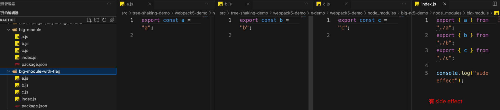
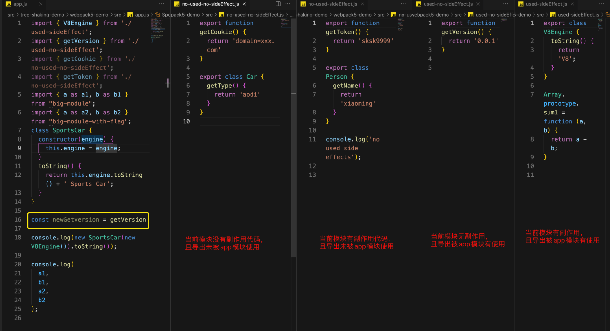
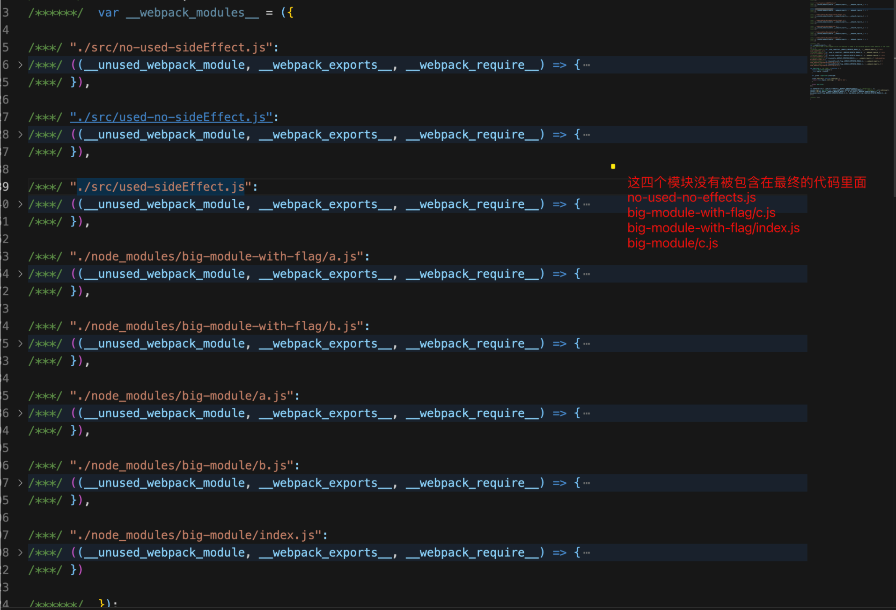
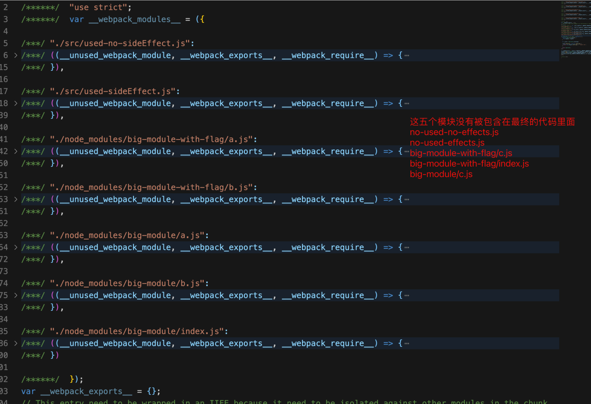
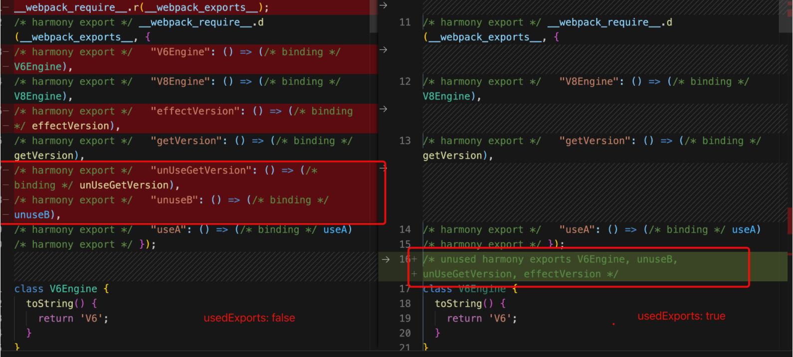

# Tree shaking

**Tree shaking** 是一个通常用于描述移除 JavaScript 上下文中的未引用代码 (dead-code) 行为的术语。

它依赖于 ES2015 中的 [import](https://developer.mozilla.org/zh-CN/docs/Web/JavaScript/Reference/Statements/import) 和 [export](https://developer.mozilla.org/zh-CN/docs/Web/JavaScript/Reference/Statements/export) 语句，用来检测代码模块是否被导出、导入，且被 JavaScript 文件使用。

依赖于 ES2015 的原因是，esm语法是顶级引入的，依赖关系是确认的，可以做静态分析，而是cjs、amd是动态引入的，难以预测，这种方式就无法使用tree shaking。

在现代 JavaScript 应用程序中，我们使用模块打包 (如[webpack](https://webpack.js.org/)或[Rollup](https://github.com/rollup/rollup)) 将多个 JavaScript 文件打包为单个文件时自动删除未引用的代码。这对于准备预备发布代码的工作非常重要，这样可以使最终文件具有简洁的结构和最小化大小。

- [webpack 中的 tree shaking](https://webpack.js.org/guides/tree-shaking/)，下面也将详细介绍 
- [rollup 中的 tree shaking](https://rollupjs.org/guide/zh/#tree-shaking)，`rollup`依赖于`ES6的module`，提供`Tree-shaking`功能，功能是默认自带的，一般在用在工具库打包，Vite 生产模式也是使用 rollup打包


## webpack Tree shaking 发展历程

### webpack2.2 tree shaking

在`wbepack2`之前，`webpack2`无法做到两件事情

- 无法直接处理es6 module，`webpack`是借助`babel-loader`来将es module转化为`webpack`能够识别的commonjs module
- 没有tree shaking能力，因为tree shaking依赖es module

`webpack2.2`，可以直接处理es6 module，及借助[UglifyJS](https://github.com/mishoo/UglifyJS2)实现tree shaking的能力

```js
// engine.js
export class V6Engine {
  toString() {
    return 'V6';
  }
}

export class V8Engine {
  toString() {
    return 'V8';
  }
}

export function getVersion() {
  return '1.0';
}

// index.js
import { V8Engine } from './engine';

class SportsCar {
  constructor(engine) {
    this.engine = engine;
  }

  toString() {
    return this.engine.toString() + ' Sports Car';
  }
}

console.log(new SportsCar(new V8Engine()).toString());
定义类 `SportsCar`，使用了 `V8Engine`，没有用到 `V6Engine`。
代码 tree shaking 后，期望打包结果只包含用到的类和函数。
在这个例子中，意味着它只有 `V8Engine` 和 `SportsCar` 类。


(function(module, __webpack_exports__, __webpack_require__) {

"use strict";
/* unused harmony export getVersion */
class V6Engine {
  toString() {
    return 'V6';
  }
}
/* unused harmony export V6Engine */

class V8Engine {
  toString() {
    return 'V8';
  }
}
/* harmony export (immutable) */ __webpack_exports__["a"] = V8Engine;

function getVersion() {
  return '1.0';
}

/***/ }),
/* 1 */
/***/ (function(module, __webpack_exports__, __webpack_require__) {

"use strict";
Object.defineProperty(__webpack_exports__, "__esModule", { value: true });
/* harmony import */ var __WEBPACK_IMPORTED_MODULE_0__engine__ = __webpack_require__(0);

class SportsCar {
  constructor(engine) {
    this.engine = engine;
  }

  toString() {
    return this.engine.toString() + ' Sports Car';
  }
}

console.log(new SportsCar(new __WEBPACK_IMPORTED_MODULE_0__engine__["a" /* V8Engine */]()).toString());

/***/ })

Webpack 用注释 /*unused harmony export V6Engine*/ 将未使用的类和函数标记下来，用 /*harmony export (immutable)*/ webpack_exports[“a”] = V8Engine; 来标记用到的。
```

**为什么未使用的代码怎么还在？**

`Webpack` 仅仅标记未使用的代码（而不移除），并且不将其导出到模块外。它拉取所有用到的代码，将剩余的（未使用的）代码留给像 `UglifyJS` 这类压缩代码的工具来移除。`UglifyJS` 读取打包结果，在压缩之后移除未使用的代码。通过这一机制，就可以移除未使用的函数 `getVersion` 和类 `V6Engine`。这里与`rollup`是有差异的

```js
// 经过 UglifyJS 压缩后的代码
! function (n) {
  function t(e) {
    if (r[e]) return r[e].exports;
    var o = r[e] = {
      i: e,
      l: !1,
      exports: {}
    };
    return n[e].call(o.exports, o, o.exports, t), o.l = !0, o.exports
  }
  var r = {};
  t.m = n, t.c = r, t.i = function (n) {
    return n
  }, t.d = function (n, r, e) {
    t.o(n, r) || Object.defineProperty(n, r, {
      configurable: !1,
      enumerable: !0,
      get: e
    })
  }, t.n = function (n) {
    var r = n && n.__esModule ? function () {
      return n.default
    } : function () {
      return n
    };
    return t.d(r, "a", r), r
  }, t.o = function (n, t) {
    return Object.prototype.hasOwnProperty.call(n, t)
  }, t.p = "", t(t.s = 2)
}([function (n, t, r) {
  "use strict";
  t.__esModule = !0, t.default = function (n, t) {
    if (!(n instanceof t)) throw new TypeError("Cannot call a class as a function")
  }
}, function (n, t, r) {
  "use strict";
  r.d(t, "a", function () {
    return u
  });
  var e = r(0),
    o = r.n(e),
    u = (function () {
      function n() {
        o()(this, n)
      }
      n.prototype.toString = function () {
        return "V6"
      }
    }(), function () {
      function n() {
        o()(this, n)
      }
      return n.prototype.toString = function () {
        return "V8"
      }, n
    }())
}, function (n, t, r) {
  "use strict";
  Object.defineProperty(t, "__esModule", {
    value: !0
  });
  var e = r(0),
    o = r.n(e),
    u = r(1),
    i = function () {
      function n(t) {
        o()(this, n), this.engine = t
      }
      return n.prototype.toString = function () {
        return this.engine.toString() + " Sports Car"
      }, n
    }();
  console.log(new i(new u.a).toString())
}]);
```

小结：

- `babel-loader`将模块语法转化成`es5「以前UglifyJS不支持es6」`，然后保留es module输出
- `webpack`将所有模块整合成bundle，`webpack`tree shaking不做具体的代码删减，只做标记
- `webpack`将bundle交给`UglifyJS`压缩，UglifyJS 会进行具体的代码删减

**因为类有副作用的原因，所以最终tree shaking只对函数生效，对类未生效**

**问题**

- 无法针对转化之后的`es5`类做tree shaking
  - 比如类，解决这个问题的两个思路，class tree shaking的issues [Webpack repository](https://github.com/webpack/webpack/issues/2867)、[UglifyJS repository](https://github.com/mishoo/UglifyJS2/issues/1261)
    - 思路1: 不转化成`es5`，直接输出`es6`代码，然后`UglifyJS`支持es6+语法压缩
    - 思路2: 另一个就是讨论出来的pure注释方案，这个除了需要`UglifyJS`自身支持，还需要`babel`、`typescipt`等转换器支持，具体issues：[Babel](https://github.com/babel/babel/issues/5632)、[Typescript](https://github.com/Microsoft/TypeScript/issues/13721)。
- 有副作用的场景，tree shaking 会不起作用


### webpack4 sideEffects

#### 什么是副作用

在es module模块上下文中，副作用就是在加载该模块的时候会执行一些影响外部模块执行的代码

```js
// a.js
export const a = 'a'

window.abc = 'abc'

Arrary.prototype.sum = function () {
  return a + b;
}

// index.js
import a from './a'

sum(1, 2)

// 这里的模块`index.js`内未使用`a.js`导出的`a`变量，反而使用了`a`模块内在数组圆形上添加的`sum`方法，这些向全局变量上添加属性or方法，以及填充浏览器的行为都是副作用
```

常见的副作用有

- 控制台输出，比如`console.log`
- `dom`操作，比如`document.write`
- 修改外部or全局变量或属性
- 模块重导出可能产生副作用，因为到模块产生关系的时候

举个例子

```js
// index.js
export { a } from "./a";
export { b } from "./b";
console.log();

// a.js
export const a = 'a'

// b.js
export const b = 'b'
console.log('side effect');

// 项目app.js
import { a } from 'big-module'

console.log(a);

项目中仅使用`a`，没有使用`b`，但是最终的结果是b模块内容也被打包进来了，为什么`b`会被保留，原因是`b.js`内有副作用代码，当有副作用代码的时候，`webpack`无法判断副作用是否能够删除
	所以最终经过压缩工具的时候虽然b能够被删除，但是b模块的副作用代码会被保留下来
```

#### sideEffects作用

为了针对各种副作用的处理，`webpack`选择了`sideEffects: false`一种声明式的方式，通过在package.json中声明一个`sideEffects`字段，帮助`webpack`快速识别模块副作用，从而更好的实现代码tree shaking，

**为什么用声明式，而不是通过程序流程判断的方式？**

声明式更简单，也有效，将项目与包是否有副作用的控制权交给项目或者包的开发者，而`webpack`在构建的时候只需要根据声明来判断怎么处理副作用，而不用通过复杂的程序分析流程去判断模块是否有副作用，这样可以大大减少构建时间

`webpack`把`sideEffects`当成一个优化项，通过`optimization.sideEffects`配置控制，该配置在`mode: production`模式下默认开启，只有`optimization.sideEffects: true`，声明在`package.json`内的`sideEffects` or `rule.sideEffects`字段才会生效


三种方式控制副作用

| 方式/范围                     | 影响范围                | 优先级 |
| ----------------------------- | ----------------------- | ------ |
| 项目package.json sideEffects  | 项目内模块，不包括npm包 | 低     |
| npm包package.json sideEffects | 当前npm包               | 低     |
| rule.sideEffects              | 当前loader作用模块      | 高     |


看一个具体的例子

```
big-module`与`big-module-with-flag`是两个npm包，代码内容一模一样，唯一不同的是`big-module-with-flag` `package.json`内有`"sideEffects": false
```




app内有如下模块，且使用关系如下图所示




`mode: production`，项目`package.json` 不设置`sideEffects` 构建，不进行压缩，构建结果如下图所示




`mode: production`，项目`package.json` 设置`sideEffects: false` 构建，不进行压缩，构建结果如下图所示




从上面结果，我们可以得出如下结论

- `sideEffects:true`，模块的`export`没有一个被父模块使用，只要模块内有副作用，那么模块内所有代码就会被保留，比如`./no-used-effects.js`，`big-module/index.js``
- `sideEffects:false`，且模块不论是否有副作用代码，只要模块的`export`没有一个被父模块使用，则整个模块会被删除，比如`./no-used-effects.js`, `big-module-with-flag/index.js`
- `export`有没有被使用，是根据父模块导入的变量来进行判断，注意这里的判断是简单的通过引用关系判断，没有深入分析导入的变量是否被使用，比如`const newGetVersion = getVersion`这行代码，其实`newGetVersion`在app模块内是没有被使用的

到这里有几个疑问？

- `webpack`是怎么判断模块`export`的变量有没有被使用？
  - 是通过父模块的已使用的导入变量，深入到模块模块内进行判断当前子模块哪些的`export`被使用

- `webpack`是怎么判断模块是否有副作用？
  - 是直接通过`package.json`内的`sideEffects`标识，以及`webpack`在解析代码成`ast`的过程中判断模块是否有副作用的


- `webpack`生成代码的时候是怎样排除无`export`被使用，且无副作用的模块？
  - 是在生成`chunk`的时候，通过判断当前的副作用标识来决定当前模块是否要保留


下面以`webpack`(5.73.0)版本为案例，看下`webpack`内部是怎么实现的

## webpack usedExport 实现原理

`optimization.usedExport` 标记模块导出是否被使用，用于压缩插件直接去掉未使用的导出，具体输出如下所示



- 标记`export`是否被使用，在`FlagDependencyExportsPlugin`与`FlagDependencyUsagePlugin`插件内处理
- 副作用的处理在`SideEffectsFlagPlugin`插件内


### webpack tree shaking 最佳实践

虽然`webpack4`及以上在`webpack2`的基础上添加了`sideEffects`标识来帮助tree shaking，但是受限于js的灵活性与模块的复杂性，还是有很多没有解决的副作用场景，使得最终的tree shaking效果不够完美，所以要想更好的tree shaking效果，我们可以人为的使用一些手段去提高tree shaking的效果

#### 配置mainFields优先级

```javascript
module.exports = {
  //...
  resolve: {
    // module推荐放到main前面，因为大部分npm包提供了es module模块，而es module入口约定通过module字段暴露
    mainFields: ['browser', 'module', 'main'],
  },
};
```

#### 禁止babel转换模块语法

```javascript
// babel.config.js

module.exports = {
  "presets": [
    ["@babel/preset-env", {
      "loose": true,
      "modules": false // 配置成false or auto，避免babel将模块转化成commonjs模块
    }]
  ]
}
```

#### 使用自带tree shaking的包

比如使用`lodash-es`替换`lodash`等

不过并不是所有的npm包都还有tree shaking的优化空间，比如`vue`、`react`等提供的`min`版本已经是最小功能集的版本

#### 避免无意义的赋值

```javascript
import { getVersion } from './used-no-sideEffect';

const newGetversion = getVersion
```

从之前的例子可以看到，`webpack`判断模块的`export`是否被使用，只是简单的判断了是否有引用关系，没有进行程序流程分析，所以这就导致了明明可以被摇树的包，最终还保留了下来

#### 优化导出方式

`webpack`的tree shaking依赖的是模块的`export`，所以下面这样的导出方式,虽然只使用了一个，但最终都会被保留下来

```javascript
export default {
    bar: 'bar',
    foo: 'foo'
}
```

所以实际开发中，应该尽量保持导出值颗粒度和原子性，上例代码的优化版本

```javascript
const bar = 'bar'
const foo = 'foo'

export {
    bar,
    foo
}
```

#### npm包配置sideEffects

如果npm不是用于`polyfill`，可以大胆的在`package.json`内设置`"sideEffects": false`

```javascript
{
  "name": "awesome npm module",
  "version": "1.0.0",
  "sideEffects": false
}
```

如果包内有些模块确定是有副作用，可以设置数组形式，以`@abc/yked`为例

```javascript
{
  "name": "",
  "version": "2.5.6",
  "description": "",
  "main": "lib/index.js",
  "module": "es/index.js",
  "types": "lib/index.d.ts",
  "sideEffects": [
    "lib/index.js",
    "es/index.js",
    "*.less"
  ]
}
```


```javascript
// index.js
import { setDomainUrl } from './utils/set-domain-url';

// 设置使用方a标签跳转带有token和mini_app_id
setDomainUrl();

export * from './components';
export * from './decorator';
```

该npm包内`.less`与`index.js`文件是有副作用的，这些副作用需要保留，其它模块都是可以认为没有副作用的


如果包确实是有副作用的，那么不需要设置了，不设置就默认`sideEffects: true`

### 

#### 已添加sideEffects的npm包

- [vue](https://github.com/vuejs/vue/blob/main/package.json#L36)
- [three.js](https://github.com/mrdoob/three.js/blob/dev/package.json#L21)
- [lodash](https://github.com/lodash/lodash/blob/master/package.json#L10)
- [ant-design-mobile](https://github.com/ant-design/ant-design-mobile/blob/master/package.json#L131)
- [ramda](https://github.com/ramda/ramda/blob/master/package.json#L40)
- [rxjs](https://github.com/ReactiveX/rxjs/blob/master/package.json#L16)

等等还有很多现在使用量非常大的包

#### 新项目配置sideEffects

其实对于一个项目的组成，主要由两部分组成，一部分是自己写的代码，一部分是第三方npm包，所以对项目配置`sideEffects`也可以

如果是新项目推荐如下配置

```javascript
{
  "name": "app",
  "version": "1.0.0",
  "sideEffects": [
    '*.css',
    'run.js' // 添加需要保留副作用的模块
  ]
}
```


如果是旧项目不推荐在`package.json`内设置`sideEffects`字段


如果想要给第三方npm包添加无副作用标识，可以通过自己写一个插件，针对需要的模块设置副作用的值

```js
module.exports = class AddSideEffectsPlugin {
  constructor({
    includePackages = [], // 传入需要处理的npm package name
  } = {}) {
    this.includePackages = includePackages;
  }
  apply(compiler /*: any */) {
    const name = this.constructor.name;
    const { context } = compiler;
    compiler.hooks.normalModuleFactory.tap(name, normalModuleFactory => {
      normalModuleFactory.hooks.module.tap(name, (module, data) => {
        const resolveData = data.resourceResolveData;
        
        // 如果npm包没有设置sideEffects，且满足includePackages，就设置sideEffectFree: true,表示该模块是纯的
        if (
          this.includePackages.some((item) => data.resource.include(item)),
          resolveData &&
          resolveData.descriptionFileData &&
          resolveData.descriptionFileData.sideEffects === void 0
        ) {
          module.factoryMeta.sideEffectFree = true;
        }
      });
    });
  }
};
```


# webpack tree shaking 总结

`webpack4`及以上的tree shaking包含两部分

- `webpack`标记`unused`，然后由压缩插件`terser`等直接删除未使用的这部分代码(可以配置压缩插件参数不删除)
- `webpack` `sideEffects`是模块级别，根据模块的`export`变量是否使用来判断模块是否需要保留


对于一个模块里面`dead_code`，`drop_console`，`drop_debugger`，`unused`，webpack还是比较智能的，它知道这些代码在 `mode：production`，它可以对这些代码打上不要的标记。

因为sideEffects是比较难分析和预测的需要开发者告诉webpack怎么处理

`sideEffects: false` ： 当前项目 or `npm`包内的模块是没有副作用的，就算有副作用，也当成没有副作用处理，当模块没有被父模块使用「已经引入，但没有使用」，则整个模块会被删除。

`sideEffects:true`：默认值，模块的`export`没有一个被父模块使用，只要模块内有副作用，那么模块内所有代码就会被保留。


参考：https://developer.mozilla.org/zh-CN/docs/Glossary/Tree_shaking