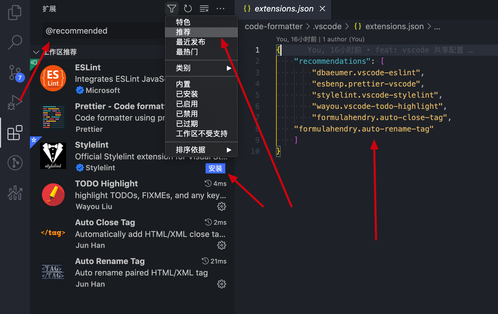
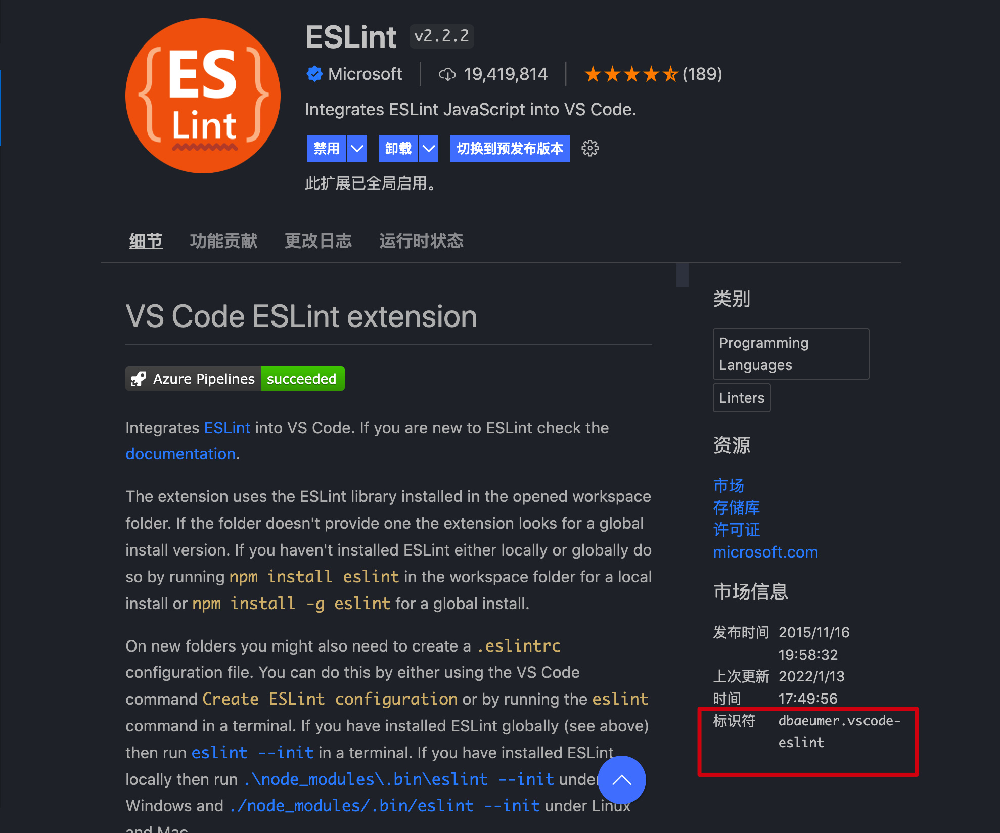

# 代码统一规范


## 前言

我对代码统一格式化的态度是：

- 能够按照配置自动格式化代码；
- 开发过程中遇到一些语法错误提示，并不能阻止我的编译；
- 提交代码的描述信息规范，方便出问题查阅。

所以我以往的项目就是在网上找到别人的经验直接 `CV大法`，一般也不会出问题，因为也导致我对它了解并不是很多。但是最近换去接手一个项目，让我处处碰壁，联系造物主他也很热心解决问题，但是仍然没有解决我的恶疾。我受不了，于是给自己立了一个专题学习计划，开工、准备重构，下面都是我的实操。


> 本文将详细讲解 **`前端代码统一规范`**，授人以鱼，不如授人以渔，这篇文章鱼和渔都有。将会涉及的范围比较广，使用到的第三方库有以下这些**「 Prettier、Eslint、Stylelint、husky、commitlint、lint-staged」**。阅读本文将会花费较长时间，**因为你需要熟悉不同的插件**。


[鱼：你可以在这里看见我的demo](https://gitee.com/juice-ice/code-formatter)

渔：就是下面实操了，我踩过的坑，和推荐的官网希望能够帮助到你

**友情提示：为了方便调式，快速重新加载编辑器 cmd + shift + p —>  Reload Window**


## 问题

Eslint 和 Prettier 冲突怎么解决？

为什么 Eslint 和 Prettier 两大插件不融合一起，让开发者减少配置的麻烦？

既然 node_modules 上安装了 Eslint、Prettier  为什么 vscode 还需要安装？

新人接手项目应该如何获取最佳体验，即是如何共享配置？


## 初始化

开局就是先一个初始化的项目，`npx create-react-app your-project-name `。

请把 vscode 全部插件禁用、settings.json全部注释。

干净又卫生的项目和编辑器出来了。


## 开工

往项目上开始添砖加瓦，一顿操作猛如虎，一看战绩零扛五。

### Prettier

一个美化项目代码的超高人气的库，自带配置即可使用，修改配置后不需要重启项目，但Eslint必须重启。

先在 VSCode 上面安装 `Prettier - Code formatter` ，并且请**你仔细阅读这份英文文档，和 [Prettier 官网](https://prettier.io/docs/en/install.html) 这很重要。** 

我看到的意思是这样的

- 配置优先级的问题
  - 项目自带的配置 如：.prettierrc.js，优先级最高
  - 安装在全局或者项目外的的配置，优先级次之
  - 插件自带的，优先级最低
- VSCode 怎么设置
  - ` "editor.defaultFormatter": "esbenp.prettier-vscode"`, 所有的格式化都使用 prettier。
  - vscode 也是可以设置 prettier 的配置的，但不推荐
  - `"editor.formatOnSave": true,` 它是控制编辑器保存的时候格式化，接着才会触发其他的格式化程序

其实这个时候，当你改乱了 `JavaScript` 的代码 保存将会自动修复为较为好看的样子，但是我想修改为我希望的样子，所以我创建了一个 `.prettierrc.js`，希望 `Prettier` 按照我的配置信息去做，实际也是这样的。

```js
.prettierrc.js 文件
/* 
 安装：yarn add --exact prettier -D
*/

Prettier 支持的配置文件类型
	JavaScript： .prettierrc.js或prettier.config.js
	JSON：       .prettierrc.json
	YAML：       .prettierrc.yaml或.prettierrc.yml
	TOML：       .prettierrc.toml 

我所有的配置文件都尽量使用 .js 结尾的目的是为了能够让我写上注释，😂😂。

module.exports = {
  // 一行最多 80 字符
  printWidth: 120,
  // 使用 2 个空格缩进
  tabWidth: 2,
  // 不使用缩进符，而使用空格
  useTabs: false,
  // 行尾需要有分号
  semi: true,
  // 使用单引号
  singleQuote: true,
  // 对象的 key 仅在必要时用引号
  quoteProps: 'as-needed',
  // jsx 使用单引号
  jsxSingleQuote: true,
  // 末尾不需要逗号，需要则 all，有时候挺方便的，有时候也挺烦的
  trailingComma: 'none',
  // 大括号内的首尾需要空格
  bracketSpacing: true,
  // jsx 标签的反尖括号需要换行，true
  jsxBracketSameLine: false,
  // 箭头函数，只有一个参数的时候，也需要括号
  arrowParens: 'always',
  // 每个文件格式化的范围是文件的全部内容
  rangeStart: 0,
  rangeEnd: Infinity,
  // 不需要写文件开头的 @prettier
  requirePragma: false,
  // 不需要自动在文件开头插入 @prettier
  insertPragma: false,
  // 使用默认的折行标准
  proseWrap: 'preserve',
  // 根据显示样式决定 html 要不要折行
  htmlWhitespaceSensitivity: 'css',
  // 换行符使用 lf
  endOfLine: 'lf'
};
```

**既然 node_modules 上安装了 Eslint、Prettier  为什么 vscode 还需要安装？**

**你仍然需要在 node_modules 上下载这个包 `yarn add --dev --exact prettier`**

编辑器安装的  `Prettier` 在我们开发的时候会执行格式化工作，如果项目根目录下有 `prettierrc.js` 配置文件，编辑器的插件会读取配置文件中的配置去格式化代码，npm 安装的是在命令行中运行的，即是 `npm run prettier --write`，这样才能发挥出npm包的作用。将会出现一下情况。

- 只安装 npm 包
  - 编辑器是不会自动格式化代码，只能通过命令行运行插件才能格式化
- 只安装编辑器插件
  - 那将会丢失我们后续将要介绍的 `lint-staged` 对代码在提交前去校验

安装 npm包最主要的原因是可以通过 `husky` 配合  `lint-staged` ，强制在提交代码前格式化代码保证开发代码和仓库代码风格统一。

当然后续的 `Stylint`  理解基本同上， `Eslint` 有所不同，因为它需要下载 npm 包 和 Vscode 插件才能发挥作用。

**友情提示：我们在配置规则的时候，可以在小黑窗「终端窗口-->输出--> ESlint/Prettier」查看 lint 配置信息和报错信息。**


### Stylelint

一个格式化 CSS 的库，它的规则其实和 Prettier 一样的。

先在 VSCode 上面安装 `Stylelint` ，并且请**你仔细阅读这份英文文档，和 [Stylelint 官网](https://stylelint.io/user-guide/get-started) 这很重要。**

我看到的意思是这样的

- 配置优先级的问题
  - 同 Prettier  上面说的一致

- VSCode 怎么设置
  - 保存的时候需要配置格式化指令吗？不需要，因为上面已经配置过了
  -  ` "stylelint.validate": ["css", "less", "postcss", "scss", "vue", "sass"],`这是因为，stylelint 默认支持 css postcss 显然不够的，这里加上所有的可能用上的， 推荐在用户settings.json设置， 因为.vscode/setting.jsoin 设置无效，暂不明原因，。

其实这个时候，当你改乱了 `CSS` 的代码 保存将会自动修复为较为好看的样子，但是我想修改为我希望的样子，所以我创建了一个 `.stylelintrc.js`，希望 `Stylelint` 按照我的配置信息去做，实际也是这样的。

```js
.stylelintrc.js 文件
/* 
 安装： yarn add stylelint stylelint-config-standard stylelint-config-prettier -D
*/
module.exports = {
  extends: ['stylelint-config-standard', 'stylelint-config-prettier']
};
```

到了这里的项目其实是非常的顺利的，不会有冲突，也会自动格式化代码，冲突都是发生在配置 `Eslint` 后，当 `Pretter` 和 `Eslint` 规则不一致导致的。

### Eslint

一个校验 `Javascript` 和 `TypeScript` 代码质量的库，微软出品，大家想必非常熟悉不用再介绍了。

先在 VSCode 上面安装 `ESLint` ，并且请**你仔细阅读这份英文文档，和 [ESLint官网](https://eslint.org/docs/user-guide/getting-started) 这很重要。** 

先说明一下：Eslint 和 上面两个库可不一样，下载了Vscode 插件 并没有啥用的哦，还需要下载 npm 包，还需配置 `.eslintrc.js`，并且它修改 `.eslintrc.js` 是需要重启项目才能有作用的，上面说了快速重新加载 VSCode 的方法。

我看到的意思是这样的

- 配置优先级的问题
  - 同上
  - 插件自带的配置好像是没有的，我并没有去了解。
- VSCode 怎么设置
  -  "editor.codeActionsOnSave": { "source.fixAll": true } 保存的时候，所以的格式化程序自动修复，包括 eslint
  -   "eslint.alwaysShowStatus": true, // 推荐在用户settings.json设置， 因为.vscode/setting.jsoin 设置无效，暂不明原因。

这时候其实修改错误的代码并不会提示，你需要 `yarn create @eslint/config`, 这样你可以选择很多的个性化选项定制你的 `ESlint`，生成 .eslintrc.js 文件，在这个过程中，我希望你不要选 Airbnb，因为它会让你配置的更加困难，并且出现任何错误都会报错，优先解决语法不合理的错误导致写需求变慢，显然这不是我想要的。

好了，你的项目已经有了 `ESLint` 校验了。

**Eslint 和 Prettier 冲突怎么解决？**

如果你的代码出现的冲突，显然是 Eslint 和 Prettier 冲突了，你解决的方案 有两个。

1. 使用插件解决：让所有可能会与 Prettier 规则存在冲突的 ESLint rule 失效，并使用 Prettier 的规则进行代码检查，即是，用 Prettier 的规则，覆盖掉 eslint:recommended 的部分规则。
   1.  [eslint-config-prettier](https://github.com/prettier/eslint-config-prettier) 解决 Javascript 和 Prettier 的错误。
   2.  [tslint-config-prettier](https://github.com/prettier/tslint-config-prettier) 解决 TypeScript 和 Prettier 的错误。
2. 找到不一样点，改为一样的。

```js
/*
	eslint-plugin-react-hooks
	eslint-plugin-promise
	这两个插件是我额外加的，其他都是在 yarn create @eslint/config 命令中个性化出来的配置。
*/


module.exports = {
  env: {
    browser: true,
    es2021: true
  },
  extends: [
    'eslint:recommended',
    'plugin:react/recommended',
    'plugin:@typescript-eslint/recommended',
    'plugin:react-hooks/recommended'
  ],
  parser: '@typescript-eslint/parser',
  parserOptions: {
    ecmaFeatures: {
      jsx: true
    },
    ecmaVersion: 'latest',
    sourceType: 'module'
  },
  plugins: ['react', '@typescript-eslint', 'promise'],
  rules: {}
};
```


**为什么 Eslint 和 Prettier 两大插件不融合一起，让开发者减少配置的麻烦？**

这是一个开放的问题，以下仅代表个人的看法。

首先 ESlint 它其实也是可以做格式化的，但是没有 Prettier  专业，它是微软专门用于对代码质量方方向的，强处在于校验代码的格式是否符合你配置的要求。Prettier  是只在乎代码的美化，并且不仅仅 JavaScript 美化，它狩猎挺多的 「TypeScript 、Flow 、 JSX、JSON、CSS 、 SCSS 、 Less、HTML 、 Vue 、 Markdown 、 YAML」，它们都是不同的开发者开源的，所以融合并非易事。

**那它们为什么要一起使用呢？直接使用 ESLint 也可以提高代码质量？**

当你只设置 ESlint的时候，你会发现是可以的，但是当我们开发的时候，不断的需要写格式的问题，比如添加 「; , '',""」,这样也是有损开发效率的，Prettier 它可以帮我们做的。

**新人接手项目应该如何获取最佳体验，即是如何共享配置？**

其实这里有一劳永逸的方法，配置 .vscode/settings.json、.vscode/extensions.json。

 **.vscode/settings.json**

- 优先级问题
  - 项目存在 `.vscode/settings.json` 文件，优先选择
  - 项目工作区存在 settings.json 文件，次之
  - 用户 setitngs.json 优先级最低，这里也是会冲突的问题

```json
/*
	我们在这里将刚刚说的所有配置都丢到这里来， 用户 setitngs.json 就可以删掉了。它会优先读取这里的，并且新的成员加入进来，开发也是拿这套配置。
*/
{
    "editor.codeActionsOnSave": {
    "source.fixAll": true
  },
  "eslint.alwaysShowStatus": true,

  "editor.defaultFormatter": "esbenp.prettier-vscode",
  "[javascript]": {
    "editor.defaultFormatter": "esbenp.prettier-vscode"
  },

  "editor.formatOnSave": true,
  "stylelint.validate": ["css", "less", "postcss", "scss", "vue", "sass"]

}
```


**.vscode/extensions.json**

它的作用即是管理插件的，告诉开发者这个项目必须安装VSCode插件是哪些。

```json
{
    "recommendations": [
        "dbaeumer.vscode-eslint",
        "esbenp.prettier-vscode",
        "stylelint.vscode-stylelint",
        "wayou.vscode-todo-highlight",
        "formulahendry.auto-close-tag",
    "formulahendry.auto-rename-tag"
    ]
}
```

如图，开发者就会非常容易的找到。



**作为项目创建者，我配置 recommendations 内容是这样找到的。**




**顺便在说一下，不同技术栈对应不同的插件**

```
React：
	"babel-eslint"
	"eslint"
	"eslint-plugin-import"
	"eslint-plugin-promise"
	"eslint-plugin-react"
	"eslint-plugin-react-hooks"
	"prettier"
	
React + TS：
	"@typescript-eslint/eslint-plugin"
	"@typescript-eslint/parser"
	"eslint"
	"eslint-plugin-import"
	"eslint-plugin-promise"
	"eslint-plugin-react"
	"eslint-plugin-react-hooks"
	"typescript"
	"prettier"
	
Vue：
	"babel-eslint"
	"eslint"
	"eslint-plugin-html"
	"eslint-plugin-import"
	"eslint-plugin-promise"
	"eslint-plugin-vue"
	"prettier"

Vue + TS：
	"@typescript-eslint/eslint-plugin"
	"@typescript-eslint/parser"
	"babel-eslint"
	"eslint"
	"eslint-plugin-html"
	"eslint-plugin-import"
	"eslint-plugin-promise"
	"eslint-plugin-vue"
	"typescript"
	"prettier"
```


### 小结

到了这里之后我们的代码格式化就已经结束了，但是仍然不全，缺乏最后的校验，比如开发成员他不安装插件，这样代码就不会格式化，借用 `lint-staged 的一句话`,  `Run linters against staged git files and don't let 💩 slip into your code base!`


### husky

[请仔细阅读官网，这很重要！](https://typicode.github.io/husky/#/)

它是一个无依赖的 npm包，提供 git 所有的 hook，但是需要你去配置，它里面也说明如何配置。

我们将会配置 pre-commit 用于配合 lint-staged 使用，该hook 的作用是在提交commit 之前执行

同时也会配置 commit-msg 用于配置 commitlint 使用，该hook 的作用是验证提交的commit 描述信息是否符合规范

**友情提示：注意 husky V7 和 V4 的区别，这是一个 breakChange，我这里是基于 V7**

```json
npx husky-init && npm install       # npm
npx husky-init && yarn              # Yarn 1 我的yarn 的版本是 1.22.17
yarn dlx husky-init --yarn2 && yarn # Yarn 2

这时候你会发现，项目多了 .husky 文件。

添加 pre-commit 钩子：
npx husky add .husky/pre-commit "npm lint-staged"

添加 commit-msg 钩子：
	npx husky add .husky/commit-msg 'npx --no-install commitlint --edit "$1"'
```

钩子都配置好了，剩下的就是让钩子干活。

### lint-staged

[请仔细阅读官网，这很重要！](https://github.com/okonet/lint-staged)

它是一个脚本，在提交代码之前执行，依赖的 pre-commit 钩子，因为在这个时候，我们将会把 `Eslint、Prettier、Stylelint` 在这里再次执行一次 npm 命令，在这里可以把所有的代码最终重新格式化，提交到远程仓库。

当代码发生了改变，lint-staged 会把修改后的代码加进缓存区，然后再走 `git commit`

```json
npx mrm@2 lint-staged 将会自动的给我们的 package.json 添加 lint-staged 对象，我们需要将它改造如下。

"lint-staged": {
  "*.(js|ts|tsx|jsx)": [
    "prettier --write",
    "./node_modules/.bin/eslint --fix",
    "./node_modules/.bin/eslint"
  ],
  "*.(css|less|scss)": [
    "stylelint --fix",
    "prettier --write"
  ]
}
```


### commitlint

[请仔细阅读官网，这很重要！](https://github.com/conventional-changelog/commitlint#getting-started)，[另外一个用到的插件库](https://github.com/conventional-changelog/commitlint/tree/master/@commitlint/config-conventional)。

它是用于校验提交的描述信息是否规范，在提交代码之前执行，依赖的 commit-msg 钩子，如果通过则 commit 成功，如果失败commit 将无效，代码仍然在 暂存区。

需要配置 `.commitlintrc.js`

```json
/*
	安装：yarn add  @commitlint/config-conventional @commitlint/cli -D

*/

module.exports = {
  extends: ['@commitlint/config-conventional'],
  rules: {
    'type-enum': [
      2,
      'always',
      ['upd', 'feat', 'fix', 'refactor', 'docs', 'chore', 'style', 'revert']
    ],
    'type-case': [0],
    'type-empty': [0],
    'scope-empty': [0],
    'scope-case': [0],
    'subject-full-stop': [0, 'never'],
    'subject-case': [0, 'never'],
    'header-max-length': [0, 'always', 72]
  }
};

build    构建项目
chore    构建过程、辅助工具、依赖管理的变动
ci       修改项目持续集成流程(例如 Travis，Jenkins，GitLab CI，Circle等)的提交
docs     文档修改 
feat     新功能 (feature)
fix      修复、修改问题
perf     性能, 体验优化
refactor 代码重构
revert   回滚某个更早之前的提交
style    代码格式修改 (不只是 css 修改)
test     测试用例修改
```

好了，关于 `git hook` 的配置大概配置完了，但是我了解到的 在 `push 阶段`时候 可以执行 `npm run test`，走一下测试用例再去 `push` 到远程仓库，我这里没有配置。


## 程序员的代码规范

> 有了上面的强制的规范后，但是命名规范，代码风格，这些更重要，所以我推荐几个挺好的文章学习。

[JavaScript Standard Style](https://github.com/standard/standard/blob/master/docs/RULES-zhcn.md#javascript-standard-style)

[腾讯 Code Guide by @AlloyTeam ](https://alloyteam.github.io/CodeGuide/)

[阿里前端开发规范](https://w3ctim.com/post/1d821dd8.html)


# 总结

本文从 VSCode 、 VSCode插件 、npm 包以及git hook 的配置，一条链路基本把代码格式自动化做好了

