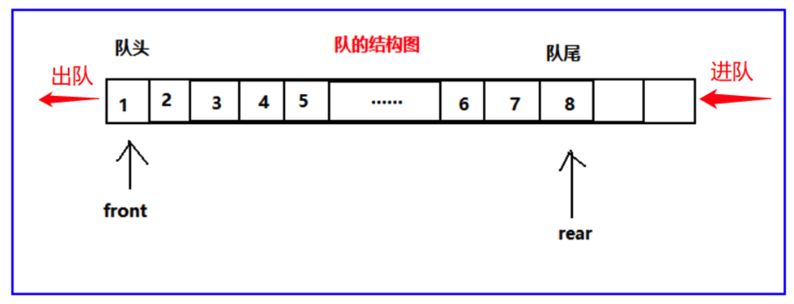

# JavaScript实现队列结构（Queue）

> 队列是是一种受限的线性表，特点为**先进先出**（**FIFO**：first in first out）。
>
> - 受限之处在于它只允许在表的**前端**（front）进行删除操作；
> - 在表的**后端**（rear）进行插入操作；





> **队列的应用：**
>
> - 打印队列：计算机打印多个文件的时候，需要排队打印；
> - 线程队列：当开启多线程时，当新开启的线程所需的资源不足时就先放入线程队列，等待CPU处理；
>
> **队列类的实现：**
>
> 队列的实现和栈一样，有两种方案：
>
> - 基于数组实现；
> - 基于链表实现；

**队列的常见操作：**

- enqueue（element）：向队列尾部添加一个（或多个）新的项；
- dequeue（）：移除队列的第一（即排在队列最前面的）项，并返回被移除的元素；
- front（）：返回队列中的第一个元素——最先被添加，也将是最先被移除的元素。队列不做任何变动（不移除元素，只返回元素信息与Stack类的peek方法非常类似）；
- isEmpty（）：如果队列中不包含任何元素，返回true，否则返回false；
- size（）：返回队列包含的元素个数，与数组的length属性类似；
- toString（）：将队列中的内容，转成字符串形式；

```js
class Queue {
  items = []
  // 向队列尾部添加一个（或多个）新的项
  enqueue(item) {
    this.items.push(item)
    return this.items
  }

  // 移除队列的第一（即排在队列最前面的）项，并返回被移除的元素；
  dequeue() {
  	return this.items.shift()
  }

	// 返回队列中的第一个元素——最先被添加，也将是最先被移除的元素。队列不做任何变动（不移除元素，只返回元素信息与Stack类的peek方法非常类似）；
	front() {
	  return this.items[0]
	}
	// 如果队列中不包含任何元素，返回true，否则返回false；
	isEmpty() {
	  return this.items.length === 0
	}
	
	// 返回队列包含的元素个数，与数组的length属性类似；
	size() {
  	return this.items.length
	}
	// 将队列中的内容，转成字符串形式；
	toString() {
    return this.items.join(' ')
  }
}

let q = new Queue()
console.log(q.enqueue('abc'), 'enqueue')
console.log(q.enqueue('cba'), 'enqueue')
console.log(q.enqueue('nba'), 'enqueue')
console.log(q.dequeue(), 'dequeue')
console.log(q.front(), 'front')
console.log(q.isEmpty(), 'isEmpty')
console.log(q.size(), 'size')
console.log(q.toString(), 'toString')
```


## 队列应用

使用队列实现小游戏：击鼓传花，传入一组数据和设定的数字num，循环遍历数组内元素，遍历到的元素为指定数字num时将该元素删除，直至数组剩下一个元素。

```js
function deliverGame(arr, num) {
  let queue = new Queue()
  // 将所有数据加进队列中
  arr.forEach(item => {
    queue.enqueue(item)
  })
  let index = 1
  // 队列只能剩下一个元素
  while (queue.size() > 1) {
    if (index < num) {
      // 将第一项移动到最后面
      queue.enqueue(queue.dequeue())
      index += 1
    } else if (index === num) {
      queue.dequeue()
      index = 1
    }
  }
  return queue.toString()
}
console.log(deliverGame(['后裔', '李白', '韩信', '猴子'], 2))
```

## 场景

### 历史搜索

搜索一个进去队列，一直往前推进队列，当超出了队列的长度就要出队，LRU「Least Recently Used」的思想。

### 消费队列

当有任务进来但是并不能及时处理，可以使用队列进行收集，最先进来的先消费。


学习笔记参考 https://www.bilibili.com/video/BV1r7411n7Pw
