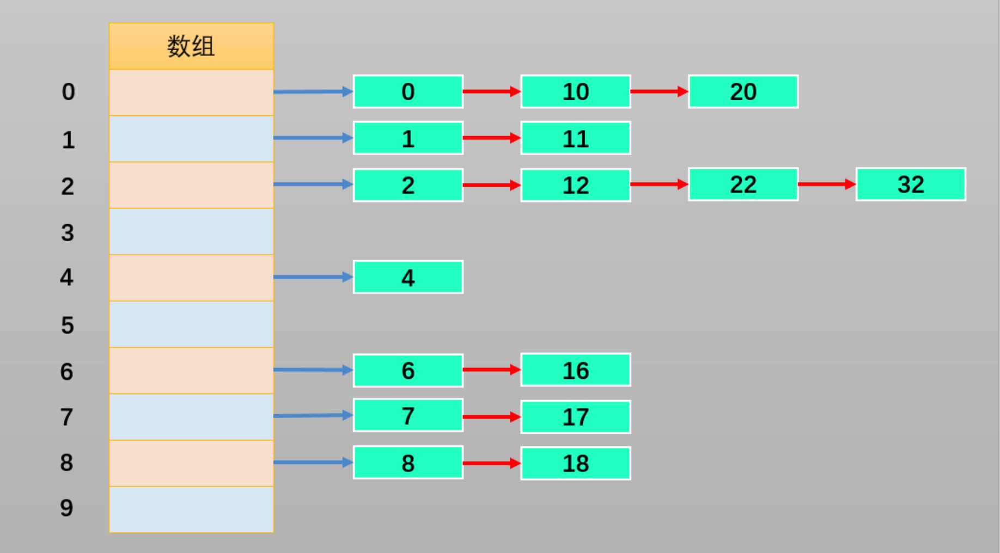
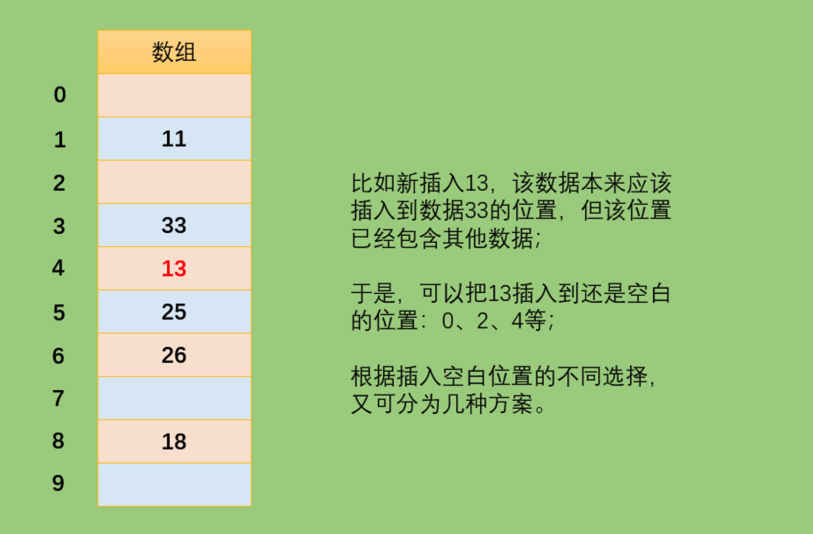

# JavaScript 实现哈希表

#### 1.1.认识哈希表

哈希表通常是基于**数组**实现的，但是相对于数组，它存在更多优势：

- 哈希表可以提供非常快速的**插入-删除-查找操作**；
- 无论多少数据，插入和删除值都只需要非常短的时间，即 O(1)的时间级。实际上，只需要**几个机器指令**即可完成；
- 哈希表的速度比**树还要快**，基本可以瞬间查找到想要的元素。但是相对于树来说编码要简单得多。

**哈希表同样存在不足之处**：

- 哈希表中的数据是**没有顺序**的，所以不能以一种固定的方式（比如从小到大 ）来遍历其中的元素。
- 通常情况下，哈希表中的 key 是**不允许重复**的，不能放置相同的 key，用于保存不同的元素。

**哈希表是什么？**

- 哈希表并不好理解，不像数组、链表和树等可通过图形的形式表示其结构和原理。
- 哈希表的结构就是**数组**，但它神奇之处在于对**下标值的一种变换**，这种变换我们可以称之为**哈希函数**，通过哈希函数可以获取**HashCode**。

```
通过以下案例了解哈希表：

案例一：公司想要存储1000个人的信息，每一个工号对应一个员工的信息。若使用数组，增删数据时比较麻烦；使用链表，获取数据时比较麻烦。有没有一种数据结构，能把某一员工的姓名转换为它对应的工号，再根据工号查找该员工的完整信息呢？没错此时就可以使用哈希表的哈希函数来实现。

案例二：存储联系人和对应的电话号码：当要查找张三（比如）的号码时，若使用数组：由于不知道存储张三数据对象的下标值，所以查找起来十分麻烦，使用链表时也同样麻烦。而使用哈希表就能通过哈希函数把张三这个名称转换为它对应的下标值，再通过下标值查找效率就非常高了。

也就是说：哈希表最后还是基于数据来实现的，只不过哈希表能够通过哈希函数把字符串转化为对应的下标值，建立字符串和下标值的对应关系。
```

#### 1.2.哈希化的方式

为了把字符串转化为对应的下标值，需要有一套编码系统，为了方便理解我们创建这样一套编码系统：比如**a 为 1，b 为 2，c 为 3，以此类推 z 为 26，空格为 27（不考虑大写情况）**。

有了编码系统后，将字母转化为数字也有很多种方式：

- **方式一**：数字相加。例如**cats 转化为数字**：3+1+20+19=43，那么就把 43 作为 cats 单词的下标值储存在数组中；

  但是这种方式会存在这样的问题：很多的单词按照该方式转化为数字后都是 43，比如 was。而在数组中**一个下标值**只能**储存一个数据**，所以该方式不合理。

- **方式二**：幂的连乘。我们平时使用的**大于 10 的数字**，就是用**幂的连乘**来表示它的唯一性的。比如： 6543=6 *10^ 3 + 5 * 10^ 2 + 4 * 10 + 3；这样单词也可以用该种方式来表示：cats = 3 * 27^ 3 + 1 * 27^ 2 + 20 * 27 + 17 =60337;

  虽然该方式可以保证字符的唯一性，但是如果是较长的字符（如 aaaaaaaaaa）所表示的数字就非常大，此时要求很大容量的数组，然而其中却有许多下标值指向的是无效的数据（比如不存在 zxcvvv 这样的单词），造成了数组空间的浪费。

**两种方案总结：**

- 第一种方案（让数字相加求和）产生的**数组下标太少**；
- 第二种方案（与 27 的幂相乘求和）产生的**数组下标又太多**；

现在需要一种**压缩方法**，把幂的连乘方案系统中得到的**巨大整数范围**压缩到**可接受的数组范围**中。可以通过取余操作来实现。虽然取余操作得到的结构也有可能重复，但是可以通过其他方式解决。

**哈希表的一些概念：**

- **哈希化：**将**大数字**转化成**数组范围内下标**的过程，称之为**哈希化**；
- **哈希函数：**我们通常会将**单词**转化成**大数字**，把**大数字**进行**哈希化**的代码。该代码就称为**哈希函数**；
- **哈希表：**对最终数据插入的**数组**进行整个**结构的封装**，得到的就是**哈希表**。

**仍然需要解决的问题**：

- 哈希化过后的下标依然可能**重复**，如何解决这个问题呢？这种情况称为**冲突**，冲突是**不可避免**的，我们只能**解决冲突**。

#### 1.3.解决冲突的方法

**解决冲突常见的两种方案：**

- 方案一：**链地址法**（**拉链法**）；

如下图所示，我们将每一个数字都对**10**进行取余操作，则余数的范围**0~9**作为数组的下标值。并且，数组每一个下标值对应的位置存储的不再是一个数字了，而是存储由经过取余操作后得到相同余数的数字组成的**数组**或**链表**。



这样可以根据下标值获取到整个数组或链表，之后继续在数组或链表中查找就可以了。而且，产生冲突的元素一般不会太多。

**总结：**链地址法解决冲突的办法是**每个数组单元**中存储的不再是**单个数据**，而是一条**链条**，这条链条常使用的数据结构为**数组或链表**，两种数据结构查找的效率相当（因为链条的元素一般不会太多）。

- 方案二：**开放地址法**；

开放地址法的主要工作方式是**寻找空白的单元格**来放置**冲突**的数据项。



根据探测空白单元格位置方式的不同，可分为三种方法：

- **线性探测**
- **二次探测**
- **再哈希法**

#### 1.4.寻找空白单元格的方式

##### 线性探测

**当插入 13 时**：

- 经过哈希化（对 10 取余）之后得到的下标值 index=3，但是该位置已经放置了数据 33。而线性探测就是从**index 位置+1**开始向后一个一个来查找**合适的位置**来放置 13，所谓合适的位置指的是**空的位置**，如上图中 index=4 的位置就是合适的位置。

**当查询 13 时**：

- 首先 13 经过哈希化得到 index=3，如果 index=3 的位置存放的数据与需要查询的数据 13 相同，就直接返回；
- 不相同时，则线性查找，从**index+1**位置开始一个一个位置地查找数据 13；
- 查询过程中不会遍历整个哈希表，只要查询到**空位置，就停止**，因为插入 13 时不会跳过空位置去插入其他位置。

**当删除 13 时**：

- 删除操作和上述两种情况类似，但需要注意的是，删除一个数据项时，**不能**将该位置下标的内容**设置为 null**，否则会**影响到之后其他的查询操作**，因为一遇到为 null 的位置就会停止查找。
- 通常**删除一个位置的数据项**时，我们可以**将它进行特殊处理**（比如设置为-1），这样在查找时遇到-1 就知道要**继续查找**。

**线性探测存在的问题**：

- 线性探测存在一个比较严重的问题，就是**聚集**；
- 如哈希表中还没插入任何元素时，插入 23、24、25、26、27，这就意味着下标值为 3、4、5、6、7 的位置都放置了数据，这种**一连串填充单元**就称为**聚集**；
- 聚集会影响哈希表的**性能**，无论是插入/查询/删除都会影响；
- 比如插入 13 时就会发现，连续的单元 3~7 都不允许插入数据，并且在插入的过程中需要经历多次这种情况。二次探测法可以解决该问题。

[](https://gitee.com/ahuntsun/BlogImgs/raw/master/数据结构与算法/哈希表/3.png)

##### 二次探测

上文所说的**线性探测存在的问题**：

- 如果之前的数据是**连续插入**的，那么新插入的一个数据可能需要**探测很长的距离**；

  二次探测是在线性探测的基础上进行了**优化**：

- **线性探测**：我们可以看成是**步长为 1**的探测，比如从下表值 x 开始，那么线性探测就是按照下标值：x+1、x+2、x+3 等依次探测；

- **二次探测**：对步长进行了优化，比如从下标值 x 开始探测：x+12、x+22、x+33 。这样**一次性探测比较长的距离**，避免了数据聚集带来的影响。

**二次探测存在的问题**：

- 当插入数据分布性较大的一组数据时，比如：13-163-63-3-213，这种情况会造成**步长不一的一种聚集**（虽然这种情况出现的概率较线性探测的聚集要小），同样会影响性能。

##### 再哈希化

在开放地址法中寻找空白单元格的最好的解决方式为**再哈希化**：

- 二次探测的步长是固定的：1，4，9，16 依次类推；
- 现在需要一种方法：产生一种**依赖关键字(数据)的探测序列**，而不是每个关键字探测步长都一样；
- 这样，**不同的关键字**即使映射到**相同的数组下标**，也可以使用**不同的探测序列**；
- 再哈希法的做法为：把关键字用**另一个**哈希函数，**再做一次哈希化**，用这次哈希化的**结果作为该关键字的步长**；

**第二次哈希化需要满足以下两点**：

- 和**第一个哈希函数不同**，不然哈希化后的结果仍是原来位置；
- **不能输出为 0**，否则每次探测都是原地踏步的死循环；

**优秀的哈希函数**：

- **stepSize = constant - （key % constant）**；
- 其中 constant 是**质数**，且小于数组的容量；
- 例如：stepSize = 5 - （key % 5），满足需求，并且结果不可能为 0；

**哈希化的效率**

哈希表中执行插入和搜索操作效率是非常高的。

- 如果没有**发生冲突**，那么效率就会更高；
- 如果**发生冲突**，存取时间就依赖后来的探测长度；
- 平均探测长度以及平均存取时间，取决于**填装因子**，随着填装因子变大，探测长度会越来越长。

理解概念**装填因子**：

- 装填因子表示当前哈希表中已经**包含的数据项**和**整个哈希表长度**的**比值**；
- **装填因子 = 总数据项 / 哈希表长度**；
- **开放地址法的装填因子**最大为**1**，因为只有空白的单元才能放入元素；
- **链地址法的装填因子**可以**大于 1**，因为只要愿意，拉链法可以无限延伸下去；

#### 1.5.不同探测方式性能的比较

- **线性探测：**

可以看到，随着装填因子的增大，平均探测长度呈指数形式增长，性能较差。实际情况中，最好的装填因子取决于存储效率和速度之间的平衡，随着装填因子变小，存储效率下降，而速度上升。

[](https://gitee.com/ahuntsun/BlogImgs/raw/master/数据结构与算法/哈希表/4.png)


- **二次探测和再哈希化的性能**：

二次探测和再哈希法性能相当，它们的性能比线性探测略好。由下图可知，随着装填因子的变大，平均探测长度呈指数形式增长，需要探测的次数也呈指数形式增长，性能不高。

[](https://gitee.com/ahuntsun/BlogImgs/raw/master/数据结构与算法/哈希表/5.png)


- **链地址法的性能：**

可以看到随着装填因子的增加，平均探测长度呈线性增长，较为平缓。在开发中使用链地址法较多，比如 Java 中的 HashMap 中使用的就是**链地址法**。

[](https://gitee.com/ahuntsun/BlogImgs/raw/master/数据结构与算法/哈希表/6.png)


#### 1.6.优秀的哈希函数

哈希表的优势在于它的速度，所以哈希函数不能采用消耗性能较高的复杂算法。提高速度的一个方法是在哈希函数中**尽量减少乘法和除法**。

性能高的哈希函数应具备以下两个优点：

- **快速的计算**；
- **均匀的分布**；

##### 快速计算

**霍纳法则**：在中国霍纳法则也叫做**秦久韶算法**，具体算法为：

[](https://gitee.com/ahuntsun/BlogImgs/raw/master/数据结构与算法/哈希表/7.png)

求多项式的值时，首先计算最内层括号内一次多项式的值，然后由内向外逐层计算一次多项式的值。这种算法把求 n 次多项式 f(x)的值就转化为求 n 个一次多项式的值。

**变换之前**：

- 乘法次数：n（n+1）/2 次；
- 加法次数：n 次；

**变换之后：**

- 乘法次数：n 次；
- 加法次数：n 次；

如果使用大 O 表示时间复杂度的话，直接从变换前的**O(N^ 2)**降到了**O(N)**。

##### 均匀分布

为了保证数据在哈希表中**均匀分布**，当我们需要**使用常量的地方**，尽量使用**质数**；比如：哈希表的长度、N 次幂的底数等。

Java 中的 HashMap 采用的是链地址法，哈希化采用的是公式为：**index = HashCode（key）&（Length-1）**

即将数据化为二进制进行**与**运算，而不是取余运算。这样计算机直接运算二进制数据，效率更高。但是 JavaScript 在进行叫大数据的**与**运算时会出现问题，所以以下使用 JavaScript 实现哈希化时还是采用取余运算。

### 二、初步封装哈希表

**哈希表的常见操作为：**

- put（key，value）：插入或修改操作；

- get（key）：获取哈希表中特定位置的元素；

- remove（key）：删除哈希表中特定位置的元素；

- isEmpty（）：如果哈希表中不包含任何元素，返回 true，如果哈希表长度大于 0 则返回 false；

- size（）：返回哈希表包含的元素个数；

- resize（value）：对哈希表进行扩容操作；

#### 2.1 创建哈希表

封装哈希表的数组结构模型：

[](https://gitee.com/ahuntsun/BlogImgs/raw/master/数据结构与算法/哈希表/9.png)

#### 2.2.哈希表的扩容与压缩

为什么需要扩容？

- 前面我们在哈希表中使用的是**长度为 7 的数组**，由于使用的是**链地址法，装填因子(loadFactor)**可以大于 1，所以这个哈希表可以无限制地插入新数据。
- 但是，随着**数据量的增多**，storage 中每一个 index 对应的 bucket 数组（链表）就会越来越长，这就会造成哈希表**效率的降低**

什么情况下需要扩容？

- 常见的情况是**loadFactor > 0.75**的时候进行扩容；

如何进行扩容？

- 简单的扩容可以直接扩大**两倍**（关于质数，之后讨论）；
- 扩容之后**所有的**数据项都要进行**同步修改**；

**实现思路:**

- 首先，定义一个变量，比如 oldStorage 指向原来的 storage；
- 然后，创建一个新的容量更大的数组，让 this.storage 指向它；
- 最后，将 oldStorage 中的每一个 bucket 中的每一个数据取出来依次添加到 this.storage 指向的新数组中；

[](https://gitee.com/ahuntsun/BlogImgs/raw/master/数据结构与算法/哈希表/15.png)

下述定义的哈希表的 resize 方法，既可以实现哈希表的**扩容**，也可以实现哈希表容量的**压缩**。

> **装填因子** = 哈希表中数据 / 哈希表长度，即 loadFactor = count / HashTable.length。

- 通常情况下当**装填因子 laodFactor > 0.75**时，对哈希表进行扩容。在哈希表中的添加方法（push 方法）
- 当**装填因子 laodFactor < 0.25**时，对哈希表容量进行压缩。在哈希表中的删除方法（remove 方法）

```js
class HashTable {
  count = 0;
  storage = [];
  limit = 7;
  //设计哈希函数
  //1.将字符串转成比较大的数字：hashCede
  //2.将大的数字hasCode压缩到数组范围(大小)之内
  hashFunc(str, size) {
    //1.定义hashCode变量
    let hashCode = 0;

    //2.霍纳法则，计算hashCode的值
    //cats -> Unicode编码
    for (let i = 0; i < str.length; i++) {
      // str.charCodeAt(i)//获取某个字符对应的unicode编码
      hashCode = 37 * hashCode + str.charCodeAt(i);
    }

    //3.取余操作
    let index = hashCode % size;
    return index;
  }

  // 插入或修改操作；
  put(key, value) {
    // 得到经过哈希化的key值对应下标，
    let index = this.hashFunc(key, this.limit);

    //
    let bucket = this.storage[index];

    // 判断桶是否存在，如果不存在则进行初始化
    if (bucket == null) {
      bucket = [];
      this.storage[index] = bucket;
    }

    // 循环这个bucket把已经存在的元素放进去，如果存在进行修改操作
    for (let i = 0; i < bucket.length; i++) {
      const item = bucket[i];
      if (item.key === key) {
        item[0] = key;
        item[1] = value;
        return;
      }
    }

    // 不存在则进行添加操作
    bucket.push([key, value]);
    this.count += 1;

    //判断是否需要扩容操作
    if (this.count > this.limit * 0.75) {
      let newSize = this.limit * 2;
      let newPrime = this.getPrime(newSize);
      this.resize(newPrime);
    }
  }

  // 获取哈希表中特定位置的元素；
  get(key) {
    let index = this.hashFunc(key, this.limit);
    let bucket = this.storage[index];
    if (bucket == null) throw new Error(`${key}出错了！`);
    for (let i = 0; i < bucket.length; i++) {
      const item = bucket[i];
      if (item[0] === key) {
        return item[1];
      }
    }
    return null;
  }

  // 删除哈希表中特定位置的元素；
  remove(key) {
    let index = this.hashFunc(key, this.limit);
    let bucket = this.storage[index];
    if (bucket == null) throw new Error(`${key}出错了！`);
    for (let i = 0; i < bucket.length; i++) {
      const item = bucket[i];
      if (item[0] === key) {
        bucket.splice(i, 1);
        this.count -= 1;
        //缩小容量
        if (this.limit > 7 && this.count < this.limit * 0.25) {
          let newSize = Math.floor(this.limit / 2);
          let newPrime = this.getPrime(newSize);
          this.resize(newPrime);
        }
        return item[1];
      }
    }

    return null;
  }

  // 如果哈希表中不包含任何元素，返回trun，如果哈希表长度大于0则返回false；
  isEmpty() {
    return this.count === 0;
  }

  // 返回哈希表包含的元素个数；
  size() {
    return this.count;
  }

  // 对哈希表进行扩容操作；
  resize(newLimit) {
    // 初始化数据和重置设置哈希表大小
    let oldStorage = this.storage;
    this.storage = [];
    this.count = 0;
    this.limit = newLimit;

    // 为了解决hashCode还是原来的问题，需要将旧的数据重新放进一个新的storage里面
    for (let i = 0; i < oldStorage.length; i++) {
      let item = oldStorage[i];
      if (item == null) continue;
      for (let j = 0; j < item.length; j++) {
        let item2 = item[j];
        this.put(item2[0], item2[1]);
      }
    }
    return true;
  }

  // 判断是否是质数
  isPrime(num) {
    if (num <= 1) {
      return false;
    }
    //1.获取num的平方根:Math.sqrt(num)
    //2.循环判断
    for (var i = 2; i <= Math.sqrt(num); i++) {
      if (num % i == 0) {
        return false;
      }
    }
    return true;
  }

  // 获取质数
  getPrime(num) {
    //7*2=14,+1=15,+1=16,+1=17(质数)
    while (!this.isPrime(num)) {
      num++;
    }
    return num;
  }
}

let h = new HashTable();
h.put("abc", 111);
h.put("cba", 222);
h.put("nba", 333);
h.put("qwe", "qwe");
h.put("ert", "ert");
h.put("asd", "asd");
h.put("nzxcba", 333);
h.put("vb", 333);
// console.log(h.get('nba'), 'get')
console.log(h.remove("vb"), "remove");
console.log(h.remove("nzxcba"), "remove");
console.log(h.remove("nba"), "remove");
console.log(h.remove("asd"), "remove");
console.log(h.remove("abc"), "remove");
console.log(h.remove("cba"), "remove");
console.log(h.isEmpty(), "isEmpty");
console.log(h.size(), "size");
console.log(h, "h");
```


## 练习题目

### [1. 两数之和](https://leetcode-cn.com/problems/two-sum/)

#### 题目描述

给定一个整数数组 `nums` 和一个整数目标值 `target`，请你在该数组中找出 **和为目标值** *`target`* 的那 **两个** 整数，并返回它们的数组下标。

你可以假设每种输入只会对应一个答案。但是，数组中同一个元素在答案里不能重复出现。

你可以按任意顺序返回答案。

 

**示例 1：**

```
输入：nums = [2,7,11,15], target = 9
输出：[0,1]
解释：因为 nums[0] + nums[1] == 9 ，返回 [0, 1] 。
```

**示例 2：**

```
输入：nums = [3,2,4], target = 6
输出：[1,2]
```

**示例 3：**

```
输入：nums = [3,3], target = 6
输出：[0,1]
```

 

**提示：**

- `2 <= nums.length <= 104`
- `-109 <= nums[i] <= 109`
- `-109 <= target <= 109`
- **只会存在一个有效答案**

**进阶：**你可以想出一个时间复杂度小于 `O(n2)` 的算法吗？

#### 题解

##### 题解1:

暴力解

```js
/**
 * @param {number[]} nums
 * @param {number} target
 * @return {number[]}
 */
var twoSum = function (nums, target) {
    for (let i = 0; i < nums.length; i++) {
        let item = nums[i]
        for (let j = 0; j < nums.length; j++) {
            let item2 = nums[j]
            if((item + item2) === target && i !== j) return [i,j]
        }
    }
    return []
};

时间复杂度为 O(N^2) N为nums的长度
空间复杂度为 O(N) N为nums的长度
```

#### 题解2

使用hash table处理，可以快速查找一个元素的具体位置。这样就可以降低时间复杂度

```js
var twoSum = function (nums, target) {
    let hashMap = new Map()
    for (let i = 0; i < nums.length; i++) {
        let item = nums[i]
        if( hashMap.has(target - item)) {
             return [hashMap.get(target - item),i]
        }
        hashMap.set(nums[i],i)
    }
    return []
};

时间复杂度为 O(N) N为nums的长度
空间复杂度为 O(N) N为nums的长度
```


### [218.天际线](https://leetcode-cn.com/problems/the-skyline-problem/) 

（使用哈希统计可能会 OOM，但是思路上可行）

### [面试题 01.04. 回文排列](https://leetcode-cn.com/problems/palindrome-permutation-lcci/)

```js
给定一个字符串，编写一个函数判定其是否为某个回文串的排列之一。
回文串是指正反两个方向都一样的单词或短语。排列是指字母的重新排列。
回文串不一定是字典当中的单词。

输入："tactcoa"
输出：true（排列有"tacocat"、"atcocta"，等等）

/**
 * @param {string} s
 * @return {boolean}
 */

思路使用hash table的特性，将数据存进去，然后碰见相同的就删除，最后长度大于1的就是证明这个数据不是回文。之所以是可以使用随机删除，随机增加，是因为排列的原因，可能有很多种情况。
var canPermutePalindrome = function(s) {
    let set = new Set()
    for(let i  of s){
        if(set.has(i)) set.delete(i) 
        else set.add(i)
    }
    return set.size <= 1
};
```


- [36. 有效的数独](https://leetcode-cn.com/problems/valid-sudoku/description/)
- [37. 解数独](https://leetcode-cn.com/problems/sudoku-solver/description/) 与 36 类似，还需要点回溯的思想


学习笔记参考 https://www.bilibili.com/video/BV1r7411n7Pw
