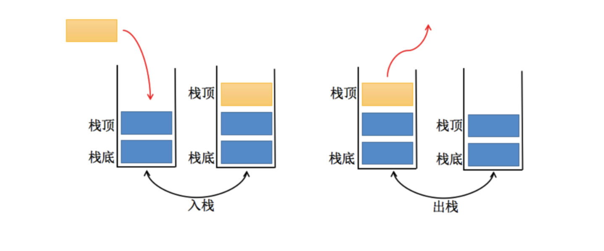

# JavaScript实现栈结构（Stack）


> **常见的数据结构：**
>
> - **数组**（Aarray）
>
> - **栈**（Stack）
>
> - **链表**（Linked List）
>
> - **图**（Graph）
>
> - **散列表**（Hash）
>
> - **队列**（Queue）
>
> - **树**（Tree）
>
> - **堆**（Heap）
>
>   **注意**：数据结构与算法与语言无关，常见的编程语言都有**直接或间接**的使用上述常见的数据结构。
>
>   #### 什么是算法？
>
>   算法（Algorithm）的定义
>
>   - 一个有限指令集，每条指令的描述不依赖于语言；
>   - 接收一些输入（有些情况下不需要输入）；
>   - 产生输入；
>   - 一定在有限步骤之后终止；
>
>   算法通俗理解：解决问题的办法/步骤逻辑。数据结构的实现，离不开算法。


# 栈结构（Stack）

> 数组是一个线性结构，并且可以在数组的**任意位置**插入和删除元素。而**栈和队列**就是比较常见的**受限的线性结构**。栈的特点为**先进后出，后进先出**（LIFO：last in first out）。
>
> **程序中的栈结构：**
>
> - **函数调用栈**：A（B（C（D（））））：即A函数中调用B，B调用C，C调用D；在A执行的过程中会将A压入栈，随后B执行时B也被压入栈，函数C和D执行时也会被压入栈。所以当前栈的顺序为：A->B->C->D（栈顶）；函数D执行完之后，会弹出栈被释放，弹出栈的顺序为D->C->B->A;
> - **递归**：为什么没有停止条件的递归会造成栈溢出？比如函数A为递归函数，不断地调用自己（因为函数还没有执行完，不会把函数弹出栈），不停地把相同的函数A压入栈，最后造成**栈溢出**（Stack Overfloat）




**栈常见的操作：**

- push（element）：添加一个新元素到栈顶位置；
- pop（）：移除栈顶的元素，同时返回被移除的元素；
- peek（）：返回栈顶的元素，不对栈做任何修改（该方法不会移除栈顶的元素，仅仅返回它）；
- isEmpty（）：如果栈里没有任何元素就返回true，否则返回false；
- size（）：返回栈里的元素个数。这个方法和数组的length属性类似；
- toString（）：将栈结构的内容以字符串的形式返回。

```js
class Stack {
  items = []

 // 添加一个新元素到栈顶位置；
  push(item) {
   return this.items.push(item)
  }
 // 移除栈顶的元素，同时返回被移除的元素；
  pop() {
    return this.items.pop()
  }
	// 返回栈顶的元素，不对栈做任何修改（该方法不会移除栈顶的元素，仅仅返回它）
  peek() {
    return this.items[this.items.length - 1]
  }
	// 如果栈里没有任何元素就返回true，否则返回false；
  isEmpty() {
    return this.items.length === 0
  }
	// 返回栈里的元素个数。这个方法和数组的length属性类似；
  size() {
    return this.items.length
  }
	// 将栈结构的内容以字符串的形式返回。
	toString() {
	        console.log(this.items, 'items')
	        return this.items.join(' ')
	      }
	 }

 let s = new Stack()
console.log(s.push('abc')) // ["abc"]
console.log(s.push('cbc')) // ["abc", "cbc"]
console.log(s.push('nba')) // ["abc", "cbc", "nba"]
console.log(s.pop(), 'pop') //  nba pop
console.log(s.toString(), 'toString') // abc cbc toString
console.log(s.peek(), 'peek') // cbc peek
console.log(s.isEmpty(), 'isEmpty') // false "isEmpty"
console.log(s.size(), 'size') // 2 "size"
```

学习笔记参考 https://www.bilibili.com/video/BV1r7411n7Pw
