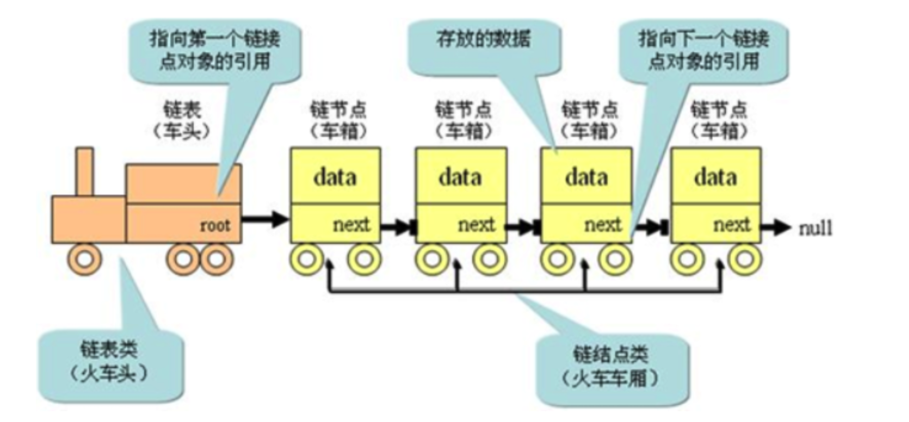

# JavaScript实现单向链表

> 链表和数组一样，可以用于**存储一系列的元素**，但是链表和数组的**实现机制完全不同**。链表的每个元素由一个存储**元素本身的节点**和一个**指向下一个元素的引用**（有的语言称为指针或连接）组成。类似于火车头，一节车厢载着乘客（数据），通过节点连接另一节车厢。
>
> 
>
> - head属性指向链表的第一个节点；
> - 链表中的最后一个节点指向null；
> - 当链表中一个节点也没有的时候，head直接指向null；





**数组存在的缺点：**

- 数组的创建通常需要申请一段**连续的内存空间**（一整块内存），并且大小是固定的。所以当原数组**不能满足容量需求**时，需要**扩容**（一般情况下是申请一个更大的数组，比如2倍，然后将原数组中的元素复制过去）。
- 在数组的开头或中间位置插入数据的成本很高，需要进行大量元素的位移。

**链表的优势：**

- 链表中的元素在内存中**不必是连续的空间**，可以充分利用计算机的内存，实现灵活的**内存动态管理**。
- 链表不必在创建时就**确定大小**，并且大小可以**无限地延伸**下去。
- 链表在**插入和删除**数据时，**时间复杂度**可以达到O(1)，相对数组效率高很多。

**链表的缺点：**

- 链表访问任何一个位置的元素时，都需要**从头开始访问**（无法跳过第一个元素访问任何一个元素）。
- 无法通过下标值直接访问元素，需要从头开始一个个访问，直到找到对应的元素。
- 虽然可以轻松地到达**下一个节点**，但是回到**前一个节点**是很难的。

**链表中的常见操作：**

- append（element）：向链表尾部添加一个新的项；
- insert（position，element）：向链表的特定位置插入一个新的项；
- get（position）：获取对应位置的元素；
- indexOf（element）：返回元素在链表中的索引。如果链表中没有该元素就返回-1；
- update（position，element）：修改某个位置的元素；
- removeAt（position）：从链表的特定位置移除一项；
- remove（element）：从链表中移除一项；
- isEmpty（）：如果链表中不包含任何元素，返回trun，如果链表长度大于0则返回false；
- size（）：返回链表包含的元素个数，与数组的length属性类似；
- toString（）：由于链表项使用了Node类，就需要重写继承自JavaScript对象默认的toString方法，让其只输出元素的值；

```js
class LinkList {
    head = null
    length = 0

    // 向链表尾部添加一个新的项；
    append(data) {
      let node = new Node(data)
      // 情况1：只有一个节点时候
      if (this.length === 0) {
        this.head = node
      } else {
        // 情况2:2个节点及以上的时候
        let current = this.head
        while (current.next) {
          current = current.next
        }
        current.next = node
      }
      this.length += 1
    }

    // 向链表的特定位置插入一个新的项
    insert(position, element) {
      // 边界判断 position小于length 并且 position不能是负数
      if (position > this.length || position < 0) throw new Error('position有误')
      let node = new Node(element)
      // 当positon为0的时候
      if (position === 0) {
        node.next = this.head
        this.head = node
      } else {
        let current = this.head
        let index = 0
        let previous = null
        while (position > index++) {
          previous = current // 这里就可以记录到previous，之前想尽办法得到他。。。。
          current = current.next
        }
        previous.next = node
        node.next = current
      }
      this.length += 1
      return true
    }

    // 获取对应位置的元素
    get(position) {
      if (position >= this.length || position < 0) throw new Error('position有误')
      let current = this.head
      let index = 0
      while (position > index++) {
        current = current.next
      }
      return current.data
    }

    // 返回元素在链表中的索引。如果链表中没有该元素就返回-1；
    indexOf(element) {
      let current = this.head
      let index = 0
      while (this.length - 1 > index) {
        if (current.data === element) break
           current = current.next
           index += 1
         }
      if (current.data === element) return index
      if (current.data !== element) return -1
   		}

     // 修改某个位置的元素；
     update(position, element) {
       if (position >= this.length || position < 0) throw new Error('position有误')
       let current = this.head
       while (position-- > 0) {
         current = current.next
       }
       current.data = element
       return true
     }
     	// 从链表的特定位置移除一项；
    	removeAt(position) {
    	  // 边界判断 position小于length 并且 position不能是负数
    	  if (position > this.length || position < 0) throw new Error('position有误')
    	  let current = this.head
    	  if (position === 0) {
    	    this.head = current.next
    	  } else {
    	    let index = 0
    	    let previous = null
    	    while (position > index++) {
    	      previous = current
    	      current = current.next
    	    }
    	    previous.next = current
    	  }
    	  this.length -= 1
    	  return true
    	}

    // 从链表中移除一项；
    remove(element) {
      let current = this.head
      if (current.data === element) {
        this.head = current.next
        return true
      } else {
        let previous = null
        while (this.length-- > 0) {
          previous = current
          current = current.next
          if (current.data === element) {
            previous.next = current.next
            return true
          }
        }
      }
      return false
    }

    // 如果链表中不包含任何元素，返回trun，如果链表长度大于0则返回false；
    isEmpty() {
      return this.length === 0
    }

    // 返回链表包含的元素个数，与数组的length属性类似；
    size() {
      return this.length
    }

    // 由于链表项使用了Node类，就需要重写继承自JavaScript对象默认的toString方法，让其只输出元素的值；
    toString() {
      let str = ''
      let current = this.head
      for (let i = 0; i < this.length; i++) {
        str += current.data + ' '
        current = current.next
      }
      return str
    }
   }

class Node {
  constructor(data, next = null) {
    this.data = data
    next = next
  }
}

let linklist = new LinkList()
linklist.append('abc')
linklist.append('cba')
linklist.append('nba')
console.log(linklist.toString(), 'toString') // abc cba nba
console.log(linklist.insert(0, 'aaa'), 'insert') // true
console.log(linklist.insert(3, 'ddd'), 'insert') // true
console.log(linklist.toString(), 'toString') // aaa abc cba ddd nba
console.log(linklist.get(2), 'get') // cba
console.log(linklist.indexOf('abc'), 'indexOf') //  1
console.log(linklist.update(0, 'ddd'), 'update') // true
console.log(linklist.toString(), 'toString') // ddd abc cba ddd nba
console.log(linklist.removeAt(0), 'removeAt') // true
console.log(linklist.remove('cba'), 'remove') // true
console.log(linklist.toString(), 'toString') // abc ddd nba
console.log(linklist.size(), 'size') // 3
console.log(linklist.isEmpty(), 'isEmpty') // false
console.log(linklist)
```

学习笔记参考 https://www.bilibili.com/video/BV1r7411n7Pw
