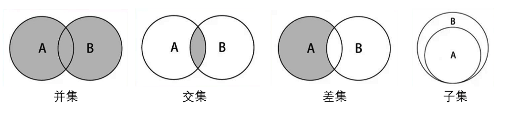

# JavaScript实现集合与字典


# 集合


> 集合比较常见的实现方式是**哈希表**，这里使用JavaScript的Object类进行封装。
>
> 集合通常是由一组**无序的**、**不能重复**的元素构成。
>
> - 数学中常指的集合中的元素是可以重复的，但是计算机中集合的元素不能重复。
>
> **集合是特殊的数组：**
>
> - 特殊之处在于里面的元素**没有顺序**，**也不能重复**。
> - 没有顺序意味着**不能通过下标值进行访问**，不能重复意味着**相同的对象**在集合中只会**存在一份**。
>
> **实现集合类**：
>
> - 在ES6中的**Set**类就是一个集合类，这里我们重新封装一个Set类，了解集合的底层实现。
> - JavaScript中的**Object**类中的**key**就是一个集合，可以使用它来封装集合类Set。


**集合常见的操作**：

- `add（value）`：向集合添加一个新的项；
- `remove（value）`：从集合中移除一个值；
- `has（value）`：如果值在集合中，返回`true`，否则返回`false`；
- `clear（）`：移除集合中的所有项；
- `size（）`：返回集合所包含元素的数量，与数组的`length`属性相似；
- `values（）`：返回一个包含集合中所有值的数组；

```js
class Set {
  items = {}

  // 如果值在集合中，返回true，否则返回false；
  has(value) {
    return this.items.hasOwnProperty(value)
  }

  // 向集合添加一个新的项；
  add(value) {
    if (this.has(value)) return false // 已经存在的项，则添加失败
    this.items[value] = value
    return true
  }

  // 从集合中移除一个值；
  remove(value) {
    if (!this.has(value)) return false
    delete this.items[value]
    return true
  }

  // 移除集合中的所有项；
  clear() {
    this.items = {}
    return true
  }

  // 返回集合所包含元素的数量，与数组的length属性相似；
  size() {
    return Object.keys(this.items).length
  }

	  // 并集
  union(antherSet) {
    let unionSet = new Set()
    antherSet.values().forEach(item => {
      unionSet.add(item)
    })
    this.values().forEach(item => {
      unionSet.add(item)
    })
    return unionSet
  }

  // 交集
  intersection(antherSet) {
    let intersectionSet = new Set()
    antherSet.values().forEach(item => {
      this.values().forEach(item2 => {
        if (item2 === item) {
          intersectionSet.add(item)
        }
      })
    })
    return intersectionSet
  }

  // 差集
  diffrence(antherSet) {
    let diffrenceSet = new Set()
    this.values().forEach(item => {
      if (!antherSet.has(item)) {
        diffrenceSet.add(item)
      }
    })
    return diffrenceSet
  }

  // 子集
  subset(antherSet) {
    let values = antherSet.values()
    for (let i = 0; i < values.length; i++) {
      let item = values[i]
      if (!this.has(item)) return false
    }
    return true
  }

  // 返回一个包含集合中所有值的数组；
  values() {
    return Object.keys(this.items)
  }
}
let s = new Set()
console.log(s.add('abc'), 'add')
console.log(s.add('cba'), 'add')
console.log(s.add('nba'), 'add')
console.log(s.remove('nba'), 'remove')
console.log(s.values(), 'values')
console.log(s.size(), 'size')
console.log(s.clear(), 'clear')
console.log(s.values(), 'values')


let s = new Set()
console.log(s.add('abc'), 'add')
console.log(s.add('cba'), 'add')
console.log(s.add('nba'), 'add')

let s2 = new Set()
s2.add('abc')
s2.add('nba')
// s2.add(333)
console.log(s.subset(s2))
```


#### 集合间的操作

**集合间操作：**

- **并集**：对于给定的两个集合，返回一个包含两个集合中所有元素的新集合；
- **交集**：对于给定的两个集合，返回一个包含两个集合中共有元素的新集合；
- **差集**：对于给定的两个集合，返回一个包含所有存在于第一个集合且不存在于第二个集合的元素的新集合；
- **子集**：验证一个给定集合是否是另一个集合的子集；





# 字典

> **字典的特点**：
>
> - 字典存储的是键值对，主要特点是一一对应；
> - 比如保存一个人的信息：数组形式：[19，‘Tom’，1.65]，可通过下标值取出信息；字典形式：{"age"：19，"name"："Tom"，"height"：165}，可以通过key取出value。
> - 此外，在字典中**key**是**不能重复**且**无序**的，而**Value**可以**重复**。


**字典和映射的关系**：

- 有些编程语言中称这种**映射关系**为**字典**，如Swift中的Dictonary，Python中的dict；
- 有些编程语言中称这种**映射关系**为**Map**，比如Java中的HashMap&TreeMap等；

**字典类常见的操作**：

- set(key,value)：向字典中添加新元素。
- remove(key)：通过使用键值来从字典中移除键值对应的数据值。
- has(key)：如果某个键值存在于这个字典中，则返回`true`，反之则返回`false`。
- get(key)：通过键值查找特定的数值并返回。
- clear()：将这个字典中的所有元素全部删除。
- size()：返回字典所包含元素的数量。与数组的`length`属性类似。
- keys()：将字典所包含的所有键名以数组形式返回。
- values()：将字典所包含的所有数值以数组形式返回。

```js
class Dictionary {
  items = {}

  // 如果某个键值存在于这个字典中，则返回`true`，反之则返回`false`。
  has(value) {
    return this.items.hasOwnProperty(value)
  }

  // 向字典中添加新元素。
  set(key, value) {
    this.items[key] = value
  }

  // 通过使用键值来从字典中移除键值对应的数据值。
  remove(value) {
    if (!this.has(value)) return false
    delete this.items[value]
    return true
  }

  // 通过键值查找特定的数值并返回。
  get(key) {
    return this.has(key) ? this.items[key] : undefined
  }

  // 将这个字典中的所有元素全部删除。
  clear() {
    this.items = {}
    return true
  }

  // 返回字典所包含元素的数量。与数组的`length`属性类似。
  size() {
    return Object.keys(this.items).length
  }

  // 将字典所包含的所有键名以数组形式返回。
  keys() {
    return Object.keys(this.items)
  }

  // 将字典所包含的所有数值以数组形式返回。
  values() {
    return Object.values(this.items)
  }
}
let dict = new Dictionary()
dict.set('a', 'abc')
dict.set('c', 'cba')
dict.set('n', 'nba')
console.log(dict.get('a'), 'get') // abc
console.log(dict.remove('a'), 'remove') // true
console.log(dict.size(), 'size') // 2
console.log(dict.keys(), 'keys') // cba nba
console.log(dict.values(), 'values') // cba nba
console.log(dict.clear(), 'clear')
```

