# 红黑树

### 一、红黑树的五条规则

红黑树除了符合二叉搜索树的基本规则外，还添加了以下特性：

- **规则1：节点是红色或黑色的；**
- **规则2：根节点是黑色的；**
- **规则3：每个叶子节点都是黑色的空节点（NIL节点）；**
- **规则4：每个红色节点的两个子节点都是黑色的（从每个叶子到根的所有路径上不可能有两个连续的红色节点）；**
- **规则5：从任一节点到其每个叶子节点的所有路径都包含相同数目的黑色节点；**

**红黑树的相对平衡**

前面5条规则的约束确保了以下红黑树的关键特性：

- 从**根到叶子节点**的**最长路径**，不会超过**最短路径**的**两倍**；
- 结果就是这棵树**基本**是平衡的；
- 虽然没有做到绝对的平衡，但是可以保证在最坏的情况下，该树依然是高效的；

为什么可以做到**最长路径不超过最短路径的两倍**呢？

- **性质4**决定了路径上不能有两个相连的红色节点；
- 所以，最长路径一定是红色节点和黑色节点交替而成的；
- 由于根节点和叶子节点都是黑色的，最短路径可能都是黑色节点，并且最长路径中一定是黑色节点多于红色节点；
- **性质5**决定了所有路径上都有相同数目的黑色节点；
- 这就表明了没有路径能多于其他任何路径两倍长。

### 二、红黑树的三种变换

插入一个新节点时，有可能树不再平衡，可以通过三种方式的变换使树保持平衡：

- **变色**；
- **左旋转**；
- **右旋转**；

#### 2.1.变色

为了重新符合红黑树的规则，需要把**红色**节点变为**黑色**，或者把**黑色**节点变为**红色**；

插入的**新节点**通常都是**红色节点**：

- 当插入的节点为**红色**的时候，大多数情况**不违反**红黑树的任何规则；
- 而**插入黑色节点，**必然会导致一条路径上多了一个**黑色节点**，这是很难调整的；
- 红色节点虽然可能导致**红红相连**的情况，但是这种情况可以通过**颜色调换和旋转**来调整；

#### 2.2.左旋转

以节点X为根**逆时针**旋转二叉搜索树，使得父节点原来的位置被自己的右子节点替代，左子节点的位置被父节点替代；

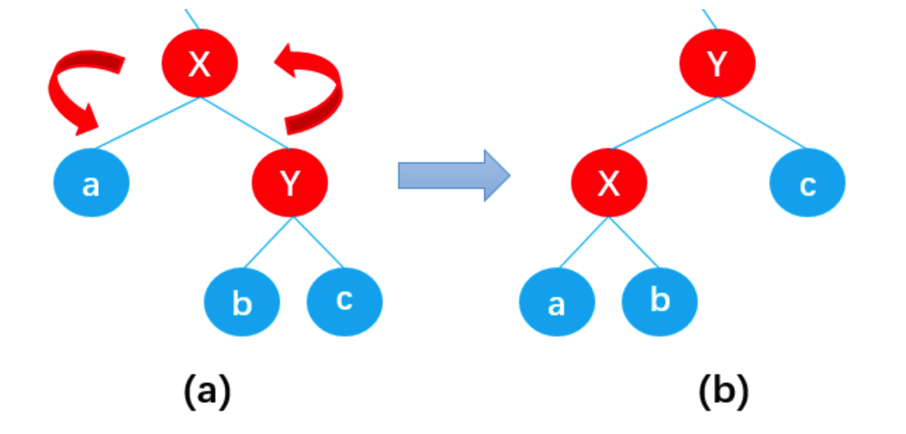

**详解：**

如上图所示，左旋转之后：

- 节点X取代了节点a原来的位置；
- 节点Y取代了节点X原来的位置；
- 节点X的**左子树** a 仍然是节点X的**左子树**（这里X的左子树只有一个节点，有多个节点时同样适用，以下同理）；
- 节点Y的**右子树** c 仍然是节点Y的**右子树**；
- 节点Y的**左子树** b 向**左平移**成为了节点X的**右子树**；

除此之外，二叉搜索树左旋转之后仍为二叉搜索树：

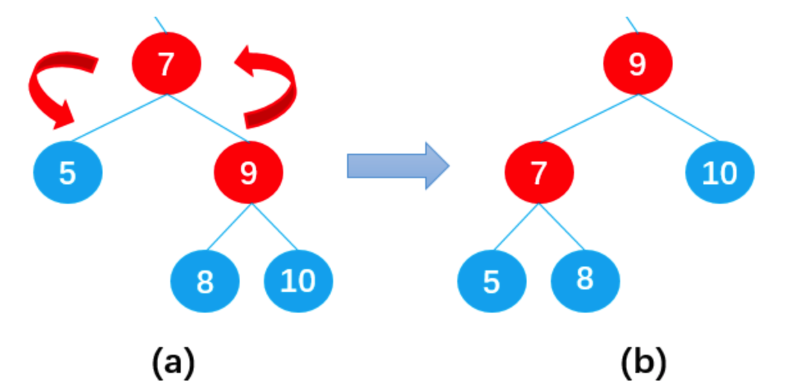

#### 2.3.右旋转

以节点X为根**顺时针**旋转二叉搜索树，使得父节点原来的位置被自己的左子节点替代，右子节点的位置被父节点替代；

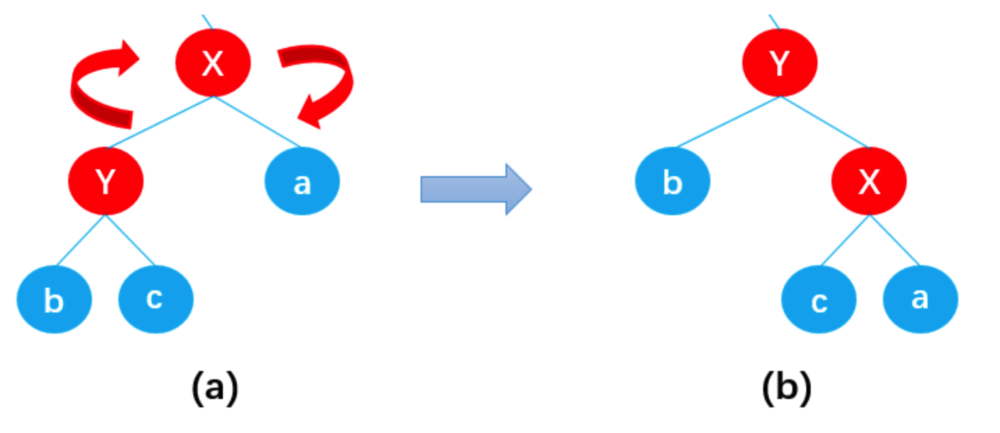

**详解：**

如上图所示，右旋转之后：

- 节点X取代了节点a原来的位置；
- 节点Y取代了节点X原来的位置；
- 节点X的**右子树** a 仍然是节点X的**右子树**（这里X的右子树虽然只有一个节点，但是多个节点时同样适用，以下同理）；
- 节点Y的**左子树** b 仍然是节点Y的**左子树**；
- 节点Y的**右子树 \**c 向\**右平移**成为了节点X的**左子树**；

除此之外，二叉搜索树右旋转之后仍为二叉搜索树：

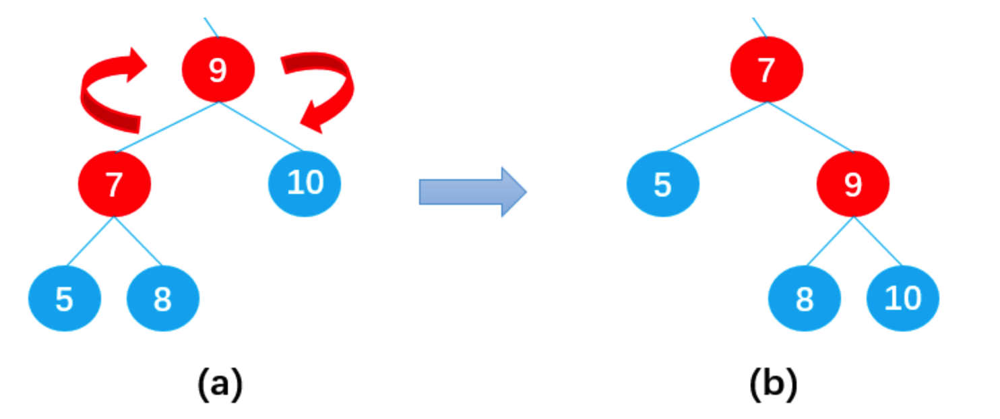

### 三、红黑树的插入操作

首先需要明确，在保证满足红黑树5条规则的情况下，新插入的节点必然是**红色节点**。

为了方便说明，规定以下四个节点：新插入节点为**N**（Node），N的父节点为**P**（Parent），P的兄弟节点为**U**（Uncle），U的父节点为**G**（Grandpa），如下图所示：

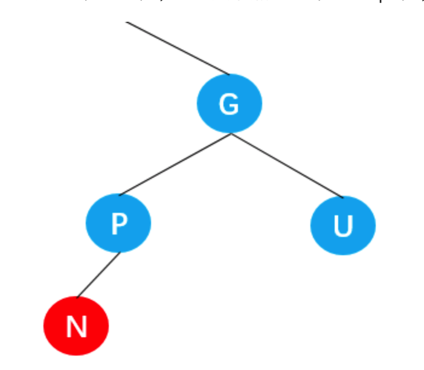

#### 3.1.情况1

当插入的新节点N位于树的根上时，没有父节点。

这种情况下，只需要将红色节点变为黑色节点即可满足规则2 。

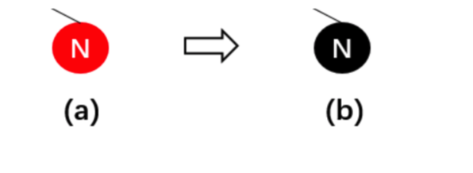

#### 3.2.情况2

新界点N的父节点P为黑色节点，此时不需要任何变化。

此时既满足规则4也满足规则5。尽管新节点是红色的，但是新节点N有两个黑色节点NIL，所以通向它的路径上黑色节点的个数依然相等，因此满足规则5 。

#### 3.3.情况3

节点P为红色，节点U也为红色，此时节点G必为黑色，即**父红叔红祖黑**。

在这种情况下需要：

- 先将父节点P变为黑色；
- 再将叔叔节点U变为黑色；
- 最后将祖父节点G变为红色；

即变为**父黑叔黑祖红**，如下图所示：

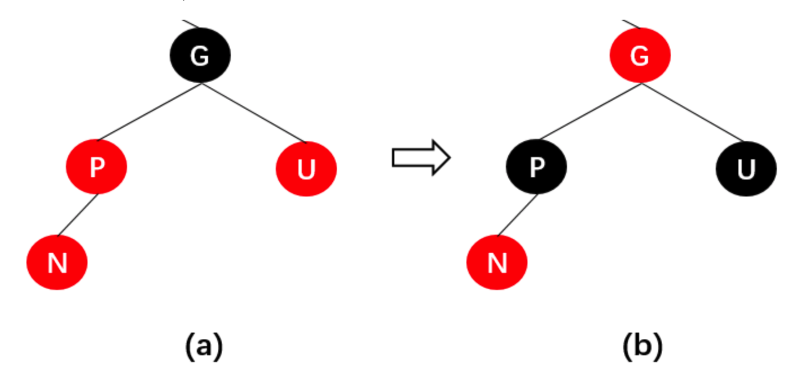

可能出现的问题：

- N的祖父节点G的父节点也可能是红色，这就违反了规则4，此时可以通过递归调整节点颜色；
- 当递归调整到根节点时就需要旋转了，如下图节点A和节点B所示，具体情况后面会介绍；
- 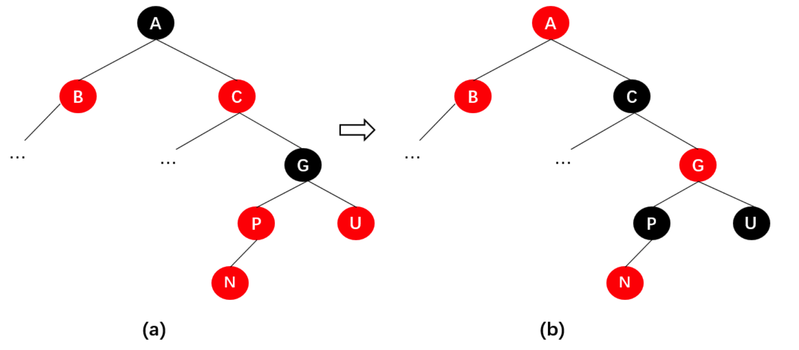

#### 3.4.情况4

节点P是红色节点，节点U是黑色节点，并且节点N为节点P的**左子节点**，此时节点G一定是黑色节点，即**父红叔黑祖黑**。

在这种情况下需要：

- 先变色：将父节点P变为黑色，将祖父节点G变为红色；
- 后旋转：以祖父节点G为根进行右旋转；

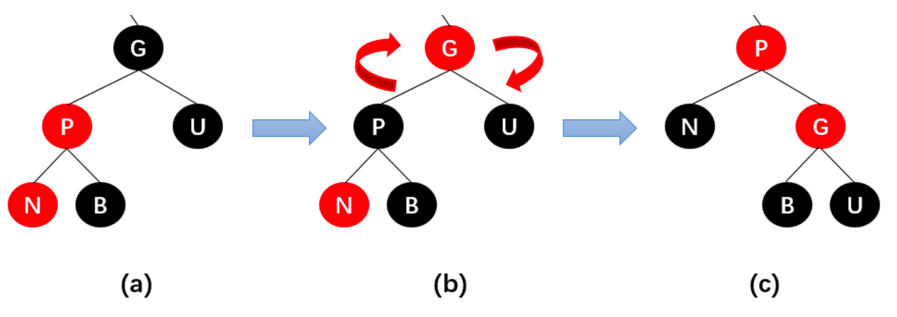

#### 3.5.情况5

节点P是红色节点，节点U是黑色节点，并且节点N为节点P的**右子节点**，此时节点G一定是黑色节点，即**父红叔黑祖黑**。

在这种情况下需要：

- 先以节点P为根进行左旋转，旋转后如图b所示；
- 随后将**红色**节点**P**和**黑色**节点**B**看成一个整体的**红色**节点**N1**，将新插入的**红色**节点**N**看成**红色**节点**P1** 如图c所示。此时整体就转换为了情况4。

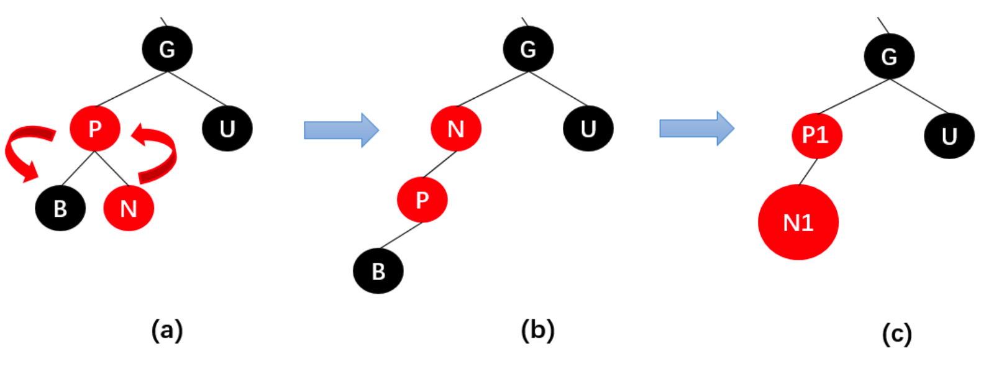

接着可以按照情况4进行处理：

- 先变色：将N1节点的父节点P1变为黑色，将祖父节点G变为红色；
- 后旋转：以祖父节点G为根进行右旋转，旋转后如图 e 所示；
- 最后将节点N1和P1变换回来，完成节点N的插入，如图 f 所示；

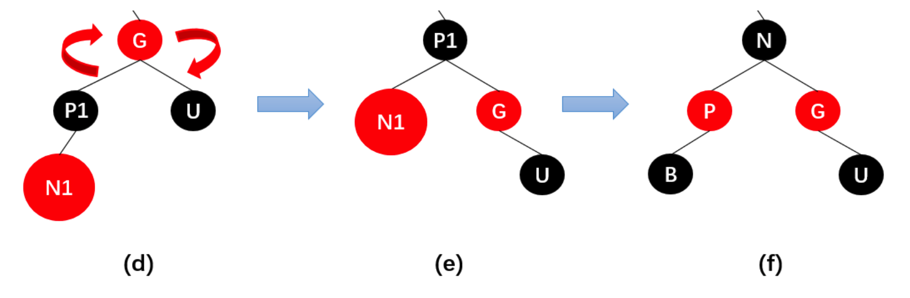

#### 3.6.案例

在二叉树中依次插入节点：10，9，8，7，6，5，4，3，2，1 。

如果直接采用普通的二叉搜索树，节点全部插入后是这样的：

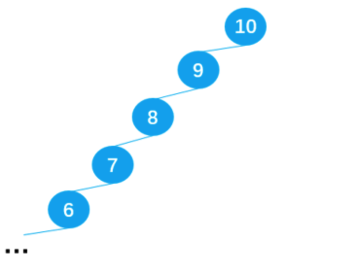

是一个严重的**不平衡树**，相当于一个链表，不能体现出二叉搜索树的高效率。而按照红黑树的五条规则插入节点就能最大程度保证搜索二叉树是一棵**平衡树**。以下为过程详解：**为了方便解释省略了部分红黑树的叶子节点（NIL）**

##### 插入10

符合**情况1**：

- 插入节点10；
- 将节点10的颜色变为黑色；

##### 插入9

符合**情况2**：

- 不需要任何变化；

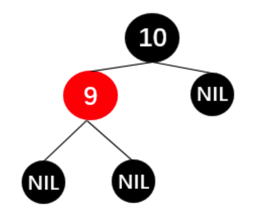

##### 插入8

> 快速判断属于情况3还是情况4的方法：
>
> 从新插入的节点N出发，按图示箭头经过的四个节点，若为**红红黑红**3个红色节点则为情况3，若为**红红黑黑**两个红色节点则为情况4；

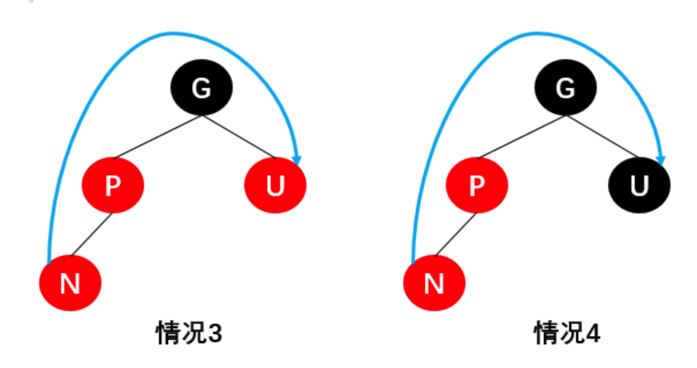

符合**情况4**：

- 父节点9变成黑，祖父节点10变为红；
- 以祖父节点为根进行右旋转；
- 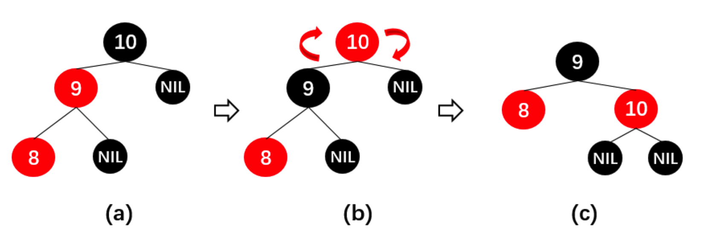

##### 插入7

符合**情况3**：

- 父节点8和叔节点10变为黑，祖父节点9变为红；
- 此时会出现问题：不符合规则2，即根节点不为黑，此时可以把以9为根节点的二叉搜索树当作一个整体作为一个新插入的节点N，而此时又符合情况1，只需要把9变回黑色即可。

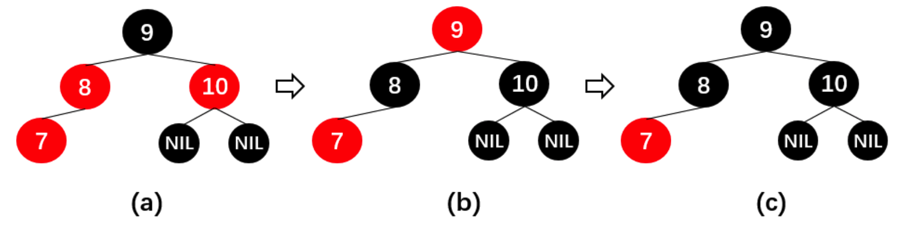

##### 插入6

符合**情况4**：

- 父节点7变为黑，祖父节点8变为红；
- 以祖父节点8为根进行右旋转；

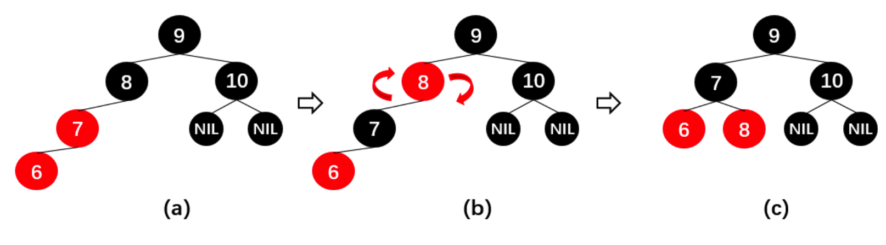

##### 插入5

符合**情况3**：

- 父节点6和叔节点8变为黑，祖父节点7变为红；

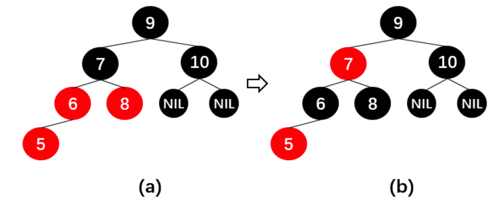

##### 插入4

符合**情况4**：

- 父节点5变为黑，祖父节点6变为红；
- 以祖父节点6为根进行右旋转；

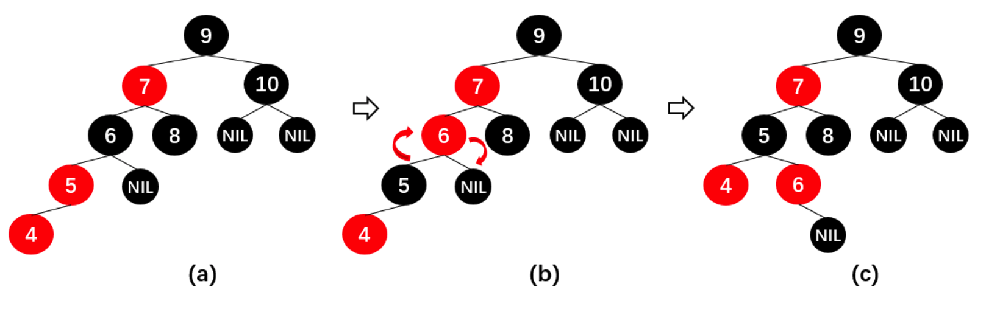

##### 插入3

**第一次变换**：符合**情况3**：

- 父节点4和叔节点6变为黑，祖父节点5变为红；

变换之后发现5和7为相连的两个红色节点，于是把以5为根的整个子树看成一个新插入的节点N1，再进行第二次变换。

**第二次变换**：符合**情况4**：

- 父节点7变为黑，祖父节点9变为红；
- 以祖父节点9为根进行右旋转；

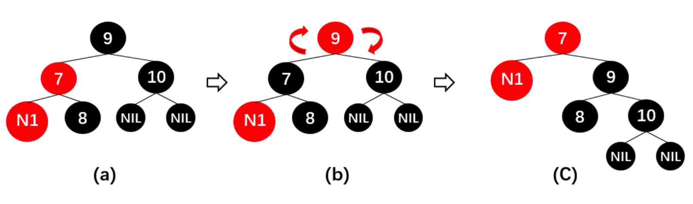

最后复原N1得到变换后的红黑树：

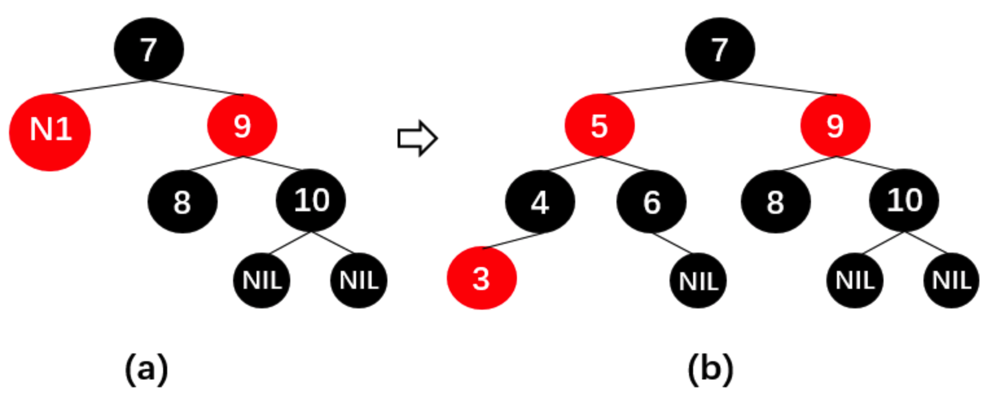

##### 插入2

符合**情况4**：

- 父节点3变为黑，祖父节点4变为红；
- 以祖父节点4为根进行右旋转；

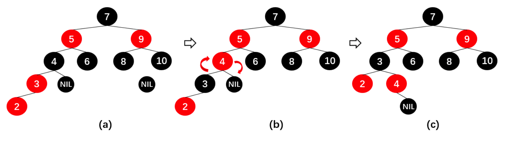

##### **插入1**

**第一次变换**：符合**情况3**：

- 父节点2和叔节点4变为黑，祖父节点3变为红；

变换之后发现3和5为相连的两个红色节点，于是把以3为根的整个子树看成一个新插入的节点N1，再进行第二次变换。

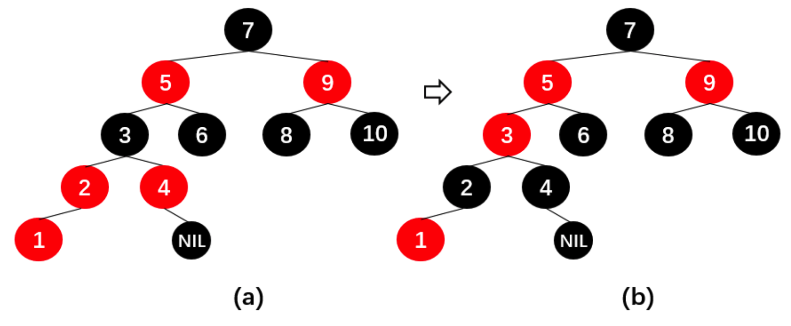

**第二次变换**：符合**情况3**：

- 父节点5和叔节点9变为黑，祖父节点7变为红；即由图 b -> 图 c 。

变换之后发现根节点7为红色不符合规则2，所以把以7为根节点的红黑树看成一个新插入的节点N2，再进行第三次变换。

**第三次变换**：符合**情况1**：

- 直接将根节点7变为黑色即可。

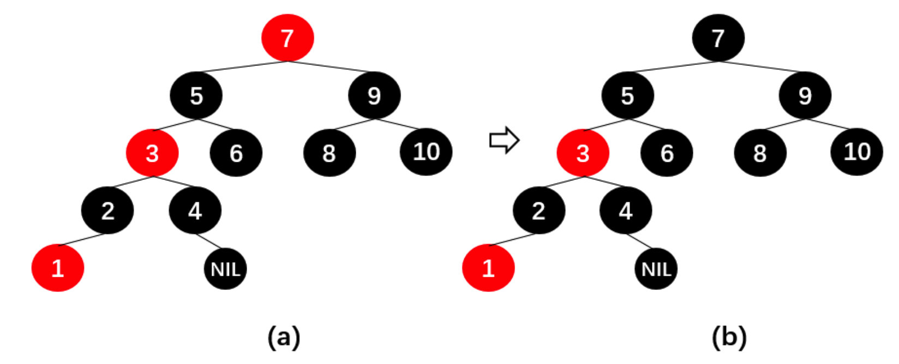

由此，完成了1~10节点的插入，虽然没有遇到情况5，不过情况5经过左旋转的操作便可转换为情况4，原理一样。如下图所示，将这棵红黑树的叶子节点NIL补全之后，经检验满足红黑树的五条规则，并且基本属于**平衡树**，效率较高。

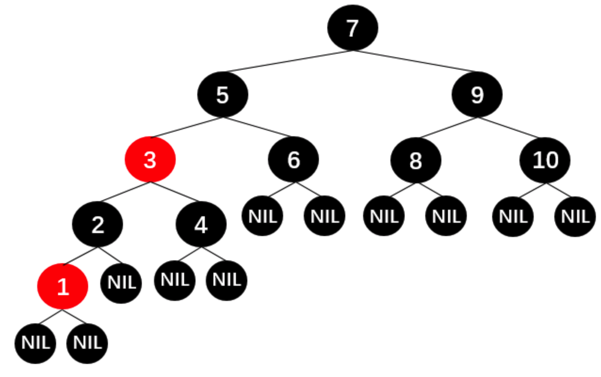

### 四、红黑树的删除操作

红黑树的删除操作结合了复杂的**二叉树的删除操作**和复杂的**红黑树的插入规则**，整体来说难度非常大，篇幅较长，这里暂不进行探讨。