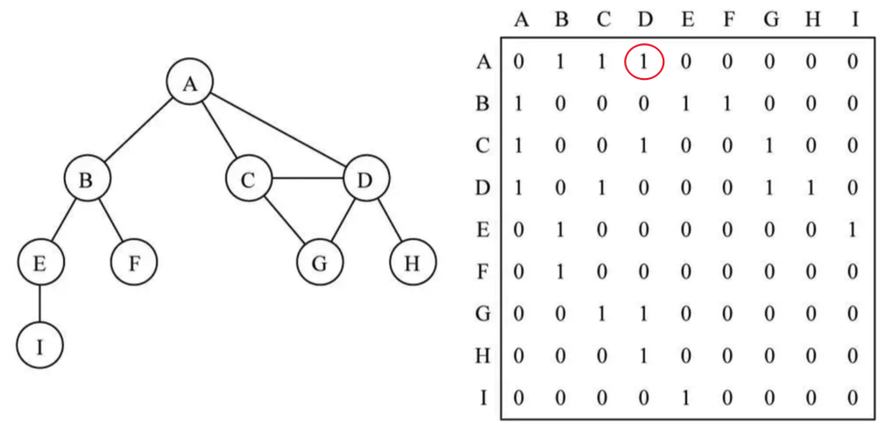
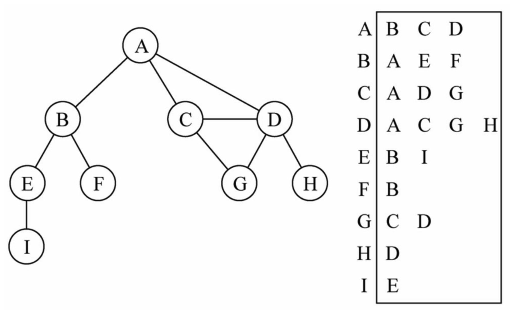
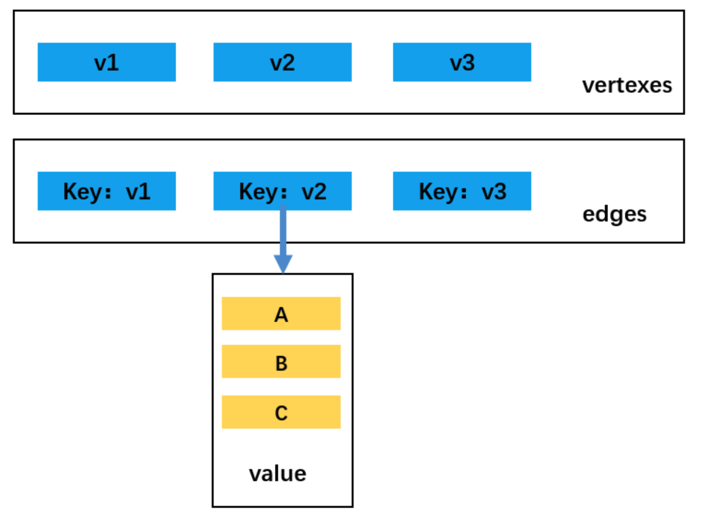
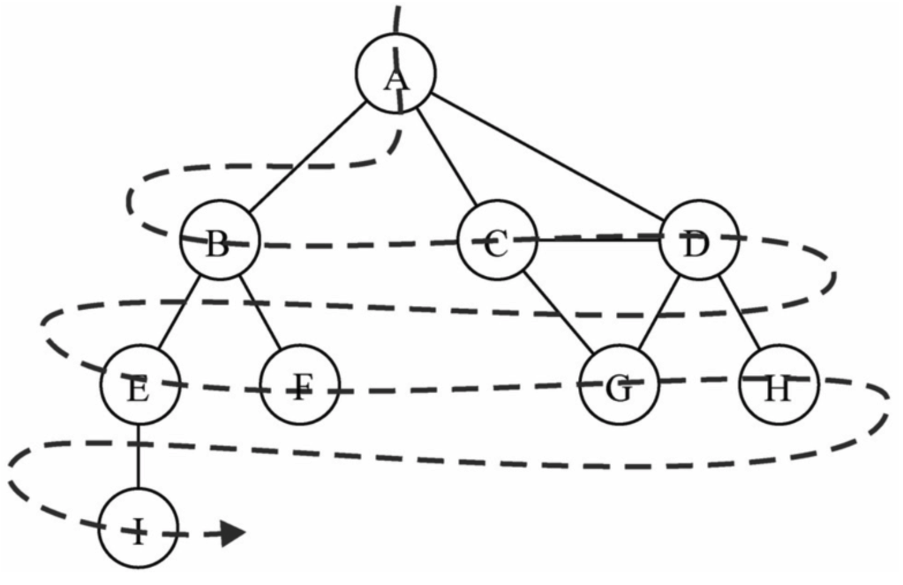
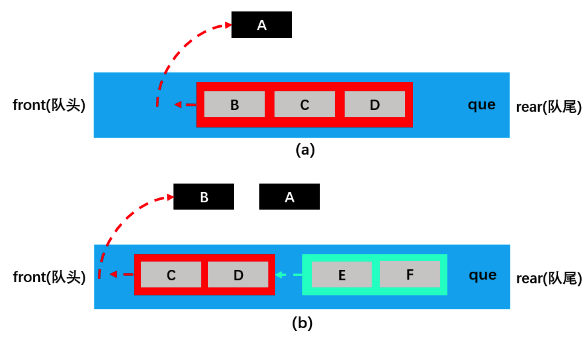
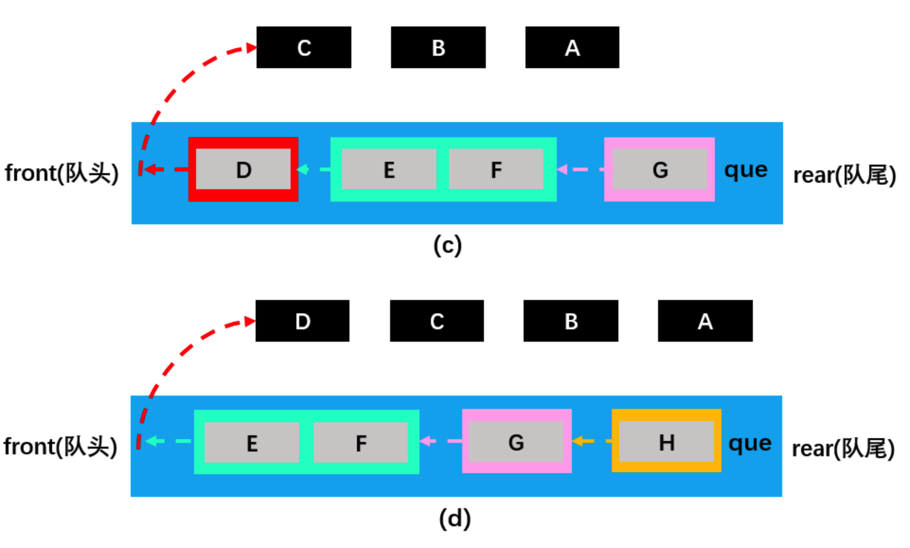
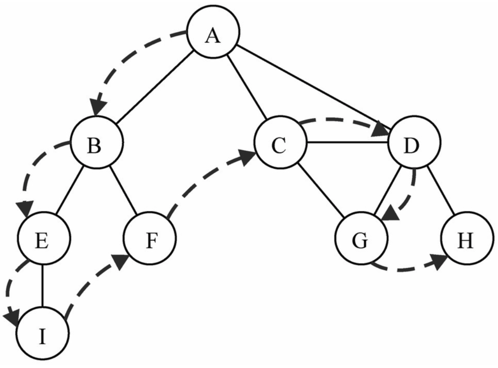
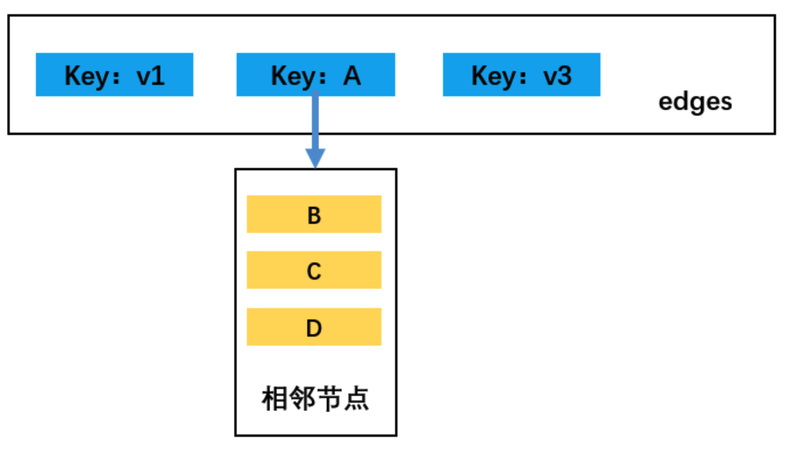
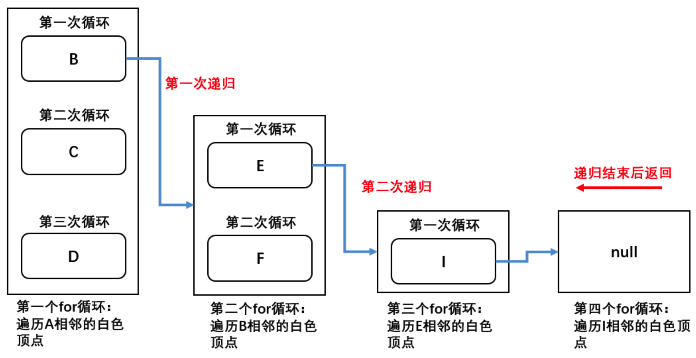
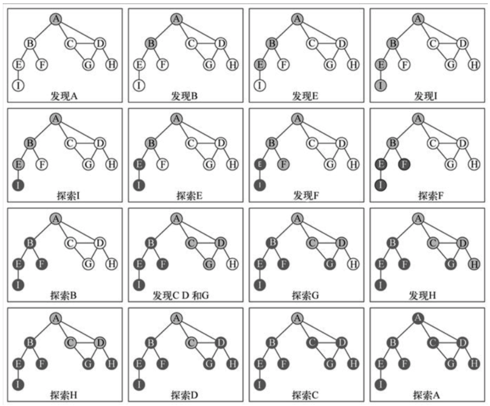

# JavaScript实现图结构

### 一、图论

#### 1.1.图的简介

**什么是图？**

- **图结构**是一种与**树结构**有些相似的数据结构；
- **图论**是数学的一个分支，并且，在数学中，树是图的一种；
- 图论以图为研究对象，研究**顶点**和**边**组成的**图形**的数学理论和方法；
- 主要的研究目的为：**事物之间的联系**，**顶点**代表**事物**，**边**代表两个事物间的**关系**；

**图的特点：**

- **一组顶点**：通常用 **V** （Vertex）表示顶点的集合；
- 一组边：通常用E（Edge）表示边的集合；
  - 边是顶点和顶点之间的连线；
  - 边可以是有向的，也可以是无向的。比如A----B表示无向，A ---> B 表示有向；

**图的常用术语：**

- **顶点：**表示图中的一个**节点**；
- **边：**表示**顶点和顶点**给之间的**连线**；
- **相邻顶点：**由一条边连接在一起的顶点称为**相邻顶点**；
- **度：**一个顶点的**度**是**相邻顶点的数量**；
- **路径：**
  - **简单路径：**简单路径要求不包含重复的顶点；
  - **回路：**第一个顶点和最后一个顶点**相同**的路径称为回路；
- **无向图：**图中的所有边都是**没有**方向的；
- **有向图：**图中的所有边都是**有**方向的；
- **无权图：**无权图中的边没有任何权重意义；
- **带权图：**带权图中的边有一定的权重含义；

#### 1.2.图的表示

##### 邻接矩阵

表示图的常用方式为：**邻接矩阵**。

- 可以使用二维数组来表示邻接矩阵；
- 邻接矩阵让**每个节点和一个整数相关联**，该**整数作为数组的下标值**；
- 使用一个**二维数组**来表示顶点之间的**连接**；




如上图所示：

- 二维数组中的**0**表示没有连线，**1**表示有连线；
- 如：A[ 0 ] [ 3 ] = 1，表示 A 和 C 之间有连接；
- 邻接矩阵的对角线上的值都为0，表示A - A ，B - B，等自回路都没有连接（自己与自己之间没有连接）；
- 若为无向图，则邻接矩阵应为对角线上元素全为0的对称矩阵；

**邻接矩阵的问题：**

- 如果图是一个**稀疏图**，那么邻接矩阵中将存在**大量的 0**，造成存储空间的浪费；

##### 邻接表

另外一种表示图的常用方式为：**邻接表**。

- 邻接表由图中**每个顶点**以及**和顶点相邻的顶点列表**组成；
- 这个列表可用多种方式存储，比如：**数组/链表/字典（哈希表）**等都可以；




如上图所示：

- 图中可清楚看到**A与B、C、D相邻**，假如要表示这些与A顶点相邻的顶点（边），可以通过将它们作为A的值（value）存入到对应的**数组/链表/字典**中。
- 之后，通过键（key）A可以十分方便地取出对应的数据；

**邻接表的问题：**

- 邻接表可以简单地得出**出度**，即某一顶点指向其他顶点的个数；
- 但是，邻接表计算**入度**（指向某一顶点的其他顶点的个数称为该顶点的入度）十分困难。此时需要构造**逆邻接表**才能有效计算入度；

### 二、封装图结构

在实现过程中采用**邻接表**的方式来表示边，使用**字典类**来存储邻接表。

#### 2.1.添加字典类和队列类

首先需要引入之前实现的，之后会用到的字典类和队列类：

#### 2.2.创建图类

先创建图类Graph，并添加基本属性，再实现图类的常用方法：

#### 2.3.添加顶点与边

如图所示：




创建一个数组对象vertexes存储图的顶点；创建一个字典对象edges存储图的边，其中key为顶点，value为存储key顶点相邻顶点的数组。

#### 2.4.转换为字符串输出

为图类Graph添加toString方法，实现以邻接表的形式输出图中各顶点。

#### 2.5.图的遍历

**图的遍历思想：**

- 图的遍历思想与树的遍历思想一样，意味着需要将图中**所有的顶点**都访问一遍，并且不能有**重复的访问**（上面的toString方法会重复访问）；

**遍历图的两种算法：**

- 广度优先搜索（Breadth - First Search，简称**BFS**）;
- 深度优先搜索（Depth - First Search，简称**DFS**）;
- 两种遍历算法都需要指定**第一个被访问的顶点**；

为了记录顶点是否被访问过，使用**三种颜色**来表示它们的状态

- **白色**：表示该顶点还没有被访问过；
- **灰色**：表示该顶点被访问过，但其相邻顶点并未完全被访问过；
- **黑色**：表示该顶点被访问过，且其所有相邻顶点都被访问过；


##### 广度优先搜索

广度优先搜索算法的思路：

- 广度优先搜索算法会从指定的第一个顶点开始遍历图，先访问其所有的相邻顶点，就像一次访问图的一层；
- 也可以说是**先宽后深**地遍历图中的各个顶点；



**实现思路：**

基于**队列**可以简单地实现广度优先搜索算法：

- 首先创建一个队列Q（尾部进，首部出）；
- 调用封装的initializeColor方法将所有顶点初始化为白色；
- 指定第一个顶点A，将A标注为**灰色**（被访问过的节点），并将A放入队列Q中；
- 循环遍历队列中的元素，只要队列Q非空，就执行以下操作：
  - 先将灰色的A从Q的首部取出；
  - 取出A后，将A的所有未被访问过（白色）的相邻顶点依次从队列Q的尾部加入队列，并变为灰色。以此保证，灰色的相邻顶点不重复加入队列；
  - A的全部相邻节点加入Q后，A变为黑色，在下一次循环中被移除Q外；

**过程详解：**

下为指定的第一个顶点为A时的遍历过程：

- 如 a 图所示，将在字典edges中取出的与A相邻的且未被访问过的白色顶点B、C、D放入队列que中并变为灰色，随后将A变为黑色并移出队列；
- 接着，如图 b 所示，将在字典edges中取出的与B相邻的且未被访问过的白色顶点E、F放入队列que中并变为灰色，随后将B变为黑色并移出队列；




- 如 c 图所示，将在字典edges中取出的与C相邻的且未被访问过的白色顶点G（A，D也相邻不过已变为灰色，所以不加入队列）放入队列que中并变为灰色，随后将C变为黑色并移出队列；
- 接着，如图 d 所示，将在字典edges中取出的与D相邻的且未被访问过的白色顶点H放入队列que中并变为灰色，随后将D变为黑色并移出队列。




如此循环直到队列中元素为0，即所有顶点都变黑并移出队列后才停止，此时图中顶点已被全部遍历。


可见，安装了广度优先搜索的顺序**不重复**地遍历了**所有**顶点。

##### 深度优先搜索

广度优先算法的思路：

- 深度优先搜索算法将会从指定的第一个顶点开始遍历图，沿着一条路径遍历直到该路径的最后一个顶点都被访问过为止；
- 接着沿原来路径回退并探索下一条路径，即**先深后宽**地遍历图中的各个顶点；




**实现思路：**

- 可以使用**栈**结构来实现深度优先搜索算法；
- 深度优先搜索算法的遍历顺序与二叉搜索树中的先序遍历较为相似，同样可以使用**递归**来实现（递归的本质就是**函数栈**的调用）。

基于递归实现深度优先搜索算法：定义dfs方法用于调用递归方法dfsVisit，定义dfsVisit方法用于递归访问图中的各个顶点。

在dfs方法中：

- 首先，调用initializeColor方法将所有顶点初始化为白色；
- 然后，调用dfsVisit方法遍历图的顶点；

在dfsVisit方法中：

- 首先，将传入的指定节点v标注为**灰色**；
- 接着，处理顶点V；
- 然后，访问V的相邻顶点；
- 最后，将顶点v标注为黑色；


**过程详解：**

这里主要解释一下代码中的第3步操作：访问指定顶点的相邻顶点。

- 以指定顶点A为例，先从储存顶点及其对应相邻顶点的字典对象edges中取出由顶点A的相邻顶点组成的数组：



- **第一步**：A顶点变为灰色，随后进入第一个for循环，遍历A白色的相邻顶点：B、C、D；在该for循环的第1次循环中（执行B），B顶点满足：colors == "white"，触发递归，重新调用该方法；
- **第二步**：B顶点变为灰色，随后进入第二个for循环，遍历B白色的相邻顶点：E、F；在该for循环的第1次循环中（执行E），E顶点满足：colors == "white"，触发递归，重新调用该方法；
- **第三步**：E顶点变为灰色，随后进入第三个for循环，遍历E白色的相邻顶点：I；在该for循环的第1次循环中（执行I），I顶点满足：colors == "white"，触发递归，重新调用该方法；
- **第四步**：I顶点变为灰色，随后进入第四个for循环，由于顶点I的相邻顶点E不满足：colors == "white"，停止递归调用。过程如下图所示：




- **第五步**：递归结束后一路向上返回，首先回到第三个for循环中继续执行其中的第2、3...次循环，每次循环的执行过程与上面的同理，直到递归再次结束后，再返回到第二个for循环中继续执行其中的第2、3...次循环....以此类推直到将图的所有顶点访问完为止。

下图为遍历图中各顶点的完整过程：

- **发现**表示访问了该顶点，状态变为**灰色**；
- **探索**表示既访问了该顶点，也访问了该顶点的全部相邻顶点，状态变为**黑色**；
- 由于在顶点变为灰色后就调用了处理函数handler，所以handler方法的输出顺序为发现顶点的顺序即：A、B、E、I、F、C、D、G、H 。




#### 2.6.完整实现

**集合及数列代码**

```js
class Dictionary {
  items = {}

  // 如果某个键值存在于这个字典中，则返回`true`，反之则返回`false`。
  has(value) {
    return this.items.hasOwnProperty(value)
  }

  // 向字典中添加新元素。
  set(key, value) {
    this.items[key] = value
  }

  // 通过使用键值来从字典中移除键值对应的数据值。
  remove(value) {
    if (!this.has(value)) return false
    delete this.items[value]
    return true
  }

  // 通过键值查找特定的数值并返回。
  get(key) {
    return this.has(key) ? this.items[key] : undefined
  }

  // 将这个字典中的所有元素全部删除。
  clear() {
    this.items = {}
    return true
  }

  // 返回字典所包含元素的数量。与数组的`length`属性类似。
  size() {
    return Object.keys(this.items).length
  }

  // 将字典所包含的所有键名以数组形式返回。
  keys() {
    return Object.keys(this.items)
  }

  // 将字典所包含的所有数值以数组形式返回。
  values() {
    return Object.values(this.items)
  }
}


class Queue {
  items = []
  // 向队列尾部添加一个（或多个）新的项
  enqueue(item) {
    this.items.push(item)
    return this.items
  }

  // 移除队列的第一（即排在队列最前面的）项，并返回被移除的元素；
  dequeue() {
    return this.items.shift()
  }

  // 返回队列中的第一个元素——最先被添加，也将是最先被移除的元素。队列不做任何变动（不移除元素，只返回元					//	素信息与Stack类的peek方法非常类似）；
  front() {
    return this.items[0]
  }
  // 如果队列中不包含任何元素，返回true，否则返回false；
  isEmpty() {
    return this.items.length === 0
  }

  // 返回队列包含的元素个数，与数组的length属性类似；
  size() {
    return this.items.length
  }
  // 将队列中的内容，转成字符串形式；
  toString() {
    return this.items.join(' ')
  }
}
```

**图代码实现**

```js
class Graph {
  vertex = [] // 顶点集合
  edges = new Dictionary() // 边的集合

  // 添加顶点
  addVertex(v) {
    this.vertex.push(v) // 将顶点添加进去
    this.edges.set(v, []) // 将边设置为[]
  }
  // 添加边
  addEdge(v1, v2) {
    this.edges.get(v1).push(v2)
    this.edges.get(v2).push(v1)
  }

  toString() {
    let resultStr = ''
    for (let i = 0; i < this.vertex.length; i++) {
      const item = this.vertex[i]
      resultStr += item + '-->'
      const edges = this.edges.get(item)
      for (let j = 0; j < edges.length; j++) {
        const item2 = edges[j]
        resultStr += item2 + ' '
      }
      resultStr += '\n'
    }
    return resultStr
  }

  // 广度优先搜索（Breadth - First Search，简称BFS）;
  bfs(hander) {
    let color = this.initColor()
    let queue = new Queue()
    queue.enqueue(this.vertex[0])
    while (!queue.isEmpty()) {
      const dequeue = queue.dequeue()
      color[dequeue] = 'grey'
      hander(dequeue)
      const otherVertex = this.edges.get(dequeue)
      for (let i = 0; i < otherVertex.length; i++) {
        const vertex = otherVertex[i]
        if (color[vertex] === 'white') {
          color[vertex] = 'gray'
          queue.enqueue(vertex)
        }
      }
    }
  }

  // 深度优先搜索（Depth - First Search，简称DFS）;
  dfs(hander) {
    let color = this.initColor()
    dfsVisit.call(this, this.vertex[0])

    // 递归调用
    function dfsVisit(v) {
      console.log(v, 'v')
      color[v] = 'grey'
      hander(v)
      let other = this.edges.get(v)
      console.log(other, 'other')
      for (let i = 0; i < other.length; i++) {
        const vertex = other[i]
        console.log(vertex, 'vertex')
        if (color[vertex] === 'white') {
          dfsVisit.call(this, vertex)
        }
      }
    }
  }

  // 初始化颜色
  initColor() {
    let color = []
    for (let i = 0; i < this.vertex.length; i++) {
      const item = this.vertex[i]
      color[item] = 'white'
    }
    return color
  }
}

//测试代码
//1.创建图结构
let graph = new Graph()

//2.添加顶点
let myVertexes = ['A', 'B', 'C', 'D', 'E', 'F', 'G', 'H', 'I']
for (let i = 0; i < myVertexes.length; i++) {
  graph.addVertex(myVertexes[i])
}

//3.添加边
graph.addEdge('A', 'B')
graph.addEdge('A', 'C')
graph.addEdge('A', 'D')
graph.addEdge('C', 'D')
graph.addEdge('C', 'G')
graph.addEdge('D', 'G')
graph.addEdge('D', 'H')
graph.addEdge('B', 'E')
graph.addEdge('B', 'F')
graph.addEdge('E', 'I')

//4.输出结果
console.log(graph.toString())
let resultStr = ''
graph.bfs(v => {
  resultStr += v + ' '
})
console.log(resultStr)

let resultStr2 = ''
graph.dfs(v => {
  resultStr2 += v + ' '
})
console.log(resultStr2)
```

学习笔记参考 https://www.bilibili.com/video/BV1r7411n7Pw