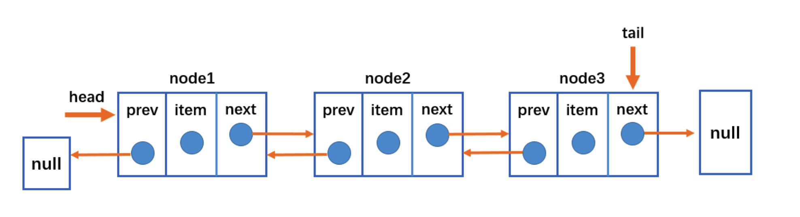

# JavaScript实现双向链表


> **双向链表**：既可以**从头遍历到尾**，又可以**从尾遍历到头**。也就是说链表连接的过程是**双向**的，它的实现原理是：一个节点既有**向前连接的引用**，也有一个**向后连接的引用**。
>
> **双向链表的缺点：**
>
> - 每次在**插入或删除**某个节点时，都需要处理四个引用，而不是两个，实现起来会困难些；
> - 相对于单向链表，所占**内存空间更大**一些；
> - 但是，相对于双向链表的便利性而言，这些缺点微不足道。



> - 双向链表不仅有**head**指针指向第一个节点，而且有**tail**指针指向最后一个节点；
> - 每一个节点由三部分组成：**item**储存数据、**prev**指向前一个节点、**next**指向后一个节点；
> - 双向链表的第一个节点的prev指向**null**；
> - 双向链表的最后一个节点的next指向**null**；


**双向链表常见的操作（方法）：**

- append（element）：向链表尾部添加一个新的项；
- inset（position，element）：向链表的特定位置插入一个新的项；
- get（element）：获取对应位置的元素；
- indexOf（element）：返回元素在链表中的索引，如果链表中没有元素就返回-1；
- update（position，element）：修改某个位置的元素；
- removeAt（position）：从链表的特定位置移除一项；
- isEmpty（）：如果链表中不包含任何元素，返回trun，如果链表长度大于0则返回false；
- size（）：返回链表包含的元素个数，与数组的length属性类似；
- toString（）：由于链表项使用了Node类，就需要重写继承自JavaScript对象默认的toString方法，让其只输出元素的值；
- forwardString（）：返回正向遍历节点字符串形式；
- backwordString（）：返回反向遍历的节点的字符串形式；

```js
 //封装双向链表类
class DoubleLinklist {
  //属性
  constructor() {
    this.head = null
    this.tail == null
    this.length = 0
  }

  // 向链表尾部添加一个新的项；
  append(element) {
    let node = new Node(element)
    if (this.length === 0) {
      this.head = node
      this.tail = node
    } else {
      // 从尾部添加
      this.tail.next = node // 将node移动到最后
      node.prev = this.tail // 并将node.prev指回去
      this.tail = node // 将当前node设置为尾部
    }
  		this.length += 1
   }
      // 向链表的特定位置插入一个新的项；
   inset(position, element) {
     if (position > this.length || position < 0) throw new Error('position有误')
     let node = new Node(element)
     let current = this.head
     if (this.length === 0) {
       this.head = node
       this.prev = node
     } else {
       if (position === 0) {
           this.head = node
           node.next = current
           current.prev = node
         } else if (position === this.length) {
           this.tail.next = node
           node.prev = this.tail
           this.tail = node
         } else {
           let index = 0
           while (position > index++) {
             current = current.next
           }
           node.next = current
           node.prev = current.prev
           node.prev.next = node
           current.prev = node
         }
       }
       this.length += 1
       return true
   

     // 获取对应位置的元素；
     get(position) {
       if (position >= this.length || position < 0) throw new Error('position有误')
       let current = this.head
       let index = 0
       if (position === 0) return current.data
       while (position > index++) {
         current = current.next
       }
       return current.data
     }

     // 返回元素在链表中的索引，如果链表中没有元素就返回-1；
     indexOf(element) {
       let current = this.head
       let index = 0
       if (current.data === element) return index
       while (this.length > index++) {
         current = current.next
         if (current.data === element) return index
       }
       return -1
     }

     // 修改某个位置的元素；
     update(position, element) {
       if (position >= this.length || position < 0) throw new Error('position有误')
       if (position === 0) {
         this.head.data = element
       } else {
         let current = this.head
         let index = 0
         while (position > index++) {
           current = current.next
         }
         current.data = element
       }

       return true
     }

        // 从链表的特定位置移除一项；
     removeAt(position) {
       if (position >= this.length || position < 0) throw new Error('position有误')
       let current = this.head
       if (position === 0) {
         this.head = current.next
       } else {
         if (this.length - 1 === position) {
           current = this.tail
           this.tail.prev.next = null
           this.tail = this.tail.prev
         } else {
           let index = 0
           while (position > index++) {
             current = current.next
           }
           current.prev.next = current.next
           current.next.prev = current.prev
         }
       }
       this.length -= 1
       return current.data
     }

        // 如果链表中不包含任何元素，返回trun，如果链表长度大于0则返回false；
     isEmpty() {
       return this.length === 0
     }

     // 返回链表包含的元素个数，与数组的length属性类似；
     size() {
       return this.length
     }

        // 返回正向遍历节点字符串形式；
     forwardString() {
       //1.定义变量
       let current = this.head
       let resultString = ''

       //2.依次向后遍历，获取每一个节点
       while (current) {
         resultString += current.data + '--'
         current = current.next
       }
       return resultString
     }

        // 返回反向遍历的节点的字符串形式；
     backwordString() {
       //1.定义变量
       let current = this.tail
       let resultString = ''

       //2.依次向前遍历，获取每一个节点
       while (current) {
         resultString += current.data + '--'
         current = current.prev
       }
       return resultString
     }

        // 由于链表项使用了Node类，就需要重写继承自JavaScript对象默认的toString方法，让其只输出元素的值；
     toString() {
       let str = ''
       let current = this.head
       for (let i = 0; i < this.length; i++) {
         str += current.data + ' '
         current = current.next
       }
       return str
     }
   }
class Node {
  constructor(data, prev = null, next = null) {
    this.data = data
    this.prev = null
    this.next = null
  }
}

let doubleLinklist = new DoubleLinklist()
doubleLinklist.append('abc')
doubleLinklist.append('cba')
doubleLinklist.append('nba')
console.log(doubleLinklist.inset(2, 'aaa'), 'inset') // true
console.log(doubleLinklist.toString(), 'toString') //  abc cba aaa nba
console.log(doubleLinklist.get(0), 'get') // abc
console.log(doubleLinklist.indexOf('abc'), 'get') // 0
console.log(doubleLinklist.update(0, '111'), 'update') // true
console.log(doubleLinklist.update(3, '222'), 'update') // true
console.log(doubleLinklist.toString(), 'toString') //  111 cba aaa 222
console.log(doubleLinklist.removeAt(0), 'removeAt') //
console.log(doubleLinklist.toString(), 'toString') //  abc cba nba
console.log(doubleLinklist.isEmpty(), 'isEmpty') //  abc cba nba
console.log(doubleLinklist.size(), 'size') //  abc cba nba
console.log(doubleLinklist.forwardString(), 'size') //  abc cba nba
console.log(doubleLinklist.backwordString(), 'size') //  abc cba nba
console.log(doubleLinklist)
```

