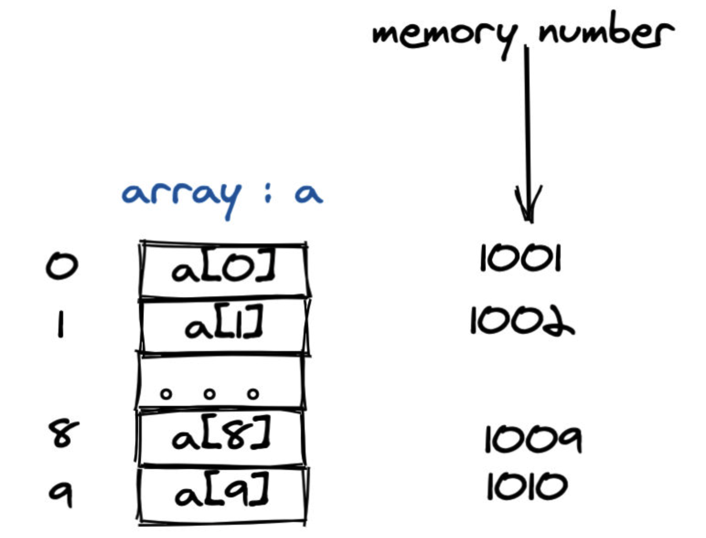

# 数组

数组是一种使用最为广泛的数据结构，尤其是在大家的日常开发中，原因无非就是**操作简单**和**支持随机访问**。而字符串大家也可以将其看成是一个字符数组，这更加夯实了数组的重要性。

数组和链表是重要的数据结构，虽然数据结构有很多，比如树，图，哈希表等。但真正的实现还需要落实到具体的基础数据结构，即**数组和链表**。之所以说他们是基础的数据结构，是因为它们直接控制物理内存的使用。

数组使用连续的内存空间，来存储一系列同一数据类型的值。如图表示的是数组的**每一项都使用一个 byte 存储**的情况。




我们知道JavaScript中数组元素可以存储任意元素，但是有些其他语言「强类型语言」不能储存任意类型的数据。

JavaScript是通过堆栈这种内存设计模式处理的，比如基础数据放在栈中，复杂的数据类型放在堆中，但是把指针放在栈中，这样存在数组中的元素都是基础类型，并且遇见复杂的数据项会根据指针找到堆中数据。

而强类型语言是通过定义数据类型这种方式处理。

但是无论哪种处理方式，它们的目的都是为了让数据可以**随意访问**，因为数组的存储是连续的，而且大小固定。

那么当访问某个元素的时候就可以通过访问**基址 + 偏移量**，实现随意访问。

二维数组的表达方式 `board` 或者 `matrix`

### 数组的常见操作

1.随机访问，时间复杂度为O(1)
2.遍历，时间复杂度为O(N)
3.删除、插入元素比较复杂
- 当删除/插入某个元素的时候是需要找到元素，然后进行删除，而且还需要平移操作，所以最坏的是O(N)，最好是O(1)。


## 数组题目练习
### [第三大的数](https://leetcode-cn.com/problems/third-maximum-number)

#### 题目描述

```
示例 1：
输入：[3, 2, 1]
输出：1
解释：第三大的数是 1 。

示例 2：
输入：[1, 2]
输出：2
解释：第三大的数不存在, 所以返回最大的数 2 。

示例 3：
输入：[2, 2, 3, 1]
输出：1
解释：注意，要求返回第三大的数，是指在所有不同数字中排第三大的数。
此例中存在两个值为 2 的数，它们都排第二。在所有不同数字中排第三大的数为 1 。
```

#### 题解

##### 解法1

现将数组从大到小排序，并进行去重，接着就可以按照题目取值。

<details>   
  <summary>点击展开</summary>   
 <pre><blockcode>
var thirdMax = function(nums) {
let newArr = nums.sort((a, b) => b-a)
	newArr = Array.from(new Set(newArr))
	if (newArr.length >= 3) {
	  return newArr[2]
	} else {
	  return newArr[0]
	}
};
</blockcode></pre>
 <pre><blockcode>
执行用时：80 ms, 在所有 JavaScript 提交中击败了 59.84% 的用户
内存消耗：39.6 MB, 在所有 JavaScript 提交中击败了 36.35% 的用户
通过测试用例：30 / 30
</blockcode></pre>
</details>  

##### 解法2

 定义第一大的数字 第二大的数字，第三大的数字，接着遍历数组，进行赋值，需要注意重复数字，最后按照题目取值。

<details>   
  <summary>点击展开</summary>   
 <pre><blockcode>
var thirdMax = function(nums) {
  let first = -Infinity // 最大
  let second = -Infinity // 第二大
  let third = -Infinity // 最三大
  for (let i = 0; i < nums.length; i++) {
    const e = nums[i]
    if (e > first) [first, second, third] = [e, first, second]
    else if (e > second && e !== first) [second, third] = [e, second]
    else if (e > third && e !== second && e !== first) third = e
  }
  console.log(first, second, third)
  return third !== -Infinity ? third : first
}
</blockcode></pre>
 <pre><blockcode>
执行用时：68 ms, 在所有 JavaScript 提交中击败了 92.56% 的用户
内存消耗：40 MB, 在所有 JavaScript 提交中击败了 12.50% 的用户
通过测试用例：30 / 30
</blockcode></pre>
</details>  

##### 解法3

先数组排序，然后用一个变量标记第三大的值，然后返回。

<details>   
  <summary>点击展开</summary>   
 <pre><blockcode>
var thirdMax = function(nums) {
    let newArr = nums.sort((a, b) => b - a)
    let third = 0
    for (let i = 0; i < newArr.length; i++) {
      if (newArr[i] > newArr[i + 1]) third++
      if (third === 2) return newArr[i + 1]
    }
    return newArr[0]
}
</blockcode></pre>
 <pre><blockcode>
执行用时：68 ms, 在所有 JavaScript 提交中击败了91.87%的用户
内存消耗：39.1 MB, 在所有 JavaScript 提交中击败了85.54%的用户
</blockcode></pre>
</details>   


### [剑指 Offer 53 - II. 0 ～ n-1 中缺失的数字](https://leetcode-cn.com/problems/que-shi-de-shu-zi-lcof/)

#### 题目描述

```js
一个长度为n-1的递增排序数组中的所有数字都是唯一的，并且每个数字都在范围0～n-1之内。在范围0～n-1内的n个数字中有且只有一个数字不在该数组中，请找出这个数字。

示例 1:
输入: [0,1,3]
输出: 2

示例 2:
输入: [0,1,2,3,4,5,6,7,9]
输出: 8
```

#### 题解

##### 解法1

遍历数组将当前项和下一项进行对比，然后按照边界取值

<details>   
  <summary>点击展开</summary>   
 <pre><blockcode>
var missingNumber = function(nums) {
  if(nums[0] > 0) return 0
      for (let i = 0; i < nums.length; i++) {
        const e = nums[i]
        if (e + 1 !== nums[i + 1]  ) return nums.length >= i + 1 ?  e + 1:e
      }
}
</blockcode></pre>
 <pre><blockcode>
执行用时：76 ms, 在所有 JavaScript 提交中击败了 58.82% 的用户
内存消耗：40.3 MB, 在所有 JavaScript 提交中击败了27.90%的用户
通过测试用例：122 / 122
</blockcode></pre> 
</details>   

##### 解法2

使用二分法，不断缩少查询范围。

<details>   
  <summary>点击展开</summary>   
 <pre><blockcode>
var missingNumber = function(nums) {
  let left = 0,
    right = nums.length - 1
  // [left,right] 的集合
  while (left <= right) {
    let mid = parseInt((left + right) / 2)
    console.log(mid, 'mid')
    // 左边是符合标准的
    if (nums[mid] === mid) {
      left = mid + 1 // 得出 [mid+1,right]
    }
    // 左边是不符合标准
    else {
      right = mid - 1 // 得出[left,mid - 1 ]
      console.log(right, 'right')
    }
  }
  return left
}
</blockcode></pre>
 <pre><blockcode>
执行用时：64 ms, 在所有 JavaScript 提交中击败了94.09%的用户
内存消耗：39.6 MB, 在所有 JavaScript 提交中击败了98.49%的用户
</blockcode></pre>
</details>   


### [989. 数组形式的整数加法](https://leetcode-cn.com/problems/add-to-array-form-of-integer)

#### 题目描述

```
对于非负整数 X 而言，X 的数组形式是每位数字按从左到右的顺序形成的数组。例如，如果 X = 1231，那么其数组形式为 [1,2,3,1]。
给定非负整数 X 的数组形式 A，返回整数 X+K 的数组形式。

示例 1：

输入：A = [1,2,0,0], K = 34
输出：[1,2,3,4]
解释：1200 + 34 = 1234
示例 2：

输入：A = [2,7,4], K = 181
输出：[4,5,5]
解释：274 + 181 = 455
示例 3：

输入：A = [2,1,5], K = 806
输出：[1,0,2,1]
解释：215 + 806 = 1021
示例 4：

输入：A = [1, 2, 6, 3, 0, 7, 1, 7, 1, 9, 7, 5, 6, 6, 4, 4, 0, 0, 6, 3], K = 516
输出：[1,2,6,3,0,7,1,7,1,9,7,5,6,6,4,4,0,5,7,9]
解释：12...0063 + 516 = 12...0579

提示：

1 <= A.length <= 10000
0 <= A[i] <= 9
0 <= K <= 10000
如果 A.length > 1，那么 A[0] != 0
```

#### 题解

##### 题解1

第一步先将K加进A里面，按照个十百的位置加，第二步将A里面的数字判断大于9的需要进位，需要在最后面开始遍历。

<details>   
  <summary>点击展开</summary>   
 <pre><blockcode>
var addToArrayForm = function(num, k) {
  // 第一步先将k 加进num里，
  let kArr = ('' + k).split('').reverse()
  let len = kArr.length
  for (let i = 0; i < len; i++) {
    if (num[num.length - 1 - i] !== undefined) num[num.length - 1 - i] += +kArr[i]
    else num.unshift(kArr[i])
  }
  console.log(num, 'num')
  // 第二步将num里把每一项进行进位
  let i = num.length - 1
  while (i >= 0) {
    // 大于9 进一
    if (num[i] > 9) {
      debugger
      console.log(i, 'i')
      if (i > 0) num[i - 1] = +num[i - 1] + parseInt((num[i] % 100) / 10)
      else {
        console.log(num[i], 'um[i]')
        if (num[i] > 9) {
          num.unshift()
          let first = parseInt(num[i] % 10)
          let second = parseInt((num[i] % 100) / 10)
          num[i] = first
          num.unshift(second)
        } else {
          num.unshift(num[i])
        }
      }
      num[i] = parseInt(num[i] % 10)
    }
    i--
  }
  return num
}
</blockcode></pre>
 <pre><blockcode>
执行用时：200 ms, 在所有 JavaScript 提交中击败了 21.32%的用户
内存消耗：46.4 MB, 在所有 JavaScript 提交中击败了9.65%的用户
通过测试用例：156 / 156
 </blockcode></pre>
</details>  

##### 题解2

思路同上，不过对进位做了更多的优化和技巧

<details>   
  <summary>点击展开</summary>   
 <pre><blockcode>
var addToArrayForm = function(num, k) {
  let len = k.toString().length
  // 先让每个位置对应加起来
  for (let i = 0; i < len; i++) {
    // 先补全num数组
    if (num.length < len) num.unshift(0)
    num[num.length - 1 - i] += k % 10
    k = parseInt(k / 10)
  }
  // console.log(num, 'num')
  // 判断对应位是否存在 >9的情况
  // debugger
  for (let i = 0; i < num.length; i++) {
    if (num[0] > 9) num.unshift(0) // 当边界存在 >9需要特殊处理
    let e = num[num.length - 1 - i]
    if (e > 9) {
      num[num.length - 2 - i] += parseInt((e / 10) % 10)
      num[num.length - 1 - i] = e % 10
    }
  }
  return num
}
</blockcode></pre>
 <pre><blockcode>
执行用时：120 ms, 在所有 JavaScript 提交中击败了69.04%的用户
内存消耗：42.4 MB, 在所有 JavaScript 提交中击败了83.25%的用户
通过测试用例：156 / 156
</blockcode></pre>
</details>   

##### 题解3

先将数组反转，然后循环往里面加，长度为较长的num/k，记录进位，将个位和原来数字，如果还有进位，相加，得出新的项，在得出新的进位。

<details>   
  <summary>点击展开</summary>   
 <pre><blockcode>
var addToArrayForm = function(num, k) {
  const result = []
  num.reverse()
  let karr = String(k)
    .split('')
    .reverse()
  let carry = 0
  for (let i = 0; i < Math.max(num.length, karr.length); i++) {
    let count = Number(num[i] || 0) + Number(karr[i] || 0) + carry
    result.push(count % 10)
    carry = Math.floor(count / 10)
  }
  if (carry) result.push(carry)
  return result.reverse()
}
</blockcode></pre>
 <pre><blockcode>
执行用时：132 ms, 在所有 JavaScript 提交中击败了62.44%的用户
内存消耗：44.3 MB, 在所有 JavaScript 提交中击败了33.00%的用户
</blockcode></pre>
</details>   


### [821. 字符的最短距离](https://leetcode-cn.com/problems/shortest-distance-to-a-character/)

#### 题目描述

```
给你一个字符串 s 和一个字符 c ，且 c 是 s 中出现过的字符。

返回一个整数数组 answer ，其中 answer.length == s.length 且 answer[i] 是 s 中从下标 i 到离它 最近 的字符 c 的 距离 。

两个下标 i 和 j 之间的 距离 为 abs(i - j) ，其中 abs 是绝对值函数。

示例 1：

输入：s = "loveleetcode", c = "e"
输出：[3,2,1,0,1,0,0,1,2,2,1,0]
解释：字符 'e' 出现在下标 3、5、6 和 11 处（下标从 0 开始计数）。
距下标 0 最近的 'e' 出现在下标 3 ，所以距离为 abs(0 - 3) = 3 。
距下标 1 最近的 'e' 出现在下标 3 ，所以距离为 abs(1 - 3) = 2 。
对于下标 4 ，出现在下标 3 和下标 5 处的 'e' 都离它最近，但距离是一样的 abs(4 - 3) == abs(4 - 5) = 1 。
距下标 8 最近的 'e' 出现在下标 6 ，所以距离为 abs(8 - 6) = 2 。
示例 2：

输入：s = "aaab", c = "b"
输出：[3,2,1,0]
 

提示：
1 <= s.length <= 104
s[i] 和 c 均为小写英文字母
题目数据保证 c 在 s 中至少出现一次
```

#### 题解

##### 题解1

第一次循环得出数组，将找不到的存入 Infinity，这样得出一个初始的数组

第二次循环将得到值后进行和第一次的值判断，最后得出最终的数组

<details>   
  <summary>点击展开</summary>   
 <pre><blockcode>
var shortestToChar = function(s, c) {
  let result = []
  let sArr = s.split('')
  // 这是左循环
  for (let i = 0; i < sArr.length; i++) {
    let distance = 0
    while (true) {
      if (sArr[i + distance] === c) break
      distance++
      if (distance > s.length) {
        distance = Infinity
        break
      }
    }
    result.push(distance)
  }
  console.log(result, 'result')
  // 这是右循环
  for (let i = sArr.length - 1; i >= 0; i--) {
    let distance = 0
    while (true) {
      if (sArr[i - distance] === c) break
      distance++
      if (distance > s.length) break
    }
    // 如果小于则替换
    if (distance < result[i]) result.splice(i, 1, distance)
  }
  return result
}
</blockcode></pre>
 <pre><blockcode>
执行用时：104 ms, 在所有 JavaScript 提交中击败了20.69%的用户
内存消耗：39.3 MB, 在所有 JavaScript 提交中击败了94.83%的用户 空间复杂度为O(N)
</blockcode></pre>
</details>   


### [88. 合并两个有序数组](https://leetcode-cn.com/problems/merge-sorted-array/)

#### 题目描述

```
给你两个按 非递减顺序 排列的整数数组 nums1 和 nums2，另有两个整数 m 和 n ，分别表示 nums1 和 nums2 中的元素数目。

请你 合并 nums2 到 nums1 中，使合并后的数组同样按 非递减顺序 排列。

注意：最终，合并后数组不应由函数返回，而是存储在数组 nums1 中。为了应对这种情况，nums1 的初始长度为 m + n，其中前 m 个元素表示应合并的元素，后 n 个元素为 0 ，应忽略。nums2 的长度为 n 。

示例 1：
输入：nums1 = [1,2,3,0,0,0], m = 3, nums2 = [2,5,6], n = 3
输出：[1,2,2,3,5,6]
解释：需要合并 [1,2,3] 和 [2,5,6] 。
合并结果是 [1,2,2,3,5,6] ，其中斜体加粗标注的为 nums1 中的元素。

示例 2：
输入：nums1 = [1], m = 1, nums2 = [], n = 0
输出：[1]
解释：需要合并 [1] 和 [] 。
合并结果是 [1] 。

示例 3：
输入：nums1 = [0], m = 0, nums2 = [1], n = 1
输出：[1]
解释：需要合并的数组是 [] 和 [1] 。
合并结果是 [1] 。
注意，因为 m = 0 ，所以 nums1 中没有元素。nums1 中仅存的 0 仅仅是为了确保合并结果可以顺利存放到 nums1 中。
```

#### 题解

##### 题解1：

先去除0，然后合并数组，在排序。

<details>   
  <summary>点击展开</summary>   
 <pre><blockcode>
 var merge = function(nums1, m, nums2, n) {
  nums1.splice(nums1.length - n, n, ...nums2)
  nums1.sort((a, b) => b - a)
  return nums1
}
</blockcode></pre>
 <pre><blockcode>
执行用时：56 ms, 在所有 JavaScript 提交中击败了99.41%的用户
内存消耗：38.1 MB, 在所有 JavaScript 提交中击败了21.81%的用户
时间复杂度 O(N) 空间复杂度 O(N^2),主要是sort中的
</blockcode></pre>
</details>   


### [380. 常数时间插入、删除和获取随机元素](https://leetcode-cn.com/problems/insert-delete-getrandom-o1/)

#### 题目描述

```
实现RandomizedSet 类：

RandomizedSet() 初始化 RandomizedSet 对象
bool insert(int val) 当元素 val 不存在时，向集合中插入该项，并返回 true ；否则，返回 false 。
bool remove(int val) 当元素 val 存在时，从集合中移除该项，并返回 true ；否则，返回 false 。
int getRandom() 随机返回现有集合中的一项（测试用例保证调用此方法时集合中至少存在一个元素）。每个元素应该有 相同的概率 被返回。
你必须实现类的所有函数，并满足每个函数的 平均 时间复杂度为 O(1) 。

 

示例：

输入
["RandomizedSet", "insert", "remove", "insert", "getRandom", "remove", "insert", "getRandom"]
[[], [1], [2], [2], [], [1], [2], []]
输出
[null, true, false, true, 2, true, false, 2]

解释
RandomizedSet randomizedSet = new RandomizedSet();
randomizedSet.insert(1); // 向集合中插入 1 。返回 true 表示 1 被成功地插入。
randomizedSet.remove(2); // 返回 false ，表示集合中不存在 2 。
randomizedSet.insert(2); // 向集合中插入 2 。返回 true 。集合现在包含 [1,2] 。
randomizedSet.getRandom(); // getRandom 应随机返回 1 或 2 。
randomizedSet.remove(1); // 从集合中移除 1 ，返回 true 。集合现在包含 [2] 。
randomizedSet.insert(2); // 2 已在集合中，所以返回 false 。
randomizedSet.getRandom(); // 由于 2 是集合中唯一的数字，getRandom 总是返回 2 。
 

提示：

-231 <= val <= 231 - 1
最多调用 insert、remove 和 getRandom 函数 2 * 105 次
在调用 getRandom 方法时，数据结构中 至少存在一个 元素。
```

#### 题解

##### 题解1 

这题最主要的是 对象和数组建立联系，删除的时候将要删除的元素和最后的元素进行互换位置，还需要注意其他的数据也要换位置

```js
var RandomizedSet = function() {
  // this.set = new Set()
  //存放值
  this.set = []
  //表示数组中的对应的值的下标是多少
  //用哈希表的键(key)存储val 用值(value)存储这个值在数组中的下标index
  //然后删除的时候就可以根据val找到数组里面的下标 然后在数组中进行删除
  //比如说当我想要找数组里面的10 就可以通过setMap[10]来找到数组中对应的下标然后删除 不需要遍历
  this.setMap = {}
}
RandomizedSet.prototype.insert = function(val) {
  //如果已经有这个值了就返回false
  if (typeof this.setMap[val] !== 'undefined') return false
  //在表中记录插入的值在数组中的下标
  this.setMap[val] = this.set.length
  //在数组中添加这个值
  this.set.push(val)
  return true
}

RandomizedSet.prototype.remove = function(val) {
  //如果没有这个值就返回false
  if (typeof this.setMap[val] === 'undefined') return false
  // move the last element to the place idx of the element to delete
  // 得到最后一个数的下标
  let lastIndex = this.set.length - 1
  //得到数组中最后一个数
  let lastNum = this.set[lastIndex]
  // 找到要删除的值的下标
  let deleteIndex = this.setMap[val]
  // 用最后一个数代替要删除的值
  this.set[deleteIndex] = lastNum
  // 在表中把最后一个数的位置设置为要删除的值的位置
  this.setMap[lastNum] = deleteIndex
  // 删除最后一个值
  this.set.pop()
  delete this.setMap[val]
  return true
}

RandomizedSet.prototype.getRandom = function() {
  let size = this.set.length
  //返回一个0到set的长度之间的随机数
  let random = Math.floor(Math.random() * size)
  //以随机数为下标返回
  return this.set[random]
}

执行用时：380 ms, 在所有 JavaScript 提交中击败了75.98%的用户
内存消耗：86 MB, 在所有 JavaScript 提交中击败了46.55%的用户

```


### [41. 缺失的第一个正数](https://leetcode-cn.com/problems/first-missing-positive/)

### [59. 螺旋矩阵 II](https://leetcode-cn.com/problems/spiral-matrix-ii/)

### [859. 亲密字符串](https://leetcode-cn.com/problems/buddy-strings/)


参考

[91算法](https://leetcode-solution.cn/)

