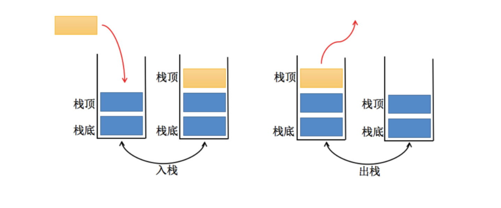

# JavaScript实现栈结构（Stack）


> **常见的数据结构：**
>
> - **数组**（Aarray）
>
> - **栈**（Stack）
>
> - **链表**（Linked List）
>
> - **图**（Graph）
>
> - **散列表**（Hash）
>
> - **队列**（Queue）
>
> - **树**（Tree）
>
> - **堆**（Heap）
>
>   **注意**：数据结构与算法与语言无关，常见的编程语言都有**直接或间接**的使用上述常见的数据结构。
>
>   #### 什么是算法？
>
>   算法（Algorithm）的定义
>
>   - 一个有限指令集，每条指令的描述不依赖于语言；
>   - 接收一些输入（有些情况下不需要输入）；
>   - 产生输入；
>   - 一定在有限步骤之后终止；
>
>   算法通俗理解：解决问题的办法/步骤逻辑。数据结构的实现，离不开算法。


# 栈结构（Stack）

> 数组是一个线性结构，并且可以在数组的**任意位置**插入和删除元素。而**栈和队列**就是比较常见的**受限的线性结构**。栈的特点为**先进后出，后进先出**（LIFO：last in first out）。
>
> **程序中的栈结构：**
>
> - **函数调用栈**：A（B（C（D（））））：即A函数中调用B，B调用C，C调用D；在A执行的过程中会将A压入栈，随后B执行时B也被压入栈，函数C和D执行时也会被压入栈。所以当前栈的顺序为：A->B->C->D（栈顶）；函数D执行完之后，会弹出栈被释放，弹出栈的顺序为D->C->B->A;
> - **递归**：为什么没有停止条件的递归会造成栈溢出？比如函数A为递归函数，不断地调用自己（因为函数还没有执行完，不会把函数弹出栈），不停地把相同的函数A压入栈，最后造成**栈溢出**（Stack Overfloat）




**栈常见的操作：**

- push（element）：添加一个新元素到栈顶位置，O(1)
- pop（）：移除栈顶的元素，同时返回被移除的元素 O(1)
- peek（）：返回栈顶的元素，不对栈做任何修改（该方法不会移除栈顶的元素，仅仅返回它）；
- isEmpty（）：如果栈里没有任何元素就返回true，否则返回false O(1)
- size（）：返回栈里的元素个数。这个方法和数组的length属性类似；
- toString（）：将栈结构的内容以字符串的形式返回。


```js
class Stack {
  items = []

 // 添加一个新元素到栈顶位置；
  push(item) {
   return this.items.push(item)
  }
 // 移除栈顶的元素，同时返回被移除的元素；
  pop() {
    return this.items.pop()
  }
	// 返回栈顶的元素，不对栈做任何修改（该方法不会移除栈顶的元素，仅仅返回它）
  peek() {
    return this.items[this.items.length - 1]
  }
	// 如果栈里没有任何元素就返回true，否则返回false；
  isEmpty() {
    return this.items.length === 0
  }
	// 返回栈里的元素个数。这个方法和数组的length属性类似；
  size() {
    return this.items.length
  }
	// 将栈结构的内容以字符串的形式返回。
	toString() {
	        console.log(this.items, 'items')
	        return this.items.join(' ')
	      }
	 }

 let s = new Stack()
console.log(s.push('abc')) // ["abc"]
console.log(s.push('cbc')) // ["abc", "cbc"]
console.log(s.push('nba')) // ["abc", "cbc", "nba"]
console.log(s.pop(), 'pop') //  nba pop
console.log(s.toString(), 'toString') // abc cbc toString
console.log(s.peek(), 'peek') // cbc peek
console.log(s.isEmpty(), 'isEmpty') // false "isEmpty"
console.log(s.size(), 'size') // 2 "size"
```

### [394. 字符串解码](https://leetcode-cn.com/problems/decode-string/)

#### 题目描述

```
给定一个经过编码的字符串，返回它解码后的字符串。

编码规则为: k[encoded_string]，表示其中方括号内部的 encoded_string 正好重复 k 次。注意 k 保证为正整数。

你可以认为输入字符串总是有效的；输入字符串中没有额外的空格，且输入的方括号总是符合格式要求的。

此外，你可以认为原始数据不包含数字，所有的数字只表示重复的次数 k ，例如不会出现像 3a 或 2[4] 的输入。

示例 1：
输入：s = "3[a]2[bc]"
输出："aaabcbc"

示例 2：
输入：s = "3[a2[c]]"
输出："accaccacc"

示例 3：
输入：s = "2[abc]3[cd]ef"
输出："abcabccdcdcdef"

示例 4：
输入：s = "abc3[cd]xyz"
输出："abccdcdcdxyz"
```

#### 题解

##### 题解1

使用栈结构来解决问题，当数字，[,字符串都进去入栈 当 ] 进行出栈，出栈

<details>   
  <summary>点击展开</summary>   
 <pre><blockcode>
function decodeString(S) {
  let stack = []
  let num = ''
  for (const s of S) {
    if (!isNaN(s)) {
      num += s
      continue
    }
    if (num) {
      stack.push(num)
      num = ''
    }
    if (s !== ']') {
      stack.push(s)
      continue
    } else if (s === ']') {
      let str = ''
      while (stack.length && stack.slice(-1)[0] !== '[') {
        let lastEle = stack.pop()
        console.log(lastEle)
        str = lastEle + str
      }
      stack.pop() 
      let num = +stack.pop()
      stack.push(str.repeat(num))
    }
  }
  console.log(stack, 'stack')
  return stack.join('')
}
</blockcode></pre>
 <pre><blockcode>
执行用时：80 ms, 在所有 JavaScript 提交中击败了32.18%的用户 O(N)
内存消耗：37.7 MB, 在所有 JavaScript 提交中击败了39.22%的用户 O(N)
</blockcode></pre>
</details>   

##### 题解2 

递归解决


### [150. 逆波兰表达式求值](https://github.com/azl397985856/leetcode/blob/master/problems/150.evaluate-reverse-polish-notation.md)

- 
- 
- [1381. 设计一个支持增量操作的栈](https://leetcode-cn.com/problems/design-a-stack-with-increment-operation/)
- 
- [946. 验证栈序列](https://leetcode-cn.com/problems/validate-stack-sequences/)

另外还有[两个计算器的题目](https://mp.weixin.qq.com/s?__biz=MzI4MzUxNjI3OA==&mid=2247486874&idx=2&sn=3f42546c132983bf22828a99b1c6e7b4&chksm=eb88c183dcff48956d97d1b67e8d070b9561be26f66006773d153457494ca8c43db73a8e7343&token=1469603194&lang=zh_CN#rd)也值得练习。

