# JavaScript 实现树结构

### 一、树结构简介

#### 1.1.简单了解树结构

**什么是树？**

真实的树：


**树的特点：**

- 树一般都有一个**根**，连接着根的是**树干**；
- 树干会发生分叉，形成许多**树枝**，树枝会继续分化成更小的**树枝**；
- 树枝的最后是**叶子**；

现实生活中很多结构都是树的抽象，模拟的树结构相当于旋转`180°`的树。

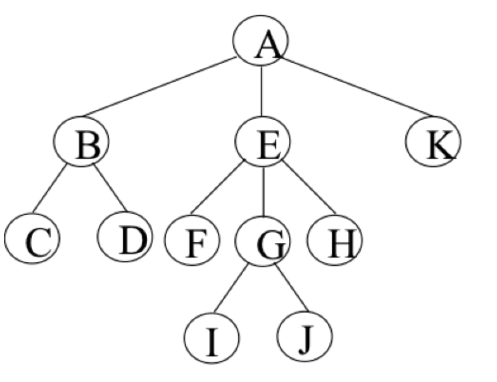

**树结构对比于数组/链表/哈希表有哪些优势呢：**

**数组：**

- 优点：可以通过**下标值访问**，效率高；
- 缺点：查找数据时需要先对数据进行**排序**，生成**有序数组**，才能提高查找效率；并且在插入和删除元素时，需要大量的**位移操作**；

**链表：**

- 优点：数据的插入和删除操作效率都很高；
- 缺点：**查找**效率低，需要从头开始依次查找，直到找到目标数据为止；当需要在链表中间位置插入或删除数据时，插入或删除的效率都不高。

**哈希表：**

- 优点：哈希表的插入/查询/删除效率都非常高；
- 缺点：**空间利用率不高**，底层使用的数组中很多单元没有被利用；并且哈希表中的元素是**无序**的，不能按照固定顺序遍历哈希表中的元素；而且不能快速找出哈希表中**最大值或最小值**这些特殊值。

**树结构：**

优点：树结构综合了上述三种结构的优点，同时也弥补了它们存在的缺点（虽然效率不一定都比它们高），比如树结构中数据都是有序的，查找效率高；空间利用率高；并且可以快速获取最大值和最小值等。

总的来说：**每种数据结构都有自己特定的应用场景**

**树结构：**

- **树（Tree）**:由 n（n ≥ 0）个节点构成的**有限集合**。当 n = 0 时，称为**空树**。

对于任一棵非空树（n > 0），它具备以下性质：

- 数中有一个称为**根（Root）**的特殊节点，用 **r **表示；
- 其余节点可分为 m（m > 0）个互不相交的有限集合 T1，T2，...，Tm，其中每个集合本身又是一棵树，称为原来树的**子树（SubTree）**。

**树的常用术语：**

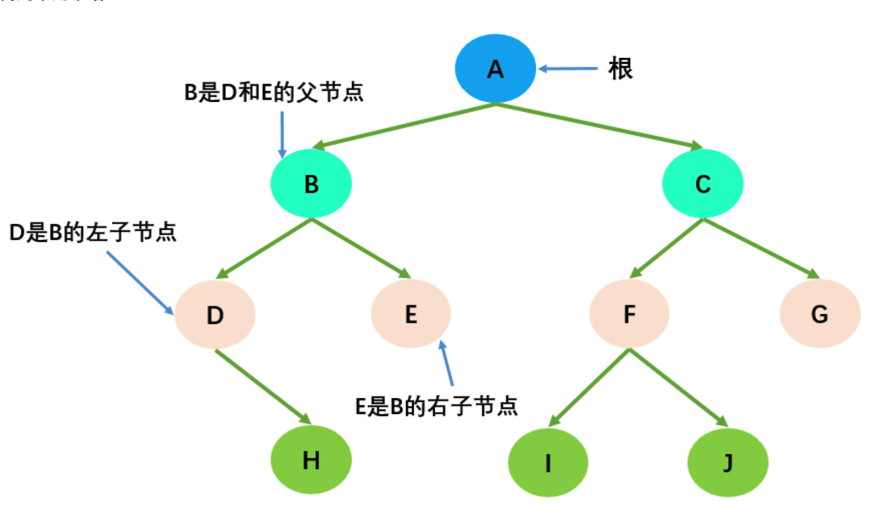

- **节点的度（Degree）**：节点的**子树个数**，比如节点 B 的度为 2；
- **树的度**：树的所有节点中**最大的度数**，如上图树的度为 2；
- **叶节点（Leaf）**：**度为 0 的节点**（也称为叶子节点），如上图的 H，I 等；
- **父节点（Parent）**：度不为 0 的节点称为父节点，如上图节点 B 是节点 D 和 E 的父节点；
- **子节点（Child）**：若 B 是 D 的父节点，那么 D 就是 B 的子节点；
- **兄弟节点（Sibling）**：具有同一父节点的各节点彼此是兄弟节点，比如上图的 B 和 C，D 和 E 互为兄弟节点；
- **路径和路径长度**：路径指的是一个节点到另一节点的通道，路径所包含边的个数称为路径长度，比如 A->H 的路径长度为 3；
- **节点的层次（Level）**：规定**根节点在 1 层**，其他任一节点的层数是其父节点的**层数加 1**。如 B 和 C 节点的层次为 2；
- **树的深度（Depth）**：树种所有节点中的**最大层次**是这棵树的深度，如上图树的深度为 4；

#### 1.2.树结构的表示方式

- **最普通的表示方法**：

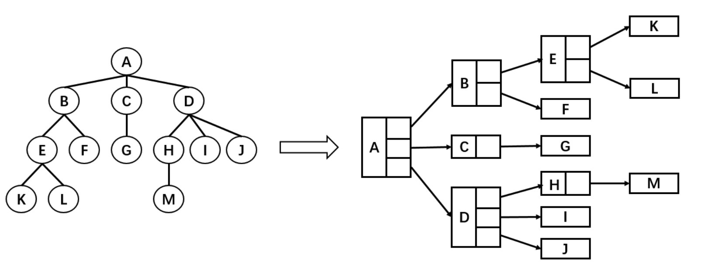

如图，树结构的组成方式类似于链表，都是由一个个节点连接构成。不过，根据每个父节点子节点数量的不同，每一个父节点需要的引用数量也不同。比如节点 A 需要 3 个引用，分别指向子节点 B，C，D；B 节点需要 2 个引用，分别指向子节点 E 和 F；K 节点由于没有子节点，所以不需要引用。

这种方法缺点在于我们无法确定某一结点的引用数。

- **儿子-兄弟表示法**：

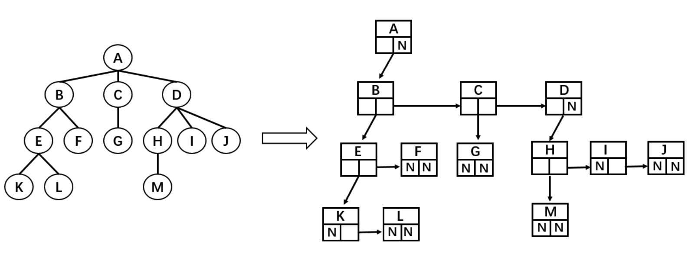

这种表示方法可以完整地记录每个节点的数据，比如：

```js
//节点A
Node{
  //存储数据
  this.data = data
  //统一只记录左边的子节点
  this.leftChild = B
  //统一只记录右边的第一个兄弟节点
  this.rightSibling = null
}

//节点B
Node{
  this.data = data
  this.leftChild = E
  this.rightSibling = C
}

//节点F
Node{
  this.data = data
  this.leftChild = null
  this.rightSibling = null
}
```

这种表示法的优点在于每一个节点中引用的数量都是确定的。

- **儿子-兄弟表示法旋转**

以下为儿子-兄弟表示法组成的树结构：

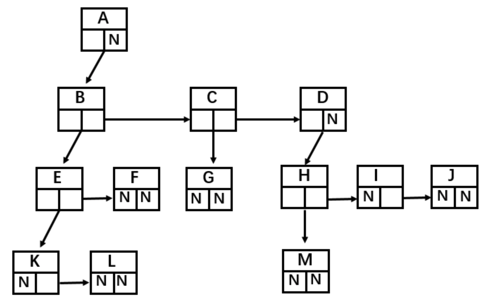

将其顺时针旋转 45° 之后：

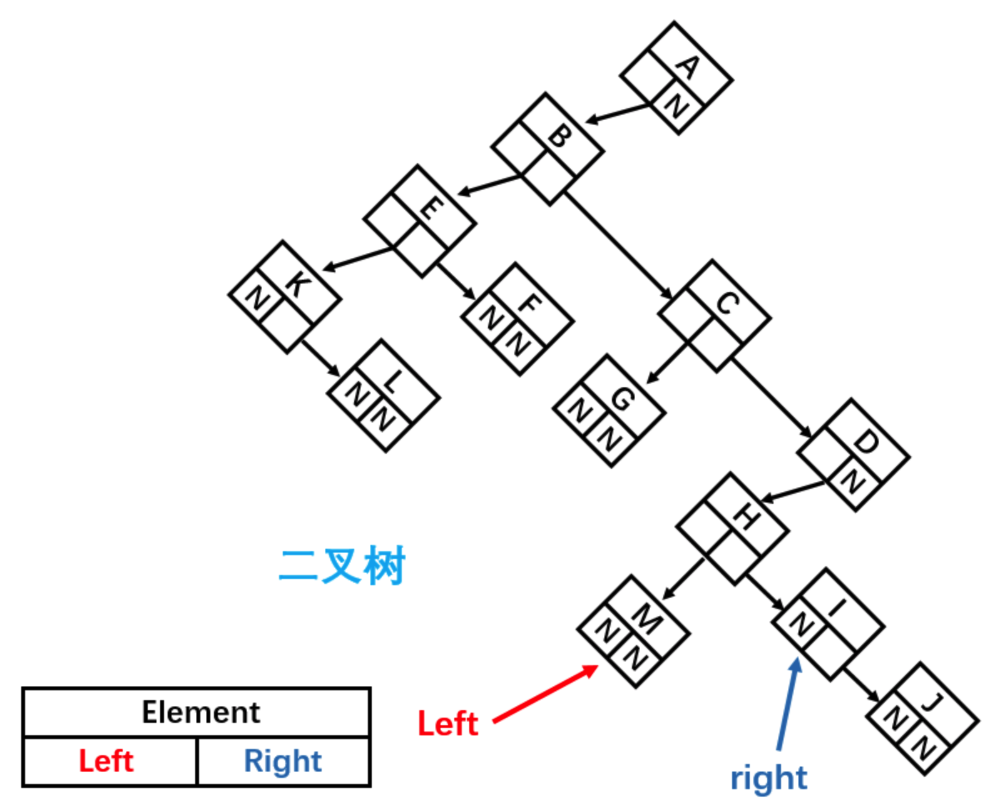

这样就成为了一棵**二叉树**，由此我们可以得出结论：**任何树都可以通过二叉树进行模拟**。但是这样父节点不是变了吗？其实，父节点的设置只是为了方便指向子节点，在代码实现中谁是父节点并没有关系，只要能正确找到对应节点即可。

### 二、二叉树

#### 2.1.二叉树简介

**二叉树的概念**：如果树中的每一个节点最多只能由**两个子节点**，这样的树就称为**二叉树**；

二叉树十分重要，不仅仅是因为简单，更是因为几乎所有的树都可以表示成二叉树形式。

**二叉树的组成**：

- 二叉树可以为空，也就是没有节点；
- 若二叉树不为空，则它由根节点和称为其左子树 TL 和右子树 TR 的两个不相交的二叉树组成；

**二叉树的五种形态**

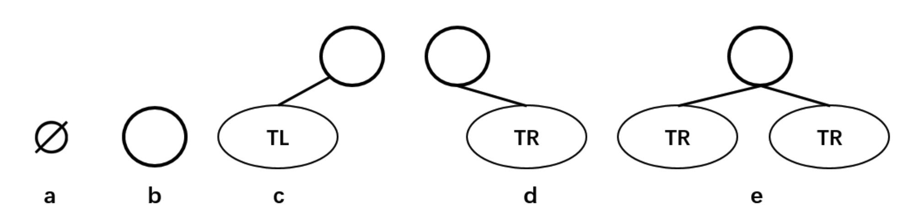

上图分别表示：空的二叉树、只有一个节点的二叉树、只有左子树 TL 的二叉树、只有右子树 TR 的二叉树和有左右两个子树的二叉树。

**二叉树的特性**：

- 一个二叉树的第 i 层的最大节点树为：2(i-1)，i >= 1；
- 深度为 k 的二叉树的最大节点总数为：2k - 1 ，k >= 1；
- 对任何非空二叉树，若 n0 表示叶子节点的个数，n2 表示度为 2 的非叶子节点个数，那么两者满足关系：n0 = n2 + 1；如下图所示：H，E，I，J，G 为叶子节点，总数为 5；A，B，C，F 为度为 2 的非叶子节点，总数为 4；满足 n0 = n2 + 1 的规律。
- 2.2.特殊的二叉树

  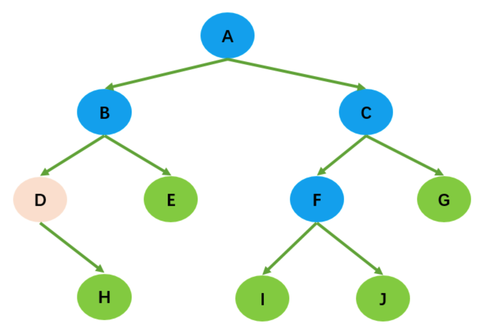

**完美二叉树**

完美二叉树（Perfect Binary Tree）也成为满二叉树（Full Binary Tree），在二叉树中，除了最下一层的叶子节点外，每层节点都有 2 个子节点，这就构成了完美二叉树

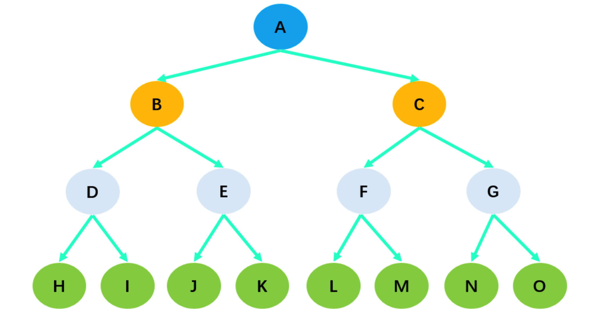

**完全二叉树**

完全二叉树（Complete Binary Tree）:

- 除了二叉树最后一层外，其他各层的节点数都达到了最大值；
- 并且，最后一层的叶子节点从左向右是连续存在，只缺失右侧若干叶子节点；
- 完美二叉树是特殊的完全二叉树；

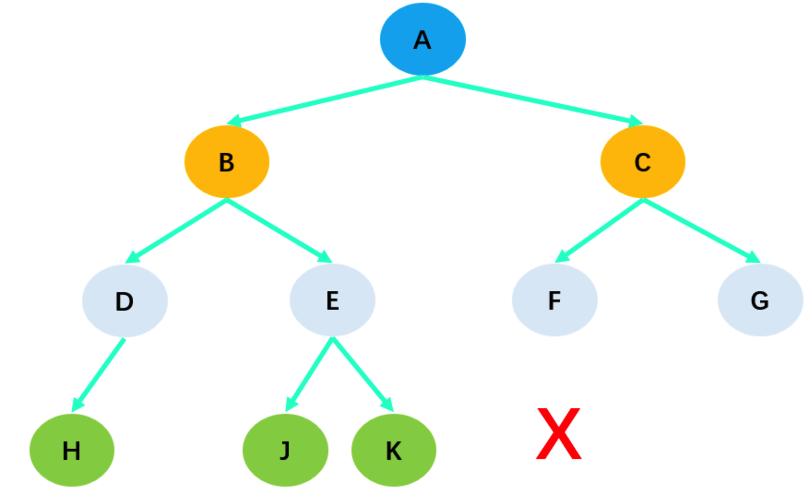

在上图中，由于 H 缺失了右子节点，所以它不是完全二叉树。

#### 2.3.二叉树的数据存储

常见的二叉树存储方式为**数组**和**链表**：

**使用数组：**

- **完全二叉树**：按从上到下，从左到右的方式存储数据。

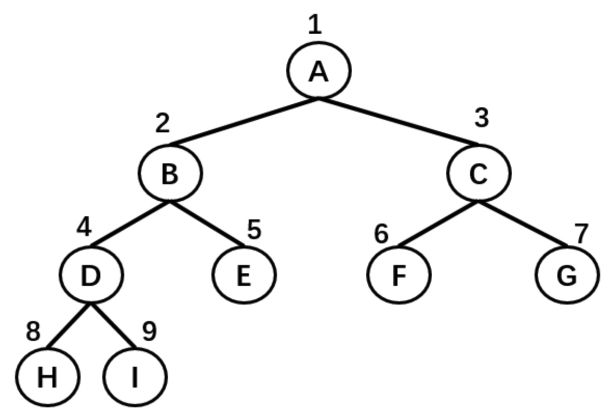

| 节点     | A     | B     | C     | D     | E     | F     | G     | H     |
| -------- | ----- | ----- | ----- | ----- | ----- | ----- | ----- | ----- |
| **序号** | **1** | **2** | **3** | **4** | **5** | **6** | **7** | **8** |

使用数组存储时，取数据的时候也十分方便：左子节点的序号等于父节点序号 _ 2，右子节点的序号等于父节点序号 _ 2 + 1 。

- **非完全二叉树**：非完全二叉树需要转换成完全二叉树才能按照上面的方案存储，这样会浪费很大的存储空间。

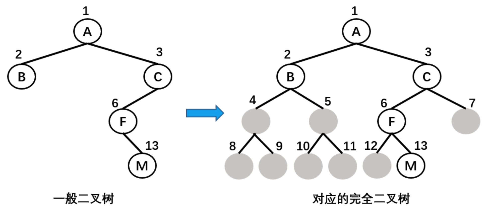

| 节点     | A     | B     | C     | ^     | ^     | F     | ^     | ^     | ^     | ^      | ^      | ^      | M      |
| -------- | ----- | ----- | ----- | ----- | ----- | ----- | ----- | ----- | ----- | ------ | ------ | ------ | ------ |
| **序号** | **1** | **2** | **3** | **4** | **5** | **6** | **7** | **8** | **9** | **10** | **11** | **12** | **13** |

**使用链表**

二叉树最常见的存储方式为**链表**：每一个节点封装成一个 Node，Node 中包含存储的数据、左节点的引用和右节点的引用。

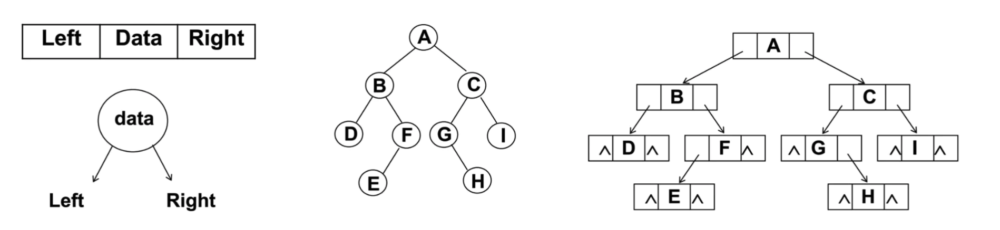

### 三、二叉搜索树

#### 3.1.认识二叉搜索树

**二叉搜索树**（**BST**，Binary Search Tree），也称为**二叉排序树**和**二叉查找树**。

二叉搜索树是一棵二叉树，可以为空；

如果不为空，则满足以下**性质**：

- 条件 1：非空左子树的**所有**键值**小于**其根节点的键值。比如三中节点 6 的所有非空左子树的键值都小于 6；
- 条件 2：非空右子树的**所有**键值**大于**其根节点的键值；比如三中节点 6 的所有非空右子树的键值都大于 6；
- 条件 3：左、右子树本身也都是二叉搜索树；

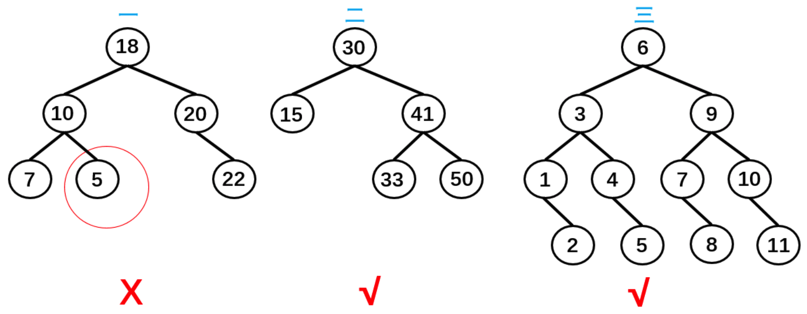

如上图所示，树二和树三符合 3 个条件属于二叉树，树一不满足条件 3 所以不是二叉树。

**总结：**二叉搜索树的特点主要是**较小的值**总是保存在**左节点**上，相对**较大的值**总是保存在**右节点**上。这种特点使得二叉搜索树的查询效率非常高，这也就是二叉搜索树中"搜索"的来源。

#### 3.2.二叉搜索树应用举例

下面是一个二叉搜索树：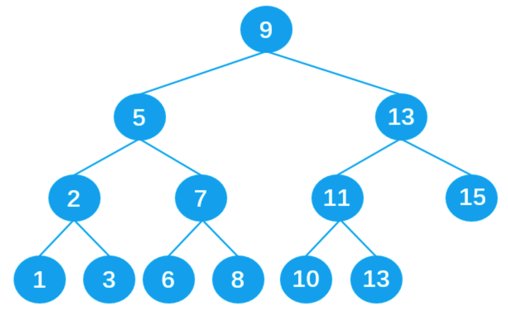


若想在其中查找数据 10，只需要查找 4 次，查找效率非常高。

- 第 1 次：将 10 与根节点 9 进行比较，由于 10 > 9，所以 10 下一步与根节点 9 的右子节点 13 比较；
- 第 2 次：由于 10 < 13，所以 10 下一步与父节点 13 的左子节点 11 比较；
- 第 3 次：由于 10 < 11，所以 10 下一步与父节点 11 的左子节点 10 比较；
- 第 4 次：由于 10 = 10，最终查找到数据 10 。

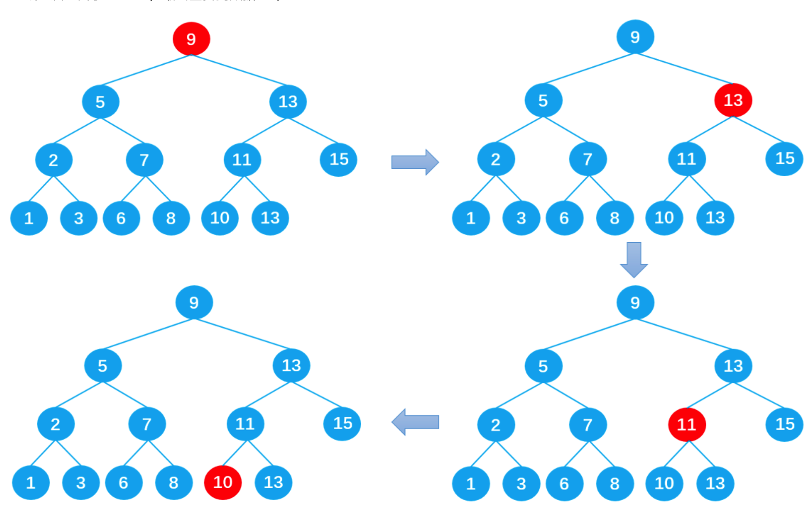

同样是 15 个数据，在排序好的数组中查询数据 10，需要查询 10 次：

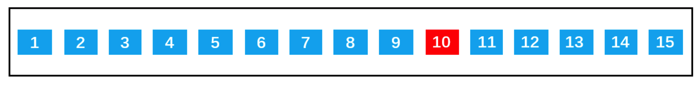

其实：如果是排序好的数组，可以通过二分查找：第一次找 9，第二次找 13，第三次找 15...。我们发现如果把每次二分的数据拿出来以树的形式表示的话就是**二叉搜索树**。这就是数组二分法查找效率之所以高的原因。

### 二叉搜索树的常见操作：

- `insert(key)` 向树中插入一个新的键。
- `search(key)` 在树中查找一个键，如果节点存在，则返回 true；如果不存在，则返回 `false`。
- `preOrderTraverse` 通过先序遍历方式遍历所有节点。
- `inOrderTraverse` 通过中序遍历方式遍历所有节点。
- `postOrderTraverse` 通过后序遍历方式遍历所有节点。
- `min` 返回树中最小的值/键。
- `max` 返回树中最大的值/键。
- `remove(key)` 从树中移除某个键。

#### 遍历二叉树

##### 先序遍历

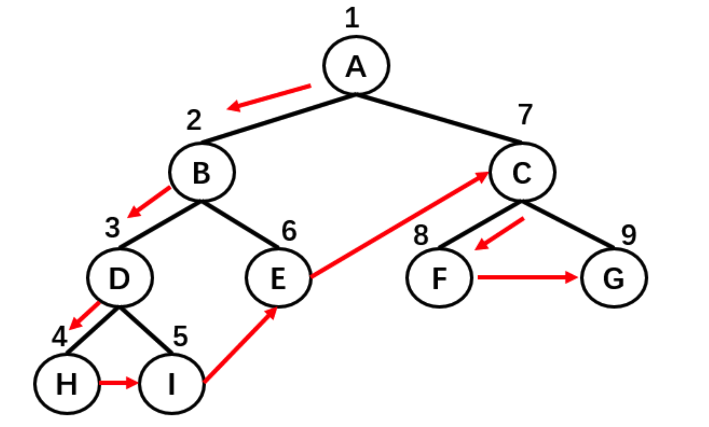

##### 中序遍历

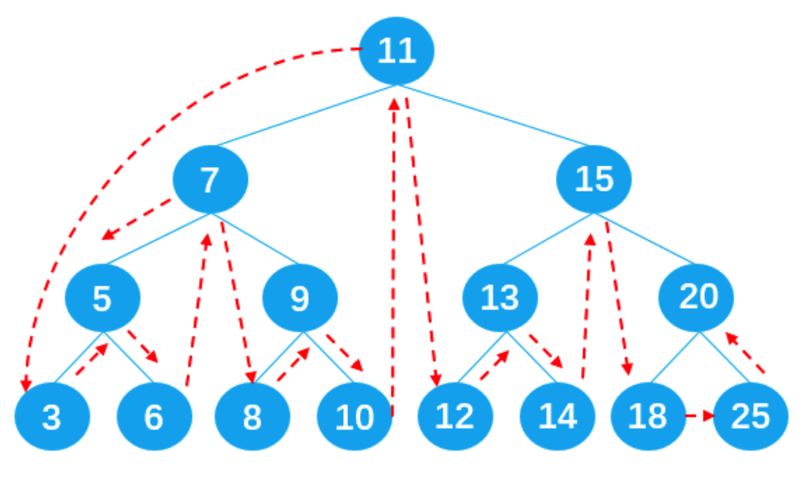

##### 后序遍历

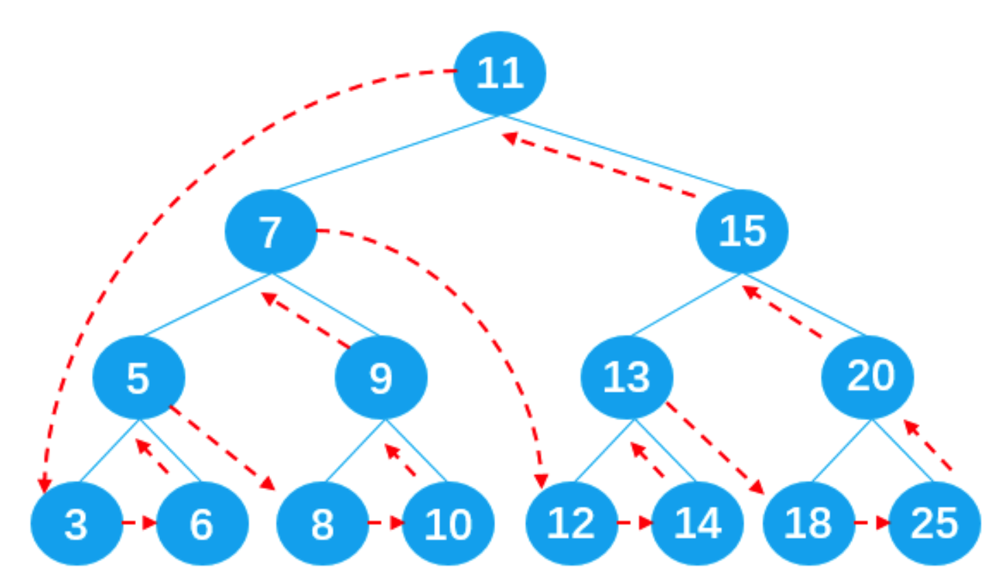

#### 删除数据

实现思路：

第一步：先找到需要删除的节点，若没找到，则不需要删除；

首先定义变量 current 用于保存需要删除的节点、变量 parent 用于保存它的父节点、变量 isLeftChild 保存 current 是否为 parent 的左节点，这样方便之后删除节点时改变相关节点的指向。

```js
let currentNode = this.root;
let parentNode = null;
let isLeftChild = true;

// 循环查找到要删除的节点 currentNode，以及它的 parentNode、isLeftChild
while (currentNode.key !== key) {
  parentNode = currentNode;

  // 小于，往左查找
  if (key < currentNode.key) {
    isLeftChild = true;
    currentNode = currentNode.left;
  } else {
    // 否则往右查找
    isLeftChild = false;
    currentNode = currentNode.right;
  }

  // 找到最后都没找到相等的节点，返回 false
  if (currentNode === null) {
    return false;
  }
}
```

第二步：删除找到的指定节点，后分 3 种情况：

- 删除的是叶子节点；
- 删除的是只有一个子节点的节点；
- 删除的是有两个子节点的节点；

##### 删除的是叶子节点

删除的是叶子节点分两种情况：

- 叶子节点也是根节点

  当该叶子节点为根节点时，如下图所示，此时 current == this.root，直接通过：this.root = null，删除根节点。

  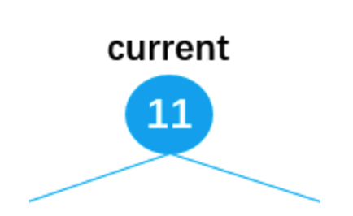

  叶子节点不为根节点

  当该叶子节点不为根节点时也有两种情况，如下图所示

  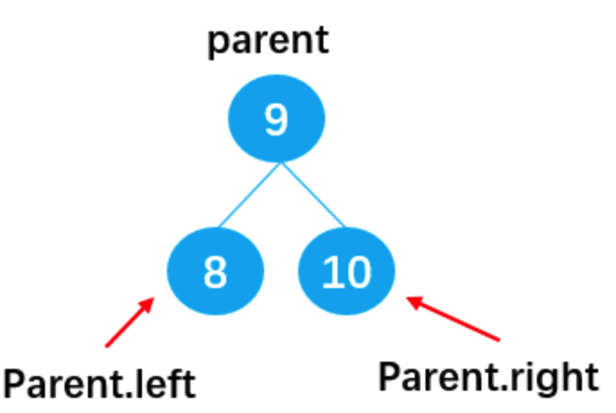

  若 current = 8，可以通过：parent.left = null，删除节点 8；

  若 current = 10，可以通过：parent.right = null，删除节点 10；

  代码实现：

  ```
  // 1、删除的是叶子节点的情况
  if (currentNode.left === null && currentNode.right === null) {
    if (currentNode === this.root) {
      this.root = null;
    } else if (isLeftChild) {
      parentNode.left = null;
    } else {
      parentNode.right = null;
    }
  
    // 2、删除的是只有一个子节点的节点
  }
  ```

##### 删除的是只有一个子节点的节点

有六种情况：

当 current 存在左子节点时（current.right == null）：

- 情况 1：current 为根节点（current == this.root），如节点 11，此时通过：this.root = current.left，删除根节点 11；
- 情况 2：current 为父节点 parent 的左子节点（isLeftChild == true），如节点 5，此时通过：parent.left = current.left，删除节点 5；
- 情况 3：current 为父节点 parent 的右子节点（isLeftChild == false），如节点 9，此时通过：parent.right = current.left，删除节点 9；

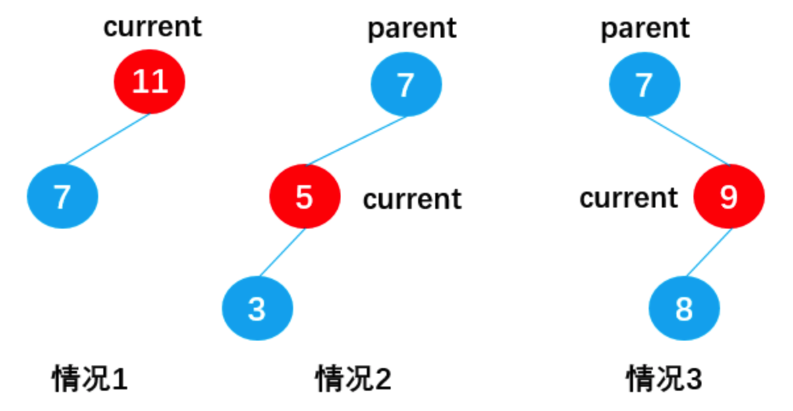

当 current 存在右子节点时（current.left = null）：

- 情况 4：current 为根节点（current == this.root），如节点 11，此时通过：this.root = current.right，删除根节点 11。
- 情况 5：current 为父节点 parent 的左子节点（isLeftChild == true），如节点 5，此时通过：parent.left = current.right，删除节点 5；
- 情况 6：current 为父节点 parent 的右子节点（isLeftChild == false），如节点 9，此时通过：parent.right = current.right，删除节点 9；

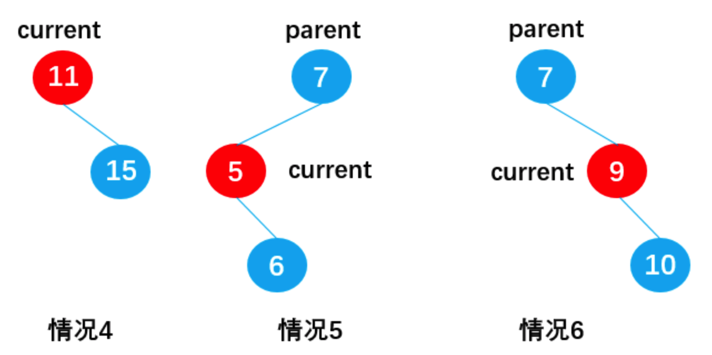

代码实现：

```
// 2、删除的是只有一个子节点的节点
} else if (currentNode.right === null) { // currentNode 只存在左节点
  //-- 2.1、currentNode 只存在<左节点>的情况
  //---- 2.1.1、currentNode 等于 root
  //---- 2.1.2、parentNode.left 等于 currentNode
  //---- 2.1.3、parentNode.right 等于 currentNode

  if (currentNode === this.root) {
    this.root = currentNode.left;
  } else if (isLeftChild) {
    parentNode.left = currentNode.left;
  } else {
    parentNode.right = currentNode.left;
  }

} else if (currentNode.left === null) { // currentNode 只存在右节点
  //-- 2.2、currentNode 只存在<右节点>的情况
  //---- 2.1.1 currentNode 等于 root
  //---- 2.1.1 parentNode.left 等于 currentNode
  //---- 2.1.1 parentNode.right 等于 currentNode

  if (currentNode === this.root) {
    this.root = currentNode.right;
  } else if (isLeftChild) {
    parentNode.left = currentNode.right;
  } else {
    parentNode.right = currentNode.right;
  }
```

##### 删除的是有两个子节点的节点

这种情况十分复杂，首先依据以下二叉搜索树，讨论这样的问题：

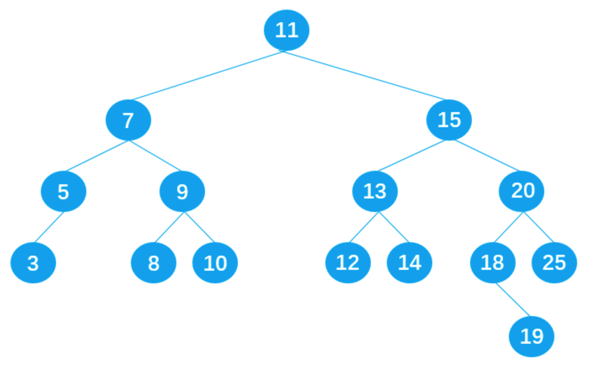

**删除节点 9**

在保证删除节点 9 后原二叉树仍为二叉搜索树的前提下，有两种方式：

- 方式 1：从节点 9 的左子树中选择一合适的节点替代节点 9，可知节点 8 符合要求；
- 方式 2：从节点 9 的右子树中选择一合适的节点替代节点 9，可知节点 10 符合要求；

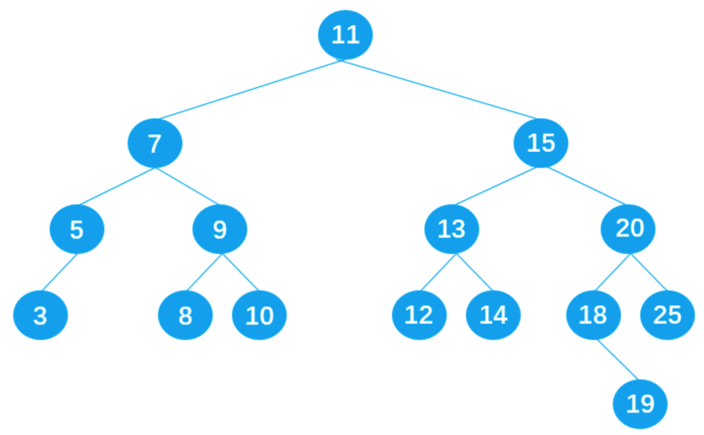

**删除节点 7**

在保证删除节点 7 后原二叉树仍为二叉搜索树的前提下，也有两种方式：

- 方式 1：从节点 7 的左子树中选择一合适的节点替代节点 7，可知节点 5 符合要求；
- 方式 2：从节点 7 的右子树中选择一合适的节点替代节点 7，可知节点 8 符合要求；

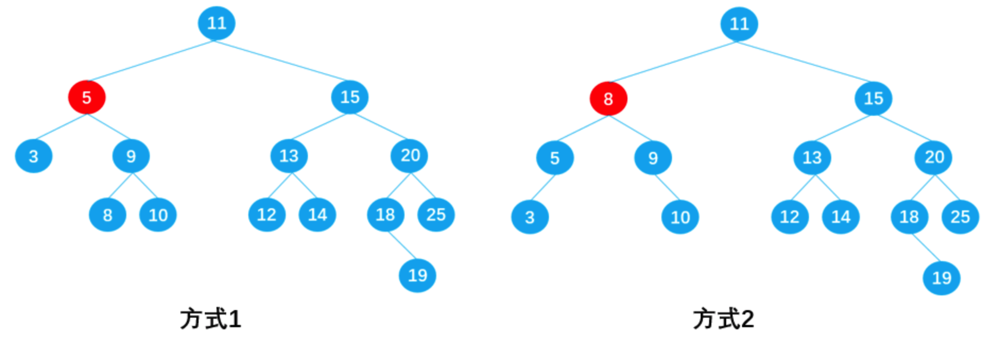

**删除节点 15**

在保证删除节点 15 后原树二叉树仍为二叉搜索树的前提下，同样有两种方式：

- 方式 1：从节点 15 的左子树中选择一合适的节点替代节点 15，可知节点 14 符合要求；
- 方式 2：从节点 15 的右子树中选择一合适的节点替代节点 15，可知节点 18 符合要求；

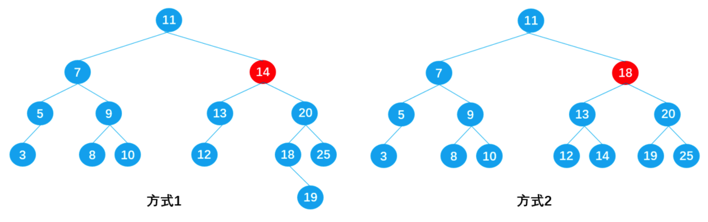

相信你已经发现其中的规律了！

规律总结：如果要删除的节点有两个子节点，甚至子节点还有子节点，这种情况下需要从要删除节点下面的子节点中找到一个合适的节点，来替换当前的节点。

若用 current 表示需要删除的节点，则合适的节点指的是：

- current 左子树中比 current 小一点点的节点，即 current 左子树中的最大值；
- current 右子树中比 current 大一点点的节点，即 current 右子树中的最小值；

###### 前驱&后继

在二叉搜索树中，这两个特殊的节点有特殊的名字：

- 比 current 小一点点的节点，称为 current 节点的前驱。比如下图中的节点 5 就是节点 7 的前驱；
- 比 current 大一点点的节点，称为 current 节点的后继。比如下图中的节点 8 就是节点 7 的后继；

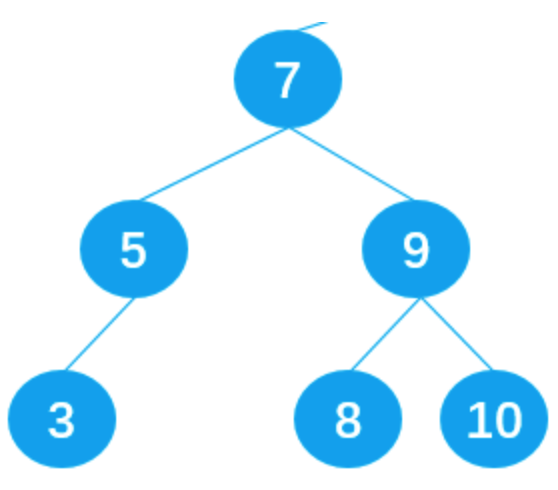

查找需要被删除的节点 current 的后继时，需要在 current 的右子树中查找最小值，即在 current 的右子树中一直向左遍历查找；

查找前驱时，则需要在 current 的左子树中查找最大值，即在 current 的左子树中一直向右遍历查找。

下面只讨论查找 current 后继的情况，查找前驱的原理相同，这里暂不讨论。

代码实现：

```js
  // 3、删除的是有两个子节点的节点
  } else {

    // 1、找到后续节点
    let successor = this.getSuccessor(currentNode);

    // 2、判断是否为根节点
    if (currentNode === this.root) {
      this.root = successor;
    } else if (isLeftChild) {
      parentNode.left = successor;
    } else {
      parentNode.right = successor;
    }

    // 3、将后续的左节点改为被删除的左节点
    successor.left = currentNode.left;
  }
}

// 获取后续节点，即从要删除的节点的右边开始查找最小的值
getSuccessor(delNode) {

  // 定义变量，保存要找到的后续
  let successor = delNode;
  let current = delNode.right;
  let successorParent = delNode;

  // 循环查找 current 的右子树节点
  while (current !== null) {
    successorParent = successor;
    successor = current;
    current = current.left;
  }

  // 判断寻找到的后续节点是否直接就是要删除节点的 right
  if (successor !== delNode.right) {
    successorParent.left = successor.right;
    successor.right = delNode.right;
  }
  return successor;
}
```

#### 完整实现

```js
class Node {
  constructor(key) {
    this.key = key;
    this.left = null;
    this.right = null;
  }
}

class Tree {
  root = null;

  // 向树中插入一个新的键。
  insert(key) {
    let node = new Node(key);
    // 情况1:当是一颗空树的时候，就直接插入root
    if (this.root === null) {
      this.root = node;
    } else {
      // 其他情况交给递归处理
      // 情况2:插入左子树或者右子树
      insertNode(key, this.root);
    }
    // 寻找插入的节点
    function insertNode(key, current) {
      // 如果小于current，那么就要在左子树找
      if (key < current.key) {
        // 当在左子树找不到的时候就应该插入
        if (current.left === null) {
          current.left = node;
          return;
        } else {
          // 其他情况看需要在下一层继续判断，那么就是递归函数重新判断
          insertNode(key, current.left);
        }
      } else {
        // 如果大于current，那么就要在右子树找
        if (current.right === null) {
          current.right = node;
          return;
        } else {
          insertNode(key, current.right);
        }
      }
    }
  }
  // 通过先序遍历方式遍历所有节点。
  preOrderTraverse() {
    let result = [];
    preorderTraversalNode(this.root, result);
    return result.join();
    function preorderTraversalNode(current, result) {
      // 如果当前current为null 则返回
      if (current === null) return null;
      result.push(current.key);
      preorderTraversalNode(current.left, result);
      preorderTraversalNode(current.right, result);
    }
  }

  // 通过中序遍历方式遍历所有节点。
  inOrderTraverse() {
    let result = [];
    inOrderTraversalNode(this.root, result);
    return result.join();
    function inOrderTraversalNode(current, result) {
      // 如果当前current为null 则返回
      if (current === null) return null;
      inOrderTraversalNode(current.left, result);
      result.push(current.key);
      inOrderTraversalNode(current.right, result);
    }
  }
  // 通过后序遍历方式遍历所有节点。
  postOrderTraverse() {
    let result = [];
    postOrderTraversalNode(this.root, result);
    return result.join();
    function postOrderTraversalNode(current, result) {
      // 如果当前current为null 则返回
      if (current === null) return null;
      postOrderTraversalNode(current.left, result);
      postOrderTraversalNode(current.right, result);
      result.push(current.key);
    }
  }

  // 返回树中最小的值/键。
  min() {
    let current = this.root;
    if (current === null) return null;
    while (current.left !== null) {
      current = current.left;
    }
    return current.key;
  }
  // 返回树中最大的值/键。
  max() {
    let current = this.root;
    if (current === null) return null;
    while (current.right !== null) {
      current = current.right;
    }
    return current.key;
  }

  // 在树中查找一个键，如果节点存在，则返回 true；如果不存在，则返回 false。
  search(key) {
    // debugger
    let current = this.root;
    if (current === null) return false;
    while (current !== null) {
      if (key < current.key) {
        current = current.left;
      } else if (key > current.key) {
        current = current.right;
      } else {
        return true;
      }
    }
    return false;
  }

  // 从树中移除某个键。
  remove(key) {
    // 1.第一步：先找到需要删除的节点，若没找到，则不需要删除；
    // 首先定义变量 current 用于保存需要删除的节点、
    // parent 用于保存它的父节点、
    // isLeftChild 保存 current 是否为 parent 的左节点，这样方便之后删除节点时改变相关节点的指向。
    let current = this.root;
    let parent = null;
    let isLeftChild = false;

    while (current.key !== key) {
      // 左右查找
      parent = current;
      if (key > current.key) {
        current = current.right;
        isLeftChild = false;
      } else {
        current = current.left;
        isLeftChild = true;
      }

      // 证明查找完了
      if (current === null) return false;
    }
    console.log(current, "current");
    console.log(parent, "parent");
    console.log(isLeftChild, "isLeftChild");
    // 2.第二步：删除找到的指定节点，后分 3 种情况：
    // 2.1删除的是叶子节点；
    // 2.2删除的是只有一个子节点的节点；
    // 2.3删除的是有两个子节点的节点；

    // 2.1删除的是叶子节点； 3种情况
    if (current.left === null && current.right === null) {
      // 2.1.1 删除的是根节点，就是只有一个节点的树
      if (current === this.root) this.root = null;
      // 2.1.2 删除左节点
      else if (isLeftChild) parent.left = null;
      // 2.1.3 删除右节点
      else if (!isLeftChild) parent.right = null;
    }

    // 2.2删除的是只有一个子节点的节点；6种情况
    else if (current.left === null || current.right === null) {
      // 当current存在左子节点分3种情况
      // 情况 2.2.1 current 为根节点时
      if (current == this.root) this.root = current.left;
      // 情况2.2.2 parent的左节点为current
      else if (isLeftChild) parent.left = current.left;
      // 情况2.2.3 parent的有节点为current
      else if (!isLeftChild) parent.right = current.left;

      // 当currengt存在右节点也分3种情况
      // 情况2.2.4 当current为根节点
      if (current === this.root) this.root = current.right;
      // 情况2.2.5 当parent左节点为current
      else if (isLeftChild) parent.left = current.right;
      // 情况2.2.6 当parent右节点为current
      else if (!isLeftChild) parent.right = current.right;
    }

    // 2.3 删除两个节点都有的
    // 找出规律会很简单
    // 前驱：current.left的最大值
    // 后继：current.right的最小值
    else if (current.left && current.right) {
      let successor = getSuccessor(current); // 这里寻找的是后继，前驱大概思路差不多的
      console.log(successor, "successor");
      // 2、判断是否为根节点
      if (current === this.root) {
        this.root = successor;
      } else if (isLeftChild) {
        parent.left = successor;
      } else {
        parent.right = successor;
      }

      // 3、将后续的左节点改为被删除的左节点
      successor.left = current.left;

      // 获取tree的后继
      function getSuccessor(delNode) {
        let successor = delNode; // 后继
        let successorParent = null; // 后继的父节点
        let current = delNode.right; //
        while (current !== null) {
          successorParent = successor;
          successor = current;
          current = current.left; // 最小值肯定是在最左边
        }
        // 判断寻找到的后续节点是否直接就是要删除节点的 right
        if (successor !== delNode.right) {
          successorParent.left = successor.right;
          successor.right = delNode.right;
        }
        return successor;
      }
    }
  }
}
let t = new Tree();
t.insert(9);
t.insert(5);
t.insert(13);
t.insert(2);
t.insert(7);
t.insert(11);
t.insert(15);
t.insert(1);
t.insert(3);
t.insert(6);
t.insert(8);
t.insert(10);
// t.insert(12)
console.log(t.preOrderTraverse()); // 9,5,2,1,3,7,6,8,13,11,10,12,15
console.log(t.inOrderTraverse()); // 1,2,3,5,6,7,8,9,10,11,12,13,15
console.log(t.postOrderTraverse()); // 1,3,2,6,8,7,5,10,12,11,15,13,9
console.log(t.min(), "min");
console.log(t.max(), "max");
console.log(t.search(1), "search");
console.log(t.remove(11), "remove");
// console.log(t.remove(15), 'remove')
console.log(t.postOrderTraverse()); //
console.log(t);
```

## 平衡树

二叉搜索树的缺陷：当插入的数据是有序的数据，就会造成二叉搜索树的深度过大。比如原二叉搜索树由 11 7 15 组成，如下图所示：

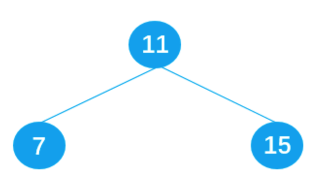

当插入一组有序数据：6 5 4 3 2 就会变成深度过大的搜索二叉树，会严重影响二叉搜索树的性能。

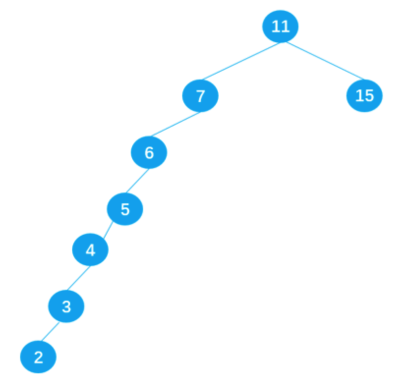

非平衡树

- 比较好的二叉搜索树，它的数据应该是左右均匀分布的。
- 但是插入连续数据后，二叉搜索树中的数据分布就变得不均匀了，我们称这种树为非平衡树。
- 对于一棵平衡二叉树来说，插入/查找等操作的效率是 O(log n)。
- 而对于一棵非平衡二叉树来说，相当于编写了一个链表，查找效率变成了 O(n)。

树的平衡性

为了能以较快的时间 O(log n)来操作一棵树，我们需要保证树总是平衡的：

- 起码大部分是平衡的，此时的时间复杂度也是接近 O(log n) 的；
- 这就要求树中每个节点左边的子孙节点的个数，应该尽可能地等于右边的子孙节点的个数；

常见的平衡树

- AVL 树：是最早的一种平衡树，它通过在每个节点多存储一个额外的数据来保持树的平衡。由于 AVL 树是平衡树，所以它的时间复杂度也是 O(log n)。但是它的整体效率不如红黑树，开发中比较少用。
- 红黑树：同样通过一些特性来保持树的平衡，时间复杂度也是 O(log n)。进行插入/删除等操作时，性能优于 AVL 树，所以平衡树的应用基本都是红黑树。


## 练习题目

### [104. 二叉树的最大深度](https://leetcode-cn.com/problems/maximum-depth-of-binary-tree/)

#### 题目描述

```
给定一个二叉树，找出其最大深度。

二叉树的深度为根节点到最远叶子节点的最长路径上的节点数。

说明: 叶子节点是指没有子节点的节点。

示例：
给定二叉树 [3,9,20,null,null,15,7]，

    3
   / \
  9  20
    /  \
   15   7
返回它的最大深度 3 。
```

#### 题解1

使用递归技巧加上计数实现

<details>   
  <summary>点击展开</summary>   
 <pre><blockcode>
/**
 * @param {TreeNode} root
 * @return {number}
 */
var maxDepth = function(root) {
    if(!root) return 0
    return Math.max( maxDepth(root.left),maxDepth(root.right) ) + 1
};
</blockcode></pre>
 <pre><blockcode>
时间复杂度 O(N)，原因是因为只走了递归的算法，然后每一个递归分开后，需要把这层调用栈的速度合在一起，所以是O(N)。
空间复杂度：O(h)，其中 h 为树的深度，最坏的情况 h 等于 N，其中 N 为节点数，此时树退化到链表。
</blockcode></pre>
</details>   


### [100. 相同的树](https://leetcode-cn.com/problems/same-tree/)

#### 题目描述

给你两棵二叉树的根节点 `p` 和 `q` ，编写一个函数来检验这两棵树是否相同。

如果两个树在结构上相同，并且节点具有相同的值，则认为它们是相同的。

 

**示例 1：**


```
输入：p = [1,2,3], q = [1,2,3]
输出：true
```

**示例 2：**


```
输入：p = [1,2], q = [1,null,2]
输出：false
```

**示例 3：**


```
输入：p = [1,2,1], q = [1,1,2]
输出：false
```

 

**提示：**

- 两棵树上的节点数目都在范围 `[0, 100]` 内
- `-104 <= Node.val <= 104`

#### 题解

题解1:

dfs递归两颗树，然后进行对比，然后对null处理。

```js
/**
 * Definition for a binary tree node.
 * function TreeNode(val, left, right) {
 *     this.val = (val===undefined ? 0 : val)
 *     this.left = (left===undefined ? null : left)
 *     this.right = (right===undefined ? null : right)
 * }
 */
/**
 * @param {TreeNode} p
 * @param {TreeNode} q
 * @return {boolean}
 */
var isSameTree = function(p, q) {
    if( p === null && q === null) return true
    else if( !p || !q) return false
    return dfs(p,q)

    function dfs(treeA,treeB){
        // 处理为null的情况
        // [2], null
        // null,null
        if (!treeA || !treeB) {
            return !treeA && !treeB;
        }

        // 值相等，递归左右子树
        if(  treeA.val === treeB.val ){
            let flagLeft = dfs(treeA.left,treeB.left)
            let flagRight = dfs(treeA.right,treeB.right)
            return flagLeft && flagRight
        }else{
            return false
        }
    }
};


var isSameTree = function(treeA, treeB) {
        // 处理为null的情况
        // [2], null
        // null,null
        if (!treeA || !treeB) {
            return !treeA && !treeB;
        }

        // 值相等，递归左右子树
        if(  treeA.val === treeB.val ){
            let flagLeft = isSameTree(treeA.left,treeB.left)
            let flagRight = isSameTree(treeA.right,treeB.right)
            return flagLeft && flagRight
        }else{
            return false
        }
};

时间复杂度为 O(N) N为树的节点数，因为递归到了每一个节点所以为O(N)
空间复杂度为 O(h) h为树的高度，也就是递归的层数。
```


### [297. 二叉树的序列化与反序列化](https://leetcode-cn.com/problems/serialize-and-deserialize-binary-tree/)

### 题目描述

序列化是将一个数据结构或者对象转换为连续的比特位的操作，进而可以将转换后的数据存储在一个文件或者内存中，同时也可以通过网络传输到另一个计算机环境，采取相反方式重构得到原数据。

请设计一个算法来实现二叉树的序列化与反序列化。这里不限定你的序列 / 反序列化算法执行逻辑，你只需要保证一个二叉树可以被序列化为一个字符串并且将这个字符串反序列化为原始的树结构。

**提示:** 输入输出格式与 LeetCode 目前使用的方式一致，详情请参阅 [LeetCode 序列化二叉树的格式](https://leetcode-cn.com/faq/#binary-tree)。你并非必须采取这种方式，你也可以采用其他的方法解决这个问题。

 

**示例 1：**


```
输入：root = [1,2,3,null,null,4,5]
输出：[1,2,3,null,null,4,5]
```

**示例 2：**

```
输入：root = []
输出：[]
```

**示例 3：**

```
输入：root = [1]
输出：[1]
```

**示例 4：**

```
输入：root = [1,2]
输出：[1,2]
```

 

**提示：**

- 树中结点数在范围 `[0, 104]` 内
- `-1000 <= Node.val <= 1000`

#### 题解

```js
由题意知道做什么，然后调用方式deserialize(serialize(root))。
serialize： 首先思路是 serialize 先将输入的字段进行转换为字符串，那字符串怎么空的叶子结点呢？使用你想用的占位符。我这里使用了 “#”
然后使用深度优先搜索中的先序遍历，将所有的节点，都放进数组里面，在进行转换为字符串返回出去
deserialize：反序列化，将字符串按照原来的样子返回出去，那么我们可以使用深度优先搜索复原，创建树节点，然后递归将左右节点赋值上去

/**
 * Definition for a binary tree node.
 * function TreeNode(val) {
 *     this.val = val;
 *     this.left = this.right = null;
 * }
 */

/**
 * Encodes a tree to a single string.
 *
 * @param {TreeNode} root
 * @return {string}
 */
var serialize = function (root) {
    let res = []
    const dfs = function (root, res) {
        if (root === null) {
            res.push("#")
            return
        }
        res.push(root.val)
        dfs(root.left, res)
        dfs(root.right, res)
    }
    dfs(root, res)
    return res.join()
};

// /**
//  * Decodes your encoded data to tree.
//  *
//  * @param {string} data
//  * @return {TreeNode}
//  */
var deserialize = function (data) {
    let arr = data.split(",")
    const dfs = function (arr) {
        let node = arr.shift()
        if (node === "#") return null
        let root = new TreeNode(node)
        root.left = dfs(arr)
        root.right = dfs(arr)
        return root
    }
    return dfs(arr)
};


/**
 * Your functions will be called as such:
 * deserialize(serialize(root));
 */

时间复杂度：O(N),N为树的节点。
空间复杂度：O(N),N为树的节点。
```


## 相关专题

- 二叉树的最大路径和
- 给出所有路径和等于给定值的路径
- 最近公共祖先
- 各种遍历。前中后，层次，拉链式等。
- [专题篇 - 搜索](https://leetcode-solution.cn/topic-search.md)
- [二叉树的遍历](https://github.com/azl397985856/leetcode/blob/master/thinkings/binary-tree-traversal.md)
- [前缀树专题](https://github.com/azl397985856/leetcode/blob/master/thinkings/trie.md)

## 题目推荐

- [589. N 叉树的前序遍历](https://leetcode-cn.com/problems/n-ary-tree-preorder-traversal/)（熟悉 N 叉树）
- [662. 二叉树最大宽度](https://leetcode-cn.com/problems/maximum-width-of-binary-tree/) (请分别使用 BFS 和 DFS 解决，空间复杂度尽可能低)
- [834. 树中距离之和](https://leetcode-cn.com/problems/sum-of-distances-in-tree/description/)（谷歌面试题）
- [967. 连续差相同的数字](https://leetcode-cn.com/problems/numbers-with-same-consecutive-differences/description/) (隐形树的遍历)
- [1145. 二叉树着色游戏](https://leetcode-cn.com/problems/binary-tree-coloring-game/)（树上进行决策）


## 总结

树是一种很重要的数据结构， 而我们研究树又以研究二叉树为主。

二叉树去掉一个子节点就是链表， 增加环就是图。它和很多数据结构和算法都有关联。

对于刷题来说，二叉树特别适合练习递归。一方面是其数据结构天生的递归性，另一方面树比链表这种递归数据结构复杂，树是非线性的，因此可以出的题相对比较多。


学习笔记参考 https://www.bilibili.com/video/BV1r7411n7Pw

