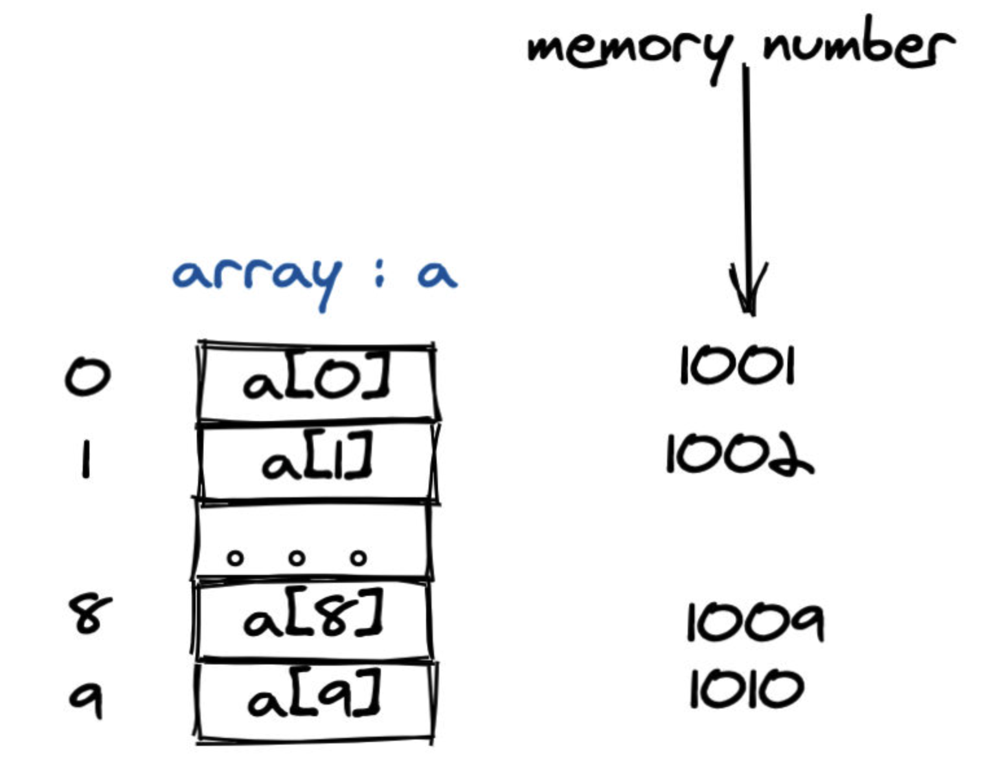

# 数组

数组是一种使用最为广泛的数据结构，尤其是在大家的日常开发中，原因无非就是**操作简单**和**支持随机访问**。而字符串大家也可以将其看成是一个字符数组，这更加夯实了数组的重要性。

数组和链表是重要的数据结构，虽然数据结构有很多，比如树，图，哈希表等。但真正的实现还需要落实到具体的基础数据结构，即**数组和链表**。之所以说他们是基础的数据结构，是因为它们直接控制物理内存的使用。

数组使用连续的内存空间，来存储一系列同一数据类型的值。如图表示的是数组的**每一项都使用一个 byte 存储**的情况。




我们知道JavaScript中数组元素可以存储任意元素，但是有些其他语言「强类型语言」不能储存任意类型的数据。

JavaScript是通过堆栈这种内存设计模式处理的，比如基础数据放在栈中，复杂的数据类型放在堆中，但是把指针放在栈中，这样存在数组中的元素都是基础类型，并且遇见复杂的数据项会根据指针找到堆中数据。

而强类型语言是通过定义数据类型这种方式处理。

但是无论哪种处理方式，它们的目的都是为了让数据可以**随意访问**，因为数组的存储是连续的，而且大小固定。

那么当访问某个元素的时候就可以通过访问**基址 + 偏移量**，实现随意访问。

二维数组的表达方式 `board` 或者 `matrix`

### 数组的常见操作

1.随机访问，时间复杂度为O(1)
2.遍历，时间复杂度为O(N)
3.删除、插入元素比较复杂
- 当删除/插入某个元素的时候是需要找到元素，然后进行删除，而且还需要平移操作，所以最坏的是O(N)，最好是O(1)。

## 数组题目练习
### [第三大的数](https://leetcode-cn.com/problems/third-maximum-number)

```js
示例 1：
输入：[3, 2, 1]
输出：1
解释：第三大的数是 1 。

示例 2：
输入：[1, 2]
输出：2
解释：第三大的数不存在, 所以返回最大的数 2 。

示例 3：
输入：[2, 2, 3, 1]
输出：1
解释：注意，要求返回第三大的数，是指在所有不同数字中排第三大的数。
此例中存在两个值为 2 的数，它们都排第二。在所有不同数字中排第三大的数为 1 。

先排序 再去重。
var thirdMax = function(nums) {
let newArr = nums.sort((a, b) => b-a)
	newArr = Array.from(new Set(newArr))
	if (newArr.length >= 3) {
	  return newArr[2]
	} else {
	  return newArr[0]
	}
};

执行用时：80 ms, 在所有 JavaScript 提交中击败了 59.84% 的用户
内存消耗：39.6 MB, 在所有 JavaScript 提交中击败了 36.35% 的用户
通过测试用例：30 / 30

var thirdMax = function(nums) {
  let first = -Infinity // 最大
  let second = -Infinity // 第二大
  let third = -Infinity // 最三大
  for (let i = 0; i < nums.length; i++) {
    const e = nums[i]
    if (e > first) [first, second, third] = [e, first, second]
    else if (e > second && e !== first) [second, third] = [e, second]
    else if (e > third && e !== second && e !== first) third = e
  }
  console.log(first, second, third)
  return third !== -Infinity ? third : first
}
执行用时：68 ms, 在所有 JavaScript 提交中击败了 92.56% 的用户
内存消耗：40 MB, 在所有 JavaScript 提交中击败了 12.50% 的用户
通过测试用例：30 / 30


```
### [剑指 Offer 53 - II. 0 ～ n-1 中缺失的数字](https://leetcode-cn.com/problems/que-shi-de-shu-zi-lcof/)

```
一个长度为n-1的递增排序数组中的所有数字都是唯一的，并且每个数字都在范围0～n-1之内。在范围0～n-1内的n个数字中有且只有一个数字不在该数组中，请找出这个数字。

示例 1:
输入: [0,1,3]
输出: 2

示例 2:
输入: [0,1,2,3,4,5,6,7,9]
输出: 8


var missingNumber = function(nums) {
  if(nums[0] > 0) return 0
      for (let i = 0; i < nums.length; i++) {
        const e = nums[i]
        if (e + 1 !== nums[i + 1]  ) return nums.length >= i + 1 ?  e + 1:e
      }
}

执行用时：76 ms, 在所有 JavaScript 提交中击败了 58.82% 的用户
内存消耗：40.3 MB, 在所有 JavaScript 提交中击败了27.90%的用户
通过测试用例：122 / 122
```


```
     // 对于非负整数 X 而言，X 的数组形式是每位数字按从左到右的顺序形成的数组。例如，如果 X = 1231，那么其数组形式为 [1,2,3,1]。
      // 给定非负整数 X 的数组形式 A，返回整数 X+K 的数组形式。

      // 示例 1：

      // 输入：A = [1,2,0,0], K = 34
      // 输出：[1,2,3,4]
      // 解释：1200 + 34 = 1234
      // 示例 2：

      // 输入：A = [2,7,4], K = 181
      // 输出：[4,5,5]
      // 解释：274 + 181 = 455
      // 示例 3：

      // 输入：A = [2,1,5], K = 806
      // 输出：[1,0,2,1]
      // 解释：215 + 806 = 1021
      // 示例 4：

      // 输入：A = [1, 2, 6, 3, 0, 7, 1, 7, 1, 9, 7, 5, 6, 6, 4, 4, 0, 0, 6, 3], K = 516
      // 输出：[1,2,6,3,0,7,1,7,1,9,7,5,6,6,4,4,0,5,7,9]
      // 解释：12...0063 + 516 = 12...0579

      // 提示：

      // 1 <= A.length <= 10000
      // 0 <= A[i] <= 9
      // 0 <= K <= 10000
      // 如果 A.length > 1，那么 A[0] != 0

      // let A = [1, 2, 0, 0], K = 34
      let A = [7],
        K = 993
      // 455
      var addToArrayForm = function(num, k) {
        // 第一步先将k 加进num里，
        let kArr = ('' + k).split('').reverse()
        let len = kArr.length
        for (let i = 0; i < len; i++) {
          if (num[num.length - 1 - i] !== undefined) num[num.length - 1 - i] += +kArr[i]
          else num.unshift(kArr[i])
        }
        console.log(num, 'num')
        // 第二步将num里把每一项进行进位
        let i = num.length - 1
        while (i >= 0) {
          // 大于9 进一
          if (num[i] > 9) {
            debugger
            console.log(i, 'i')
            if (i > 0) num[i - 1] = +num[i - 1] + parseInt((num[i] % 100) / 10)
            else {
              console.log(num[i], 'um[i]')
              if (num[i] > 9) {
                num.unshift()
                let first = parseInt(num[i] % 10)
                let second = parseInt((num[i] % 100) / 10)
                num[i] = first
                num.unshift(second)
              } else {
                num.unshift(num[i])
              }
            }
            num[i] = parseInt(num[i] % 10)
          }
          i--
        }
        return num
      }
```


- 
- 
- 
- [88. 合并两个有序数组](https://leetcode-cn.com/problems/merge-sorted-array/)
- [380. 常数时间插入、删除和获取随机元素](https://leetcode-cn.com/problems/insert-delete-getrandom-o1/)
- [41. 缺失的第一个正数](https://leetcode-cn.com/problems/first-missing-positive/)

另外推荐两个思考难度小，但是边界多的题目， 这种题目如果可以一次写出 bug free 的代码会很加分。

- [59. 螺旋矩阵 II](https://leetcode-cn.com/problems/spiral-matrix-ii/)
- [859. 亲密字符串](https://leetcode-cn.com/problems/buddy-strings/)


参考

[91算法](https://leetcode-solution.cn/)

