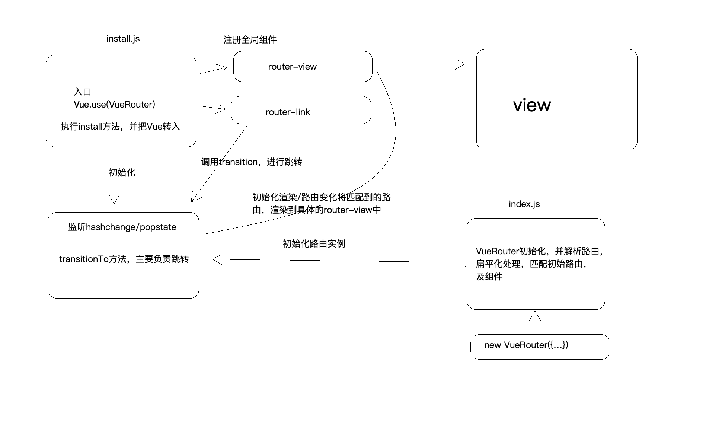

# Vue-Router

hash模式和history原理，需要注意的是history需要启动vscode服务才可以跑起来

```html
<html>
  <head>
    <title></title>

    <meta charset="utf-8" />

    <meta name="viewport" content="width=device-width,initial-scale=1,maximum-scale=1,user-scalable=no" />

    <style></style>
  </head>

  <body>
    <!-- <a href="#/a">/a</a>
    <a href="#/b">/b</a>
    <br /> -->

    <a onclick="goToA()">/a</a>
    <a onclick="goToB()">/b</a>

    <div id="app"></div>

    <script>
      // hash模式 利用的是hashchange的方法
      // const app = document.getElementById("app")
      // let fn = function () {
      //   app.innerHTML = window.location.hash
      // }
      // fn()
      // window.addEventListener("hashchange", fn)

      // history模式
      let fn2 = function () {
        app.innerHTML = window.location.pathname
      }
      function goToA() {
        console.log("AAA")
        history.pushState({}, null, "/a")
        fn2()
      }
      function goToB() {
        console.log("BBB")
        history.pushState({}, null, "/b")
        fn2()
      }
      window.addEventListener("popstate", fn2)
    </script>
  </body>
</html>

```

下面是Vue-Router源码的图解



[手撕源码仓库在这里](./vue-router)

```js
/* 
1. 根据Vue的特性， Vue提供一个install方法，我们只需通过Vue.use(xxx).
  所以在install中，注册全局组件 link view，暴露$router $route,将vue传进来
  在 beforeCreate 生命周期，为每个组件添加_routerRoot，并在根组件在加载的时候初始化操作,然后将当前的匹配的路由做成响应式
  由beforeCreate钩子执行init方法，开启监听路由变化
 */

/* 2.在我们书写Route规则的时候 new VueRouter({...}),通过option把参数传递进来，mode初始化hash实例/history实例 router则进行扁平化，并进行缓存起来
    addRoutes「动态添加路由」，match「匹配路由」，并对匹配到的路由进行赋值 router就是当前实例  current通过 transitionTo 调用updateRoute获取，
*/

/* 3.router-link/router-view 在install的时候已经注册在全局了，router-link 用于跳转，里面调用的是 push方法，push方法是 先是匹配router组件，然后通过给 window.location.hash赋值，
    当我们匹配到了组件后，router-view 渲染组件，如果多层router的话，根据深度「depth」来渲染每一个  
*/

摘自Vue-Router官网

完整的导航解析流程
导航被触发。
在失活的组件里调用离开守卫beforeRouteLeave(to,from,next)。
调用全局的beforeEach( (to,from,next) =>{} )守卫。
在重用的组件里调用 beforeRouteUpdate(to,from,next) 守卫。
在路由配置里调用beforeEnter(to,from,next)路由独享的守卫。
解析异步路由组件。
在被激活的组件里调用beforeRouteEnter(to,from,next)。
在所有组件内守卫和异步路由组件被解析之后调用全局的beforeResolve( (to,from,next) =>{} )解析守卫。
导航被确认。
调用全局的afterEach( (to,from) =>{} )钩子。 没有next方法
触发 DOM 更新。

```


通过问题查漏补缺

