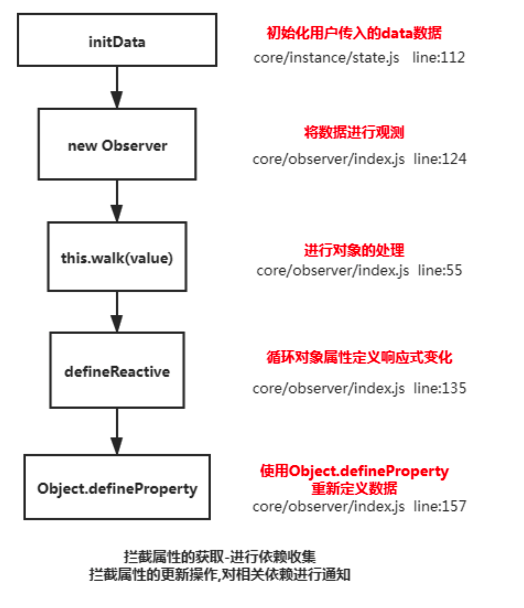
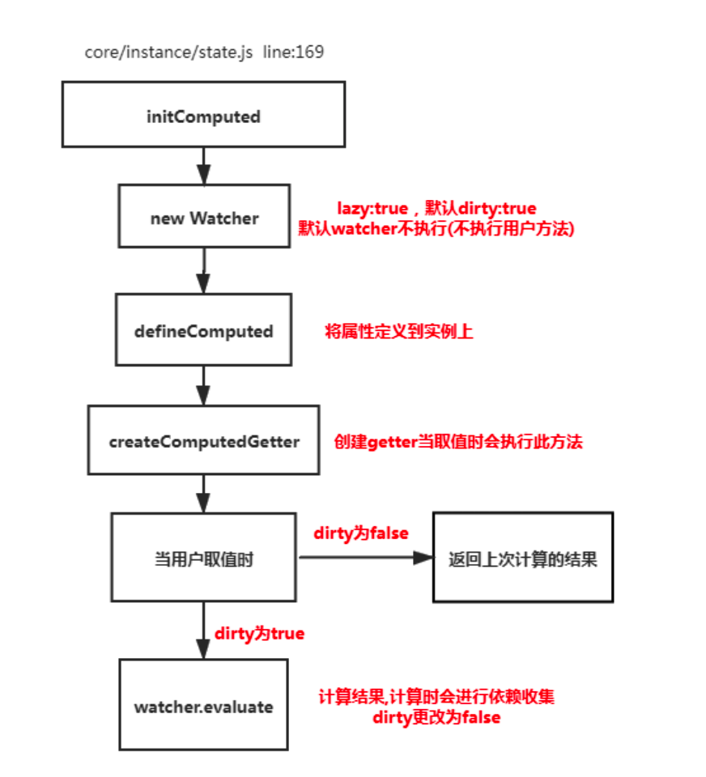

# Vue面试题

#### **1.请说一下响应式数据的原理?**



```js
理解:
1.核心点: Object.defineProperty
2.默认 Vue 在初始化数据时，会给 data 中的属性使用 Object.defineProperty 重新定义所有属 性,当页面取到对应属性时。会进行依赖收集(收集当前组件的watcher) 如果属性发生变化会通 知相关依赖进行更新操作。

原理:

Object.defineProperty(obj, key, { enumerable: true,
	configurable: true,
	get: function reactiveGetter () {
	const value = getter ? getter.call(obj) : val if (Dep.target) {
	dep.depend() // ** 收集依赖 ** / if (childOb) {
	childOb.dep.depend()
	if (Array.isArray(value)) {
	            dependArray(value)
	          }
	} }
	      return value
	    },
	set: function reactiveSetter (newVal) {
	const value = getter ? getter.call(obj) : val
	if (newVal === value || (newVal !== newVal && value !== value)) {
	return
	}
if (process.env.NODE_ENV !== 'production' && customSetter) {
        customSetter()
      }
val = newVal
childOb = !shallow && observe(newVal) dep.notify() /**通知相关依赖进行更新**/
} })
```


#### **2.中是如何检测数组变化**?


```js
理解:
使用函数劫持的方式，重写了数组的方法
Vue 将 data 中的数组，进行了原型链重写。指向了自己定义的数组原型方法，这样当调用数组 api 时，可以通知依赖更新.如果数组中包含着引用类型。会对数组中的引用类型再次进行监控。


const arrayProto = Array.prototype
export const arrayMethods = Object.create(arrayProto) 
const methodsToPatch = [
  'push',
  'pop',
  'shift',
  'unshift',
  'splice',
  'sort',
  'reverse'
]
methodsToPatch.forEach(function (method) { // 重写原型方法
const original = arrayProto[method] // 调用原数组的方法 def(arrayMethods, method, function mutator (...args) {
const result = original.apply(this, args) 
const ob = this.__ob__
let inserted
    switch (method) {
      case 'push':
      case 'unshift':
        inserted = args
        break
      case 'splice':
inserted = args.slice(2)
break
}
if (inserted) ob.observeArray(inserted)
// notify change
ob.dep.notify() // 当调用数组方法后，手动通知视图更新 return result
}) })
this.observeArray(value) // 进行深度监控
```


#### **3.**为何采用异步渲染**?**

```js
理解：
因为如果不采用异步更新，那么每次更新数据都会对当前组件进行重新渲染.所以为了性能考虑。 Vue 会在本轮数据更新后，再去异步更新视图!

update () {
	/* istanbul ignore else */ 
  if (this.lazy) {
		this.dirty = true
	} else if (this.sync) {
		this.run() 
  } else {
		queueWatcher(this); // 当数据发生变化时会将watcher放到一个队列中批量更新 
  }
 }

export function queueWatcher(watcher: Watcher) {
  const id = watcher.id; // 会对相同的watcher进行过滤 if (has[id] == null) {
  has[id] = true;
  if (!flushing) {
    queue.push(watcher);
  } else {
    let i = queue.length - 1;
    while (i > index && queue[i].id > watcher.id) {
      i--;
    }
    queue.splice(i + 1, 0, watcher);
  }
  // queue the flush
  if (!waiting) {
    waiting = true;
    if (process.env.NODE_ENV !== "production" && !config.async) {
      flushSchedulerQueue();
      return;
    }
    nextTick(flushSchedulerQueue); // 调用nextTick方法 批量的进行更新 }
  }
}
```


####  **4.实现原理**?


```js
理解:(宏任务和微任务) 异步方法
nextTick方法主要是使用了宏任务和微任务,定义了一个异步方法.多次调用nextTick 会将方法存入 队列中，通过这个异步方法清空当前队列。 所以这个 nextTick 方法就是异步方法

let timerFunc // 会定义一个异步方法
if (typeof Promise !== 'undefined' && isNative(Promise)) { // promise const p = Promise.resolve()
timerFunc = () => {
p.then(flushCallbacks)
    if (isIOS) setTimeout(noop)
  }
  isUsingMicroTask = true
} else if (!isIE && typeof MutationObserver !== 'undefined' && ( //
MutationObserver
  isNative(MutationObserver) ||
MutationObserver.toString() === '[object MutationObserverConstructor]' )) {
let counter = 1
const observer = new MutationObserver(flushCallbacks) const textNode = document.createTextNode(String(counter)) observer.observe(textNode, {
    characterData: true
  })
timerFunc = () => {
counter = (counter + 1) % 2 textNode.data = String(counter)
}
  isUsingMicroTask = true
} else if (typeof setImmediate !== 'undefined' ) { // setImmediate
  timerFunc = () => {
    setImmediate(flushCallbacks)
}
} else {
  timerFunc = () => {   // setTimeout
    setTimeout(flushCallbacks, 0)
} }
// nextTick实现
export function nextTick (cb?: Function, ctx?: Object) {
let _resolve callbacks.push(() => {
if (cb) { try {
cb.call(ctx) } catch (e) {
        handleError(e, ctx, 'nextTick')
      }
    } else if (_resolve) {
      _resolve(ctx)
} })
  if (!pending) {
    pending = true
    timerFunc()
} }
```


#### 5.**Computed**的特点



```js
理解:
默认 也是一个 是具备缓存的，只要当依赖的属性发生变化时才会更新视图

function initComputed (vm: Component, computed: Object) { const watchers = vm._computedWatchers = Object.create(null) const isSSR = isServerRendering()
for (const key in computed) {
const userDef = computed[key]
const getter = typeof userDef === 'function' ? userDef : userDef.get if (!isSSR) {
// create internal watcher for the computed property.
      watchers[key] = new Watcher(
        vm,
        getter || noop,
        noop,
        computedWatcherOptions
) }
// component-defined computed properties are already defined on the
// component prototype. We only need to define computed properties defined
  
// at instantiation here.
    if (!(key in vm)) {
      defineComputed(vm, key, userDef)
} else if (process.env.NODE_ENV !== 'production') { if (key in vm.$data) {
warn(`The computed property "${key}" is already defined in data.`, vm) } else if (vm.$options.props && key in vm.$options.props) {
warn(`The computed property "${key}" is already defined as a prop.`, vm) }
} }
}
function createComputedGetter (key) {
return function computedGetter () {
const watcher = this._computedWatchers && this._computedWatchers[key] if (watcher) {
if (watcher.dirty) { // 如果依赖的值没发生变化,就不会重新求值 watcher.evaluate()
}
if (Dep.target) {
watcher.depend() }
return watcher.value }
} }
```


#### **6.** **watch中的deep：true是如何实现的**

```js
理解:
当用户指定了 watch 中的deep属性为 true 时，如果当前监控的值是数组类型。会对对象中的每 一项进行求值，此时会将当前 watcher 存入到对应属性的依赖中，这样数组中对象发生变化时也 会通知数据更新

get () {
pushTarget(this) // 先将当前依赖放到 Dep.target上 let value
const vm = this.vm
try {
value = this.getter.call(vm, vm) } catch (e) {
if (this.user) {
handleError(e, vm, `getter for watcher "${this.expression}"`)
      } else {
        throw e
}
} finally {
if (this.deep) { // 如果需要深度监控
traverse(value) // 会对对象中的每一项取值,取值时会执行对应的get方法
}
      popTarget()
    }
        return value
}
function _traverse (val: any, seen: SimpleSet) {
let i, keys
const isA = Array.isArray(val)
if ((!isA && !isObject(val)) || Object.isFrozen(val) || val instanceof VNode)
{
}
seen.add(depId) }
if (isA) {
i = val.length
while (i--) _traverse(val[i], seen)
} else {
keys = Object.keys(val)
i = keys.length
while (i--) _traverse(val[keys[i]], seen)
} }
```


#### **7.** **组件的生命周期**


```
理解:
要掌握每个生命周期什么时候被调用
beforeCreate 在实例初始化之后，数据观测(data observer) 之前被调用。
created 实例已经创建完成之后被调用。在这一步，实例已完成以下的配置:数据观测(data observer)，属性和方法的运算， watch/event 事件回调。这里没有$el
beforeMount 在挂载开始之前被调用:相关的 render 函数首次被调用。
mounted el 被新创建的 vm.$el 替换，并挂载到实例上去之后调用该钩子。 beforeUpdate 数据更新时调用，发生在虚拟 DOM 重新渲染和打补丁之前。
updated 由于数据更改导致的虚拟 DOM 重新渲染和打补丁，在这之后会调用该钩子。 beforeDestroy 实例销毁之前调用。在这一步，实例仍然完全可用。
destroyed Vue 实例销毁后调用。调用后，Vue 实例指示的所有东西都会解绑定，所有的事件 监听器会被移除，所有的子实例也会被销毁。 该钩子在服务器端渲染期间不被调用。
要掌握每个生命周期内部可以做什么事
created 实例已经创建完成，因为它是最早触发的原因可以进行一些数据，资源的请求。 mounted 实例已经挂载完成，可以进行一些DOM操作
beforeUpdate 可以在这个钩子中进一步地更改状态，这不会触发附加的重渲染过程。
updated 可以执行依赖于 DOM 的操作。然而在大多数情况下，你应该避免在此期间更改状态，
因为这可能会导致更新无限循环。 该钩子在服务器端渲染期间不被调用。 destroyed 可以执行一些优化操作,清空定时器，解除绑定事件
```

####  **8.Vue中模板编译原理**

**将 template 转化成 render 函数**

```js
function baseCompile (
  template: string,
  options: CompilerOptions
){
const ast = parse(template.trim(), options) // 1.将模板转化成ast语法树
if (options.optimize !== false) { optimize(ast, options)
  }
  const code = generate(ast, options)
  return {
ast,
render: code.render,
staticRenderFns: code.staticRenderFns
} })
// 2.优化树
// 3.生成树
ncname = `[a-zA-Z_][\\-\\.0-9_a-zA-Z]*`;
qnameCapture = `((?:${ncname}\\:)?${ncname})`;
startTagOpen = new RegExp(`^<${qnameCapture}`); // 标签开头的正则 捕获的内容是
const
const
const
标签名
const
const attribute = /^\s*([^\s"'<>\/=]+)(?:\s*(=)\s*(?:"([^"]*)"+|'([^']*)'+| ([^\s"'=<>`]+)))?/; // 匹配属性的
endTag = new RegExp(`^<\\/${qnameCapture}[^>]*>`); // 匹配标签结尾的 </div>
const startTagClose = /^\s*(\/?)>/; // 匹配标签结束的 > let root;
let currentParent;
let stack = []
function createASTElement(tagName,attrs){
    return {
        tag:tagName,
        type:1,
        children:[],
        attrs,
        parent:null
}
yortseDerofeb
euV
 }
function start(tagName,attrs){
    let element = createASTElement(tagName,attrs);
    if(!root){
        root = element;
    }
    currentParent = element;
stack.push(element); }
function chars(text){ currentParent.children.push({
type:3,
text
function end(tagName){
const element = stack[stack.length-1]; stack.length --;
currentParent = stack[stack.length-1]; if(currentParent){
element.parent = currentParent;
currentParent.children.push(element) }
}
function parseHTML(html){
while(html){
let textEnd = html.indexOf('<'); if(textEnd == 0){
            const startTagMatch = parseStartTag();
            if(startTagMatch){
start(startTagMatch.tagName,startTagMatch.attrs);
continue; }
const endTagMatch = html.match(endTag); if(endTagMatch){
advance(endTagMatch[0].length);
                end(endTagMatch[1])
            }
        }
        let text;
        if(textEnd >=0 ){
text = html.substring(0,textEnd) }
if(text){ advance(text.length); chars(text);
} }
function advance(n) {
html = html.substring(n);
    }
    function parseStartTag(){
const start = html.match(startTagOpen); if(start){
            const match = {
                tagName:start[1],
                attrs:[]
}
}) }
 
advance(start[0].length);
let attr,end
while(!(end = html.match(startTagClose)) &&
(attr=html.match(attribute))){ advance(attr[0].length);
match.attrs.push({name:attr[1],value:attr[3]}) }
if(end){ advance(end[0].length); return match
} }
// 生成语法树
parseHTML(`<div id="container"><p>hello<span>zf</span></p></div>`); function gen(node){
if(node.type == 1){
return generate(node);
}else{
return `_v(${JSON.stringify(node.text)})`
} }
function genChildren(el){
const children = el.children; if(el.children){
return `[${children.map(c=>gen(c)).join(',')}]` }else{
        return false;
    }
}
function genProps(attrs){
let str = '';
for(let i = 0; i < attrs.length;i++){
        let attr = attrs[i];
str+= `${attr.name}:${attr.value},`; }
return `{attrs:{${str.slice(0,-1)}}}` }
function generate(el){
let children = genChildren(el); let code = `_c('${el.tag}'${
el.attrs.length? `,${genProps(el.attrs)}`:'' }${
children? `,${children}`:'' })`;
    return code;
}
// 根据语法树生成新的代码
let code = generate(root);
let render = `with(this){return ${code}}`;
// 包装成函数
let renderFn = new Function(render); console.log(renderFn.toString());
```


#### **9.为什么 和 不能连用**

```js
const VueTemplateCompiler = require('vue-template-compiler');
let r1 = VueTemplateCompiler.compile(`<div v-if="false" v-for="i in 3">hello</div>`);
/**
with(this) {
    return _l((3), function (i) {
        return (false) ? _c('div', [_v("hello")]) : _e()
}) }
*/
console.log(r1.render);

v-for 会比 v-if 的优先级高一些,如果连用的话会把 v-if 给每个元素都添加一下,会造成性能问题
```


#### **8.**用 Vnode来描述一个DOM结构

虚拟节点就是用一个对象来描述真实的 dom 元素

```js
function $createElement(tag,data,...children){ let key = data.key;
delete data.key;
children = children.map(child=>{
        if(typeof child === 'object'){
            return child
        }else{
            return vnode(undefined,undefined,undefined,undefined,child)
} })
    return vnode(tag,props,key,children);
}

export function vnode(tag,data,key,children,text){
    return {
    tag, // 表示的是当前的标签名 
    data, // 表示的是当前标签上的属性 
    key, // 唯一表示用户可能传递 
    children,
		text
} }

```

#### **9.** diff**算法的时间复杂度**

两个树的完全的 diff 算法是一个时间复杂度为 O(n3) , Vue 进行了优化·*O(n3)* 的问题转换成 O(n) 的问题(只比较同级不考虑跨级问题) 在前端当中， 你很少会跨越层级地移动Dom元素。 所 以 Virtual Dom只会对同一个层级的元素进行对比。

#### **10.**简述 Vue中diff算法原理

```
理解:
1.先同级比较，在比较子节点
2.先判断一方有儿子一方没儿子的情况 
3.比较都有儿子的情况 
4.递归比较子节点
详情去看另外一篇文章
```

