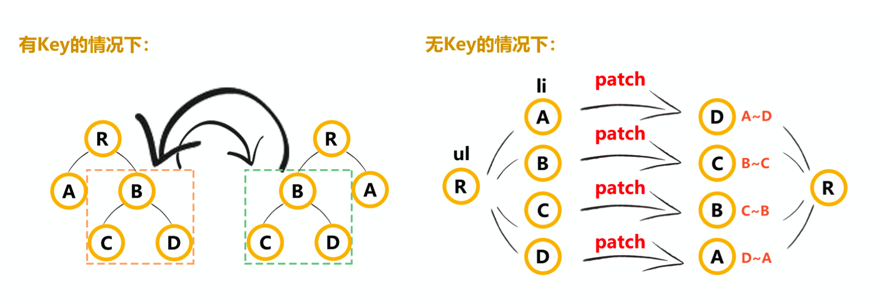
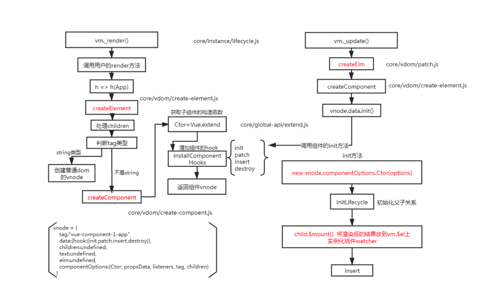
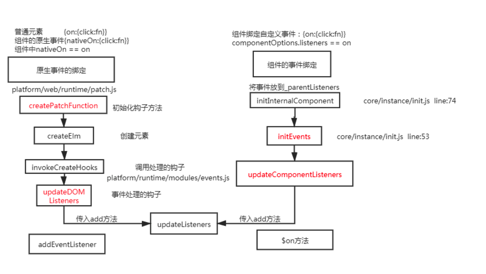
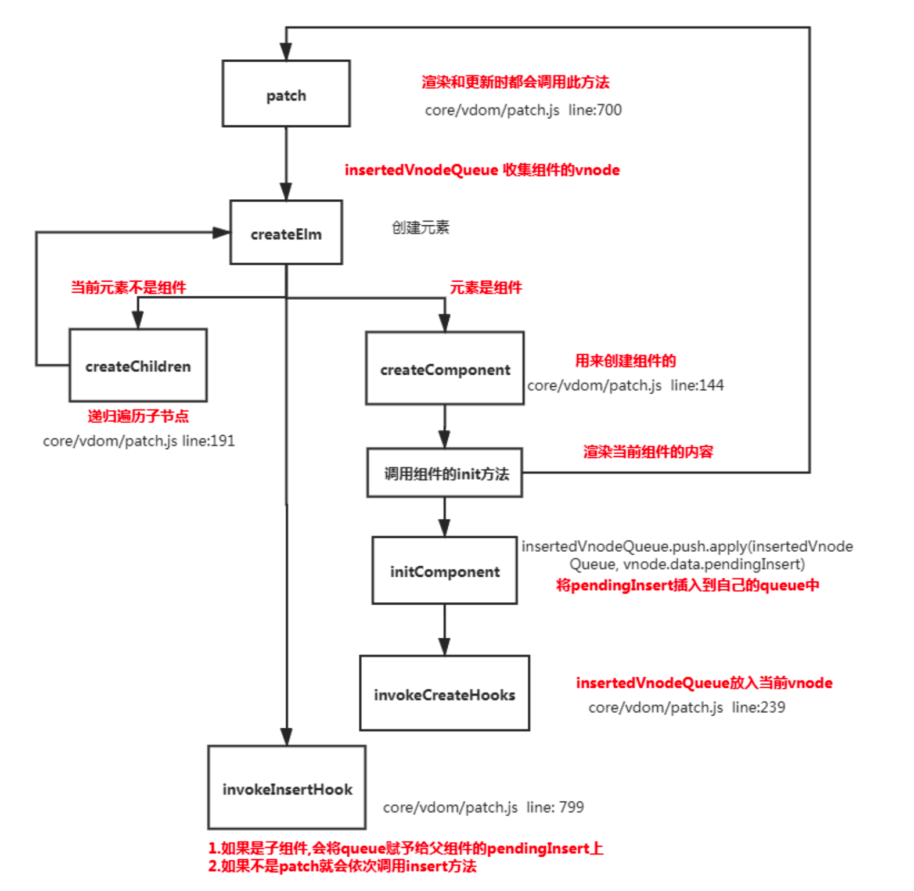
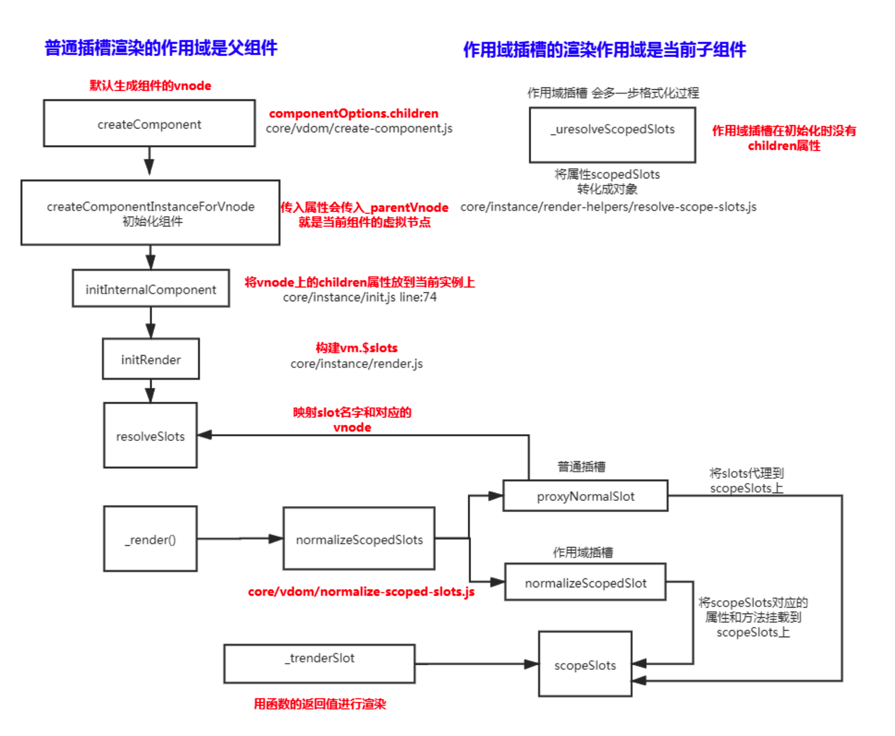
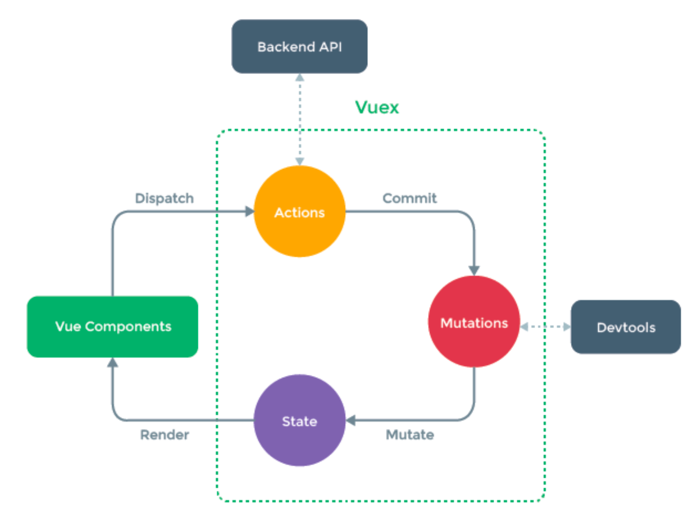

#### 1. **diff中为什么要用key** **(图解**)



```

```


#### **2.描述组件渲染和更新过程**



```
理解:
渲染组件时，会通过 Vue.extend 方法构建子组件的构造函数，并进行实例化。最终手动调用 $mount() 进行挂载。更新组件时会进行 patchVnode 流程.核心就是diff算法
```


#### **3.**组件中的 为什么是一个函数?

```js
function VueComponent(){} VueComponent.prototype.$options = {
  data:{name:'juice'}
}
let vc1 = new VueComponent(); vc1.$options.data = 'juice2';
let vc2 = new VueComponent(); console.log(vc2.$options.data);

理解:
同一个组件被复用多次，会创建多个实例。这些实例用的是同一个构造函数，如果 data 是一个对象的 话。那么所有组件都共享了同一个对象。为了保证组件的数据独立性要求每个组件必须通过 data 函数 返回一个对象作为组件的状态。
一个组件被使用多次，用的都是同一个构造函数。为了保证组件的不同的实例data不冲突，要求 data必须是一个函数，这样组件间不会相互影响

core/global-api/extend.js line:33

Sub.options = mergeOptions( Super.options,
      extendOptions
)
function mergeOptions(){
     function mergeField (key) {
        const strat = strats[key] || defaultStrat
        options[key] = strat(parent[key], child[key], vm, key)
} }
strats.data = function ( parentVal: any, childVal: any,
vm?: Component ): ?Function {
if (!vm) { // 合并是会判断子类的data必须是一个函数
if (childVal && typeof childVal !== 'function') { process.env.NODE_ENV !== 'production' && warn(
'The "data" option should be a function ' +
'that returns a per-instance value in component ' + 'definitions.',
vm
)
      return parentVal
    }
    return mergeDataOrFn(parentVal, childVal)
  }
  return mergeDataOrFn(parentVal, childVal, vm)
}
```


#### **4.** Vue中事件绑定的原理



```js
编译阶段
Vue在挂载实例前，有相当多的工作是进行模板的编译，将template模板进行编译，解析成AST树，再转换成render函数，而在编译阶段，就是对事件的指令做收集处理。
在template模板中，定义事件的部分是属于XML的Attribute，所以收集指令时需要匹配Attributes以确定哪个Attribute是属于事件。

Vue 的事件绑定分为两种一种是原生的事件绑定，还有一种是组件的事件绑定,

理解:
1.原生 dom 事件的绑定,采用的是 addEventListener 实现
2.组件绑定事件采用的是 $on 方法

原理: 事件的编译:

let compiler = require('vue-template-compiler');
let r1 = compiler.compile('<div @click="fn()"></div>');
let r2 = compiler.compile('<my-component @click.native="fn" @click="fn1"></my- component>');
console.log(r1); // {on:{click}}
console.log(r2); // {nativeOnOn:{click},on:{click}}


1.原生 的绑定
Vue 在创建真实 dom 时会调用 createElm ,默认会调用 invokeCreateHooks
会遍历当前平台下相对的属性处理代码,其中就有 updateDOMListeners 方法,内部会传入 add 方法
vue 中绑定事件是直接绑定给真实 dom 元素的

function updateDOMListeners (oldVnode: VNodeWithData, vnode: VNodeWithData) { 
  if (isUndef(oldVnode.data.on) && isUndef(vnode.data.on)) {
		return
	}
	const on = vnode.data.on || {}
	const oldOn = oldVnode.data.on || {}
	target = vnode.elm
	normalizeEvents(on)
	updateListeners(on, oldOn, add, remove, createOnceHandler, vnode.context) 
	target = undefined
}
function add (
  name: string,
  handler: Function,
  capture: boolean,
  passive: boolean
){
target.addEventListener( // 给当前的dom添加事件
    name,
    handler,
    supportsPassive
      ? { capture, passive }
: capture )
}


2.组件中绑定事件
组件绑定事件是通过 vue 中自定义的 $on 方法来实现的


export function updateComponentListeners (
  vm: Component,
  listeners: Object,
  oldListeners: ?Object
){
target = vm
  updateListeners(listeners, oldListeners || {}, add, remove, createOnceHandler,
vm)
  target = undefined
}
function add (event, fn) { target.$on(event, fn)
}
```


**5.** **v-model 中的实现原理及如何自定义 v-model**

```js
v-model 可以看成是 value+input方法 的语法糖 组件的v-model 就是value+input的语法糖

理解:
组件的 v-model 是 value+input方法 的语法糖


<el-checkbox :value="" @input="">
</el-checkbox> <el-checkbox v-model="check"></el-checkbox>

可以自己重新定义 v-model 的含义
Vue.component('el-checkbox',{
template:`<input type="checkbox" :checked="check"
@change="$emit('change',$event.target.checked)">`, model:{
prop:'check', // 更改默认的value的名字
event:'change' // 更改默认的方法名 },
    props: {
        check: Boolean
}, })

原理:
会将组件的 v-model 默认转化成value+input

const VueTemplateCompiler = require('vue-template-compiler');
const ele = VueTemplateCompiler.compile('<el-checkbox v-model="check"></el- checkbox>');
// with(this) {
//		return _c('el-checkbox', { model: {
//			value: (check),
//			callback: function ($$v) {
//			check = $$v },
//			expression: "check"
//
//
//         }
//     })
// }

core/vdom/create-component.js line:155

function transformModel (options, data: any) {
const prop = (options.model && options.model.prop) || 'value' const event = (options.model && options.model.event) || 'input' ;(data.attrs || (data.attrs = {}))[prop] = data.model.value const on = data.on || (data.on = {})
const existing = on[event]
const callback = data.model.callback
if (isDef(existing)) {
if ( Array.isArray(existing)
? existing.indexOf(callback) === -1
: existing !== callback ){
on[event] = [callback].concat(existing) }
  } else {
    on[event] = callback
} }


原生的 v-model ，会根据标签的不同生成不同的事件和属性

const VueTemplateCompiler = require('vue-template-compiler');
const ele = VueTemplateCompiler.compile('<input v-model="value"/>'); 
/**
with(this) {
    return _c('input', {
        directives: [{
name: "model", rawName: "v-model", value: (value), expression: "value"
        }],
        domProps: {
            "value": (value)
        },
        on: {
            "input": function ($event) {
if ($event.target.composing) return;
value = $event.target.value 
}}})}
*/

编译时:不同的标签解析出的内容不一样 platforms/web/compiler/directives/model.js

if (el.component) {
genComponentModel(el, value, modifiers)
// component v-model doesn't need extra runtime return false
  } else if (tag === 'select') {
    genSelect(el, value, modifiers)
  } else if (tag === 'input' && type === 'checkbox') {
    genCheckboxModel(el, value, modifiers)
  } else if (tag === 'input' && type === 'radio') {
    genRadioModel(el, value, modifiers)
  } else if (tag === 'input' || tag === 'textarea') {
    genDefaultModel(el, value, modifiers)
} else if (!config.isReservedTag(tag)) { genComponentModel(el, value, modifiers)
// component v-model doesn't need extra runtime return false
}

运行时:会对元素处理一些关于输入法的问题
platforms/web/runtime/directives/model.js

inserted (el, binding, vnode, oldVnode) { if (vnode.tag === 'select') {
// #6903
if (oldVnode.elm && !oldVnode.elm._vOptions) { mergeVNodeHook(vnode, 'postpatch', () => {
directive.componentUpdated(el, binding, vnode) })
} else {
setSelected(el, binding, vnode.context)
}
el._vOptions = [].map.call(el.options, getValue)
} else if (vnode.tag === 'textarea' || isTextInputType(el.type)) {
el._vModifiers = binding.modifiers if (!binding.modifiers.lazy) {
el.addEventListener('compositionstart', onCompositionStart) el.addEventListener('compositionend', onCompositionEnd)
// Safari < 10.2 & UIWebView doesn't fire compositionend when // switching focus before confirming composition choice
// this also fixes the issue where some browsers e.g. iOS Chrome // fires "change" instead of "input" on autocomplete. el.addEventListener('change', onCompositionEnd)
/* istanbul ignore if */
if (isIE9) { el.vmodel = true
}
   } }
}
```


####  **6.Vue中v-html会导致哪些问题**?

```js
理解:
可能会导致 xss 攻击，内部绑定了一些事件 
会替换掉标签内部的子元素

let template = require('vue-template-compiler');
let r = template.compile(`<div v-html="'<span>hello</span>'"></div>`) // with(this){return _c('div',{domProps: {"innerHTML":_s('<span>hello</span>')}})}
console.log(r.render);
// _c 定义在core/instance/render.js
// _s 定义在core/instance/render-helpers/index,js
if (key === 'textContent' || key === 'innerHTML') {
if (vnode.children) vnode.children.length = 0
if (cur === oldProps[key]) continue
// #6601 work around Chrome version <= 55 bug where single textNode // replaced by innerHTML/textContent retains its parentNode property
  if (elm.childNodes.length === 1) {
    elm.removeChild(elm.childNodes[0]) }
}

```


#### **7.** **Vue父子组件生命周期调用顺序**



```js
加载渲染过程
父beforeCreate->父created->父beforeMount->子beforeCreate->子created->子beforeMount->子mounted->父mounted

子组件更新过程
父beforeUpdate->子beforeUpdate->子updated->父updated

父组件更新过程 父beforeUpdate->父updated

销毁过程
父beforeDestroy->子beforeDestroy->子destroyed->父destroyed

理解: 组件的调用顺序都是先父后子,渲染完成的顺序肯定是先子后父 
组件的销毁操作是先父后子，销毁完成的顺序是先子后父

function patch (oldVnode, vnode, hydrating, removeOnly) {
    if (isUndef(vnode)) {
      if (isDef(oldVnode)) invokeDestroyHook(oldVnode)
return
}
let isInitialPatch = false
const insertedVnodeQueue = [] // 定义收集所有组件的insert hook方法的数组 // somthing ...
createElm(
vnode,
insertedVnodeQueue, oldElm._leaveCb ? null : parentElm, nodeOps.nextSibling(oldElm)
)
// somthing...
// 最终会依次调用收集的insert hook
invokeInsertHook(vnode, insertedVnodeQueue, isInitialPatch);
  
  return vnode.elm }
function createElm (
    vnode,
    insertedVnodeQueue,
    parentElm,
    refElm,
    nested,
ownerArray,
index
){
}
// createChildren会递归创建儿子组件 createChildren(vnode, children, insertedVnodeQueue) // something...
// 将组件的vnode插入到数组中
function invokeCreateHooks (vnode, insertedVnodeQueue) {
for (let i = 0; i < cbs.create.length; ++i) { cbs.create[i](emptyNode, vnode)
}
i = vnode.data.hook // Reuse variable if (isDef(i)) {
if (isDef(i.create)) i.create(emptyNode, vnode)
if (isDef(i.insert)) insertedVnodeQueue.push(vnode) }
}
// insert方法中会依次调用mounted方法 insert (vnode: MountedComponentVNode) {
const { context, componentInstance } = vnode if (!componentInstance._isMounted) {
componentInstance._isMounted = true
      callHook(componentInstance, 'mounted')
    }
}
function invokeInsertHook (vnode, queue, initial) {
// delay insert hooks for component root nodes, invoke them after the // element is really inserted
if (isTrue(initial) && isDef(vnode.parent)) {
vnode.parent.data.pendingInsert = queue } else {
for (let i = 0; i < queue.length; ++i) { queue[i].data.hook.insert(queue[i]); // 调用insert方法
} }
}

Vue.prototype.$destroy = function () {
callHook(vm, 'beforeDestroy') //
// invoke destroy hooks on current rendered tree vm.__patch__(vm._vnode, null) // 先销毁儿子
// fire destroyed hook
callHook(vm, 'destroyed')
}
```


#### **8.**Vue组件如何通信**?** **单向数据流**

```
父子间通信 父->子通过props、子->父$on、$emit(发布订阅) 
获取父子组件实例的方式 $parent、$children 
在父组件中提供数据子组件进行消费 Provide、inject 插件
Ref 获取实例的方式调用组件的属性或者方法
Event Bus 实现跨组件通信 Vue.prototype.$bus = new Vue
Vuex状态管理实现通信 $attrs $listeners
```


#### 9.**Vue中相同逻辑如何抽离?**

```js
Vue.mixin 用法 给组件每个生命周期，函数等都混入一些公共逻辑


Vue.mixin = function (mixin: Object) {
this.options = mergeOptions(this.options, mixin); // 将当前定义的属性合并到每个
组件中
return this
}
export function mergeOptions (
  parent: Object,
  child: Object,
  vm?: Component
): Object {
if (!child._base) {
if (child.extends) { // 递归合并extends
parent = mergeOptions(parent, child.extends, vm)
}
if (child.mixins) { // 递归合并mixin
for (let i = 0, l = child.mixins.length; i < l; i++) { parent = mergeOptions(parent, child.mixins[i], vm)
} }
}
const options = {} // 属性及生命周期的合并 let key
for (key in parent) {
    mergeField(key)
  }
  for (key in child) {
    if (!hasOwn(parent, key)) {
      mergeField(key)
    }
  }
  function mergeField (key) {
const strat = strats[key] || defaultStrat
// 调用不同属性合并策略进行合并
options[key] = strat(parent[key], child[key], vm, key)
}
  return options
}
```


#### **10.**为什么要使用异步组件?

```js
理解:
如果组件功能多打包出的结果会变大，我可以采用异步的方式来加载组件。主要依赖 import() 这
个语法，可以实现文件的分割加载。

components:{ AddCustomerSchedule:(resolve)=>import("../components/AddCustomer") //require([])
}

原理:
export function  (
  Ctor: Class<Component> | Function | Object | void,
  data: ?VNodeData,
  context: Component,
  children: ?Array<VNode>,
  tag?: string
): VNode | Array<VNode> | void {
  // async component
let asyncFactory
if (isUndef(Ctor.cid)) {
    asyncFactory = Ctor
Ctor = resolveAsyncComponent(asyncFactory, baseCtor) // 默认调用此函数时返回 undefiend
// 第二次渲染时Ctor不为undefined if (Ctor === undefined) {
return createAsyncPlaceholder( // 渲染占位符 空虚拟节点 asyncFactory,
data,
context,
children,
tag
) }
} }
function resolveAsyncComponent (
  factory: Function,
  baseCtor: Class<Component>
): Class<Component> | void {
if (isDef(factory.resolved)) { // 3.在次渲染时可以拿到获取的最新组件
return factory.resolved }
const resolve = once((res: Object | Class<Component>) => { factory.resolved = ensureCtor(res, baseCtor)
if (!sync) {
forceRender(true) //2. 强制更新视图重新渲染 } else {
owners.length = 0 }
  })
  const reject = once(reason => {
if (isDef(factory.errorComp)) { factory.error = true
                                         forceRender(true)
      }
})
const res = factory(resolve, reject)// 1.将resolve方法和reject方法传入，用户调用 resolve方法后
sync = false
return factory.resolved }
```


#### **11.**什么是作用域插槽**?**



```js
理解:
1.插槽:
<app><div slot="a">xxxx</div><div slot="b">xxxx</div></app>
slot name="a"
slot name="b"

创建组件虚拟节点时，会将组件的儿子的虚拟节点保存起来。当初始化组件时,通过插槽属性将儿 子进行分类 {a:[vnode],b[vnode]} 渲染组件时会拿对应的slot属性的节点进行替换操作。(插槽的作用域为父组件)

2.作用域插槽: 作用域插槽在解析的时候，不会作为组件的孩子节点。会解析成函数，当子组件渲染时，会调用此
函数进行渲染。(插槽的作用域为子组件)
原理:
 插槽
const VueTemplateCompiler = require('vue-template-compiler'); let ele = VueTemplateCompiler.compile(`
<my-component>
<div slot="header">node</div> <div>react</div>
<div slot="footer">vue</div>
</my-component> `)
/**
with(this) {
return _c('my-component', [_c('div', {
            attrs: {
                "slot": "header"
},
slot: "header"
}, [_v("node")] // _文本节点
    ), _v(" "), _c('div', [_v("react")]), _v(" "), _c('div', {
        attrs: {
            "slot": "footer"
        },
        slot: "footer"
    }, [_v("vue")])])
} */
const VueTemplateCompiler = require('vue-template-compiler');

let ele = VueTemplateCompiler.compile(` <div>
        <slot name="header"></slot>
        <slot name="footer"></slot>
        <slot></slot>
</div> `);
/**
with(this) {
return _c('div', [_v("node"), _v(" "), _t(_v("vue")])]), _v(" "), _t("default")], 2)
}
**/
// _t定义在 core/instance/render-helpers/index.js

作用域插槽
let ele = VueTemplateCompiler.compile(` <app>
<div slot-scope="msg" slot="footer">{{msg.a}}</div> </app>
`);
/** with(this) {
return _c('app', {
scopedSlots: _u([{ // 作用域插槽的内容会被渲染成一个函数
            key: "footer",
            fn: function (msg) {
return _c('div', {}, [_v(_s(msg.a))]) }
}]) })
} }
*/
const VueTemplateCompiler = require('vue-template-compiler');
VueTemplateCompiler.compile(` <div>
        <slot name="footer" a="1" b="2"></slot>
    </div>
`);
/** with(this) {
    return _c('div', [_t("footer", null, {
        "a": "1",
        "b": "2"
    })], 2)
} **/
```


#### **12.**谈谈你对 **keep-alive** **的了解?**

```js
理解:
keep-alive 可以实现组件的缓存，当组件切换时不会对当前组件进行卸载,常用的2个属性

include exclude 2个生命周期 deactivated LRU算法
原理: core/components/keep-alive.js

export default {
name: 'keep-alive', abstract: true, // 抽象组件
  props: {
    include: patternTypes,
    exclude: patternTypes,
    max: [String, Number]
},
created () {
this.cache = Object.create(null) // 创建缓存列表 this.keys = [] // 创建缓存组件的key列表
},
destroyed(){//keep-alive销毁时 会清空所有的缓存和key for (const key in this.cache) { // 循环销毁
pruneCacheEntry(this.cache, key, this.keys) }
},
mounted () { // 会监控include 和 include属性 进行组件的缓存处理 this.$watch('include', val => {
      pruneCache(this, name => matches(val, name))
    })
this.$watch('exclude', val => { pruneCache(this, name => !matches(val, name))
}) },
render () {
const slot = this.$slots.default // 会默认拿插槽
const vnode: VNode = getFirstComponentChild(slot) // 只缓存第一个组件 const componentOptions: ?VNodeComponentOptions = vnode &&
vnode.componentOptions
if (componentOptions) {
// check pattern
const name: ?string = getComponentName(componentOptions) // 取出组件的名字 const { include, exclude } = this
if ( // 判断是否缓存
        // not included
        (include && (!name || !matches(include, name))) ||
        // excluded
        (exclude && name && matches(exclude, name))
){
        return vnode
      }
const { cache, keys } = this
const key: ?string = vnode.key == null
  
  // same constructor may get registered as different local components // so cid alone is not enough (#3269)
? componentOptions.Ctor.cid + (componentOptions.tag ?
`::${componentOptions.tag}` : '')
: vnode.key // 如果组件没key 就自己通过 组件的标签和key和cid 拼接一个key
例
if (cache[key]) {
vnode.componentInstance = cache[key].componentInstance // 直接拿到组件实
// make current key freshest
remove(keys, key) // 删除当前的 [b,c,d,e,a] // LRU 最近最久未使用法 keys.push(key) // 并将key放到后面[b,a]
} else {
cache[key] = vnode // 缓存vnode
keys.push(key) // 将key 存入
// prune oldest entry
if (this.max && keys.length > parseInt(this.max)) { // 缓存的太多超过了max
就需要删除掉
pruneCacheEntry(cache, keys[0], keys, this._vnode) // 要删除第0个 但是现
在渲染的就是第0个 }
}
vnode.data.keepAlive = true // 并且标准keep-alive下的组件是一个缓存组件 }
return vnode || (slot && slot[0]) // 返回当前的虚拟节点 }
}
```


#### **13.** **Vue中常见性能优化**

```
1、编码优化:
1.不要将所有的数据都放在data中，data中的数据都会增加getter和setter，会收集对应的 watcher
2. vue 在 v-for 时给每项元素绑定事件需要用事件代理
3. SPA 页面采用keep-alive缓存组件
4.拆分组件( 提高复用性、增加代码的可维护性,减少不必要的渲染 )
5.v-if 当值为false时内部指令不会执行,具有阻断功能，很多情况下使用v-if替代v-show 
6. key 保证唯一性 ( 默认 vue 会采用就地复用策略 )
7.Object.freeze 冻结数据
8.合理使用路由懒加载、异步组件
9.尽量采用runtime运行时版本
10.数据持久化的问题 (防抖、节流)

2、加载性能优化
第三方模块按需导入 ( babel-plugin-component )
滚动到可视区域动态加载 ( https://tangbc.github.io/vue-virtual-scroll-list ) 图片懒加载 (https://github.com/hilongjw/vue-lazyload.git)

3、用户体验
app-skeleton 骨架屏
app-shell app壳
pwa serviceworker

4、SEO优化
预渲染插件 prerender-spa-plugin
服务端渲染 ssr

5、打包优化:
	使用 cdn 的方式加载第三方模块 
	多线程打包 happypack
  splitChunks 抽离公共文件
  sourceMap 生成
  
6、缓存，压缩 
	客户端缓存、服务端缓存
  服务端 gzip 压缩
```


#### 14. Vue3.0**你知道有哪些改进**?

```
Vue3 采用了TS来编写 
支持 Composition API
Vue3 中响应式数据原理改成 proxy
vdom 的对比算法更新，只更新 vdom 的绑定了动态数据的部分
```


####  **15.Vue-router中导航守卫有哪些?**

```
完整的导航解析流程 (runQueue)
1. 导航被触发。
2. 在失活的组件里调用离开守卫。
3. 调用全局的 beforeEach 守卫。
4. 在重用的组件里调用 beforeRouteUpdate 守卫 (2.2+)。 5. 在路由配置里调用 beforeEnter 。
6. 解析异步路由组件。
7. 在被激活的组件里调用 beforeRouteEnter 。
8. 调用全局的 beforeResolve 守卫 (2.5+)。
9. 导航被确认。
10. 调用全局的 afterEach 钩子。
11. 触发 DOM 更新。
12. 用创建好的实例调用 beforeRouteEnter 守卫中传给 next 的回调函数。
```


#### 16.action和mutation 区别

```
mutation 是同步更新数据(内部会进行是否为异步方式更新数据的检测) $watch 严格模式下会报 
action 异步操作，可以获取数据后调佣mutation提交最终数据
```


#### 17.Vuex工作原理



```

```

