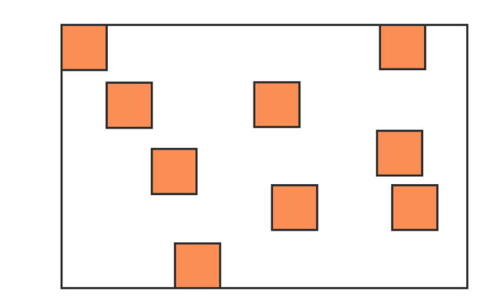

# 内存回收机制

> - 内存管理流程 
>   1. 分配你所需要的系统内存空间；
>   2. 使用分配到的内存进行读或者写等操作；
>   3. 不需要使用内存时，将其空间释放或者归还。
> - 内存回收机制只针对两种数据类型，`栈` 和`堆`。
> - 栈和堆的处理方式
>   1. 栈内存中的基本类型，可以通过操作系统直接处理。
>   2. 堆内存中的引用类型，正是由于可以经常变化，大小不固定，因此需要 JavaScript 的引擎通过垃圾回收机制来处理。

**注意 由于栈是操作系统处理的，我们无法去探究，我们探究Chrome 浏览器中JavaScript 的 V8 引擎。**

根据不同的操作系统（操作系统有 64 位和 32 位的）内存大小会不同，大的可以到 1.4G 的空间，小的只能到 0.7G 的空间。设置这么少的原因可能是。早些年由于 Web 应用都比较简单，其实并未考虑占据过多的内存空间；另外又由于被 V8 的垃圾回收机制所限制，比如清理大量的内存时会耗费很多时间，这样会引起 JavaScript 执行的线程被挂起，会影响当前执行的页面应用的性能，这些可能分配这么少的原因。

Chrome 的 JavaScript  V8 引擎将堆内存分为两类 新生代的回收机制和老生代的回收机制

## 新生代内存回收

新生代的内存回收的空间，在 64 位操作系统下分配为 32MB，正是因为新生代中的变量存活时间短，不太容易产生太大的内存压力，因此不够大也是可以理解的。首先系统会将分配给新生代的内存空间分为两部分 

`form`和 `to`

`to`是目前闲置的内存空间，`form`是程序中先会分配内存空间。当浏览器开始进行内存的垃圾回收时，JavaScript 的 V8 引擎会将`form`的对象检查一遍。如果引擎检测是存活对象，那么会复制到`to`的内存空间去；如果不是存活的对象，则直接进行系统回收。当所有`form`的内存里的对象没有了的时候，等再有新生代的对象产生时，上面的部分`form`和 `to`对调，这样来循环处理。

如果是顺序放置的那比较好处理，可以按照上面所说的处理方式。但是如果是下图这样零散的场景怎么处理呢？

通常情况下，由于堆内存是连续分配的，但是也有可能出现分散存放这种内存分配情况，这种零散的分配情况就造成了内存碎片，会影响比较大的内存对象的放置。是通过算法 Scavenge优化，它主要就是解决刚刚那张内存碎片的情况，在通过算法处理过后，内存中对象的排布都会变成有序排列方式。

## 老生代内存回收

新生代中的变量如果经过回收之后依然一直存在，那么就会被放入到老生代内存中。只要是已经经历过一次 Scavenge 算法回收的，就可以晋升为老生代内存的对象。就不能再用 Scavenge 的算法了。Scavenge 的算法是有其适用的场景，而对于内存空间比较大的，就不适合用 Scavenge 算法了。那么老生代内存中的垃圾回收，老生代内存回收采用了 Mark-Sweep（标记清除） 和 Mark-Compact（标记整理）的策略。

`标记清除（Mark-Sweep`

通过名字你就可以理解，标记清除分为两个阶段：标记阶段和清除阶段。

首先它会遍历堆上的所有的对象，分别对它们打上标记；然后在代码执行过程结束之后，对使用过的变量取消标记。那么没取消标记的就是没有使用过的变量，因此在清除阶段，就会把还有标记的进行整体清除，从而释放内存空间。

听起来这一切都比较完美，但是其实通过标记清除之后，还是会出现上面图中的内存碎片的问题。内存碎片多了之后，如果要新来一个较大的内存对象需要存储，会造成影响。对于通过标记清除产生的内存碎片，还是需要通过另外一种方式进行解决，因此这里就不得不提到标记整理策略（Mark-Compact）了。下面我们就来看看标记整理策略是如何帮助清除内存碎片的问题的。

`标记整理（Mark-Compact）`

经过标记清除策略调整之后，老生代的内存中因此产生了很多内存碎片，若不清理这些内存碎片，之后会对存储造成影响。

为了方便解决浏览器中的内存碎片问题，标记整理这个策略被提出。这个策略是在标记清除的基础上演进而来的，和标记清除来对比来看，标记整理添加了活动对象整理阶段，处理过程中会将所有的活动对象往一端靠拢，整体移动完成后，直接清理掉边界外的内存。

老生代内存的管理方式和新生代的内存管理方式区别还是比较大的。Scavenge 算法比较适合内存较小的情况处理；而对于老生代内存较大、变量较多的时候，还是需要采用“标记-清除”结合“标记-整理”这样的方式处理内存问题，并尽量避免内存碎片的产生。

## 内存泄漏与优化

内存泄漏是指 JavaScript 中，已经分配堆内存地址的对象由于长时间未释放或者无法释放，造成了长期占用内存，使内存浪费，最终会导致运行的应用响应速度变慢以及最终崩溃的情况。这种就是内存泄漏

- 过多的缓存未释放；

- 闭包太多未释放；

- 定时器或者回调太多未释放；

- 太多无效的 DOM 未释放；

- 全局变量太多未被发现。

  

  

  

  